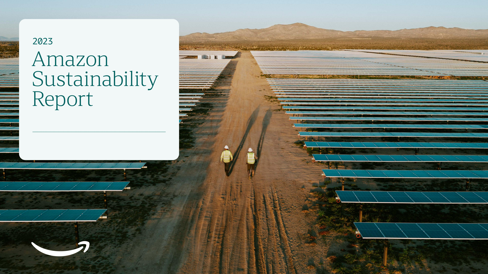

**Figure Description:**
The image is a photograph with an overlaid graphic design element that includes text and numbers. At the top left corner of the photo, there's a white rectangular box containing black text which reads "2023" followed by "Amazon Sustainability Report." Below this box, centered horizontally across the width of the image, is another line of text stating "AMAZON SUSTAINABILITY REPORT," also in black font against a light blue background. In the bottom right corner of the image, there's a small circular icon resembling a smiley face with a green checkmark through it, suggesting some form of certification or approval related to sustainability.

The main body of the image shows a large solar farm with rows of photovoltaic panels installed on flat ground. There are two individuals standing near the center of the image; one appears to be wearing a yellow vest, possibly indicating their role as workers at the site. They seem to be looking towards something out of frame, perhaps inspecting the installation or discussing work-related matters.

In the distance, beyond the solar farm, there is a vast desert landscape under a clear sky. Mountains can be seen in the far horizon, adding depth to the scene. The overall style of the image suggests a promotional or informational purpose, likely intended for use in a corporate report or environmental impact statement.

The Baldy Mesa Solar and Storage Project (developed and operated by AES), located in Adelanto, California.

# Contents

### **Overview**

- [Introduction](#page-2-0)
- [A Letter from Our Chief](#page-3-0)  Sustainability Officer
- [How We Work](#page-4-0)
- [Goals Summary](#page-5-0)
- [2023 Year in Review](#page-6-0)

### **[Environment](#page-7-0)**

- [Carbon](#page-8-0)
- [Carbon-Free Energy](#page-23-0)
- [Packaging](#page-28-0)
- [Waste and Circularity](#page-33-0)
- [Water](#page-39-0)

## **[Value Chain](#page-43-0)**

- [Human Rights](#page-44-0)
- [Responsible Supply Chain](#page-49-0)
- [Sustainable Products and](#page-57-0)  Materials
- [Supplier Diversity](#page-63-0)
- [Community Impact](#page-66-0)

## **[People](#page-73-0)**

- [Employee Experience](#page-74-0)
- [Health and Safety](#page-80-0)
- [Inclusive Experiences](#page-85-0)

# **[Appendix](#page-92-0)**

- [Sustainability Reporting Topic](#page-93-0)  Assessment
- [Endnotes](#page-94-0)
- [Assurance Statements](#page-95-0)
- [Disclaimer and Forward-Looking](#page-96-0)  Statements

**Figure Description:**
The image displays a stylized graphic with a dark blue background that features a white smiley face. The smiley face is composed of two curved lines forming an arc above a straight line below it, suggesting a simplified representation of a smiling mouth or lips. There are no visible texts or numbers within the image itself. The style appears to be minimalistic and modern, using only basic shapes for visual effect.

CSO Letter

How We Work

Goals Summary

2023 Year in Review

# Introduction

# **About Amazon**

Amazon is a global company with approximately
1.5 million full- and part-time employees worldwide and
operations in Africa, Asia-Pacific, Europe, Latin America, the
Middle East, and North America.

At Amazon, we combine data and science with passion and invention. We set big goals and work backward to achieve them, such as The Climate Pledge, our goal to reach netzero carbon emissions by 2040, 10 years ahead of the Paris Agreement. We apply that same tenacity to how we address some of the world's biggest environmental and societal challenges, striving to make every day better for our customers, employees, communities, and planet.

### How to Navigate This Report

Look for these symbols throughout the report:

- A link that directs you to a website
- ∃ A link within the report
- A link to a download

# About This Report

This is our sixth annual report detailing progress against our goals ∃ and environmental, social, and governance topics. All financial figures are reported in U.S. dollars (\$), unless otherwise stated. The data within this report reflects progress from January 1 through December 31, 2023, unless otherwise indicated. This report includes information about many business units and subsidiaries including AWS, Devices, Fresh, Whole Foods Market, Amazon Private Brands, Twitch, MGM Studios, and Ring.

Our 2023 Sustainability Report is structured into three main categories: Environment, Value Chain, and People. In the Environment 

section, we discuss scaling our work, partnering with others, and inventing new solutions to minimize our emissions, waste, and water use; increasing our use of carbon-free energy; and pioneering solutions to improve packaging, products, and the materials we use. In the Value Chain ∃ section, we discuss our commitment to respect the human rights of people connected to our global business, managing a responsible supply chain, creating sustainable products and using more sustainable materials, advancing supplier diversity, and having a positive impact on the communities where we operate. In the People  $\exists$  section, we discuss our ambition to be Earth's best employer and the safest place to work in our industries, including our focus on creating positive employee experiences, prioritizing health and safety, and building inclusive experiences.

## Framework Disclosures

In addition to this report, we share on our website our approach to sustainability governance and disclose our 2023 performance against reporting frameworks including the Sustainability Accounting Standards Board (SASB), the United Nations Sustainable Development Goals (SDGs), the Task Force on Climate-related Financial Disclosures (TCFD), and the United Nations Guiding Principles Reporting Framework (UNGPRF).

**Learn more** in our <u>2023 Sustainability Reporting</u> Framework Summary <u></u>⊌

**Figure Description:**
The image depicts a modern interior space with architectural features that include exposed ductwork, large windows allowing natural light to enter, and an open layout with multiple levels connected by staircases. On the upper level, there are people walking around, suggesting activity within the building. Below them is another level where individuals can be seen sitting at tables or standing near seating areas.

The design of the ceiling includes geometric shapes made from white fabric panels, which create a dynamic visual effect. These panels appear to be suspended from the structure above, contributing to the contemporary aesthetic of the space. There are also hanging pendant lights providing illumination throughout the area.

In terms of numeric values, it's not possible for me to provide specific numbers as I am unable to count objects directly from text descriptions. However, if you have any questions about the relative positions of elements within the image, such as the number of steps in a staircase or the size of furniture pieces, feel free to ask!

Employees inside one of our newest office buildings in Bellevue, Washington.

**Figure Description:**
The image displays a stylized graphic of a smiley face with an open mouth forming a curve that resembles a smile or laugh. The color scheme is minimalistic, using shades of green against a white background. There are no visible texts or numbers within the image itself. The style appears to be modern and simplified, likely intended for branding or as part of a logo design. The overall impression is one of positivity and happiness conveyed through the use of a smiling face.

[Introduction](#page-2-0) CSO Letter [How We Work](#page-4-0) [Goals Summary](#page-5-0) [2023 Year in Review](#page-6-0)

# A Letter from Our Chief Sustainability Officer

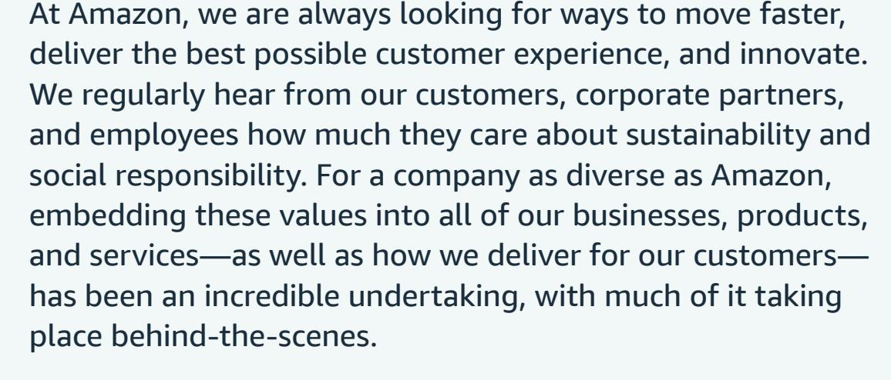

**Figure Description:**
The image is a digital text graphic with a plain white background and black text. It contains a quote from Amazon that reads: "At Amazon, we are always looking for ways to move faster, deliver the best possible customer experience, and innovate." Below the main quote, there's an additional statement emphasizing social responsibility: "We regularly hear from our customers, corporate partners, and employees how much they care about sustainability and social responsibility. For a company as diverse as Amazon, embedding these values into all of our businesses, products, and services—as well as how we deliver for our customers—has been an incredible undertaking, with much of it taking place behind-the-scenes." This suggests that Amazon places significant importance on its environmental impact and ethical practices within its operations. There are no numerical values or specific data points provided in the image.

Progress is likely easiest to spot in our Stores business. Our customers let us know that their Amazon packages are now arriving at their doorsteps faster, with less packaging, and delivered by more electric delivery vehicles than ever before. By regionalizing our operations and transportation networks in the U.S., we can now deliver items faster and at lower costs. This also allows us to minimize or avoid extra packaging altogether, while reducing the distance a package has to travel, cutting back on the carbon emissions associated with deliveries.

We also know our customers look to Amazon to be a leader among our peers. On renewable energy, we set an ambitious goal to match 100% of the electricity consumed by our global operations with renewable energy by 2030, and we reached that goal in 2023—seven years early. As we look to the future, we are steadfast in our Climate Pledge commitment to be net-zero carbon across our operations by 2040. We will continue to lead and invest in creating carbon-free energy around the world at scale, including through solar, wind, nuclear, and other emerging energy technologies. Our progress toward a net-zero carbon business will not be linear, and each year as our various businesses grow and evolve, we will produce different results. These results will be influenced by significant changes to our business, investments in growth, and

meeting the needs of our customers. Through it all, we will remain steadfast as we invent, adapt, and will our way to meeting our commitment to The Climate Pledge.

We know that driving change means staying focused on bringing entire industries along with us. Over the past five years, we've done this by encouraging companies to join The Climate Pledge—and we're proud that over 500 have joined us and committed to be net-zero carbon 10 years ahead of the Paris Agreement. But we wanted to do more. Most recently, our sustainability team has been developing resources to share our expertise and help our suppliers build, measure, and act on their sustainability commitments. That's why we've launched the Amazon Sustainability Exchange, a free sustainability resource center that contains a number of Amazon's previously proprietary playbooks, templates, case studies, and science models, among other sustainability best practices.

Looking ahead, we know our customers look to us to be at the cutting edge of new and growing technologies and enable them for good. We're already deploying artificial intelligence (AI) in ways that benefit our customers directly, such as using it to right-size packaging and avoid waste. We're exploring a growing number of AI applications whether it's monitoring and optimizing our energy use or helping combat deforestation in Brazil. We also see an opportunity to use AI to address sustainability challenges at an unprecedented scale, all while delivering new solutions for our customers. Much work remains, and we're excited that Amazon is uniquely positioned to figure out how AI can help us address climate change in a more efficient and responsible way.

Most importantly, we need to continue to invest in talent and hire employees who can lead on sustainability. We're proud

of the wide range of sustainability-focused career paths we offer at Amazon, including engineers, scientists, content creators, building architects, and more. And for those whose jobs aren't directly within a sustainability field, we offer upskilling programs and affinity groups where our employees can learn more and get involved. It's thanks to the thousands of professionals working behind-the-scenes across Amazon that we are able to bring all of this amazing work to life.

I'm proud of the work that's underway, and truly excited for what's to come.

With gratitude,

**Kara Hurst**

Chief Sustainability Officer

**Figure Description:**
The image is a portrait of a woman smiling at the camera. She has long brown hair that falls over her shoulders. Her eyes are looking directly into the lens, suggesting she is posing for the photograph. She wears a black top with a necklace featuring multiple small stones or beads around her neck. There's no visible text within the image itself.

The background appears to be a dark curtain, which provides a contrasting backdrop to the subject. On either side of the image, there are two rectangles containing numerical values: "10" on the left and "25" on the right. These numbers could potentially represent ratings, scores, or some other form of quantitative data related to the content of the photo or an associated context. However, without additional information, it is not possible to determine their exact meaning from the image alone.

**Figure Description:**
The image displays a stylized graphic of a smiley face with an abstract design that resembles a smiling mouth or lips. The color scheme is minimalistic, featuring shades of green against a white background. There are no visible texts or numbers within the image itself. The style appears to be modern and simplistic, likely intended for branding or logo purposes due to its clean lines and limited colors.

[Introduction](#page-2-0) [CSO Letter](#page-3-0) How We Work [Goals Summary](#page-5-0) [2023 Year in Review](#page-6-0)

# How We Work How We Work

# Our Mission To make customers' lives better and easier every day.

# Our Business

We are committed to addressing sustainability at every stage of our value chain.

## Our Operations

We offer products and services—both Amazon-branded and from many other brands and third-party sellers—in our Amazon stores, leveraging advanced transportation logistics to deliver globally. We also create entertainment content and, through AWS, provide the world's most widely adopted and comprehensive cloud offering.

## Our Supply Chain

We procure materials, commodities, components, finished goods, and services from a complex supplier network. We engage suppliers globally to align our expectations for respecting human rights; maintaining safe, inclusive workplaces; and promoting sustainable practices.

The approximately 1.5 million people in Amazon's global workforce are the key behind our successes—from enabling global fulfillment to delivering on sustainability initiatives. To support them in advancing their own career goals, we offer competitive pay and benefits, upskilling and educational programs, and a workplace that promotes inclusion and diversity. Additionally, we use independent contractors and temporary personnel to supplement our workforce.

### Our Employees Our Communities Our Customers

Amazon has a presence in communities around the world. We seek to be a good neighbor wherever we operate and to support local people and charitable organizations that meet on-the-ground needs. In particular, we leverage our scale, resources, and expertise to address issues where we can have the greatest impact—namely affordable housing, education, disaster relief, and food security.

We continually seek new and better ways to serve customers, offering lower prices, more convenient services, and a larger selection of more sustainable products. We also help customers advance their businesses and enable digital transformation through AWS, content development services, and advertising options. In addition, we support small businesses with access to Amazon's tools, resources, and network, helping them reach customers around the world.

# Our Reporting Topics

We include a number of topics in our reporting. We view these topics as interconnected and recognize that our progress in one area can often help address challenges in another.

Carbon Carbon-Free Energy Packaging Waste and Circularity Water

Human Rights

Responsible Supply Chain

Sustainable Products and Materials Community Impact

Supplier Diversity Employee Experience Health and Safety Inclusive Experiences

**Figure Description:**
The image displays a stylized graphic of a smiley face with a curved line forming its mouth. The color scheme consists mainly of shades of green and blue, which are commonly associated with nature or environmental themes. There is no text present within the image to provide additional context or information about specific products or services related to these colors. The style of the image appears to be simplistic and iconographic, potentially representing happiness, positivity, or a friendly brand identity. However, without further context, it's difficult to determine the exact meaning or purpose behind the design.

Making progress Achieved Did not meet

[Introduction](#page-2-0) [CSO Letter](#page-3-0) [How We Work](#page-4-0) Goals Summary [2023 Year in Review](#page-6-0)

# Goals Summary

| Goal                                                                                                                                                 | 2022 Progress                           | 2023 Progress                                                                                                               | Status |
|------------------------------------------------------------------------------------------------------------------------------------------------------|-----------------------------------------|-----------------------------------------------------------------------------------------------------------------------------|--------|
| Carbon                                                                                                                                               |                                         |                                                                                                                             |        |
| Reach net-zero carbon emissions by 2040                                                                                                              | 70.74M metric tons CO2e*                | 68.82M metric tons CO2e                                                                                                     |        |
|                                                                                                                                                      | 93.0 g CO2e/\$GMS†                      | 80.8 g CO2e/\$GMS                                                                                                           |        |
| Through The Climate Pledge, inspire and empower others to join us on a mission to reach net-zero carbon emissions by 2040                      | 396 signatories                         | 473 signatories                                                                                                             |        |
| At least 100,000 electric delivery vans on the road by 2030, from Rivian and other manufacturers                                                  | 2.6K+ electric delivery vans            | 19K+ electric delivery vans                                                                                                 |        |
| Deploy 10,000 electric vehicles (EVs) in India by 2025                                                                                               | 3.8K+ EVs deployed                      | 7.2K+ EVs deployed                                                                                                          |        |
| Carbon-Free Energy                                                                                                                                   |                                         |                                                                                                                             |        |
| Match 100% of the electricity consumed by our global operations with renewable energy by 2025— five years ahead of our original target of 2030 | 90% matched                             | 100% matched                                                                                                                |        |
| Invest in wind and solar capacity equal to the energy used by all active Echo, Fire TV, and Ring devices worldwide by 2025‡                    | 100% capacity procured                  | Achieved in 2022                                                                                                            |        |
| Waste and Circularity                                                                                                                                |                                         |                                                                                                                             |        |
| Reduce food waste by 50% across U.S. and Europe operations by 2030                                                                                | 82M meals donated globally              | 75% reduction in food waste intensity in Europe operations and 28% in U.S. operations compared to a 2021 baseline§ |        |
| Water                                                                                                                                                |                                         |                                                                                                                             |        |
| AWS will be water positive by 2030                                                                                                                   | Goal set in 2022                        | 41% progress toward meeting its water positive goal#                                                                     |        |
| Packaging                                                                                                                                            |                                         |                                                                                                                             |        |
| Make Amazon device packaging 100% recyclable by 2023                                                                                              | Achieved for 79% of product launches | Achieved for 90% of product launches                                                                                     |        |

|  |  | * Carbon dioxide equivalent. |  |
|--|--|------------------------------|--|
|--|--|------------------------------|--|

† Grams of carbon dioxide equivalent per dollar of gross merchandise sales.

| Goal                                                                                                                                               | 2022 Progress                                          | 2023 Progress                                           | Status |
|----------------------------------------------------------------------------------------------------------------------------------------------------|--------------------------------------------------------|---------------------------------------------------------|--------|
| Employee Experience                                                                                                                                |                                                        |                                                         |        |
| Invest \$1.2 billion to upskill over 300,000 U.S. Amazon employees by 2025                                                                      | 110K employees upskilled**                             | 358K+ employees upskilled                               |        |
| Inclusive Experiences                                                                                                                              |                                                        |                                                         |        |
| Hire 100,000 U.S. military veterans and military spouses through 2024                                                                           | 78.5K veterans and spouses hired††                  | 100K+ veterans and spouses hired‡ ‡                  |        |
| Conduct a racial equity audit to evaluate the impacts of our policies, programs, and practices on hourly operations employees                | Goal set in 2022                                       | On track to be completed in 2024                     |        |
| Hire at least 5,000 refugees in the U.S. by the end of 2024                                                                                     | Goal set in 2022                                       | ~18K refugees hired in the U.S.                      |        |
| Provide training for 10,000 Ukrainians globally through the AWS program ITSkills4U by 2024                                                      | Goal set in 2022                                       | ~16.5K Ukrainians received training                  |        |
| Community Impact                                                                                                                                   |                                                        |                                                         |        |
| Invest \$2 billion to create and preserve more than 20,000 affordable homes through 2025                                                        | \$1.6B committed and 11K homes created or preserved | \$1.8B committed and ~16K homes created or preserved |        |
| Distribute up to \$60 million in AWS cloud computing credits to support organizations promoting health equity globally by the end of 2024§ § | \$14M+ in cloud computing credits distributed       | \$32M+ in cloud computing credits distributed        |        |
| Help 29 million people globally grow their technical skills by providing free cloud computing skills training by 2025                        | 13M people helped                                      | 21M people helped                                       |        |
| Provide free artificial intelligence (AI) skills training to 2 million people globally by 2025                                                  | —                                                      | Goal set in 2023                                        |        |

**Figure Description:**
The image displays a stylized graphic of a smiley face with an upward-curving line representing a smile. The color scheme consists mainly of shades of green and blue, creating a calm and serene impression. There are no visible texts or numbers within the image itself. The style is minimalistic and appears to be designed for branding or as part of a logo due to its simple yet recognizable shape.

‡ To understand what this goal should encompass, we model and measure the energy consumed by our devices in different types of use, then project their total average global annual electricity consumption.

§ Food waste intensity is a measure of food waste as a percentage of total food handled by weight.

# Water positive means AWS will return more water to communities than it uses in its direct operations. A number below 100% indicates AWS is still working to meet the water positive goal.

\*\* In 2022, we reported progress for the Career Choice program in the U.S. In 2023, we expanded our reporting to include all in-scope upskilling programs in the U.S.

† † Progress from July 2021 through December 2022.

‡ ‡ Goal achieved in January 2024. Progress from July 2021 through January 2024.

§ § In January 2024, AWS announced an additional \$20 million in funding for the Health Equity Initiative, bringing the company's total commitment to \$60 million in cloud credits.

[Introduction](#page-2-0) [CSO Letter](#page-3-0) [How We Work](#page-4-0) [Goals Summary](#page-5-0) 2023 Year in Review

# 2023 Year in Review

As we reflect on 2023, we are proud of the progress we made. We worked hard to reduce our environmental footprint, drive progress throughout our value chain, and create a safer, more inclusive place for people to work.

# Environment

3%

Reduction in absolute carbon emissions

13%

Decrease in carbon intensity

# 680M

Packages delivered using more than 24,000 electric delivery vehicles globally

9%

Decrease in average single-use plastic packaging weight per shipment across Amazon's global operations network

100%

Of electricity consumed by Amazon matched with renewable energy sources, up from 90% in 2022

77

New signatories of The Climate Pledge, bringing the total to 473

#1 Largest corporate purchaser of renewable energy in the world for the fourth year in a row, according to BloombergNEF

12% Of packages globally shipped without additional Amazon packaging as part of our Ships in Product Packaging program

75%

Reduction in food waste intensity—a measure of food waste as a percentage of total food handled by weight—in Europe operations and 28% reduction in U.S. operations compared to a 2021 baseline

41%

Of the way toward meeting our AWS water positive goal to return more water to the communities where AWS operates than is used in direct operations

# Value Chain People

3K

Assessments of suppliers of Amazon-branded products on their social and environmental performance

1.16B

Items sold that are recognized by certifications in our Climate Pledge Friendly program, a 42% increase from 2022

# \$20M

Catalyzed by founding members of U.S. Agency for International Development (USAID)'s Climate Gender Equity Fund, a public-private partnership that leverages funding to scale climate finance that advances gender-equitable climate action

\$4.3B

Spent with more than 500 certified U.S. Tier 1 diverse suppliers—certified diverse businesses that provide goods and services directly to Amazon to operate our businesses

# Nearly

16K Affordable homes created or preserved and nearly 35,000 residents supported through the

\$16.8M

Housing Equity Fund

In cloud computing credits distributed to 125 organizations globally to promote equal access to health resources, totaling more than \$32 million distributed to 229 organizations since 2021

358K+

U.S. employees have participated in upskilling programs since we announced our Upskilling Pledge in 2019

Amazon employees from 51 countries participated in our second Global Month of Volunteering

30%

76K

Improvement in global Recordable Incident Rate in 2023 versus 2019

60%

Improvement in global Lost Time Incident Rate in 2023 versus 2019

# 20K

Military veterans and military spouses hired in 2023, totaling over 100,000 hired through January 2024

\$1.3B

Invested toward pay increases for customer fulfillment and transportation employees in the U.S., bringing the average pay for those roles to over \$20.50 per hour

Nearly

16.5K

Ukrainians globally, including refugees, received training through the AWS program ITSkills4U by the end of 2023

**Figure Description:**
The image displays a simple graphic consisting of two curved lines forming an abstract smiley face shape. One line is green with a slight curve at one end, while the other line is blue with a similar curvature but without any color variation. There are no texts or additional elements present within the image. The style appears to be minimalistic and iconographic, commonly used for logos or branding due to its simplicity and universally recognizable nature.

# Environment

At Amazon, we combine data and science with passion and invention to drive everything we do. We are committed to and invested in sustainability because it's a win all around—it's good for the planet, for business, for our customers, and for our communities. We set big goals and work backward to achieve them. We are working to innovate and scale solutions that minimize our emissions, waste, and water usage; increase our use of carbon-free energy; and pioneer new approaches for packaging, materials, and products..

### **In This Section**

- 9 [Carbon](#page-8-0)
- 24 [Carbon-Free Energy](#page-23-0)
- 29 [Packaging](#page-28-0)
- 34 [Waste and Circularity](#page-33-0)
- 40 [Water](#page-39-0)

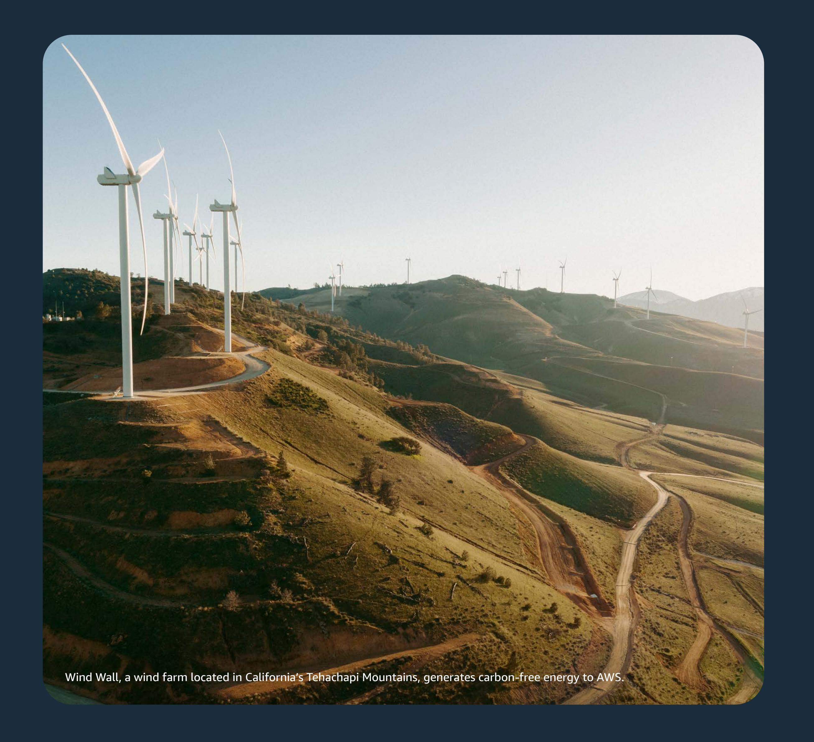

**Figure Description:**
The image depicts a wind farm situated atop a hill or mountain range with rolling green hills below it. There are multiple white wind turbines visible against a clear sky. In the foreground, there is text overlaying the image that provides information about the location of the wind farm: "Wind Wall, a wind farm located in California's Tehachapi Mountains." Below this description, additional context is provided stating, "Generates carbon-free energy to AWS." This suggests that the wind farm generates electricity for Amazon Web Services (AWS), which is known for its commitment to renewable energy sources. The overall style of the image appears to be a promotional or informational graphic designed to highlight the environmental benefits of using wind power as an alternative to fossil fuels.

**Figure Description:**
The image displays a stylized graphic of a smiley face with a curved line for the mouth and two straight lines forming the eyes. The background is solid dark blue. There are no visible texts or numbers within the image that provide additional context or information about its content. The style of the image appears to be minimalistic and modern, using simple shapes and colors to convey the subject matter.

# Carbon

The science is clear. Significant carbon emission reductions are required to avoid the most severe effects of climate change, restore biodiversity, protect vulnerable communities, and ensure a habitable planet for future generations. Climate change also has the potential to disrupt global supply chains and change the ways businesses operate today. We have an opportunity—and responsibility—to use our size, scale, and resources to do our part to solve global challenges. In 2019, we co-founded and committed to The Climate Pledge—our goal to reach net-zero carbon emissions by 2040, 10 years ahead of the Paris Agreement. We are continually working to reduce emissions throughout our business, as well as partnering across our supply chain and the industries in which we operate to share and scale what we've learned.

### Goal

Reach net-zero carbon emissions by 2040— 10 years ahead of the Paris Agreement

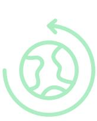

**Figure Description:**
The image displays a stylized graphic of a globe with two arrows forming a loop around it. The arrowheads are green, suggesting movement or directionality. There is no text present within the image to provide additional context or information. The style of the image appears to be simplistic and iconographic, commonly used for educational purposes or as part of an infographic to convey concepts related to global connectivity, travel routes, or environmental impact. However, without more specific details, it's difficult to determine the exact meaning behind these elements.

3%

Reduction in absolute carbon emissions since 2022

13%

Decrease in carbon intensity since 2022

### Goal

At least 100,000 electric delivery vans on the road by 2030, from Rivian and other manufacturers

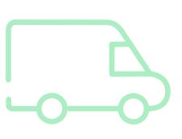

**Figure Description:**
The image displays a simple line drawing of a vehicle that resembles a van or truck with two visible wheels at its front end. The style is minimalistic and uses only green lines to define the shape of the vehicle against a white background. There are no texts present within the image. The design appears to be iconographic rather than realistic, suggesting it could be used for various purposes such as signage, logos, or digital interfaces where visual representation of vehicles is needed without detailed realism.

19K+

Electric vans deployed in the U.S., Europe, and India

**Figure Description:**
The image displays a graphic with two numerical values: "19" and "+". These numbers are presented against a background that appears to be teal or turquoise in color. The number "19" is larger than the plus sign, which suggests it may be more significant or important within the context of the image. However, without additional information, it's not possible to determine exactly what these numbers represent. They could be part of an advertisement, a scoreboard, a financial statement, or any other type of data presentation. The style of the image is simple and straightforward, using bold font for emphasis.

100K

### Goal

Deploy 10,000 electric vehicles (EVs) in India by 2025

7.2K+

EVs deployed in India

**7.2K+**

10K

### Goal

Inspire and empower others to sign The Climate Pledge and join us on a mission to reach net-zero carbon emissions by 2040

473

Signatories, up from 396 in 2022

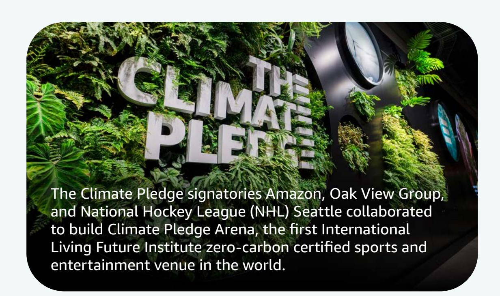

**Figure Description:**
The image is a promotional graphic for an event or initiative related to climate change mitigation. At the center of the image, there's a large sign that reads "THE CLIMATE PLEDGE" with the word "CLIMATE" being significantly larger than the other words. Below this main text, additional information states: "The Climate Pledge signatories Amazon, Oak View Group, and National Hockey League (NHL) Seattle collaborated to build Climate Pledge Arena, the first International Living Future Institute zero-carbon certified sports and entertainment venue in the world." This suggests that the signatories mentioned are involved in building a new arena that aims to be environmentally sustainable by achieving net-zero carbon emissions. The phrase "Living Future Institute" refers to an organization known for promoting green buildings and communities. The overall style of the image appears modern and eco-friendly, aligning with the theme of sustainability. There are also decorative elements such as plants and clocks around the central sign, which contribute to the environmental focus of the message.

# Actions

**Figure Description:**
The image displays a stylized graphic of an electric light bulb with its filament glowing brightly against a white background. To the right of the bulb is a green outline that forms a simplified representation of rays or beams emanating from it. There are no visible texts within the image. The style of the image appears to be minimalistic and iconographic, commonly used for visual representations of ideas such as innovation, creativity, or inspiration. The use of color (green) could suggest environmental consciousness or energy efficiency, but without additional context, these interpretations remain speculative.

100%

Of electricity consumed by Amazon was matched with renewable energy sources, up from 90% in 2022

 Up to

50%

More energy efficiency and up to 40% in cost savings with Inferentia2 chips over other comparable Amazon Elastic Compute Cloud (EC2) chips

24K+

EVs globally, including over 11,800 in the U.S., over 7,200 in India, and over 3,000 in Europe

680M

Packages delivered by EVs globally

200M

Boxes and 226,000 metric tons of carbon dioxide equivalent (CO2e) avoided with Amazon Day delivery—a shipping option whereby Prime members choose a specific day of the week to receive orders up from nearly 115 million boxes in 2022

**Figure Description:**
The image displays a stylized graphic of a smiley face with an upward-curving line for the mouth, suggesting happiness or positivity. To the right of the smiley face is a curved arrow pointing upwards to the left, which typically symbolizes progression or improvement. There are no visible texts within the image that provide additional context or information about the numeric values mentioned. The style of the image appears to be simple and iconographic, commonly used in various forms of media such as websites, presentations, or social media platforms to convey positive emotions or messages related to success, growth, or satisfaction.

# Our Approach

At Amazon, we think long term, take on grand challenges, and invent solutions to complex problems. These are some of the reasons we co-founded and committed to The Climate Pledge in 2019—our goal to reach net-zero carbon emissions by 2040, 10 years ahead of the Paris Agreement—and have invited hundreds of companies to join us.

Amazon has a variety of businesses touching many sectors, some of which rely on carbon-intensive industries to provide critical goods and services to our customers. However, we believe the complexity of our business puts us in a unique position to be a leader in decarbonization strategies. We have an opportunity to demonstrate how achieving netzero carbon emissions is possible across many sectors, while creating solutions that benefit our business as well as the industries in which we operate.

Foundationally, our strategy relies on embedding decarbonization initiatives and efficiency improvements across our business. Our comprehensive approach to reducing and avoiding carbon emissions focuses on key sectors of our business, including delivery and logistics; building construction and operations; servers and hardware; grocery, products, and devices; and packaging. Teams across Amazon are accountable for setting decarbonization plans that map back to Amazon's worldwide strategy because ownership and accountability are critical to operational success and managing complexity. We focus on four crosscutting initiatives to decarbonize our business:

**• We focus first on driving efficiency** across our operations to reduce and avoid emissions at scale. This includes improving transportation routing, increasing pack and fill rates, improving cloud-computing chip efficiency, adding Low Power Mode to devices, and installing energy-efficient lighting and HVAC solutions in buildings.

- **• We select lower-carbon alternatives,** such as lowercarbon concrete and steel in construction, and loweremission fuels and vehicles in transportation. We use these alternatives where possible, based on a number of factors including cost, emissions reduction potential, and availability.
- **• We're transitioning toward carbon-free electricity,** investing in renewables—rooftop solar installations on our buildings, and new, utility-scale wind and solar projects—as well as other carbon-free electricity sources, such as nuclear.
- **• We engage with suppliers** to help reduce emissions from activities beyond our direct operations. We encourage them to set credible decarbonization goals, publicly share progress, and implement carbon reduction strategies throughout their operations and supply chains—and we are providing support to help our supply chain take acti[on.](#page-94-0)1

In addition to decarbonizing our own business, we are helping drive progress across industries. To do this, we focus on three accelerators:

- **• We invest in breakthrough technology** by adopting ready-to-scale solutions, as well as evaluating and investing in emerging technologies that can help address emissions from hard-to-abate sectors including aviation, shipping, and building construction. Through direct funding, we aim to advance our own progress toward net-zero carbon emissions and help accelerate the widespread adoption of new technologies by making them more affordable and accessible.
- **• We support policies that drive decarbonization.**  Amazon works with policymakers, governments, nongovernmental organizations (NGOs), industry associations, coalitions, and other partners on numerous

- regulatory and policy issues. We seek to advance and incentivize decarbonization by supporting policies that scale lower-emission fuels, drive lower-emission vehicle deployment and infrastructure, advance the deployment of carbon-free energy, modernize the grid, and accelerate investments in clean technologies.
- **• We catalyze industry action.** Through The Climate Pledge, Amazon brings together companies from around the world to drive collective action, cross-

sector collaboration, and engagement in initiatives that encourage industry action toward decarbonization.

In parallel to reducing and avoiding emissions throughout our business, we are also investing in carbon neutralization through additional, quantifiable, real, permanent, and socially beneficial offsets. As part of this effort, we are engaging in science-led collaborations to build credible neutralization initiatives that can be deployed at scale in the future.

**Figure Description:**
The image is a collage of various photographs arranged within a grid format against a dark teal background with lighter blue borders. Each photograph has its own unique content but shares a common theme related to renewable energy or environmental topics. Here's a description of each photo:

1. Top left: A black car driving down a road at nighttime. There are no visible numbers or specific details that provide additional context about this image.
2. Top right: An abstract design featuring geometric shapes and lines, predominantly white and light gray colors, set against a darker teal backdrop. This does not contain any numeric values.
3. Middle top: A clear sky during sunset or sunrise, with wind turbines silhouetted against it. The number "9" appears prominently in the center of this image, suggesting some form of significance for this particular photo. However, without further information, the meaning behind the "9" remains unclear.
4. Middle bottom: Smoke rising from an area covered by fog, which could be indicative of pollution or industrial activity. No numeric values are present here.
5. Bottom left: A close-up view of a person holding a brown paper bag with text that includes recycling symbols and possibly a brand name, although the full text is obscured. There are no numeric values associated with this image.
6. Bottom middle: A series of three green triangles increasing in size from left to right, resembling a minimalist representation of growth or progression. Below these triangles, there are four blue circles decreasing in size from left to right, mirroring the pattern above them. These images do not contain any numeric values.
7. Bottom right: Three stylized representations of trees in varying shades of green, positioned vertically next to each other. At the bottom of this image, there are two blue rectangles, one larger than the other, both containing a single dot inside them. Again, no numeric values are present here.

The overall style of the image suggests a focus on sustainability, clean energy, and environmental themes, as indicated by the presence of wind turbines and the use of natural elements like smoke, trees, and water (implied by the color scheme). The inclusion of numeric values ("9") in one of the photos adds a layer of intrigue, inviting viewers to speculate on their possible meanings. Without additional context, however, the exact interpretation of these numerical values remains open to individual perception.

[Watch](https://sustainability.aboutamazon.com/2023-report#carbon) how we embed sustainability initiatives throughout all aspects of our business.

**Figure Description:**
The image displays a stylized graphic of a smiley face with an open mouth forming a curve that resembles a smile or laugh. The color scheme consists mainly of green tones, which are used to fill both the smiling mouth area and the outline of the entire figure. There is no text present within the image. The style appears to be simplistic and iconographic, potentially representing happiness or positivity. However, without additional context, it's difficult to determine if there is any specific meaning associated with these colors or shapes.

# Our Progress

# Amazon's Carbon Footprint

In 2023, our absolute carbon emissions decreased by 3[%.2](#page-94-0) This overall decrease was driven by an 11% reduction in emissions from electricity (Scope 2) and a 5% decrease in indirect and supply chain emissions (Scope 3). We had a 7% increase in emissions from our direct operations (Scope 1), primarily from the use of transportation fuels. Our carbon intensity decreased for the fifth consecutive year, down 13% from 2022 to 202[3.3 T](#page-94-0)his metric demonstrates how we are working to decouple emissions growth from business growth.

Every year, we aim to serve our customers better, more quickly, and with fewer emissions, but we know our progress may not be linear as our business continues to grow. In 2023, we invested in carbon abatement projects across Amazon. We continue to invent, think long term, and place big bets to accelerate decarbonization efforts year over year. In addition to our direct investment and work to decarbonize our business, we also worked with organizations throughout our supply chain and broader industry to reduce and avoid emissions and create solutions to help decarbonize our value chain. Annually, we also improve our science and data-driven approach to track and measure decarbonization across Amazon.

## Scope 1: Direct Emissions and Operations

Amazon's Scope 1 emissions are primarily generated from the fuel used by our transportation and logistics fleet to deliver packages to customers. In 2023, our Scope 1 emissions increased 7% compared to 2022 and represented 21% of our total carbon footprint. This change was due to an increase in the number of packages delivered by Amazon Logistics versus third-party transportation providers, as well as overall business growth.

| Amazon's Carbon Footprint                                                                                                                                                     |       |       |       |       | 2022 Carbon Footprint recalculated in accordance with updated Carbon Methodology. |      |
|-------------------------------------------------------------------------------------------------------------------------------------------------------------------------------|-------|-------|-------|-------|-----------------------------------------------------------------------------------------|------|
| Carbon Intensity                                                                                                                                                              | 2019  | 2020  | 2021  | 2022  | 2023                                                                                    | YoY% |
| Carbon Intensity (grams of CO2e per \$ of gross merchandise sales)                                                                                                            | 122.8 | 102.7 | 100.8 | 93.0  | 80.8                                                                                    | -13% |
| Emissions Category (MMT CO2e)                                                                                                                                                 |       |       |       |       |                                                                                         |      |
| Emissions from Direct Operations (Scope 1)                                                                                                                                    | 5.76  | 9.62  | 12.11 | 13.32 | 14.27                                                                                   | 7%   |
| Fossil fuels                                                                                                                                                                  | 5.57  | 9.37  | 11.89 | 12.96 | 14.00                                                                                   | 8%   |
| Refrigerants                                                                                                                                                                  | 0.19  | 0.25  | 0.22  | 0.36  | 0.27                                                                                    | -25% |
| Emissions from Purchased Electricity (Scope 2)*                                                                                                                               | 5.50  | 5.27  | 4.07  | 3.14  | 2.79                                                                                    | -11% |
| Emissions from Indirect Sources (Scope 3)*                                                                                                                                    | 39.91 | 45.75 | 55.36 | 54.28 | 51.76                                                                                   | -5%  |
| Corporate purchases and Amazon-branded product emissions (e.g., operating expenses, business travel, and Amazon-branded product manufacturing, use phase, and end-of-life) | 15.41 | 16.70 | 19.09 | 19.72 | 19.11                                                                                   | -3%  |
| Capital goods (e.g., building construction, servers and other hardware, equipment, vehicles)                                                                                  | 8.01  | 10.52 | 15.37 | 10.25 | 8.95                                                                                    | -13% |
| Other indirect emissions (e.g., third-party transportation, packaging, upstream energy-related)                                                                               | 12.44 | 15.77 | 18.00 | 20.90 | 20.07                                                                                   | -4%  |
| Lifecycle emissions from customer trips to Amazon's physical stores                                                                                                           | 4.05  | 2.77  | 2.91  | 3.41  | 3.63                                                                                    | 7%   |
| Amazon's Carbon Footprint                                                                                                                                                     | 51.17 | 60.64 | 71.54 | 70.74 | 68.82                                                                                   | -3%  |
| Greenhouse Gas Protocol Aligned Scope 3 Categories                                                                                                                            |       |       |       | 2022  | 2023                                                                                    |      |
| Purchased Goods and Services (Amazon corporate purchases made for Amazon's operations and services, Amazon-branded products)                                                  |       |       |       | 20.60 | 19.86                                                                                   |      |
| Capital Goods                                                                                                                                                                 |       |       |       | 10.25 | 8.95                                                                                    |      |
| Fuel- and Energy-Related Activities                                                                                                                                           |       |       |       |       | 4.97                                                                                    |      |
| Upstream Transportation and Distribution                                                                                                                                      |       |       |       |       | 9.30                                                                                    |      |
| Business Travel                                                                                                                                                               |       |       |       | 0.61  | 0.63                                                                                    |      |
| Employee Commuting                                                                                                                                                            |       |       |       | 2.78  | 2.88                                                                                    |      |
| Downstream Transportation and Distribution                                                                                                                                    |       |       |       |       | 3.63                                                                                    |      |
| Use of Sold Products (Amazon Devices)                                                                                                                                         |       |       |       | 1.18  | 1.50                                                                                    |      |
| End-of-Life Treatment of Sold Products (Amazon Devices)                                                                                                                       |       |       |       | 0.04  | 0.04                                                                                    |      |

**Learn more** about what's included in Amazon's carbon footprint in our [Carbon Methodology](https://sustainability.aboutamazon.com/carbon-methodology.pdf) \* Scope 2 and 3 carbon emissions are calculated using a market-based method.

**Figure Description:**
The image displays a stylized graphic of a smiley face with an upward-curving line representing a smile. The color scheme consists mainly of green tones, which are used to fill the shape of the smiley face. There is no text present within the image. The style appears to be simplistic and modern, using minimal lines and shapes to convey its subject matter. It's likely that this image could be associated with branding or as part of a logo due to its clean design and recognizable symbolism. However, without additional context, it's not possible to determine the exact meaning or purpose behind this particular representation.

In 2023, our net sales grew 12% and more than two-thirds of Amazon packages were delivered via Amazon's own logistics network. We decreased emissions per package through operational efficiencies, such as improving truck fill rates (the percentage of truck volume that is utilized), shipping products in their own packaging without additional Amazon packaging, and using artificial intelligence (AI) to optimize packaging types. For example, Amazon data scientists trained an AI model to understand a variety of product attributes, including an item's shape and durability, and to analyze customer feedback on how different packaging options have performed. The model is constantly learning and has helped reduce our use of packaging material since it launched in 2019.

We strive to keep our packaging lightweight and minimal, while ensuring products reach customers without damage. Lighter, more flexible, and right-sized packaging helps reduce delivery emissions per package by using less material and taking up less space in delivery vehicles. Since 2015, we have reduced the average per-shipment packaging weight by 43% and avoided more than 3 million metric tons of packaging, including more than 446,000 metric tons in 2023 alon[e.4](#page-94-0) Globally, we shipped 12% of products in their own packaging in 2023. This provides a better customer experience by minimizing the packaging materials used for delivery, and avoids incremental carbon emissions associated with additional materials and weight.

### **Learn more** about how we're [improving packaging](#page-28-0)

As the number of products we deliver has continued to increase, we aim to keep improving the efficiency of the routes our trucks drive. For example, to get packages to customers faster and with fewer emissions, we reorganized our U.S. transportation network from one national network to eight strategic regions in 2023. Regionalization helped us avoid driving nearly 16 million miles last year. We also prioritized shipping products by lower-carbon train and sea routes—instead of trucking—for middle mile deliveries in Europe. We are excited to invest in technologies today that will help reduce our footprint in the future, such as scaling up our use of electric vehicles (EVs) and other lower-carbon vehicles to decrease our Scope 1 emissions.

# Scope 2: Indirect Emissions from Purchased Electricity

Our Scope 2 emissions are from electricity used to power Amazon's buildings, including data centers, office buildings, fulfillment centers, and grocery stores, and to charge EVs at our facilities. In 2023, our Scope 2 emissions decreased by 11% compared to 2022 and represented 4% of our total carbon footprint. This decrease resulted from our increased use of electricity from renewable sources, such as wind and onsite solar, as well as from purchasing additional environmental attributes (such as renewable energy credits) to signal our support for renewable energy in the grids where we operate, in line with the expected generation of the projects we have contracted.

In 2023, we are proud to have achieved our goal to match 100% of the electricity consumed by our global operations with renewable energy—seven years ahead of our original 2030 goal. This achievement was driven by scaling up our portfolio of renewable energy projects. Our journey has included enabling major solar, wind, and battery storage projects around the world, including the first wind farm in Mississippi, and becoming the first corporate purchaser to invest in renewable energy projects in countries such as

Indonesia, Poland, and South Africa. At the end of 2023, Amazon had invested in 513 global renewable energy projects, including 243 utility-scale wind and solar projects, and 270 solar rooftops at our facilities and stores around the world. In 2023 alone, 42 new utility-scale wind and solar projects and 50 new on-site solar energy systems became operational. Collectively, our portfolio represents 28 gigawatts (GW) of renewable energy capacity, an increase from 20 GW in 2022. This portfolio provides carbon-free electricity to our operations, as well as delivers new carbonfree electricity to the grids in communities where we operate. With this scale, we have been named the world's largest corporate purchaser of renewable energy for the fourth year in a ro[w.5](#page-94-0)

Two of the most important ways we lower electricityrelated carbon emissions are by improving energy efficiency and transitioning to carbon-free energy. To date, we have focused on scaling renewable energy; going forward, the nature of our business requires us to leverage additional carbon-free energy options—such as nuclear—to support our continued growth and enable us to develop and deploy new technologies such as AI. We are also focused on creating new chips that are increasingly energy-efficient, such as AWS Graviton4, the most powerful and energy-efficient chip AWS has built. Graviton4 is more energy efficient than Graviton3 processors while providing up to 30% better computing performance, 50% more cores, and 75% more memory bandwidth than Graviton3 processors. By scaling carbon-free energy, we aim to make Amazon a more resilient and sustainable business, drive a global transition to cleaner energy, and achieve our commitment to The Climate Pledge to reach net-zero carbon emissions by 2040.

**Learn more** about our [transition to carbon-free energy](#page-23-0)

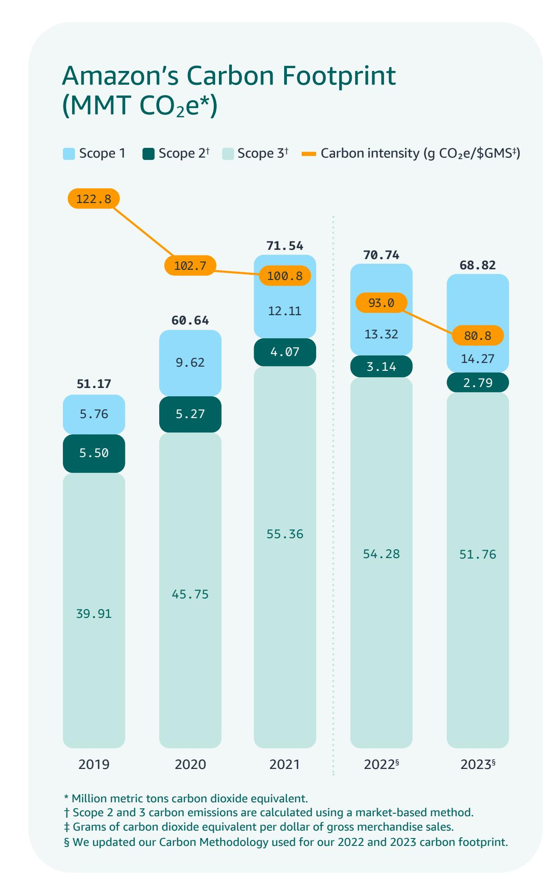

**Figure Description:**
The image is a graphical representation of Amazon's Carbon Footprint (MT CO2e) from 2019 to 2023. It shows four bar charts with numerical data indicating carbon emissions per unit of revenue for different scopes: Scope 1, Scope 2, Scope 3, and Carbon Intensity (gCO2e/SGM). Each chart has three bars corresponding to these scopes.

The first bar chart at the top left corner represents the metric tons of carbon dioxide equivalent (Mt CO2e) used by Amazon over time. This chart includes two sets of numbers: one set indicates the actual Mt CO2e usage, while another set suggests an alternative method that could reduce the company's carbon footprint.

Below each bar chart are explanatory notes about the data presented. For example, under the "Scope 1" bar chart, it mentions that the scope covers all direct emissions from sources owned or controlled by the company. Under the "Carbon Intensity" bar chart, there's information about how the company uses market-based methods to calculate its carbon emissions based on gross merchandise sales.

At the bottom right corner of the image, there's additional text providing context about the data. It states that the figures include both upstream and downstream carbon emissions associated with the products sold through Amazon's platform. Additionally, it highlights that the company aims to use renewable energy for our 2022 and 2023 carbon footprint.

Overall, the image serves as an informative visual aid, illustrating Amazon's efforts to manage and potentially reduce their environmental impact.

**Figure Description:**
The image you've provided appears to be a logo or emblem with stylized elements that are not clearly defined by numbers. There is no text present in the image, so there are no specific numeric values to describe. If you have any questions about the design elements or if you need information related to logos or branding, feel free to ask!

## Scope 3: Indirect Emissions from Other Sources

Scope 3 emissions include emissions from activities that take place beyond our direct operations, including building construction, third-party transportation, and the production of Amazon-branded products and the materials and components used in those products. In 2023, our Scope 3 emissions decreased by 5% from 2022 and represented 75% of our total carbon footprint. This decrease resulted from reductions related to building construction, leased buildings and equipment, and third-party transportation, as more goods were shipped by Amazon's own logistics providers versus third-party providers than in 2022.

Building construction is a significant driver of carbon emissions in many supply chains due to the associated embodied carbon that is emitted. Embodied carbon includes any carbon emissions created during the manufacturing of building materials, the transport of those materials to the job site, and the construction practices used. Embodied carbon is counted in a company's carbon footprint the year the building is completed and operational. We aim to reduce embodied carbon in building construction by using loweremission concrete, lower-emission steel, and mass timber. In 2023, 29 Amazon building projects were constructed with lower-carbon concrete and steel, and collectively reduced embodied carbon by 79,500 metric tons of CO2e, equivalent to the emissions generated by 17,200 cars driven for a year.

Because Scope 3 emissions are beyond our direct operational control, the efforts our suppliers take to reduce their emissions help us progress toward our ambition to achieve net-zero carbon emissions by 2040. We will prioritize working with suppliers who are also committed to decarbonization and reaching net-zero carbon emissions. We have identified a list of the highest-emitting suppliers directly supporting our operations, and expect those suppliers, who collectively contribute more than 50% of emissions globally to Amazon's Scope 3 footprint, to provide a plan for how they will decarbonize their operations and demonstrate real progress over time. We will prioritize our business toward those

who provide their plans and results on their path to netzero carbon emissions. We are already working with many of these suppliers, and will continue our engagement and share learnings. In addition, we also launched our "Amazon Sustainability Exchange"—a free, publicly available website that democratizes our guidelines, playbooks, science models, and other resources to help other companies make meaningful progress toward net-zero carbon emissions.

**Learn more** about how we're [engaging suppliers to](#page-20-0) [decarbonize our supply chain](#page-20-0)

## Path to 2040

We know the path to net-zero carbon by 2040 will be challenging, but we are making investments, creating new ways of working, and inventing new solutions to help us decarbonize now and in the future. At Amazon, we think long term, and we're committed to working collectively with our supply chain and industry partners to create and scale new decarbonization solutions.

We're proud of the work we do, not just within our own operations but across the many industries of which we are a part. At the end of 2023, The Climate Pledge included 473 signatories focused on achieving net-zero carbon emissions by 2040. Signatories are working together more than ever before, with five new joint action projects launched in 2023. We are also investing in companies that are building breakthrough technologies and other solutions that could, longer-term, lower the overall cost of decarbonization, even in hard-to-abate sectors. One way we do this is through The Climate Pledge Fund, Amazon's \$2 billion venture investment program, which supports the advancement of sustainabilityfocused technologies and services that will enable us to meet our net-zero carbon emissions goal.

We will continue to innovate, collaborate, and do the work needed to deliver the best for our customers, progress toward net-zero carbon emissions by 2040, and most importantly, contribute to a healthier planet.

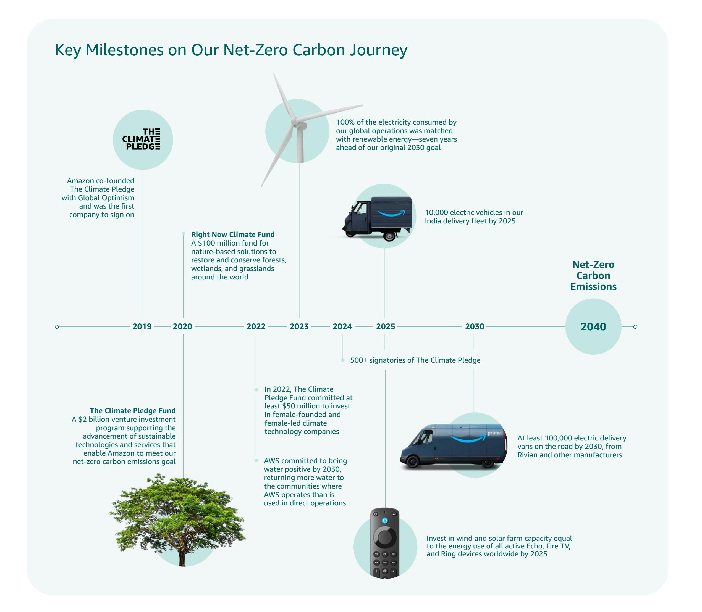

**Figure Description:**
The image is an infographic titled "Key milestones on Our Net-Zero Carbon Journey." It outlines significant events related to climate change mitigation efforts from 2019 through 2040. Here are the key details:

- In 2019, Amazon co-founded with Global Optimism a company called Signal Zero, which aims to sign on companies to reach net zero carbon emissions by 2030.
- Right Now Climate Fund was established, committing $100 million for nature-based solutions such as wetlands, grasslands, and forests around the world.
- By 2025, India delivered fleet by 2025.
- As of 2026, there were 100,00 electric vehicles in operation worldwide.
- In 2027, The Climate Pledge Fund committed $2 billion venture investment supporting technologies that help reduce carbon emissions.
- Also in 2027, AWS (Amazon Web Services) committed to being powered by renewable energy sources by 2030.
- In 2028, Ring devices worldwide reached over 200 million units.
- By 2030, Rivian and other manufacturers invested in wind and solar farm capacity equal to the energy use of active echo.
- From 2030 to 2035, A$2 billion venture investment supported technology companies globally.
- Between 2030 and 2035, AWS committed to using direct operations to return power to the communities where it operates.
- By 2035, Ring devices worldwide reached over 300 million units.
- In 2036, AWS committed to investing in wind and solar farm capacity equivalent to its global electricity consumption.
- From 2036 to 2040, AWS committed to investing in wind and solar farm capacity equivalent to its annual electricity usage.
- By 2040, AWS committed to reaching net zero carbon emissions.

The infographic also includes images representing various aspects of these initiatives, including a tree symbolizing environmental sustainability, a truck indicating transportation electrification, and a remote control suggesting technological advancements. These visual elements complement the textual information provided.

**Figure Description:**
The image displays a stylized graphic of a smiley face with an open mouth, which is commonly associated with happiness or joy. The color scheme consists mainly of green shades, with some white space around the edges. There are no visible texts within the image itself. The style appears to be minimalistic and modern, using simple shapes and lines to convey its message. It's important to note that without additional context, it's difficult to determine if there are any specific numerical values represented by the elements within the image.

# Delivery and Logistics

We rely on a complex transportation network to get products from manufacturers and sellers to customers around the globe. Our logistics network uses different modes of transportation, including ships, planes, freight trains, trucks, vans, and bikes, across three transportation legs:

- **• First mile** is the first transportation leg, used for transporting shipments from the manufacturer or supplier to an Amazon facility. First mile includes maritime and airfreight shipping, as well as movement by truck and rail.
- **• Middle mile** is the intermediate transportation leg, where we move shipments between Amazon facilities. It is also called long-distance transportation. Middle mile includes commercial trucking, aviation, maritime, and intermodal sea and rail.
- **• Last mile** is the final transportation leg that delivers packages from Amazon to customers. It includes vans, trucks, and micromobility solutions such as e-cargo bikes and on-foot delivery.

We have adopted a multi-pronged strategy to transport products safely, quickly, efficiently, and more sustainably. We are decarbonizing first, middle, and last mile transportation by:

**• Increasing routing and fleet efficiency.** In 2023, we restructured our U.S. fulfillment operations by reorganizing our national network of fulfillment centers, intermediate sort centers, last mile delivery hubs, and transportation fleet into eight regions. This shift ensures we're producing, packaging, and shipping from facilities that are closer to the communities we serve, which reduces the complexity of our shipping network and the miles traveled to get to our customers—helping drive down both carbon emissions and shipping costs. This new model optimizes delivery speed, reduces emissions, and provides the breadth of selection that customers expect. In the fourth quarter of 2023 alone, we shipped nearly 544 million more items from in-region fulfillment

- centers than we did during the same period of 2022. Shipping from in-region fulfillment centers to our delivery stations also reduces the number of stops per package—avoiding nearly 16 million miles driven in 2023—and decreases our reliance on air transportation.
- **• Increasing packaging and packing efficiency.** We focus on increasing pack and fill rates—the percentage of package volume that is utilized—and truck fill rates the percentage of truck volume that is utilized—to fit more products into shipping vehicles. This reduces the number of trucks we need—and the carbon emissions associated with them—to deliver our products.
- **• Scaling use of EVs and micromobility solutions.** Sending demand signals and scaling availability of alternative transportation solutions is critical to accelerating industry progress. This includes charging infrastructure, electric trucks, electric delivery vehicles, e-cargo bikes, e-mopeds, and on-foot deliveries from micromobility hubs.
- **• Increasing use of alternative-fuel vehicles and lowcarbon fuels.** The early adoption of lower-carbon fuels is another way we are working to minimize the carbon footprint of our transportation and logistics network, as well as a critical component to building out the alternative fuels market. We are investing in lowercarbon fuels today to encourage industry development and demand, with the goal of ultimately making them more accessible and affordable for everyone.
- **• Partnering on initiatives to decarbonize transportation.** We participate in multi-stakeholder initiatives to shift the industry toward lower-carbon solutions at scale, such as EVs, charging infrastructure, and lower-carbon fuels.
- **• Creating lower-carbon shipping options for customers.** We focus on consolidating shipments to reduce deliveries, as well as reducing packaging by shipping more items in each box and more items in their original packaging.

## First Mile

First mile transportation is the beginning of a product's shipment path from the manufacturer, wholesaler, or distributor to an Amazon facility via ship, airplane, train, or truck. In many cases, first mile shipments cross international borders. We are focused on decarbonizing first mile transportation while maintaining efficiency and reliability and reducing costs. For instance, we have discovered innovative ways to prioritize ocean and rail transportation to reduce our reliance on airfreight.

Ocean transportation has a lower carbon footprint than air transportation does, so we prioritize shipping our products on ships, whenever feasible. In 2023, we transported 90% of our imported transoceanic shipments via ocean freight and 2% via airfreight.

### **Ocean Freight**

**Zero-emission fuel:** Along with opting for more efficient shipping routes, we also prioritize lower-carbon marine biofuels. In 2021, we were a founding member of the First Movers Coalition, a global coalition of companies leveraging their purchasing power to decarbonize the world's heavyemitting sectors, such as ocean transportation. Through our active participation, we are supporting First Movers Coalition's goal to use maritime ships with zero-emission fuels for at least 10% of cargo shipped internationally by 2030. In 2021, we also helped launch Cargo Owners for

# Transportation Types by Delivery Stage

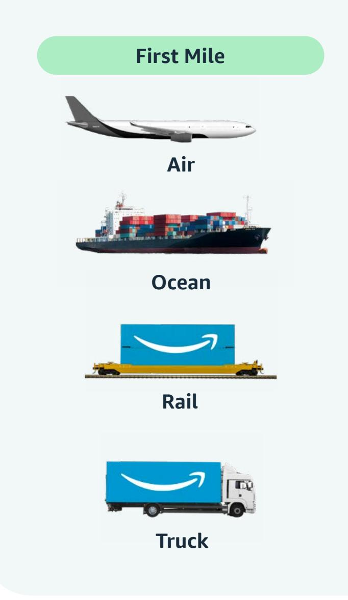

**Figure Description:**
The image is a graphic representation of various modes of transportation, each labeled with text that reads "First Mile." This suggests that these are the initial stages or first leg of transporting goods from their origin to their final destination. Each mode of transportation is depicted as follows:

1. **Air**: An airplane icon represents this mode, which typically refers to cargo flights for time-sensitive shipments.
2. **Ocean**: A large freighter ship symbolizes ocean shipping, which can be slower but often more cost-effective over long distances.
3. **Rail**: A train car icon signifies rail transport, commonly used for bulk commodities and intermodal shipping containers.
4. **Truck**: A truck icon indicates road transportation, which includes delivery trucks and other vehicles designed for hauling goods.

The arrangement of these symbols implies a sequence or progression from one mode of transportation to another, suggesting how different methods might be utilized within a supply chain or logistics network. There are no specific numerical values provided in the image; however, it's clear that the focus is on comparing the efficiency, speed, and costs associated with each type of transportation.

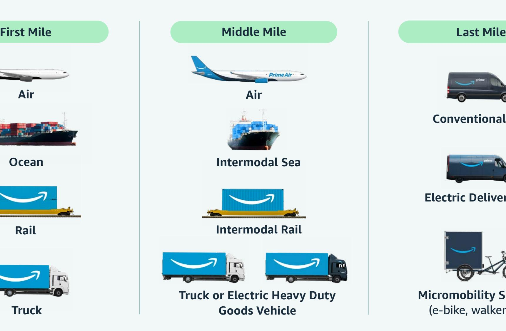

**Figure Description:**
The image is a colorful infographic that compares various modes of transportation based on their environmental impact, specifically carbon emissions per passenger or cargo unit mile. It's divided into two main sections: "First Mile" and "Last Mile," each with four different types of transport represented by an icon and text description.

In the "First Mile" section, from left to right, we see:
- Air: This mode has the highest carbon emission value at 0.13 kg CO2e/passenger mile.
- Ocean: With a lower value of 0.08 kg CO2e/cargo unit mile, it represents maritime shipping.
- Intermodal Sea: This mode also uses ships but has a slightly higher carbon footprint at 0.14 kg CO2e/cargo unit mile.
- Truck or Electric Heavy Duty Vehicle: These vehicles have the lowest carbon emission value among first-mile options, at 0.05 kg CO2e/cargo unit mile for trucks and 0.07 kg CO2e/cargo unit mile for electric heavy duty vehicles.

The "Last Mile" section shows:
- Rail: Represented by a train icon, it has a low carbon emission value of 0.06 kg CO2e/passenger mile.
- Intramodal Rail: Similar to rail but with a slightly higher value of 0.09 kg CO2e/passenger mile.
- Electric Delivery (e-bike, walker): This category includes e-bikes and walkers, which are more environmentally friendly than traditional delivery methods. They emit 0.02 kg CO2e/passenger mile.
- MicroMobility Scooter: This option has the lowest carbon emission value in the last-mile category, at 0.01 kg CO2e/passenger mile.

Each mode of transportation is visually distinguished by its own colored box within the overall white background of the infographic. The numbers are presented in bold black font against a light blue background, making them easily readable. The use of icons helps quickly identify each type of transportation. Overall, the infographic provides a clear comparison of the environmental impacts of these various means of travel.

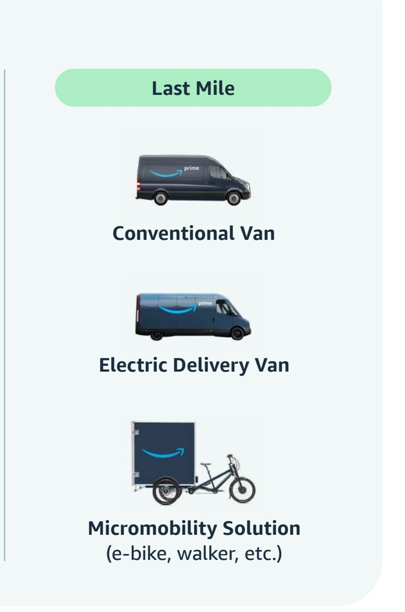

**Figure Description:**
The image is a graphic with text that appears to be related to transportation services or options. At the top of the image, there's a green horizontal bar labeled "Last Mile." Below it are three distinct modes of transport:

1. A black van with an Amazon logo on its side, indicating delivery service capabilities. This suggests that the vehicle might be used for last-mile deliveries from online retailers like Amazon.
2. An electric delivery van, which implies a focus on environmentally friendly transportation methods.
3. A blue bicycle with a cargo trailer attached to the back, representing a human-powered alternative to motorized vehicles.
4. At the bottom of the image, there's additional information about the third option, stating "Micro mobility Solution (e-bike, walker, etc.)". This indicates that the bicycle is part of a larger solution involving various forms of micro mobility.

The overall style of the image is clean and modern, using simple graphics and colors to convey different types of transportation solutions. There are no visible numbers within the image.

**Figure Description:**
The image displays a stylized graphic resembling a smiley face or an abstract representation of a wave or curve. It is composed primarily of two curved lines that meet at one point to form a shape reminiscent of a smile or a simple emoticon. The color scheme consists mainly of shades of green with some white space between the curves. There are no visible texts or numbers within the image itself. The style appears modern and minimalistic, likely intended for branding or as part of a logo design.

People

2023 Amazon Sustainability Report

Carbon

Carbon-Free Energy

Packaging

Waste and Circularity

Water

Zero Emission Vessels (coZEV) with the Aspen Institute to support initiatives that increase the availability of zero-emission technologies and fuels while gaining support from shipping lines, cargo owners, ports, and other organizations that can help to enable the energy transition. Through our membership, we are supporting coZEV's goal to use maritime ships with zero-emission fuels for 100% of ocean cargo by 2040.

**Biofuel:** Our investment in maritime biofuel helps to accelerate the shipping industry's transition to zero-emission fuels by demonstrating demand for lower-carbon fuel alternatives to bunker fuel. In 2023, we transported 10% of our ocean cargo via maritime ships powered by lower-emission biofuels and finalized a 2023–2024 agreement with Maersk through their "ECO Delivery" ocean product offering. As part of this collaboration, Amazon piloted shipping cargo on the first methanol-powered vessel, from Singapore to Rotterdam. As availability increases, we will continue to increase the percentage of cargo we transport on these types of ships and leverage additional lower-carbon fuels in 2024 and beyond.

**Learn more** about this landmark zero-emission voyage □

In early 2023, we co-founded the Zero Emission Maritime Buyers Alliance (ZEMBA) with the Aspen Institute, Patagonia, and Tchibo. ZEMBA seeks to accelerate commercial deployment of zero-emission shipping, enable economies of scale, and reduce maritime emissions. Six months after its launch, ZEMBA released a request for proposals for zero-emission shipping services to be delivered by 2025. This was the first major buyer-led initiative for the transition to zero-emission fuels in maritime shipping—one of the most challenging sectors to decarbonize.

**Learn more** about how we are <u>improving the shorelines</u> and areas surrounding the ocean routes we utilize ∃

### Airfreight

While we prioritize ocean transportation, air transportation is an important part of our first mile logistics network, though it represents only 10% of our transoceanic imports.

Aviation is also considered a hard-to-abate sector, which is why we are sourcing lower-carbon aviation fuels such as sustainable aviation fuel (SAF) and using SAF credits to reduce our own airfreight emissions as well as working with peers on innovative industry-wide solutions. Lower-carbon aviation fuel, such as SAF, currently represents less than 0.1% of global aviation fuel and remains cost-prohibitive for most companies. To help address these challenges, Amazon is a founding member of the Sustainable Aviation Buyers Alliance (SABA) and played a critical role in launching the Sustainable Aviation Fuel certificates (SAFc) Registry at the 28th meeting of the Conference of the Parties to the United Nations Framework Convention on Climate Change (COP28). The SAFc Registry aims to bring more transparency to emissions reduction claims and accelerate SAF deployment.

### Middle Mile

Middle mile transportation starts when packages arrive at an Amazon facility and covers the journey between fulfillment centers and sort centers to delivery stations. In addition to enhancing routing efficiency through regionalization, we are decarbonizing middle mile transportation by increasing the number of EVs on the road and at our facilities and adopting lower-carbon fuels. We also partner with others to create industry solutions that accelerate decarbonization of this leg of the transportation network.

### **Middle Mile Efficiency**

Moving products by rail or sea—instead of on the road, by conventional trucks—reduces carbon emissions by an average of nearly 50%. Europe's geographic landscape and infrastructure in particular often make rail and sea the faster and more efficient routing options. In 2023, we increased our use of rail and ocean transportation in Europe by over 50%, distributing products through more than 100 rail lanes and more than 300 sea routes across the continent. This reduced our demand for more carbon-intensive transportation methods, such as trucks, in Europe. Additionally, we shortened the average distance each package traveled within our middle mile network by 25 kilometers in 2023 compared to 2022.

# Journey of a Kindle through Our Transportation Network

Products travel through Amazon's transportation network from manufacturers and sellers to customers around the globe. An Amazon Kindle starts its journey at a manufacturing facility in China, traveling through various ports, a crossdock, a fulfillment center, and a delivery station before it is delivered to the customer in Valencia, Spain.

First Mile

The first transportation leg, used for transporting shipments across international borders.

**Figure Description:**
The image shows a large cargo ship with multiple containers stacked on its deck. These containers are predominantly red and blue, suggesting that they may be carrying goods for transport across various routes. However, without specific markings or logos visible, it is not possible to determine their exact contents or destinations. The ship itself appears to have a dark hull color, possibly black or very dark gray, which contrasts with the bright colors of the containers. There are no visible texts or numbers providing additional information about the ship or its cargo. The style of the photograph seems to focus on capturing the ship's structure and the arrangement of the containers rather than any particular action taking place at the moment.

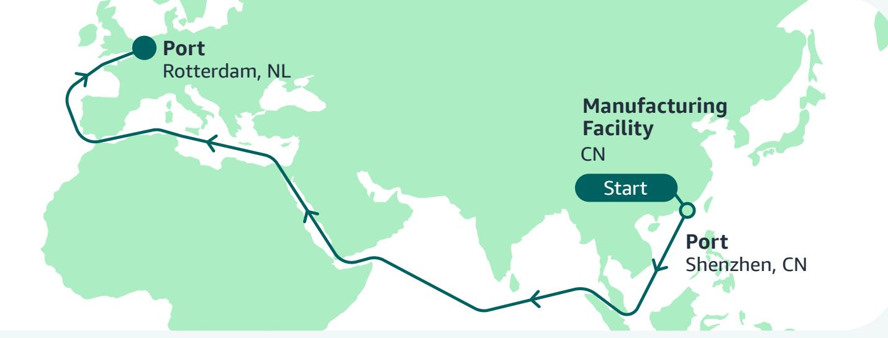

**Figure Description:**
The image is a map illustrating two routes between Port Rotterdam (NL) and Shanghai (CN). Both routes are depicted as lines connecting these cities with green shading indicating landmasses and blue representing water bodies. On one route, labeled "Start," there's an arrow pointing from Port to Shanghai, suggesting the direction of travel or movement along that path. The other route, marked by a dashed line, has no label but appears to be another possible connection between the same destinations.

The map uses numerical values to indicate distances along each route: "Port - Rotterdam" is shown as 102 nautical miles, while "Rotterdam - Shanghai" measures at 7385 nautical miles. These numbers provide quantitative information about the length of each journey. Additionally, there's a note mentioning "Manufacturing Facility CN," which could imply a specific point of interest within China for logistical purposes related to manufacturing. However, without further context, it's unclear exactly what "Facility CN" refers to. Overall, the image seems to serve as a visual guide for understanding the geographical relationships and distances involved in maritime transportation between these locations.

Middle Mile

The intermediate transportation leg, where shipments are moved between Amazon facilities.

**Figure Description:**
The image shows a side view of a large truck with a blue body and white cab. On the side of the truck is a logo consisting of a stylized smiley face with an arrow-like shape above it, resembling a simplified representation of a smile or laugh. Below the logo, there are no visible texts or numbers that provide additional information about the truck or its purpose. The style of the image appears to be a digital rendering rather than a photograph of a real vehicle. There are no specific numeric values provided within the context of the image itself.

Fulfillment Center
Madrid, ES

Delivery Station
Valencia, ES

Z Last Mile

The final transportation leg, where packages are delivered to customers. We prioritize EVs and micromobility solutions when possible.

**Figure Description:**
The image shows a bicycle with an attached trailer or cart. On the side of the trailer is a logo consisting of a blue smiley face followed by a white arrow pointing to the right. Below the logo are two black wheels visible from behind. There's no text present in the image that provides additional information about the product or brand being represented. The style of the image appears to be a digital rendering rather than a photograph, given its clean lines and lack of texture typical for real-world objects. The background is plain white, which helps to focus attention on the bike and trailer combination.

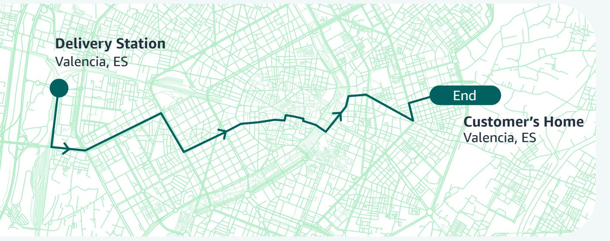

**Figure Description:**
The image is a stylized map with an overlay of green lines that suggest transportation routes or paths. There are two prominent labels: "Delivery Station" at the top left corner and "Customer's Home" at the bottom right corner. Between these points, there is a line labeled "End," indicating the end point of a delivery route. A dashed arrow connects the "Delivery Station" to the "End," suggesting the direction of travel for deliveries.

The map includes various streets and landmarks, but no specific numerical values are visible within the context provided by the question. The focus seems to be more conceptual rather than providing precise distances or locations. The overall style of the image suggests it might be used as part of a logistics or delivery service presentation or documentation.

**Figure Description:**
The image displays a stylized graphic of a smiley face with an open mouth forming a curved shape that resembles a smile or a wave-like motion. The color scheme consists mainly of shades of green and teal, which are used to fill the shapes within the design. There is no text present in the image. The style appears modern and minimalistic, using simple geometric forms to create the overall impression. The background of the image is white, providing contrast for the colored elements. The image does not contain any specific numerical values or representations related to numbers. It seems to be more focused on branding or logo design rather than mathematical content.

In 2023, we increased our total rail load volume by 45% in Europe and 25% in the U.S. Our sustainable rail freight solutions were recognized by BNSF Railway, which selected Amazon as one of the recipients of its 2023 Sustainability Award.

### **Middle Mile Electric Vehicles**

Scaling up middle mile EVs is another way we aim to decarbonize our logistics network, both on the road and at our logistics facilities. Amazon and delivery service providers (DSPs) deployed more than 245 electric middle mile vehicles in 2023. We also have nearly 18,000 hydrogenpowered forklifts operating at more than 81 fulfillment centers, as well as 110 electric yard hostlers—vehicles that move truck trailers around fulfillment centers—in North America.

**Figure Description:**
The image is a photograph of an individual standing at a podium during a conference or event. The person appears to be speaking into a microphone, as indicated by their open mouth and focused gaze towards something not visible within the frame. They are wearing glasses, a dark top with lanyards around their neck, and a patterned saree draped over one shoulder.

The background features a large screen displaying various sketches that seem to relate to technology or innovation themes. On the left side of the screen, there's text that reads "amazon smbhav summit," suggesting that the event is related to Amazon's SMBHAV Summit. Below this title, there is another line of text which includes numbers: "100+," indicating that more than 1,00 people attended the event.

In the bottom right corner of the photo, there is a watermark-like symbol resembling a stylized 'S,' possibly representing the logo for the event or organization associated with it. The overall style of the image suggests it was taken at a formal professional gathering, likely held indoors due to the presence of the stage setup and the attire of the speaker.

Jaya Varma Sinha, CEO of Indian Railways, spoke at the Smbhav Summit in 2023. Indian Railways' partnership with Amazon India enables more sustainable modes of transportation and faster and more reliable delivery of customer packages in the region.

Indian Railways are the backbone of India's transportation system thanks to the widespread network of trains that transport millions of people and freight across the country each day. In 2019, Amazon became the first e-commerce company to leverage this vast train network by entering into an operational engagement with Indian Railways to meet our customer promise of fast and reliable deliveries. We have continued this collaboration, increasing our use of Indian Railways' electric locomotives to ship packages in 2023. We also partnered with eFast—India's first national freight electrification platform led by the government policy think tank NITI Aayog—to engage policymakers on policies that can help decarbonize rail freight.

Amazon recognizes that the infrastructure needed to support the charging of electric heavy goods vehicles (eHGVs) at delivery stations and on the road is one barrier to scaling their use around the world. That is why we work with eHGV manufacturers and other partners to improve charging infrastructure and electricity grids. For instance, we partner with third-party charge point operators to set up charging yards at locations that best serve our Amazon sites. In Europe, we published CHALET (Charging Locations for Electric Trucks), a new, open-source tool to help private industry, governments, electricity network operators, and local authorities determine where to build electric charging points for eHGVs. Transportation and logistics operators are encouraged to input data into the tool, which CHALET then uses to generate a ranked list of recommended charger locations.

### **Middle Mile Zero-Emission and Lower-Carbon Fuels**

In addition to putting EVs on the road, we are exploring ways to decarbonize our middle mile transportation operations by adopting lower-carbon fuels such as hydrogen, renewable diesel, and renewable natural gas (RN[G\).6](#page-94-0)

In 2023, we piloted the use of hydrogen fuel cell vehicles (FCVs) in Europe and Japan. These initiatives will provide us with more information about the right FCV size to maximize performance, determine optimal hydrogen storage and power management, and understand the viability of these

vehicles for middle mile transportation. In 2024, we aim to increase the number of FCVs deployed in our transportation network.

Amazon began mobile fueling diesel-powered vehicles including trucks that operate short, local routes and vehicles that operate within our facilities—with renewable diesel at all California and Oregon fulfillment and sort centers in 2023. Renewable diesel is made from waste fats, greases, and other oils. And in India, we are collaborating with local oil companies to develop renewable diesel and other alternative fuels such as compressed biogas.

To reduce our logistics-related emissions, Amazon is also increasing the availability of compressed natural gas vehicles (CNGs). CNGs are trucks powered by natural gas instead of gasoline or diesel fuel. They can reduce carbon emissions by at least 75% compared to diesel when refueled with RNG. Globally, Amazon had 4,400 CNGs on the road in 2023, using 30 million gallons of RNG. This growth was driven by the opening of seven permanent RNG fueling stations across our North American logistics network in partnership with Clean Energy, the largest provider of RNG for the transportation industry in North America.

### **Partnerships Accelerating Middle Mile Decarbonization**

Trucking is a challenging area to decarbonize, particularly considering the long-haul distances driven and the requirements for high-power EV charging infrastructure across transportation routes. Identifying and scaling solutions for this important method of transportation cannot be done by one company alone—it requires the know-how, resources, and experience of collaborative partners across industries and sectors.

In 2023, Amazon participated in the Smart Freight Centre (SFC) Exchange Network, a nonprofit organization whose mission is to accelerate the reduction of logistics emissions by fostering collaboration. As part of its work, SFC is increasing transparency and accountability around logistics emissions. In 2023, SFC and the World Business Council for Sustainable Development (WBCSD) launched guidance

to enable companies to better understand and track their logistics emissions on a granular operational level, from supplier to final customer.

We also became the first logistics provider to join the EVs2Scale2030 initiative with the Electric Power Research Institute (EPRI). Bringing together industry and the U.S. government, this initiative aims to increase the number of EVs on U.S. roads—from cars to heavy-duty trucks. Members are working to ready the electric grid in support of accelerated development of EV charging infrastructure. In 2023, the organization released eRoadMAP, a publicly available interactive map of transportation load growth across the U.S.

Additionally, in 2023, The Climate Pledge and C40 Cities (C40) developed Laneshift, a partnership to accelerate the transition to zero-emission electric trucks and charging infrastructure across major cities in India and Latin America.

### **Learn more** about [Laneshift](#page-21-0)

## Last Mile

Last mile transportation refers to the final part of the delivery journey. This is when products are transported from sort centers and delivery stations to customers via delivery vans, electric delivery vehicles (four-wheel, three-wheel, twowheel, and e-mopeds), and micromobility solutions, including e-cargo bikes and on-foot deliveries. To help reduce deliveryrelated emissions, we are investing in EVs and working to optimize our delivery van and package fill rates as products embark on the final leg of their journey. Amazon deliveries are made by DSPs, who are independent contractors that operate their own delivery businesses.

**Learn more** about Amazon's [DSP program](https://logistics.amazon.com/?utm_source=businessblog&utm_medium=house&utm_campaign=b2b_cm_DSPPartnerProgram-Home-2023-09-14)

### **Last Mile Electric Delivery Vehicles**

Increasing the number of EVs in Amazon's delivery fleet is an important part of our approach to avoiding carbon emissions across the last mile of our transportation network. We are committed to having at least 100,000 electric delivery vans from Rivian and other manufacturers—on the road by 2030.

**Figure Description:**
The image displays a stylized graphic of a smiley face with an upward-curving line for a mouth. This design is commonly associated with emoticons or emojis used to convey emotions or reactions in digital communication. There are no visible numbers or text within the image that provide additional context or information about its content. The style of the image suggests it could be part of a logo, icon, or branding material due to its simple yet recognizable symbolism.

In 2023, we delivered more than 680 million packages globally using more than 24,000 electric delivery vehicles, including 19,000 electric delivery vans, around the world.

### **United States**

- **•** Our U.S. fleet included 11,800 electric delivery vans from Rivian, up from more than 2,600 in 2022.
- **•** We delivered 431 million packages via EVs.

### **Europe**

- **•** We deployed more than 300 electric delivery vans from Rivian on the road in Europe as part of our broader fleet of more than 3,000 electric delivery vehicles.
- **•** We delivered 150 million packages via EVs.

### **India**

- **•** We nearly doubled the number of EVs in our Indian delivery fleet to more than 7,200, including 3,600 electric delivery vans, and more than 3,600 two-, three-, and four-wheel vehicles.
- **•** We delivered 81 million packages via EVs.
- **•** We installed charging infrastructure near more than 100 Amazon locations.

In India, 81% of last mile deliveries are made by delivery

# Last Mile Electric Delivery Vehicles by Regio[n7](#page-94-0)

| Region | 2022  | 2023   |
|--------|-------|--------|
| U.S.   | 2,600 | 11,800 |
| Europe | 1,220 | 3,000+ |
| India  | 3,800 | 7,200+ |

associates using personal two-wheel vehicles. To encourage DSP associates to convert their personal vehicles to electric, we offer exclusively sourced EV deals from original equipment manufacturers as well as access to affordable financing.

**Figure Description:**
The image displays a stylized icon of a train or bus with a simplistic design, featuring a rectangular shape with rounded corners and a smaller rectangle within it representing the windshield area. There are two circles that could be interpreted as headlights or lights at either end of the vehicle's body. Above the main rectangle is a horizontal line that might suggest a roofline or top edge of the vehicle. Below the main rectangle, there appears to be another rectangle which could indicate the lower part of the vehicle, possibly the bumper or base section. To the right side of the icon, there is a vertical line that may imply doors or windows.

The color scheme consists mainly of shades of green and white, giving the icon a clean and modern appearance. The style of the icon suggests it could be used for various purposes such as transportation services, travel apps, or public transit systems. However, without additional context, it is not possible to determine its exact function or purpose.

### **Zero-Emission Deliveries in London**

In August 2023, we began transporting packages in London using both zero-emission middle mile vehicles (electric heavy-duty trucks) and last mile vehicles (electric vans). While our current volumes of these vehicles are small, this pilot provides important learnings as we continue our work to decarbonize our transportation network.

### **Reducing Emissions with Micromobility Delivery Solutions**

Micromobility hubs are smaller, centrally located delivery stations. In dense cities, these hubs enable us to utilize nontraditional delivery methods, such as e-cargo bikes and onfoot deliveries, to bring packages to customers in ways that generate fewer carbon emissions.

In 2023, we delivered more than 125 million packages via e-cargo bikes and on foot from micromobility hubs around the world. In Europe, we doubled the number of cities in which we operate micromobility hubs from over 20 in 2022 to more than 40 in 2023. New cities including Glasgow, Madrid, Rome, and Vienna joined existing hubs in London, Paris, Milan, and Munich.

In the U.S., Manhattan, New York, is an ideal place to deploy micromobility delivery operations due to its high population density and pedestrian and cycling infrastructure. In 2023, we delivered:

- **•** 50 million Amazon packages via micromobility solutions, up from 9.1 million packages in 2022
- **•** 1.6 million grocery orders with micromobility solutions
- **•** 259,643 packages in our first North American e-bike package delivery pilot in Brooklyn, New York
- **•** As many as 222,000 packages were delivered daily by 1,460 on-foot delivery associates using pushcarts in Manhattan and a small area of Queens, reducing the need for hundreds of vehicles every day

In Japan, we delivered over 23 million packages using e-cargo bikes and on-foot delivery. We also scaled the Amazon Hub Delivery program—which partners with small and medium-sized businesses to deliver packages in local neighborhoods—to over 2,000 partners that delivered nearly 14 million shipments in 2023, around half of which were delivered on foot or bike.

### **Customer Shipping Options to Avoid Carbon Emissions**

We offer our customers shipping options that help reduce the carbon emissions associated with the delivery of their products. We also have programs for sellers to reduce delivery emissions and decrease costs.

### **Amazon Day Delivery**

Our Amazon Day shipping option allows Prime members to choose a designated day of the week to receive their orders. By consolidating orders into fewer packages and deliveries, we are avoiding emissions by saving boxes and reducing trips to individual addresses. In 2023, Amazon Day delivery avoided the use of more than 200 million boxes (up from nearly 115 million in 2022) and 226,000 metric tons of CO2e.

### **Ships in Product Packaging**

Our Ships in Product Packaging program, formerly called Ships in Own Container, tests and certifies products that can ship safely in just their original manufacturers' packaging without an additional Amazon box, envelope, or bag. This minimizes the packaging materials used for delivery and allows packages to take up less space in delivery vehicles, increasing our truck fill rate.

Amazon recently launched an initiative in the U.S. to increase the number of items tested for qualification in the Ships in Product Packaging program by extending the program to [Fulfillment by Amazon sellers](https://www.amazon-packaging.com/sellers) . The program benefits these sellers by enabling them to provide a better customer experience while reducing the costs associated with fulfillment.

**Learn more** about how we are [reducing our packaging](#page-28-0)  [footprint](#page-28-0)

# Building Construction and Operations

Our building portfolio comprises thousands of owned and leased facilities in more than 60 countries, including operations buildings, grocery stores, corporate offices, and [data centers](#page-18-0) . The construction, operation, and decommissioning of these buildings accounted for one fifth of Amazon's total carbon emissions in 2023, which is why we're committed to implementing and scaling decarbonization solutions and processes to reduce the footprint of this sector of our business.

Carbon emissions connected to our buildings fall into two categories: embodied emissions and operational emissions. Embodied emissions in the buildings sector are generated from the manufacture, transportation, installation, maintenance, and disposal of building materials. Operational emissions refer to resources consumed by day-to-day processes needed to run our business, including computing, lighting, heating, cooling, ventilation, refrigeration systems, and operating other equipment.

**Figure Description:**
The image displays a stylized graphic of a smiley face with an upward curve to its right side, resembling a smile or laughter. This design is commonly associated with happiness or positivity. There are no visible texts or numbers within the image itself. If you have any specific questions about the image that require numerical information, please provide more context so I can assist you better.

Globally, our work to reduce carbon emissions related to our buildings focuses on:

- **• Implementing foundational efficiency initiatives:** We are instituting and improving data collection practices to better track our performance and inform our efforts to improve efficiency and reduce energy use and carbon emissions across our buildings portfolio.
- **• Scaling renewable energy and lower-carbon approaches to heating and cooling:** We use on-site renewables, such as rooftop solar installations on buildings we operate, as well as renewable energy from the grid to power our buildings. We're also scaling up our use of refrigerants with low global warming potential (GWP) and utilizing alternative fuels as backup power sources and to cool data centers.
- **• Creating industry solutions to reduce embodied carbon:** We collaborate with suppliers, industry partners, signatories of The Climate Pledge, and governing bodies to develop and implement standards, alternative materials, and solutions that address environmental challenges specific to the buildings sector.

# Implementing Foundational Efficiency Initiatives

We are working to make our buildings more energy-efficient and reduce their carbon emissions. This work starts with collecting robust, accurate, timely, and meaningful data to identify opportunities for improvement.

Our Enterprise Building Management System (EBMS) is one of the tools we use to measure and track energy efficiency at our existing sites. This standardized platform manages facility energy use and controls various building systems to minimize associated carbon emissions. Many of our buildings have thousands of sensors to monitor water use, air flow, temperature, and other environmental variables, which help

us further improve and optimize our designs. By the end of 2023, our EBMS was active in more than 1,200 facilities globally, a 14% increase from 2022.

We increase energy efficiency across our building operations through lighting and EBMS retrofits as well as rooftop heating, ventilation, and air conditioning unit replacements. Lighting retrofits alone have saved 1.23 billion megawatthours (MWh) of energy and avoided more than 873,000 metric tons of CO2e from 2017 to 2023. These upgrades have included converting all non-LED lamps to high-efficiency LED fixtures with dimming controls.

### **Validating Our Progress**

As teams across Amazon progress toward the decarbonization of our buildings, we've begun to validate our efforts using the International Living Future Institute's Zero Carbon Certification (ZCC). This third-party certification program validates improvements to our building decarbonization efforts and provides clear accountability for our internal teams and external building partners. This rigorous, carbon-centric program requires us to provide actual measured—not predicted—performance over one year of building occupancy to assess credible carbon emission reductions. This means that we are just now receiving certifications for the first pilot projects we submitted for evaluation.

Amazon achieved two full certifications for building projects in 2023: an Amazon Fresh store in Seattle, Washington which was the world's first building of its type to achieve the certification—and a Same Day delivery station in Sacramento, California—the first-ever North American logistics building to be certified. We are working to scale alignment with this certification program throughout our company, with dozens of projects across our global buildings portfolio currently using ZCC standards to measure and validate our decarbonization efforts.

**Figure Description:**
The image depicts a modern indoor staircase with multiple flights of stairs leading upwards to an unseen destination. Each flight is adorned with a variety of plants that add a touch of nature to the architectural setting. At the top of each flight, there are benches painted in shades of blue and green, providing seating options for those using the stairs.

The stairs themselves are made of light-colored wood, which contrasts nicely with the darker tones of the railings. These railings are black and feature a sleek design that complements the overall aesthetic of the space.

On the left side of the image, two individuals can be seen ascending one of the flights. They appear to be engaged in conversation as they navigate the steps. Their presence adds a sense of scale and activity to the scene.

In terms of numeric values, it's important to note that without specific measurements or context provided by the photographer, any numerical interpretation would be speculative at best. However, if we were to consider the number of stairs visible in the photo (which includes both the risers and the treads), we might estimate that there could be anywhere from 15 to 20 stairs per flight, depending on the angle and perspective of the shot. This estimation assumes standard stair dimensions but may vary based on local building codes and practices.

Design elements at HQ2 incorporate native flora and fauna and use earth tones and natural materials, such as wood and stone, to create a warm and inviting atmosphere.

**Figure Description:**
The image displays a stylized icon of a building with multiple windows and doors, set against a white background. To the right of the building icon is text that reads "50" followed by an arrow pointing downwards to the left. Below the number "50," there's another icon representing a tree or plant. The overall style of the image appears to be minimalistic and modern, likely used for informational purposes such as indicating a specific quantity related to the building (e.g., units available) or perhaps environmental data like trees per unit area. However, without additional context, it's difficult to determine the exact meaning behind these elements.

### **Sustainability at Our Second Headquarters**

We want our corporate offices to be both inspiring places to work and models of what is possible when it comes to sustainable design and construction.

We built our second headquarters (HQ2) in Arlington, Virginia, with sustainability in mind. Opened in May 2023, HQ2 runs on 100% renewable electricity and achieves energy savings of 24% relative to a comparable Leadership in Energy and Environmental Design (LEED) baseline. In March 2024, it became the largest project (by building square footage) in the U.S. to receive LEED v4 Platinum certification.

Using an advanced lower-carbon concrete mix design that included CarbonCure, which we invested in through [The Climate Pledge Fund](#page-22-0) , we achieved a 20% reduction in HQ2's concrete structure carbon footprint compared to the industry baseline.8 This av[oide](#page-94-0)d 14,700 metric tons of CO2e, which is the equivalent of taking 3,500 cars off the road in the U.S. for an entire year. More than 40 Amazon sites globally now use this same CarbonCure technology.

**Figure Description:**
The image displays a stylized graphic of a smiley face with an open mouth, suggesting happiness or positivity. The color scheme consists mainly of green shades, which are used to outline the shape of the smiley face as well as for its background. There is no text present within the image itself. The style appears to be minimalistic and modern, using simple shapes and lines to convey emotion. The overall impression is one of simplicity and joyfulness.

# Scaling Renewable Energy and Lower-Carbon Approaches to Heating and Cooling

We are working to reduce the emissions associated with operating our buildings by using renewable energy and other lower-carbon alternatives.

### **Scaling Renewable Energy**

At the end of 2023, Amazon had 270 rooftop solar projects at our facilities around the globe. We brought 50 new on-site solar energy systems online in 2023, for a total capacity of 58 MW. These on-site solar energy systems are estimated to generate 123,000 MWh annually—enough energy to power over 33,600 European homes—and avoid the equivalent of roughly 47,400 metric tons of CO2e each year compared to nonrenewable electricity sources.

**Learn more** about how we are [scaling carbon-free energy](#page-23-0)

### **Lower-Emission Refrigerants**

Refrigerants are cooling agents used in air conditioners, heat pumps, refrigerators, and freezers. Refrigerants with high GWP—such as hydrofluorocarbons (HFCs)—contribute to climate change by trapping more heat in the atmosphere than CO2. That's why Amazon Fresh and Whole Foods Market use low-GWP refrigerants, such as CO2 refrigerants, to help grocery stores reduce emissions.

By the end of 2023, 46 Whole Foods Market stores were using low-GWP refrigeration systems. Whole Foods Market has also committed to using only low-GWP refrigeration systems in new stores in North America starting in 2025. Together, Amazon and Whole Foods Market donated to the North American Sustainable Refrigeration Council in 2023 to accelerate the council's efforts to train the next generation of skilled technicians needed to install and maintain sustainable refrigeration systems.

## **Energy Efficiency and Alternative Fuels in AWS Data Centers**

AWS takes a holistic approach to minimizing energy and water consumption in its operations, including in data

centers. For example, AWS is increasing the use of freeair cooling systems that cool servers with outside air. This avoids the need for energy-intensive compressor-based cooling systems throughout much of the year. Even during peak summer temperatures, data centers can utilize direct evaporative cooling, a process that uses water to cool the air and remove heat from servers.

In 2023, AWS started transitioning to hydrotreated vegetable oil (HVO) to power backup generators at its data centers in the U.S. and Europe. HVO is a type of renewable diesel made from waste cooking oil or vegetable, plant, and residue oils. AWS sites in Ireland, Sweden, and Oregon were among the first to make the switch to HVO. Renewable diesel is readily available in regions such as the U.S. West and parts of Europe, but sourcing in areas such as the U.S. East and Midwest remains a challenge due to the lack of distribution terminals and established supply chains for this type of fuel. In response, fuel distributors are beginning to invest in renewable diesel terminals along the U.S. East Coast, and AWS plans to explore these sourcing opportunities once they are available.

# Creating Industry Solutions to Reduce Embodied Carbon

Decarbonizing the buildings sector is a challenge no one company or organization can solve alone. We can, however, accelerate progress by engaging with industry partners to develop and scale innovations that reduce carbon emissions associated with the construction, operation, and decommissioning of buildings across sectors and markets.

## **Using Lower-Carbon Materials**

We are working to reduce embodied carbon in our infrastructure by increasing the use of lower-carbon materials in Amazon buildings, such as lower-carbon steel, lower-carbon concrete, and mass timber, a lower-carbon structural wood product that can replace concrete and steel in building construction.

In 2023, 29 Amazon building projects were constructed with lower-carbon concrete and steel, collectively reducing embodied carbon by over 79,000 metric tons of CO2e. Amazon used mass timber when building HQ2 and, in 2023, progressed in the design and construction of three new buildings that will use mass timber structural elements.

In 2023, AWS built 36 data centers with lower-carbon concrete, up from 16 in 2022. AWS also tested a low-carbon, performance-based ASTM C1157 Hydraulic Cement by Ozinga, a concrete, bulk materials, and logistics solutions supplier, which achieved a 64% reduction in embodied carbon compared to the industry average. In January 2024, AWS updated its design standards to require the use of concrete with 35% less embodied carbon than the industry average in new data centers around the world.

We can also mitigate a building's carbon footprint by using higher-strength structural steel, which is made by cooling the metal quickly during manufacturing. The manufacturing process of lower-carbon steel gives it a higher strengthto-weight ratio, which means that less material—and as a result, less embodied carbon—is used to perform the same function. By incorporating higher-strength steel into its data center structural designs, AWS has reduced steel content by 70 tons for each two-story data center and 137 tons for each three-story data center, decreasing emissions by 63 and 124 metric tons of CO2e, respectively. In 2023, AWS built 31 data centers with lower-carbon steel, up from 10 in 2022.

Using lower-carbon steel and concrete enabled AWS to avoid over 46,700 metric tons of CO2e in 2023—equivalent to the carbon emissions generated from driving over 11,100 cars in the U.S. for one year. We will continue working with suppliers to achieve even greater carbon savings in future Amazon buildings by increasing the use of lower-carbon materials in their construction.

### **Partnering to Develop Industry Standards for Measuring Embodied Carbon**

Embodied carbon is our largest source of building-related carbon emissions and something we address in our building design and construction strategies. Since 2022, we have been using the [Embodied Carbon in Construction](https://carbonleadershipforum.org/ec3-tool/)  [Calculator](https://carbonleadershipforum.org/ec3-tool/) to track and report the embodied carbon of our building construction materials. This open-access industry tool allows us to benchmark, assess, and reduce embodied carbon. It focuses on emissions from the construction materials supply chain, using a database of digital, thirdparty-verified Environmental Product Declarations (EPDs). EPDs are a way for manufacturers to take comprehensive, third-party-verified life cycle assessments (LCAs) and turn them into standardized labels for their products. We use this data to select lower-carbon construction materials.

Amazon asks our building contractors, including architectural, design, and construction companies, to use this tool as part of our building delivery process. In 2023, this requirement increased the use of the tool by 231 building contractors across 47 companies and 26 countries. This uptake has helped scale and deploy expertise in how to reduce embodied carbon across the broader building industry.

In 2023, we worked with the UK Chartered Institution of Building Services Engineers (CIBSE) and our supply chain partners to create public-facing embodied carbon baselining guidance for the logistics sector. This guidance, called [Technical Memorandum 65.3](https://www.cibse.org/policy-insight/news/cibse-launches-groundbreaking-guidance-tm65-3-for-assessing-embodied-carbon-in-logistics-centres-in-collaboration-with-amazon-and-introba) , seeks to help professionals across Europe assess and understand the embodied carbon of material handling and mechanical, electrical, and plumbing equipment. Using data that is new to the industry, Technical Memorandum 65.3 will enable Amazon, our supply chain partners, and our peers to establish a baseline understanding of carbon emissions from industrial equipment, paving the way to ultimately identifying additional carbon reduction opportunities.

# Servers and Hardware

As the world's most comprehensive and broadly adopted cloud provider, AWS is committed to building a lower-carbon business for its customers and the planet. AWS designs its data centers—including servers and hardware—for efficiency, resiliency, and a lower carbon footprint.

**Figure Description:**
The image displays a stylized graphic of a smiley face with an upward-curving line for the mouth and a curved line for the eyes. The color scheme consists mainly of shades of green, with some white space around the edges. There are no visible texts or numbers within the image itself. The style is simplistic and appears to be designed as a logo or icon rather than a detailed illustration. It conveys a sense of happiness or positivity through its design elements.

AWS's scale allows for higher resource utilization and energy efficiency than the typical on-premises data center. From the infrastructure that powers its servers to the techniques that keep them cool, efficiency is a primary goal for every part of the AWS Global Cloud Infrastructure.

The AWS Global Cloud Infrastructure is built on AWS's own custom hardware and optimized for workloads run by AWS customers. Research shows that in North America, AWS can lower its customers' workload carbon footprints by up to 96% compared to on-premises computing workloads when the electricity AWS uses is matched with 100% renewable energy—a goal that Amazon, including AWS, achieved in 2023.

AWS is reducing emissions related to server use and networking equipment by increasing server lifespan. This includes refining software to run more efficiently, which lowers stress on hardware and extends the amount of time it can be used. In February 2024, AWS announced that the average expected life of its servers had improved from five to six years. To support these efforts, AWS has a robust maintenance and repair program in place that is designed to increase component reuse and further reduce carbon emissions and waste across its supply chain.

**Learn more** about how [AWS is advancing circular](#page-37-0)  [economy principles](#page-37-0)

## Enhancing Chip Efficiency

One of the most visible ways AWS is innovating for power efficiency is through its investment in purpose-built chips. A chip is a tiny wafer of semiconducting material with an embedded electronic circuit. It contains millions of microscopic electronic components called transistors that transmit data signals. Chips today are high-performance processors that power all types of advanced analytics, graphics, and machine learning applications.

In 2023, AWS launched Inferentia2, the second generation of its Inferentia chip, developed to deliver the highest

performance at the lowest cost per watt. Inferentia2 is up to 50% more energy-efficient and can reduce costs by up to 40% against comparable Amazon Elastic Compute Cloud (EC2) instances.

Meanwhile, AWS Graviton4 is the latest generation of chips designed by AWS and the most powerful and energyefficient chip AWS has built as of 2023. Graviton4 provides up to 30% better computing performance, 50% more cores, and 75% more memory bandwidth than Graviton3 processors while being more energy efficient.

# Partnering to Reduce Carbon Emissions in the Semiconductor Industry

AWS knows that by collaborating across the entire semiconductor industry, it can drive carbon emission reductions at a scale greater than what is possible on its own. To that end, AWS is partnering with its suppliers to decrease their operational emissions and engage their own upstream supply chains to do the same. In 2023, AWS joined the Semiconductor Climate Consortium (SCC), an organization focused on reducing carbon emissions across the global semiconductor supply chain. The SCC collaboration accelerates decarbonization for member company operations and enables new solutions and approaches for adoption.

# Products and Devices

## Amazon Private Brands

Two of our private brands, Amazon Essentials and Amazon Basics, make products across many categories, including clothing, bedroom furniture and mattresses, kitchen appliances and cookware, toys, pet essentials, and workout gear. Amazon works with suppliers around the world to manufacture these products at a high quality and great value.

**Figure Description:**
The image displays a stylized graphic with two elements: an abstract shape resembling a leaf or flower petal, which is green and has a smooth outline; and a hand gesture that appears to be cradling or supporting the leaf-like shape from below. The hand gesture consists of three fingers extended upwards while the thumb rests beneath them, creating a sense of openness or offering. There are no visible texts within the image. The style of the image is minimalistic and uses simple shapes and lines to convey its message. It could potentially symbolize concepts such as growth, nature, support, or care due to the combination of organic and human elements. However, without additional context, it's difficult to determine the exact meaning intended by the creator.

### **Reducing Emissions from the Transportation of Data Center Hardware**

AWS is reducing emissions from transporting hardware, including racks and their related components, by using more sustainable fuels and less carbon-intensive modes of shipping where possible.

- **• Increasing ocean freight:** In 2023, AWS transported approximately 6,600 metric tons of hardware components on cargo ships, avoiding approximately 65,000 metric tons of CO2e by reducing airfreight in favor of ocean freight where possible.
- **• Investing in lower-carbon fuels:** AWS is encouraging its suppliers to decarbonize long-haul transportation, including through the use of SAF. In 2023, AWS purchased over 6 million liters of SAF, which avoided approximately 15,600 metric tons of CO2e compared to conventional aviation fuel.
- **• Making ground deliveries using EVs:** AWS is increasing the use of EVs for equipmentrelated ground deliveries. In Dublin and Singapore, for example, AWS worked with transportation providers to transport racks, loose gear, and other components to data center locations using electric trucks.

Carbon emissions from the materials and manufacturing of these products are part of our Scope 3 carbon footprint. We know that supporting our suppliers' understanding of the factors that influence a product's carbon footprint can enable future innovation and avoid carbon emissions across our supply chain.

In 2023, we worked with our top suppliers to develop carbon footprints for the products responsible for over half the greenhouse gas (GHG) emissions of our private brands. These insights informed the creation of joint abatement plans, which help avoid future product emissions through actions including moving to recycled materials, using renewable energy to power manufacturing facilities, and reducing packaging. For example, we began using recycled polyester certified by Textile Exchange's Global Recycled Standard, which now represents 16% of the polyester we use for Amazon Essentials apparel products. We also worked with Amazon Private Brands battery suppliers to reduce product packaging weight by 13%. In 2024, we aim to expand our product carbon measurement activities to a larger group of suppliers.

**Learn more** about how we [focus on sustainability](#page-57-0)  [throughout the lifecycle of our products](#page-57-0)

## Amazon Grocery and Whole Foods Market

Amazon Grocery and Whole Foods Market teams are working with HowGood—an independent research company and data platform with the world's largest database on food product sustainability—to measure and improve the impact of our food products across multiple categories, including carbon emissions, soil health, and water usage. HowGood measures the carbon footprint of our products based on each product's ingredient breakdown, sourcing locations, and certifications, instead of using industry averages. This gives us a more accurate understanding of our carbon footprint, allowing us to identify emissions hotspots and prioritize abatement solutions with our suppliers.

**Figure Description:**
The image displays a stylized graphic of an upward-curving smiley face with a green outline against a white background. To the right side of the smiley face is a curved arrow pointing upwards to the left. There are no visible texts or numbers within the image itself. The style of the image appears to be simple and modern, possibly representing happiness or positive emotions associated with upward movement or progression.

Whole Foods Market also actively supports and finances projects that have the potential to strengthen ecosystem services, promote biodiversity, and improve soil health within our supply chain. These projects include manure management with dairy farmers, planting native grasses on farms in collaboration with grain and legume suppliers, and process electrification and feed efficiency with seafood suppliers.

## Devices

Amazon's sustainability strategy considers the entire lifecycle of our devices—from how we build them to how our customers use and retire them. We strive to make each generation of new Amazon devices more carbon- and energy-efficient and less resource-intensive than the last.

In 2023, we published the carbon footprint of newly launched Echo, eero, Ring, Fire TV, and Fire tablet devices on the product detail pages of our [U](https://sustainability.aboutamazon.com/products-services/devices).S. Amazon.com site, along with product sustainability fact sheets for each device. Fact sheets provide customers with a detailed breakdown of emissions throughout the device's lifecycle, including those resulting from the extraction, production, and transportation of raw materials and device parts; the energy associated with device use; and end-of-life processing. We also published the [Amazon Devices Product Carbon Footprint Methodology](https://sustainability.aboutamazon.com/devices-carbon-methodology.pdf) to give customers insight into how we calculate the carbon footprint of our devices.

Many of our devices offer a Low Power Mode feature, which reduces energy consumption when the device is idle. Our latest Echo and Fire TV devices, for example, feature Low Power Mode, and we are delivering updates to introduce this feature in older devices already in use. By the end of 2023, over 67% of Echo devices and Fire TVs had Low Power Mode, up from over 60% in 2022.

Amazon supports the development of new renewable energy capacity to match the electricity used by our customers' devices. This renewable energy comes from investments in off-site wind and solar farms. Amazon may choose to purchase additional environmental attributes, such as

renewable energy certificates in the U.S. and Guarantees of Origin in the EU, to signal our support for renewable energy in the grids where we operate, in line with the expected energy generation of the projects we've contracted. By the end of 2022, we had contracted enough renewable energy capacity through new wind and solar farms to equal the expected electricity used by all active Echo, Fire TV, and Ring devices globally by 2025. Some of these wind and solar projects are operational today; others are currently under construction and expected to begin operating in 2024.

**Learn more** about how we [calculate the percentage of](https://sustainability.aboutamazon.com/renewable-energy-methodology.pdf)  [renewable energy matched to the electricity used by](https://sustainability.aboutamazon.com/renewable-energy-methodology.pdf)  [Amazon devices](https://sustainability.aboutamazon.com/renewable-energy-methodology.pdf)

In 2022, we announced a collaboration with the Carbon Trust, which partners with businesses, governments, and organizations around the world to accelerate the transition to net-zero carbon emissions. We work with the Carbon Trust on technical specifications for decarbonizing the use phase of internet-connected devices. As part of this work, throughout 2023, we partnered with Samsung, Meta, Microsoft, and Comcast to develop standards that provide practical, meaningful steps for mitigating emissions at the customer use stage of the device lifecycle.

Reducing embodied carbon in our hardware requires us to decarbonize all parts of the device lifecycle, including manufacturing. We encourage Amazon device suppliers to reduce their manufacturing emissions, including by using renewable energy. As of the end of 2023, we've received commitments from 49 device suppliers to work with us on decarbonization, up from 28 suppliers in 2022. We also helped 21 suppliers develop renewable energy plans, including final assembly suppliers that make up over 70% of our direct manufacturing spend for Echo, Kindle, Fire tablet, Fire TV, Ring, Blink, and eero devices and accessories.

**Learn more** about how we [make our products with](#page-57-0)  [sustainability in mind](#page-57-0)

# Engaging Suppliers

As we progress on our net-zero carbon emissions journey, Amazon is continuing to engage suppliers in the critical work of reducing their operational emissions and working with their own upstream supply chains to do the same. We have identified a list of the highest-emitting suppliers directly supporting our operations, and expect those suppliers, who collectively contribute more than 50% of emissions globally to Amazon's Scope 3 footprint, to provide a plan for how they will decarbonize their operations and demonstrate real progress over time. We will prioritize our business toward those who provide their plans and results on their path to net-zero carbon emissions. In addition, we also launched our "Amazon Sustainability Exchange"—a free, publicly available website that democratizes our guidelines, playbooks, science models, and other resources to help other companies make meaningful progress toward net-zero carbon emissions.

**Learn more** about how [our new Amazon Sustainability](https://exchange.aboutamazon.com/)  [Exchange is helping our selling partners reach their](https://exchange.aboutamazon.com/)  [sustainability goals](https://exchange.aboutamazon.com/)

# Carbon Neutralization

Amazon's first priority under The Climate Pledge is to eliminate emissions within the value chain of our businesses, keeping pace with science-aligned pathways to the temperature targets established by the Paris Agreement. In parallel, we are investing in climate mitigation outside of our value chain ("carbon neutralization"), and we plan to neutralize any emissions that cannot be eliminated by 2040. We're making targeted investments and developing scienceled partnerships that are making an impact today, while also aiming to inspire global climate action and build the foundation for credible neutralization initiatives at scale.

Our carbon neutralization approach focuses on three actions outside of our value chain. Based on climate science, we know that these areas have a significant unmet need for investment and can deliver critical mitigation benefits:

- **1.** Reducing deforestation
- **2.** Advancing the removal of carbon from the atmosphere with nature-based solutions
- **3.** Scaling up carbon removal technologies

Today's carbon credit market is fragmented, complex, and opaque. At Amazon, we use the best available science to design and evaluate projects and measure, verify, and monitor carbon credit[s.9 W](#page-94-0)e also use robust methodologies to verify that the projects we support do, in fact, neutralize carbon. In doing so, we are paving the way for a future where carbon credits are a quantifiable, real, permanent, and socially beneficial method by which to reduce and remove carbon from the atmosphere.

In recent years, we've focused on developing and improving new methods to better evaluate the effectiveness of forest restoration projects. As part of an independent working group made up of leading carbon market experts, scientists, and conservation professionals, we helped develop ABACUS, a rigorous set of principles and requirements for quantifying the climate benefits of restoration projects.

ABACUS aims to quantify the complete set of climate impacts associated with restoration projects. One example of this is "leakage:" when a project designed to restore forests displaces production and leads to deforestation somewhere else. ABACUS requires projects to maintain or enhance agricultural production to avoid leakage. ABACUS also requires a datadriven dynamic baseline that compares carbon removal progress over time to control areas that are not restored.

## Reducing Deforestation

We have made an ambitious pledge to protect nature and mitigate climate change through the Lowering Emissions by

**Figure Description:**
The image displays a stylized graphic of a smiley face with an open mouth, suggesting happiness or contentment. To the right side of the smiley face is a curved arrow that forms part of the design, indicating movement or progression. There are no visible texts or numbers within the image itself. The style of the image appears to be simple and modern, using solid colors without any additional details or textures. It seems to convey a positive message related to emotions or experiences associated with joy or satisfaction.

Accelerating Forest finance (LEAF) Coalition—a public-private initiative that is mobilizing more than \$1 billion to protect the world's tropical forests and surrounding communities by supporting government policies and programs that reduce emissions from deforestation at national or large subnational scale.

Additionally, Amazon provided funding and technology to help the State of Pará, Brazil, institute traceability in the cattle sector, advance alternative livelihoods for family farmers, deter illegal land use by streamlining and digitizing proper land titling, and reclaim illegally deforested state lands. AWS is supporting the government of the State of Pará in designing and deploying SeloVerde (Green Seal), a cutting-edge AI tool to address climate change challenges and traceability in supply chains with a high risk of deforestation. SeloVerde combines government databases, innovative map services, and land-use data from high spatial resolution satellite imagery. This allows industry stakeholders access to information that helps them make environmentally responsive, data-based purchasing decisions for commodities such as cattle and soy.

# Advancing the Removal of Carbon from the Atmosphere with Nature-Based Solutions

Nature-based carbon removal, when done well, harnesses the power of photosynthesis to enhance the carbon stored in natural and managed ecosystems, like forests and grasslands. These projects have the additional benefit of helping preserve the natural world by creating wildlife habitat, promoting biodiversity, improving water quality, and reducing flood risk.

In 2023, we expanded our investments in nature-based carbon removal with two new agroforestry projects in the Amazon rainforest. Located in Peru and Brazil, these projects aim to integrate trees into farming systems while improving the livelihoods of surrounding farming communities. Additionally, they demonstrate an innovative new quality standard for measuring and verifying carbon removal in agroforestry and restoration projects.

We also created the Agroforestry and Restoration Accelerator, which aims to restore degraded lands in ways that both remove carbon from the atmosphere and improve the livelihoods of local communities. The Accelerator experiments with scalable business models, landholder engagement strategies, and measurement techniques to support agroforestry and native restoration on small-scale family farms in Brazil.

**Learn more** about how we are [advancing nature-based](#page-72-0) [solutions](#page-72-0)

## Scaling Up Carbon Removal Technologies

In 2023, we signed an agreement to support what is expected to be the world's largest deployment of direct air capture (DAC). DAC is an emerging set of technologies that chemically scrub CO2 from the air. The captured CO2 is then stored deep underground or used in applications such as building materials (including concrete, brick, and cement) and low-carbon fuels. We committed to purchasing carbon dioxide removal credits equaling 250,000 metric tons of CO2 from 1PointFive, which is currently constructing its first DAC plant in Texas. When fully operational, the plant is expected to be the largest in the world, with capacity to capture up to 500,000 metric tons of CO2 annually.

Amazon also supports CarbonCapture Inc., a climate technology startup recognized for its pioneering modular DAC systems. The company's patented modular open systems architecture allows the swapping of new sorbents materials used to absorb CO2—as they become available. Maximizing sorbent performance is one way to drive down the cost of DAC over time to unlock scale. CarbonCapture Inc. will make up to 100,000 carbon removal credits available to Amazon. The Climate Pledge Fund also made an equity investment in CarbonCapture Inc. to help accelerate its growth and scale its operations.

**Learn more** about Amazon's [Right Now Climate Fund](#page-67-0)

# The Climate Pledge

The Climate Pledge is a commitment to reach net-zero carbon emissions by 2040. Amazon co-founded The Climate Pledge with Global Optimism in 2019 and was the first company to sign on. The Climate Pledge brings the world's top companies together to drive joint action, cross-sector collaboration, and responsible change. Companies signing up to The Climate Pledge agree to the following three areas of action:

- **• Regular reporting:** Measure and report GHG emissions on a regular basis.
- **• Carbon elimination:** Implement decarbonization strategies in line with the Paris Agreement through business change and innovations, including efficiency improvements, renewable energy, materials reductions, and other carbon emissions elimination strategies.
- **• Credible offsets:** Neutralize any remaining emissions with additional, quantifiable, real, permanent, and socially beneficial offsets to achieve net-zero annual carbon emissions by 2040.

The Climate Pledge celebrates its fifth anniversary in September 2024. While companies will chart their own paths to net-zero carbon emissions, signing The Climate Pledge reinforces their commitment to sustainability, holds them accountable to their goals, and provides new opportunities for collaboration and a collective knowledge base to accelerate their progress. At the end of 2023, The Climate Pledge represented 473 signatories in 42 countries and 59 industries.

In 2023, 77 additional companies signed The Climate Pledge, including Mastercard, Sony, and T-Mobile. Amazon encourages our suppliers to sign The Climate Pledge, and in 2023, nine Amazon transportation and logistics suppliers became signatories, including CTT Portugal Post, Global Feed Ecotrans, Poste Italiane, and Emirates Post.

**Learn more** about how [global companies are working](https://www.theclimatepledge.com/) [together to address the climate crisis through](https://www.theclimatepledge.com/) [The Climate Pledge](https://www.theclimatepledge.com/)

## The Climate Pledge by the Numbers

|             | 2021 | 2022 | 2023 | YoY% |
|-------------|------|------|------|------|
| Signatories | 300  | 396  | 473  | 19%  |
| Countries   | 29   | 36   | 42   | 17%  |
| Industries  | 51   | 55   | 59   | 7%   |

## Partnering with Others to Scale Progress

With 473 signatories, The Climate Pledge focused more on cross-industry collaboration in 2023 than ever before. In 2023, The Climate Pledge launched five joint action projects involving its signatories to accelerate progress to net-zero carbon emissions by 2040. Working together, signatories addressed tough problems in hard-to-abate sectors to promote technological innovation, send demand signals, address supply chain conundrums, and encourage the integration of climate justice business practices. So far, 24 signatories have joined The Climate Pledge projects related to lower-emission supply chain transportation solutions, circularity, increasing urban charging infrastructure, electrifying middle mile freight, and data transparency.

Laneshift is one example of The Climate Pledge's joint action projects. In 2023, The Climate Pledge and C40, a global network of nearly 100 mayors of the world's leading cities, developed Laneshift to accelerate the transition to zeroemission electric trucks and charging infrastructure across major cities in India and Latin America. Laneshift is creating a roadmap for the freight industry to partner with rapidly urbanizing cities to utilize cleaner transportation solutions. This joint action project involves:

**•** Catalyzing the deployment of electric freight vehicles and corresponding infrastructure across cities in India (Bengaluru, Delhi, Mumbai, and Pune) and Latin America

**Figure Description:**
The image displays a stylized graphic of a smiley face with an abstract design that resembles a smiling mouth or a simple representation of happiness. The color scheme consists mainly of green tones, which are used to fill in the shape of the smiley face. There is no text present within the image itself. The style appears modern and minimalistic, using clean lines and shapes without intricate details. This type of imagery could be associated with various brands or logos due to its simplicity and universally recognized symbolism for joy or positivity.

(Bogotá and Medellín, Colombia; Curitiba and Rio de Janeiro, Brazil; Quito, Ecuador; and Mexico City, Mexico)

- **•** Co-creating business incentives for long-term investment
- **•** Developing a blueprint for cities that provides insights on industry resources, demand, and supplyside investment and demonstrates the benefits of sustainable e-mobility policies

This program is expected to reduce emissions, improve air quality, create green jobs, and work toward a just transition for workers. In 2023, Laneshift set up operations and initiated groundwork, including hiring staff and establishing global key performance indicators.

The Climate Pledge also launched Passport, an online community for its signatories that provides practical tools and industry expert connections to help them meet their emission reduction goals. As part of this, The Climate Pledge released its first training course on Passport Academy, a professional development online learning tool. Leaders from Amazon, Brooks Running, CDP, and more teach the course, Your Practical Guide to Measurement and Reporting, which informs participants about best practices in measurement and reporting.

The Climate Pledge signatories also use Passport to stay connected throughout the year and during events such as COP and Climate Week.

# The Climate Pledge Fund

The Climate Pledge Fund is a \$2 billion venture investment program supporting the advancement of sustainable technologies and services that enable Amazon to meet our net-zero carbon emissions goal. It specifically targets hardto-abate sectors for investment, with the goal of supporting companies building breakthrough solutions that could eventually lower the overall cost to decarbonize Amazon and the broader industry.

In 2023, The Climate Pledge Fund made nine investments including both new and follow-on investments for existing portfolio companies—bringing its total investment portfolio to 24 companies. The Climate Pledge Fund's new investments covered a broad set of categories including packaging (Genecis Bioindustries), grocery and agriculture (Windfall Bio), and transportation (Forum Mobility). The Climate Pledge Fund also invested in a new category carbon removal—through its support of CarbonCapture Inc.

**Learn more** about how we are [using new technologies to](#page-20-0)  [remove carbon from the atmosphere](#page-20-0)

# Accelerating Climate Solutions from Female Founders

As part of The Climate Pledge Fund's broader dedication to accelerate female-led climate solutions, in 2022, it committed at least \$50 million to invest in femalefounded and female-led climate technology companies. This investment includes the support of incubators and accelerators focused on women entrepreneurs and is designed to help address the gender equity funding gap that currently exists for women in climate technology.

In 2023, The Climate Pledge Fund invested in Genecis Bioindustries, a women-led climate tech company in the U.S. founded by scientist Luna Yu. Yu and her team are using specialized bacteria to turn organic waste—such as bread crusts and other food scraps—into bioplastic, a biodegradable and easily recyclable alternative to plastic packaging. Amazon is evaluating ways to use Genecis's technology in our own business, such as to deliver grocery and consumer goods.

**Learn more** about Genecis by watching [this video](https://www.aboutamazon.com/news/sustainability/why-amazons-climate-pledge-fund-is-investing-in-this-entrepreneur-and-her-plastic-waste-solution)

Together with the U.S. Agency for International Development (USAID) and its implementing partners Chemonics and 2X Global, we're helping address inequities women are facing in the climate finance ecosystem and supporting their ability

to accelerate climate change innovations. We pledged \$3 million to the USAID-led Climate Gender Equity Fund (CGEF), a public-private partnership that leverages funding to scale climate finance that advances gender-equitable climate action. Since its launch in November 2022, CGEF's founding members have committed a combined \$20 million to the fund. USAID announced an additional \$5 million investment during COP28 in November 2023. The funding will be used over the next several years to make grants to businesses, investment vehicles, accelerators, incubators, and grassroots organizations supporting climate solutions that are led by and benefit women.

In 2023, CGEF selected the first cohort of women-led organizations to receive grants, each of which is focused on advancing gender-equitable climate action in Africa. The organizations selected include:

- **• ATG Samata,** a women-led fund focused on early-stage, scalable businesses in emerging markets in sub-Saharan Africa with an emphasis on Kenya, Uganda, Nigeria, Ghana, Mozambique, and Zambia
- **• M-Kyala Ventures,** a gender lens incubator that supports women entrepreneurs working in climate smart enterprises
- **• wCap,** a woman-owned venture capital firm in Zambia that is focused on bridging the funding gap for earlystage, high-growth women-led businesses offering climate solutions for selected countries in Southern Africa
- **• WomHub,** an ecosystem builder in South Africa that supports female science, technology, engineering, and mining and manufacturing business founders

Amazon also continues to support the Resilience Fund for Women in Global Value Chains (Resilience Fund), created to support women's economic resilience, health, and well-being.

**Learn more** about our [support of the Resilience Fund](#page-53-0)

# Supporting Policies That Drive Decarbonization

Achieving global decarbonization requires robust and clear policies to reduce the cost gap between established and emerging lower-carbon technologies, as well as an enabling environment to transition multiple sectors simultaneously. At Amazon, we are contributing to policymaking processes and informing public officials of our stances on issues that matter to our customers, stakeholders, and businesses, such as carbon-free energy and climate action. Our public policy team works with policymakers, multilateral organizations, industry associations, coalitions, and other partners on numerous regulatory and policy issues. Specifically, we seek to advance and incentivize decarbonization, supporting policies that scale zero-emission fuels, advance zero-emission vehicle deployment and associated infrastructure, drive the deployment of carbonfree energy, modernize the grid, and accelerate investments in clean technologies.

**Learn more** about how we [advocate for strong climate](https://sustainability.aboutamazon.com/2023-sustainability-reporting-framework-summary.pdf)  [action](https://sustainability.aboutamazon.com/2023-sustainability-reporting-framework-summary.pdf) and [global renewable energy policies](#page-26-0)

# Looking Forward

Reaching net-zero carbon emissions by 2040 will be challenging. Achieving this ambitious goal will require a multifaceted approach that spans Amazon's delivery and logistics networks; building construction and operations; servers and hardware; grocery, products, and devices; and packaging operations. We will continue working to reduce carbon emissions, including by expanding our use of carbonfree energy and switching to lower-carbon materials and fuels where possible. We know that we can make even greater progress when we collaborate with others, and we will continue to engage external partners—from expert coalitions to our diverse network of suppliers—to scale our efforts to decarbonize worldwide in the service of building a better future for all.

**Figure Description:**
The image displays a stylized graphic of a smiley face with an upward-curving line for the mouth and a simple curve for the eyes. The color scheme consists mainly of green shades, which are used to fill both the outline of the smiling face and its interior. There is no text present within the image itself. The style appears to be minimalistic or iconographic, using basic shapes and colors to convey a sense of happiness or positivity. The background of the image is white, providing contrast that makes the green elements stand out prominently.

# Carbon-Free Energy #1

Transitioning to carbon-free energy sources which include renewable energy sources such as wind and solar as well as other sources such as nuclear power—is one of the most effective ways to lower Scope 2 emissions. It can also create real economic growth in communities where energy projects are built and operate, while helping advance the modernization and management of energy infrastructure. As our customers' needs for computing power, products, and services grow, so does our demand for energy. That means we must diversify our energy portfolio with additional reliable carbonfree sources, so we remain on track to reach net-zero carbon emissions by 2040. Our goal to match 100% of the electricity consumed by our global operations with renewable energy by 2025 is a milestone that is now part of our broader carbon-free energy strategy.

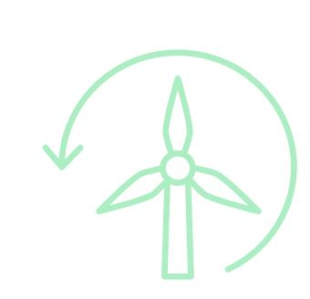

**Figure Description:**
The image features a stylized icon of an electric wind turbine. This symbol is composed of two main elements: a green circle with a white arrow pointing upwards from its center, suggesting motion or energy flow; and a depiction of three blades within the circle, which are typically associated with wind turbines. The overall design conveys themes related to renewable energy, specifically electricity generated by wind power. There are no visible texts or numbers that provide additional context or information about the specific model or capacity of the depicted wind turbine. The style of the image appears to be simplistic and modern, using minimal lines and shapes to convey the concept clearly.

### Goal

Match 100% of the electricity consumed by our global operations with renewable energy by 2025—five years ahead of our original target of 20[3010](#page-94-0)

# 100%

Of electricity consumed by Amazon was matched with renewable energy sources, up from 90% in 2022

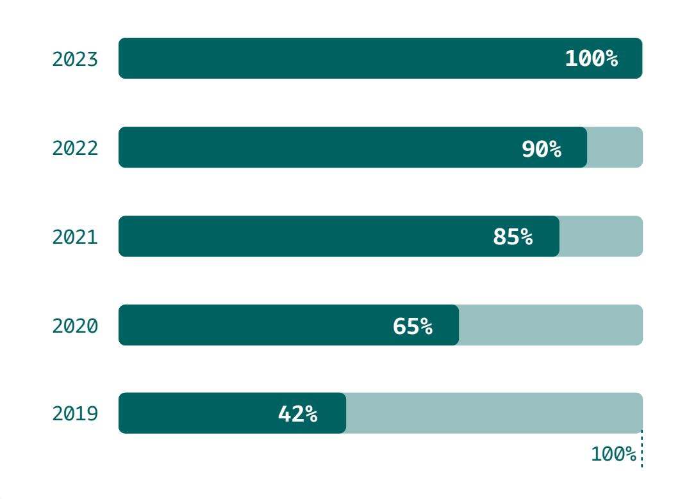

**Figure Description:**
The image is a horizontal bar chart with five bars of varying lengths, each representing a different year from 2023 to 2019. Each bar has two pieces of information: a percentage value above it and a numerical value below it. Starting from the left, here's how the data is presented:

- For the year 2023, there are two percentages provided: "100%" at the top and "65%" at the bottom. This suggests that for whatever metric or category being measured (not specified), the value for 2023 was initially set at 100%, but as of the time the chart was created, it had been reduced to 65%.
  
- Moving rightward, we see another pair of numbers for the year 2022. Here, the initial value is also "100%," which indicates that the measurement for 2022 started at full capacity or maximum value. However, by the end of the period shown, the actual value has decreased to "85%."
   
- In 2021, the initial value remains at "100%," but the final value drops significantly to "42%."
    
- For 2020, the initial value is again "100%," but the final value is only "65%."
     
- Finally, for the year 2019, both the initial and final values are identical at "42%."
      
The specific nature of the measurements (e.g., sales growth, project completion rate) is not clear from the image alone. Additionally, without context, it's unclear why some years have higher percentages than others or if these percentages are cumulative over time.

# Actions

Largest corporate purchaser of renewable energy in the world for the fourth year in a row, according to BloombergNEF

# 500+

Renewable energy projects announced across 27 countries, representing more than 28 gigawatts (GW) of carbon-free energy capacity, up from 401 projects in 2022 and 274 in 2021

# 1.3 GW

Energy storage capacity, up from 445 megawatts (MW) in 2022

# \$12B

Economic value that Amazon's solar and wind farm investments helped generate in communities around the world

# 39K+

Full-time-equivalent jobs created in 2022 as a result of Amazon's global solar and wind farm investments

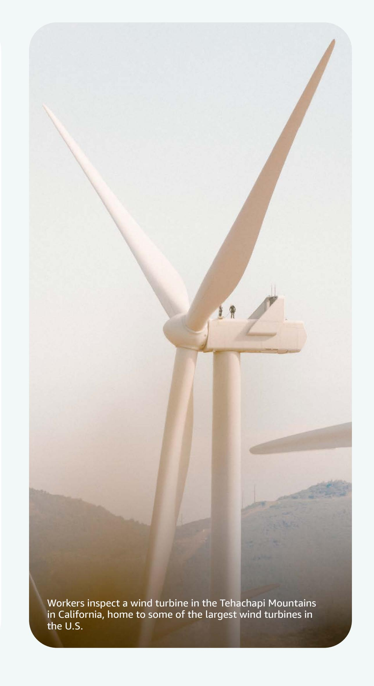

**Figure Description:**
The image is a photograph of a wind turbine against a clear sky with mountains visible in the background. The turbine has three blades that are angled upwards towards the right side of the frame. There is text overlaying the image which provides information about the wind turbine: "Workers inspect a wind turbine in the Tehachapi Mountains in California, home to some of the largest wind turbines in the US." This suggests that the location depicted in the photo is significant for its use of large-scale wind energy infrastructure. However, there are no specific numerical values provided within the context of the image itself.

**Figure Description:**
The image displays a stylized graphic of an abstract smiley face with a curved line forming its mouth shape. This design is simple yet recognizable as a representation of happiness or positivity. There are no texts present within the image itself. The background is plain white, which contrasts with the green color used for the smiley face's outline. The style of the image appears to be minimalistic and modern, using flat colors without any shading or depth effects. It could potentially be associated with branding, user interface elements, or emoticons due to its simplicity and universally recognized symbolism.

# Our Approach

We use broad carbon-free energy options to support our continued growth, enabling us to deploy and grow new technologies such as artificial intelligence (AI). By scaling carbon-free energy, we aim to make Amazon a more resilient and more sustainable business, drive a global transition to cleaner energy, and achieve our commitment to The Climate Pledge to reach net-zero carbon emissions by 2040.

Carbon-free energy includes existing renewable energy technologies, such as wind and solar farms and on-site rooftop solar systems, as well as nuclear reactors that generate carbon-free energy and other sources such as hydroelectric and geothermal. It also includes site energy contracts and green tariffs with local utilities that result in new wind and solar projects being added to the grid. There is not a one-size-fits-all solution when it comes to transitioning to carbon-free energy, and we believe that all viable and scalable options should be considered.

Shifting to carbon-free energy requires a targeted, multifaceted approach. We are taking action to achieve our goals in the following ways:

**• Energy efficiency:** We innovate to continuously improve the energy efficiency of our operations and devices. We're also improving data collection and analysis to better understand our operational energy requirements. This informs our carbon-free procurement decisions and energy optimization initiatives.

**Learn more** about how we are [increasing](#page-16-0) [energy efficiency](#page-16-0)

**• Scaling renewable energy projects:** We invest in onsite renewables through rooftop solar installations on buildings we operate, as well as in off-site renewables through power purchase agreements (PPAs) that fund new utility-scale wind and solar projects. We also participate in green tariff programs with utilities and pursue new renewable projects through competitive site energy contracts. Renewable energy certificates in the U.S. and Guarantees of Origin in the EU help us bridge the gap between project inception and operation—when the project actually starts to power our buildings or feed renewable energy into the grid.

- **• Energy storage solutions:** We are expanding battery energy storage capacity to support the decarbonization of electricity grids.
- **• Diversifying carbon-free energy sources:** In addition to wind and solar, we are exploring and investing in other carbon-free energy sources, such as nuclear, that can help match the electricity consumed by our operations for the long term as our business grows.
- **• Partnerships and advocacy for carbon-free energy solutions:** We engage in partnerships, industry initiatives, and public policy advocacy to advance access to and the expansion of carbon-free energy for Amazon, our customers, and the communities where we operate.

As part of our commitment to The Climate Pledge, we set two renewable energy goals that are central to our broader carbon-free energy approach: to match all the electricity consumed by our operations with 100% renewable energy and to invest in wind and solar capacity equal to the electricity used by all active Echo, Fire TV, and Ring devices worldwide. Additionally, we're asking our suppliers to use more renewable energy, engaging product and device suppliers to set goals to decarbonize their own operations, and working with suppliers on initiatives to reduce their greenhouse gas (GHG) emissions.

Wind and solar will continue to be a critical piece of our energy strategy as we expand our investments into additional forms of carbon-free energy, including nuclear. We'll continue to evaluate our energy strategy to meet the needs of our customers and achieve our commitment to reach net-zero carbon emissions by 2040.

**Learn more** about our approach in our [Renewable](https://sustainability.aboutamazon.com/renewable-energy-methodology.pdf) [Energy Methodology](https://sustainability.aboutamazon.com/renewable-energy-methodology.pdf)

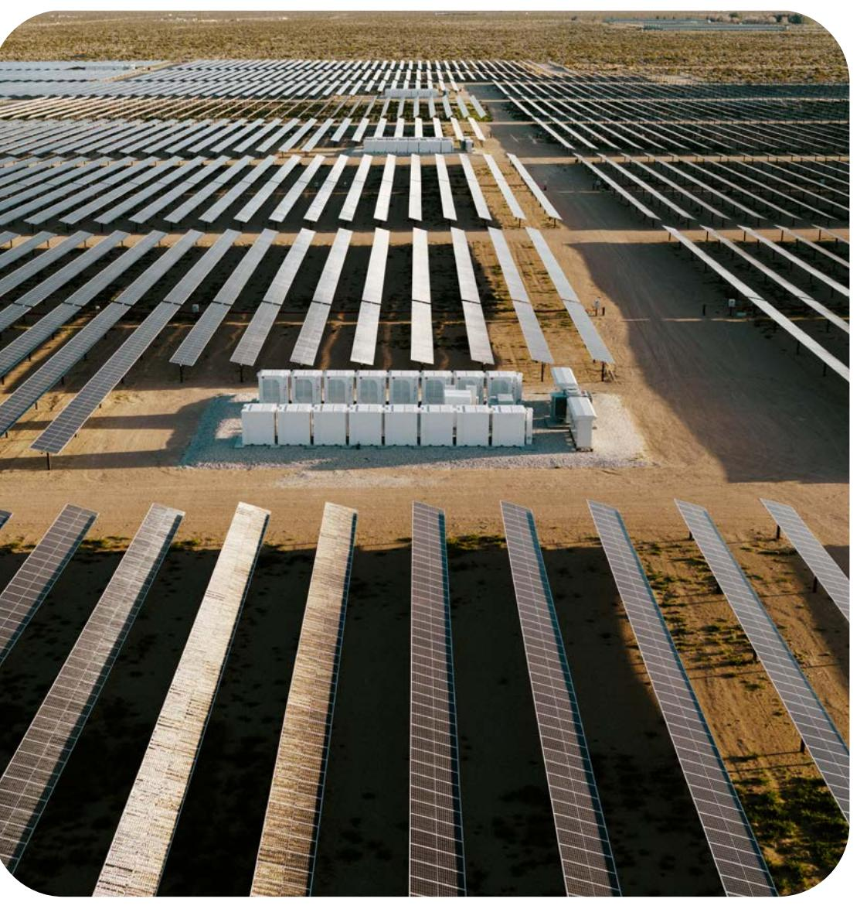

**Figure Description:**
The image depicts a large-scale solar power plant with numerous photovoltaic panels arranged in rows that are currently not generating electricity due to the time of day or weather conditions. In the foreground, there is a central area where several white structures resembling electrical transformers or switchgear can be seen, which would likely manage the flow of electricity from the solar panels to the grid. These structures have numerical labels: "10 MW" indicates a capacity rating for the facility, suggesting it has the potential to generate up to ten megawatts (MW) of electricity at full operation; "365 kWh/year" represents an annual energy production estimate, implying that under optimal conditions, the plant could produce approximately 365 kilowatt-hours per year; and "24 hours/day" signifies continuous operation throughout the day and night.

The background shows vast open land with sparse vegetation, indicating a desert environment typical for many utility-scale solar installations. There's no visible text other than these numerical indicators. The style of the image appears to be a promotional or informational photograph intended to showcase the scale and efficiency of renewable energy infrastructure.

The Baldy Mesa Solar and Storage Project in Adelanto, California (developed and operated by AES), represents one of the solar projects that we added to our portfolio that includes storage capacity.

# Our Progress

# Scaling Renewable Energy

In 2014, Amazon made our first investment in a renewable energy project at a time when corporate procurement for solar and wind power was just beginning. In 2019, we set an ambitious goal to match 100% of the electricity we use with renewable energy by 2030. This goal includes all data centers, logistics facilities, physical stores, and corporate offices, as well as on-site charging points and our financially integrated subsidiaries. We are proud to have achieved this goal in 2023, seven years early, with 100% of the electricity consumed by Amazon matched with renewable energy sources, up from 90% in 2022. This achievement is an important step on our journey to achieve net-zero carbon emissions by 2040, and we will continue to focus on reducing emissions through carbon-free energy as part of our commitment to The Climate Pledge.

Our journey has included enabling major solar, wind, and battery storage projects around the world, including the first wind farm in Mississippi, and becoming the first corporate

### **As of January 2024, Amazon had announced:**

513 Global renewable energy projects

243 Utility-scale wind and solar projects

270Solar rooftops at our facilities and stores

**Figure Description:**
The image displays a stylized graphic of a smiley face with an upward-curving line representing a smiling mouth. To the right of the smiley face is a curved arrow pointing upwards to the left. There are no visible texts or numbers within the image. The style of the image appears to be simple and iconographic, commonly used for logos or branding due to its universally recognized symbolism for happiness and positivity.

# Amazon Renewable Energy Projects\*

Projects announced as of January 2024.

| Project Location     | Number of Projects | Total MW Capacity† |
|----------------------|-----------------------|-----------------------|
| Australia            | 7                     | 389                   |
| Austria              | 1                     | 0.03                  |
| Belgium              | 1                     | 1                     |
| Brazil               | 2                     | 172                   |
| Canada               | 4                     | 875                   |
| China                | 4                     | 450                   |
| Finland              | 9                     | 439                   |
| France               | 7                     | 40                    |
| Germany              | 6                     | 678                   |
| Greece               | 1                     | 24                    |
| India                | 50                    | 1,141                 |
| Indonesia            | 1                     | 210                   |
| Ireland              | 3                     | 205                   |
| Italy                | 27                    | 148                   |
| Japan                | 13                    | 114                   |
| Netherlands          | 1                     | 380                   |
| New Zealand          | 1                     | 51                    |
| Poland               | 4                     | 142                   |
| Saudi Arabia         | 1                     | 2                     |
| Singapore            | 2                     | 64                    |
| South Africa         | 2                     | 28                    |
| South Korea          | 1                     | 60                    |
| Spain                | 79                    | 2,983                 |
| Sweden               | 5                     | 787                   |
| United Arab Emirates | 1                     | 3                     |
| United Kingdom       | 36                    | 901                   |
| United States        | 244                   | 17,706                |
| Total                | 513                   | 27,993                |

purchaser to invest in renewable energy projects in countries such as Indonesia, Poland, and South Africa. This led us to purchase more renewable energy than any other corporation in the world.

Collectively, these projects represent 28 gigawatts (GW) of renewable energy capacity, making Amazon the world's largest corporate purchaser of renewable energy for the fourth year in a row. Once operational, these projects are expected to generate more than 77,000 gigawatt-hours (GWh) of renewable energy each year—enough energy to power 7.3 million homes for a year and an increase of 35% from 57,000 GWh in 2022.

In 2023, we announced investments in more than 100 new solar and wind energy projects, expanded our renewables portfolio into 27 countries, including adding projects in Canada, Greece, and South Korea, and launched new renewable energy projects in 17 U.S. state[s.11](#page-94-0)

## Utility-Scale Wind and Solar Projects

Altogether, Amazon had 243 utility-scale wind and solar projects, including 42 newly operational ones, in 2023. We have also signed 274 PPAs as of January 2024 that will collectively add 3.7 GW of clean energy to the grid, bringing our total contracted clean energy generation to 27 GW. Additionally, Amazon participated in two green tariff agreements in 2023. These allow commercial and industrial customers to buy bundled renewable electricity from a specific project through a special utility tariff rate.

We expanded our renewable energy footprint across the southeastern U.S. in new ways in 2023, including by adding five new solar and wind projects, bringing our total number of renewable energy projects in the region to 30. Our latest projects include Mississippi's first utility-scale wind farm and multiple solar farms in states such as Arkansas and Georgia. Once fully operational, these projects are expected to generate more than 7,500 GWh of renewable energy. We also started producing renewable energy from nearly 5,600 rooftop solar panels installed at the Amazon Air Hub at the Cincinnati/Northern Kentucky International Airport. This

system is expected to generate enough energy to power roughly 400 average-sized homes per year.

In 2023, Amazon announced 39 new renewable energy projects across Europe, adding more than 1 GW of renewable energy capacity to grids in the region. Our total capacity of renewable energy in Europe is now 7 GW, including 1.7 GW of renewable energy from offshore wind. Offshore wind turbines are an important source of renewable energy due to the volume they produce and their reliability, as winds tend to be higher and more consistent at sea. In January 2024, Amazon signed a corporate PPA with the low-carbon energy and services company ENGIE to increase our share of output from the Moray West offshore wind farm in Scotland to 473 megawatts (MW) once the site becomes operational in 2024.

Amazon also accelerated renewable energy investments across the Asia-Pacific region in 2023, including by adding 24 new utility-scale solar and wind projects to our portfolio. We unveiled three new utility-scale renewable energy projects in India, including a 198 MW wind farm in Osmanabad. In China, we announced two new wind farms in Daqing and Bobai. We also invested in new solar projects in Japan, New Zealand, and Australia.

Along with bringing new renewable energy sources to market, these solar and wind farm projects generate economic growth in local communities around the world. To track the benefits that these projects deliver, Amazon developed an industry-leading economic model that follows guidance from the U.S. Department of Energy's National Renewable Energy Laboratory and was independently validated by Oxford Economics. The model estimates the investment generated by the construction and operation of utility-scale solar and wind farms, including direct economic effects (hiring and spending by the developer) and indirect effects (hiring and spending by suppliers and workers). The model found that from 2014 through 2022, Amazon's solar and wind farms generated over \$12 billion in community investments around the world and supported 39,000 fulltime-equivalent jobs at direct suppliers and at businesses in Amazon's downstream supply chain globally in 2022 alone.

**Learn more** about the model in the [Economic Impact of](https://sustainability.aboutamazon.com/economic-impact-of-renewables-methodology.pdf)  [Amazon Investment in Renewables Methodology](https://sustainability.aboutamazon.com/economic-impact-of-renewables-methodology.pdf)

# On-Site Solar Projects

In 2023, 50 new on-site solar energy systems became operational at our facilities and stores, adding 58 MW of capacity. Altogether, these solar energy projects generate an estimated 123,000 MWh and avoid roughly 47,500 metric tons of carbon dioxide equivalent (CO₂e) each year.

We launched our first on-site solar array with energy storage projects in Bakersfield and San Bernardino, California, in 2023. Additionally, we reached our first on-site solar array deals in Ohio and in Belgium and Saudi Arabia. These projects bring the total number of rooftop solar projects across Amazon and Whole Foods Market facilities to 270, with a total capacity of 344 MW. Altogether, these projects avoid roughly 17 million metric tons of CO2e each year.

# Data Centers Powered with Renewable Energy

Amazon's energy supply from utilities, combined with the renewable energy we procure globally, means that 100% of the electricity consumed by 22 AWS data center regions is matched with renewable energy sources—an increase from 19 regions in 2022.‡

Across Amazon, we work with utilities and regulators on green tariffs so that more companies can buy clean energy directly from renewable energy projects. In eastern Oregon, for instance, AWS partnered with Umatilla Electric Cooperative—the utility serving AWS data centers in the area—to create a first-of-its-kind deal structure in the state that allows AWS to directly choose the energy supply powering its data centers, including renewable energy sources.

Also in Oregon, Amazon's investment in the Gilliam County wind farm is expected to add capacity by replacing older wind turbine blades and equipment with modern technology, allowing for more efficient production of wind energy. This investment builds on Amazon's 2023 announcement that we

**Figure Description:**
The image displays a stylized graphic of a smiley face with an upward-curving line representing a smile. The color scheme consists mainly of shades of green, with darker tones used for the outline and lighter tones filling the interior spaces. There are no visible texts or numbers within the image itself. The style is simplistic and appears to be designed as a logo or emblem rather than a detailed illustration. It conveys a sense of happiness or positivity through its simple yet recognizable design.

\* This table includes both on-site solar and contracted off-site utility-scale wind and solar projects, which are in various stages of development and construction. 29 of the projects included in the table were announced in January 2024.

† Total annual expected MW capacity when operational.

‡ AWS aims to procure renewable electricity in the same grids where it consumes electricity. In certain cases (e.g., renewable energy in the same grid is not available), AWS may procure renewable energy attributes in other locations.

will work with local utilities to power AWS data centers in eastern Oregon with renewable energy.

## Brownfield Solar Projects

There is an emerging opportunity to repurpose previously polluted, unused land to deliver economic and environmental benefits for local communities. Brownfields are pieces of land that have been abandoned due to pollution, such as mines, factories, and landfills. The U.S. Environmental Protection Agency estimates that more than 450,000 brownfields could be revitalized for solar energy projects across the country. Brownfields are often located near power lines and public roads, making it easier to connect these types of projects to the grid.

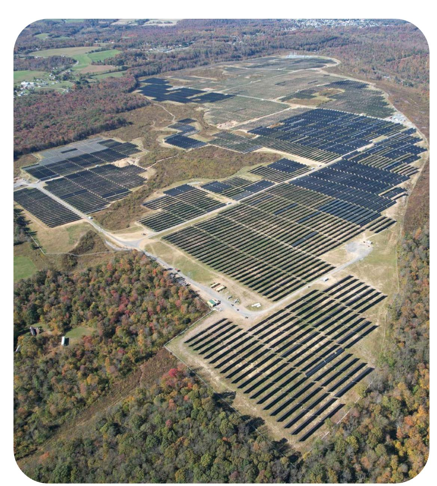

**Figure Description:**
The image depicts an aerial view of a solar farm with numerous rows of photovoltaic (PV) panels installed on the ground. Each row is composed of multiple PV modules that are connected to form larger units or strings. These strings are then interconnected through a series of wiring systems to collectively the generated electricity from the entire array.

The layout suggests a well-planned design for optimal energy production, taking into account factors such as sunlight exposure, shading, and land topography. There appears to be a grid pattern with some irregularities due to natural features like trees and uneven terrain.

In the lower right corner of the image, there's a legend indicating the scale of the solar farm: "100 MW." This value represents the total capacity of the solar installation, which translates to one gigawatt-megawatt (GWh). It means that under ideal conditions, the solar farm could potentially generate up to 1 GWh of electrical power per year.

Additionally, there are two numerical values provided within the image: "25" and "37," likely representing specific sections or blocks of the solar farm. These numbers might correspond to different operational zones or areas designated for maintenance or monitoring purposes. However, without further context, their exact meaning remains unclear.

Overall, the image provides a comprehensive overview of a large-scale renewable energy project, highlighting its size, organization, and potential output.

Brownfield solar projects repurpose previously polluted land into solar farms.

In 2023, we announced plans to support the repurposing of a previously polluted Maryland coal mine into a solar farm. Amazon Solar Farm Maryland–CPV Backbone is under construction at the site of the recently closed Arch Coal Mine in Garrett County, Maryland. More than 1,100 acres of coal refuse once contaminated this 120-year-old mining site, and this land has since been reclaimed.

The project is expected to employ more than 200 skilled workers during peak construction activities and provide millions of dollars in local tax revenue. Once completed, it is expected to be the largest solar farm in Maryland. Featuring more than 326,000 solar panels, Amazon Solar Farm Maryland–CPV Backbone will avoid more than 64,000 metric tons of CO2e each year—the equivalent of taking more than 13,900 cars off the road.

## Diversifying Carbon-Free Energy Sources

As the demand for energy increases around the world, we are expanding our investments in carbon-free energy solutions, including nuclear. For example, in early 2023, we purchased a nuclear-powered data center in Pennsylvania that is directly powered by the adjacent Susquehanna Steam Electric Station.

Nuclear energy is a strong option that already has a proven track record of providing a constant source of reliable power for communities around the world. Nuclear energy is the most reliable, abundant, and stable energy source on the grid, and Amazon's investment in nuclear power is part of our broader efforts to decarbonize the energy sector, and our business.

# Energy Storage Solutions

We invest in energy storage to collect and save renewable energy for use when other energy sources may be unavailable—such as at night or during periods of high demand—and to help improve grid stability. In 2023, we added seven solar projects paired with battery energy storage systems to our portfolio in the U.S. We now hold 1.3 GW of storage capacity, up from 445 MW in 2022.

# Partnerships and Advocacy for Carbon-Free Energy Solutions

# Supporting a More Just, Equitable, and Sustainable Clean Energy Transition

As the world's largest corporate renewable energy purchaser, we have a unique role to play in supporting a more just, equitable, and sustainable clean energy transition. As a founding member and active participant in Beyond the Megawatt—an initiative from the Clean Energy Buyers Association (CEBA)—we are helping scale results-oriented clean energy procurement strategies that put energy grid resiliency, social equity, and environmental protection at the forefront of solar and wind transactions. Beyond the Megawatt partners with energy customers, energy and service providers, nongovernmental organizations, academia, researchers, community organizations, and other businesses to help ensure a diversity of stakeholder voices are represented as we shift toward carbon-free energy. In 2023, we participated in CEBA's equity and resilience working groups, which produced industry-wide guidance on incorporating biodiversity and social benefit standards into PPAs.

# Scaling Up Carbon-Free Energy

To advance the transition to carbon-free energy within our supply chain, Amazon helped found the Clean Energy Procurement Academy (CEPA) with other leading companies in 2023. CEPA supports the adoption of clean energy by suppliers through training and online educational resources. The academy's founding organizations pooled their expertise and internal resources to design a shared training curriculum and delivery processes. Through our collaborative efforts with fellow members and suppliers, this initiative aims to rapidly advance clean energy procurement, address Scope 3 emissions, and decarbonize global supply chains.

We also co-founded the Emissions First Partnership (EFP), a coalition of companies committed to modernizing GHG

accounting standards for the power sector, as part of our efforts to decarbonize power grids. Through our work with EFP, we have continued to advocate for updated carbon accounting guidelines for the Greenhouse Gas Protocol. These revised standards are designed to make carbon accounting more closely resemble the real-world carbon effects of an organization's actions. The standards will also provide more opportunities for organizations to invest in decarbonization initiatives such as clean energy projects especially in markets where there is the ability and resources to decarbonize the power system faster.

**Learn more** about how we are [working to decarbonize our](#page-20-0)  [supply chain](#page-20-0)

# Advocating for Improved Infrastructure and Policies

We have made significant progress in procuring renewable energy for our business, supply chain, and surrounding communities. However, there are a number of challenges to scaling up renewables, including project delays, long timelines due to interconnection queues, and the lack of a strong policy framework.

### **Supporting Grid Improvements**

The widespread transition to carbon-free power requires an upgraded and expanded electricity grid. In the U.S., insufficient transmission capacity is gridlocking renewable energy deployment. The demand for renewables is overwhelming—projects waiting to get on the grid exceed the system's overall capacity to support them. With a growing number of renewable projects in the pipeline, advancing policies and incentives to enable and encourage the much-needed build-out of the transmission system will be vital.

We recommended to the U.S. Federal Energy Regulatory Commission (FERC) that it require transmission providers to consider a broader array of transmission needs, including corporate commitments for renewable energy procurement. In 2023, we continued our work to require utilities and grid

**Figure Description:**
The image displays a stylized graphic of a smiley face with an open mouth, resembling a smile or laugh. The design is simple yet expressive, using solid colors without any additional details that might suggest facial features beyond the basic outline. The color scheme consists mainly of shades of green, which are used to fill in the shape of the smiling figure. There is no text present within the image itself. The style appears modern and minimalistic, likely intended for branding or as part of a logo due to its clean lines and lack of intricate detail.

planners to deploy grid-enhancing technologies. These technologies can unlock capacity for and improve efficiencies around renewable energy by reducing congestion on existing grid infrastructure. We are also working with a number of organizations, including PJM Interconnection, the regional grid operator for the mid-Atlantic, and the Rocky Mountain Institute, a nonprofit working to transform the global energy

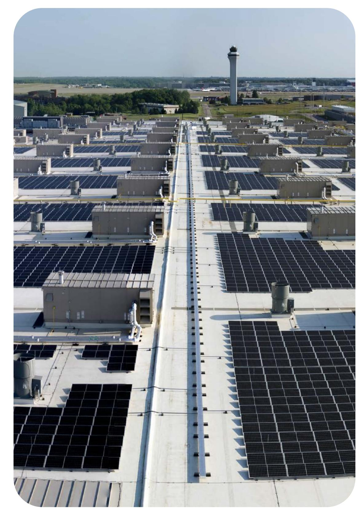

**Figure Description:**
The image shows an aerial view of a solar power plant with numerous photovoltaic (PV) panels installed on flat roofs. There are no visible texts or numbers that provide specific details about the installation's capacity, efficiency, or other technical data. However, we can observe several features:

1. **Solar Panels**: These are the black rectangular structures spread across the rooftops. They convert sunlight into electricity through the process of photovoltaics.

2. **Roof Structures**: The white surfaces beneath the PV panels appear to be concrete or metal platforms designed for supporting the weight of the solar installations.

3. **Electrical Cabling**: Black cables run along the edges of the roofs, connecting the individual PV panels together and likely leading to a central point where the generated electricity is collected and distributed.

4. **Tower**: In the background, there is a tall tower which could serve as a control center or part of the electrical infrastructure associated with the solar farm.

5. **Surrounding Environment**: The area surrounding the solar farm includes grassy areas and possibly some buildings or facilities at the edge of the frame.

6. **Weather Conditions**: It appears to be a clear day with good visibility, suggesting favorable conditions for solar energy generation.

The image does not contain any numerical information such as wattage ratings, panel count, or square footage of the solar farm. To determine these figures, one would need additional context or access to detailed operational data from the facility itself.

Our Amazon Air Hub located at the Cincinnati/Northern Kentucky International Airport is home to Kentucky's largest solar array, created in collaboration with Duke Energy.

system to secure a clean, prosperous, zero-carbon future, to improve capacity on existing lines and bring renewable energy to the grid at a much lower cost than that of traditional solutions.

We continued our advocacy work with U.S. regulators in 2023 to improve transmission planning, permitting, and interconnection processes, including calling for federal transmission permitting reform in Congress. We also joined advocacy groups such as Western Freedom and Renewable Northwest in support of their efforts to create an organized wholesale electricity market in the western U.S. Amazon publicly supported and advocated for SB-410 (Powering Up Californians Act), a new law to speed up utility interconnection processes, which passed in the California legislature with bipartisan support and was signed into law by the governor.

**Figure Description:**
The image displays a stylized graphic of an arrow pointing upwards with a lightning bolt shape at its tip. To the right side of the arrowhead is the number "4" written in bold black font against a white background. Below the number "4," there are two horizontal lines that appear to be part of the design or possibly representing some form of measurement or scale. There is no additional context provided within the image itself, so it's unclear exactly what the numbers and lines signify. The style of the image suggests it could be related to branding, marketing materials, or a logo for a company or product named "Four." However, without more information, any interpretation remains speculative.

### **Anticipating Future Energy Demand Powered by AWS**

AWS is collaborating with Duke Energy, which operates the largest electrical grid in the U.S., to build new smart grid software and services that anticipate future energy demand and identify where and how to update the power grid. By running on AWS, Duke Energy's Intelligent Grid Services will provide more accurate forecasting of electricity needs in a matter of minutes, rather than the weeks it would take with traditional information technology hardware. This in turn enables Duke Energy to make smarter decisions, including about where to replace equipment or implement non-wire alternatives, which are electrical grid investments intended to defer or eliminate the need to construct or upgrade components.

### **Promoting Robust Renewable Energy Policies**

We work with decision-makers around the world to advance policies that scale up renewable energy. In 2023, we backed a new global renewable energy goal, urging world leaders at COP28 to triple renewable energy capacity to at least 11,000 GW by 2030.

In the U.S., we are focusing on accelerating the addition of new renewable energy projects to the grid. In 2023, we advocated for grid planners to be required to prioritize projects that are "ready to be brought online," instead of projects that submitted queue applications first. FERC adopted this shift to a "first-ready, first-served" model in 2023. We also encouraged the Bonneville Power Administration in the Pacific Northwest to adopt firstready, first-served queue reforms, which they did in 2024, facilitating increased production of clean energy across the region. In Ireland, we encouraged the Commission for Regulation of Utilities (CRU) to create a pathway for offshore wind projects to be delivered through corporate purchasing. CRU agreed and extended the timeline for offshore wind projects to be available for corporate buyers such as Amazon.

Because permitting for renewable energy projects is one key factor delaying clean energy deployment, we are working with legislators, advocacy organizations, and corporate partners to drive permitting efficiencies across Europe and help reduce delays. In Poland, we called for policymakers to loosen restrictions on permitting and locating wind projects as its government works to increase the amount of renewable energy on its grid. As a result of our and others' work, Poland's government partially reduced its permitting restrictions in 2023, allowing more renewable energy projects to be developed there.

In addition, AWS is collaborating with WindEurope and Accenture to develop EasyPermits, a digital permitting solution running on AWS that increased the efficiency of the administrative permitting process, enabling shortened permitting timelines to help the EU meet its 2030 renewable energy targets. EasyPermits is a secure webbased cloud solution that addresses key challenges faced by permitting agents and project developers to increase

the speed and amount of renewable energy on the grid. This tool is currently available to support onshore wind projects, has been successfully tested in two municipalities in Denmark, and will continue to scale to support carbonfree energy policy objectives. Through our Danish pilot, EasyPermits reportedly enabled concurrent processing of up to three times as many permit applications and delivered a 50% reduction in administrative workload by improving transparency and information management.

Our advocacy to scale renewable energy extends around the globe. In Japan, Amazon worked with third-party organizations to advocate for virtual PPAs, allowing corporate buyers to increase the number of projects that will be built through their own initiatives. In South Africa, we partnered with the City of Cape Town to pilot a "power wheeling" project. Power wheeling uses the city's transmission or distribution system to distribute energy between different grids or service areas. As a result of the pilot, energy customers in the city can now invest in and access renewable energy projects.

# Looking Forward

We remain focused on scaling carbon-free energy across our company and the communities we operate in. In 2024 and beyond, we will continue to add more carbon-free energy generation and storage capacity to our portfolio as we scale up new technologies such as AI and work toward our goal to achieve net-zero carbon by 2040. This will include investing in more solar and wind energy projects, such as our [Moray](https://www.aboutamazon.co.uk/amazon-engie)  [West offshore wind farm in Scotland](https://www.aboutamazon.co.uk/amazon-engie) , and nuclear projects. As we progress toward decarbonizing our business, we will also engage with our partners, industry associations, and regulators around the world to scale our work, share what we've learned, and advocate for infrastructure and policies that help create a carbon-free energy future. We've always said that the path to net-zero carbon won't be linear. As with any long-term goal, we'll continue to evolve our strategy over time to do what is right for our business and the planet, to meet the needs of our customers, and to reach net-zero carbon by 2040.

**Figure Description:**
The image displays a stylized graphic of a smiley face with an upward-curving line for the mouth and two curved lines forming the eyes. The color scheme consists mainly of green shades, which are used to fill both the outline of the smiley face and its interior. There is no text present within the image itself. The style appears to be simplistic and iconographic, commonly associated with logos or branding due to its minimalist design. The background is plain white, which contrasts sharply with the darker tones of the smiling face.

# Packaging

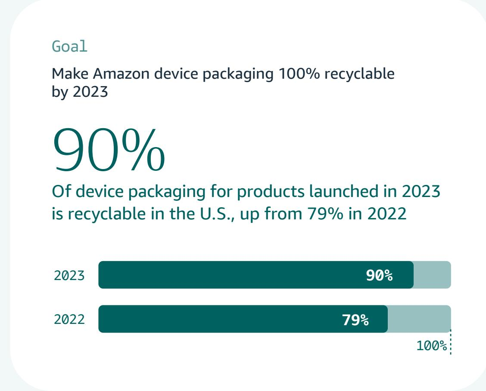

**Figure Description:**
The image is a digital graphic with a white background featuring text and numerical data. At the top of the image, there's a heading that reads "GOAL1" followed by a subtitle stating "Make Amazon device packaging 100% recyclable by 2023." Below this, there are two bars representing percentages: one bar indicates "90%," suggesting an achievement or progress towards a goal, while the other shows "79%," indicating a lower level of achievement. Both bars have a green color scheme, which might imply success or completion rates. To the right of these bars, there's additional information provided as "OF DEVICE PACKAGING FOR PRODUCTS LAUNCHED IN 2023 IS RECYCLABLE IN THE U.S., UP FROM 79% IN 2022." This suggests that the percentage has increased from 79 to 90 between 2022 and 2023 for products launched in 2023. The numbers are presented in bold black font against the green bars, making them stand out. The overall style of the image appears to be informational, likely used for reporting purposes related to environmental sustainability goals set by Amazon.

Every day, we ship millions of orders around the globe, working hard to make sure our products reach customers safely and with the least amount of packaging necessary. Our customers want rightsized, recyclable packaging that minimizes waste and ensures damage-free delivery, which is why we aim to avoid unnecessary packaging whenever possible. When this is not an option, we optimize the type, material, and weight of our packaging to increase circularity, avoid waste, and reduce carbon emissions—without sacrificing safety or functionality.

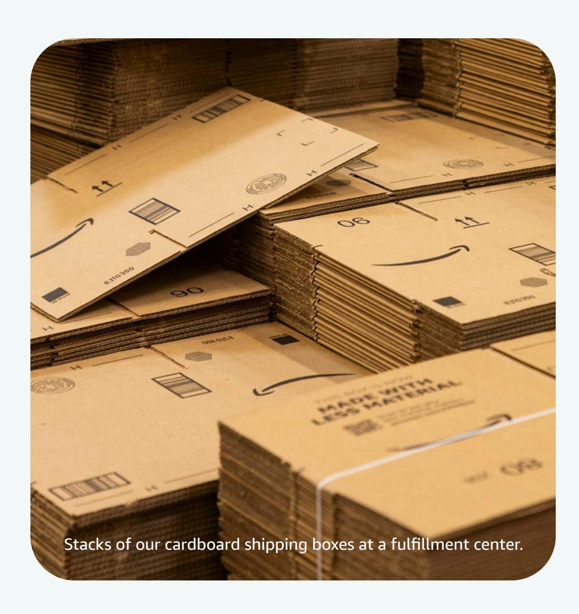

**Figure Description:**
The image shows a collection of cardboard boxes with various numbers printed on them. These numbers are likely to be inventory or order tracking codes. Each box has multiple numeric digits visible; however, without additional context, it's not possible to determine their specific meaning within the business operations that these boxes might be part of. The text "Stacks of our cardboard shipping boxes at a fulfillment center." is overlaid on the image, suggesting that the photo was taken inside a facility where packages are prepared for shipment. This indicates that the boxes are used as packaging materials for products being shipped out from the location.

# Actions

**Figure Description:**
The image displays a simple geometric figure consisting of three-dimensional cubes stacked vertically with their sides aligned to form a single cube shape. Each side of each cube is outlined by a thin green line that creates a flat appearance against the white background. There are no visible texts or numbers within the image. The style of the image appears to be minimalistic and iconographic, commonly used for logos or symbols representing concepts such as storage, data, or digital information due to its resemblance to a computer's memory unit (RAM).

100%

Of outbound plastic delivery packaging, including plastic air pillows, was replaced with 100% household-recyclable paper filler at Amazon's first U.S. automated fulfillment center, in Euclid, Ohio, in October 2023

9%

Decrease in average single-use plastic packaging weight per shipment across Amazon's global operations network compared to 2022

43%

Reduction in average per-shipment packaging weight in the U.S., Canada, and the EU since 2015, representing 3 million metric tons of packaging material avoide[d12](#page-94-0)

80K+

Metric tons of single-use plastic packaging avoided globally since 2020

99.7%

Of mixed-material mailers, which contain both plastic and paper, replaced with recyclable paper alternatives in the U.S. and Canada

12%

Of packages globally shipped without additional Amazon packaging as part of the Ships in Product Packaging progra[m13, 14](#page-94-0)

 Nearly

12M

Products qualified for the Ships in Product Packaging program

100%

Of packaging material in Europe and India is household recyclable

**Figure Description:**
The image displays a stylized graphic of a smiley face with an open mouth, suggesting happiness or positivity. The color scheme is minimalistic, featuring shades of green against a white background. There are no visible texts within the image itself. However, there appears to be some text outside the main graphic area that reads "100%," which could indicate a percentage value related to the content or context of the image. Without additional information, it's unclear exactly what the number represents; it might refer to a completion rate, satisfaction score, or another form of measurement. The style of the image is clean and modern, likely intended for use as a logo, icon, or emoji-like representation.

# Our Approach Our Progress

Amazon takes a science-based approach to packaging that combines lab testing, machine learning, materials science, and manufacturing partnerships to optimize our packaging. We think locally, taking into consideration factors such as location and geography, average delivery distance to customers, vehicle type, and delivery method. As we regionalize our network, products travel shorter distances to customers and need less protective packaging. We move quickly to invest in responsible shipping and packaging innovations that can scale our program to ship products without additional packaging.

As we continue to learn and evolve our packaging strategy, we focus on the following priorities:

- We avoid unnecessary packaging whenever possible through our Ships in Product Packaging program and work with suppliers to re-engineer their packaging to qualify for the program.
- **•** When supplemental Amazon packaging is required, we select lighter, right-sized options to reduce our packaging footprint while still protecting the item. We use artificial intelligence (AI) to optimize packaging types—from bags to boxes—and sizes, depending on the level of protection needed.
- **•** We prioritize materials that are household recyclable. We are also working on innovations and solutions to avoid single-use plastics, and we're reporting on our progress.
- **•** We work across the public and private sectors to create and scale recyclable and biodegradable materials, find circular solutions, and improve recycling infrastructure globally.

# Ships in Product Packaging

Many products can be shipped safely without protection from additional Amazon delivery bags or boxes, which is the main idea behind our Ships in Product Packaging program. Through this program, we deliver eligible items in the manufacturers' original packaging without supplemental Amazon delivery packaging, allowing us to avoid unnecessary material use and reduce the weight of deliveries. Our aim is to continue to increase the number of products shipped through the program so that we can further reduce our packaging use and avoid incremental carbon emissions associated with additional materials and weight.

As we focus on shipping more items without additional delivery bags or boxes, we've challenged ourselves to ship some of the most complex products without additional packaging—such as TVs, glassware, and toys. We are able to then use those learnings and apply them to less complex products that may need only small adjustments to qualify for the Ships in Product Packaging program. As we set new standards required to qualify for the program, we're also able to identify and onboard products that do not need any adjustments.

Amazon works with suppliers to [re-engineer their](https://www.amazon.com/b?node=118664311011) [packaging](https://www.amazon.com/b?node=118664311011) to qualify for the program and expand the eligibility of products. For example, we worked with Hasbro to design a sturdier package for the Hasbro Galactic Heroes BB-8 Adventure toy that is 81% smaller, contains 20 fewer components, and is eligible for the Ships in Product Packaging program.

To make sure that our customers are aware of this program, we let them know a product is shipping in its own packaging at checkout on Amazon websites in the U.S., Canada, and Europe. We also give customers the option to add Amazon packaging if desired.

**Learn more** about the [Ships in Product Packaging](https://www.amazon.com/ref=sustainabilityabout/b?node=118664316011) [program](https://www.amazon.com/ref=sustainabilityabout/b?node=118664316011)

## Around the World

In 2023, nearly 12 million products qualified for the Ships in Product Packaging program, and 12% of Amazon packages globally were shipped without additional packaging, including 13% in the U.S. and Canada, 9% in Europe, 3% in Japan, 19% in India, and 8% in Brazil, Mexico, and Singapore. This progress is a result of continuing to identify products that qualify for the program, working with selling partners to make packaging updates that allow their products to ship in their original packaging, and implementing regionalization. The last is Amazon's new delivery approach that utilizes shorter routes across the U.S., expanding eligibility for products to ship in their own packaging without risking damage.

**Learn more** about [regionalization](#page-13-0)

# Inspiring Selling Partners to Reduce Packaging

Our Ships in Product Packaging program doesn't just offer environmental benefits. Less packaging also means lower costs, and Amazon believes in sharing these cost savings with our selling partners. In 2023, we tested decreasing the cost of [Fulfillment by Amazon](https://www.amazon-packaging.com/sellers) (FBA) for sellers who adopt the program. In early 2024, we expanded this fee reduction to all FBA sellers with eligible products. The program is available to sellers in seven marketplaces: Canada, France, Germany, Italy, Spain, the UK, and the U.S.

## 2023 Delivery Packaging by Region

| Region          | Ships in Product Packaging Flexibles |     | Corrugated Boxes |
|-----------------|--------------------------------------------|-----|---------------------|
| Europe          | 9%                                         | 47% | 44%                 |
| U.S. and Canada | 13%                                        | 51% | 36%                 |
| India           | 19%                                        | 38% | 43%                 |
|                 |                                            |     |                     |

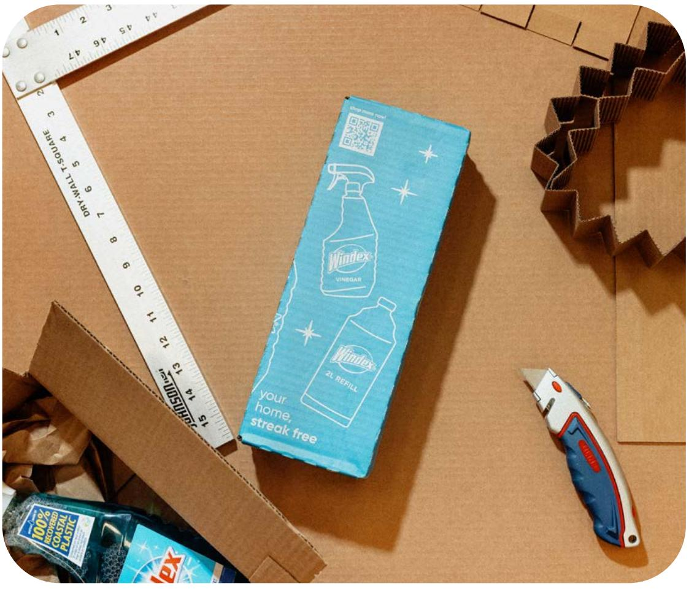

**Figure Description:**
The image shows a collection of items laid out on a cardboard surface with various patterns and textures visible beneath it. In the center is a blue plastic bottle labeled "Windex" with an illustration of two stars above the brand name. To its left, there's a white ruler marked with centimeters (cm) along one edge and millimeters (mm) along the other, indicating measurements for reference or construction purposes. On the right side of the image, partially obscured by the box, is a small object that appears to be a pair of scissors with red handles and silver blades. Below the scissors, there are two bottles: one is a clear plastic bottle with a label reading "100% RECYCLABLE," suggesting environmental consciousness; the other has a blue label with white lettering stating "HOME STRAIGHT FREE." This implies that the product inside might be related to home improvement or maintenance tasks. Additionally, there is a piece of paper with QR code at the top right corner, which could potentially lead to more information about the products when scanned using a smartphone camera. The overall scene suggests someone may have been organizing their tools or materials, possibly preparing for some DIY project or cleaning task.

Amazon works with companies such as Windex to help re-engineer their packaging to qualify for the Ships in Product Packaging program.

**Figure Description:**
The image displays a stylized graphic of a smiley face with an open mouth shape that resembles a smile or laugh. The color scheme consists mainly of green tones, which are likely intended to convey a sense of freshness or natural energy. There is no text present within the image itself. The style appears modern and minimalistic, using simple shapes and lines to create the impression of a smiling face. This type of imagery could be associated with various brands or products related to happiness, well-being, or positive emotions. However, without additional context, it's difficult to determine the exact meaning or purpose behind this particular design.

# Optimizing with Lighter, More Flexible, and Right-Sized Packaging

We strive to keep our packaging lightweight and minimal while ensuring deliveries reach customers without damage. Lighter, more flexible, and right-sized packaging helps reduce delivery emissions per package by using less material and taking up less space in delivery vehicles. Since 2015, we have decreased our average per-shipment packaging weight by 43%, which represents more than 3 million metric tons of packaging materials avoided.

When possible, Amazon uses lightweight packaging by prioritizing flexible paper bags and envelopes. In the U.S., these flexible options are up to 89% lighter than similarsized rigid corrugated boxes. With millions of products and an infinite number of order combinations, identifying the optimal packaging solution to keep each order safe during transit represents a significant challenge. That is why we use machine learning algorithms to determine the most efficient option for each order we fulfill.

Data scientists trained an AI model to understand a variety of product features, including shape and durability, and to analyze customer feedback on how different packaging options have performed. The model is constantly learning and has helped reduce our use of packaging material since it launched in 2019.

Machine learning algorithms also help us determine the best fit for orders with multiple items, so we can decrease empty space in boxes. Optimized shipments require less space in the vehicles that deliver packages to our customers, helping reduce the number of vehicles on the road.

Another way Amazon uses machine learning is to optimize the suite of cardboard box options at any one facility. Our web-based tools help identify and select a facility's suite of shipping box types based on the order patterns unique to that facility.

# Amazon Delivery Packaging by Type

We aim to increase the number of products that ship in the manufacturers' original packaging without additional packaging, as well as select lighter, right-sized options to reduce our packaging footprint.

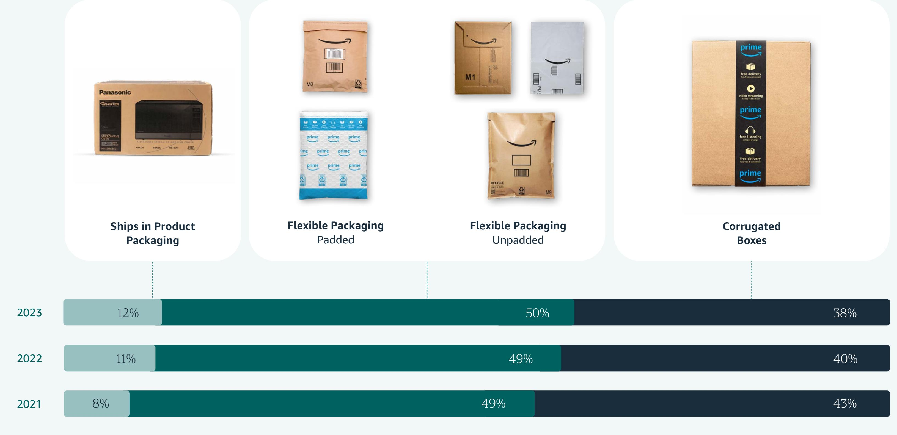

**Figure Description:**
The image is a colorful infographic that compares various packaging options based on their flexibility, product padding, and corrugated box features. It appears to be from an e-commerce or logistics context, showcasing different types of shipping packages with accompanying percentages indicating how well each type meets certain criteria.

At the top left corner, there's a label "Shipping in Product Packaging" which suggests that the focus is on how products are packaged for shipment rather than the actual shipping method itself. Below this title, four distinct packaging styles are displayed:

1. A brown cardboard box labeled "Flexible Packaging," showing a percentage value of 48% next to it. This indicates that flexible packaging has a high level of adaptability.
2. An Amazon Prime logo followed by a white background and a black border around a package, suggesting a premium service associated with this packaging style. There is no numerical value provided here.
3. Another brown cardboard box labeled "Unpadded Boxes," also without any numerical value shown.
4. A third brown cardboard box labeled "Corrugated Boxes," again without a numerical value indicated.

On the right side of the infographic, three additional boxes are presented, each representing a different packaging option:

5. A blue and white striped box labeled "Flexible Packaging Padded," accompanied by a percentage value of 16%. This implies that while flexible packaging can be adapted, adding padding increases its effectiveness.
6. A similar blue and white striped box labeled "Product Padding," but without a percentage value.
7. A green and gray striped box labeled "Corrugated Boxes Unpadded," with a percentage value of 35%, implying that unpadded corrugated boxes have a lower level of protection compared to other methods.

The bottom part of the infographic shows a horizontal bar chart comparing these packaging options across three years (2022, 2023, and 2024). Each year has two bars corresponding to the Flexible Packaging and Corrugated Boxes categories, respectively. The bars indicate varying levels of satisfaction or preference, as suggested by the labels "Satisfaction" and "Preference." For instance, in 2022, the satisfaction with Flexible Packaging was at 12%, while Corrugated Boxes had 9%. In contrast, the preference for Flexible Packaging increased over time, reaching 49% in 2024, whereas Corrugated Boxes saw a decrease in preference, ending up at 48% in 2024.

Overall, the infographic provides visual data about consumer preferences and satisfaction rates related to different packaging methods used in e-commerce.

Data represents shipments from the Amazon fulfillment network fulfilled through Amazon-owned and -operated fulfillment centers across Canada, France, Germany, Italy, the Netherlands, Poland, Spain, Sweden, the UK, and the U.S.

**Figure Description:**
The image displays a stylized graphic of a smiley face with a curved line forming its mouth. This design is commonly associated with emoticons or emojis used to convey emotions or reactions in digital communication. There are no visible numbers within the image itself. If you have any specific questions about the image that do not involve numerical data, feel free to ask!

## 2023 Packaging Use by Region

| Region          | Average Packaging Weight per Shipment (g/shipment) | Metric Tons of Packaging Material Eliminated |
|-----------------|----------------------------------------------------------------|-------------------------------------------------------|
| Europe          | 96                                                             | 34,817                                                |
| U.S. and Canada | 111                                                            | 33,529                                                |
| India           | 112                                                            | 9,910                                                 |

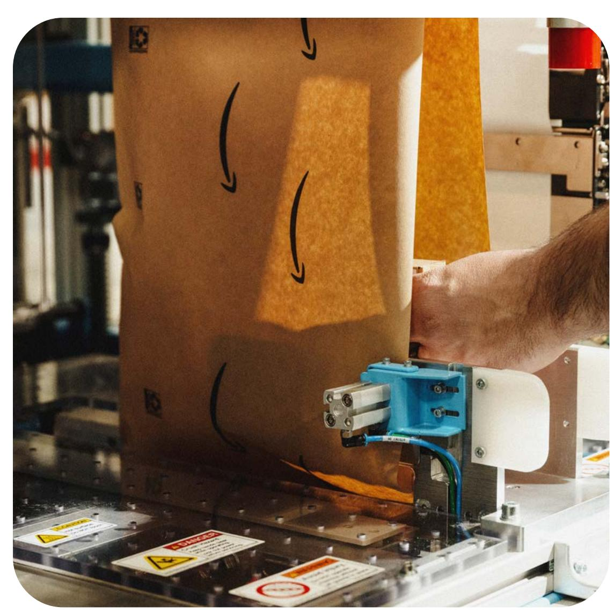

**Figure Description:**
The image depicts a scene from an industrial setting where a person is operating machinery that appears to be involved in packaging or manufacturing processes. In the foreground, there are several cardboard boxes with black arrows pointing upwards; these could indicate directions for stacking or handling the items within the boxes. Behind the boxes, there's a machine with various components visible, including a blue part that seems to be connected by wires to another component. There's also a red lever positioned near the top right corner of the frame.

The focus of the image is on the hands of the individual operating the machine, which are holding onto a piece of paper or material being processed through the equipment. This suggests that the worker may be adjusting settings or monitoring the operation of the machinery.

In terms of numeric values, there isn't any text providing specific numbers or measurements directly related to the content of the image. However, if we consider the context of the image as it relates to the machinery and its operations, one might infer that certain numerical parameters could be relevant, such as speed settings, temperature controls, or other operational variables. These would typically be found on control panels or digital displays associated with the machinery, but they are not explicitly shown in the image provided.

We're testing new packaging machines in Europe and the U.S. that build made-to-fit paper bags around individual items on demand.

# Phasing Out Single-Use Plastics and Using More Recyclable Packaging

Amazon is working to reduce our use of single-use plastic packaging in favor of household-recyclable alternatives. Like most retailers, Amazon has traditionally used a mix of plastic and paper packaging to optimize for durability, weight, and size. However, recycling plastic packaging generally requires customers to visit a drop-off location. To make recycling our packaging as easy as possible, our packaging engineers have been researching and experimenting for years to ensure we find the right solutions to deliver more products to customers with household-recyclable paper.

These packaging reduction initiatives have made a significant impact, decreasing our average plastic packaging weight per shipment by 9% across Amazon's global operations network, building on a 17% reduction in 2022. Altogether, we have avoided 80,500 metric tons of single-use plastic packaging since 2020. Efforts so far include our Ships in Product Packaging program, leveraging AI to identify where we can use lighter, more flexible, right-sized packaging, replacing single-use plastic delivery packaging with 100% householdrecyclable paper and cardboard packaging in our fulfillment network in Europe, and eliminating single-use, thin-fil[m](#page-94-0)  plastic packaging from our fulfillment network in India.15 While these reduction initiatives have slowed our plastic packaging use, our total plastic packaging increased 3% from 86,055 metric tons in 2022 to 88,698 metric tons in 2023 due to our business growt[h.16](#page-94-0)

Additionally, in October 2023, we announced our first automated U.S. fulfillment center to eliminate plastic delivery packaging as part of our multi-year effort to eliminate plastic delivery packaging from our North America fulfillment centers. In June 2024, we announced a major milestone for this effort, removing 95% of plastic air pillows

from delivery packaging in North America, working toward full removal by end of year. This will avoid the use of nearly 15 billion plastic air pillows annually and will be our largest plastic packaging reduction effort in North America to date. We will continue to build and test new innovations and improve on the systems we have in place in order to decrease our use of single-use plastic packaging and share updates on the progress we're making.

While recycling infrastructure varies around the world, we remain dedicated to designing packaging that is easier to recycle where such programs exist, while considering localized, country-specific challenges and how to solve them as part of our ongoing approach.

## Europe

In 2023, we announced that 100% of delivery packaging in Europe—the boxes, bags, and envelopes needed to get products to customers—was household recyclable, including for items sold by Amazon and third-party selling partners that use FBA. In total, 87 European fulfillment centers have stopped using plastic packaging for deliveries.

## United States and Canada

In 2023, we expanded our use of household-recyclable paper-padded bags across the U.S. and Canada, replacing 99.7% of padded bags containing both plastic and paper. This change has helped us avoid nearly 41,600 metric tons of single-use plastic since 2020. We also transitioned 13 fulfillment centers from plastic to paper for dunnage, the durable packing material used to protect goods during shipping. Furthermore, we are investing in research and development to identify better paper alternatives for the rest of our packaging suite.

## India, Japan, and Rest of World

Since Amazon replaced thin-film single-use plastic packaging

## Single-Use Plastic Packaging by Region

| Region          | Single-Use Plastic Packaging Used in 2023 (MT) | Single-Use Plastic Packaging Avoided since 2020 (MT) |
|-----------------|------------------------------------------------------------|------------------------------------------------------------------|
| Europe          | 877                                                        | 14,600                                                           |
| U.S. and Canada | 83,513                                                     | 41,600                                                           |
| India           | 1,015                                                      | 9,100                                                            |
| Japan           | 931                                                        | 13,400                                                           |
| Rest of World17 | 2,362                                                      | 1,800                                                            |
| Total           | 88,698                                                     | 80,500                                                           |
|                 |                                                            |                                                                  |

material with paper- and cardboard-based packaging across our India fulfillment network in 2019, we have avoided a total of 9,100 metric tons of plastic packaging in the country. In addition, 100% of delivery packaging material is household recyclable in India as of the end of 2023.

In Brazil, Egypt, Mexico, Saudi Arabia, and the United Arab Emirates, Amazon stopped using dunnage, including air pillows, in most boxes. When we do still need to use dunnage to secure products during shipping, we're increasing our use of packaging made with recycled materials. For larger shipments that require dunnage, we are working toward replacing air pillows with paper alternatives.

In Japan, 99.5% of delivery packaging material is household recyclable as of the end of 2023. We anticipate that all sites in this country will participate in this program by the end of 2024. In 2023, Amazon removed plastic shrink-wrap film and replaced plastic cushioning materials, such as air pillows,

**Figure Description:**
The image displays a stylized graphic of a smiley face with an upward-curving line for the mouth. This design is commonly associated with emoticons or emojis used to convey emotions or reactions in digital communication. There are no visible texts within the image that provide additional context or information about the specific meaning intended by the use of this symbol. The style of the image suggests it could be part of a branding logo, a social media icon, or a similar type of visual representation meant to evoke positive feelings such as happiness or satisfaction.

with paper-based dunnage in Japan, except when packaging fragile items and gift packages. We are also in the process of switching from plastic packaging tape to paper tape.

Since 2021, Amazon has utilized automated paper-bag packaging machines in Japan to optimize packaging size and material use and increase household recyclability. We expanded this practice to Australia in 2023.

# Minimizing and Optimizing Packaging in Grocery

To make sure groceries ordered from Amazon and Whole Foods Market arrive in good condition, we look for ways to protect products during delivery while still minimizing our packaging footprint.

In 2023, Amazon Fresh reduced our use of insulation packaging material, which avoided approximately 1,180 metric tons of packaging. Similarly, Whole Foods Market avoided 1,300 metric tons of packaging by using daily variable insulation, a practice that tracks and adjusts the amount of insulation packaging used in deliveries in North America to ensure it is used only when temperatures exceed a specific threshold.

Groceries are also being delivered in packaging that is easier to recycle. In 2023, the grocery delivery packaging used by Amazon Fresh was 88% recyclable by weight.

Whole Foods Market published an updated version of its Packaging Guidelines in 2023 to help merchants, procurement teams, and suppliers understand how to make more sustainable choices for product packaging. In alignment with the Whole Foods Market Sustainability Strategy, these guidelines are meant to reduce the amount of packaging it uses, improve the source material, and design for end-oflife and lower greenhouse gas (GHG) emissions. Smarter packaging choices can also help reduce food waste and divert packaging waste from landfills. Whole Foods Market's Packaging Guidelines are grounded in four core concepts (or "Principles") aimed at balancing safety, performance, and

sustainability: material safety, material performance and efficiency, design for recovery, and source responsibly.

# Increasing the Recyclability of Device Packaging

Amazon's strategy to optimize and increase the recyclability of packaging extends to our devices. In 2020, we set an ambitious goal to make our device packaging 100% recyclable by 2023—a first for the consumer electronics industry. To work toward this goal, we collaborated with our suppliers to develop paper-based wraps and films that protect devices and are compatible with paper recycling streams. These paper-based wraps are recyclable in the U.S. where recycling programs are available.

In 2023, 90% of our new devices and accessories launched with packaging that is 100% recyclable in the U.S., up from 79% in 2022. We have made significant progress, but we have not yet created recyclable packaging for heavier items, such as Fire TVs. The box for Fire TVs is recyclable, but we still include foam cushioning and bags to protect the device when it is shipped, and these are not yet recyclable. Amazon remains committed to using recyclable device packaging and to inventing recyclable solutions for heavier items, such as Fire TVs, that properly protect the device while maintaining our high bar for quality.

# Partnerships to Improve Packaging Materials, Circularity, and Recycling

Amazon works hard to reduce plastic packaging across our deliveries. However, in some cases, the right technologies and materials do not yet exist to adequately protect orders from physical damage or in specific weather conditions. To find alternatives that are waterproof, flexible, and safe enough for e-commerce deliveries and product packaging, our

scientists continue to collaborate with others to accelerate the innovation, deployment, and scaling of new lower-carbon and lower-waste materials.

## United States

We partner with industry peers and expert organizations, such as the Sustainable Packaging Coalition, to improve recycling infrastructure. Amazon also works with The Recycling Partnership (TRP) to help launch recycling programs in communities across the U.S. Our 2023 investment helped TRP start recycling programs that reached more than 36,000 households and recycled 1 million pounds of materials.

## Global

Together with Novamont, an Italy-based biomaterials company, Amazon is testing new ways to collect and recycle bio-based and biodegradable materials, such as nongenetically modified corn starch and vegetable oils. We co-invented an innovative recycling technology with the National Renewable Energy Laboratory through the U.S. Department of Energy's BOTTLE Consortium, creating an entirely circular loop for these material[s.18 In](#page-94-0) 2023, we piloted this solution in Italy and Spain and plan to use the learnings to improve the technology for future use.

We also joined the Global Organization for PHA (GO!PHA) in 2023. This coalition is working to drive the transition to a circular economy in which pollution-free alternatives to plastic are used in materials for packaging, single-use, and durable applications. Amazon contributes to various GO!PHA working groups, including Science & Technology and Policy, and collaborates on policy advocacy efforts.

In 2022, we became a member of the Australian Packaging Covenant Organisation (APCO), a nonprofit group leading the development of a circular economy for packaging in Australia. Along with setting the country's 2025 national packaging targets, APCO works to foster a collaborative packaging value chain in Australia.

We support the European Commission's goal to tackle excessive packaging via legislation such as the EU Packaging and Packaging Waste Regulation (PPWR). In Europe, we continue to improve our packaging using a science-based approach and will further reduce our environmental impact by investing in new materials, processes, and technologies that drive void and materials reduction at scale.

# Looking Forward

We remain committed to enhancing our packaging for both performance and sustainability. We will continue working to reduce our packaging footprint by increasing uptake of the Ships in Product Packaging program, leveraging machine learning and other innovative technologies to optimize packaging size and shape, and transitioning to more circular packaging materials instead of single-use plastics. In fact, in February 2024, we announced that nearly 50% of customer orders from our India fulfillment network [now come](https://www.aboutamazon.in/news/sustainability/amazon-india-reducing-packaging)  [with reduced or no added packaging](https://www.aboutamazon.in/news/sustainability/amazon-india-reducing-packaging) . We will also keep prioritizing our engagement with selling partners and largerscale coalitions to accelerate collective progress.

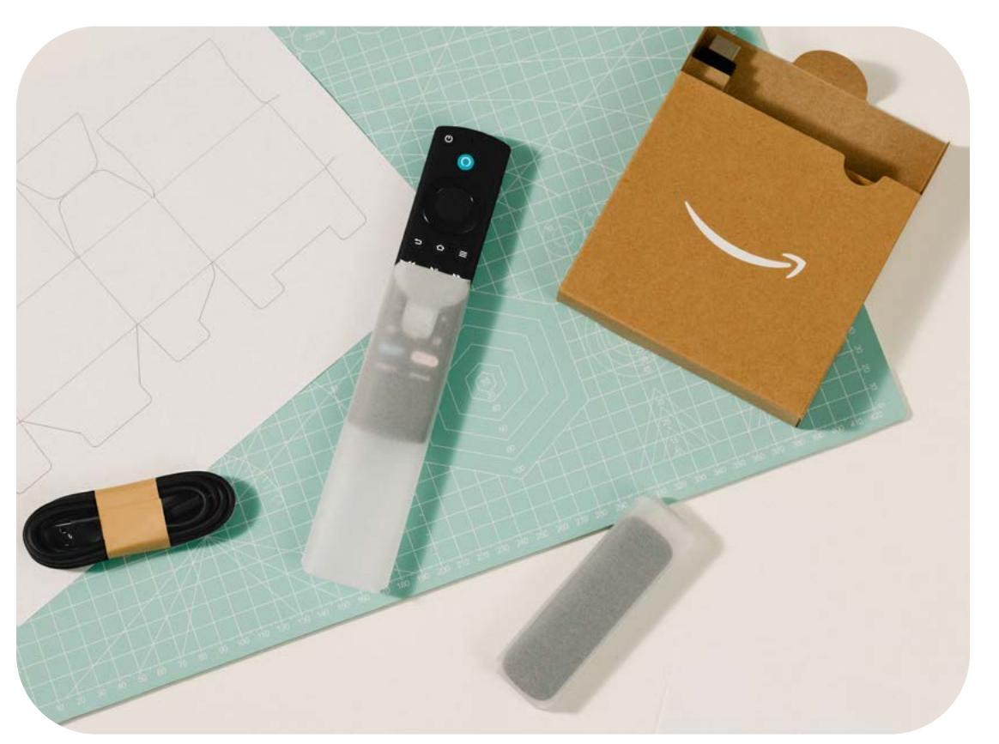

**Figure Description:**
The image displays a collection of items related to electronic devices or home entertainment systems. In the foreground, there is an Amazon Prime Video remote control with buttons labeled "Home," "Back," "Menu," "Select," "Up," "Down," "Left," "Right," "Volume Up," "Volume Down," "Mute," and "Number Pad." To its right, there's a cardboard box that appears to be from Amazon, as indicated by the recognizable logo and smile symbol. Below the box, there are two cables: one is black and coiled, while the other is white and straight. On the left side of the frame, partially visible, seems to be a roll of tape with a brown paper backing. The background features a green grid pattern, which could suggest a cutting mat or a similar surface used for crafting or DIY projects. There are no visible texts providing additional context about these objects. The style of the photograph is straightforward and product-focused, likely intended for commercial purposes such as advertising or showcasing new products.

We use paper-based wraps and films where we can to avoid plastic in our device packaging.

**Figure Description:**
The image displays a stylized graphic of a smiley face with an open mouth forming a curve that resembles a smile or a happy expression. The color scheme consists mainly of shades of green, which are used to fill the shape of the smiling face. There is no text present within the image. The style of the image appears to be simple and modern, likely intended for branding purposes given its clean lines and minimalistic design. The overall impression is one of positivity and happiness conveyed through the use of a universal symbol for joy.

# Waste and Circularity

Around the world, natural resource extraction and waste generation have grown significantly. In the last six years alone, the global economy consumed over half a trillion tons of materials—nearly as much as the materials consumed throughout the entire 20th centur[y.19 A](#page-94-0)s resources continue to be extracted, it is imperative for businesses to do all they can to prevent and reduce waste. At Amazon, we strive to be a responsible steward of our planet's finite resources. We know that contributing to a circular economy will help mitigate the effects of climate change, reduce biodiversity loss, and alleviate other global challenges by decoupling economic activity from resource consumption. With this in mind, we are working to increase what we resell, reuse, and recycle across our business and to reduce what we ultimately send to landfills.

### Goal

Reduce food waste by 50% across U.S. and Europe operations by 203[020](#page-94-0)

75%

Reduction in food waste intensity—a measure of food waste as a percentage of total food handled by weight—in Europe operations compared to a 2021 baseline

28%

Reduction in food waste intensity in U.S. operations compared to a 2021 baseline

# Actions

452

Whole Foods Market locations and 62 Amazon Fresh stores have active organics diversion programs to divert food waste

All final assembly sites worldwide for Echo, Kindle, Fire tablet, Fire TV devices, cables, and adapters achieved UL's Zero Waste to Landfill certification at Silver or bette[r21](#page-94-0)

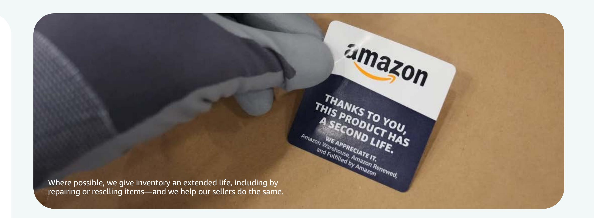

**Figure Description:**
The image shows a hand holding an Amazon gift card with text that reads "THANKS TO YOU THIS PRODUCT HAS A SECOND LIFE." Below this statement is another line of text stating "AMZON RENEWED," indicating that the product has been refurbished by Amazon. At the bottom of the card, there's additional information about warranty and fulfillment by Amazon. In the background, there appears to be a person wearing protective gloves, suggesting that safety precautions are being taken during handling or packaging. The overall style of the image seems to be promotional or informative, highlighting the benefits of purchasing used products from Amazon Renewed.

82%

Of all construction waste from the building of our second headquarters in Arlington, Virginia, was diverted from landfills

24%

More items were repaired worldwide in 2023 than in 2022

All device packaging sites in China achieved UL's Zero Waste to Landfill certification at Silver or better

14.6M

AWS hardware components were diverted from landfills by being recycled or sold into the secondary market for reuse

 Nearly

368M

Items were resold, liquidated, or donated in the U.S. and Europe by sellers with Amazon's help, a 42% increase compared to 2022

**Figure Description:**
The image displays a stylized graphic of a smiley face with an open mouth forming a curved shape that resembles a smile or laugh. The color scheme is minimalistic, featuring shades of green against a white background. There are no visible texts or numbers within the image itself. The style appears to be modern and simplistic, likely intended for branding or as part of a logo design.

# Our Approach

Our waste hierarchy sets out our guiding principles for preventing, managing, and reducing waste. Amazon has programs in place to optimize our inventory, reduce food surplus, and source materials that help us prevent waste in the first place. Where possible, we look for ways to reduce, reuse, recycle, or compost these materials.

We work hard to make it easy for customers to discover products they love. They usually do, but just like with any retailer, sometimes customers want to return something that they purchased from us. If customers do need to return something, Amazon strives to give items a second life through resale, donation, or recycling—in that order of priority. Returned items undergo inspection to determine whether they can be resold. We aim to donate items that cannot be sold, but when they are not suitable for sale, resale, or donation, often due to damage or expiration, we prioritize their recycling.

We amplify our efforts by considering how customers use our products through end-of-life and by providing them with opportunities to repair or resell products. Our circular approach keeps valuable resources in use longer, avoiding waste and reducing related effects such as carbon emissions and pollution.

We know that avoiding waste is an ongoing process and that we cannot do it on our own. We engage with suppliers to reduce waste related to our products, partner with other organizations to scale our efforts to transition to a more circular economy, and work with local municipalities to improve recycling infrastructure where we can.

# Our Approach to Managing and Preventing Waste

This hierarchy is an industry framework that guides our approach to managing and preventing waste. It moves from the most preferred option at the top to the least preferred at the bottom. Materials in this hierarchy may be recycled, reclaimed, or otherwise reused in some way and thus may not end up as waste in landfills. We use this framework to better manage our waste, pursuing opportunities that are more preferred before moving down the hierarchy.

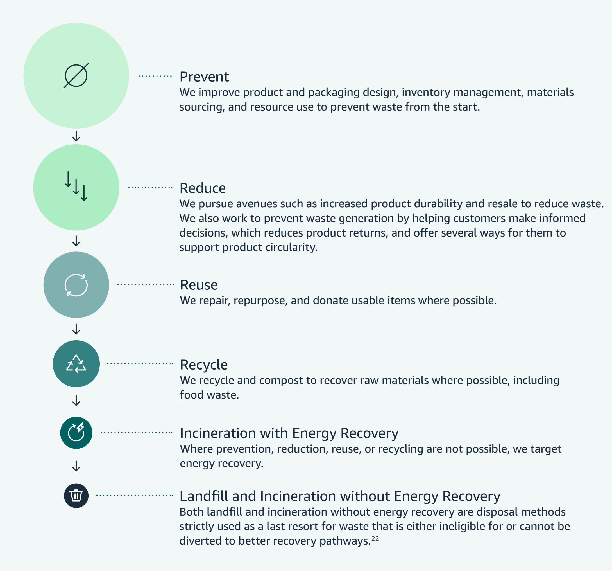

**Figure Description:**
The image is a flowchart that outlines steps to prevent waste from the start of product design through to energy recovery at the end of its life cycle. It's divided into three main sections: Prevent, Reduce, and Recycle. Each section has two sub-sections with circular arrows indicating a continuous process or loop.

In the "Prevent" section, there are two circles connected by an arrow pointing downwards. The first circle contains a symbol representing recycling, suggesting that preventing waste can be achieved through recycling efforts. The second circle shows a symbol for inventory management, implying that managing inventories effectively can also contribute to reducing waste.

The "Reduce" section includes one circle with a symbol for reduce waste, which indicates that actively working towards reducing waste generation is part of this stage. Another circle within this section displays a symbol for support product returns, and offers advice about decisions customers make informed by several ways to support them. This suggests that providing options for returning products can help reduce waste generated during customer interactions.

The "Recycle" section features two circles. One circle contains a symbol for recycling food waste, emphasizing the importance of recycling organic materials like food. The other circle highlights the need for incineration without Energy Recovery (Energy Recovery being a method where energy is extracted from waste before disposal). This implies that certain types of waste may require specialized treatment methods beyond traditional recycling processes.

At the bottom right corner of the chart, there's additional text stating "Landfill and Incineration without Energy Recovery," followed by a note that both landfill and incineration should not use as a last resort for waste that is either ineligible for or cannot be diverted to better recovery pathways."

Overall, the chart provides a structured approach to addressing waste issues throughout the lifecycle of a product, starting with prevention measures and ending with strategies for dealing with unavoidable waste.

**Figure Description:**
The image displays a stylized graphic of a smiley face with an upward-curving line representing a smiling mouth. To the right of the smiley face is a curved arrow pointing upwards to the left, suggesting movement or progression towards something positive. There are no visible texts within the image that provide additional context or information about the numeric values you mentioned. If there were any specific numbers or numerical representations intended for inclusion in the image, they would typically be placed alongside relevant textual explanations. However, without such accompanying elements, it's not possible to determine if there are any hidden or implied numeric values based solely on the visual content provided by the image.

# Preventing and Managing Waste

The waste we generate falls into two categories: internal and external. Internal waste is generated inside our operations, while external waste is generated both upstream and downstream of our operations, such as by suppliers and customers. Some of these items are diverted from waste streams by our prevention efforts, recycling programs, and other initiatives to reduce waste.

Our internal (direct) waste footprint includes:

- **• Operations:** Operational waste is the type of waste that we can most directly control. We manage operational waste generated across our business, including from our grocery stores and other retail sites, customer fulfillment operations, office buildings, and data centers. Waste from our internal operations falls into two categories:
  - **Inventory** waste includes heavily damaged and unsold items, customer returns that cannot be resold, donated, or recycled, and food that is no longer safe for consumption.
  - **Noninventory** waste is made up of resources that are used and discarded within our businesses. These materials enable our operations but are not directly part of the inventory of finished goods or materials used to produce them. Noninventory waste includes materials such as used cardboard boxes, shrink wrap, electronic waste, break room waste, used office furniture, and damaged storage equipment.

Our external (indirect) waste footprint includes the following areas:

- **• Customer** waste is generated during product use or in the form of product and delivery packaging, including when disposed of. Beyond the work we do to help customers keep items in use longer, we also offer several ways for them to support product circularity and prevent waste through our Amazon Second Chance program.
- **• Construction** waste comes from activities related to building our facilities. This consists mainly of commingled construction and demolition waste such as metals, masonry, asphalt, and drywall.
- **• Supply chain** waste is generated by third-party suppliers who manufacture products for, and provide goods and services to, our company.

**Figure Description:**
The image is a photograph featuring a person standing against a backdrop with various items displayed behind them. The individual appears to be holding multiple boxes or packages, suggesting that these are gifts being purchased for an event. They are wearing an orange top and dark pants. Above the person's head, there is text that reads "Save on top games consoles by shopping Second Chance this festive season!" This indicates that the photo may have been taken during a holiday season when discounted gaming consoles were available at a store named 'Second Chance'. In the background, there are shelves displaying video game-related products such as controllers and possibly other electronics or toys. The overall style of the image suggests it could be used for promotional purposes related to sales events or product advertisement. There are no visible numbers within the image itself; however, the context provided by the text implies a focus on savings or discounts associated with purchasing items from the mentioned store.

In November 2023, we opened a pop-up Second Chance Store in London, where customers could shop second-hand products from Amazon.

In 2023, we improved our ability to gather accurate, timely, and robust data. This allows us to enhance waste tracking and management as our business changes and as we add new sites and onboard waste vendors. One enabler of this progress was the creation of a central data collection tool that provides a single, companywide repository for internal waste data from our operations and activities. We also built a prototype forecasting tool to help us predict and plan for the future. We will continue to build these processes and tools throughout 2024.

Our Progress

# Food Waste

In the U.S., nearly 98% of Amazon's food handled goes to human and animal consumption, and in Europe, more than 99% does. While these figures are encouraging, we are always exploring new ways to reduce food loss and waste as we work toward our goal to reduce our food waste by 50% across our U.S. and Europe operations by 2030. This commitment is reflective of our membership in the [U.S. Environmental Protection Agency's Food Loss and](https://www.epa.gov/sustainable-management-food/united-states-food-loss-and-waste-2030-champions)  [Waste 2030 Champions](https://www.epa.gov/sustainable-management-food/united-states-food-loss-and-waste-2030-champions) , which we joined in 2020. We then extended our commitment to reducing food waste to our Europe operations in 2021. We measure our progress against this commitment with a food waste intensity metric that calculates the amount of food waste generated as a percentage of total food handled by weight within Amazon. As of December 2023, our food waste intensity had decreased by 28% in the U.S. and by 75% in Europe compared to a 2021 baseline.

To reduce food waste, we are improving our management and distribution channels and buying practices to minimize surplus food inventory. In 2023, we enhanced buying and

distribution channels for Amazon sites in the U.S. and Europe. We also work to reduce our surplus by offering discounts on items at risk of becoming waste. In 2023, we continued to improve our food-discounting technology so more food items are sold to customers. Amazon Fresh online launched a program in the UK, Germany, Spain, and Italy to sell items with reduced shelf life at a discount. On average, 65% of that discounted inventory ends up in the hands of customers. A similar program exists for Amazon Fresh stores in the U.S. Programs like these not only help our customers find food items at a lower price, but also contribute to our ambition to reduce food waste. We also donate surplus food items to local food banks and food rescue organizations.

**Learn more** about how we are [donating surplus food items](#page-69-0)  [to those who need them most](#page-69-0)

Where food waste is not preventable, we are working to keep it out of landfills. As of the end of 2023, 62 Amazon Fresh stores in the U.S. and Europe divert food waste to organic recycling services, including those that support composting or anaerobic digestion. In 2023, 452 Whole Foods Market locations had active organics diversion programs, which diverted over 87,000 tons of food waste from landfill.

We also advocate for policies that would help prevent usable food from being wasted. In 2023, Amazon and Whole Foods Market supported the U.S. Food Date Labeling Act because confusion around food expiration date labeling can result in usable food being unnecessarily thrown out. Our engagement included advocating to Congress for standardizing and clarifying expiration date labels on food as part of a coalition led by the World Wildlife Fund and the Zero Food Waste Coalition.

**Figure Description:**
The image displays a logo consisting of an abstract design that resembles a stylized smiley face or a simplified representation of a waveform. This graphic is predominantly green with some white space within it. To the right side of the logo, there are two numerical digits: "1" and "2." These numbers appear to be part of the overall branding or identity for whatever entity the logo represents. However, without additional context, it's not possible to determine their specific meaning or significance. The style of the image suggests it could be related to technology, software, or digital services due to its modern and clean appearance.

**Figure Description:**
The image displays a stylized icon that appears to be a checkmark within an enclosed circle or badge shape. Inside the circular boundary, there is a green outline with a lighter green fill, giving it a three-dimensional appearance. At the center of the icon, there's a darker shade of green forming a small circle. Within this central circle, there is a single white tick marking its interior. There are no visible texts or numbers on the icon itself. The style of the image suggests it could be used as a logo, emblem, or symbol for various purposes such as certification, approval, or quality assurance. However, without additional context, it's not possible to determine the exact meaning or purpose behind this particular design.

### **Unlocking New Insights through Continuous Learning**

As we continue on our journey to reduce waste including our commitment to reduce food waste by 50% in our U.S. and Europe operations by 2030—we are exploring different ways to learn and grow. As of the end of 2023, four Amazon Fresh facilities had achieved UL's Zero Waste to Landfill certification at Silver or Gold level.

We secured this certification by improving operational waste sorting processes, standardizing recycling practices at all sites, introducing new associate trainings, and establishing new diversion pathways, including for food waste. Through the certification process, we learned new ways of working and identified potential opportunities for Amazon. We are excited to leverage what we have learned to improve our overall waste footprint.

# Reducing and Managing Inventory and Customer Waste

## Prevent

When it comes to product inventory, our priority is to prevent waste, both by helping customers make more informed shopping decisions—which helps reduce customer returns—and by reducing the number of products damaged in handling.

**Reducing customer returns:** We want our customers to be able to use the product they ordered with the quality level they expect. Our Product Lifecycle Support (PLS) program provides support options for customers to get the most out of their purchase for eligible products. As of the end of 2023, Amazon's PLS program offered three free post-purchase care options: original equipment manufacturer (OEM) support and OEM repair, where customers can go straight to the manufacturer for support; Self Service, which helps customers address issues themselves; and parts replacement, where customers can request available components to replace damaged or missing parts, free of charge. In 2023, the PLS program helped avoid the return of more than 11 million items in the U.S. and Europe, up 50% from 2022. Amazon Private Brands also launched a spare parts and repair program in Europe in 2023.

We have learned that customers are more likely to keep an apparel item when a size is recommended for them. That is why we developed a deep learning-based algorithm to recommend, in real time, the best-fitting size for a customer. In 2023, our size recommendation system analyzed over 500 million data points every day and generated nearly 3 billion size recommendations each month for millions of customers across 19 countries around the world, including the U.S., India, and the UK.

**Learn more** about our [artificial intelligence \(AI\)-driven](https://www.aboutamazon.com/news/retail/how-amazon-is-using-ai-to-help-customers-shop) [size recommendations](https://www.aboutamazon.com/news/retail/how-amazon-is-using-ai-to-help-customers-shop)

**Reducing damage:** We work hard to ensure our customers do not receive products that have been damaged in handling or during transportation. In 2023, we established a specialized team to analyze instances of damage across our global warehouse operations. Analyzing this data at a global level identified opportunities to implement technology and process changes to reduce damages. The resulting global warehouse damage-reduction plan led to a 21% decrease in damage intensity (how many products are damaged for every product we handle) worldwide in 2023.

## Reduce and Reuse

Where possible, we give inventory a second life. We repair or resell items whenever possible and help our sellers do the same.

**Reducing overstock:** Before we remove overstock from our inventory, we try to sell it at a deep discount on our Amazon Outlet storefront. When we cannot sell these items, inventory is returned to vendors or sold to wholesalers to be offered on secondary markets.

**Repair and resell:** We carefully inspect and evaluate all returned and undelivered items at our Amazon return centers. If returned items meet Amazon's high bar for sale as new, we re-list them.

For items that are not eligible for re-listing as new but meet Amazon's standards to be sold as used, we (or our specialized repair vendors) test, clean, repair, and repackage them prior to re-listing the item for sale. We continue to expand our repair capabilities, repairing 24% more products worldwide in 2023 than in 2022. Amazon customers viewing items listed for sale as used will see a condition (e.g., Like New, Very Good, Good, Acceptable) and reason(s) for the condition (e.g., missing a user manual, cosmetic damage), allowing them to make the appropriate purchasing decision.

**Learn more** about how [Amazon manages returns](https://www.aboutamazon.com/news/retail/what-happens-to-amazon-returns)

**Amazon Second Chance:** Our Amazon Second Chance program helps customers give their items a second life. For example, Amazon Trade-In lets customers trade in thousands of qualifying Amazon or non-Amazon devices in the U.S., the UK, and Germany for a gift card or promotional discount. When customers buy a pre-owned device, it extends that item's life, reducing e-waste and raw material extraction. In 2023, customers traded in over 1 million devices. Amazon devices that are traded in by customers are evaluated to determine their condition. Some undergo refurbishment, and those that meet our quality bar for resale may be sold as Amazon [Certified Refurbished devices](https://www.amazon.com/b/ref=s9_acss_bw_cg_devicecp_7b1_w?node=8497978011&pf_rd_m=ATVPDKIKX0DER&pf_rd_s=merchandised-search-7&pf_rd_r=AFBMANA1XNX6727R46PT&pf_rd_t=101&pf_rd_p=7552ba54-b025-4c70-b942-1c25430f71d6&pf_rd_i=2102313011) or as used through [Amazon Warehouse](https://www.amazon.com/Amazon-Warehouse/b/?ie=UTF8&node=10158976011&ref_=sv_gb_4) .

**Learn more** about [Amazon Trade-In](https://www.amazon.com/b/ref=ti_surl_tradein?ie=UTF8&node=9187220011)

**Figure Description:**
The image displays a stylized graphic of an arrow looping around to form a circle with a line extending from it towards the top right corner. Inside the circle is a simplified representation of a shirt or t-shirt, depicted as two rectangles connected by a curved horizontal line that suggests the neckline of the garment. There are no visible texts within the image. The style of the image appears to be a logo or icon commonly used for recycling clothing items. The colors used are green and white, which may suggest environmental consciousness related to reusing clothes. However, without additional context, the specific meaning behind these elements remains open to interpretation.

### **Amazon Second Chance Store**

In November 2023, Amazon opened a pop-up Second Chance Store in central London, where shoppers could buy quality returned, refurbished, and open-box items in-person. More than 6,500 shoppers visited our store, browsing for kitchen and household appliances, books, games and toys, electronics, and more. While the physical Second Chance Store was temporary, customers can benefit from our Second Chance program online year-round.

**ReCommerce for Amazon sellers:** When returned items are not eligible for resale as new or used, those items are returned to sellers, liquidated, donated, or recycled. ReCommerce is the selling of previously owned items to buyers who reuse, recycle, or resell them. We provide ReCommerce services to Amazon sellers by grading their returned items and enabling recovery through programs such as grade and resell, liquidation, or donation. In 2023, we helped sellers resell, liquidate, or donate nearly 368 million of their items in the U.S. and Europe, a 42% increase compared to 2022.

**Donation:** We donate items that are safe to use but remain in our inventory after we try to reuse, resell, or repair them. In 2023, we donated or helped our sellers donate over 162 million items worldwide.

# Recycle

Inventory that is not resold or donated may still be used, reused, or reclaimed through our inventory recycling program. We leverage existing recycling streams where possible and work closely with recycling partners to find

**Figure Description:**
The image displays a stylized graphic of a smiley face with an upward-curving line representing a smiling mouth. This design is commonly associated with emoticons or emojis used to convey emotions or reactions in digital communication. There are no visible texts or numbers within the image itself. If you have any specific questions about the style, colors, or other aspects of the image that do not involve numerical data, feel free to ask!

Carbon

Carbon-Free Energy

Packaging

Waste and Circularity

Appendix

Water

ways to recycle new types of materials. The result of successfully using, reusing, or reclaiming inventory via our recycling program is diversion of these inventory items from landfills and incineration.

If a customer's device is not eligible for our Amazon Trade-In program, the Amazon Recycling Program provides the customer with a shipping label to send their device to be recycled and safely disposed of at a licensed recycling facility.

# Reducing and Managing Noninventory Waste

Noninventory waste is made up of the materials we use to run our businesses, including cardboard packaging, shipping pallets, plastic stretch film, and paper labels. Our goal is to segregate these materials as much as possible so they can be more easily recycled. Cardboard is one of our largest noninventory waste streams, so we work closely with third-party recycling partners, including the companies that we source our cardboard packaging from, to recycle these materials.

### In 2023, we:

- Improved our ability to collect and consolidate
  waste data from our vendors. This gives us a better
  understanding of our footprint and has allowed us to
  identify opportunities to increase waste diversion rates
  across our complex business.
- Increased our rate of operational waste diverted from disposal, placing emphasis on recycling and composting.
- Expanded our recycling efforts to include hard-torecycle materials such as adhesive label backing, bulk cargo bags, and even personal protective equipment (such as masks and gloves).
- Replaced single-use cardboard shipping containers with reusable outbound carts to reduce cardboard waste at certain sites.

**Learn more** about our partnerships to improve recycling  $\exists$ 

# AWS Circular Economy

AWS embraces circular economy principles for its server racks by designing reusable and lower-carbon rack systems from the outset. In addition, AWS works to keep equipment operating efficiently and to recover value from securely decommissioned equipment through reuse, repair, and recycling. By working to maximize resource value for as long as possible, AWS reduces waste generation from its global operations, decreases the use of raw materials, and reduces carbon emissions across its supply chain.

### Design Better

For its server racks, AWS concentrates on avoiding excess material such as steel or plastic, increasing recycled and biobased content, and planning for repair, reuse, and recycling from the beginning. AWS has worked with suppliers to require that plastic parts of server racks launched since July 2023 contain at least 30% recycled or bio-based plastic. In 2023, AWS began to transition to plastic containing recycled and bio-based content in parts including air ducts, power distribution board covers, card holders, solid state drive (SSD) carriers/cages, riser brackets, latches, and trays. The carbon footprint of these plastic parts is up to 14% lower than that of older platforms with only virgin content. AWS is also working to use steel from electric arc furnaces, which use scrap steel in rack enclosures, increasing the recycled content from 10% to 90%.

## **Operate Longer**

When AWS uses equipment for as long as operationally efficient, it reduces the carbon footprint associated with manufacturing and using new hardware and avoids unnecessary waste. In February 2024, AWS announced that the average expected server lifetime had improved from five to six years. AWS also successfully completed a proof of concept that extends the lifespan of S3 hard disk drives (HDDs) by up to two years. This program consolidates individual functional drives from multiple aging racks into fewer, fully functional racks (see the figure, right, on

hard drive consolidation). This consolidation means AWS moves from powering and cooling a greater number of aging racks to fewer racks with optimized utility, saving water and energy. Additionally, as a result of consolidation, AWS sends only the broken drives for recycling, avoiding early retirement of healthy and working hard drives on the same rack. AWS sends the decommissioned rack to a reverse logistics hub for reuse assessment. In 2023, this program prevented the purchase of over 8,100 new hard drives, avoiding associated carbon emissions and costs while also increasing capacity efficiency. This program is now operational and AWS expects it to grow, avoiding even more carbon emissions in the future.

### **Recover More**

When it is time for server racks to be decommissioned, AWS removes all customer data through secure and thorough sanitation processes. AWS then sends retired infrastructure hardware from around the world to its regional reverse logistics hubs. These hubs help AWS consolidate, assess, repair, and recirculate functional equipment back into its

inventory or to third parties to be sold for reuse. They also enable AWS to optimize component reuse across its data centers, taking decommissioned equipment from one facility and redeploying it to serve demand elsewhere. In 2023, AWS expanded its reverse logistics global square footage and capacity by making investments in three additional sites located in the U.S., Europe, and Asia. The added scale and enhanced capabilities provide global coverage for AWS's decommissioned server and network hardware to be tested, repaired, reused, or recycled. As a result, in 2023, 14.6 million hardware components were diverted from landfills by being recycled or sold into the secondary market for reuse.

# Construction and Demolition Waste

To reduce construction and demolition waste from building projects, we leverage our design standards to optimize the amount of building materials we need. Where possible, we

**Figure Description:**
The image displays a text-based graphic with a white background and two lines of text in different fonts and colors. On the top line, "AWS" is written in bold blue letters, followed by "Hard Drive Consolidation" in smaller black font. Below these texts are three horizontal bars that appear to be placeholders for numerical data or progress indicators. However, no specific numbers or percentages are visible within these bars. The style of the image suggests it could be used as an informational banner or header for content related to AWS services involving hard drive consolidation.

**Figure Description:**
The image displays a stylized representation of three vertical bars with horizontal sections that have different colors and patterns within them. Each bar has two distinct color bands: one at the top and another at the bottom. At the top of each bar is a green band followed by an orange band below it. There are also four circular elements arranged vertically along the right edge of each bar. These circles appear to be filled with various shades of green and yellow. Above each bar, there are arrows pointing downwards from left to right, suggesting movement or progression. The overall style of the image is clean and modern, using flat design principles. It does not contain any textual information.

Broken drives are identified and sent to recycling.

**Figure Description:**
The image displays a stylized representation of three stacked computer servers or network devices, each with a series of vertical bars that likely indicate some form of status or performance metrics. Each server has two prominent green rectangles at its top, which could be indicators for power status or other operational states. Below these, there are four smaller circles arranged vertically, possibly representing different levels of activity or resource usage within each server. There is no visible text to provide additional context about the specific nature of the data represented by these visual elements. The overall style of the image suggests it may be used as an icon or graphic element in a user interface or informational material related to IT infrastructure management.

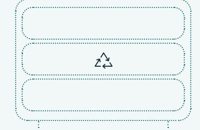

**Figure Description:**
The image displays a stylized graphic with three horizontal rectangles against a light blue background. Each rectangle has rounded corners and is outlined by thin lines that create a dashed border effect. Inside each rectangle, there are two arrows forming an abstract symbol resembling a recycling logo or a simplified representation of a looped back upon itself. These symbols appear to be centered within their respective rectangles. There are no visible texts or numbers inside these rectangles. The overall style of the image suggests it could be related to environmental themes such as recycling or sustainability due to the presence of the recycling symbol. However, without additional context, the specific meaning or purpose behind this design remains unclear.

Functioning drives are consolidated into fewer racks, which prevents waste generation and displaces energy and materials use with new drives.

**Figure Description:**
The image displays a stylized graphic of a smiley face with an abstract design that resembles a smiling mouth or a happy emoticon. It is composed of two curved lines forming a crescent shape at the top, which suggests a smile, and a straight line extending from one end to another below it, representing teeth or lips. The color scheme consists of shades of green and blue, giving the impression of a simple yet cheerful icon. There are no visible texts or numbers within the image. This type of imagery could be used for various purposes such as branding, user interfaces, or as part of a logo due to its friendly and approachable nature.

reuse items such as furniture to reduce our waste generation at the decommissioning stage. We also leverage contractual agreements to help ensure contractors manage construction waste in accordance with both Amazon's high standards and external legal requirements.

The construction project to build our second headquarters in Arlington, Virginia, which opened in 2023, diverted 82% of all construction waste (over 17,000 tons) from landfills, including concrete, drywall, metals, wood, cardboard, and plastic.

**Learn more** about how we are [making our buildings](#page-16-0) [more sustainable](#page-16-0)

# Supply Chain Waste

Amazon works with suppliers to reduce waste related to the manufacture of our devices. For example, our devices teams engage suppliers to decrease waste and material use as part of our work to encourage more efficient manufacturing. As of 2023, 42 supplier sites of Amazon devices had achieved UL's Zero Waste to Landfill certification at Silver or better, an increase from 10 supplier sites when we first launched the program in 2021. All final assembly sites worldwide and all China-based packaging sites for Echo, Kindle, Fire tablet, Fire TV devices, cables, and adapters have also secured Zero Waste to Landfill certification at Silver or better.

**Learn more** about our efforts to [improve the sustainability](#page-57-0) [of our devices](#page-57-0)

# Partnering for Circularity

We cannot solve all the challenges that underpin the broader shift to a circular economy alone, so we are working with multiple industry partners to innovate and bring about change at scale.

In 2023, we expanded our collaboration with the Ellen MacArthur Foundation to drive scalable, industry-wide solutions for a circular economy. As a Strategic Partner of the Ellen MacArthur Foundation Network, which is dedicated to creating a circular economy, we work to leverage our reach, technology, and innovation capabilities and the foundation's subject-matter expertise to launch and scale circular economy solutions. This collaboration focuses on certifications for products with circular features, providing customers with the information they need to make more circular choices. These certifications will also encourage brands, OEMs, suppliers, retailers, and e-commerce platforms to create products that are designed in accordance with circular economy principles.

**Learn more** about the certifications offered through our [Climate Pledge Friendly program for products with circular](#page-61-0)  [features](#page-61-0)

We also collaborated with WRAP ([Waste and Resources](https://wrap.org.uk/)  [Action Programme](https://wrap.org.uk/) ) in the UK to support innovation and improvement in the recycling industry. Our collaboration strives to transform recycling into a system that emphasizes recycled material quality and supports end markets for recycled output. We also launched the second [Amazon](https://sell.amazon.co.uk/programmes/sustainability-accelerator)  [Sustainability Accelerator](https://sell.amazon.co.uk/programmes/sustainability-accelerator) in Europe. This program provides workshops, mentorship, and training to startups in the circularity space that are developing new recycling technologies or more sustainable products.

# Advocating for Waste Shipment Efficiency

In 2023, we co-led an industry effort to streamline and modernize waste shipment procedures, so that waste materials reach destinations with the best possible sustainability outcomes, including increased and more efficient recovery of critical raw materials. The Basel Convention on the Control of Transboundary Movements of Hazardous Wastes and Their Disposal requires the origin country, any transit countries, and the destination country to approve certain shipments of waste. This process, known as prior informed consent (PIC), can be complex, time-consuming, and burdensome for underresourced governments. In many countries, PIC documents are mainly transmitted by post, fax, and email. We are working with other industry stakeholders and international nongovernmental organizations to develop an electronic PIC pilot project in the Asia-Pacific region. An expedited, reliable PIC process would allow controlled wastes to move more efficiently to countries with capacity for environmentally sound management of waste and maximum resource recovery potential.

Additionally, we supported industry efforts to maintain a clear framework for distinguishing between cross-border shipments of waste electrical and electronic equipment (WEEE) and used electrical and electronic equipment (UEEE). This will protect flows of valuable UEEE to and from countries with the capacity to extend the life of products and promote product reuse.

# Looking Forward

Reducing waste across Amazon is an ongoing journey. We will strive to advance our work across our waste hierarchy to prevent waste, and we'll continue scaling waste reduction and product circularity programs. Doing so in a manner that can keep up with the pace at which resource use is growing will require adopting new technologies that enable us to make progress more quickly and at a larger scale. In 2024, [The Climate Pledge Fund invested in Glacier](https://www.aboutamazon.com/news/sustainability/amazon-climate-pledge-fund-ai-recycling) , a company using AI-powered robots to automate the sorting of recyclables and collect real-time data on recycling streams. This technology helps recycling centers sort materials more effectively so that recyclable items stay out of landfills. We are also excited to collaborate with Glacier on a pilot project to sort novel biomaterials, which would enable recycling for materials that currently cannot be reused.

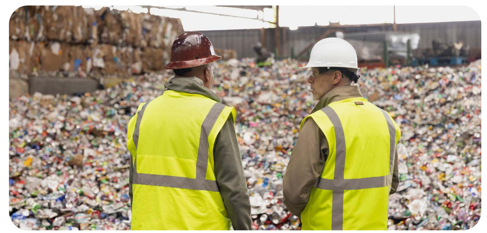

**Figure Description:**
The image depicts two individuals standing amidst a large pile of discarded materials that resemble crumpled paper or possibly recyclable waste. Both individuals are wearing high-visibility safety vests with reflective stripes; one is red and the other yellow. They appear to be engaged in conversation while surveying the scene around them.

The background shows an industrial setting with metal structures and additional piles of similar material. There's no text visible within the image itself. The style of the photograph seems candid and documentary, capturing a moment at work in an environment related to environmental management or waste disposal. The focus is on the people and their interaction with the surroundings rather than any specific details about the location or context beyond what can be directly observed.

The Climate Pledge Fund invested in Glacier, a company using AI to divert recyclable materials, such as aluminum soda cans and cardboard boxes, from landfills.

**Figure Description:**
The image displays a stylized graphic of a smiley face with an upward curve to its right side, suggesting happiness or positivity. The color scheme consists mainly of green tones, which could be associated with nature, growth, or environmental themes. There are no visible texts or numbers within the image that provide additional context or information about the content being represented. The style is simple and modern, using minimalistic shapes and lines to convey the message.

# Water

More than 2 billion people around the globe do not have access to safe drinking water, and roughly half the world's population experiences severe water scarcity for at least part of the year, due to climate change, population growth, and economic developmen[t.23 A](#page-94-0)mazon knows that responsible water management practices can mitigate water stress, which is a risk to not only our employees, customers, and communities, but also our business. We are committed to doing our part to help solve this rapidly growing challenge in the communities where we operate, as investment in local water resources is known to improve health, empower women, enable access to education, increase family income, and improve overall quality of life. To foster a more sustainable and resilient future, we are reducing our water footprint by conserving and reusing water across our on-site operations and throughout our communities. We're also working with nonprofit and public partners to increase fresh water availability in water-scarce regions.

### Goal

AWS will be water positive by 2030, returning more wat[er to](#page-94-0) communities than it uses in its direct operations24

41%

Of the way toward meeting its water positive goal

**41%**

100%

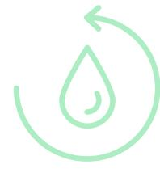

**Figure Description:**
The image displays a stylized graphic of an icon that represents water or liquid. It consists of two interconnected loops with a drop shape at the center, suggesting movement or flow. Inside the loop, there is a green color gradient from light to darker shades, giving it a three-dimensional appearance. There are no visible texts within the image. The style appears modern and minimalistic, commonly used for user interface elements such as buttons or menu indicators.

690K

People provided with clean water and sanitation through AWS and Amazon partnerships with Water.org and WaterAid

15

Water replenishment projects around the globe invested in by AWS as of the end of 2023

# In Northern Virginia, AWS collaborates with Stroud Water Research Center on stream-friendly projects that increase groundwater recharge and deliver better-protected water resources to more people in the Chesapeake Bay area.

# Actions 700K

Cubic meters of water loss avoided through a twoyear monitoring pilot at 53 sites in the UK in 2022 and 2023. In 2024, we are expanding this project into the EU

0.18

Liters of water per kilowatt-hour (L/kWh) water use effectiveness (WUE) for AWS data centers, a 5% improvement from 2022 and a 28% improvement from 2021, demonstrating AWS's leadership in water use effectiveness among cloud providers

3.5B

Liters of water returned to communities from replenishment projects in 2023, with additional volume contracted and replenishment expected to grow annually to reach the 2030 water positive goal

90%

Of our North American fulfillment centers, sort centers, and grocery logistics sites had faucet aerators—screens that screw into faucets, adding air to the water to reduce overall water flow installed

**Figure Description:**
The image displays a stylized graphic of a smiley face with an upward-curving line representing a smiling mouth. The color scheme consists mainly of shades of green, with the background being white. There are no visible texts or numbers within the image that provide additional context or information about its content. The style is minimalistic and appears to be designed for branding purposes, given the simplicity and universality of the symbol used.

# Our Approach Our Progress

We take a proactive approach to water stewardship, analyzing our footprint, driving operational resilience, and building more efficient systems that reduce our impact on local water sources. Our global water use includes water used in both our direct operations and wider supply chain.

Within our direct operations, we use water in the following ways:

- **• AWS data centers:** Water is an essential resource for AWS. AWS primarily uses it to cool its global data centers, which give customers continuous access to AWS technologies. As a leader in water use effectiveness (WUE) among cloud providers, AWS aims to do its part to help solve water scarcity challenges. That is why it has set a goal to become water positive by 2030, meaning it will return more water to communities and the environment than its direct operations use. Through this goal, AWS is focused on reducing overall water withdrawal and replenishing water in basins facing water scarcity located in communities around data centers.
- **• Water use and replenishment across Amazon:** For other water-intensive Amazon facilities, including logistics, grocery, and corporate office sites, we concentrate abatement efforts on regions with the highest risk of water scarcity based on their climates and watershed conditions. Our logistics buildings (fulfillment centers, sort centers, and delivery stations) and corporate offices use water in break rooms, kitchens, bathrooms, and for landscape irrigation. Our grocery stores (Amazon Fresh and Whole Foods Market) also use water for these purposes, as well as to cook, clean, and defrost food; in water refill stations; and as ice in product displays.

We track our progress by measuring and analyzing our direct operational water footprint. Since our different businesses use water in different ways, and water risk varies significantly across geographies, the aim of our data insights is to design a water program that we can tailor to specific needs across our company. This enables us to better forecast future water demand, determine the best ways to conserve water, and create more efficient systems that will benefit local watersheds over time.

# Water Risk Assessment

In 2023, Amazon conducted an in-depth, site-level global water risk assessment of our retail, operations, and corporate buildings to determine which regions to prioritize for intervention. We ranked regions by looking at their intrinsic water scarcity based on hazards such as water stress, groundwater table decline, and variability of water supply. Additionally, we examined the exposure and vulnerability of our operations and communities to those hazards, looking at factors such as the density and occupancy of our sites, amount of fresh water we withdraw, social vulnerability of local populations, and general ability of our operations to adapt to water shortage events. We used this assessment to build a water risk dashboard, which enables us to identify priority regions and sites for water stewardship projects.

# Water Positive in Data Centers

In 2022, AWS announced its commitment to being water positive by 2030. To meet this goal, AWS is delivering on four strategies:

- **• Water use effectiveness:** AWS is continually working to optimize its water consumption and aims to improve its overall WUE by reducing how much incoming water it uses. AWS uses cloud technologies such as Internet of Things (IoT) to analyze real-time water use and identify leaks.
- **• Using more sustainable sources:** AWS strives to use sustainable water sources, such as recycled water and harvested rainwater, where possible. Using recycled water for data center cooling preserves valuable drinking water for communities.
- **• Reusing cooling water in communities:** Data centers use non-contact cooling water to keep our servers from overheating. AWS finds ways to return the water to the community, including conveying the water to third parties for use in irrigation.
- **• Delivering water replenishment:** AWS invests in water replenishment projects in the communities where it operates. These projects expand community water access, availability, and quality by restoring watersheds and bringing clean water, sanitation, and hygiene services to water-stressed communities.

At the end of 2023, AWS was 41% of the way toward achieving its water positive goal. AWS measures progress against this goal annually by adding together reused water and water from replenishment projects and dividing that number by total water withdrawal minus water from sustainable sources.

In addition to reporting overall progress, AWS measures and tracks two other important water metrics: WUE for its data centers and the number of projects contributing to its water positive goal. At the end of 2023, AWS had 15 replenishment projects in 10 countries and 26 data centers using more sustainable water sources.

In 2023, AWS used its water footprint analysis to inform where and how it can use more sustainable water sources (including recycled water and harvested rainwater), improve WUE, expand water reuse, and grow water replenishment investments.

AWS works toward its water positive goal through crossteam collaboration, with input from civil and environmental engineers, data center operations specialists, and water stewardship experts.

**Learn more** about how AWS calculates its progress using its [Water Positive Methodology](https://sustainability.aboutamazon.com/aws-water-positive-methodology.pdf)

## Water Use Effectiveness

AWS minimizes water use by using real-time data to identify leaks, piloting new treatment technologies, and exploring a range of operational changes, such as installing sensors and alerts to track water use and detect anomalies.

Global teams deploy water monitoring technology in AWS data centers to determine where they need to take action to maintain or improve WUE. In 2023, AWS installed thousands of sensors in its data centers to track water use. Automatic alerts inform AWS of any anomalies so that operators can investigate in near-real time. AWS also invested in on-site water treatment systems that remove scale-forming minerals and allow AWS to recycle more water on-site and minimize the water consumed for cooling. These technologies helped

**Figure Description:**
The image displays a stylized graphic of a smiley face with an upward curve to its right side, suggesting happiness or positivity. This icon is commonly used as a symbol for customer satisfaction or service quality. There are no visible texts or numbers within the image itself that provide additional context or information about specific metrics or ratings. The background of the image is plain white, which helps to emphasize the green color of the smiley face design. The style of the image appears to be simple and modern, likely intended for use in branding, marketing materials, or online user interfaces where such symbols can convey positive experiences or feedback.

Carbon-Free Energy Page

Packaging

Waste and Circularity

Appendix

Water

improve AWS's industry-leading global data center WUE to 0.18 liters of water per kilowatt-hour (L/kWh) in 2023 from 0.19 L/kWh in 2022—a 5% improvement year over year and a 28% improvement since 2021.

### **AWS Water Use Effectiveness**

|                                 | 2021 | 2022 | 2023 | YoY% |
|---------------------------------|------|------|------|------|
| Water use effectiveness (L/kWh) | 0.25 | 0.19 | 0.18 | -5%  |

## **Using More Sustainable Sources**

Recycled water typically has limited uses, including irrigation and industrial use. AWS uses recycled water for cooling, which helps preserve drinking water for local communities.

In 2023, AWS increased the number of data centers using recycled water for cooling from 20 to 24, including two data centers in Virginia, one in California, and one in Singapore.

AWS has additionally begun harvesting rainwater as a sustainable water source. Using rainwater minimizes demands on community water resources and reduces potential surface water pollution from stormwater runoff. In Brazil, two of its data centers collect rainwater, reducing how much potable water AWS needs for cooling.

## Reusing Cooling Water in Communities

AWS data centers circulate water through their cooling systems as many times as possible, but eventually it needs to be replaced with new water. While spent water can no longer be used for cooling, it may be used for other purposes, such as irrigation. AWS is using advanced cloud services, such as IoT technologies, to analyze real-time water use, identify

and fix leaks, and gain other efficiencies. AWS finds ways to return used non-contact cooling water to the community, including conveying the water to third parties to use in growing crops such as alfalfa, soybeans, and wheat.

### Delivering Water Replenishment

By the end of 2023, AWS had invested in 15 water replenishment activities, returning water to the communities where it operates across 12 of our global infrastructure regions.25 These investments have expanded AWS replenishment activities to three new countries, bringing the total to 10: Australia, Brazil, India, Indonesia, Ireland, South Africa, Spain, Sweden, the UK, and the U.S. These activities help recharge groundwater, build wetlands, improve water quality, and reduce water loss in utility systems. In 2023, AWS's water replenishment portfolio returned 3.5 billion liters to local communities.

### **Watershed Restoration in Australia**

AWS is working with the Great Eastern Ranges (GER)—a nongovernmental organization whose aim is to protect, connect, and regenerate wildlife habitats across eastern Australia—to enhance the health and functioning of the major watershed serving Sydney. Catastrophic bushfires in late 2019 and early 2020 damaged large areas of this watershed. This joint project is restoring the local environment in key locations to improve water yield and quality, boost biodiversity, and enhance the resilience of local communities against the effects of climate change. Together, AWS and GER have supported initiatives that are reducing polluted stormwater runoff, increasing groundwater recharge, enhancing local biodiversity, and supporting wildlife, including 15 endangered species in the affected area. Once complete, the project is expected to deliver an additional 32 million liters of water each year to the Sydney watershed.

### Tackling Water Leaks in Spain

Spain is considered one of the most water-stressed industrialized countries in the world. It has experienced long-term drought since 2022, driven in part by water loss from aging infrastructure. To help address this, AWS worked with

FIDO Tech, a cloud-based water leak detection company that uses AWS technology, to identify and reduce leakages in the water system in Spain's Villanueva de Gállego community. This municipality is located in the province of Zaragoza, Aragon, between Barcelona and Madrid, where AWS data centers are located.

Acoustic sensors placed on water pipes and meters used FIDO's machine learning algorithm—built on AWS—to identify the location and size of leaks so the community could prioritize fixing the largest ones first.

In total, the sensors identified 21 leaks and other types of water loss. By repairing the largest, highest-priority leaks first, the project is reducing water loss by an estimated 33 million liters per year.

### **Supplying Water to Farmers in India and Indonesia**

To improve access to water across India and Indonesia, AWS works with Water.org and WaterAid on a variety of projects, such as microfinance loans, rainwater harvesting, groundwater recharge, and piped water supply projects. For example, loans have helped communities finance water pipe connections and toilet installations in homes. Altogether, AWS's investments in Water.org and WaterAid initiatives have benefited 290,000 people.

2023 Amazon Sustainability Report

In 2023, AWS announced new projects with SEARCH, a nonprofit organization that enables marginalized groups in rural India to enhance their socioeconomic status. These projects will help provide a consistent water supply to farmers in villages surrounding Hyderabad, where AWS has operations, by rehabilitating existing water storage ponds and constructing new ones. Once complete, the ponds are expected to deliver 86 million liters of water back to the community each year and help increase agricultural output. The ponds will also help recharge groundwater in an area designated as a semi-critical exploitation zone due to overpumping of its underlying aquifer. In 2023, SEARCH began a detailed community engagement process to ensure projects are implemented to maximize benefits for villagers.

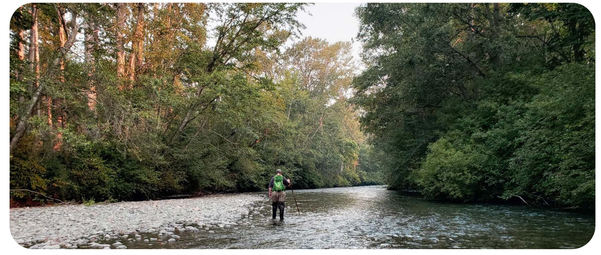

**Figure Description:**
The image depicts a tranquil scene of a person standing waist-deep in a river with their back to the camera. They are wearing a backpack and appear to be hiking or exploring. The individual is using a walking stick for balance as they navigate through the water. Surrounding them are lush green trees that suggest a forested area. There's no visible text within the image itself.

The image has been edited to include numerical values at various points:

1. In the top left corner, there is a value "0.25" which could indicate some form of measurement related to the photo (e.g., exposure settings, distance from the camera). However, without additional context, it's unclear exactly what this number represents.

2. On the right side of the image, near the bottom edge, there is another set of numbers "36.47." This might also relate to the photograph's metadata, such as GPS coordinates, but again, without more information, its precise meaning remains ambiguous.

These numerical annotations seem out of place within the natural setting depicted by the rest of the image, suggesting that they may have been added during post-processing or editing. Without further context, these numbers do not provide any specific details about the location, time, or other aspects of the scene.

In collaboration with the Washington Water Trust, AWS supported a drought relief program that enhances stream flows to help ensure healthy salmon runs in the Dungeness River in Washington state's Olympic Peninsula.

**Figure Description:**
The image displays a stylized graphic of a smiley face with an open mouth forming a curve that resembles a smile or a crescent moon. The color scheme consists mainly of shades of green, which are used to fill in the outline of the smiling shape. There is no text present within the image. The style appears modern and minimalistic, using simple shapes and lines to convey its subject matter. The overall impression is one of positivity and simplicity.

# Water Use and Replenishment across Amazon

In addition to moving toward our water positive goal for AWS, Amazon is scaling best practices for water stewardship across our business more broadly. We strive to reduce water use in our operations, which include logistics sites such as fulfillment centers, as well as in our corporate offices and grocery stores.

Across our global logistics network, our teams actively look for ways to conserve and reuse water. In 2023, we gathered robust data to analyze how much water our facilities use and created a baseline for our water footprint to track progress going forward. We leveraged our water risk dashboard to monitor water hazards and water-related business risks to prioritize improvements. To inform the investments we make in water infrastructure, we also performed cost-benefit analyses for an array of water conservation, reuse, and harvesting projects.

# Operations

In 2023, Amazon scaled water replenishment, harvesting, and reuse solutions across our operations in countries around the world.

India ranks at the top of our list of water-stressed regions, and our water stewardship efforts there reflect the urgent need to take action. In 2023, Amazon teams recharged local aquifers with harvested rainwater, installed low-flow fixtures and waterless urinals, and built in-house sewage treatment plants to reuse wastewater for flushing and gardening. In addition, these teams diverted runoff water from the

rooftops of 53% of our fulfillment centers to return as much stormwater to the watershed as possible.

Across the Middle East and Africa, we installed low-flow fixtures at our facilities. Our operations there additionally saved an estimated 3,700 cubic meters of water by installing aerators in faucets, shifting from conventional to sensor faucets, reducing toilet flush tank capacity, and recirculating water used in fire pump testing rather than draining it. In North America, we added faucet aerators in 90% of our fulfillment centers, sort centers, and grocery logistics sites.

In Japan, we added rainwater harvesting as a criterion for built-to-standard fulfillment centers, which will become standard for buildings opening after 2025. We expect to finish building the first fulfillment center with this infrastructure in late 2024, with an official launch in July 2025. By harvesting rainwater, we estimate that this site will reduce its water withdrawal by up to 40%.

Along with scaling water conservation, harvesting, and reuse solutions, Amazon has seeded a global water metering and leak detection program, with pilots at logistics, grocery, and data center sites in the U.S. and Europe supported by Amazon-developed software. Using machine learning, the program automatically sends a repair ticket to our engineering team when it detects abnormal water flows. One pilot in the UK saved an estimated 700,000 cubic meters of leaked water over two years (2022 and 2023) at 53 monitored sites. This work is providing valuable information about where failures occur within our water pipelines. We aim to scale this project to additional sites in 2024.

## Corporate Offices

Our corporate offices increased water recycling and the use of low-flow fixtures in 2023. This work is part of our efforts to set new standards for design as we strive to reduce indoor water use by more than 30% globally versus a Leadership in Energy and Environmental Design (LEED) baseline. Our offices in India and China, for example, replaced existing water flow fixtures in bathrooms and utilities areas with low-flow fixtures, reducing water use by 16%, or more than 15.6 million gallons, compared to a 2022 baseline.

**Figure Description:**
The image displays a stylized icon of a drop or droplet, which is commonly used to symbolize water or liquid. This particular icon features a simple outline with no internal details, giving it an abstract appearance. It appears to be designed for use as a graphic element within digital interfaces or printed materials where visual clarity and simplicity are important. There are no visible texts or numbers that provide additional context or information about the image's content or purpose.

### **Water.org Water & Climate Fund**

In 2022, Amazon announced a partnership with Water.org to help launch the Water.org Water & Climate Fund, which focuses on climate-resilient water and sanitation solutions. Amazon's \$10 million contribution will directly empower 1 million people with access to clean water by 2025, providing 3 billion liters of water per year to areas facing water scarcity.

As part of Amazon's Water.org Water & Climate Fund work, more than 400,000 people were connected to piped water supply and sanitation systems across India. The volume of fresh water saved by operational efficiencies, replenished through groundwater recharge, and made accessible through our Water.org initiatives together accounted for 93% of the direct water footprint of our logistics sites in India in 2023.

# Looking Forward

To build on progress made in 2023, we will continue to analyze our water footprint and water risk assessment in both our direct operations and supply chain, as well as develop a comprehensive water management strategy tailored to unique geographic and business unit needs. AWS will focus on making ongoing progress toward its water positive goal, investing in efforts to restore watersheds and increase access to water, sanitation, and hygiene for people who need it most. Amazon plans to leverage the learnings from this work, applying them companywide to strengthen our efforts to conserve and reuse water across our operations, within our communities, and in water-scarce regions around the world.

**Figure Description:**
The image displays a stylized graphic that resembles a smiley face with an open mouth shape. Inside the mouth area is a green curve that forms a partial circle or oval shape. To the right of the graphic, there appears to be a small upward-pointing arrow, which could indicate growth or increase. There are no visible texts or numbers within the image. The style of the image suggests it may be associated with branding or logo design due to its simple yet recognizable form.

# Value Chain

Millions of people work alongside Amazon to serve our customers, including our employees, partners, suppliers, and people living in the communities where we operate. We respect the dignity, rights, and wellbeing of everyone connected to our global business. We aim to provide products and services responsibly, work with more diverse suppliers, and deliver positive impact in our communities.

## **In This Section**

- 45 [Human Rights](#page-44-0)
- 50 [Responsible Supply Chain](#page-49-0)
- 58 [Sustainable Products and Materials](#page-57-0)
- 64 [Supplier Diversity](#page-63-0)
- 67 [Community Impact](#page-66-0)

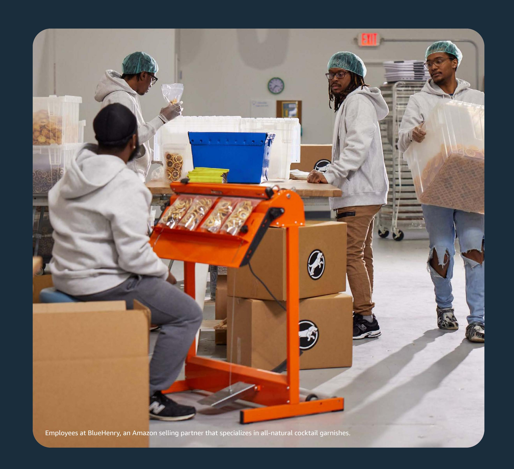

**Figure Description:**
The image depicts an indoor setting that appears to be a food processing or packaging facility. There are four individuals present; three of them are wearing hairnets and one is not visible from this angle. They seem to be engaged in various tasks related to food production or distribution.

In the foreground, there's a person sitting at a table with a laptop open before him. He has headphones around his neck and seems focused on something he's viewing on the screen. Behind him, there are stacks of cardboard boxes labeled "BLUEHENRY" and another label that reads "IN-ALL NATURAL COCKTAIL GARNISHES." This suggests that the products being processed might include natural cocktail garnishes sourced from BlueHenry.

The background shows additional workers involved in different activities. One individual is standing near a large stack of plastic containers, while others appear to be handling more packages or possibly ingredients for the food items.

On the right side of the image, there's text overlaying the photo which provides information about the company: "EMPLOYEES AT BLUEHENRY, AN AMAZON SELLING PARTNER THAT SPECIALIZES IN ALL-NATURAL COCKTAIL GARNISHES." This indicates that the employees work for a company named BlueHenry, which partners with Amazon to sell its all-natural cocktail garnishes online.

Overall, the image captures a moment within a commercial kitchen environment where workers are preparing or packing food products. The presence of technology like laptops and the use of branded materials suggest a modern, organized operation.

**Figure Description:**
The image displays a stylized graphic of a smiley face with a curved line for the mouth and a simple curve for the eye. To the right of the smiley face is an arrow pointing upwards to the left. There are no visible texts or numbers within the image itself. The background color appears to be dark blue, which contrasts with the white lines used to create the graphic elements. The style of the image suggests it could be related to branding or user interface design due to its simplicity and use of common symbols like the smiley face and arrow. However, without additional context, it's difficult to determine the exact purpose or meaning behind these graphics.

# Human Rights

Our activities affect millions of people around the globe, including those far beyond our direct operations. This means we have a critical role to play in respecting and promoting human rights. We believe everyone should be treated with fundamental dignity and respect and provided an equal opportunity to thrive, which is why at Amazon, respecting human rights is everyone's responsibility—one we are always working to embed into the business decisions we make every day. Our work is informed by the United Nations Guiding Principles on Business and Human Rights (UNGPs), and we have high standards in place that support our long-standing commitment to advancing the human rights of all people connected to our business—including our employees, people who work in our supply chain, customers, and people who live in the communities where we operate.

# Actions

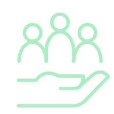

**Figure Description:**
The image displays a stylized icon that appears to be related to healthcare or medical services. On the left side of the icon, there are three human figures depicted from behind, suggesting a group setting. These figures have simplified outlines with minimal details, emphasizing their silhouette rather than individual characteristics. They are arranged vertically, one above the other, which could imply a hierarchy or organization within the context of the icon.

On the right side of the icon is an abstract representation of a bed or cot, also shown as a simple outline without intricate details. This element suggests a connection between the people and the concept of rest or care associated with a medical facility or service.

The color scheme consists mainly of green tones for both the human figures and the bed-like symbol, which may convey themes of health, wellness, or natural healing processes. There are no visible texts or numbers within the image itself. The style of the icon is modern and graphic, using flat design principles common in digital interfaces and signage.

Launched an online training available to all Amazon employees intended to raise awareness of the importance of the company's commitment to human rights, as well as courses on forced labor awareness

Introduced a new responsible purchasing practices training to help our sourcing and procurement teams understand how their efforts can improve supplier working conditions and environmental performance

Conducted a human rights saliency assessment for Amazon Private Brands to improve our understanding of human rights risks in the supply chain and how to address them through strategic actions and risk management plans

Launched a cross-functional initiative to help employees identify and proactively address forced labor and modern slavery risks, with a focus on ensuring the safety of potential human trafficking survivors

Completed a human rights due diligence management systems assessment for Whole Foods Market, which will inform a wider human rights saliency assessment of Amazon's global grocery business in 2024

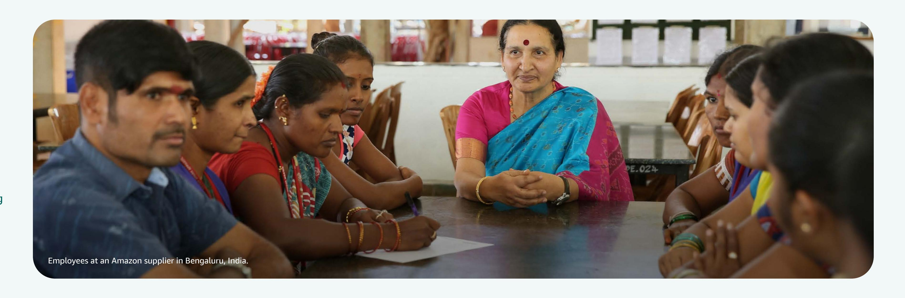

**Figure Description:**
The image depicts a group of people gathered around a table with chairs visible behind them. In the foreground, there is an individual who appears to be speaking or leading the discussion, as suggested by their posture and facial expression. This person has dark hair, wears glasses, and is dressed in traditional Indian attire that includes a pink saree. They are seated at the head of the table.

The other individuals present are wearing red and blue garments, which could indicate cultural significance or simply personal preference for color coordination. Some of these individuals have adorned accessories such as earrings and bindis (a mark worn between the eyebrows) on their foreheads.

In the background, there's another person partially visible, suggesting more participants outside the frame of the photo. On the right side of the image, there's text overlaying the photograph; however, it is not entirely clear due to its small size and resolution. It seems to contain numerical data along with some text, but without higher quality or additional context, I cannot provide specific details about the content of the text.

Overall, the image captures a moment during a meeting or gathering where people appear engaged in conversation or activity. The setting suggests a casual yet organized environment, possibly within an office or community space.

**Figure Description:**
The image displays a stylized graphic of a smiley face with an upward-curving line representing a smile. The color scheme is simple, consisting mainly of shades of green and blue. There are no visible texts or numbers within the image itself. The style appears to be minimalistic and could potentially be associated with branding or logo design due to its clean lines and limited colors. However, without additional context, it's not possible to provide specific details about the numeric values or their representation in relation to the image provided.

# Our Approach

Respect for human rights is woven throughout our business activities and relationships, and we work to engage with partners and suppliers that are also committed to respecting human and labor rights. Just as we are committed to promoting the rights of our employees, we are committed to working with our suppliers to embed respect for human rights in their operations and supply chains and to help us further our goal to support the fundamental dignity of everyone we work with.

We take pride in our long-standing dedication and commitment to human rights. While we continue to make progress, we know that this work is ongoing, and there is always more to be done. We are constantly learning and making improvements to our policies, programs, and educational resources to help ensure that our employees and workers everywhere we operate are treated with respect, know their rights, and can safely speak up if they encounter risks at work.

Our human rights strategy is informed by leading international standards and frameworks developed by the United Nations (UN) and the International Labour Organization (ILO). Amazon is committed to respecting and supporting the [United Nations Guiding Principles on Business](https://www.ohchr.org/Documents/Publications/GuidingPrinciplesBusinessHR_EN.pdf)  and Human Rights (UNGPs) , the [UN Universal Declaration](https://www.un.org/en/about-us/universal-declaration-of-human-rights)  [of Human Rights](https://www.un.org/en/about-us/universal-declaration-of-human-rights) , the [Core Conventions of the ILO](https://www.ilo.org/global/standards/introduction-to-international-labour-standards/conventions-and-recommendations/lang--en/index.htm) , and the [ILO Declaration on Fundamental Principles and Rights](https://www.ilo.org/declaration/lang--en/index.htm#targetText=The%20ILO%20Declaration%20on%20Fundamental,the%20level%20of%20economic%20development.&targetText=In%20turn%2C%20their%20observations%20are%20considered%20by%20the%20ILO) [at Work](https://www.ilo.org/declaration/lang--en/index.htm#targetText=The%20ILO%20Declaration%20on%20Fundamental,the%20level%20of%20economic%20development.&targetText=In%20turn%2C%20their%20observations%20are%20considered%20by%20the%20ILO) .

Our strategy to deliver on these commitments is based on the UNGPs and has five pillars:

- **• Develop and maintain strong policies and standards:** Our policies and standards are the backbone of our human rights strategy, spanning a diverse array of people-centric topics.
- **• Embed human rights into our business operations and decision-making:** We are committed to embedding human rights considerations into decision-making across our business and into our policy and governance framework, including by raising awareness among our employees on human rights issues through education and trainings.
- **• Assess, prioritize, and address risk:** We have robust processes that allow us to effectively identify, prioritize, and ultimately address human rights risks across our business and supply chain.
- **• Engage with stakeholders:** We are committed to driving best practices in human rights due diligence by expanding our stakeholder engagement. Through collaboration with stakeholders including supply chain workers, employees and contractors, customers, and communities, we are creating effective, sustainable solutions that put people first.
- **• Improve access to effective grievance mechanisms and remediation:** We offer multiple channels for our employees to voice grievances and concerns. We work hard to raise employee awareness of these grievance mechanisms and engage with suppliers to do the same for their workers.

# Our Progress

Respecting human rights is critical to Amazon's broader sustainability efforts and an area that requires ongoing, active work across each of our strategic pillars. In 2023, we maintained our focus on existing programs and embarked on new work and partnerships to continue delivering on our commitments.

# Developing and Maintaining Strong Policies and Standards

Amazon's human rights strategy is anchored in policies that apply across our business. We regularly review our strategy, principles, and supporting policies to identify opportunities for improvement. By engaging external stakeholders and monitoring evolving international and human rights standards, regulations, and industry best practices, we are able to effectively and continuously improve our own policies and standards to better support our employees and suppliers.

Our [Global Human Rights Principles](https://sustainability.aboutamazon.co.uk/society/human-rights/principles) demonstrate our commitment to respecting fundamental human rights and the dignity of people connected to our business around the world. Our [Supply Chain Standards](https://sustainability.aboutamazon.com/amazon_supply_chain_standards_english.pdf) detail our requirements of and expectations for suppliers. They apply to all suppliers of goods and services for Amazon and are grounded in principles of inclusivity, continuous improvement, and supply chain accountability. We review and update these standards at least every three years—working with external stakeholders to align our requirements with current best practices and regulatory standards—and we make them publicly available in 21 languages and dialects.

# Embedding Human Rights into Our Business

As a global company, we recognize the responsibility and opportunity we have to raise awareness among our employees on human rights issues. We have a central team that works across the company to conduct human rights due diligence and integrate human rights considerations into business decisions, and we strive to embed our human rights principles in employees' everyday work by offering training curricula.

In 2023, we launched an online training, available to all Amazon employees, intended to raise awareness on the importance of the company's commitment to human rights. We also offer our employees training tailored to some of Amazon's salient human rights risks. For example, in 2023, we updated our Forced Labor Awareness training, which is available to employees in seven languages and is customized for regional risks. The training builds awareness of the signs of potential cases of forced labor in the workplace and how to report concerns to appropriate authorities. Updates enhance learners' experience and direct them to our most current internal resources.

As another example, we introduced "[The Five Principles](https://betterbuying.org/research-tools/five-principles-of-responsible-purchasing-practice/) [of Responsible Purchasing](https://betterbuying.org/research-tools/five-principles-of-responsible-purchasing-practice/)" in 2023 to strengthen our sourcing and procurement teams' understanding of how purchasing practices can drive respect for human rights in our supply chain. This online training, developed by the Better Buying Institute, explains how our daily business operations can help suppliers improve factory working conditions and environmental performance.

**Figure Description:**
The image displays a stylized graphic of a smiley face with an upward curve to its right side, suggesting happiness or positivity. The color scheme consists of shades of green and blue, which are often associated with nature, growth, and tranquility. There is no text present within the image that provides additional context or information about the content. The style of the image appears to be simple and modern, likely intended for use as a logo or icon due to its clean lines and minimalistic design.

# Mechanisms to Assess, Prioritize, and Address Risk

We are committed to assessing, prioritizing, and addressing adverse human rights impacts connected to our business, and we continuously work to improve our approach.

Within Amazon's own operations, we deploy a variety of mechanisms to assess and respond to risks specific to Amazon businesses, including the sectors and the countries where we operate. We have a centralized team of experts who work across the company to conduct human rights and environmental due diligence. With support from this team, Amazon businesses work toward integrating our human rights principles into their operations and business relationships by conducting human rights risk assessments and remedying identified issues.

In our supply chains, we assess and respond to risk by leveraging internal and external data and guidance from stakeholders, including industry experts, civil society groups, and nongovernmental organizations. We also engage directly with suppliers and their workers and conduct independent audits to verify compliance with our Supply Chain Standards. We work with suppliers on appropriate remediation measures and offer partnerships and programs to help them address risks and invest in worker well-being. Our supply chain efforts focus on six priority commitment areas: Safe and Healthy Workplaces, Gender Equity, Fair Wages, Responsible Recruitment and Freely Chosen Employment, Environmental Protection, and Access to Effective Grievance Mechanisms.

### **Learn more** about [our supply chain due diligence work](#page-49-0)

We understand that as our supply chain evolves, expanding into new geographies and areas of business, so too do the risks we face. We're committed to growing and adapting our work to meet these challenges—and helping others do so as well.

## Human Rights Assessments

Identifying and prioritizing the most salient risks connected to Amazon operations and business relationships is central to our human rights due diligence practice[s.26 A](#page-94-0)s we continuously improve and expand these practices, we use human rights assessment methodologies to identify and mitigate human rights risks. These assessments help us understand the causes of systemic issues, enhance ongoing engagement with critical stakeholders, implement the correct risk-based mitigation measures, and refine strategies for ongoing risk management across our supply chain. Examples of human rights assessment methodologies include:

- **• Human rights saliency assessments**, which focus risk management action and remediation on the most severe risks relevant to a company's business activity.
- **• Human rights impact assessments (HRIAs)**, which examine a particular business segment or product, a country of operation or sourcing, a potentially affected group, or other human rights risk areas for a specific subset of a business.
- **• Human rights due diligence management assessments**, which analyze a business's internal capacity to assess and respond to human rights risks.

In 2020, we worked with Article One, a business and human rights consulting firm, to complete an enterprise-wide human rights saliency assessment. Through this assessment, we identified nine salient human rights risks across our operations and business relationships. That same year, we also initiated a business-level [HRIA with Amazon Devices](https://sustainability.aboutamazon.com/amazon-devices-hria.pdf) .

Each year, we expand on our commitment to conduct business-specific human rights assessments, ensuring we are always raising the bar on how we evaluate and respond to risks across our operations and supply chain. These assessments allow us to identify salient risks, build capacity and business-level ownership aligned to those risks, and conduct targeted human rights and environmental due diligence to monitor and manage compliance.

**Figure Description:**
The image displays a stylized icon featuring three human figures standing close together with their arms outstretched as if embracing or supporting each other. In front of them is an abstract representation of hands clasped together, suggesting unity or partnership. Above the group of people, there are two numerical values: "1" and "2". These numbers could be interpreted to mean that one person is represented by the number "1", while another person is represented by the number "2". This arrangement might symbolize a relationship between these individuals, such as partners, colleagues, friends, etc., where both parties have equal importance or status. However, without additional context, it's not possible to determine the exact nature of the relationship being depicted. The style of the image is simplistic and uses flat colors, which gives it a modern and clean appearance.

## **Our Salient Human Rights Risks**

- **•** Diversity, Equity, and Inclusion
- **•** Safe and Healthy Working Conditions
- **•** Modern Slavery and Forced Labor
- **•** Fair Wages and Hours
- **•** Freedom of Association
- **•** Future of Work
- **•** Right to Privacy
- **•** Product Safety and Security
- **•** Social, Economic, and Environmental Justice

**Learn more** about our salient human rights risks on our [website](https://sustainability.aboutamazon.com/human-rights#salient-risks)

In 2022, following several other HRIAs, we published an [HRIA report with Twitch](https://www.bsr.org/reports/BSR-Twitch-Human-Rights-Impact-Assessment-Report_2.pdf) . [27 In](#page-94-0) 2023, we conducted a human rights saliency assessment for Amazon Private Brands to better understand priority human rights risks across our products and how to best address them. We also identified ways to facilitate stakeholder relationships at a more localized level in the Private Brands supply chain.

Whole Foods Market, with support from Amazon's central human rights team, worked with third-party advisory firm Human Level to conduct a human rights due diligence management assessment in 2023. This assessment helped Whole Foods Market better understand and improve the quality of its human rights due diligence governance. In 2024, we are building on the success of Whole Foods Market's 2023 human rights due diligence management assessment by expanding it to all of Amazon's global grocery business.

# Identifying and Addressing Modern Slavery Indicators across Amazon

Addressing modern slavery requires a holistic approach that includes commitments, resources, and innovative solutions from governments, international organizations, the private sector, and civil society. At Amazon, we understand the important role we can play in eradicating this issue and are committed to expanding our work to understand and address any modern slavery risks that may arise in our business.

We place a specific focus on vulnerable workers, including foreign and domestic migrant workers; contract, agency, and temporary workers; refugees; asylum seekers; ethnic/ religious minorities and displaced persons; Indigenous peoples; and young or student workers.

In 2023, we launched a new initiative to identify and proactively address forced labor and modern slavery risk indicators across our business. The program brings together teams across our company to identify and eliminate any instances of exploitation—with a focus on victim safety.

Working with both internal and external experts in human trafficking, the cross-functional team is establishing clear protocols, mandatory training, and policies on identifying potential victims of forced labor or modern slavery within our business operations, as well as detailing what employees should do if they observe any indicators of human trafficking. These include guidance on ensuring victim safety and providing immediate support and assistance to them, as well as involving relevant authorities and support organizations. More broadly, we are working to help our businesses understand how to address the root causes of any exploitation they identify within our supply chain and business practices.

**Learn more** about our policies and principles to assess and address the risks of modern slavery within our supply chain in our [Responsible Supply Chain section](#page-49-0) and in our [Modern Slavery Statement](https://sustainability.aboutamazon.com/modern-slavery-statement.pdf)

**Figure Description:**
The image displays a stylized graphic of an upward-curving smiley face with a green outline. To the right side of the smiley face is a curved arrow pointing upwards to the left. There are no visible texts or numbers within the image that provide additional context or information about the content. The style of the image appears to be simplistic and iconographic, commonly used for logos or branding due to its universally recognized symbolism representing happiness and positivity.

Responsible Supply Chain

Sustainable Products and Materials

Appendix

Supplier Diversity

Community Impact

# Meaningful Consultation with Stakeholders

Human rights risks are systemic and complex, and addressing them requires us to reach well outside of our own operations. Engagement with external stakeholders is essential to identifying positive outcomes for people across our business and key to our human rights due diligence approach.

We collaborate with credible, knowledgeable, and innovative partner organizations around the world who share our vision. Together, we examine assessment findings, help remediate our salient human rights risks, and advance effective solutions that improve working conditions for people throughout our supply chain. We also rely on experts and affected rightsholders to inform our approach and validate our efforts. Examples of our partnerships include:

**Figure Description:**
The image features a logo with text that reads "POLARIS" prominently at the top of the design. Below the main word, there is additional text that says "FREEDOM HAPPENS NOW." The font used for the text appears to be sans-serif, which gives it a modern look. There are two stars located above the word "POLARIS," suggesting a connection to navigation or exploration themes often associated with Polaris. The background of the image is white, which contrasts with the blue color of the text and stars, making them stand out. The overall style of the image suggests it could be related to a branding campaign or an organization's identity.

Polaris, a nonprofit AWS customer that leads a survivor-centered, justice- and equity-driven movement to end human trafficking in the U.S. AWS provides financial and technical support to enhance Polaris's data collection and operations and improve trafficking identification and prevention. In 2023, AWS delivered hundreds of thousands of dollars in AWS credits to help fund Polaris's work. Since 2007, Polaris has identified over 82,300 situations of human trafficking.

**Figure Description:**
The image features a logo with text that reads "TECH AGAINST TRAFFICKING." This suggests an organization or initiative dedicated to combating technology-related human trafficking. There is no numerical value present within the visible portion of the image. However, if you are referring to specific numbers related to tech against trafficking, it would depend on additional context not provided by the image itself. If there are any hidden or obscured parts of the image where such information might be found, please provide more details for me to assist further.

Tech Against Trafficking (TAT), a coalition of companies and global experts working to eradicate human trafficking using technology. An Amazon representative serves as a member of its steering committee. In 2023, we worked with Polaris and the Issara Institute—both participants of the TAT Accelerator—to scale their technology solutions to address human trafficking.

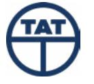

**Figure Description:**
The image displays a logo consisting of a stylized circle with a central vertical line that divides it into two equal halves. Inside the circle is the word "TAT" written in capital letters, which appears to be an acronym or abbreviation for something not specified within the context of the image. The color scheme consists of blue text against a white background inside the circle, while the outer edge of the circle has a darker shade of blue. There are no additional elements or details visible outside the confines of the circular design. The style of the image suggests it could be related to aviation, as indicated by the TAT acronym, but without further information, its specific meaning remains unclear.

Truckers Against Trafficking, an organization that stands committed to educate, equip, empower, and mobilize members of the trucking, bus, and energy industries to address human trafficking. In addition to being a Truckers Against Trafficking corporate sponsor, we include Truckers Against Trafficking modules in our training for internal fleet drivers to help them identify and respond to potential human trafficking victims. In 2023, we trained 9,970 Amazon transportation associates.

**Figure Description:**
The image displays a logo consisting of stylized text and graphic elements against a white background. At the center is a large red "M" with a bold outline that appears to be slightly tilted or angled downwards towards the right side of the image. To the left of the "M," there are two smaller vertical lines resembling flames or abstract shapes, also rendered in red. Above the central "M," there's an additional element that looks like a horizontal line segmented into three parts, each part colored black, creating a visual effect similar to a bar chart. Below the main "M," the word "MEKONG CLUB" is written in capital letters using a sans-serif font; it is primarily in black but has a slight shadow effect giving it depth. The style of the image suggests it could be related to a branding or club identity, possibly associated with sports, given the use of the letter 'M,' which might stand for a team name or initials. There are no specific numeric values visible within the context provided by the question.

The Mekong Club, a nonprofit that works with the private sector to address modern slavery. Through the organization, we developed a supplier-facing remediation guideline and trained vendors in Saudi Arabia and the United Arab Emirates on responsible recruitment practices.

# THORN 1

Thorn, a nonprofit that builds technology to combat child sexual abuse. Amazon provides millions of dollars in AWS credits to power Thorn's tools, and Thorn leverages a variety of AWS solutions to support Safer, a tool that uses advanced artificial intelligence (AI) and machine learning models to detect child sexual abuse material (CSAM) at scale. Safer helps companies identify, review, and report CSAM from content-hosting platforms, detecting over 3.8 million CSAM files in 2023.

**Figure Description:**
The image is a logo for an organization named "National Center For Missing & Exploited Children". It features a graphic design with text elements. On the left side of the logo, there are three stylized figures that appear to be children or adults holding hands, forming a heart shape. These figures are depicted in black against a white background. To the right of these figures, there's a yellow ribbon-like symbol resembling a heartbeat line. Above the heartbeat symbol, the words "NATIONAL CENTER FOR" are written in uppercase letters, followed by "MISSING & EXPLOITED CHILDREN" below it. Both lines of text are also in black font against the same white background as the rest of the logo. The overall style of the image suggests a professional and formal appearance typical of official logos. There are no visible numbers within the image provided.

Children (NCMEC), a child protection organization committed to aiding the search for missing children, reducing child sexual exploitation, and preventing child victimization. NCMEC utilizes AWS solutions to support several of its programs and an AWS representative serves on NCMEC's Board of Directors. In 2023, NCMEC received hundreds of thousands of dollars in AWS credits to support critical applications that help make sure every child has a safe childhood. Additionally, Amazon's subsidiary Ring works with NCMEC to distribute geo-targeted missing child posters in its app and across social media.

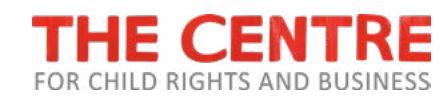

**Figure Description:**
The image features a logo with text that reads "THE CENTRE FOR CHILD RIGHTS AND BUSINESS." The word "THE" is at the beginning of the text, followed by "CENTRE," which is capitalized and larger than the other words. Below "CENTRE," there are two lines of smaller text: "FOR CHILD RIGHTS AND" and "BUSINESS." The font used for the main part of the text appears to be sans-serif, while the text below it seems to use a serif font. The color scheme consists mainly of red and white, giving the logo a bold and clear appearance. There are no visible numbers or specific numerical information within the text provided.

The Centre for Child Rights and Business brings companies together to collaborate, share best practices, and access the latest information and insights on child rights. In 2023, Amazon worked with the center to deliver an online training on child labor prevention and remediation, as well as young worker management, to our central human rights team and other key internal stakeholders. The center also helped us conduct child labor risk assessments of some of our strategic suppliers in the U.S., identifying management gaps and providing risk mitigation recommendations.

**Figure Description:**
The image is a logo with text that reads "RESPONSIBLE SOURCING NETWORK." The word "RESPONSIBLE" is stylized to resemble an abstract bird or butterfly design, which appears to be composed of lines and shapes in shades of blue, yellow, and orange. Below it, there are two horizontal bars; one bar contains the words "SOURCING NETWORK," and the other bar has the word "RESPONSIBLE" repeated vertically. The background of the image is white. There are no visible numeric values within the image provided.

YESS: Yarn Ethically and Sustainably Sourced, an initiative of the Responsible Sourcing Network, works to support fabric and spinning mills in implementing a risk-based due diligence approach for cotton sourcing, and promotes collaboration with the goal of preventing, mitigating, and remediating forced labor in cotton production. In 2023, YESS launched its program to assess fabric and spinning mills in Pakistan and India. Amazon is supporting YESS's efforts to scale and expand the program to Vietnam and Bangladesh.

**Figure Description:**
The image displays a stylized graphic of a smiley face with an open mouth forming a curved shape that resembles a smile or a happy expression. The color scheme consists mainly of shades of green, which are used to fill the outline of the smiling face. There is no text present within the image. The style appears to be simplistic and iconographic, commonly associated with branding or logos due to its clean lines and minimalist design. The background of the image is white, providing contrast to the colored elements. The overall impression is one of positivity and happiness conveyed through the use of a simple, universally recognized symbol for joy or contentment.

# Access to Effective Grievance Mechanisms and Remediation

By listening to the people connected to our business, we can better understand their experiences and concerns, address risks they face, remedy issues, and ultimately improve our workplace experience. Our grievance policies and practices are designed to promote respect for the rights of freedom of association and collective bargaining and comply with the legal requirements of the countries where we operate.

We empower and encourage all our employees to share their concerns and communicate openly and candidly with us through various channels, including grievance mechanisms and avenues for effective two-way dialogue with leadership. We have processes in place to promptly review and address employee suggestions, concerns, and grievances—making improvements and providing remedies in response.

**Learn more** about [our grievance mechanisms and](#page-74-0)  [remediation processes for employees](#page-74-0)

Beyond our own employees, we expect every supplier in our supply chain to provide their workers access to effective grievance mechanisms. We work with our suppliers to increase their capacity to develop these mechanisms, helping them create channels to hear directly from workers about their experiences and support the resolution of issues they report.

**Learn more** about [our grievance mechanisms and](#page-49-0)  [remediation processes for suppliers](#page-49-0)

# Looking Forward

Our commitment to respecting human rights is unwavering. In 2024, Amazon will work with internal and external human rights experts to update our Global Human Rights Principles. We will continue raising awareness among our employees, suppliers, and partners about the importance we place on advancing human rights throughout our business and supply chain, as well as our expectation that respect for human rights guide their everyday work and business decisions. We will also uphold our engagement and collaboration with these stakeholders to help us deliver on our priorities and raise the bar for human rights across our industries.

In 2024, Amazon will continue to scale our human rights and environmental due diligence programs using systems that enable our businesses to get even more granular about their human rights risks—identifying business-specific priority issues and better targeting risk management actions most relevant to their sectors and activities.

**Figure Description:**
The image displays a stylized graphic of an abstract smiley face with a curved shape resembling a smile or a crescent moon. It is predominantly green with darker green outlining its form against a white background. There are no visible texts within the image that provide additional information about the content or context. The style of the image appears to be minimalistic and modern, possibly used for branding or as part of a logo design due to its simple yet recognizable symbolism.

# Responsible Supply Chain

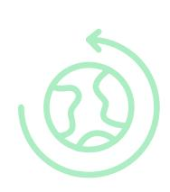

**Figure Description:**
The image displays a stylized graphic of a globe with green lines connecting its continents. This design is often associated with environmental awareness or sustainability initiatives. There are no visible texts within the image that provide specific information about numerical values or other details. The style of the image appears to be simplistic and modern, using only two colors (green for the landmasses and white for the oceans) against a plain background. It does not contain any additional elements such as numbers, labels, or other textual content.

458

Suppliers across 14 countries/regions attended trainings on our Supply Chain Standards

Actions Launched a new peer-learning workshop series, convening factory management to hear from industry experts and share best practices to solve common challenges

> Launched i4Equality, a new Amazon-owned capacity-building program that helps suppliers achieve gender equity

Amazon works with thousands of suppliers around the world. From the way our suppliers source materials to the way they treat their employees, we understand our opportunity and responsibility to support safe working conditions, fair pay, and environmental protection—well beyond our direct operations. To address supply chain challenges and enable safe, equitable, fair, and sustainable supply chains, we are building long-term relationships with suppliers that align with our values, partnering with them to consistently improve conditions for workers. We also engage business partners and industry peers to expand our efforts and drive improvements on a wider scale.

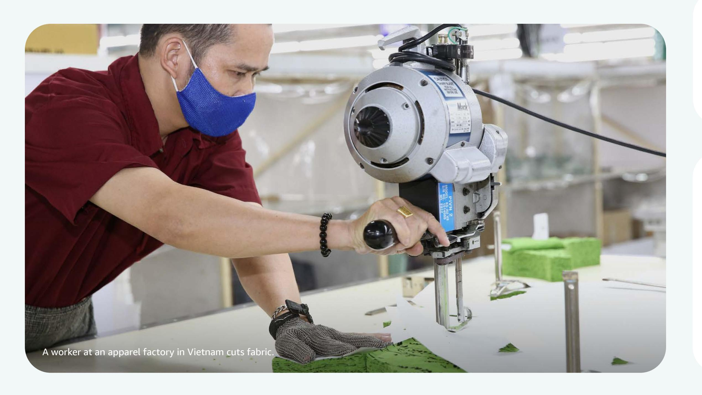

**Figure Description:**
The image depicts a worker at an apparel factory in Vietnam, cutting fabric with a machine. The worker is wearing a blue face mask, which suggests that safety precautions are being taken due to health concerns or air quality issues. The individual's hands are operating a control panel of the sewing machine, indicating their active engagement in the manufacturing process.

The text overlaying the image provides additional context about the setting: "A WORKER AT AN APPAREL FACTORY IN VIETNAM CUTS FABRIC." This statement confirms that the scene takes place within a garment production facility located in Vietnam.

In terms of numeric values, there isn't any direct numerical information visible in the image itself. However, if we consider the broader context provided by the text, it could be implied that the worker might be involved in producing a certain quantity of clothing items per day or week, but without specific numbers given, this remains speculative.

Overall, the image captures a moment from the daily operations of a Vietnamese garment factory, highlighting the role of workers in such settings. It also serves as a reminder of global supply chains and labor practices in different parts of the world.

100%

Of supplier employee grievances were investigated and resolved at supplier sites across seven countries using effective Amazon-operated worker grievance mechanisms

In early 2024, joined Nirapon to create and sustain a culture of workplace safety in Bangladesh factories, as well as Life and Building Safety (LABS) Initiative to support safety monitoring and workplace safety in our supply chain

**Figure Description:**
The image displays a stylized icon of three human figures stacked vertically with their heads at the top and feet at the bottom. Each figure is represented by an outline that suggests a simplified form without any internal details or features. The color scheme consists of green outlines against a white background. There are no visible texts or numbers within the image. This type of iconography could be used for various purposes such as representing family units, social groups, or team structures in a graphic design context.

Entered into a strategic collaboration with the International Organization for Migration (IOM) to promote respect for the human and labor rights of migrant workers in global supply chains

**Figure Description:**
The image displays a stylized graphic of a smiley face with a curved line representing a mouth or smile. The color scheme consists mainly of shades of green, with some white space around the edges. There are no visible texts within the image that provide additional context or information about the numeric values you mentioned. If there is any numerical data associated with this image, it would typically be found outside the image itself, such as in accompanying text or metadata. Without further information, I am unable to describe specific numeric values related to this image.

# Our Approach

At Amazon, we are laser focused on requiring safe and healthy working conditions throughout our supply chain. We have dedicated teams in key sourcing regions that engage directly with suppliers to communicate our standards, evaluate risks in our supply chain, and help suppliers build their capacities to provide working environments that are safe and respectful of human rights. We also work closely with strategic partners across the globe to enhance our influence.

We continue to focus our efforts on our six priority commitment areas:

- **•** Safe and healthy workplaces
- **•** Gender equity
- **•** Fair wages
- **•** Responsible recruitment and freely chosen employment
- **•** Environmental protection
- **•** Access to effective grievance mechanisms

Our [Supply Chain Standards](https://sustainability.aboutamazon.com/amazon_supply_chain_standards_english.pdf) are the backbone of our efforts to enable a responsible supply chai[n.](#page-94-0)28 They apply to all suppliers of goods and services for Amazon, including service providers, vendors, selling partners, contractors, and subcontractors (collectively, "suppliers"). Products sold in Amazon stores, as well as products and services provided to us, must be manufactured, produced, or provided in accordance with these standards.

An important part of our efforts to improve conditions across our supply chain is assessing human rights risks to address both site-specific challenges and broader, systemic issues. We work with our suppliers—and other partners, as described in this section and our [Human Rights section](#page-44-0) to proactively mitigate these risks. We encourage suppliers to establish management systems to oversee their compliance with applicable laws, compliance with our Supply Chain Standards, and progress on addressing their most salient human rights and environmental risks. We also continuously monitor regulations in the countries where we operate and actively engage with our teams and suppliers to meet new regulatory requirements.

# Selling Partners and Our Standards

Selling partners are third-party sellers and retail vendors that sell or provide products and services in Amazon stores. Our Supply Chain Standards apply to all products and services offered in our stores. We encourage selling partners to perform due diligence to help ensure their products and services are produced and supplied in ways that respect human rights and the environment and protect the fundamental dignity of workers.

If we have reason to suspect that products from our selling partners do not meet our standards, we may request evidence of due diligence to demonstrate that products were indeed manufactured in accordance with our Supply Chain Standards. We reserve the right to remove products that do not meet our standards from our stores.

# Supply Chain Transparency

Supply chain transparency is a valuable tool to address risks in our supply chain and identify opportunities for collaboration on systemic issues. That's why we publish a [supplier list and interactive supply chain map](https://sustainability.aboutamazon.com/human-rights/supply-chain#supply-chain-transparency) with details on finished-product suppliers of Amazon-branded apparel,

consumer electronics, food and beverage, and home goods products. Our 2023 supplier list included nearly 2,230 finished-product suppliers. We update our supply chain map annually to provide customers and external stakeholders more current visibility into where we source. In 2024, we will begin to expand our supplier list and supply chain map to include some apparel component suppliers.

We also contribute our supplier list to the [Open Supply](https://opensupplyhub.org/facilities?contributors=1078&lists=3316) [Hub](https://opensupplyhub.org/facilities?contributors=1078&lists=3316) to foster brand collaboration and action in the industry. Open Supply Hub is an accessible, collaborative supply chain mapping platform, used and populated by stakeholders across sectors and supply chains. In 2023, we utilized tools in Open Supply Hub's map function to list facilities that produce Amazon-branded products, allowing users to clearly and easily view our supply chain and interact with facility data.

**Learn more** about [our ongoing engagement with critical](#page-47-0)  [stakeholders to advance human rights in our supply chain](#page-47-0)

# Supplier Assessments

We assess suppliers of Amazon-branded products globally during onboarding, and periodically thereafter, to evaluate their compliance with our Supply Chain Standards in four categories: Labor Rights, Ethics, Environment, and Health and Safety. These categories include subcategories such as nondiscrimination, emergency preparedness, hazardous substances, and transparency. By assessing the performance of our suppliers, we improve working conditions and strengthen the resilience of our supply chain.

We accept audits completed by qualified independent audit firms based on our own standards and those of industry associations, including the Sedex Members Ethical Trade Audit (SMETA), amfori Business Social Compliance Initiative (amfori BSCI), Responsible Business Alliance (RBA), Social Accountability International (SA8000 standard and certification system), and Better Work.

When we identify a gap between a supplier's practices and our Supply Chain Standards, we track remediation and conduct follow-up assessments as needed. Between assessments, our central team directly engages with the supplier to discuss open issues and remediation progress and provides them with issue-specific remediation guidebooks. Failure to implement the actions listed in the corrective action plan may prevent the supplier from continuing production or providing services or labor to us.

**Learn more** about [our auditing and remediation](https://sustainability.aboutamazon.com/amazon_supplier_manual_english.pdf) [processes](https://sustainability.aboutamazon.com/amazon_supplier_manual_english.pdf)

**Figure Description:**
The image displays a stylized graphic of a smiley face with an open mouth forming a crescent shape. The color scheme consists mainly of teal or turquoise tones for the smiling part and green accents that suggest eyes and eyebrows. There are no visible texts or numbers within the image itself. The style appears to be simplistic and iconographic, commonly used as a logo or emoji representation of happiness or positivity.

# Our Supply Chain Standards

Our [Supply Chain Standards](https://sustainability.aboutamazon.com/amazon_supply_chain_standards_english.pdf) are the backbone of our efforts to enable a more responsible supply chain. They apply to all suppliers of goods and services for Amazon, including service providers, vendors, selling partners, contractors, and subcontractors (collectively, "suppliers"). Products sold in Amazon stores, as well as products and services provided to us, must be manufactured, produced, or provided in accordance with these standards.

We are committed to providing products and services that are produced or supplied in a way that respects human rights and the environment. Our commitment and approach are informed by leading international standards and frameworks developed by the United Nations (UN) and the International Labour Organization (ILO). We apply these standards using three principles.

### **Supply Chain Accountability**

We work with suppliers to help them understand our standards. Suppliers are required to hold their own suppliers, subcontractors, recruitment agents, and labor agents accountable for abiding by applicable laws and our standards and to work with them to raise awareness of our standards.

### **Inclusivity**

Suppliers must apply our standards to all workers without discrimination and regardless of workers' personal characteristics or legally protected status.

# **Our Approach Our Principles Our Requirements**

### **Labor Rights**

Amazon does not tolerate the use of forced labor or child labor. Additional provisions cover requirements related to wage and benefits, working hours, migrant workers, anti-discrimination, anti-harassment, grievance mechanisms, and freedom of association.

### **Ethical Behavior**

Amazon will not tolerate suppliers that engage in unethical behaviors, including bribery, corruption, and whistleblower retaliation. Suppliers must comply with applicable laws related to anti-corruption, data privacy, trade, and the responsible use of artificial intelligence (AI).

### **Health and Safety**

Suppliers are required to provide workers with a safe and healthy work environment, including complying with applicable laws regarding occupational safety, working conditions, and health standards.

### **Environment**

Suppliers should respect the right to a clean, healthy, and sustainable environment. Suppliers are required to comply with applicable environmental laws and regulations.

# **Continuous Improvement**

Amazon operates on a policy of continuous improvement, and we are committed to working with suppliers to embed respect for human rights and the environment in their operations and supply chains, improve protections for their workers and workplaces, and address nonconformance with these standards.

### **Responsible and Sustainable Material and Commodity Sourcing**

Amazon is committed to avoiding the use of minerals that have fueled conflict. Suppliers should identify the origin of designated minerals used in our products and source these commodities in a way that respects local communities and protects ecosystems.

# **Land and Natural Resource Rights**

Suppliers must respect the legal land rights of individuals, Indigenous people, and local communities.

# **Management Systems**

Suppliers should adopt a management system to drive continuous improvement against our standards and maintain a process for timely remediation of nonconformance identified by assessments, investigations, and reports.

**Figure Description:**
The image displays a stylized graphic of a smiley face with an abstract design that resembles a smile or a curve. The color scheme consists mainly of shades of green, with some white space around the edges. There are no visible texts or numbers within the image itself. The style is minimalistic and modern, using simple shapes to convey a sense of happiness or positivity. The overall impression is one of simplicity and cleanliness, without any additional context provided by textual elements.

# Our Progress

Enabling safe, equitable, fair, and sustainable supply chains through our six priority commitment areas goes well beyond setting supplier standards. We want to ensure they comply with our Supply Chain Standards and continuously improve. We assess the performance of our suppliers, take action when we identify concerns, and offer capacity-building programs to prevent identified issues from happening again.

# Supplier Assessments

Our approach to enabling a more responsible supply chain is rooted in our commitment to workers and based on a model of continuous improvement. We offer on-site and remote training to support supplier remediation, and we expect suppliers to act within an agreed-upon timeline, remove harm, act in the best interests of workers, and commit to preventing similar issues in the future. We know that change does not happen overnight and are committed to supporting our suppliers in remediating issues over time.

Assessment findings are flagged as high, medium, or low depending on severity. When high- and medium-level issues are identified, we take steps to verify that suppliers have made meaningful progress toward remediation.

A high-level finding is an issue that has caused or is likely to cause immediate harm to workers or communities or demonstrates egregious unethical behavior. A mediumlevel finding is an issue that poses significant risk of harm to workers or communities or demonstrates unethical or exploitative behavior. For low-level issues, we monitor suppliers for continuous improvement through maintenance audits.

# Supplier Assessments[29](#page-94-0)

### **Type of Assessment**

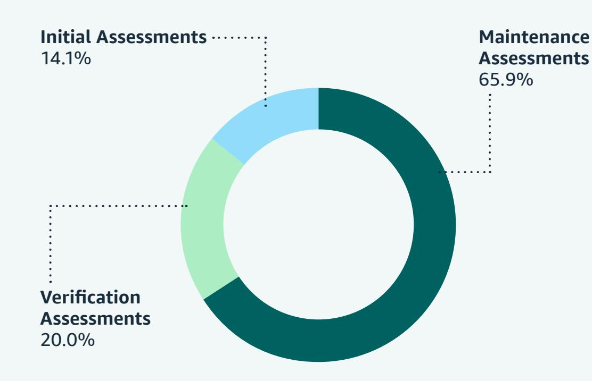

**Figure Description:**
The image is a colorful infographic that uses a circular layout to convey information about three different types of assessments: Initial Assessments, Verification Assessments, and Maintenance Assessments. Each type of assessment has its own section within the circle, with each section containing numerical percentages indicating their frequency or importance.

The "Initial Assessments" section occupies approximately one-third of the circle's circumference (14.1%) and is colored blue. Adjacent to it are two other sections representing "Verification Assessments" and "Maintenance Assessments," which together take up slightly more than half of the circle (65.9%). These sections are green and teal respectively.

Each section contains text labels for clarity. For instance, next to the "Initial Assessments" label, there is an arrow pointing from the center of the circle towards the initial assessments section, suggesting a relationship between these assessments and the overall process represented by the circle. Similarly, arrows point from the center to the verification and maintenance assessments sections, reinforcing the connection between all three types of assessments.

Overall, the image appears to be designed to quickly communicate the relative proportions of different types of assessments within a given context, possibly related to quality control, project management, or some form of evaluation system. However, without additional context, the exact nature of the assessments remains unclear.

In 2023, we performed 3,011 assessments of suppliers of Amazon-branded products across three categories:

**Initial assessments:** Suppliers must submit Amazonapproved assessments of their facilities before beginning production of Amazon-branded products.

**Maintenance assessments:** Suppliers must submit ongoing Amazon-approved assessments while producing Amazonbranded products every one or two years, based on whether they are located in a high- or low-risk country and on previous audit performance.

**Verification assessments:** When high-level issues are identified, suppliers must develop corrective action plans to address identified issues as well as long-term plans to prevent recurrence. As necessary, suppliers must also undergo follow-up assessments to confirm the sufficient remediation of identified issues.

High-Level Findings Medium-Level Findings

| Subcategory                                         | 2021  | 2022  | 2023  |
|-----------------------------------------------------|-------|-------|-------|
| Labor Rights                                        |       |       |       |
| Freedom of Association                              | 0.0%  | 0.0%  | 0.0%  |
|                                                     | 0.1%  | 0.2%  | 0.2%  |
| Freely Chosen Employment                            | 0.5%  | 0.4%  | 1.3%  |
|                                                     | 3.9%  | 2.5%  | 5.6%  |
| Humane Treatment                                    | 0.1%  | 0.0%  | 0.0%  |
|                                                     | 0.2%  | 0.2%  | 0.2%  |
| Non-Discrimination                                  | 0.2%  | 0.1%  | 0.1%  |
|                                                     | 0.2%  | 0.1%  | 0.1%  |
| Subcontractor and Next-Tier Supplier Responsibility | 0.0%  | 0.0%  | 0.0%  |
|                                                     | 0.0%  | 0.0%  | 0.0%  |
| Wages and Benefits                                  | 0.0%  | 0.0%  | 0.0%  |
|                                                     | 40.6% | 40.8% | 27.1% |
| Worker Grievance/Complaint Mechanism                | 0.0%  | 0.0%  | 0.0%  |
|                                                     | 0.0%  | 0.0%  | 0.0%  |
| Working Hours                                       | 0.0%  | 0.0%  | 0.0%  |
|                                                     | 5.0%  | 3.8%  | 6.6%  |
| Young Workers                                       | 0.1%  | 0.0%  | 0.0%  |
|                                                     | 0.2%  | 0.1%  | 1.0%  |
| Ethical Behavior                                    |       |       |       |
| Business Integrity                                  | 0.1%  | 0.1%  | 0.0%  |
|                                                     | 1.6%  | 1.3%  | 3.0%  |
| Transparency                                        | 1.3%  | 0.9%  | 1.8%  |
|                                                     | 1.4%  | 0.4%  | 0.5%  |
| Environment                                         |       |       |       |
| Hazardous Substances                                | 0.0%  | 0.0%  | 0.0%  |
|                                                     | 0.0%  | 0.0%  | 0.1%  |
| Pollution Management and Prevention                 | 0.0%  | 0.0%  | 0.0%  |
|                                                     | 0.4%  | 0.2%  | 0.1%  |
| Health and Safety                                   |       |       |       |
| Emergency Preparedness and Response                 | 1.2%  | 0.7%  | 2.9%  |
|                                                     | 7.1%  | 6.7%  | 11.7% |
| Industrial Hygiene                                  | 0.0%  | 0.0%  | 0.0%  |
|                                                     | 13.6% | 15.3% | 8.1%  |
| Machine Safeguarding                                | 0.0%  | 0.0%  | 0.1%  |
|                                                     | 0.1%  | 0.2%  | 0.3%  |
| Sanitation, Dormitory, and Canteen                  | 0.2%  | 0.2%  | 0.4%  |
|                                                     | 1.1%  | 1.0%  | 1.1%  |
| Occupational Safety                                 | 0.1%  | 0.1%  | 0.1%  |
|                                                     | 1.5%  | 11.9% | 10.5% |

**Figure Description:**
The image displays a stylized graphic of a smiley face with an abstract design that resembles a smiling mouth or lips. It is composed of two curved lines forming a semi-circle shape at the top, which suggests a happy expression. Below these curves, there are three straight segments that could be interpreted as teeth, adding to the overall impression of a cheerful demeanor. The color scheme consists mainly of shades of green, with some white space between the elements. There are no visible texts or numbers within the image. The style appears modern and minimalistic, using simple geometric shapes to convey emotion.

# Supplier Training and Awareness

Throughout our relationship with our suppliers, we provide resources and training to help them strengthen their ability to respect human rights and the environment within their own workplace and supply chain.

In 2023, we hosted in-person and online training events on our Supply Chain Standards. These trainings reached 458 suppliers in 14 countries/regions.

We also launched a new in-person peer-learning workshop series that convenes factory management to hear from industry experts and share best practices for addressing common challenges. This workshop series reached 105 suppliers in Bangladesh, Cambodia, Mainland China, Malaysia, Saudi Arabia, Singapore, Taiwan, Thailand, and the United Arab Emirates.

We also continued our work with the Indirect Spend Alliance (ISA), an industry working group that aims to identify operational areas of shared human rights risks in procurement and to design a single industry approach to address hotspots. In 2023, in partnership with ISA, we created a risk matrix outlining human rights risks for our indirect spend areas including construction, waste management, and shipping. Companies we contract with to provide goods and services directly to Amazon can use this matrix to better understand key human rights risks.

# Progress across Our Six Priority Commitment Areas

In 2023, we continued making progress across each of our six priority commitment areas through continuous commitment and action.

## Safe and Healthy Workplaces

Everyone has the right to a safe and healthy workplace with appropriate rules and practices for reporting and preventing accidents, injuries, and unsafe conditions. We work with suppliers globally to support worker health and safety through targeted programs and partnerships that increase worker awareness of safety issues, support their well-being, and promote a culture of shared safety responsibility.

We also partner with global organizations that are dedicated to maintaining safe and healthy workplaces in the countries where we operate. In February 2024, we joined Nirapon (safe place in Bangla), an industry-led nonprofit that works with global brands, retailers, manufacturers, and other nongovernmental organizations (NGOs) to create and sustain a culture of workplace safety in factories in Bangladesh.

### **Building, Electrical, and Fire Safety**

Building, electrical, and fire safety is a critical part of our commitment to maintain safe and healthy workplaces. In 2023, we began the process to join Life and Building Safety (LABS) Initiative, officially becoming members in April 2024. LABS is an industry-driven program working to mitigate preventable fire, electrical, and structural building safety risks in key apparel- and footwear-producing countries.

Through our Building, Electrical, and Fire Safety (BEFS) program, we also conduct issue-specific assessments that identify and remediate structural, electrical, and fire safety issues, going beyond traditional social compliance audits in countries that are not covered by Nirapon or LABS. In 2023, we completed BEFS assessments for Tier 1 supplier sites in Cambodia and Pakistan.

## **Measuring Good Health**

Examining the outcomes of our health and safety programs and partnerships helps build evidence for continued investment in worker health that can support ongoing and future efforts throughout our supply chain. In 2023, an assessment we conducted found that every dollar we invested in supplier health projects during COVID-19 in Bangladesh and Vietnam generated approximately \$3.02 of socioeconomic value, including reduced health expenditures for our factory workforce and their families, health care workers, suppliers, and implementing partners (e.g., PATH

and Catalyst Management Services). Across both countries, we helped 26 suppliers plan and manage their responses to the pandemic and provide health care services to approximately 60,000 frontline workers between January 2022 and March 2023.

**Learn more** about how we [embed health and safety](#page-80-0) [considerations into our own workplace operations](#page-80-0)

## Gender Equity

Amazon has a long-standing commitment to gender equity, which is a fundamental human right and necessary foundation of a sustainable supply chain. We strive to engage with more women-owned businesses throughout our supply chains and support women in making their own decisions on health, finances, and career development.

In 2023, we joined the advisory board of the Resilience Fund for Women in Global Value Chains, created to support women's economic resilience, health, and well-being. Between April 2022 and March 2023, the fund committed more than \$1.7 million in flexible grant funding to womenled organizations in South and Southeast Asia that work on sexual and reproductive health programs and services or prevention of gender-based violence.

We also developed and launched i4Equality, a training program covering gender equity and the prevention of sexual harassment in the workplace, women's health, workplace dialogue, and financial literacy for suppliers in China, India, and Sri Lanka. By the end of 2023, nearly 1,750 workers, including over 1,180 female workers, had completed the training in China and India. In China, 90% of participants reported that they were aware of their workplace's sexual harassment prevention policies, compared to 48% before we launched the program.

**Learn more** about our approach to [promoting equity across](#page-85-0)  [our value chain](#page-85-0) and [enhancing supplier diversity](#page-63-0)

## Fair Wages

We believe everyone has a right to be paid fairly for the work they perform, and ensuring workers receive fair pay remains a global, cross-industry issue. That's why fair wages is one of our six priority commitment areas.

We monitor wage payments throughout our supply chains to inform more meaningful supplier engagements, enhance our human rights due diligence processes, and promote continuous improvement in the fair and on-time payment of wages. In accordance with our Supply Chain Standards, our suppliers must pay legally required compensation, including overtime and benefits, and we support them in evaluating whether their workers earn enough to meet their basic needs and those of their families. In 2023, we began working with select suppliers to benchmark worker compensation against regionally specific fair wages, focusing on electronics manufacturing and packaging—two areas where there is a lack of industry-wide data on worker wages. In 2024, we will expand these efforts to apparel manufacturing.

Progress on wages and working hours requires us to continuously evaluate and strengthen our own processes, including our purchasing practices. Based on anonymous supplier feedback collected through the [Better Buying](https://betterbuying.org/)  [Institute](https://betterbuying.org/) , we implemented new programs to improve our forecasting, communication, and payments systems, and moving forward, we will use the Better Buying survey to measure whether these programs had a positive impact.

# Responsible Recruitment and Freely Chosen Employment

As outlined in our [Global Human Rights Principles](https://sustainability.aboutamazon.com/human-rights/principles) , we do not tolerate child labor, forced labor, or human trafficking in any form in our operations or supply chain. We advance holistic approaches to combat forced labor and ensure vulnerable workers, especially foreign migrants, have access to transparent information on working conditions including pay, hiring practices, and contract terms.

**Figure Description:**
The image displays a stylized graphic of a smiley face with an upward-curving line for the mouth. The color scheme consists of teal or turquoise tones, which are used to fill both the outline of the smiling face and its interior. There is no text present within the image. The style appears to be simplistic and modern, likely intended as a logo or icon due to its clean lines and minimalist design. The numerical value "1" can be seen at the top left corner of the image, suggesting that it might be part of a series or collection. However, without additional context, the specific meaning or purpose of the number "1" remains unclear from the image alone.

# Partnering to Drive Workplace Health and Safety

In 2023, we collaborated with organizations around the world to support workers' rights to safe and healthy workplaces. Examples of our progress and impact include:

**Figure Description:**
The image displays a logo with text that reads "CMS" prominently at the center. Above the letters "CMS," there is a small trademark symbol (TM). To the right of the acronym "CMS," there are two lines of smaller text; however, due to the resolution and size of the text, it's not possible for me to provide specific details about its content. Below the main acronym, additional text states "SOCIAL IMPACT SPECIALISTS." This suggests that CMS may be associated with or specializes in social impact consulting or services. The overall style of the image appears to be corporate or professional, indicated by the use of capitalized fonts and the inclusion of a trademark symbol.

We've partnered with Catalyst Management Services (CMS), a social investment specialist, to support suppliers and workers in tackling the impact of the COVID-19 pandemic in Bangladesh. Through this collaboration, we're providing a telecare hotline for workers and their families to drive access to primary health care, strengthening health systems and capacities to establish crisis response plans, and building resilient supply chains that can tackle future public health crises. From December 2021 to October 2023, we provided access to critical primary health care services to over 40,000 workers.

**Figure Description:**
The image displays a logo with the word "PATH" prominently at the top. Below the text is a series of red geometric shapes that include squares, triangles, and rectangles arranged in a pattern. Each shape contains a single symbol or character within it: there are three diamonds, one square containing an exclamation mark (!), two rectangles each containing a plus sign (+), and one rectangle containing a minus sign (-). These symbols appear to be part of a coding language syntax highlighting, as indicated by the context provided by the surrounding elements. The overall style of the image suggests a digital or technological theme related to programming or data processing.

We continued to partner with the international nonprofit PATH to support healthy communities in our supply chain. In 2023, [we worked with](https://www.youtube.com/watch?v=IDmoOTQT9Fk)  [PATH](https://www.youtube.com/watch?v=IDmoOTQT9Fk) to develop the Wellness4All program. Available to Amazon suppliers and workers in Vietnam, the new program includes more e-learnings and tools designed to improve larger workplace health and safety systems, building suppliers' capacity to support workers on various health issues and driving positive practices on both the physical and mental health of workers.

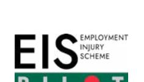

**Figure Description:**
The image displays a logo with text that reads "EIS EMPLOYMENT INJURY SCHEME." Below the main title, there is additional text stating "BULLETIN," which suggests that the content of the image may be related to an employment injury bulletin or publication from the Employment Injury Scheme (EIS). The acronym "EIS" stands for Employment Injury Scheme, indicating that it relates to a program or organization associated with workplace injuries within an employment context. The use of bold letters and capitalization emphasizes the importance or official nature of the information being conveyed by the logo. The color scheme consists mainly of black and green hues, giving the logo a professional and organized appearance. There are no visible numbers or specific numerical data provided within the scope of this description.

reduction in accidents.

In Bangladesh, we joined an initiative in collaboration with the government to better protect garment workers, led by the ILO and the Deutsche Gesellschaft für Internationale Zusammenarbeit (GIZ), an agency focused on international cooperation for sustainable development. The initiative seeks to strengthen employment injury insurance in the Bangladesh garment sector, so that workers have access to immediate financial support in case of any workrelated injuries.

We continued to work with the International

(SCORE) program to support productive, healthy,

and safe working environments among small

and medium manufacturers. In 2023, 18 of our suppliers participated in SCORE training across China, India, and Indonesia, participating in over 8,500 hours of training. Third-party assessments

conducted before and after training identified improvements in workplace health and safety,

productivity, and worker satisfaction, as well as a

Labour Organization (ILO) Sustaining

Competitive and Responsible Enterprises

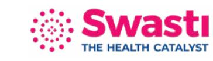

**Figure Description:**
The image displays a logo with textual elements. At the top of the logo is the word "Swasti" in bold pink letters. Below it, there are two lines of text: "THE HEALTH CATALYST" in uppercase blue letters, which suggests that Swasti may be associated with health-related services or initiatives. The background of the logo is white, providing contrast to the colored text. There's also an abstract design resembling a flower or sunburst composed of small red circles arranged in a circular pattern around the letter 'S'. This graphic element adds visual interest to the logo while potentially symbolizing growth, vitality, or energy. Overall, the logo appears to be for a brand named "Swasti," possibly related to health care or wellness, as indicated by the accompanying slogan.

Through our ongoing collaboration with Swasti, a global nonprofit dedicated to providing quality health care for marginalized workers in India, we provided access to primary health care, delivered trainings on social protection, and raised awareness of gender equity and the prevention of sexual harassment among our supply chain employees in India. As of the end of 2023, we had reached over 2,060 workers in India through Swasti's health care programs.

**Figure Description:**
The image displays a collection of rectangles with rounded corners arranged diagonally from the top left to the bottom right corner against a white background. Each rectangle has a different color: blue, green, purple, red, orange, yellow, pink, and light gray. These colors are not uniform but rather appear as overlapping or blended areas that create a mosaic effect. There is no text present in the image. The style of the image suggests it could be an abstract representation or possibly a digital art piece. The precise arrangement of the rectangles does not follow any specific pattern; instead, each rectangle seems randomly placed within the overall composition.

In partnership with Social Accountability International (SAI), we launched SAI's TenSquared in 2023, a new worker engagement program for suppliers in China, India, and Malaysia to solve health and safety issues. The structured workplace engagement program unites workers and managers to address the root causes of workplace issues and includes a goal to measurably improve a specific workplace challenge in 100 days. In this way, it helps overcome institutional hurdles to foster a culture of continuous improvement. TenSquared complements our existing safety program but requires less time and covers more regions, allowing us to scale our efforts more efficiently.

**Figure Description:**
The image displays a stylized graphic of a smiley face with a curved line for the mouth and two dots representing eyes. To the right of the smiley face is an arrow-like shape that curves upwards to the left, suggesting movement or directionality. There are no visible texts within the image. The style of the image appears to be simple and modern, possibly used as a logo or icon due to its minimalistic design. The colors used are primarily green and blue, which may suggest a connection to nature, technology, or branding. However, without additional context, it's difficult to determine the exact meaning or purpose behind these choices.

We engage with our suppliers to establish management systems and responsible recruitment practices that prevent forced labor risks. This includes ending workerpaid recruitment fees—a practice prohibited by our Supply Chain Standards—and requiring suppliers to reimburse any fees paid by workers at any phase of the recruitment process. When we find evidence of recruitment fees, we work with our suppliers to raise their understanding of responsible recruitment practices, create and implement remediation plans to prevent recruitment fees from being charged at any point in the hiring process moving forward, and reimburse affected workers in full and in a manner that protects them and their families from harm and retaliation.

In 2023, we continued to introduce new ways to accelerate industry-wide progress in this priority commitment area. Amazon and the International Organization for Migration (IOM) partnered to collaborate on Promoting the Respect of Human and Labor Rights of Migrant Workers in Global Supply Chains. Through this strategic collaboration, we will work together to advance our suppliers' and business partners' respect of migrant workers' rights and improve safe labor migration and socioeconomic inclusion. Amazon and IOM will focus on human rights due diligence, mapping labor migration processes across relevant corridors, capacity building of supply chain partners in countries of origin and destination, and engaging in multi-stakeholder initiatives to drive positive change across relevant industries.

We encourage suppliers to participate in external training programs, such as industry association tutorials, to enable them to better recognize and prevent modern slavery and implement high-quality management systems. We also provide suppliers with responsible recruitment training. In 2023, we extended our responsible recruitment training to our logistics and services providers and expanded offerings in additional countries that are common destinations for foreign migrant workers. Working with the Issara Institute, MicroBenefits, the Mekong Club, and Verité, we offered

**Figure Description:**
The image displays a stylized icon of an open book or notebook with a green border and a white background inside the outline. Inside the notebook, there is a checkmark symbolizing approval or completion. There are no visible texts or numbers within the image that provide additional context about its meaning or purpose. The style of the image suggests it could be used as a graphic element for various applications such as educational materials, project management tools, or digital interfaces where tasks can be marked off or checked.

### **Responding to Violations of Our Supply Chain Standards in Saudi Arabia**

In 2023, Amazon found violations of our Supply Chain Standards at a third-party licensed temporary labor agency ("third-party vendor") in Saudi Arabia through an independent audit. The violations ranged from recruitment fees paid by migrant workers to the absence of grievance mechanisms and issues with worker accommodations. External organizations raised similar concerns and shared information with us about these and other human rights risks collected during interviews with former employees of this third-party vendor.

In response, we conducted a deeper dive into practices of our third-party vendors throughout Saudi Arabia and developed a series of short- and long-term measures to remedy immediate issues and prevent future recurrence. We brought in two independent third parties to assist with our investigation and engaged directly with contracted workers through interviews to help establish reimbursement amounts and manage repayment. As of February 2024, we had reimbursed more than 700 contracted workers across all our third-party vendors in Saudi Arabia, totaling more than \$1.9 million in reimbursed recruitment fees and related costs. Through audits, we also verified that the third-party vendor remediated concerns

about worker housing. Additionally, we secured the vendor's commitment that even after its employees no longer work at Amazon, it will pay them in line with their contracts and won't move them to a new accommodation site that fails to meet Amazon's standards. The vendor also established a more robust system to enable workers to anonymously raise grievances moving forward.

We also adopted enhanced controls to reduce the risk of recurrence, including strengthening contracts to clarify expectations regarding compliance with our Supply Chain Standards; reviewing wage policies, including clarification that illegal wage deductions are prohibited; providing additional training to vendors in the region on how to implement our Supply Chain Standards, including responsible recruitment practices; and improving our communication mechanism that enables contracted workers to share concerns directly with Amazon management. We continue to monitor improvements and progress, including through ongoing site visits, and are committed to ongoing and continuous improvement region-wide.

**Learn more** about our response on About Amazon

supplier training sessions on modern slavery risks and responsible recruitment practices in Malaysia, Saudi Arabia, Singapore, Taiwan, Thailand, and the United Arab Emirates. These sessions focused on topics including implementing effective risk mitigation controls, identifying issues in recruitment and hiring processes for migrant workers, and establishing strong management systems to address and prevent these issues.

**Learn more** about our work to address human trafficking in our supply chain in [our Human Rights section](#page-44-0) and in our [Modern Slavery Statement](https://sustainability.aboutamazon.com/modern-slavery-statement.pdf)

## Environmental Protection

As one of our six priority commitment areas, we strive to source products and services that avoid unnecessary environmental harm. To do this, we work with industry experts to increase our understanding of the environmental challenges we face, our performance against them, and effective solutions we can implement to address them.

For example, since 2020, we have worked with the Institute of Public & Environmental Affairs, a nonprofit environmental research organization in China that focuses on promoting environmental information disclosure and improving environmental governance. We leverage its public database to screen our supplier sites in China for environmental violations. In 2023, we screened 100% of our product manufacturing suppliers of Amazon Private Brands, AWS, Amazon Devices, and Amazon Fresh Private Brands in China. When we identified concerns, we worked with suppliers to remediate them. We also encouraged suppliers to publicly disclose their corrective actions to drive transparency and accountability.

Industry associations are another important part of our work to help our suppliers reduce their emissions and resource use. As a part of [Cascale](https://cascale.org/) , Amazon encourages suppliers to evaluate their practices using the Higg Facility Environmental

**Figure Description:**
The image displays a stylized graphic of a smiley face with an abstract design that resembles a smiling mouth or lips. The color scheme consists mainly of shades of green, with some white space around the edges. There are no visible texts or numbers within the image itself. The style is minimalistic and modern, using simple shapes to convey the concept of happiness or positivity.

Module (FEM), a self-assessment owned and developed by Cascale, exclusively licensed to the [Worldly](https://worldly.io/) sustainability data and insights platform. The assessment evaluates performance and prioritizes opportunities for improvement across seven areas: air emissions, carbon emissions, chemicals management, environmental management systems, waste, wastewater, and water. In 2023, 67% of Amazon's Private Brands Tier 1 apparel suppliers completed the Higg FEM, helping them better understand their environmental performance and practices.

**Learn more** about how we [engage suppliers to help us](#page-20-0) [meet our goal to reach net-zero carbon emissions](#page-20-0)

## Access to Effective Grievance Mechanisms

We want our supply chain workers to have the ability to voice their concerns about the workplace in a safe and confidential manner. To do this, we connect suppliers and service providers with trusted tools, products, and systems to hear directly from workers about their experiences and support the resolution of issues from workers' perspectives. We believe this is fundamental to supporting the safety and well-being of the workers in our supply chain.

In 2023, we helped connect supplier sites across Bangladesh, Cambodia, China, India, Malaysia, Pakistan, and Thailand with independent grievance mechanisms. Of the nearly 800 worker grievances raised using these mechanisms, 100% were investigated and resolved.

The Amader Kotha Helpline and Ulula are two examples of effective grievance mechanisms that we introduced to our suppliers. The Amader Kotha Helpline is an independent helpline serving the ready-made garment sector in Bangladesh, while Ulula uses a range of grievance mechanisms—including helplines to messaging platformsto serve workers and communities in industries spanning garment, agriculture, mining, and more. Using these channels, suppliers can gather feedback directly from workers to inform more effective issue resolution. In 2023, through the Amader Kotha Helpline, workers in Bangladesh reported nearly 760 grievances, of which over 560 related to workplace concerns. The top five workplace concerns for Amazon suppliers were wages, leave, verbal abuse, factory welfare facilities, and termination, while the remaining inquiries included more general topics such as domestic issues or the government's policy on worker benefits. Ulula, meanwhile, is available to workers in Cambodia, China, India, and Pakistan. During 2023, workers with access to Ulula most frequently reported issues related to health and safety and wages.

In 2023, we expanded our grievance mechanisms program to include additional supplier segments across our supply chain. In Japan, we partnered with the Japan Platform for Migrant Workers Towards Responsible and Inclusive Society (JP-MIRAI) so that certain suppliers in Japan could provide their workers access to JP-MIRAI's independent grievance mechanism.

In the Middle East, North Africa, Mexico, the UK, and the U.S., we conducted focus groups with contract workers within our global operations to understand their familiarity with grievance mechanisms, whether they are able to access them, and what barriers they face in using them.

For all individuals, including members of the public, employees, and workers in our supply chain, we introduced a new way to notify us about potential human rights and environmental concerns—a [web form](https://compliance-central.amazon.com/hrecomplaints) where people can anonymously report cases directly to Amazon. The form is available in 19 languages and dialects and can be accessed globally.

**Figure Description:**
The image displays a graphic icon consisting of two speech bubble shapes with an exclamation mark inside one of them. This icon is commonly used to indicate that there are unread messages or notifications available for viewing. There are no visible numeric values within the image itself; however, it's implied that such numbers might be associated with the number of unread messages or notifications typically found in messaging apps or email clients. The style of the icon suggests a digital interface design, often seen in user interfaces for communication applications.

**Report to Resolution: The Amader Kotha Process in Action** 

Whenever grievances are raised through the Amader Kotha Helpline, the organization works with factory management to address and resolve issues as quickly as possible and, ultimately, improve working conditions for employees.

For example, in 2023, a worker called the helpline to raise a concern about a supervisor using abusive language with employees. The caller wanted the behavior to stop but did not want to anger the supervisor or be singled out. To ensure timely and effective remediation, Amader Kotha quickly contacted our supplier's management without disclosing any personal information that could identify the complainant. In response, the supplier's management counseled the supervisor on appropriate behavior, after which the worker noticed a marked improvement in the supervisor's language. We are proud to support Amader Kotha's efforts to bring about timely remediation to worker concerns and improve working conditions in manufacturing facilities.

# Looking Forward

Building responsible supply chains is an ongoing endeavor one that requires collective effort and continuous improvement from Amazon, our suppliers, and our network of expert partners. We are investing in identifying and addressing the most severe human rights and environmental risks throughout our supply chain. We will continue engaging internal and external stakeholders in our efforts to make progress across our six priority commitment areas and, in doing so, enable working conditions that respect supply chain workers and the environments where we operate.

**Figure Description:**
The image displays a stylized graphic of an abstract smiley face with a curved line forming its mouth shape. To the right side of the graphic is a small upward-pointing arrow that appears to be smiling as well. There are no visible texts or numbers within the image itself. The style of the image suggests it could be related to branding or logo design due to its simple yet recognizable form.

# Sustainable Products and Materials

Customers want products that align with their values, and this often includes products created with sustainability in mind. We believe it is important to offer more sustainable products to our customers without compromising on quality, safety, or cost. We are working to do this within our own brands by incorporating sourcing and design practices that support responsible supply chains, circular economy principles, decarbonization, and the use of safer chemicals. At the same time, we're working closely with our selling partners to help them offer more products that qualify for at least one of the 55 certifications in our Climate Pledge Friendly program. To help them get started with Amazon's sustainability programs, we launched the Sustainability Solutions Hub. For our customers, this means access to more products recognized by certifications in the Climate Pledge Friendly program that meet their needs, as well as new ways to easily shop for and discover them.

Launched the [Sustainability Solutions Hub](https://sell.amazon.com/programs/sustainability) , a new resource to help Amazon selling partners accelerate progress on sustainability

1.16B

Items sold that are recognized by certifications in our Climate Pledge Friendly program, a 42% increase from 2022

Actions 100% 1.4M+

> Products recognized by certifications in our Climate Pledge Friendly program available to customers for purchase, a 157% increase from 2022

 Nearly

37.6M

Amazon customers switched to a product recognized by certifications in our Climate Pledge Friendly progra[m30](#page-94-0)

Of Amazon private brands paper products in North America and Europe are either recycled or certified to Forest Stewardship Council, Sustainable Forestry Initiative, or Programme for the Endorsement of Forest Certification standards

28

Newly launched Echo, Fire TV, Fire tablet, Kindle e-reader, Ring, Blink, and smart home devices and accessories were recognized by certifications in our Climate Pledge Friendly program

**Figure Description:**
The image is a photograph that captures two hands holding up pieces of paper or cardstock with different designs printed on them. On the left side of the photo, there's an open hand displaying a piece of material with a green background and a white geometric shape at its center. This design has a blue circle near the bottom edge. To the right, another hand holds up a similar-looking piece of material but with a black circular pattern instead of the blue one. Both materials appear to be part of a craft project involving recycled materials.

In the foreground, there are several wooden blocks arranged neatly in rows. These blocks vary slightly in size and color, suggesting they might be used as building components for the craft project. Above these blocks, there is text overlaying the image which reads: "Our device design teams incorporate recycled materials into our devices when ever possible, with a focus on carbon reduction and responsibly sourced materials."

The overall style of the image suggests it may have been taken from a presentation slide or promotional material related to environmental sustainability practices within a company or organization. The text emphasizes the importance of using eco-friendly materials in product development.

**Figure Description:**
The image displays a stylized graphic of a smiley face with an upward-curving line representing a smiling mouth. This design is commonly associated with emoticons or emojis used to convey emotions in digital communication. There are no visible texts or numbers within the image itself. The style appears modern and minimalistic, using solid colors without any additional details that would provide context for the numerical values you mentioned. If there were specific numeric values intended to be represented by the image, they would typically be provided as text alongside the image rather than being directly incorporated into the visual content.

# Our Approach

We seek to offer our customers more products that align with their preferences and our sustainability goals.

We are improving the materials and sourcing standards for our products, as well as building on our responsible sourcing roadmap developed in 2022 to improve visibility across our supply chains. This roadmap focuses on key materials used for Amazon private brands products and Amazon devices. We continue to work toward our sourcing goals, including our commitment to reduce deforestation risks associated with raw materials and ingredients used in Amazon and Whole Foods Market private brands products. In addition to these commitments, Amazon also complies with European regulations to encourage responsible sourcing and reduce deforestation. We also incorporate recycled materials into many new products and product packaging, particularly in Amazon devices, where feasible.

While many of our sourcing commitments identify materials we seek to include in our private brands products, we also identify those we seek to avoid. Our [Formulated](https://sustainability.aboutamazon.com/chemicals-policy-restricted-substances.pdf)  [Products Restricted Substances List](https://sustainability.aboutamazon.com/chemicals-policy-restricted-substances.pdf) is an extensive list of chemicals we seek to exclude in Amazon private brands baby, household cleaning, personal care, and beauty products in the U.S. and Europe. Our [Restricted Substances](https://sustainability.aboutamazon.com/chemicals-policy-food-contact-materials.pdf)  [List](https://sustainability.aboutamazon.com/chemicals-policy-food-contact-materials.pdf) for packaging outlines the chemicals of concern we seek to avoid in the packaging of Amazon private brands food and beverage products sold in North America. Our private brands apparel, accessory, footwear, and home textile products in North America, Europe, and Japan seek to comply with the Apparel and Footwear International RSL Management (AFIRM) Group's [Restricted Substances List](https://afirm-group.com/afirm-rsl/) . Our compliance teams are responsible for enforcing these restricted substances lists with our suppliers.

Our sustainability efforts are not limited to our own operations. We look for ways to encourage our selling partners to develop products with sustainability in mind, such as through our Climate Pledge Friendly program and the Sustainability Solutions Hub. We also participate in industry partnerships and working groups to drive greater adoption of sustainable and responsible practices.

Additionally, we use our success and scale to engage with certified diverse suppliers and small businesses and share their products with our customer[s.31 T](#page-94-0)hrough our Supplier Diversity Initiative, customers can shop at storefronts that support [women-owned businesses](https://www.amazon.com/b/ref=s9_acss_bw_cg_SBP01_4b1_w?node=17964635011&pf_rd_m=ATVPDKIKX0DER&pf_rd_s=merchandised-search-3&pf_rd_r=QTNNVT8MRNPBCJ97JVHN&pf_rd_t=101&pf_rd_p=2b5741b4-939c-4816-a723-fa74760b4950&pf_rd_i=17879387011) and [Black-owned](https://www.amazon.com/b/ref=sxts_snps?node=18096056011&pd_rd_w=6nMJg&pf_rd_p=ca1f71c2-e59f-4f10-ab31-60774204deef&pf_rd_r=K40898XQ8FANPSZ5RVV4&pd_rd_r=b624b6cc-3d53-4e22-a444-525085035614&pd_rd_wg=3w6BG&qid=1605295761)  [businesses](https://www.amazon.com/b/ref=sxts_snps?node=18096056011&pd_rd_w=6nMJg&pf_rd_p=ca1f71c2-e59f-4f10-ab31-60774204deef&pf_rd_r=K40898XQ8FANPSZ5RVV4&pd_rd_r=b624b6cc-3d53-4e22-a444-525085035614&pd_rd_wg=3w6BG&qid=1605295761) , as well as at the [Amazon Saheli Store](https://blog.aboutamazon.in/empowering-women-entrepreneurs) , which displays products made and sold by women supported by nongovernmental organizations (NGOs) in India.

**Learn more** about how we [create a more inclusive and](#page-63-0)  [equitable business environment for our suppliers](#page-63-0) and [empower small businesses](https://www.aboutamazon.com/impact/empowerment/small-businesses)

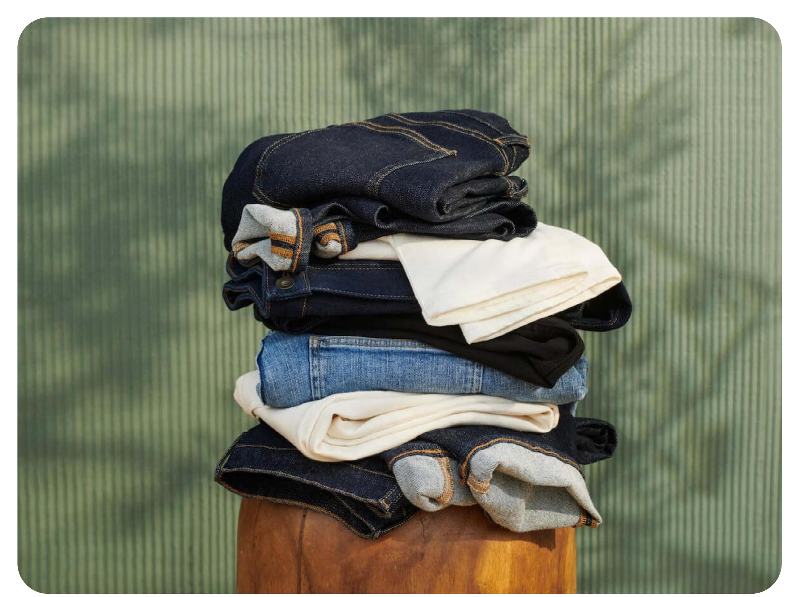

**Figure Description:**
The image shows a stack of folded clothing items against a textured green background. At the bottom of the pile is a pair of blue jeans with visible stitching details such as rivets at the knee area and belt loops along the waistband. Above the jeans are several pairs of white t-shirts, each one neatly folded to showcase its design. On top of the t-shirts, there's another layer of dark denim jeans that appear similar to the ones at the base but may have different wash patterns or styles. The overall arrangement suggests an organized display, possibly for sale or exhibition purposes. There are no texts present in the image.

All cotton for Amazon private brands apparel is sourced from recycled materials, from farms certified as producing organic cotton, or through the Better Cotton Initiative.

**Figure Description:**
The image displays a stylized graphic of a smiley face with an upward-curving line representing a smile. The color scheme consists mainly of shades of green, with some white space around the edges. There are no visible texts or numbers within the image that provide additional context or information about its content or purpose. The style is simplistic and appears to be designed for easy recognition and possibly as part of a logo or branding.

# Our Progress

# Materials and Agricultural Commodities Sourcing

In 2023, Amazon private brands and Whole Foods Market private brands made significant progress toward our deforestation risk reduction and other sourcing goals, achieving those set for paper [prod](#page-94-0)ucts, eggs, cotton, and manufactured cellulosic fibers.32 Amazon private brands also received a brand-level certification from Textile Exchange following a rigorous audit, demonstrating our ability to manage certified goods according to Textile Exchange standards, including its Organic Content Standard and Global Recycled Standard.

- A Whole Foods Market sells only recycled materials or FSC-certified products. Scope includes Amazon private brands paper towel, toilet paper, facial tissue, baking paper, coffee filter, paper dishware, and napkin products.
- B Scope covers Whole Foods Market private brands beef and meat sold in the meat department; fresh or frozen beef in Amazon private brands in North America and Europe.
- C Scope covers Amazon and Whole Foods Market private brands and meat department in North America, including Tiers 2 and 3 of the Consumer Goods Forum Soy Ladder Framework. In Europe, the scope covers soy in Tiers 1–4. A cut-off date of 2020 means that the soy has not been sourced from land that has been subject to deforestation since the end of 2020.
- D For Whole Foods Market, only Fair Trade USA is accepted.
- E Scope for Amazon North America and Europe excludes extracts and flavorings.
- F Scope excludes matcha, mixes, and "ready-to-drink" beverages.
- G Scope includes all products in Whole Foods Market's seafood department, including frozen and breaded options, appetizers, smoked seafood, and seafood dips. Whole Foods Market sells only wild-caught seafood from fisheries that are certified sustainable by the Marine Stewardship Council (MSC) or rated Green or Yellow by the Monterey Bay Aquarium Seafood Watch program. All our farmed seafood is Responsibly Farmed seafood. Canned tuna in grocery and in Whole Foods Market's own kitchens is traceable to the boats and must be sourced from fisheries that are using one-by-one catch methods and certified sustainable by the MSC or rated Green or Yellow by the Monterey Bay Aquarium Seafood Watch program.

# Materials and Agricultural Commodities Sourcing

**No Deforestation**

**Commodity or Material Goal or Ambition 2023 Progress (% of in-scope products that meet our goal or ambition)**

| Palm Oil                               | Source palm oil and derivatives in Amazon private brands food and consumable products and palm oil in 365 by Whole Foods Market food products from sources certified to the Roundtable on Sustainable Palm Oil supply chain standard.                                           | In an effort to achieve this target, Amazon (including Whole Foods Market) became a member of the Roundtable on Sustainable Palm Oil in February 2024.                                                                                        |                                                                                                                                                                                      |                                                                                                                                                                         |
|----------------------------------------|---------------------------------------------------------------------------------------------------------------------------------------------------------------------------------------------------------------------------------------------------------------------------------------|--------------------------------------------------------------------------------------------------------------------------------------------------------------------------------------------------------------------------------------------------|--------------------------------------------------------------------------------------------------------------------------------------------------------------------------------------|-------------------------------------------------------------------------------------------------------------------------------------------------------------------------|
| Paper Products and Paper PackagingA | Source private brands paper products that are either recycled or certified to Forest Stewardship Council (FSC), Sustainable Forestry Initiative (SFI), or Programme for the Endorsement of Forest Certification (PEFC) standards.                                               | 100% 365 by Whole Foods Market-branded products                                                                                                                                                                                            | 100% Amazon private brands North America                                                                                                                                       | 100% Amazon private brands Europe                                                                                                                                    |
|                                        | We strive to use sustainably sourced fiber in our grocery and consumable private brands paper-based primary packaging.                                                                                                                                                             |                                                                                                                                                                                                                                                  | We are working with our private brands suppliers to increase the amount of fiber from responsibly managed forests and/or recycled materials in our paper-based primary packaging. |                                                                                                                                                                         |
| Beef B                                 | By 2025, source private brands beef from regions of low deforestation risk or with full supply chain traceability, demonstrating the products did not contribute to deforestation.                                                                                              | 100% Whole Foods Market private brands                                                                                                                                                                                                     | 92% Amazon private brands North America                                                                                                                                        | 100% Amazon private brands Europe                                                                                                                                    |
| SoyC                                   | Conduct a risk assessment of the soy in Amazon and Whole Foods Market private brands supply chains with a third-party consultancy and share more information by the end of 2023.                                                                                                | Within North America, we determined through this assessment that the majority of the soy in our private brands animal protein and meat counter supply chains is domestically sourced and thus is unlikely to pose a deforestation risk. |                                                                                                                                                                                      | Within Europe, Amazon's goal is that the soy in private brands supply chains will be deforestation-free by the end of 2025, with a cut-off date of 2020. |
| CocoaD                                 | By 2025, source private brands chocolate bars, chocolate chips, and baking chocolate/powder products that are certified by Rainforest Alliance, Fairtrade International, Fair Trade USA, or other independently verified third-party certifications, such as Cocoa Horizons. | 100% 365 by Whole Foods Market-branded products                                                                                                                                                                                            | 53% Amazon private brands North America                                                                                                                                        | 100% Amazon private brands Europe                                                                                                                                    |
| CoffeeE                                | By 2025, source private brands packaged bean, ground, instant, and liquid coffee products that are Rainforest Alliance, Fairtrade International, or Fair Trade USA certified.                                                                                                   | 100% 365 by Whole Foods Market-branded and Whole Foods Market-branded products                                                                                                                                                          | 98% Amazon private brands North America                                                                                                                                        | 100% Amazon private brands Europe                                                                                                                                    |
| TeaF                                   | By 2025, source private brands bagged tea products based on the tea leaf (camellia sinensis) certified by Rainforest Alliance, Fairtrade International, or Fair Trade USA.                                                                                                      | 100% 365 by Whole Foods Market-branded products                                                                                                                                                                                            | 18% Amazon private brands North America                                                                                                                                        | Amazon private brands in Europe does not currently have tea products.                                                                                             |
|                                        | Sustainable Seafood and Animal Welfare Goals and Ambitions                                                                                                                                                                                                                            |                                                                                                                                                                                                                                                  |                                                                                                                                                                                      |                                                                                                                                                                         |
| Seafood                                | Source Responsibly Farmed or sustainable wild-caught fresh and frozen seafood to Whole Foods Market's Seafood Quality Standards . G                                                                                                                                             | 100% Whole Foods Market                                                                                                                                                                                                                       | n/a                                                                                                                                                                                  | n/a                                                                                                                                                                     |

**Figure Description:**
The image displays a stylized graphic of a smiley face with an abstract design that resembles a smiling mouth or lips. The color scheme is simple, featuring shades of green and blue against a white background. There are no visible texts or numbers within the image itself. The style appears to be minimalistic and modern, likely intended for branding purposes given its clean lines and limited colors.

| Commodity or Material                                                                                         | Goal or Ambition                                                                                                                                                                                                                                                                                                                                                                                                                                                                                                             | 2023 Progress (% of in-scope products that meet our goal or ambition)                                                                                                                                                                                                                                 |                                                                                                                                            |                                                                                                                |
|---------------------------------------------------------------------------------------------------------------|------------------------------------------------------------------------------------------------------------------------------------------------------------------------------------------------------------------------------------------------------------------------------------------------------------------------------------------------------------------------------------------------------------------------------------------------------------------------------------------------------------------------------|-------------------------------------------------------------------------------------------------------------------------------------------------------------------------------------------------------------------------------------------------------------------------------------------------------|--------------------------------------------------------------------------------------------------------------------------------------------|----------------------------------------------------------------------------------------------------------------|
|                                                                                                               | Sustainable Seafood and Animal Welfare Goals and Ambitions                                                                                                                                                                                                                                                                                                                                                                                                                                                                   |                                                                                                                                                                                                                                                                                                       |                                                                                                                                            |                                                                                                                |
| Seafood (cont'd)                                                                                              | Source Amazon private brands seafood products that have a third-party sustainability certification or are actively working toward certification or engaged in a fishery improvement project (FIP).H                                                                                                                                                                                                                                                                                                                       | n/a                                                                                                                                                                                                                                                                                                   | 100% Amazon private brands North America                                                                                                | Data for Amazon private brands in Europe is being verified. Updated figures due to be published in 2025. |
| Eggs                                                                                                          | Source shell and liquid egg products to a cage-free or higher animal welfare standard.                                                                                                                                                                                                                                                                                                                                                                                                                                       | 100% Products sold in Whole Foods Market dairy cases, own kitchens, and bakeries in the U.S. meet Whole Foods Market's Animal Welfare Standards for Laying Hens .                                                                                                                         | 100% Amazon private brands and national brands shell and liquid egg selections sold in North America are cage-free.               | 100% Amazon private brands shell eggs sold in Europe are free-range or barn-raised.                      |
| Pork                                                                                                          | Source fresh pork sold in the Whole Foods Market meat department in the U.S. and Canada that is crate-free and certified by the Global Animal Partnership.                                                                                                                                                                                                                                                                                                                                                                | 100% Whole Foods Market                                                                                                                                                                                                                                                                            | n/a                                                                                                                                        | n/a                                                                                                            |
| By the end of 2025, source private brands pork and bacon products sold in North America gestation crate-free. |                                                                                                                                                                                                                                                                                                                                                                                                                                                                                                                              | More information to be shared in 2025.                                                                                                                                                                                                                                                                | We have transitioned some private brands pork products to gestation crate-free sourcing and are evaluating the viability of the remainder. |                                                                                                                |
|                                                                                                               | Source private brands fresh pork products that are certified by Red Tractor in the UK.                                                                                                                                                                                                                                                                                                                                                                                                                                       | n/a                                                                                                                                                                                                                                                                                                   | n/a                                                                                                                                        | 100% Amazon private brands Europe                                                                           |
| Other Animal Proteins                                                                                         | Source all fresh beef, pork, chicken, turkey (excluding kosher turkey), and lamb sold in the meat department to Whole Foods Market's Animal Welfare Standards .                                                                                                                                                                                                                                                                                                                                                           | 100% Whole Foods Market                                                                                                                                                                                                                                                                            | n/a                                                                                                                                        | n/a                                                                                                            |
|                                                                                                               | Source animal protein products within Amazon private brands in North America and Europe to the following requirements under our animal welfare policy: (1) Products or raw materials must be sourced from farms assured to an approved animal welfare or quality program or standard audited regularly by an independent third party, (2) suppliers must have a formal process for ensuring the welfare of animals in their supply chain, and (3) products or raw materials must be traceable from their origin. | We are working with key animal protein suppliers to confirm they meet our existing animal welfare policy. We are actively enhancing our commitment to animal welfare for our private brands to build upon our established supplier requirements and plan to share key updates in 2025. | n/a                                                                                                                                        | n/a                                                                                                            |
| Apparel Goals and Ambitions                                                                                   |                                                                                                                                                                                                                                                                                                                                                                                                                                                                                                                              |                                                                                                                                                                                                                                                                                                       |                                                                                                                                            |                                                                                                                |
| Cotton                                                                                                        | Source all cotton for Amazon private brands apparel products from more sustainable sources, which we define as being sourced from recycled materials, from farms certified as producing organic cotton, or through the Better Cotton Initiative.                                                                                                                                                                                                                                                                       | n/a                                                                                                                                                                                                                                                                                                   | Amazon private brands apparel products                                                                                                     | 100%                                                                                                           |
| Leather                                                                                                       | Source leather apparel and shoe products from more sustainable sources, which we define as being sourced from tanneries that meet the Leather Working Group's Bronze level or higher.                                                                                                                                                                                                                                                                                                                                     | n/a                                                                                                                                                                                                                                                                                                   | Amazon did not source any private brands apparel or shoes made from leather in 2023.                                                       |                                                                                                                |
| Manufactured Cellulosic Fibers                                                                             | Source manufactured cellulosic fibers used in Amazon private brands apparel products—including rayon, viscose, lyocell, and modal—from more sustainable sources. We use the nonprofit Canopy's tools and reports to help avoid fibers sourced from endangered forests, endangered species' habitats, or other controversial sources.                                                                                                                                                                                   | n/a                                                                                                                                                                                                                                                                                                   | Amazon private brands apparel products                                                                                                     | 100%                                                                                                           |
| Recycled Fabrics                                                                                              | Increase the use of recycled fabrics in Amazon private brands apparel products, including moving from conventional to recycled polyester and launching products made from innovative recycled fibers.                                                                                                                                                                                                                                                                                                                     | n/a                                                                                                                                                                                                                                                                                                   | 16% Polyester in Amazon private brands apparel products is recycled polyester.                                                       |                                                                                                                |

H Scope includes Amazon private brands products sold in North America and Europe in which seafood comprises more than 5% of the product or is in the top three ingredients. Excludes sauces, marinades, and pet food. The following certifications or programs are accepted for wild-caught seafood: Marine Stewardship Council; rated Green or Yellow by the Monterey Bay Aquarium Seafood Watch program; or rated A, B, or C in an FIP. The following are accepted for farmed seafood: Aquaculture Stewardship Council; European organic or Naturland organic; Best Aquaculture Practices ≥ 2-star; or GLOBALG.A.P.

**Figure Description:**
The image displays a stylized graphic of a smiley face with an abstract design that resembles a smiling mouth or lips. This graphic is predominantly green with some white space within it. To the right side of the image, there appears to be a small upward curve, which might suggest a continuation of the smiley face's shape. There are no visible texts or numbers in the image provided. The style of the image is simplistic and modern, using flat colors without any shading or depth effects. It could potentially be associated with branding, logos, or emojis due to its minimalist and iconic nature.

# Amazon Private Brands

We consider sustainability from the beginning stages of design for our private brands products. Through our commodities sourcing goals, we prioritize using recycled content, reducing material use, and improving recyclability of our products. We also consider the use phase of our products and have programs in place to help customers keep their products in use for longer. In 2023, we expanded these efforts by launching a spare parts and repair program in Europe for our private brands products.

Amazon non-grocery private brands offers everything from beauty and skin care to diapers and infant wipes. In 2023, we published a [Formulated Products Restricted Substances](https://sustainability.aboutamazon.com/chemicals-policy-restricted-substances.pdf) [List](https://sustainability.aboutamazon.com/chemicals-policy-restricted-substances.pdf) for cleaning, beauty, and personal care. We also expanded our compliance with [AFIRM's Restricted](https://afirm-group.com/afirm-rsl/)  [Substances List](https://afirm-group.com/afirm-rsl/) to home textile products, which we actively enforce with our suppliers. Responsible Mineral Sourcing

# Amazon Devices

We believe products can and should be more sustainable while maintaining high quality and affordability. In 2023, we launched 28 new Echo, Fire TV, Fire tablet, Kindle e-reader, Ring, Blink, and smart home devices and accessories that were recognized by certifications in our Climate Pledge Friendly program.

We design our devices with a focus on carbon reduction and manufacture them with responsibly sourced materials. Sustainability is considered throughout the lifecycle of a product—from how we build it to how our customers use and retire it. We want every new Amazon device to be more energy-efficient and less resource-intensive than the previous generation.

**Learn more** about how we are [making our devices more](#page-19-0)  [carbon- and resource-efficient](#page-19-0) , [investing in carbon-free](#page-23-0)  [energy](#page-23-0) , and [giving devices a second chance](#page-37-0)

We incorporate recycled materials into our devices whenever possible. As of the end of 2023, among Echo, Fire TV, Fire tablet, Kindle, and smart home products, we had various products made from majority- or all-recycled content, including those containing:

- **•** 75% recycled plastic
- **•** 100% recycled yarn
- **•** 100% recycled aluminum
- **•** 90% recycled magnesium

In addition to using recycled materials in our devices, we extend this practice to device packaging.

**Learn more** about our [device packaging](#page-32-0) and [device recycling](#page-37-0)

While Amazon does not engage in direct sourcing from mine sites and smelters, we are committed to avoiding the use of minerals that have fueled conflict. We strive to have 100% of tin, tungsten, tantalum, and gold (3TG) smelters and refiners in our supply chain conform with a recognized minerals certification program. These certifications, such as the Responsible Minerals Initiative (RMI)'s Responsible Minerals Assurance Process (RMAP), are critical to enabling responsible raw material sourcing and processing upstream in the supply chain. We support suppliers in their efforts to increase smelter audits through RMAP, and we expect our suppliers to remove nonconformant smelters from our supply chain.

Cobalt is a raw mineral used in batteries, including those for electric vehicles. In 2023, we built on our existing 3TG due diligence processes and conducted cobalt due diligence with additional suppliers using industry-standard reporting templates. This improves our efforts to understand and mitigate risks in the cobalt supply chain while also signaling to suppliers the importance of responsible mineral sourcing beyond 3TG.

We engage suppliers on the importance of responsible mineral sourcing mechanisms and industry collaboration. We also maintain membership in RMI, the Copper Mark, and the Public-Private Alliance for Responsible Minerals Trade. Through these, we collaborate with industry peers, governments, and civil society actors on increasing supply chain transparency and improving sourcing across mineral value chains.

In 2023, we partnered with the U.S. Agency for International Development (USAID), [BHP Foundation](https://www.bhp.com/sustainability/communities/bhp-foundation) , and the Chandler Foundation for the Powering a Just Energy Transition Green Minerals Challenge (JET Minerals Challenge). Amazon mentored finalists and participated in a pitch workshop to catalyze the development, application, and scaling of innovations to strengthen transparency and counter corruption in critical mineral supply chains. The JET Minerals Challenge closed with 11 winners from 15 countries and targeted more than 10 mineral supply chains critical to the energy transition.

# Climate Pledge Friendly

## Certifications

Our Climate Pledge Friendly program helps customers discover more sustainable products that are recognized to have at least one sustainable feature. In 2023, our customers continued to embrace this program, purchasing 1.16 billion items recognized by certifications in the Climate Pledge Friendly program—a 42% increase from 2022.

In order to provide this breadth of options for our customers, we encourage our selling partners to develop and offer products that meet the criteria for one or more of the 55 certifications in our Climate Pledge Friendly program. These certifications recognize products that address at least one aspect of sustainability, ranging from recycled content to energy efficiency to safer chemicals.

We routinely assess the certification landscape, adding and developing new certifications for the program and reviewing our existing ones against our high bar for transparency, credibility, and customer trust. International Sustainability and Carbon Certification (ISCC+) to help customers easily identify products that are made with recycled content and bio-based materials. We also added the U.S. Cotton Trust Protocol, a product-traceable cotton standard that drives continuous improvement across water use, energy efficiency, carbon emissions, soil conservation, soil carbon, and land use. When selling partners offer a product with a sustainability feature not captured by an existing certification in the program, we consider supporting opportunities to fill the gap. For example, in 2023, Amazon initiated the development of the Recycled Content Standard for Electronics and Electrical Equipment in partnership with standards development organization SCS Standards. This involved a multi-stakeholder process with representatives from industry and NGOs including the Center for the Circular Economy at Closed Loop Partners, the Ellen MacArthur Foundation, De'Longhi, Dell Technologies, HP, Microsoft, Logitech, Philips, and The Recycling Partnership.

We expanded our collaboration with the Ellen MacArthur Foundation to drive scalable, industry-wide solutions for a circular economy in 2023. As a Strategic Partner of the Ellen MacArthur Foundation Network, we are working to leverage our reach, technology, and innovation capabilities and the foundation's subject-matter expertise to launch and scale circular economy solutions. Through this partnership, we are working to develop certifications for products with circular features, providing customers with the information they need to make a more circular choice. These certifications encourage brands, original equipment manufacturers, suppliers, retailers, and e-commerce platforms to create products that are designed in accordance with circular economy principles.

We collaborate with our selling partners to identify opportunities for them to develop more sustainable products and apply for certifications that recognize the strides they are already making in sustainability. In 2023, we worked with a variety of selling partners—such as L'Oréal, Levi's,

**Figure Description:**
The image displays a stylized graphic of a smiley face with an open mouth, which is commonly associated with happiness or joy. The color scheme consists mainly of green shades, with darker tones used for the outline and lighter tones for the fill. There are no visible texts within the image. The style appears to be simple and modern, likely intended as a logo or icon due to its clean lines and minimalistic design. The overall impression is that it could be related to branding or user interface elements where such symbols might convey positive emotions or actions.

Procter & Gamble (including its brands Pampers, Oral-B, and Braun), and Earth Rated—to qualify products that could be recognized by certifications in the Climate Pledge Friendly program.

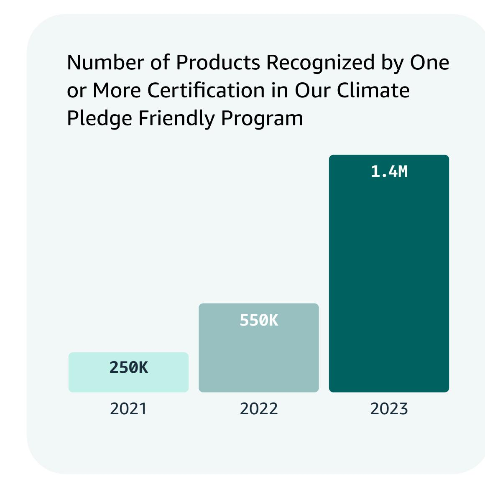

**Figure Description:**
The image is a graphical representation of data related to product recognition by One or More Certification in Our Climate Pledge Friendly Program. It shows three bars with numerical values indicating different years: 2021, 2022, and 2023. Each bar represents a specific year's certification count for products recognized under the program.

The tallest bar, labeled "1.4M," corresponds to the year 2023, suggesting that there were approximately one million four hundred thousand (1,400) products certified during that time period. Below it are two shorter bars representing previous years; the leftmost bar has a value of "550K" for the year 2022, which indicates around five hundred fifty thousand (550) products certified then, while the rightmost bar has a value of "250K" for the year 2021, implying about two hundred fifty thousand (250) products certified in that year.

Above these bars, there is text providing context for the numbers presented. This reads "Number of Products Recognized by One or More Certification in Our Climate Pledge Friendly Program." The overall style of the image suggests it could be part of an infographic or report summarizing environmental sustainability efforts within a company or organization.

# Improving Customer Discovery

We have helped nearly 37.6 million Amazon customers switch to products recognized by certifications in the Climate Pledge Friendly program, in part by enabling new online shopping features to guide their browsing.

For our Amazon Business customers, we are partnering with them to create procurement policies that place a preference on products recognized by certifications in the Climate Pledge Friendly program. As of December 2023, more than 51,000 businesses had these buying policies in place, up from 18,000 in 2022.

# The Sustainability Solutions Hub

We launched the [Sustainability Solutions Hub](https://sell.amazon.com/programs/sustainability) in 2023 for Amazon selling partners in France, Germany, Italy, Spain, the UK, and the U.S. The Hub helps them get started with Amazon's sustainability programs, including Climate Pledge Friendly, Amazon Renewed, and Ships in Product Packaging. It includes a curated set of third-party service providers to support selling partners in designing and certifying more sustainable products and packaging, as well as personalized reporting dashboards.

As part of the Hub, we launched new dashboards that provide selling partners with personalized, relevant data and information so they can:

- **•** Track their monthly sales in Amazon's sustainability programs over the past 12 months.
- **•** Identify their other products that are eligible or candidates for our sustainability programs.
- **•** Highlight products that are currently enrolled in Amazon's sustainability programs.

In 2023, over 200,000 selling partners participated in Amazon's sustainability programs.

# Looking Forward

We continue to evolve the customer shopping experience and make the discovery of products with sustainability features even easier. In March 2024, we launched a new online shopping experience that highlights these features (see visual, right), such as recycled materials and organic content, in products that are recognized by one or more certification in the Climate Pledge Friendly program. We also look forward to expanding and refining the Sustainability Solutions Hub to support our efforts to welcome our selling partners into our sustainability programs and give them the resources they need to succeed in sharing more sustainable products with our customers.

# Discover Product Sustainability Features

Helping customers discover products with sustainability features throughout the online shopping experience.

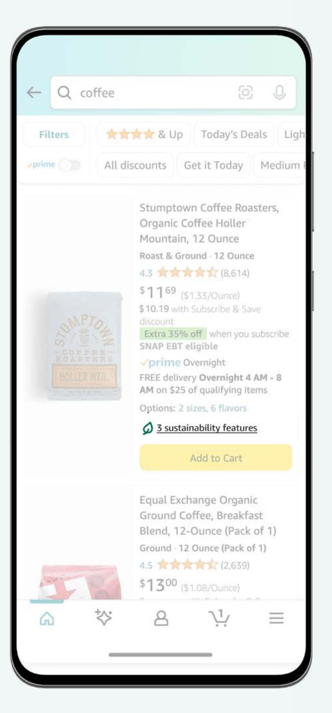

**Figure Description:**
The image is a screenshot of an online shopping interface for coffee products. At the top left corner, there's a search bar with the word "coffee" highlighted. Below that are various filters such as "Filters," "Star & Up," "All discounts," "Today's deals," "Light," and others. On the right side, there are options like "Get it today," "Medium," and more.

The main content area shows a product listing from a store named "Stump Town Coffee Roasters." It offers organic coffee holler Mountain, 12 ounce at $4.95 per pound. There is also a sale price indicated: "$3.00 when you subscribe (SAVE $1.95)." Additional information includes free delivery overnight AM-8 PM EST, extra 35% off when you subscribe to Snap EBT eligible items, and prime overnight shipping available for $6.99.

Below the product description, there are two images showing different packaging options. One package is labeled "Equal Exchange Organic Ground Coffee, Breakfast Blend, 12 ounce Pack of 1," priced at $13.00 ($10.95 if purchased through subscription), and another option is not fully visible but seems to be related to sustainability features.

At the bottom of the screen, there is a navigation menu with sections titled "Home," "Coffee," "Tea," "Equipment," "Gifts," "Subscriptions," and other categories. A cart icon indicates that three sustainable features have been added to the cart. The total cost displayed is "$13.00," which corresponds to the first item listed above.

### **Badging in Search**

The new sustainability features badge makes it easier for customers to discover products from search.

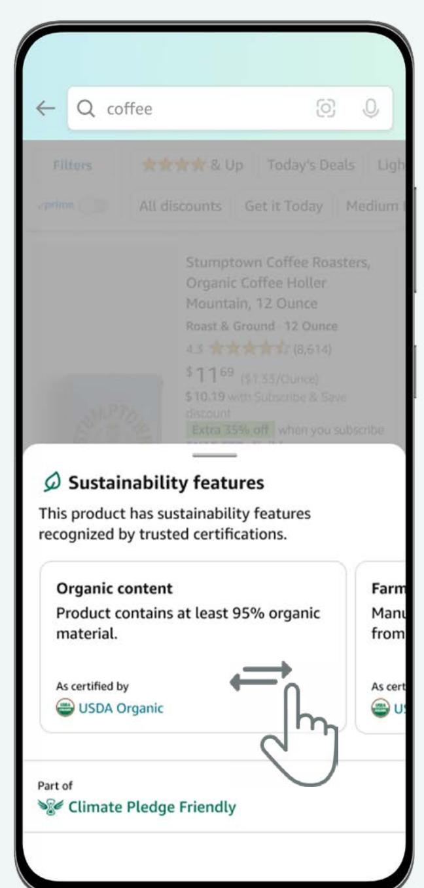

**Figure Description:**
The image appears to be a screenshot of an online shopping interface for coffee products with sustainability features. At the top left corner, there is a search bar labeled "coffee" with a magnifying glass icon next to it. Below that, various filters are listed such as "All discounts," "Today's deals," "Light medium," and others, suggesting options for sorting or filtering the displayed items.

The main content area shows a product listing titled "Stump Town Coffee Roasters, Organic Coffee Holder, Mountain, 12 Ounce." This suggests a brand name, type of coffee (organic), and quantity available (12 ounces). There are two stars visible at the top right corner of the item, indicating some form of rating system.

Below the title, there is a price tag "$10.95" followed by a discounted price tag "$10.19" with a green checkmark symbolizing savings. Additional information includes "43% off" and "Extra 6% off when you subscribe & save," which implies a promotional offer.

Further down, under the heading "Sustainability features," there is a statement saying "This product has sustainability features recognized by trusted certifications." It mentions that the product contains at least 95% organic material.

At the bottom of the screen, there is a button labeled "As certified by USDA Organic," accompanied by a logo representing the United States Department of Agriculture Organic certification program.

In the lower part of the image, there is a section titled "Part of Climate Pledge Friendly," with text stating "Organic content Product contains at least 95% organic material." Next to this, there is a graphic representation of a hand pointing towards the text above it, emphasizing the organic nature of the product.

Overall, the image provides details about a specific coffee product, its pricing, and its environmental credentials, including organic content and certification from the USDA Organic program.

### **Sustainability Feature Details**

With just a click, customers can see more details about each sustainability feature and the product's associated certifications.

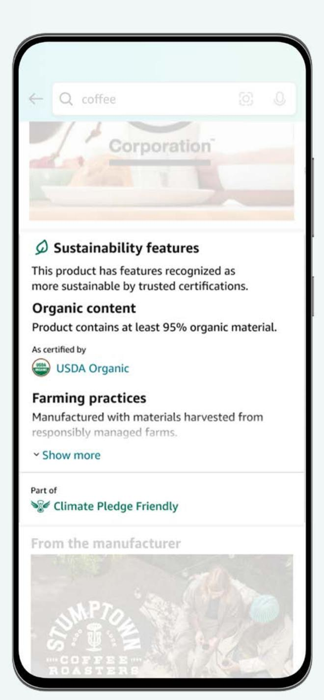

**Figure Description:**
The image is a screenshot of a smartphone displaying information about coffee products with sustainability features. At the top left corner, there's an icon indicating that the search term "coffee" has been entered into the device's browser or application interface. Below this, the title "Corporation" suggests that the content pertains to corporate entities related to coffee production.

The first bullet point states: "This product has features recognized as more sustainable by trusted certifications." This implies that the product being described meets certain environmental standards set forth by various organizations.

The second bullet point reads: "Organic content Product contains at least 95% organic material." This indicates that the product contains a high percentage of organic ingredients, which are typically grown without synthetic pesticides or fertilizers.

Below these points, there's another section titled "Farming practices," followed by a statement: "Manufactured with materials harvested from responsibly managed farms." This suggests that the raw materials used in the manufacturing process come from sources where responsible farming practices have been implemented.

At the bottom right corner, there's a button labeled "Show more," implying that additional details can be accessed if selected.

In the lower part of the screen, there's a logo for "Stumptown Coffee Roasters," suggesting that the company associated with the product is Stumptown. Additionally, there's a badge stating "Part of Climate Pledge Friendly," which signifies that the product aligns with Amazon's commitment to reduce its carbon footprint.

Lastly, there's a photo of two people sitting outdoors, possibly enjoying their time while consuming the product. The overall style of the image is informative and designed to highlight environmentally friendly aspects of the coffee product.

### **Product Pages**

While browsing the product page, customers have access to all of the product's sustainability features and associated certifications.

**Figure Description:**
The image displays a stylized graphic of a smiley face with a curved line for the mouth and two lines forming an abstract representation of eyes or eyebrows. The color scheme consists mainly of shades of green, with some white space around the edges. There are no visible texts or numbers within the image itself. The style is simple and modern, likely intended to convey a positive emotion such as happiness or contentment.

# Supplier Diversity

Building diverse and inclusive supply chains drives innovation, supports competitiveness, meets customers' expectations, and spurs local economic growth through community investment and job creation. For Amazon, a diverse and inclusive supply chain not only strengthens the resilience of our business but also drives the ability to innovate on behalf of our customers through the diverse perspectives and knowledge of people from all backgrounds. We are dedicated to advancing supplier diversity and inclusion (SDI) throughout our supply chain—engaging with diverse-owned and small businesses and driving long-term economic sustainability in the communities we serve.

# Actions

**Figure Description:**
The image displays a graphic icon that is commonly associated with money or financial transactions. It consists of three elements: an envelope symbolizing payment or transaction, a dollar sign indicating monetary value, and a hand gestureing giving or offering. These symbols are arranged vertically against a white background. Each element has a green outline, suggesting a theme related to finance or services provided for a fee. There are no texts present within the image. The style of the image is minimalistic and uses simple shapes and lines to convey its message.

\$4.3B

Spent with more than 500 certified U.S. Tier 1 diverse supplier[s33, 34](#page-94-0)

\$1.5B

Of Tier 2 certified diverse spend reported by more than 200 of Amazon's U.S. suppliers to drive economic impa[ct35, 36](#page-94-0)

30K

Jobs supported by Amazon's supplier diversity spend

\$2.8B

In wages earned from Amazon's certified U.S. Tier 1 supplier diversity spend

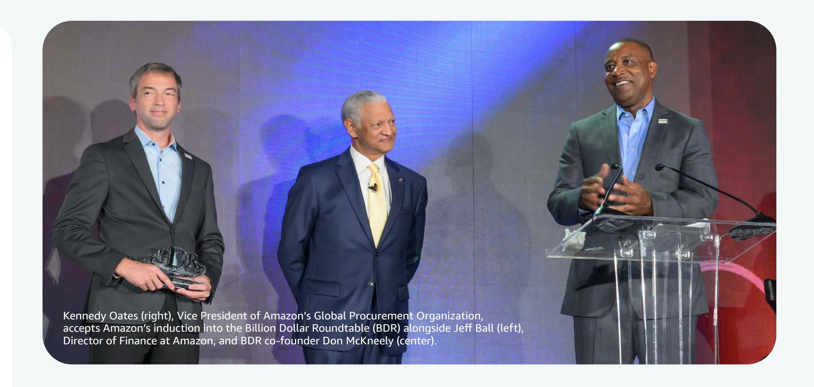

**Figure Description:**
The image appears to be a photograph taken at an event where three men are standing side by side on a stage with microphones. They are dressed formally in suits and ties, suggesting that it is a professional or formal occasion. Each man has a different expression; one is smiling broadly, another is looking directly ahead with a neutral expression, and the third seems to be speaking or gesturing as he looks towards his right.

In the foreground of the image, there's text overlaying the photo. It reads: "Kennedy Oates (right), Vice President of Amazon’s Global Procurement Organization, accepts Amazon’s induction into the Billion Dollar Roundtable (BDR). Jeff Ball (left), Director of Finance at Amazon, and BDR co-founder Don McNeely (center) present." This text provides context about who the individuals are and their roles within Amazon.

The text also mentions the acceptance of an award or recognition from the Billion Dollar Roundtable, which suggests that the event might be related to business achievements or milestones. However, without additional information, the specific details regarding the award or the significance of the Billion Dollar Roundtable remain unclear.

1 of 7

Companies inducted in 2023 into the Billion Dollar Roundtable, an advocacy organization comprising corporations committed to spending \$1 billion annually with certified U.S. Tier 1 diverse suppliers

63

SDI events attended globally

# Nearly \$900M

In personal, business, and sales taxes generated from Amazon's certified Tier 1 diverse supplier spend

7

Countries (Australia, Brazil, Canada, Costa Rica, India, South Africa, and the UK) added to Amazon's SDI initiative—marking its first expansion beyond the U.S.

**Figure Description:**
The image displays a stylized graphic of a smiley face with an open mouth forming a curve that resembles a smile or laugh. The color scheme consists mainly of shades of green, which are used to fill the outline of the smiling face. There is no text present within the image itself. The style appears modern and minimalistic, using simple shapes and lines to convey its message. The overall impression is one of positivity and happiness, as suggested by the shape of the smiley face. However, without additional context, it's not possible to provide specific details about any numerical values or their representation in this image.

# Our Approach

Through Amazon's global supplier diversity and inclusion (SDI) strategy, we strive to build a more inclusive and equitable supply chain that fully reflects the diversity of our customers and employees. To achieve this, we are prioritizing three actions:

- **•** Driving economic benefits by scaling existing and onboarding new certified diverse suppliers, which are businesses certified to be at least 51% owned and operated by an individual or group that is part of a traditionally underrepresented or underserved community
- **•** Expanding SDI initiatives across the globe
- **•** Partnering with advocacy organizations to further engage with certified Tier 1 diverse suppliers worldwide

Within Amazon's supply chain, we require that diverse suppliers have a valid certification from one of our recognized certification agencies. Our SDI program drives inclusion and economic benefits through multiple tiers of our supply chain:

- **•** SDI Tier 1 suppliers, certified diverse businesses that provide goods and services directly to Amazon to operate our businesses
- **•** SDI Tier 2 suppliers, certified diverse businesses that provide goods and services to Amazon's SDI Tier 1 suppliers

# Our Progress

# Driving Economic Benefits with Diverse Businesses

Amazon believes that the intentional inclusion of diversity in our supply chain is a powerful catalyst for economic growth in the communities where we operate—helping increase job creation, wealth distribution, and local development.

Through our SDI strategy, Amazon seeks to make an impact that is measured through jobs supported, wages earned, and economic output generated. By building and strengthening our SDI processes, technologies, and partnerships, we were able to increase our U.S. certified Tier 1 diversity spend by 30% to \$4.3 billion in 2023. In 2023, Amazon's SDI program is estimated to have supported over 30,000 U.S. jobs at certified Tier 1 diverse suppliers, generating approximately \$2.8 billion in wages.

Our efforts included expanding how we identify and introduce underrepresented classifications into our supply chain, improving validation of underrepresented classifications, developing existing suppliers for future growth, and working with our teams to better understand procurement categories where opportunities for greater inclusion exist.

While spending directly with certified Tier 1 diverse suppliers is at the foundation of Amazon's SDI program, we are also focused on expanding this work to underrepresented companies deeper in our supply chain. We do this by encouraging our Tier 1 suppliers to consider diverse businesses in their procurement processes, creating a ripple effect. We refer to this as our Tier 2 SDI spend, an area we believe can have an exponential influence on thousands of diverse businesses around the world. In 2023, more than 200 of our Tier 1 suppliers spent \$1.5 billion with certified diverse businesses. In 2023, we enhanced our Tier 2 reporting system to enable our suppliers to report their diverse supplier spend on a quarterly and, for some, monthly basis.

## Supplier Diversity by the Numbers

|                                       | 2023   |
|---------------------------------------|--------|
| Number of Diverse Suppliers           | 500+   |
| Spend on Diverse Suppliers            | \$4.3B |
| Jobs Supported for Diverse Suppliers  | 30,000 |
| Wages Earned for Diverse Suppliers    | \$2.8B |
| Number of Countries with SDI Programs | 8      |

# Expanding SDI Globally

As a global company, we are able to drive economic empowerment for more businesses around the world. While Amazon's SDI initiative began in the U.S., we are focused on expanding these efforts internationally, integrating more certified diverse suppliers into our global supply chain. We are committed to an inclusive global supply chain and insist on the highest bar of equivalent certification standards and processes, as utilized in the U.S.

In 2023, Amazon expanded our SDI strategy outside the U.S. for the first time, launching in seven new countries: Australia, Brazil, Canada, Costa Rica, India, South Africa, and the UK. This work represents a meaningful step in our journey to

# The Positive Effects of Supplier Diversity in Amazon's Supply Chain

We purchase goods and services directly from small, medium, and large global companies to support our business entities. We define these companies as Tier 1.

**Figure Description:**
The image displays a stylized icon featuring a large green circle with a white dollar sign at its center. Below the circle is an arrow pointing downwards, indicating a decrease or loss of money. There are no additional texts or elements present in the image. The style of the image appears to be simplistic and graphic, commonly used for financial or monetary contexts.

### **Certified Tier 1 Diverse Suppliers**

Our SDI program is dedicated to the inclusion of businesses owned by an individual or group that is a member of a traditionally underrepresented or underutilized group. Spending with certified Tier 1 diverse suppliers spurs economic growth and supports jobs in our suppliers' communities.

**Figure Description:**
The image displays a stylized graphic with two circles connected by an arrow pointing downwards from one circle to another. Both circles are filled with a light green color, and each contains a dollar sign ($) at its center. Inside the larger circle, there is a numerical value of $100, which appears to be the amount being referred to or considered for comparison purposes. Below the smaller circle, where the arrow points, there is no visible number, suggesting that it might indicate a lower amount compared to the $100 above. The overall style of the image suggests it could be related to financial concepts such as budgeting, savings goals, or expenses. There are no texts other than the dollar signs within the circles.

### **Certified Tier 2 Diverse Suppliers**

We encourage our Tier 1 suppliers to also consider purchasing goods and services from certified diverse companies. This creates a ripple effect of investment deeper in our supply chain.

**Figure Description:**
The image displays a stylized graphic of a smiley face with an abstract design that resembles a smile or a happy expression. It is composed of two curved lines forming a shape similar to a smile, one above the other, with a small curve at the end of each line suggesting a mouth. The color scheme consists mainly of shades of green, which are used for both the outline and fill of the graphic. There are no visible texts or numbers within the image itself. The style appears modern and minimalistic, using simple shapes and colors to convey its message.

Human Rights Responsible Supply Chain

Sustainable Products and Materials

Supplier Diversity

Community Impact

serve more communities globally. Outside the U.S., we spent over \$74 million with more than 100 certified Tier 1 global diverse suppliers in 2023.

To support Amazon's global expansion, we participated in SDI events in Australia, Canada, the UK, and the Netherlands, including conferences hosted by Supply Nation (Australia), the Canadian Aboriginal and Minority Supplier Council, and Minority Supplier Development UK. We also participated in the European Supplier Diversity Program (ESDP)'s inaugural procurement conference in the Netherlands. We are committed to supporting ESDP as they work to empower ethnic minority- and immigrant-owned businesses across European markets.

**Figure Description:**
The image displays a stylized icon with graphic elements that suggest quality or certification. At the center of the icon is a circular badge with a checkmark inside it, indicating approval or compliance. Surrounding the central circle are two curved lines forming an elongated oval shape, which could be interpreted as ribbons or banners. These outer curves have a green color, while the inner circle has a white background with a darker shade at its core where the checkmark resides. There are no visible texts within the image to provide additional context about the specific meaning or purpose of the icon. The style of the image appears modern and minimalistic, commonly used for digital interfaces or branding materials.

### **Awards and Recognitions**

In 2023, Amazon earned the following recognitions for our SDI efforts:

- **E-Mega Award:** NMSDC Dallas-Fort Worth Minority Supplier Development Council
- 2023 Class IV Corporation of the Year Finalist: NMSDC
- Buying Entity of the Year Nomination:
   NMSDC Dallas-Fort Worth Minority Supplier
   Development Council
- Corporation of the Year Nomination: NMSDC New York/New Jersey Minority Supplier Development Council
- Outstanding Corporation Award
   Nomination: WBENC New York
- Leading Global Corporation for Diverse
   Business Practices Award: The Maryland
   Washington Minority Companies Association

# Partnering with Diversity Advocacy Organizations

Amazon's commitment to supporting SDI is stronger than ever. In 2023, we were inducted into the Billion Dollar Roundtable (BDR), a group of corporations dedicated to spending \$1 billion each annually with certified U.S. Tier 1 diverse suppliers. As a BDR member, an Amazon representative serves on the Governance, Global Strategy, and Annual Summit committees, providing a platform to share and learn new ideas and approaches to SDI.

Diversity advocacy organizations play a crucial role in our SDI strategy. In 2023, we sponsored events and programs to develop diverse suppliers as well as participated in panel discussions and fireside chats to share information about SDI at Amazon. Being recognized as a diverse supplier by Amazon requires valid certification. That is why we annually confirm that each of our diverse suppliers has been certified by one of the following agencies:

- Canadian Aboriginal and Minority Supplier Council (CAMSC)
- Department of Transportation Disadvantaged Business Enterprise (DBE) Program
- Disability:IN
- Minority Supplier Development UK (MSDUK)
- National LGBT Chamber of Commerce (NGLCC)
- National Minority Supplier Development Council (NMSDC) or a regional affiliate
- National Veteran Business Development Council (NVBDC)
- Small Business Administration (SBA) HUBZone or 8(a) Business Development Program
- South African Supplier Diversity Council (SASDC)
- Supply Nation (Australia)
- WEConnect International

- Women's Business Enterprise National Council (WBENC) or a regional affiliate
- Women-Owned Small Business (WOSB) Federal Contract Program

We will continue to actively engage in strategic partnerships to support SDI initiatives globally.

Additionally, an Amazon representative was elected to the NMSDC Board of Directors and appointed to NMSDC's Global Committee. Amazon is also proud to maintain our seat on the WBENC Board of Directors.

# **Looking Forward**

Amazon's supplier diversity program is guided by our commitment to scale and engage with certified diverse-owned or small businesses and drive economic value in our communities. In 2024, Amazon will focus on three priorities across our SDI work: We will strengthen our SDI strategy across the U.S. and the seven additional countries where we've implemented it, while continuing to expand to new countries around the world, such as Chile and Mexico. We will advance SDI technology, such as improving our tracking mechanisms for Tier 1 and Tier 2 spend, to create value and efficiency. And we will invest in supplier onboarding, development, and sourcing strategies with the support and partnership of global diversity advocacy organizations.

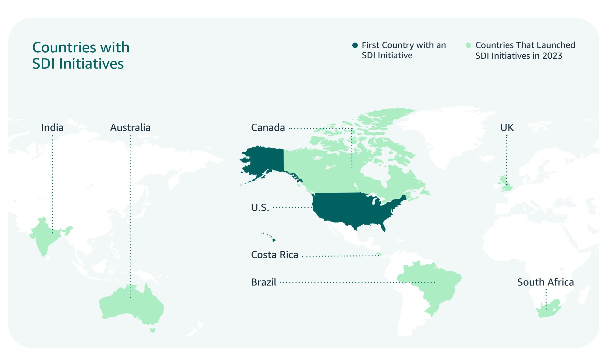

**Figure Description:**
The image is an infographic that provides information about countries with SDI (Spatial Data Infrastructure) initiatives as of 2023. It features a world map with various regions highlighted in different colors to indicate the presence or absence of such initiatives. There are four main sections labeled "India," "Australia," "Canada," and "UK." Each section has a corresponding country name: India, Australia, Canada, and UK. These labels suggest that these countries have active SDI programs.

The infographic also includes numerical data points for each region. For instance, it mentions that there were "1st Country with an SDII initiative" in 2023, which could imply that one or more of these countries launched their SDI program first among all nations. Additionally, it states that there were "Countries That Launched SDI Initiatives in 2023," indicating multiple new entrants into the field of spatial data infrastructure.

In terms of specific numbers, we can see that "First Country with an SDII initiative" is marked by a green dot, while "Countries That Launched SDI Initiatives in 2023" are represented by blue dots. However, without additional context, it's unclear exactly how many countries fall under each category.

Overall, the image appears to be a visual representation of global progress in establishing Spatial Data Infrastructures within certain countries, highlighting key milestones reached in 2023.

**Figure Description:**
The image displays a stylized graphic of a smiley face with a curved line representing the mouth or lips. This design is simple yet recognizable as a representation of happiness or positivity. There are no visible texts within the image that provide additional context or information about specific numbers or their significance. The style of the image suggests it could be used for branding, logo design, or as an emoji to convey emotions such as joy or contentment. However, without further information, any interpretation of numerical values would be speculative.

# Community Impact

Companies have an important opportunity to create meaningful, tangible change in the communities where they operate. Locally driven programs for communities benefit both residents and businesses, spurring innovation and economic growth. Amazon has a presence in thousands of communities around the world, and with this broad scale comes broad responsibility. We strive to leverage our size, reach, and ability to innovate quickly to strengthen the communities where our employees live and work. An important part of this is collaboration, which is why we work side by side with local partners to find solutions to our communities' most pressing challenges and build long-term, innovative programs that have a lasting, positive influence.

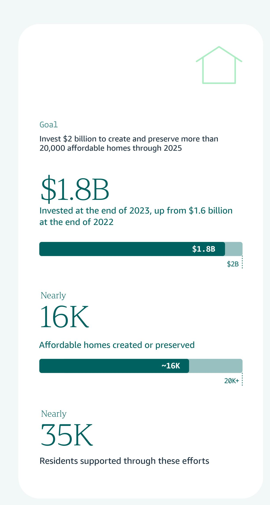

**Figure Description:**
The image is a digital graphic with textual information presented in a clean, modern style. At the top of the image, there's a bold heading that reads "GOAL" followed by two bullet points: one stating "$2 billion to create and preserve more than 20,00 affordable homes through 2025," and another indicating an investment amount of $1.8B at the end of 2022. Below these goals are three key performance indicators (KPIs) related to housing affordability efforts. Each KPI has a numerical value next to it, which represents the financial impact or outcome associated with each goal.

The first KPI states "Nearly $1.8B invested at the end of 2022," accompanied by a dollar sign ($1.8B). This suggests that approximately $1.8 billion was invested during the specified time period.

The second KPI indicates "Affordable Homes Created or Preserved +$16K," also represented by a dollar sign ($+16K), implying that there was a positive economic effect from creating or preserving affordable homes, resulting in additional revenue or savings of around $16,000.

The third KPI shows "Residents supported through these efforts -$35K," again denoted by a dollar sign (-$35K), suggesting that residents benefited financially to the tune of about $35,000 due to these housing initiatives.

In the upper right corner of the image, there's a small icon resembling a house, possibly symbolizing home ownership or housing as a service. The overall design uses a color scheme consisting mainly of shades of green and white, giving the image a fresh and environmentally friendly appearance.

### Goal

Distribute up to \$60 million in AWS cloud computing credits to support organizations promoting health equity globally by the end of 2024

\$32M+

In cloud computing credits has been distributed to 229 global organizations since 2021 to promote equal access to health resources, with \$16.8 million in cloud computing credits distributed to 125 organizations in 2023

**\$32M+**

\$60M

### Goal

Help 29 million people globally grow their technical skills by providing free cloud computing training by 2025

21M

People supported since 2020, up from 13 million in 2022

**21M**

29M

# Actions

# 76K

Amazon employees from 51 countries participated in our second Global Month of Volunteering, supporting more than 1,200 nonprofit and community organizations

# 3.9M

Students across seven countries completed 17.8 million learning hours through Amazon Future Engineer programs

# 74K

Students provided access to science, technology, engineering, and math (STEM) education through 72 AWS Think Big Spaces, physical spaces beyond standard classrooms that allow for hands-on exploration

26.6K

Microloans granted for the world's most vulnerable entrepreneurs by the Whole Planet Foundation and donors

**Figure Description:**
The image displays a stylized graphic of a smiley face with an upward-curving line representing a smiling mouth. The color scheme is minimalistic, featuring shades of green and blue against a white background. There are no visible texts or numbers within the image itself. The style appears to be modern and simplistic, likely intended for branding or logo purposes due to its clean lines and limited colors.

# Our Approach

Amazon's culture is built around finding effective solutions to difficult problems, and we apply this thinking to support the communities where our employees live and work. We leverage our people, technology, and logistics networks to build programs and products that help enable future generations to thrive in our communities. We focus on several priority areas across our business and respond to emergent needs where we are uniquely positioned to make a positive difference. Our work especially emphasizes historically underrepresented communities, because we envision a world that embraces diverse perspectives and where all individuals have equitable opportunities.

Amazon's community impact efforts are focused on seven key areas:

- **• Supporting economic impact in communities:** Amazon adds economic vibrancy to the communities where we operate through investments and job creation. Our investments in economies across the globe expand opportunities for local residents and small businesses and catalyze local economic activity.
- **• Creating and preserving affordable housing:** All people should have access to housing they can afford, but many communities in the U.S. are facing an affordable housing shortage, with low-income and minority families disproportionately affected. That is why we created the Amazon Housing Equity Fund, a \$2 billion commitment to use our scale and reach to support innovative housing solutions in the communities we call home.
- **• Addressing food insecurity and basic needs:** Amazon aims to improve access to healthy, affordable food for customers in underserved communities across the U.S. Each year, we donate groceries to local food banks and leverage our logistics network to provide free delivery

- of groceries to families in need. Additionally, the Whole Foods Market Foundation seeks to enhance livelihoods in its sourcing communities, bring more nutritious foods into children's schools and homes, and improve local food systems and healthy food access. It is also investing in producer loan and accelerator programs that empower small-scale, local, and emerging producers to grow their businesses.
- **• Empowering students and adults through education and skills training:** We believe in the transformative power of education, which is why we invest in programs that help young learners, higher education students, and adults unlock their full potential. Our goal is to help 29 million people globally grow their technical skills with free cloud computing training by 2025 through AWS-designed programs. Additionally, with the rapid growth of artificial intelligence (AI) and the need for an AI-savvy workforce, Amazon has pledged to provide free AI skills training to 2 million people globally by 2025.
- **• Supporting disaster relief and response efforts:** Our global logistics capabilities, combined with AWS technology, make us uniquely suited to help people when natural disasters strike. Our disaster relief and response efforts provide fast, effective aid for affected communities.
- **• Funding nature in our communities:** We support the restoration and conservation of natural spaces in communities across the globe. Through Amazon's Right Now Climate Fund, we invest in projects that aim to mitigate the effects of climate change, add green space to urban areas, improve biodiversity, and enhance livelihoods.

**• Addressing health equity:** We are focused on providing equitable access to health resources. In 2021, AWS launched the AWS Health Equity Initiative, a three-year program with the goal of enhancing health outcomes for underserved and historically marginalized communities. We aim to distribute up to \$60 million in cloud

computing credits to support organizations promoting health equity globally by the end of 2024.

**Learn more** about our [community investments in the](https://www.aboutamazon.com/investing-in-the-u-s) [U.S.](https://www.aboutamazon.com/investing-in-the-u-s) and how we are [supporting communities globally](https://assets.aboutamazon.com/c6/ff/2c89c0ff437cb855a015e81ed898/amazon-community-impact-report-2023.pdf)

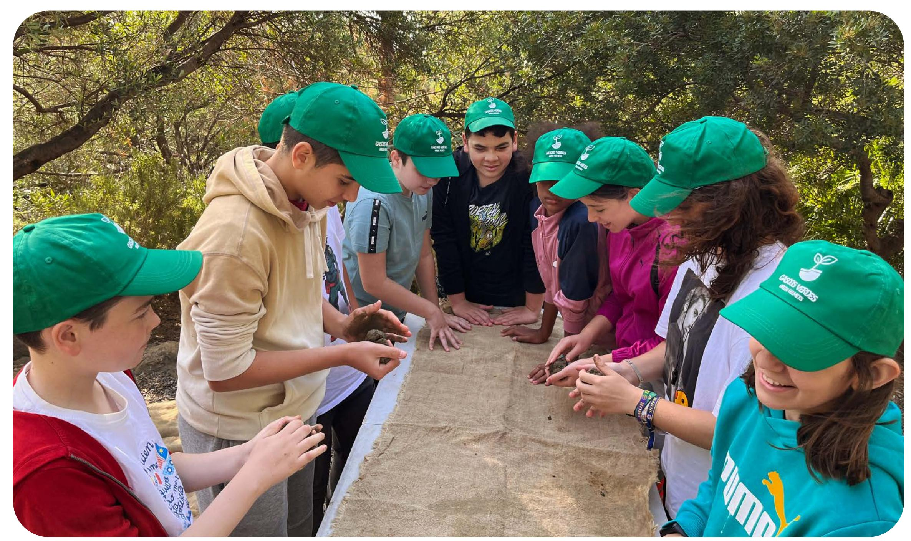

**Figure Description:**
In the heart of a verdant forest, a group of young people are engrossed in an activity that involves a large piece of fabric spread out before them. The fabric is brown, providing a stark contrast to their green hats adorned with white logos. Each person's hands are busy at work, some holding pens while others have scissors, indicating that they might be involved in cutting or marking the fabric.

Their positions relative to each other suggest a collaborative effort, perhaps working together on a project. Their smiles radiate positivity, hinting at the enjoyment derived from their task. Despite being surrounded by nature, there's no text visible in the image. It seems like a moment frozen in time, capturing the essence of teamwork and creativity amidst tranquility.

Through support from the Right Now Climate Fund, CIFAL Málaga-UNITAR and Amazon launched the Green Helmets educational initiative, designed to teach young people in Spain how to develop and implement sustainability projects.

**Figure Description:**
The image displays a stylized graphic of a smiley face with an upward-curving line for the mouth, suggesting happiness or positivity. To the right side of the image is a curved arrow pointing upwards to the left, which typically represents progression or improvement. There are no visible texts within the image that provide additional context or information about the numeric value being represented. The style of the image appears to be simplistic and iconographic, commonly used in various forms of media such as logos, emojis, or digital interfaces.

# Our Progress

# Supporting Economic Impact in Communities

To continue serving and innovating for our customers, we invest heavily in the communities where we operate. These investments spur new economic activity that, in turn, results in expanded opportunities for local residents and small businesses. Amazon has made significant [investments in](https://www.aboutamazon.com/investing-in-the-u-s)  [the U.S. economy](https://www.aboutamazon.com/investing-in-the-u-s) since 2010, which have contributed more than \$880 billion [to national gross domestic product](https://www.aboutamazon.com/news/job-creation-and-investment/7-key-stats-that-help-explain-amazons-economic-impact-in-the-u-s)  [\(GDP\)](https://www.aboutamazon.com/news/job-creation-and-investment/7-key-stats-that-help-explain-amazons-economic-impact-in-the-u-s) . We have supported 4.5 million [American jobs](https://www.aboutamazon.com/news/policy-news-views/amazon-continues-to-invest-in-american-jobs-the-economy) through full- and part-time jobs created directly by Amazon, jobs indirectly supported by our investments in areas like construction and logistics, and jobs created by small and medium-sized businesses selling on Amazon.com. In fact, Amazon has created more jobs in the past decade than any other U.S. company. We understand the value of developing opportunities for community members to climb the economic ladder and believe in helping them every step of the way.

With approximately 1.5 million full- and part-time global employees as of the end of 2023, Amazon adds economic vibrancy in the places where we invest: 47% of the people we hired for operations roles in 2023 were unemployed before joining Amazon, and two of every five U.S. jobs that we've created over the last five years have been in towns with fewer than 50,000 residents. Since 2010, Amazon has [invested over](https://www.aboutamazon.eu/news/job-creation-and-investment/creating-opportunity-for-europeans-across-eu-member-states-and-employing-150-000-people) [€](https://www.aboutamazon.eu/news/job-creation-and-investment/creating-opportunity-for-europeans-across-eu-member-states-and-employing-150-000-people)150 billion in our EU business and employs more than 150,000 people in permanent roles across 20 [EU member states](https://www.aboutamazon.eu/map/investing-in-europe) .

**Learn more** about Amazon's [global economic impact and](https://s2.q4cdn.com/299287126/files/doc_downloads/governance/2023/11/amazon-s_global_economic_impact_and_tax_contribution_2022.pdf)  [tax contributions](https://s2.q4cdn.com/299287126/files/doc_downloads/governance/2023/11/amazon-s_global_economic_impact_and_tax_contribution_2022.pdf) and our [global approach to tax](https://s2.q4cdn.com/299287126/files/doc_downloads/governance/Amazon)

# Creating and Preserving Affordable Housing

In our hometown communities of Washington state's Puget Sound region and Arlington, Virginia, we are working to address the nation's housing affordability challenges through low-rate loans, grants, and partnerships with local governments and nonprofit agencies. Through the Amazon Housing Equity Fund (HEF), we have committed \$2 billion to create and preserve more than 20,000 affordable homes in three communities where we have a high concentration of corporate employees: Washington state's Puget Sound region; Washington, D.C., and Arlington, Virginia; and Nashville, Tennessee. We partner with organizations to make housing available for low-to-moderate income households where it is needed most, including near public transit, in historically diverse, underserved communities. As of the end of 2023, Amazon has invested \$1.8 billion to build and preserve more than:

- **•** 5,300 rental homes in Washington state's Puget Sound region, supporting more than 11,600 residents
- **•** 8,400 rental homes in Washington, D.C., and Arlington, Virginia, supporting more than 18,500 residents
- **•** 1,300 rental homes in Nashville, Tennessee, supporting more than 2,900 residents
- **•** An additional 800 permanent homes across these three regions, providing more than 1,700 residents with the opportunity to own a home as part of a pilot of our affordable homeownership program

Amazon's HEF commitment has increased affordable multifamily housing by 31% in Bellevue, Washington, and by 23% in Arlingto[n.37](#page-94-0)

**Learn more** about the [HEF](https://www.aboutamazon.com/impact/community/housing-equity) and our 2023 work to create affordable housing access in [Puget Sound](https://assets.aboutamazon.com/18/5d/463db7d54cdeada22da2d730afbd/amazon-community-impact-report-puget-sound-2023.pdf) , the [National](https://assets.aboutamazon.com/5c/1f/710f91d7428a917b7b607de5177c/amazon-community-impact-report-capital-region-23.pdf)  [Capital Region](https://assets.aboutamazon.com/5c/1f/710f91d7428a917b7b607de5177c/amazon-community-impact-report-capital-region-23.pdf) , and [other communities across the U.S.](https://assets.aboutamazon.com/c6/ff/2c89c0ff437cb855a015e81ed898/amazon-community-impact-report-2023.pdf)

## Supporting Real Estate Developers of Color

Addressing the housing crisis requires collective action, and we are focusing on creating equal access to development opportunities. We're assisting more minority-led real estate developers in overcoming entry barriers to the affordable housing development industry. As of the end of 2023, developers of color were responsible for 43% of Amazon's HEF projects. And through our Housing Equity Accelerator Fellowship, we supported 38 emerging and diverse real estate developers with in-person instruction on real estate fundamentals, affordable housing trends, public policy, and financing practices, as well as access to expert business advisors, professional networking opportunities, and capital for pre-development expenses.

**Figure Description:**
The image shows a modern architectural structure with multiple stories featuring a mix of white walls and darker-toned panels or cladding material. There are large windows that span across different levels of the building, reflecting some of the surrounding environment. Above one window, there is a small balcony area visible through the glass. The sky is clear blue, suggesting it might be late afternoon or early evening given the soft lighting conditions.

The numeric value "10" appears at the top right corner of the image within a square frame, which could indicate an identification number for the property, perhaps as part of a real estate listing or inventory system. However, without additional context, it's unclear exactly what "10" represents in this specific case. It does not appear to have any direct connection to the architecture itself but rather seems like a label or code assigned by someone who manages such properties.

The Amazon Housing Equity Fund has created more affordable homes for our neighbors in Washington state's Puget Sound region.

**Figure Description:**
The image displays a graphic of two overlapping hearts with an arrow pointing from one heart to the other. Each heart is outlined by a green line, and there are two small arrows within each heart that point towards the center where the two hearts meet. There are no visible texts or numbers in the image. The style of the image appears to be simple and iconographic, commonly used for visual representations related to love, affection, or relationships.

## **Mary's Place**

[Mary's Place](https://www.marysplaceseattle.org/) is a nonprofit operating in Washington state's King County that provides women and families with emergency shelter, mobile outreach services, and rental assistance and stability support. Since 2016, Amazon has distributed over \$100 million in cash and inkind donations to Mary's Place to address family homelessness in King County. In 2020, Amazon and Mary's Place united to open the Mary's Place Family Center in The Regrade—a first-of-its-kind permanent family shelter that operates inside an Amazon building on our Seattle campus.

In 2023, Amazon donated over \$6 million to Mary's Place to support its ongoing operations and provide funding toward a new project in Burien, Washington. This project would replace an existing shelter and provide more than 200 beds of emergency family shelter, housing, outreach, and prevention services for families. It would also include 90 units of permanent, affordable housing to be developed by Mercy Housing Northwest.

**Figure Description:**
The image displays a stylized graphic of a smiley face with an open mouth, suggesting happiness or positivity. The color scheme consists mainly of green tones, which could be associated with nature, growth, or health. There are no visible texts within the image that provide additional context or information about specific products, services, or brands. The style is simplistic and modern, using clean lines to create the shapes without intricate details. This type of design might be used for branding, logos, or as part of a user interface where it serves as an icon representing joy or satisfaction.

# Addressing Food Insecurity and Basic Needs

We strive to bring healthy, affordable food to our communities through our delivery service providers (DSPs), donations, funding, and partnerships with organizations helping individuals and families faced with food insecurity.

Our Community Delivery program leverages our network of last mile fleet DSPs to provide free meal deliveries from food banks and other local organizations to households in need. Through this program, in 2023, we delivered over 10 million meals to underserved families to help alleviate food insecurity across the U.S.

In partnership with local food banks, we are scaling our food redistribution efforts to contribute to food security in local communities. As of the end of 2023, 100% of our grocery facilities in North America and Europe partner with a local food bank, over 40 of which are Feeding America affiliates. As a proud partner of Feeding America, Amazon Fresh also donated \$250,000 to the organization's efforts to increase food security in the U.S.

Addressing the basic needs of students from underserved communities is another critical component of this work. In 2023, Amazon supported the immediate needs of students from Seattle and Bellevue, Washington, donating \$1 million to the Alliance for Education to support all 104 schools in the Seattle Public School District and \$700,000 to Bellevue LifeSpring to support all 28 Bellevue School District schools. An additional \$1 million was donated to Communities In Schools– NOVA to support 62 schools in Arlington and Alexandria City, Virginia. These nonprofit organizations use the contributions to help manage their respective Right Now Needs Funds programs designed to ensure students have their basic needs covered, from food to clothes to school supplies.

**Learn more** about [Right Now Needs](https://www.aboutamazon.com/news/community/amazon-provides-right-now-needs-to-students-and-families)

## Whole Foods Market

The Whole Foods Market foundations (Whole Planet Foundation, Whole Kids Foundation, and Whole Cities Foundation) further fulfill the company's higher purpose to nourish people and the planet by helping to advance healthy food access, nutrition, and economic opportunities in local and global communities.

### **Whole Planet**

One-third of the world's adult population lacks access to financial services they could use to significantly improve their lives. Whole Planet supports organizations around the world that increase access for financially excluded people, often living near the poverty line, to generate income and meet their basic needs. In 2023, the foundation developed a new goal: to empower an additional 300,000 people to generate income and meet their basic needs in countries where Whole Foods Market sources products by 2030. The foundation and donors provided over \$7.6 million in grants and over 26,610 microloans across 37 countries toward this goal.

### **Whole Kids**

The Whole Kids Foundation is dedicated to helping children eat better by delivering education grants, supporting schools to transform their food options, and inspiring families to improve children's nutrition and wellness. In 2023, the foundation supported more than 1.4 million students and 592 teachers at 636 schools. In addition, grants supported 509 edible gardens and 43 salad bars, enabling schools to provide kids with daily access to fresh fruits and vegetables. And to help students learn about the vital role pollinators play in our food system and observe bees up close, the foundation provided 108 beehive grants to schools and nonprofit organizations.

### **Whole Cities**

Whole Cities' programs aim to advance individual and community health through local partnerships and expanded access to fresh, healthy food and nutrition education. In 2023, the foundation awarded 64 Community First grants to nonprofits engaged with Whole Foods Market team members in 49 U.S. and Canadian cities. These grants support longterm access to fresh, healthy food and nutrition education. The Whole Cities Foundation also funded 10 Newark Fresh, Healthy Food Access grants for community-led nonprofits working to improve local food systems and healthy food access in Newark, New Jersey. See the [full list of](https://www.wholecitiesfoundation.org/grants/community-first-grant-program/2023-community-first-grant/) [2023 grantees](https://www.wholecitiesfoundation.org/grants/community-first-grant-program/2023-community-first-grant/) .

### **Local Producer Loan Program**

The Local Producer Loan Program lends money to smallscale, local, or emerging Whole Foods Market suppliers across the U.S. and Canada to help them grow their businesses. It serves to deepen Whole Foods Market's commitment to local suppliers through investment in the people, businesses,

**Figure Description:**
The image displays a simple line drawing of two items: a bottle with a cap and a loaf of bread. There are no texts or additional elements within the image. The style is minimalistic and uses flat colors without any shading or depth effects. This type of iconography is commonly used for user interfaces to represent objects quickly and clearly.

**Supporting Local Communities through Our Grocery Stores** 

We have a hyperlocal approach to engage and give back to the communities where we operate our grocery stores that prioritizes causes that address food insecurity and sustainability. We enable stores to identify local causes that are important to their communities, which allows our grocery teams to drive meaningful benefits within each store's region.

One hyperlocal activation supported in 2023 was in Fullerton, California, where a store partnered with their local Boys & Girls Club. Through various Boys & Girls Club initiatives—including participating in the annual Community Fair, filling backpacks with academic supplies for the start of the school year, and providing meals for Thanksgiving dinners—the store gave back to the specific needs of its community.

and economies of communities it serves—while offering a wider assortment of local, differentiated products for its customers. Since Whole Foods Market began the program in 2006, it has provided over 390 loans representing over \$29 million in capital for loan recipients. In 2023, Whole Foods Market funded 11 loans totaling over \$1.2 million.

### **Local and Emerging Accelerator Program**

Whole Foods Market launched the Local and Emerging Accelerator Program (LEAP) in 2022 to support local and emerging suppliers through mentorship opportunities and tailored educational programming. In 2023, 20 cohort participants received a 10-week educational curriculum taught by industry experts, a year-long mentorship with a Whole Foods Market local forager, and the potential for financial support to promote business growth. Upon successful completion of the program, participants have the opportunity to become Whole Foods Market suppliers in their hometowns and potentially beyond.

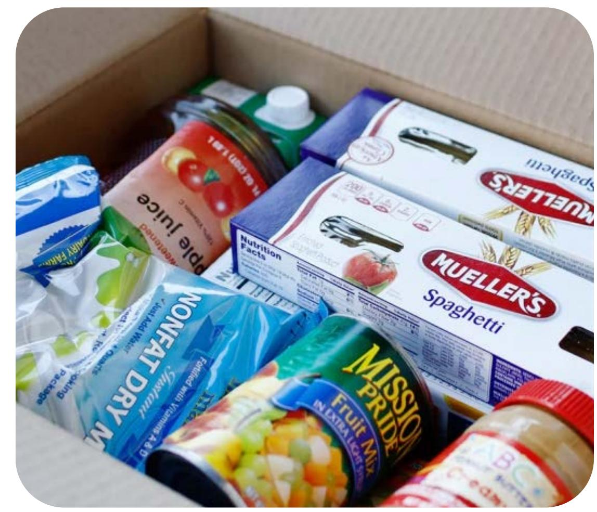

**Figure Description:**
The image shows a cardboard box containing various food items. In the foreground, there is a jar of "Mission Pride" canned fruit mix with a label that reads "Fruit Mix in Extra Fruity." To its right, there's another jar labeled "Miss AB Creamy Peanut Butter," which suggests it contains peanuts as an ingredient. Behind these jars, partially obscured by them, are two boxes: one for "Mueller's Spaghetti" and the other for "Mueller's Nutri-Pasta." Both pasta products have images of wheat stalks on their packaging. Additionally, there appears to be a package of "Nutritional Yeast Flakes" from "Bob's Red Mill," indicating that it may contain nutritionally beneficial yeast flakes. On top left corner of the box, there's a small carton of milk or cream, but the brand name isn't clearly visible. The overall style of the image seems casual, possibly taken during meal preparation or storage. There are no distinct numeric values present in the image; however, if you need information about quantities or sizes not immediately apparent, please provide more details.

In collaboration with the San Francisco-Marin Food Bank, Amazon Flex drivers help deliver a monthly box of healthy, shelf-stable food to seniors who are part of their Supplemental Food Program.

**Figure Description:**
The image displays a stylized graphic of a smiley face with an open mouth forming a curve that resembles a smile or laugh. The color scheme is simple, featuring shades of green and blue against a white background. There are no visible texts within the image itself. The style appears to be minimalistic and modern, likely intended for branding or as part of a logo design. The shape could symbolize happiness, positivity, or joy, which are common associations with such imagery. However, without additional context, it's not possible to provide specific details about the numerical values mentioned.

### **Nourishing Our Neighborhoods Program**

Nourishing Our Neighborhoods was created by Whole Foods Market to expand capacity and capability for communitybased food rescue organizations to move food from where it is available to where it is needed most. Marking its fourth year in 2023, Nourishing Our Neighborhoods has donated 44 refrigerated vans to community-based food rescue and redistribution programs that transport food to low-income communities across the U.S. and Canada.

In 2023, Whole Foods Market launched Nourishing Our Neighborhoods Mobile Pantry, pop-up farmers-market-style events at local schools. Each event provides fresh produce and pantry staples to 700 families. In addition, Stuff the Van events were introduced for each of the Nourishing Our Neighborhoods food rescue partners. These events were held at Whole Foods Market stores, where team members filled each of the vans with a mix of fresh produce and pantry staples. Through these events, Whole Foods Market donated over 57,585 pounds of food—enough for nearly 48,000 meals.

# Empowering Students and Adults through Education and Skills Training

Amazon invests in programs to increase youth and adult access to science, technology, engineering, and math (STEM) opportunities. Our aim is to help young learners and workforce professionals alike develop valuable skills needed for careers in STEM fields through a broad range of education and training programs.

## Young Learner Education

For young learners, Amazon's programs are designed to excite curiosity about career opportunities in STEM, computer science, and beyond.

Through [Amazon Future Engineer](https://www.amazonfutureengineer.com/) , we provide childhoodto-career computer science education, focusing on students from underserved and historically marginalized communities. The program includes free computer science curricula, teacher training, and interactive virtual field trips to inspire younger students to pursue careers of the future, as well as financial support for secondary education and paid internships at Amazon to gain hands-on experience with mentorship from technology leaders.

In 2023, Amazon Future Engineer reached 3.9 million students from underrepresented communities globally. We also announced a \$1.5 million donation to the Computer Science Teachers Association (CSTA) to launch career exploration programming that will prepare U.S. students for future workforce demands.

In 2023, AWS provided STEM education to young learners through the following programs:

- **• AWS Girls' Tech Day**, a learning event for women and girls that focuses on each STEM area, with activities designed to educate and inspire. The program's aim is to use the cloud to build a network of like-minded girls and young women across the globe. To celebrate the five-year anniversary of Girls' Tech Day in 2023, AWS expanded the program into a recurring Girls' Tech Series that includes STEM clubs, a women-in-tech speaker series, and student competitions. In 2023, AWS supported nearly 5,700 students through the Girls' Tech Series.
- **• AWS Think Big Spaces**, educational STEM labs that serve as a place beyond the typical classroom where the technology, curriculum, and even furniture promote hands-on learning. As of the end of 2023, AWS had 72 Think Big Spaces around the world.
- **• AWS CloudRoom**, a global program created to help students ages 9 to 14 gain a deeper understanding of the cloud and what it makes possible. In 2023, nearly 1,940 students and 17 schools participated in AWS CloudRoom.

**• AWS GetIT**, an educational program and competition designed to inspire 12- to 14-year-old students, especially girls and young people from underrepresented communities, to consider a future in STEM.

# Student Programs

AWS launched several new educational and skills training programs in 2023 to complement its existing cloud computing offerings, including the AWS Skills to Jobs Tech Alliance. Through a coalition of partners, this program aims to address the skills gap in community college and university technology curricula and better prepare students for entrylevel technology careers. Launched in June 2023, the Skills to Jobs Tech Alliance supported 725 educational institutions that collectively serve more than 73,000 students in the U.S., Egypt, and Spain, with plans to expand to more countries.

Other opportunities AWS provides include:

- **• AWS Educate**, an on-demand learning platform that offers hundreds of hours of free, self-paced training and resources for new-to-cloud learners—including handson labs, generative AI courses, and an exclusive job board. The program is available to learners as young as 13 in over 200 countries and territories.
- **• AWS Academy**, which provides higher education institutions with a free, ready-to-teach cloud computing curriculum that prepares students to pursue industryrecognized certifications and in-demand cloud jobs. In 2023, over 6,800 institutions used the curriculum.
- **• AWS AI ML Scholarships**, a scholarship program providing underserved or underrepresented high school and higher education students globally with opportunities to learn the AI and machine learning (ML) skills needed to prepare for careers in technology. AWS awarded a total of 2,500 AWS AI ML Scholarships in 2023.

**Figure Description:**
The image displays a graphic icon consisting of three stylized human figures standing side by side against a white background. Each figure is represented with two circles forming an outline that suggests a head or upper body, connected to each other by lines that form the shape of their bodies. There are no visible features such as hair, eyes, or clothing details. The style of the icon is minimalistic and abstract, using simple geometric shapes to convey the concept of people or individuals.

There are no numeric values present within the image itself. If you're referring to numerical data associated with the content of the image, it would be necessary for me to provide additional context or information about the source material from which the image was derived. However, based solely on the visual elements provided, there are no numbers or quantitative data directly related to the depicted figures.

### **AWS InCommunities**

AWS InCommunities is a community outreach program that aims to positively influence the communities where AWS builds and operates its global infrastructure. Four pillars anchor this work: Science, Technology, Engineering, Arts, and Math (STEAM) Education; Local Skills Development; Sustainability; and Hyperlocal Social Impact.

Through its programming, in 2023, AWS InCommunities drove nearly 6 million positive community interactions—defined as an engagement with a community member that results in a benefit for the recipient. One of its most notable initiatives is the AWS InCommunities Fund, a microgrant program that supports local individuals and organizations driving positive change. AWS launched 10 of these microgrants in 2023, helping renovate schools and rural hospitals in India, establish community health care facilities in Indonesia, implement food access programs in Australia, support sustainability programs such as textile recycling in the U.S., and more.

Since its launch in 2021, AWS InCommunities has allocated over \$2.1 million in microgrants to bolster hyperlocal projects in communities around the world. In 2023 alone, more than 5,800 AWS employees volunteered nearly 22,000 hours to support AWS InCommunities programs across its four areas of focus.

**Figure Description:**
The image displays a stylized graphic of a smiley face with an upward-curving line for a mouth. This design is commonly associated with emoticons or emojis used to convey emotions or reactions in digital communication. There are no visible numbers or text within the image that would provide additional context or information about its content. The style of the image suggests it could be part of a branding logo, a symbol for a company or product, or simply a decorative element meant to evoke positive feelings due to the smiling shape.

## Skills Programs for Adults

For adults, Amazon offers a range of free courses for individuals with technical and non-technical backgrounds to help them learn new skills and accelerate their careers in cloud computing and other cloud-enabled fields, including AI.

We are investing hundreds of millions of dollars to help 29 million people around the world grow their technology skills with free cloud computing skills training through AWSdesigned programs by 2025. The trainings are designed to meet a wide variety of schedules, learning preferences, and career goals, offering something for everyone. Since 2020, Amazon and AWS have helped 21 million people globally gain access to these training opportunities.

AWS supported upskilling initiatives through the following programs:

- **• AWS Cloud Institute**, a new, structured, hands-on training program that helps learners launch their cloud careers in as little as one year—regardless of their technical background. The first AWS Cloud Institute cohort began classes in January 2024.
- **• AWS re/Start**, a free-to-learner, cohort-based workforce development training program that helps unemployed or underemployed individuals with little or no tech experience build the skills needed for entry-level cloud careers. In 2023, AWS re/Start was delivered to more than 200 cities in 60 countries. Through this program, 90% of participants have been connected to job interview opportunities.
- **• AWS Skill Builder**, an online learning center that offers more than 600 free, on-demand cloud courses in up to 17 languages. Skill Builder provides subscriptions with access to game-based learning, labs, scenariobased challenges, and practice exams for select AWS Certifications.

**• AWS Skills Centers**, in-person learning that offers no-cost, on-site and virtual cloud computing classes, physical learning spaces, and networking events. Skills Centers are located in Seattle, Washington; Arlington, Virginia; and Cape Town, South Africa.

**Learn more** about the launch of our first [international AWS](https://aws.amazon.com/blogs/training-and-certification/south-africa-aws-skills-center/)  [Skills Center in South Africa](https://aws.amazon.com/blogs/training-and-certification/south-africa-aws-skills-center/)

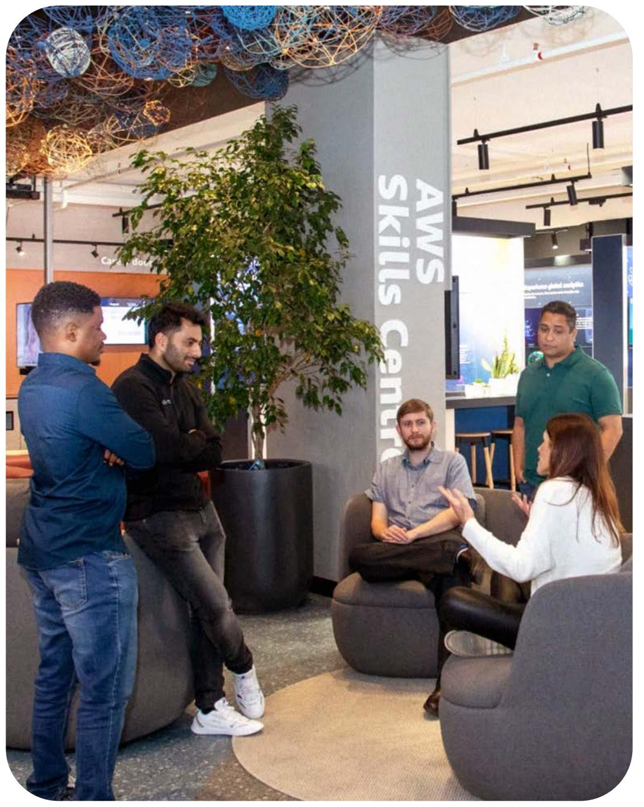

**Figure Description:**
The image depicts a group of five individuals engaged in conversation within an indoor setting that appears to be a modern office or co-working space. They are seated around a circular table with chairs, which is situated near a large potted plant. On the wall behind them, there's a sign that reads "AWS SKILLS CENTER," indicating that the location may be associated with Amazon Web Services (AWS) training programs. One person stands out as he is wearing a green shirt, while the others are dressed more casually. There are no visible numeric values in the image. The overall atmosphere suggests a collaborative learning environment focused on AWS skills development.

AWS opened its first international AWS Skills Center in Cape Town, South Africa, continuing on a mission to remove the barriers of access to cloud skills training.

### **Amazon AI Ready**

In 2023, Amazon announced [AI Ready](https://www.aboutamazon.com/news/aws/aws-free-ai-skills-training-courses) , a new commitment to provide free AI skills training to 2 million people globally by 2025. As part of this initiative, we launched eight new, free AI and generative AI courses; an AWS Generative AI Scholarship that provides high school and university students with access to a new generative AI course on Udacity; and a new collaboration with Code.org designed to help students learn about generative AI.

# Supporting Disaster Relief and Response Efforts

We mobilize the full breadth of our infrastructure, cloud technology, and global logistics network to help communities affected by natural disasters. Disaster Relief by Amazon delivers speed in the form of logistics and inventory, while AWS Disaster Response delivers information through access to connectivity and data.

Global disaster relief hubs within our fulfillment centers in the U.S., Europe, Japan, and Australia form the backbone of our strategy. These hubs store ready-to-ship essential items that are most needed following natural disasters and other emergencies, including shelter and shelter-repair materials, hygiene supplies, medical equipment, and basic household items.

In 2023, Amazon donated more than 2 million items in response to 44 disaster-related events around the globe. These included the devastating earthquakes in Turkey and Syria, where we donated tents, sleeping bags, blankets, heaters, and other much-needed supplies. A group of Amazon employees from our Istanbul fulfillment center also traveled to the affected region to help manage a relief warehouse and support the logistics and delivery of items.

In November 2023, our efforts continued as Amazon and local charity partners announced the opening of the "Smiling Dreams Community House" in an area of Turkey that sustained heavy damage from the earthquakes. The Community House acts as a support center for local residents affected by the disaster, providing therapy and psychotherapy sessions for people of all ages, as well as STEM education for children.

Amazon brings AWS cloud technology to areas hard-hit by natural disasters to support mapping, establish connectivity, and quickly increase capacity for emergency call centers. In 2023, AWS responded to 14 disasters and provided 103 affected business customers with \$3.5 million worth of cloud credit donations to facilitate emergency services. AWS also provided its technology to assist responders in Hawaii, helping coordinate support and make it possible for community members to contact loved ones following the historic wildfires in Maui.

Amazon committed more than \$105 million through 2023 to help the people of Ukraine address both immediate and long-term needs. Since the beginning of the war in Ukraine in 2022, we have continued to deliver timely and appropriate relief.

# Giving Back through Volunteering Efforts

Amazon encourages and enables our global teams to volunteer in their communities and support the causes they are passionate about. In 2023, over 170,000 volunteers from 54 countries participated in more than 25,000 events with more than 5,700 nonprofit and community organizations. This included over 76,000 Amazon volunteers who joined our second Global Month of Volunteering. During this initiative, team members volunteered for more than 4,500 events supporting over 1,200 nonprofit and community organizations—cleaning up parks, donating school supplies and clothing to students, building houses for families experiencing homelessness, assembling wish boxes for kids, and delivering meals to local food banks.

**Figure Description:**
The image displays a stylized graphic of a smiley face with a curved line forming an arc above it. This design is commonly associated with emoticons or emojis used to convey emotions or reactions in digital communication. There are no visible texts or numbers within the image itself. If you have any specific questions about the image that require numerical interpretation, please provide more context or details.

# Addressing Health Equity

AWS is harnessing the power of the cloud to advance health equity globally. Through the AWS Health Equity Initiative (HEI), AWS has pledged to provide up to \$60 million in cloud computing credits to organizations that are using cloud computing technology to address health disparities that impact underserved or underrepresented communities around the world. AWS has already awarded over \$32 million and supported 229 global organizations to promote equal access to health resources, up from 90 organizations in 2022.

In December 2023, AWS joined the [Health Electrification and](https://www.usaid.gov/powerafrica/powering-health)  [Telecommunications Alliance](https://www.usaid.gov/powerafrica/powering-health) (HETA), [Power Africa's](https://www.usaid.gov/powerafrica) initiative for health facility electrification and digital connectivity in sub-Saharan Africa. Power Africa is part of the [United States Agency for International Development](https://www.usaid.gov/) (USAID) and harnesses the collective resources of public and private sectors to expand electricity in sub-Saharan Africa. AWS has pledged to support efforts across the initiative's target countries, contributing cash and AWS promotional credits to help health facilities keep the lights on for nighttime services, reliably provide patients with oxygen and other lifesaving care, refrigerate vaccines and other temperaturesensitive medical commodities, and use the digital tools that modern medicine relies on. AWS is also collaborating with HETA to develop a cloud-based solution for real-time monitoring, analytics, predictive maintenance of energy and connectivity infrastructure.

# Looking Forward

As we move forward, Amazon aims to continue supporting the communities where we operate, focusing on the areas where we can make the biggest change: education, food security, disaster response, affordable housing equity, and health equity. Our goal is to keep using our infrastructure, technology, and passion for invention—along with the uniquely-Amazon skills and know-how of our global workforce—to unlock new opportunities for our communities across the globe.

# Funding Nature in Our Communities

We use [nature-based solutions](https://sustainability.aboutamazon.com/natural-resources/nature-based-solutions#investing-global-communities) to mitigate carbon emissions outside of our value chain and supplement the carbon reduction efforts we're driving across our operations. One critical aspect of this work is our commitment to investing in initiatives that protect the natural world, improve wildlife habitats, and promote biodiversity.

To bring this to life, we established the Right Now Climate Fund in 2019 with the aim of supporting solutions to restore and conserve natural spaces globally. The fund finances community-focused projects that mitigate the effects of climate change, improve biodiversity, enhance livelihoods, and add green space to urban areas. In 2023, we continued to fund nature projects in communities around the world.

**Ireland:** Amazon donated €2.5 million to The Nature Trust to help rehabilitate up to 500 hectares of degraded Atlantic blanket bog and restore it to a functioning peatland habitat.

**United States:** Volunteers from Amazon helped restore Olympia oyster populations in the Puget Sound region of Washington. In 2022 and 2023, we committed \$310,000 to the Puget Sound Restoration Fund to help plant more than 3 million oyster seeds. In California, Amazon donated \$100,000 to The Bay Foundation to restore approximately 2.5 acres of giant kelp forests off the state's southern coast.

**Spain:** In partnership with CIFAL Málaga-UNITAR (the United Nations Institute for Training and Research), we launched the Green Helmets education initiative, designed to teach young people how to develop and implement nature conservation projects. Nearly 3,650 students from 60 schools in Andalusia completed the training and submitted project ideas that contribute to the recovery and protection of nature. Ten projects were selected to be developed in 2024, with each receiving €10,000 from the Right Now Climate Fund. The initiative also planted 20,000 trees and distributed more than 26,000 seed bombs, with drones distributing more than 400,000 seeds to 500 hectares of difficult-to-access areas in the Sierra Bermeja region that was recently devastated by wildfires.

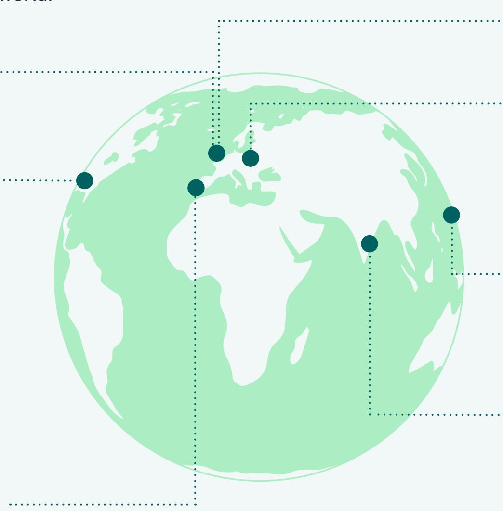

**Figure Description:**
The image is a stylized representation of a world map with a focus on numerical data points. At the center of the image is a green outline that resembles a globe, indicating continents and oceans. Surrounding the globe are lines connecting various locations to each other. These lines are intersected by dotted horizontal lines, which divide the image into sections. Each section contains one or more dark blue circles, representing specific locations or regions.

The top left corner of the image features a large number "10" written in bold black font, suggesting it may be related to population density, economic value, or some other quantitative measure for the area within that section. Similarly, there are smaller numbers "5," "3," and "2" near the bottom right edge of the image, likely corresponding to different areas or countries shown on the map.

There's no additional context provided about what these numbers specifically represent, such as population counts, GDP figures, or any other form of measurement. The overall style of the image is clean and modern, using minimalistic design elements to convey information visually.

**United Kingdom:** We funded the planting of approximately 450,000 trees across the country through the Woodland Trust's Emergency Tree Fund. We also contributed funding for 22 nature restoration projects through the Mayor of London's Rewild London Fund, in partnership with London Wildlife Trust and Groundwork London. These projects are protecting water voles, improving habitats for reptiles, and reintroducing beavers to West London for the first time in 400 years. Watch them [take their first dip in the wild](https://www.aboutamazon.co.uk/news/sustainability/beavers-return-to-west-london) .

**The Netherlands:** Amazon granted €1.5 million to a consortium of partners headed by North Sea Farmers to develop the world's first commercial-scale seaweed farm located between offshore wind turbines. The project will test methods of seaweed farming while researching the potential of seaweed to sequester carbon.

**Asia-Pacific:** We [announced](https://www.aboutamazon.in/news/sustainability/amazon-to-invest-usd-15-million-for-sustainability-projects-in-apac) \$15 million for nature-based projects in the region, with the first \$3 million allocated to India. Amazon will allocate the remainder of this funding to other key biodiversity and climate adaptation hotspots in the region.

**India:** Amazon has committed 83 million INR (\$1 million) to the Centre for Wildlife Studies to support communities and conservation efforts in the Western Ghats. This UNESCO World Heritage Site and critical wildlife conservation zone is home to wild Asian elephants and tigers. Amazon's funding will expand the Wild Carbon project, which will enable 2,000 farmers and their households to plant up to 300,000 trees over three years.

**Learn more** about our [large-scale, nature-based carbon](#page-20-0)  [neutralization initiatives](#page-20-0)

**Figure Description:**
The image displays a stylized graphic of a smiley face with an open mouth forming a curve that resembles a smile or a happy expression. The color scheme consists mainly of green shades, which are used to fill the shape of the smiling face. There is no text present within the image itself. The style appears to be simplistic and modern, likely intended for branding purposes given its clean lines and minimalist design. The overall impression is one of positivity and friendliness.

# People

We aim to be Earth's best employer and the safest place to work in our industries—a mindset that inspires us to take a people-first approach and prioritize making our workforce feel valued and supported, while building a culture of inclusive experiences everywhere.

## **In This Section**

- 75 [Employee Experience](#page-74-0)
- 81 [Health and Safety](#page-80-0)
- 86 [Inclusive Experiences](#page-85-0)

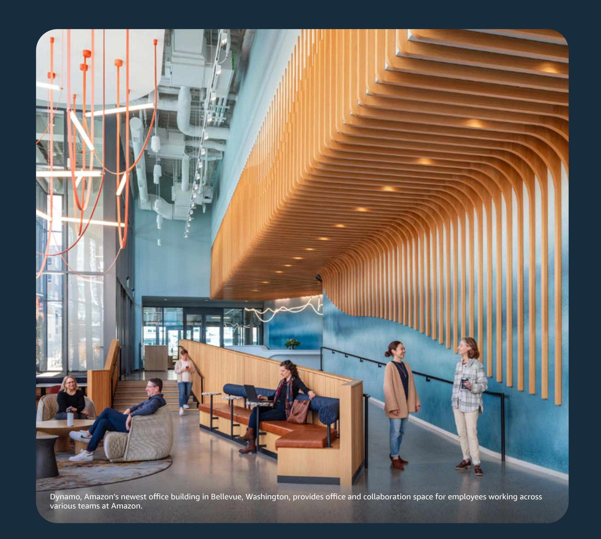

**Figure Description:**
The image depicts an interior space that appears to be a modern office or co-working area with a contemporary design aesthetic. There are several people present; some are seated at tables while others stand near a large wooden structure that serves as both a decorative element and possibly a partition between spaces. The room is well lit, featuring natural light from windows not visible in the frame, supplemented by artificial lighting fixtures hanging from the ceiling.

In the lower left corner of the image, there's text providing information about the setting: "Dynamo, Amazon’s newest office building in Bellevue, Washington, provides office and collaboration space for employees working across various teams at Amazon." This indicates that the location shown in the photo is part of Amazon's corporate facilities.

The overall style of the image suggests it may have been taken during a professional photoshoot intended to showcase the company's workspace environment. The focus on the architectural elements and the presence of employees suggest that the purpose of the photograph could be promotional or informational, highlighting the company culture and workspaces provided by Amazon.

**Figure Description:**
The image displays a stylized graphic of an abstract smiley face with a curved line forming its mouth shape. This design is simple yet recognizable as a representation of happiness or positivity. There are no visible texts within the image that provide additional context or information about specific numeric values or their significance. The background color appears to be dark blue, which contrasts with the white outline of the smiling face, making it stand out prominently against the backdrop. The style of the image suggests it could be used for various purposes such as branding, logos, or decorative elements due to its minimalistic and universally understood symbolism.

# Employee Experience

Passionate, engaged employees are an important part of what makes Amazon successful. We strive to be Earth's best employer, which is why investing in the physical, mental, and emotional well-being of our employees is a top priority. To achieve this ambition and ensure our workforce has the tools and support they need to succeed, we invest in our employees and their futures through comprehensive benefits, competitive compensation, prepaid education, and upskilling opportunities to help them build fulfilling careers. We listen to and learn from our employees through continuous engagement and communication channels that aim to improve their day-to-day experiences at work. We aim to ensure our benefits, compensation, and career development programs are equitable, empowering all employees to reach their full potential.

### Goal

Invest \$1.2 billion to provide access to skills training and education to over 300,000 U.S. employees by 2025

# 358K+

U.S. employees have participated in upskilling programs since we announced our Upskilling Pledge in 2019

**358K+**

300K

# 175K+

Global employees have participated in Career Choice since it launched in 2012, up from 110,000 global employees in 2022

# Actions

54

New countries where we partner with Twill Therapeutics to offer employees self-guided tools for everyday mental health

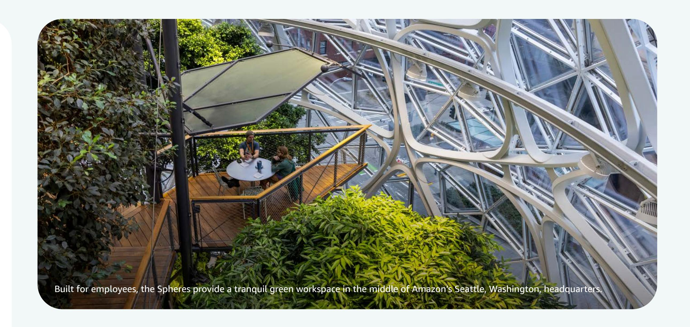

**Figure Description:**
The image depicts an indoor atrium with a glass ceiling that allows natural light to filter through. In the foreground, there is a structure resembling a tree or plant, which appears lush and well-maintained. To the left of the frame, two individuals are seated around a small table, engaged in conversation. They seem relaxed, suggesting a casual meeting or break time.

The text overlaying the image provides information about the location: "Built for employees, the Spheres provide a tranquil green workspace in the middle of Amazon's Seattle headquarters." This indicates that the setting is within an office environment designed by Amazon specifically for their staff.

In terms of numeric values, there isn't any direct numerical data visible in the image itself. However, the phrase "tranquil green workspace" implies a focus on creating a serene and nature-inspired atmosphere for work, which can be quantified as a positive impact on employee wellbeing and productivity. Additionally, the mention of "Amazon's Seattle headquarters" suggests a significant investment in workplace design and sustainability initiatives.

Overall, while no specific numbers are provided, the image conveys a conceptual value proposition related to employee satisfaction, environmental consciousness, and corporate culture.

 Nearly

\$1B

In supplementary retirement benefits provided by Amazon to over 1 million U.S. employees in 2023

\$1.3B

Invested toward pay increases for customer fulfillment and transportation employees in the U.S., bringing the average pay for those roles to over \$20.50 per hour

**Figure Description:**
The image displays two stylized human figures side by side against a white background. Each figure is represented with minimalistic lines that suggest their form without intricate details. They are depicted facing each other, giving an impression of interaction or conversation between them. There are no texts present within the image. The style of the illustration appears to be modern and simplified, using only green coloring for the figures' outlines. This type of iconography could be used for various purposes such as user interface design, where it might symbolize communication or collaboration features in software applications.

 Nearly

1K

Apprentices from the Amazon Technical Apprenticeship Program converted to full-time roles since 2017

**Figure Description:**
The image displays a stylized graphic of a smiley face with an open mouth, suggesting happiness or joy. The design is simple and uses only two colors: green for the smiling shape and blue for the outline that forms the smiley's head and body. There are no visible texts within the image itself. The style appears to be minimalistic and could potentially be used as a logo or icon due to its simplicity and universally recognized symbolism.

Expanded public transportation be

transportation benefits

in Germany and France

Employee Experience

Health and Safety

Inclusive Experiences

# Our Approach

Amazon works hard to attract and recruit the best employees and create a valuable experience for them every day. We do this in part by listening to our employees to understand how we can design benefits that work for them and their families and that are optimized for affordability, flexibility, choice, and personalization. We strive to provide competitive and equitable compensation that rewards our employees for their achievements.

We also want our employees to have the opportunity to grow and thrive with us. As the skills needed for jobs in our sector rapidly evolve, we are preparing our employees by investing in training and development programs with real-world applications. We do this by analyzing the labor market to identify in-demand jobs and providing education and training—including through career coaching and our mentoring network—that reflect the skills needed to be successful in these roles.

In everything we do, we aim to create a culture of mutual respect and progress, underpinned by candid, constructive communication. We offer multiple ways to ensure employees' voices are heard and that they can share concerns and ask questions, including our "open door" policy, whereby employees can reach out to anyone in management with suggestions, concerns, or feedback. Input from our employees, collected from multiple channels, is used to continuously improve our workplace.

# **Our Benefits**

We offer a range of benefits that support our employees and eligible family members, including their children and domestic partners. These comprehensive benefits begin on day one and include health care insurance coverage, paid parental leave, ways to save for the future, our upskilling programs, and other resources to improve health and well-being.

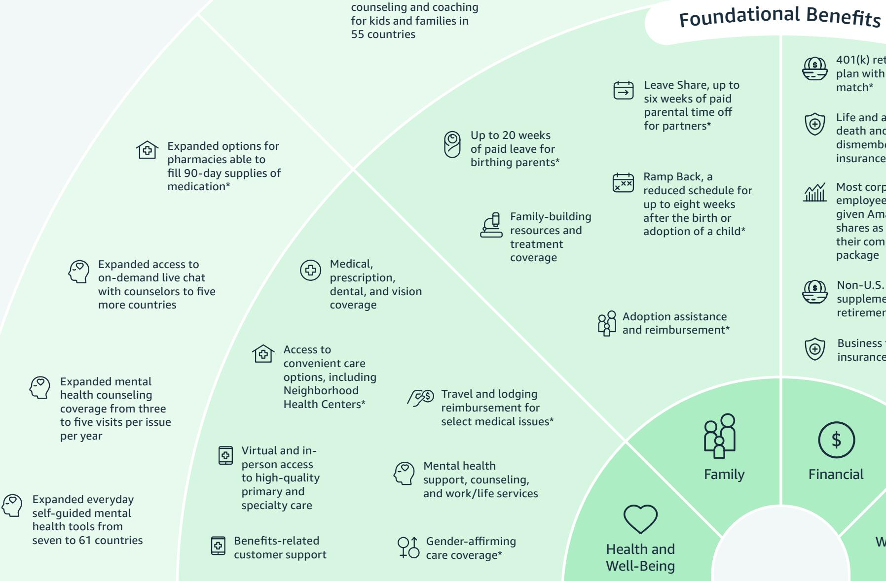

**Figure Description:**
The image is an infographic that outlines various benefits of expanding access to mental health services for pregnant women and their families across different countries. It's divided into three main sections: "Foundational Benefits," "Expanded Access to Mental Health Services," and "Benefits Related to Customer Support." Each section contains a series of bullet points with accompanying icons representing different aspects or outcomes related to these benefits.

In the "Foundational Benefits" section, there are two items listed:
- Expanding options for pharmacies able to fill 90-day supplies of medication (with a number '15').
- Up to 20 weeks paid leave for birth parents (with a number '401K').

The "Expanded Access to Mental Health Services" section includes several benefits such as:
- Medical, prescription, dental, and vision coverage (with a checkmark icon).
- Family-building resources and adoption assistance (with a heart icon).
- Travel and lodging support (with a globe icon).
- Virtual and in-person care (with a house icon).
- Personalized care coordination (with a handshake icon).
- Seven to six years of self-guided mental health care (with a clock icon).
- Benefits-related customer support (with a phone icon).

The "Benefits Related to Customer Support" section lists:
- Gender-affirming care coverage (with a person icon).
- Well-being financial support (with a dollar sign icon).

Each benefit has a corresponding icon and some have numbers associated with them, like the duration of personalized care coordination ("Seven to six years"). The overall design uses a color scheme consisting mainly of green and white, which creates a clean and professional appearance. The text within each box is clear and legible, making it easy to understand the information presented.

Launched free

pediatric mental health

# New Benefits Added in 2023

Expanded access to a virtual care family virtual care family-building program to more than 54

O Average hourly wage for customer fulfillment and transportation employees increased from \$19 to over \$20.50\*

Launched emergency savings and financial assistance programs for customer fulfillment and transportation employees\*

Launched charitable charitable giving benefit\*

Launched payroll-deducted emergency savings benefit in emergency savings benefit in the U.S. and Puerto Rico

401(k) retirement plan with company

dismemberment

match\*

O Anytime Pay, a free wage access Life and accidental death and program\* death and

insurance\* Access to financial Most corporate counseling and estate planning employees are

given Amazon shares as part of their compensation package

Non-U.S. supplementary retirement benefits

Business travel insurance

\$

Financial

Employee shuttles at select corporate

Annual discount

and shipped by

on products sold

Access to upskilling programs, Access to upskilling program including prepaid education benefits at hundreds of colleges, universities, and education partners globally

Public transportation subsidies

Commuter benefits available in 57 countries

retirement benefits in Kenya and Belgium

Added supplementary

Subsidies to offset

costs related to

cycling to work

Protected bike lanes in our Seattle corporate headquarters

> Dog-friendly workplaces at workplaces at select corporate sites in North America

Approximately 50% of parking costs covered by commuter benefit subsidy

\* Only available in the U.S.

蛤

Workplace and

Commuter

Benefits

The benefits and options available to employees are contingent upon the eligibility details of their respective roles and the associated domestic and international working arrangements.

**Figure Description:**
The image displays a stylized graphic of a smiley face with a curved line for the mouth. To the right of the smiley face is an arrow pointing upwards to the left. There are no visible texts or numbers within the image itself. The style appears to be simple and modern, possibly representing happiness or positivity due to the smiling face. However, without additional context, it's difficult to determine if there is any specific meaning associated with the numerical values mentioned.

# Our Progress

# Compensation and Financial Support

Amazon provides competitive compensation to reward employees for their dedication and hard work. In 2023, we announced pay increases for U.S. frontline employees, with average pay for those in customer fulfillment and transportation increasing from \$19 to \$20.50 per hour an investment of \$1.3 billion. Our investments have had a positive influence on local communities across the U.S., helping to grow household incomes and boost local economies.

Amazon also invested \$600 million in international wage increases in 2023. In the UK, we committed to investing £170 million to increase the minimum starting hourly wage for our frontline operations employees between October 2023 and April 2024. By the end of 2023, we had increased the hourly wage in the UK to £12, representing a 14% increase in starting pay over two years and a 26% increase since 2018.

In Germany, we increased the entry hourly wage for logistics employees to €14, representing a 17% increase in average starting pay since 2022 and a 30% increase since 2019. Hourly wages automatically increase in Germany after 12 and 24 months, with full-time employees earning an average of €37,000 per year after two years.

We also introduced [a new financial assistance program and](https://www.aboutamazon.com/news/workplace/new-benefits-for-amazon-employees)  [an emergency savings program](https://www.aboutamazon.com/news/workplace/new-benefits-for-amazon-employees) with Brightside in 2023 to further support our customer fulfillment and transportation employees. Brightside is a financial care solution currently being piloted for hourly employees in select states across the U.S., providing free and confidential solutions to those experiencing financial challenges or looking to improve their financial health. Our Brightside Financial Care pilot program

connects Amazon associates with financial solutions and resources that enhance their control over their personal finances. Personal coaches offer live support to participants and use dynamic technology to recommend customized plans to improve their financial health and maximize the benefits available to them through Amazon. In 2023, nearly 28,900 associates engaged in this pilot program across 12 states. We plan to expand the program to all U.S. hourly employees in 2024.

Meanwhile, Brightside's emergency savings fund program enables employees to prepare for life's unexpected expenses by building an emergency financial reserve. Participants can set aside a portion of their paycheck automatically and access the funds when they are most needed. Employees who take advantage of this benefit increase their financial resiliency and confidence each pay period as they see their savings account balance grow. Together, these programs have provided \$13.9 million worth of financial resources to employees, helping them contribute \$7.4 million to savings accounts that can be used for unexpected expenses.

# Pay Equity

We continue to prioritize pay equity among our employees. A review of our 2023 compensation, including base pay, cash bonuses, and stock, found that women in the U.S. earned 99.9 cents and women globally earned 99.8 cents for every dollar men earned performing the same jobs. The review also showed that racial/ethnic minorities in the U.S. earned one dollar for every dollar white employees earned performing the same jobs.

# Robust and Inclusive Benefits

We offer a range of benefits that support our employees and eligible family members, including their children and domestic partners. For regular full-time and parttime employees, these benefits begin on the first day of employment and include health care insurance coverage, paid parental leave, ways to save for the future, our upskilling programs, and other resources to improve health and well-being.

In 2023, Amazon invested nearly \$10 billion in total employee benefits. To meet employees' needs, no matter their circumstances, we continued to expand our current offerings and introduce new ones. For example:

- **•** We launched new cross-border health plan options allowing employees who work in California to access health care in the Baja California region of Mexico.
- **•** In response to employee feedback indicating that they prefer the certainty of cost under a copay-based health plan over a more unpredictable coinsurance-based plan, we converted our two most enrolled coinsurance plans to copay versions.
- **•** To make obtaining maintenance medication more convenient for employees and support regimen adherence, Amazon increased the number of U.S. pharmacies where employees can fill 90-day supplies. Previously, 90-day supplies were restricted to a designated mail order pharmacy, while other pharmacies were limited to filling up to 30-day supplies.
- **•** We provided access to mental health counselors via live chat for employees in Australia, Costa Rica, India, the United Arab Emirates, and the UK. We also completed the global rollout of our partnership with

- Twill Therapeutics, which provides self-guided tools for everyday mental health to employees and their families.
- **•** We launched Flexible Benefits in India and Canada, offering diverse employee cohorts the freedom to design their benefits packages to cater to their unique needs and those of their families. In India, we designed a Flexible Benefits program that effectively builds custom solutions for our diverse, multigenerational workforce. Recognizing that one size does not fit all, the program empowers employees to tailor their health and wellness benefits to align with their individual life stages and circumstances. In Canada, we introduced a Flexible Benefits program designed to increase employee choice by offering a new flexible plan for extended health, vision, and dental coverage in addition to the current plan, which includes a health care spending account (HSA) contribution to cover out-of-pocket expenses.
- **•** Compassionate care services—our support for employees and their dependents through difficult life events—were expanded beyond the U.S. to 60 new countries. These services include family bereavement support and free, confidential support to employees and their dependents who have been diagnosed with a critical or terminal illness.

Amazon solicits ongoing feedback from our workforce and input from external partners to help ensure our health and wellness benefits meet the evolving needs of all employees. For example, in 2023, we generally aligned our U.S. genderaffirming coverage with recommendations from the World Professional Association for Transgender Health.

## Global Employee Assistance Program

Alongside robust medical care, Amazon offers inclusive mental health support, including through our Employee

**Figure Description:**
The image displays a stylized graphic of a smiley face with an open mouth, suggesting happiness or contentment. The color scheme is simple, featuring shades of green and blue against a white background. There are no visible texts within the image itself. The style appears to be minimalistic and modern, likely intended for branding purposes given its clean lines and lack of intricate details. The overall impression is one of positivity and simplicity.

Assistance Program (EAP). The EAP—available through our partnership with Resources for Living in the U.S., Telus Health in Canada, Laya Healthcare in Ireland, and Workplace Options in all other countries—is a global benefit for employee health and wellness for mental health questions or concerns. It is designed to be an essential resource for employees and their families seeking day-to-day guidance or support.

From day one of their employment, employees have access to the EAP. It is available 24/7 in most major world languages, 100% confidential, and free of charge, with easily accessible services including:

- **•** Counseling delivered by qualified mental health professionals, either in-the-moment—when it is needed most—or through bookable, short-term, solutions-focused counseling designed to help with a particular issue
- **•** Dedicated pediatric program, delivering mental health support for children from 18 months old and their caregivers
- **•** Financial and legal wellness consultations
- **•** Personalized mindfulness, life, and wellness coaching program
- **•** Validated referrals for external work/life services
- **•** Manager consultation services, including critical incident support
- **•** Range of self-serve assessment tools and access to a topical webinar and information library via a customized website or app
- **•** Access to behavioral health care, including five visits per issue per year (expanded from three visits in 2022)

In 2023, Amazon's Workplace Options EAP was offered in 59 countries, including four new ones: Estonia, Hungary, India, and Kenya. Globally, our EAP was available to nearly 1.6 million employees in 62 countries.

# Supporting the Health of Amazon Employees and Their Families

Navigating health care for family planning and fertility can be challenging, which is why Amazon proudly provides our U.S. employees—regardless of their gender, sexual orientation, or relationship status—with familybuilding benefits. This benefit offers support with in vitro fertilization (IVF), egg freezing, genetic testing, and more, and it supported nearly 30,400 full-time and hourly Amazon employees in 2023. Through this offering, our U.S. employees also receive access to approximately 1,070 fertility specialists. In 2023, Amazon received the National Infertility Association's Award for Access, which recognizes companies whose work helps increase access to familybuilding options for people living with infertility.

When our employees are facing challenging times in terms of their health, we strive to be there to support them. In 2023, we signed the [Working with Cancer Pledge](https://workingwithcancerpledge.com/) to signify our continued commitment to providing a supportive workplace culture for employees with cancer. This pledge signals Amazon's dedication to providing leading health care benefits and fostering compassion among managers and leaders across the company.

**Learn more** about how we [support our employees and their](https://www.aboutamazon.com/news/workplace/how-amazon-is-supporting-employees-during-cancer-diagnosis) [families during cancer diagnosis, treatment, and recovery](https://www.aboutamazon.com/news/workplace/how-amazon-is-supporting-employees-during-cancer-diagnosis)

# Flexible Scheduling

Operations employees have provided us feedback that they want more flexibility in when and how they work. That's why we offer various shift and schedule options, including permanent full- or part-time positions and seasonal work. Options for morning, day, night, and weekend shifts are provided, so employees can work during the times that best fit their circumstances.

Not everyone has the same routine week to week. In addition to providing fixed schedules, we offer [flexible](https://www.aboutamazon.co.uk/news/company-news/amazon-boosts-employee-flexibility-with-the-launch-of-new-term-time-contracts) [options](https://www.aboutamazon.co.uk/news/company-news/amazon-boosts-employee-flexibility-with-the-launch-of-new-term-time-contracts) that let employees choose when and how much to work. Amazon's Flexible Scheduling program lets eligible employees choose their shift schedules using an app, letting them plan their workweeks in a way that suits them. In 2023, over 116,200 hourly fulfillment employees used Flexible Scheduling (a 16% increase from 2022), including nearly 28,400 internal fixed-schedule associates who transferred into the program.

# Workforce Changes

In January 2023, Amazon announced the difficult decision to eliminate 18,000 roles, with an additional 9,000 roles eliminated in April 2023. Several of our businesses were affected by these decisions. We did not make these decisions lightly and were committed to providing support to ease the transition out of Amazon. Employees whose roles were eliminated received a separation payment, external job placement support, and region-specific transitional health insurance benefits, where applicable.

# Employee Engagement in Sustainability

In 2023, Amazon launched the Sustainable Amazonian (SAM) program to engage our corporate employees worldwide in adopting more sustainable practices, both in their day-to-day jobs and outside of work. Approximately 7,540 employees signed the SAM Pledge, which included making a commitment to leave things better than they found them and completing a sustainability training.

Through Amazon's Sustainability Ambassador program, operational employees across our business support sustainability projects—both on-site at Amazon campuses and in their communities—as well as employee engagement reporting and educational events to inspire fellow employees and share best practices across teams, business units, and locations. Nearly 9,300 employees

participated in our Sustainability Ambassador program in 2023, spanning 24 chapters throughout 1,345 of our buildings in our corporate, data center, and fulfillment networks. Examples of 2023 employee-led projects include:

- **•** Sustainability Ambassadors established a waste diversion program for our EU Logistics organization that reduced waste by 1.4 grams per dispatched shipment, for a total of 6 tons of waste avoided. The team's waste avoidance projects helped us divert 88% of waste from landfills in 2023.
- **•** AWS Sustainability Ambassadors continued their implementation of the LED Everywhere Project, an initiative started in 2021 that aims to replace fluorescent or less energy-efficient lighting with LED alternatives in all AWS data centers. In 2023, 10,500 light bulbs were replaced with LEDs, resulting in an energy use reduction of over 3,100 megawatt-hours (MWh) annually compared to the old bulbs.
- **•** In the U.S., Sustainability Ambassadors partnered with the Indigenous at Amazon global affinity group and Amazon in the Community to host an in-person panel discussion with internationally recognized Indigenous leaders at our Seattle headquarters. Their discussion linked Indigenous wisdom, knowledge, and learnings to global sustainability efforts, with a focus on protecting our water resources.

The education of our employees is an important piece of our work to drive a culture that prioritizes sustainability across Amazon. In 2023, nearly 51,300 employees engaged in sustainability education, and approximately 31,680 voluntarily completed internal sustainability training modules.

**Figure Description:**
The image displays a stylized graphic of a smiley face with an upward curve to its right side. This design is commonly associated with emoticons or emojis used in digital communication to convey emotions or reactions. There are no visible texts or numbers within the image itself. If you have any specific questions about the style, colors, or other aspects of the image that do not involve numerical values, feel free to ask!

# Upskilling Our Employees

We are empowering our employees to build the skills they need to remain competitive, grow their careers, and move into higher-paying roles. In the process, we're building a strong pipeline of talent to fill current and future in-demand jobs, both at Amazon and beyond.

Central to our upskilling efforts is our pledge to invest \$1.2 billion to provide prepaid education and technical skills training to over 300,000 of our U.S. employees by 2025. We achieved this goal by the end of 2023—with approximately 358,180 U.S. employees participating in our upskilling programs. Career Choice, our longest-standing program, has provided job training to more than 175,000 employees worldwide since it launched in 2012, a 62% increase from 110,000 in 2022. In 2023, Surge2IT, a program to help entry-level IT employees across Amazon's operations pursue careers in higher-paying technical roles, merged into Career Choice.

### **2023 Upskilling Programs**

| Amazon Technical Academy                   | Amazon Technical Academy is a virtual, full-time, tuition-free training program designed to prepare employees—many of whom previously worked in non-technical roles—with the skills needed to become Amazon Software Development Engineers. In 2024, this program will integrate with other Amazon upskilling programs to provide greater accessibility to Amazon employees.                                                                            |
|-----------------------------------------------|------------------------------------------------------------------------------------------------------------------------------------------------------------------------------------------------------------------------------------------------------------------------------------------------------------------------------------------------------------------------------------------------------------------------------------------------------------------|
| Amazon Technical Apprenticeship Program | The Amazon Technical Apprenticeship Program helps employees transition into technology careers by offering them paid opportunities to learn new skills and get on-the-job training. Since the program began in 2017, we have hired nearly 1,590 apprentices; nearly 1,000 have converted to full-time employment.                                                                                                                                          |
| AWS Grow Our Own Talent                    | AWS Grow Our Own Talent helps individuals with nontraditional experience and backgrounds develop skills needed for AWS data center roles through on-the-job training and placement opportunities. In 2023, we launched this program in new countries across Europe, the Middle East, Africa, and Asia-Pacific.                                                                                                                                             |
| AWS Intelligence Initiative                | The AWS Intelligence Initiative is a 12- to 14-month rotational onboarding and technical upskilling program for engineers supporting Amazon Dedicated Cloud (ADC) regions. In 2023, there were 115 program participants in the U.S. and 193 outside the U.S., with 60 promoted to ADC engineers after completing the program. In the UK, 63% of our ADC workforce are graduates of this program.                                                        |
| AWS Tech U                                    | AWS Tech U is an accelerated workforce development program that empowers people to establish and hone the technical and professional skills needed to thrive at AWS. This program provides training for Amazon employees who want to pursue cloud-based technical careers and involves working on products that reflect real-world AWS solutions and interacting with customers. In 2023, approximately 1,670 employees enrolled as Tech U learners. |

**Career Choice** Career Choice offers prepaid tuition for associate and bachelor's degrees, industry certifications in industries such as tech and transportation, English language learning, high school completion and GED programs, and career coaching. Receiving support from a global network of over 621 educational partners, annual participation in Career Choice has grown from 50,000 in 2021 to over 90,300 globally in 2023. Over 62% of Career Choice participants identify as Black, Indigenous, or a Person of Color.

> In 2023, Career Choice expanded its language learning program to 13 more countries in addition to the U.S. Since we launched this offering in 2021, approximately 17,550 participants have completed English or local language proficiency classes.

### **Machine Learning University (MLU)**

MLU trains Amazon employees in the theory and practical application of machine learning and artificial intelligence (AI) through hands-on education. In 2023, MLU expanded its course portfolio, offering 11 new courses, seven of which specifically focus on generative AI. In 2023, we delivered training through MLU to employees in over 100 different roles across 58 countries.

### **Sustainability Certification**

Sustainability Certification is a Career Choice initiative to upskill and retain our customer fulfillment and transportation employees through an education in sustainability. Through this initiative, participants enroll in a two-year program to pursue a Sustainability Certificate from UCLA Extension. In 2023, we piloted expanding this program in the UK, so that interested operations associates could pursue a UK National Diploma in Environmental Management.

### **User Experience and Design Apprenticeship**

The User Experience and Design Apprenticeship is a year-long program that helps employees build skills in research, information architecture, visual and interaction design, and validation techniques. Since the program's launch in 2021, over 90% of graduates still work at Amazon. Participants get experience working on projects that directly affect the customer experience, such as finding ways for customers to discover new Alexa features or search for Amazon Prime Video content across devices.

**Learn more** about our [community upskilling efforts](#page-70-0)

**Figure Description:**
The image displays a logo consisting of two elements: an abstract shape resembling a smile or a stylized letter 'S' with its tail curved upwards to form a partial circle, and a green arrow pointing from left to right. The background is white, which contrasts with the darker shade used for both the abstract shape and the arrow. There are no visible texts within the image that provide additional context about the brand or company it represents. The style of the image suggests it could be associated with a corporate identity or a service-oriented business due to the friendly nature of the smile-like design. However, without further information, any specific interpretation would remain speculative.

# Employee Communication Channels

Many of our best ideas come from Amazon employees. We value their feedback—both positive sentiments and constructive comments that can help us improve the employee and customer experiences.

Amazon uses various communication channels to maintain awareness of and responsiveness to changing dynamics, questions, concerns, and ideas across our large global workforce. This includes direct daily engagement, such as allhands meetings with general managers, stand-up meetings with direct supervisors, and other one-on-one meetings.

Employees can also voice concerns, anonymously report potential violations of Amazon's Code of Business Conduct and Ethics, and ask questions about potentially unethical conduct through Amazon's Ethics Line. If needed, employees can access several other escalation mechanisms, including executive escalation and communication with their managers or human resources business partners. We actively encourage our employees to report any issues or concerns without fear of reprisal, intimidation, or harassment.

# MyVoice

MyVoice, Amazon's primary Voice of Associate platform, provides a two-way communication channel between our global associates and their site leadership. This online tool allows employees to express concerns, offer suggestions, and ask questions to leadership teams who will reply directly, enabling quicker, more collaborative issue remediation. Globally, employees provided over 600,000 comments through MyVoice in 2023.

We also completed a foundational re-architecture of the MyVoice tool and integrated it within our A to Z employee app, creating a mobile experience for employees that is simpler, is more user-friendly, and increases discoverability. Our enhancements to MyVoice also simplify the experience for leaders, centralizing feedback and associated follow-up

actions and making it easier for leaders to review comments and track actions.

Using the MyVoice mechanism, we continuously improve our policies and practices based on workers' suggestions. For example, direct suggestions relating to time-tracking led to policy improvements that better served associate needs, provided increased flexibility, and allowed for better work/ life balance.

At one fulfillment center in California, we received MyVoice feedback regarding difficulty in commuting to the location. Taking this feedback into account, Amazon partnered with city and local officials to provide a better bus route and stop that would help alleviate the issue. Meanwhile, in India, leaders analyzed feedback from associates related to leave management, resulting in the launch of a new, automatic, end-to-end leave management system, improved standardization, and, as a result, a better associate experience.

## Connections

Connections is Amazon's real-time, companywide feedback mechanism designed to facilitate listening to and learning from employees at scale. Each day, employees can choose to respond to Connections questions—delivered in 29 languages—via their computers, workstation devices, or hand scanners. Connections improves the employee experience by identifying obstacles to meaningful work, surfacing issues before they become acute problems, and highlighting strengths so they don't become missed opportunities.

Across Amazon, our employees generate more than 1.6 million Connections responses across 60 countries each day. Connections analyzes and aggregates individual response data, sharing it with managers at the team level to maintain confidentiality. Managers can then take relevant actions for improvement at the earliest opportunity to build trust with their teams. For example, as a result of Connections feedback that both career growth and perceptions of growth were important drivers of employee

satisfaction, Amazon introduced a new program allowing employees and their managers to work together to drive career growth more effectively.

# Associate Roundtables, Forums, and Safety Committees

Associate Roundtables provide employees and managers with a meaningful opportunity to discuss issues, ask questions, and get immediate feedback in person. Amazon hosts these meetings around the globe, with their exact cadence varying by business line and site.

Associate Forums create opportunities for employees to connect with site leaders on decisions that affect the site or employee experience. In 2023, we held 146 Associate Forums.

Associate Safety Committees allow employees at various sites globally to offer input on relevant safety matters. In 2023, 185,000 employees participated in over 25,000 Safety Committee meetings, collectively developing 13,000 actions to increase on-site safety.

## Appeals

Amazon maintains a defined appeals process for our employees. Across the U.S. and Canada, eligible employees can use an online, paperless appeals service to challenge certain disciplinary actions. The applicable manager reviews the claim to verify policies have been correctly applied. Where this is not the case, appropriate remediation can then be taken.

**Learn more** about our approach to ethical business in our [Sustainability Reporting Framework Summary](https://sustainability.aboutamazon.com/2023-sustainability-reporting-framework-summary.pdf)

# Freedom of Association

We respect freedom of association and our employees' right to form, join, or not join labor unions or other lawful organizations of their choosing without fear of reprisal,

intimidation, or harassment. These rights should be exercised in an informed and thoughtful manner.

Globally, Amazon applies or is party to dozens of collective bargaining agreements at national, regional, sectoral, and enterprise levels. In 2022, we established a European Works Council, holding our first meeting in April 2023. The European Works Council is composed of workers and employer representatives and meets regularly to discuss transnational company issues.

**Learn more** about our respect for freedom of association in our [Human Rights Commitment](https://www.aboutamazon.com/news/policy-news-views/amazons-human-rights-commitment-policy-and-practice)

# Looking Forward

Amazon is always exploring new ways to enhance the employee experience. We will continue focusing on upward mobility by offering technical and skills training for career advancement and encouraging participation in our Career Choice program, which provides employees the opportunity to get prepaid college, GED, or English as a second language (ESL) tuition. Finally, as we strive to be Earth's best employer, we'll seek to further integrate flexibility into how and when our employees work and will continue to offer competitive compensation, financial support, and benefits. We're eager to keep improving our employee engagement efforts and build even more robust feedback mechanisms to ensure that our global workforce feels valued, heard, and appreciated.

**Figure Description:**
The image displays a stylized graphic of a smiley face with an open mouth, suggesting happiness or contentment. The color scheme is minimalistic, featuring shades of green and blue against a white background. There are no visible texts or numbers within the image itself. If you have any specific questions about the image that require numerical interpretation or analysis, please provide more context so I can assist you better.

# Health and Safety

# Actions

30%

Improvement in global operations Recordable Incident Rate (RIR) over the past four years and 8% improvement from 2022. RIR includes any work-related injury that requires more than basic first aid treatment[38, 39](#page-94-0)

200K+

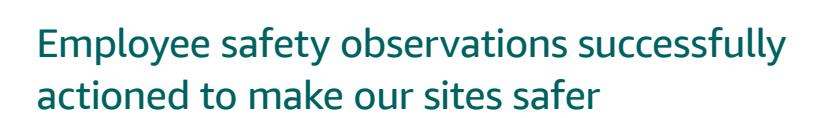

**Figure Description:**
The image displays a textual message with two lines of text against a white background. The upper line reads "Employee safety observations successfully" in bold black font. Below it is another line that says "actioned to make our sites safer," also in bold black font but slightly smaller than the first line. There are no visible numbers or specific details about any particular observation or action taken. The style of the image appears to be a simple digital graphic rather than a photograph or illustration.

 Nearly

6.3M

Site inspections conducted globally, a 152% increase from the 2.5 million conducted in 2020

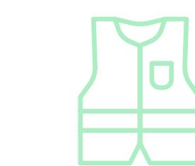

**Figure Description:**
The image displays a stylized graphic of a safety vest with green outlines against a white background. This type of iconography is commonly used to indicate safety equipment or areas within various industries such as construction, manufacturing, and transportation. There are no visible texts or numbers that provide specific information about the size, color, or other attributes of the depicted vest. The design appears simple and abstracted, emphasizing its symbolic representation rather than providing detailed measurements or characteristics.

60%

Improvement in global operations Lost Time Incident Rate (LTIR) over the past four years and 16% improvement from 2022. LTIR includes any work-related injury that requires someone to take time away from work (the most serious injuries)

Amazon's people are the heart and soul of our operations and the reason that safety is integral to everything we do. We strive to be the safest place to work in the industries in which we operate, and we're committed to making sure our employees' health and well-being are prioritized. We are continuously working to enhance our safety processes, leveraging technology to reduce risk, investing in areas where we must improve, partnering with others, and listening to our employees. The meaningful progress we've made so far would not be possible without the combined efforts of our more than 9,000 dedicated safety professionals and every one of our employees around the world.

**Figure Description:**
The image depicts a person standing inside an industrial setting with shelves stocked with various items. The individual is wearing a red shirt and appears to be facing away from the camera, looking towards some sort of machinery or equipment that includes conveyor belts and possibly automated systems. There are no visible texts providing specific information about the location or context within which the photo was taken.

The background features multiple yellow metal shelving units filled with products, suggesting a warehouse environment. On the left side of the image, there's a sign with a hand symbol indicating "No Handling," along with other signs that include prohibition symbols for certain actions such as smoking, eating, drinking, and using mobile phones. These signs imply safety regulations being enforced at the facility.

On the right side of the image, there is a digital display screen showing a series of numbers: 1037596428, 1037596428, 1037596428, 1037596428, 1037596428, 1037596428, 1037596428, 1037596428, 1037596428, 1037596428, 1037596428, 1037596428, 1037596428, 1037596428, 1037596428, 1037596428, 1037596428, 1037596428, 1037596428, 1037596428, 1037596428, 1037596428, 1037596428, 1037596428, 1037596428, 1037596428, 1037596428, 1037596428, 1037596428, 1037596428, 1037596428, 1037596428, 1037596428, 1037596428, 1037596428, 1037596428, 1037596428, 1037596428, 1037596428, 1037596428, 1037596428, 1037596428, 1037596428, 1037596428, 1037596428, 1037596428, 1037596428, 1037596428, 1037596428, 1037596428, 1037596428, 1037596428, 1037596428, 1037596428, 1037596428, 1037596428, 1037596428, 1037596428, 1037596428, 1037596428, 1037596428, 1037596428, 1037596428, 1037596428, 1037596428, 1037596428, 1037596428, 1037596428, 1037596428, 1037596428, 103759

**Figure Description:**
The image displays a stylized graphic of a smiley face with an upward curve to its right side, suggesting happiness or positivity. The color scheme is simple, featuring shades of green and blue against a white background. There are no visible texts within the image itself. The style appears modern and minimalistic, likely intended for branding or as part of a logo design. The absence of any specific numerical values suggests that the focus of this image is more conceptual rather than quantitative.

# Our Approach Our Progress

Our Leadership Principle "Strive to Be Earth's Best Employer" challenges us to create a safer, more productive, higherperforming, more diverse, and more just work environment. It reinforces that nothing is more important than the safety and well-being of our teams.

We aim to be the safest workplace in the industries in which we operate. To drive continuous improvement, we measure progress against both lagging indicators, such as incident rates, and leading indicators, such as employee sentiment. We have safety audits, inspections, and feedback mechanisms in place at every Amazon facility. Together, these steps provide us with a full picture of our workplace safety.

A risk management approach guides our prioritization and decision-making. It includes:

- **•** Engaging employees to continuously improve safety in our operations.
- **•** Assessing safety processes and adherence to standards through audits and inspections.
- **•** Measuring safety performance to assess program effectiveness and identify and remove hazards.
- **•** Working with our operations partners to enhance safety across our network.
- **•** Making targeted investments to enhance our safety performance.

A management system aligned with International Organization for Standardization (ISO) 45001:2018—a voluntary international standard for health and safety management—helps guide our efforts in these areas.

In 2023, we continued to invest in capital improvements, new safety technology, vehicle safety controls, and engineered ergonomic solutions. All of these actions aim to reduce risks and hazards for our employees, partners, and communities.

# Supporting Our Operations and Workforce Safety

Creating a culture where every employee feels engaged and empowered is essential to providing and maintaining a safe environment. We have established a series of feedback mechanisms to ensure we listen to our people on the front lines and incorporate their feedback on ways to improve safety across our operations.

## Safety Observations

One method we use to take employee feedback and turn it into measurable action is Dragonfly. This tool—available on employees' devices and at kiosks on-site—empowers employees to find and fix unsafe conditions or behaviors, escalate safety concerns, and suggest safety improvements during the course of their work. Dragonfly informs site managers so they can take appropriate action. In 2023, we successfully actioned over 200,000 Dragonfly observations to help make our sites safer.

## Safety Committees

Throughout 2023, more than 185,000 employees participated in over 25,000 safety meetings whose purpose was to gather feedback, describe new safety initiatives, and listen to employee needs. These meetings resulted in more than 13,000 follow-up actions, including simple items like readjusting site mirrors to better align with walking paths and sharing reminders on how to safely move pallets.

## Safety Leadership Index

Another tool that we use to measure and improve safety is the Safety Leadership Index (SLI). SLI helps us get ahead of safety risks by receiving information from our employees through a monthly rotation of questions that pop up on employees' scanners and computers when they log in for work. Feedback is anonymous, confidential, and crucial to driving continuous improvement.

# Training Our Employees

Training is foundational to safety excellence. We are constantly updating and enhancing our suite of trainings to ensure they are effective and helpful for employees.

# Onboarding

All applicable new employees receive safety training on their first day of employment. In 2023, all of our newly hired operations employees took our safety onboarding training. This covers ownership of safety, incident reporting and investigation, stop work authority, awareness for all safety procedures, and an introduction to the safety management system. We also review emergency response preparedness training, which includes a site tour and a review of specific shelter-in-place and incident response procedures. To make sure that we are listening to employees' feedback from their first day on the job, we ask whether their training has prepared them to perform their jobs safely. Nearly 89% of those who responded to the survey told us that the training prepared them to do their jobs safely.

# Continuous Learning

After orientation, training continues with routine reminders delivered through daily stand-up meetings, notifications in the A to Z employee app, messages on TV screens in our buildings, alerts when logging on to a workstation, e-learning modules, and wall posters in restrooms, break rooms, and other common areas. We also coach small groups of employees on body mechanics, proactive wellness, and safety through our Huddles program. Managers cover a rotating set of topics that includes proper body movement, conditioning, and best practices for gripping, handling objects, lifting, carrying, and bending. Employees also receive other training based on their job duties, including training modules specific to dock safety, powered industrial trucks, and first aid.

## Annual Training

Every employee and manager participates in annual safety training, which reinforces concepts such as emergency preparedness and response, hazards and controls of the specific jobs they are doing, safety coaching, identifying and reporting unsafe conditions and behaviors, and safety engagement. This goes beyond merely teaching someone the skills they need to complete a specific task. We incorporate real-world scenarios, with practical opportunities to practice what they have learned.

## Mixed Reality Training

Beyond routine training, we invest in new technologies to continuously build safety skills and competencies. We are piloting promising mixed reality training for some higherrisk jobs to simulate real-world scenarios in a controlled, safe environment. For example, we are testing a semi-immersive

**Figure Description:**
The image displays a stylized graphic of a smiley face with an upward-curving green line forming its mouth. This design is simple yet recognizable as a representation of happiness or positivity. There are no visible texts or numbers within the image itself. If you have any specific questions about the image that require numerical information, please provide more context so I can assist you better.

training for our new forklift operators. Using 3D headsets to simulate their jobs, operators learn how to pick orders in a safe and efficient way before starting their roles.

## Our Partners

Our delivery network is powered by thousands of small businesses and hundreds of thousands of drivers who leverage Amazon's technology to improve on-road safety every day. While our partners each provide robust programs for their drivers, we offer additional safety resources and training for any delivery partner who wants to participate. For example, to help drivers practice how to navigate safely in a variety of weather conditions, we created a commercial driver simulator program that includes advanced simulations of potential ice, snow, heavy rain, wind, mechanical challenges, and tire failures.

# Examining Injuries at Amazon Facilities

In addition to looking at overall injury rates, we believe it is important to examine the types and frequency of injuries to help us prevent incidents from occurring in the first place. That is why we rigorously audit and inspect our sites to make sure our resources and protocols are helping us effectively identify, eliminate, or reduce safety hazards. In 2023, we conducted almost 6.3 million inspections within our operations facilities globally, a 152% increase from the 2.5 million conducted in 2020. We audited 240 sites across Amazon.

These inspections and audits help us determine how to address the various types of injury. One of the most common types of injury at any warehousing or transportation company is a musculoskeletal disorder (MSD), more commonly known as a strain or sprain. Over the past four years, the rate of recordable MSD injuries at Amazon has

improved by 27%, but they still make up about 57% of all recordable injuries at Amazon. The remaining 43% of our recordable injuries were due to slips, trips, and falls, or occasional objects that came loose and fell.

To continue reducing MSD injuries, we have devoted considerable effort and resources to improve ergonomic conditions. In 2023, we invested in technology and workspace modifications that specifically target MSD risk reduction. For example, we:

- **•** Introduced sophisticated computer algorithms in our fulfillment centers that direct employees to pick and stow products in ergonomic power zones—the area between the shoulder and mid-thigh. As a result, there was an average 5% improvement in the cumulative forces acting on the lower back and an average 7% improvement on shoulder movements.
- **•** Implemented adjustable-height workstations at select fulfillment centers.
- **•** Deployed ergonomically redesigned packing stations at select fulfillment centers.
- **•** Introduced self-adjusting carts that enable employees to handle totes (plastic bins used to move products) in an ergonomically friendly way.
- **•** Implemented job rotations, where employees are trained in new roles and can rotate among jobs that use different muscle-tendon groups, in some facilities. By doing this, we help decrease repetitive motion and prevent muscle fatigue.

# Evaluating Our Safety Performance

Our global operations network more than doubled in size between 2019 and 2023 to more than 1.1 million employees across thousands of sites.

While we still have work to do, we have made significant progress on safety since 2019. From the beginning of 2019 to the end of 2023, our global Recordable Incident Rate (RIR) improved by 30% and our Lost Time Incident Rate (LTIR) improved by 60%. These safety improvements came in the face of particularly tumultuous world events, including a pandemic that disrupted operations for almost every employer. Amazon's safety performance continues to improve year over year—from 2022 to 2023, we improved our RIR by 8% and our LTIR by 16%. We are pleased with our progress but know we can do more. Each incident that occurs represents a person, and even one incident is too many.

**Learn more** about how [Amazon's safety performance](https://www.aboutamazon.com/news/workplace/amazon-workplace-safety-post-2023)  [continues to improve year over year](https://www.aboutamazon.com/news/workplace/amazon-workplace-safety-post-2023)

## Safety in the United States

In the U.S., we report our operations data to the Occupational Safety and Health Administration under two distinct industries: General Warehousing and Storage, and Courier and Express Delivery Services. The Bureau of Labor Statistics (BLS) determines industry averages for each industry based on the employers' size and categorizes them accordingly. BLS publishes averages each November, meaning the 2022 averages published in November 2023 are the most recent.

Similar to our global operations, we have made meaningful, measurable safety progress in the U.S. over the past four years. In the General Warehousing and Storage industry, our RIR improved by 24% over the past four years. Amazon's 2023 rate is 6.5, which is better than the latest BLS average of 6.8 for employers our size (>1,000 employees[\).40 O](#page-94-0)ur LTIR improved by 77% over the past four years. Amazon's 2023 rate is 1.1, which is better than the latest BLS average of 2.6 for employers our size.

In the Courier and Express Delivery Services industry, our RIR improved by 41% over the past four years. Amazon's 2023 rate is 6.3, which is better than the latest BLS average of 11.5 for employers our size (250–999 employees).[41 O](#page-94-0)ur LTIR improved by 66% over the past four years. Amazon's 2023 rate is 2.4, which is better than the latest BLS average of 4.7 for employers our size.

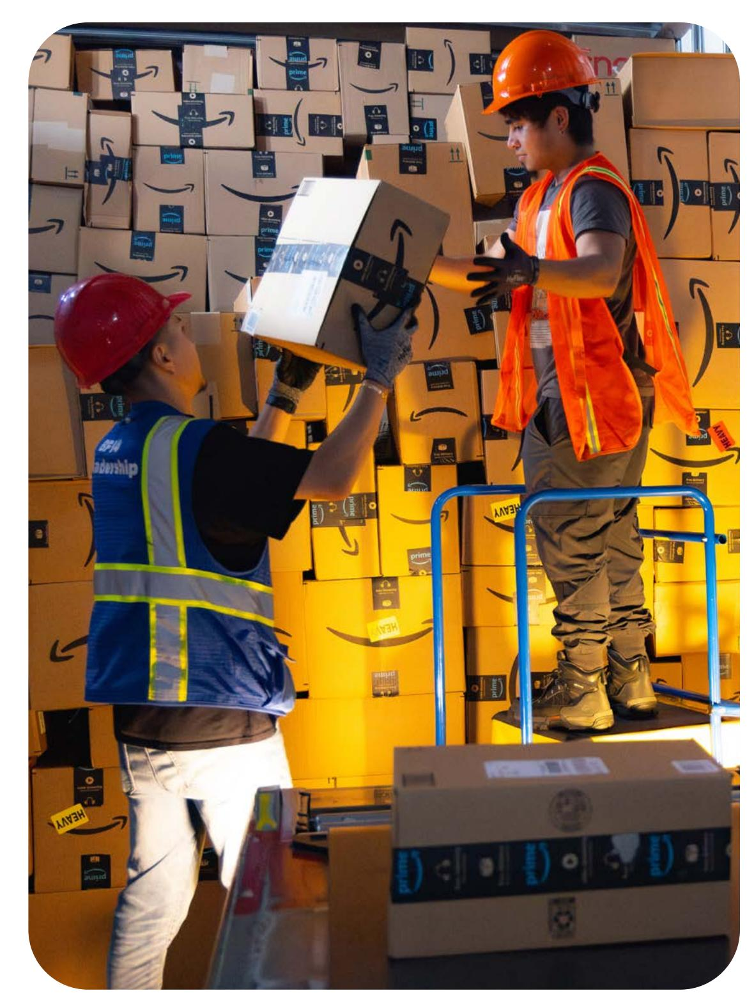

**Figure Description:**
The image depicts two individuals engaged in a task involving boxes with Amazon logos. One person is wearing an orange hard hat and safety vest, while the other individual has a red helmet and blue protective clothing. They are both handling cardboard boxes that appear to be filled with items; one box is being lifted by the person in the orange attire, who seems to be assisting or guiding the action of the other individual.

The background features numerous stacks of similar boxes, suggesting a warehouse or distribution center setting. There's no text visible within the image itself that provides specific information about the location or context beyond what can be directly observed.

In terms of numeric values, there are several "1" labels present on the boxes, which could indicate various things such as product codes, batch numbers, or inventory management tags. However, without additional context, it's not possible to determine their exact significance from the image alone.

Employees work together to load packages.

**Figure Description:**
The image displays a stylized graphic of a smiley face with an open mouth forming a curve that resembles a smile or a happy expression. The color scheme consists mainly of shades of green, with darker tones used for the outline and lighter tones filling the interior spaces. There are no visible texts or numbers within the image itself. The style is simplistic and appears to be designed as a logo or emblem rather than a detailed illustration.

Inclusive Experiences

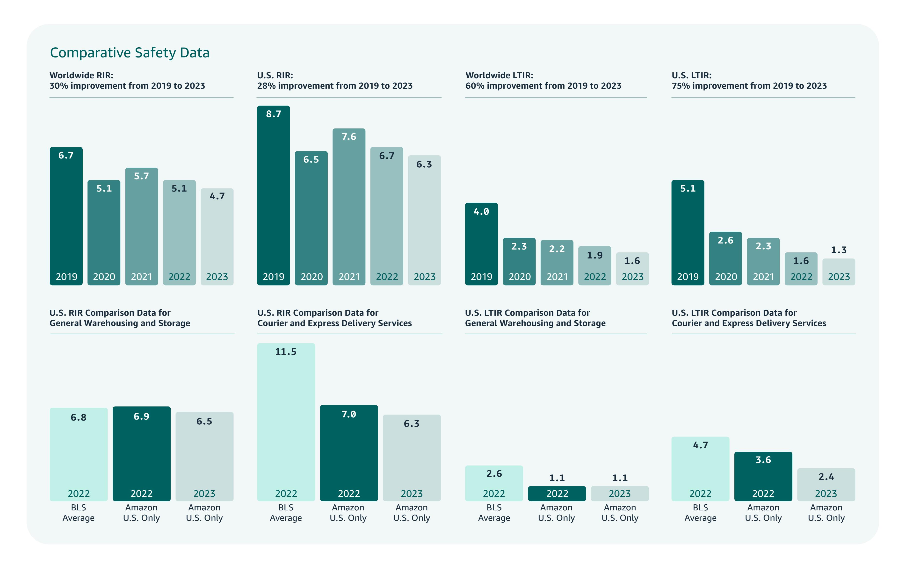

**Figure Description:**
The image is a bar chart titled "Comparative Safety Data." It presents data for various years from 2019 to 2025 across different categories such as Worldwide LTR (Lost Time Reporting), U.S., RJR Compensation Data for General Warehousing and Storage, US. LTR Comparison Data for Courier and Express Delivery Services, and Average U.S. Only data. Each category has multiple bars representing different time periods: 2019 through 2023 and an average value for 2024 and 2025.

The bars are color-coded with teal and green shades, indicating two sets of data or metrics being compared within each category. For example, under Worldwide LTR, there's one set of data labeled "U.S., RJR" which shows improvement over time, starting at 8.7% in 2019 and ending at 6.8% by 2025. Another set of data labeled "US. LTR" starts at 4.0% in 2019 and ends at 5.1% by 2025. Similarly, under U.S., RJR Compensation Data for General Warehousing and Storage, we see improvements from 2.3% in 2019 to 1.9% by 2025. In contrast, the US. LTR Comparison Data for Courier and Express Delivery Services shows a slight increase from 2.6% in 2019 to 3.6% by 2025. Lastly, the Average U.S. Only data also indicates improvement, going from 6.8% in 2019 down to 6.3% by 2025.

Each bar represents a specific metric related to safety performance, and the trend suggests continuous improvement over the given period. The chart provides a visual representation of how these safety measures have evolved over time.

# Investing in Safety Improvements

Our progress is the result of investments of more than \$1 billion in safety initiatives, technologies, and programs since 2019. We have also continued to invest in robotics that help make our operations safer \( \tilde{\tilde{\tilde{\tilde{\tilde{\tilde{\tilde{\tilde{\tilde{\tilde{\tilde{\tilde{\tilde{\tilde{\tilde{\tilde{\tilde{\tilde{\tilde{\tilde{\tilde{\tilde{\tilde{\tilde{\tilde{\tilde{\tilde{\tilde{\tilde{\tilde{\tilde{\tilde{\tilde{\tilde{\tilde{\tilde{\tilde{\tilde{\tilde{\tilde{\tilde{\tilde{\tilde{\tilde{\tilde{\tilde{\tilde{\tilde{\tilde{\tilde{\tilde{\tilde{\tilde{\tilde{\tilde{\tilde{\tilde{\tilde{\tilde{\tilde{\tilde{\tilde{\tilde{\tilde{\tilde{\tilde{\tilde{\tilde{\tilde{\tilde{\tilde{\tilde{\tilde{\tilde{\tilde{\tilde{\tilde{\tilde{\tilde{\tilde{\tilde{\tilde{\tilde{\tilde{\tilde{\tilde{\tilde{\tilde{\tilde{\tilde{\tilde{\tilde{\tilde{\tilde{\tilde{\tilde{\tilde{\tilde{\tilde{\tilde{\tilde{\tilde{\tilde{\tilde{\tilde{\tilde{\tilde{\tilde{\tilde{\tilde{\tilde{\tilde{\tilde{\tilde{\tilde{\tilde{\tilde{\tilde{\tilde{\tilde{\tilde{\tilde{\tilde{\tilde{\tilde{\tilde{\tilde{\tilde{\tilde{\tilde{\tilde{\tilde{\tilde{\tilde{\tilde{\tilde{\tilde{\tilde{\tilde{\tilde{\tilde{\tilde{\tilde{\tilde{\tilde{\tilde{\tilde{\tilde{\tilde{\tilde{\tilde{\tilde{\tilde{\tilde{\tilde{\tilde{\tilde{\tilde{\tilde{\tilde{\tilde{\tilde{\tilde{\tilde{\tilde{\tilde{\tilde{\tilde{\tilde{\tilde{\tilde{\tilde{\tilde{\tilde{\tilde{\tilde{\tilde{\tilde{\tilde{\tilde{\tilde{\tilde{\tilde{\tilde{\tilde{\tilde{\tilde{\tilde{\tilde{\tilde{\tilde{\tilde{\tilde{\tilde{\tilde{\tilde{\tilde{\tilde{\tilde{\tilde{\tilde{\tilde{\tilde{\tilde{\tilde{\tilde{\tilde{\tilde{\tilde{\tilde{\tilde{\tilde{\tilde{\tilde{\tilde{\tilde{\tilde{\tilde{\tilde{\tilde{\tilde{\tilde{\tilde{\tilde{\tilde{\tilde{\tilde{\tilde{\tilde{\tilde{\tilde{\tilde{\tilde{\tilde{\tilde{\tilde{\tilde{\tilde{\tilde{\tilde{\tilde{\tilde{\tilde{\tilde{\tilde{\tilde{\tilde{\tilde{\tilde{\tilde{\tilde{\tilde{\tilde{\tilde{\tilde{\tilde{\tilde{\tilde{\tilde{\tilde{\tilde{\tilde{

We are proud of our advancements in automation, and we supplement this sophisticated technology with well-known forms of personal protection. For example, we require all employees, partners, and visitors to wear safety shoes at our facilities, as well as hard hats and impact-resistant gloves in specific jobs. Mandating composite-toe safety shoes at our facilities has helped reduce toe-related injuries by 85% since 2022. We provide employees with a \$110 voucher annually to acquire approved composite-toe shoes that fit their style and needs.

In addition, we have developed cutting-edge protective equipment for specific jobs. For example, we have developed intelligent safety vests for employees who maintain our robots. These vests use short-range radio frequencies to send signals to robots in real time. Robots in range automatically slow down, alter their route, and, at even closer range, stop entirely when they detect an employee is nearby. Once the employee is out of range, the robot resumes normal operation. As another example, we use sensor technology embedded in cold weather gear for employees who work in our freezers, allowing us to keep an eye on the amount of time they spend working in cooler temperatures. If an employee exceeds a specified amount of time, site personnel

**Figure Description:**
The image displays a stylized graphic of a smiley face with an upward-curving line representing a smile. The color scheme consists mainly of shades of green, which are used to fill both the smiling mouth area and the outline of the smiley face. There is no text present within the image. The style appears modern and minimalistic, using simple shapes and lines to convey its subject matter. The overall impression is that it could be a logo or icon for a brand or service related to happiness, positivity, or perhaps customer satisfaction, given the universal symbolism of a smiley face.

receive a real-time alert to check on the employee and encourage them to take a break. Since introducing this technology in 2022, we have not had a single recordable injury related to overexposure in freezers.

# Working with Our Operations Partners

Within our operations network, we work with partners around the world to deliver packages to our customers safely and efficiently. For example, we collaborate with small business owners called delivery service providers (DSPs) and with independent contractors called Amazon Flex delivery partners to deliver packages to customers' doorsteps. We also work with independent long-haul trucking companies to move products across our network.

Our transportation operations blend Amazon's advanced technology and safety initiatives to transport packages across our network of fulfillment centers, sort centers, and delivery stations, and to our customers. As our transportation operations have expanded, we have focused on making our docks and roads safer through innovative mobile and vehicle technology.

## Freight Network

Our trucking fleet of company-owned and independent long-haul vehicles has advanced safety technology including front-collision warning, automatic emergency braking, stability control, side-object detection, adaptive cruise control, and speed limiters. Drivers in North America and Europe receive enhanced and up-to-date route forecasts to help them stay informed of inclement weather. The information can be accessed at any time, and forecasts are updated every 10 minutes to help them alter their route if needed. Drivers in North America also receive automated warnings if the technology detects their vehicle is stopped on a major road. The technology urges them to move to a safer location, if possible.

## Delivery Network

While our partners report their own safety data to regulators, we are committed to helping them keep their employees safe. To that end, we offer them access to safety resources, training, and technologies. One example is third-party technology in delivery vans that measures and monitors unsafe driving behaviors such as speeding, distraction, and failure to wear a seat belt or obey a road sign. If the technology consistently detects these behaviors, drivers receive a notification when they stop their vehicle for their next delivery. The technology also sends related notifications to the drivers' employers—the DSPs—who are encouraged to coach the drivers. Since we have incorporated this technology into our branded vehicles, DSP drivers' collision rates have declined nearly 40%. From 2022 to 2023, its use has reduced unsafe DSP driving behaviors by 62% in the U.S.

As the weather gets warmer, preparedness and prevention are paramount to the health and safety of our operations teams and delivery partners. In advance of higher temperatures, we use best-in-class technology, amenities, and preventive measures to help keep drivers safe. For example, all Amazon-branded vehicles are equipped with air conditioning—a feature that is well above industry standards. We are also on track to retrofit our full fleet of cargo vans and electric delivery vehicles with insulation that reduces the internal temperature of the back of our vehicles by up to 15% by the end of 2024.

Increasingly, more package deliveries are made overnight, when traffic is lighter and drivers can more safely navigate across communities. In 2023, we created an in-app safety feature that allows drivers to message customers and remind them to turn on porch lights, secure pets, and clear the pathway of hazards. We have also piloted a safe and non-intrusive Dog-Distancing Device—a hand-held unit with ultrasonic sounds and strobe lights that drivers can use when they come in contact with an animal at a delivery location. The device is intended to distract aggressive dogs and help delivery drivers create space between themselves

and the animals when needed. Based on initial success, we have expanded the test to deploy the devices to the drivers who most frequently report encountering dogs during their deliveries.

# Looking Forward

As we look to the future, we plan to continue investing heavily in employee health and safety across our operations. In 2024 alone, we plan to invest over \$750 million in technologies, resources, training, and programs to further our safety efforts. This includes more than \$400 million

for process engineering and retrofit initiatives that improve ergonomics, more than \$150 million in additional forklift safety controls, more than \$100 million for on-the-road safety enhancements, and more than \$80 million for truck yard safety improvements.

We made meaningful, measurable progress in 2023, and we are working hard to build on those achievements. While we're proud of the progress we have made, we know that there is more work to do on our journey to become the safest employer in the industries in which we operate, and this drives our commitment to continue improving safety for our employees, partners, and communities every day.

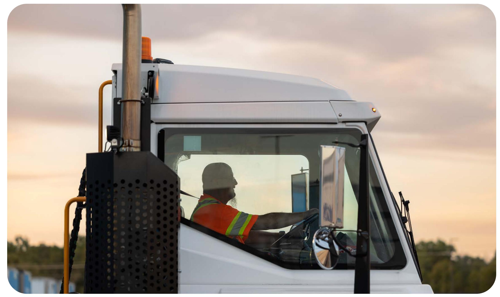

**Figure Description:**
The image depicts a scene of a truck driver at work during dusk or dawn, as indicated by the soft lighting conditions. The truck is equipped with various safety features such as orange reflective strips along its sides, which are standard for heavy vehicles to increase visibility. On top of the cab, there's an orange light that serves as a warning signal when activated. This light is commonly used to alert other road users about potential hazards ahead.

The driver is wearing a high-visibility vest, which is designed to enhance his visibility against low light backgrounds like those seen here. His attire suggests he is adhering to safety regulations while operating the vehicle. He appears focused on driving, as evidenced by his position behind the steering wheel.

In terms of numeric values, there isn't any direct numerical information visible within the image itself. However, we can infer some indirect numerical representations:
1. **Time**: Although not explicitly shown, the time could be estimated from the natural light gradient across the sky, suggesting it might be early morning or late evening.
2. **Temperature**: While not directly stated, the temperature could be assumed based on the clothing worn by the driver (e.g., if he is bundled up, it may indicate cold weather).
3. **Speed**: There is no speedometer visible in the image, but given the context of a professional driver, one could assume that the truck would have a speedometer inside the cabin.
4. **Distance Traveled**: Without additional context, it's impossible to determine how far the truck has traveled since starting its journey.
5. **Fuel Consumption**: Similarly, without more information, fuel consumption cannot be quantified.
6. **Load Capacity**: It's unclear whether the truck carries cargo, so any assessment regarding load capacity would require further details.
7. **Maintenance Schedule**: Regular maintenance schedules are typically followed by fleet operators, but these are usually documented internally rather than being displayed publicly.
8. **Route Information**: If GPS navigation systems were installed in the truck, they could provide real-time route data, including distance to destination, current location, and estimated travel times.
9. **Vehicle Identification Number (VIN)**: Each vehicle has a unique VIN number that identifies individual trucks. This number is often found on the driver's side door panel, but it's not clearly visible in this image.

Please note that these interpretations are speculative and based solely on the visual content provided by the image. Actual numeric values would require access to specific documentation or equipment not present in the photo.

We offer our freight partners access to safety resources, training, and technologies to keep their employees safe.

**Figure Description:**
The image displays a stylized graphic of a smiley face with an upward-curving line representing a smiling mouth. To the right of the smiley face is a curved arrow pointing upwards to the left, suggesting movement or progression towards something positive. There are no visible texts within the image that provide additional context or information about the numeric values you mentioned. If there were any numbers present, I would describe them accordingly. However, based on the available visual content, it's not possible for me to provide specific details regarding numeric values as requested.

16K+

[Employee Experience](#page-74-0) [Health and Safety](#page-80-0) Inclusive Experiences

# Inclusive Experiences

Goal

Hire 100,000 U.S. military veterans and military spouses by July 2024

100.4K+

U.S. military veterans and military spouses hired by the end of January 2024

**100.4K+**

100K

Goal

Conduct a racial equity audit to evaluate the impacts of our policies, programs, and practices on hourly operations employees

The audit is on track to be completed in 2024. We will review the results to inform our approach to operational policies and practices moving forward

Amazon creates inclusive technology and experiences that connect our diverse world. To guide our work, we set three companywide priorities. The first is to accelerate inclusive experiences globally, delivering initiatives for employees, customers, and communities around the world. The second is to build equity and inclusion into our talent strategies, with a greater focus on professional development, promotion, and retention. And the third is to advance diversity, equity, and inclusion (DEI) through technology.

Goal

Hire at least 5,000 refugees in the U.S. by the end of 2024

 Nearly

18K

Refugees hired in the U.S. in 2023

5K

**~18K**

Goal

Provide training for 10,000 Ukrainians globally through the AWS program ITSkills4U by 2024

 Nearly

16.5K

Ukrainians received training by the end of 2023

# Actions

**Figure Description:**
The image displays a single digit "6" prominently against a white background. The number is written in a bold, sans-serif font that appears to be teal or green in color. There are no additional elements or context provided within the frame of the image. It's a simple graphic with a clear focus on the numerical value it represents.

Funds supported by Amazon Catalytic Capital, an initiative to invest in venture capital funds, accelerators, incubators, and venture studios that support Black, Latino, and other historically marginalized entrepreneurs

For the first time, people with hearing loss can stream sound from their Amazon Fire TV directly to their cochlear hearing implants via the opensource Audio Streaming for Hearing Aids protocol

3.5M+

Candidates used our online assessment to help identify the best position for them at Amazon, which improves equity and fairness in the hiring process

# Awards

100/100

Score on the Human Rights Campaign's Corporate Equality Index for the sixth year in a row

100/100

Score on the Disability Equality Index for the second year in a row

#1

On the LinkedIn Top Companies U.S. Edition for the third year in a row

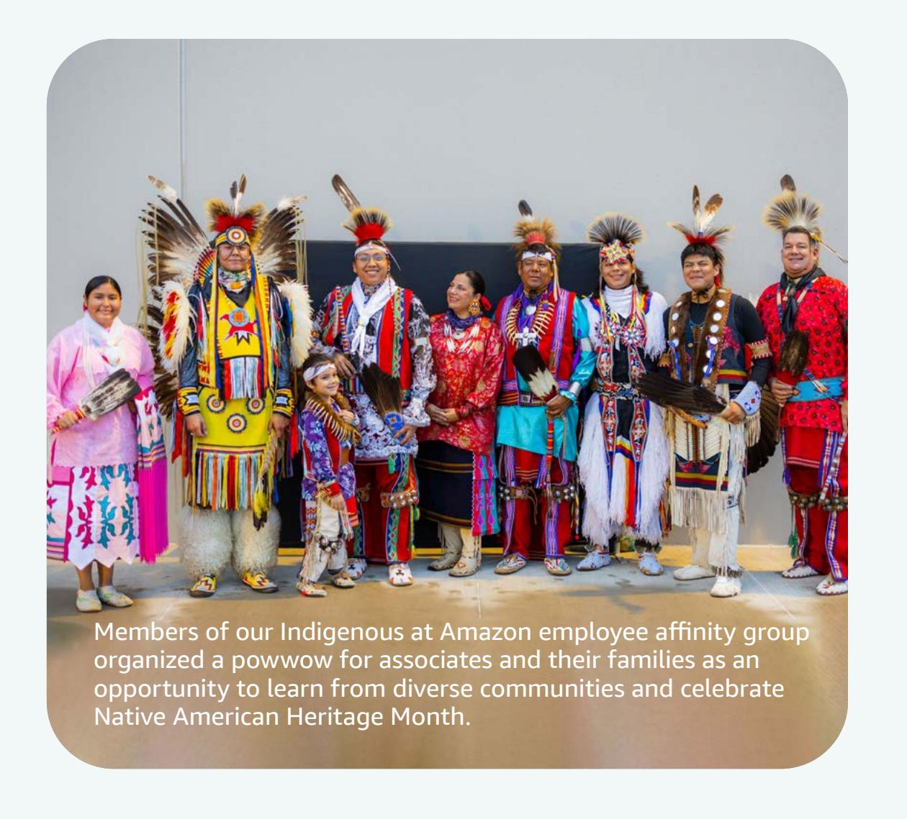

**Figure Description:**
The image is a photograph featuring nine individuals dressed in traditional Native American attire, standing side by side against a plain background. They are posing for the photo with smiles and appear to be part of an event or celebration related to their culture. Each person has distinct clothing items that include colorful headdresses, garments adorned with intricate patterns, and accessories such as feather earrings and necklaces.

At the bottom of the image, there is text overlaying the photograph. It reads: "Members of our Indigenous at Amazon employee affinity group organized a powwow for associates and their families as an opportunity to learn from diverse communities and celebrate Native American Heritage Month." This text provides context about the purpose of the gathering depicted in the photograph.

The style of the image suggests it may have been taken during a special occasion or event within the company where these employees work, highlighting cultural diversity and inclusivity initiatives. The presence of the text indicates that the image serves both as documentation of the event and as promotional material for the organization's commitment to supporting indigenous cultures.

**Figure Description:**
The image displays a simple graphic of a smiley face with an upward-curving line for a mouth. The color scheme is minimalistic, featuring shades of green and blue against a white background. There are no visible texts or numbers within the image itself. The style appears to be modern and abstract, potentially representing happiness or positivity due to the smiling shape. However, without additional context, it's difficult to provide more specific details about the numerical representation as there doesn't seem to be any direct correlation between the shapes and numbers typically associated with numerics.

# Our Approach Our Progress

We believe the best way to enable enduring inclusive experiences is through technology. We are evolving our approach to diversity, equity, and inclusion (DEI) work by shifting to a more scalable, long-term view through three new mental models. This new strategy enables us to accelerate progress on our priorities and create inclusive experiences at scale. The mental models that guide our work are:

- **• Bolted-on** DEI programs, which drive inclusive and equitable outcomes within our business operations. An example of a bolted-on program is diversity training, which teaches our employees to take more intentionally inclusive actions at work.
- **• Built-in** solutions, which are embedded into existing products to drive equitable experience and outcomes. For example, the captions and dialogue boosts in Prime Video are built-in solutions, which create a more accessible experience for customers who are hard of hearing.
- **• Born-inclusive** solutions, which we define as building equity and inclusion into the architecture of a product or technology from the start. Examples of this include aspects of product design, such as accessibility.

More built-in and born-inclusive solutions will be required to accelerate progress on our priorities and create inclusive experiences at scale.

**Learn more** about Amazon's approach to inclusion on our global [DEI website](https://www.aboutamazon.com/workplace/diversity-inclusion)

As we deliver on our goals and make progress on our priority commitments, we continue reaching across cultures to connect our diverse world. We use our size, speed, and innovation to unite us in new and exciting ways, incorporating inclusion into everything we do.

# Building Equity and Inclusion into Our Talent Management

We continue to diversify our workforce, inspect outcomes of our talent strategies, and experiment with initiatives that foster a diverse talent pipeline and improve the experience for employees—from being hired, to successful onboarding, to career development.

## Building a Diverse Pipeline of Talent

Amazon's ambition is for our employee population to represent the diverse communities we serve. As part of our efforts, we are building a strong pipeline of emerging diverse talent through educational programs.

In 2023, more than 300 employees volunteered through the Amazon Hardware, Engineering, Artificial Intelligence, and Devices (AHEAD) program, which gives primary and high school science, technology, engineering, and math (STEM) students hands-on learning through a custom curriculum enhanced by Amazon innovation. AHEAD helps historically underrepresented students and their families understand the pathways to high-tech fields by connecting them with Amazon employees who can share their own career journeys, guidance, and lessons learned.

We also welcomed 89 youth apprentices in 2023 to Amazon JumpStart, a program that employs emerging talent from

high schools in underserved communities. Seven different Amazon organizations—Devices & Services, Amazon Advertising, AWS, Worldwide Amazon Stores, Finance, Audio, and Twitch & Games—provided apprentices with on-the-job learning experiences.

## Developing Diverse Talent

Throughout 2023, Black, Latino/e, and women senior leaders across Amazon partnered with our hiring teams to support the continuous expansion of our external talent networks by investing in conferences and organizations such as Afro Tech, Association of Latino Professionals for America (ALPFA), Black Men Xcel, Latinas in Tech, Society of Hispanic Professional Engineers (SHPE), and Women in Tech. Amazon senior leaders participated in roundtable discussions and network-building and affinity-based events, and they engaged in recruiting partnerships—all to increase brand awareness, engage diverse talent, and drive expanded interaction with prospective external employees and leaders.

As we build our talent communities, we aim to create space for our leaders and employees to come together and share experiences and learn about Amazon. For example, the Líderes sponsorship program equips participants with the skill to create a personalized career growth plan that builds on the unique needs of Latino/e talent and creates opportunities for participants to have sustained exposure to, and advocacy from, senior leaders.

# Accelerating Inclusive Experiences Globally

We are delivering inclusive experiences for our employees, customers, and communities in over 60 countries around the world.

## Our Employees, Customers, and Communities

### **Together at Amazon**

We want all Amazon employees to feel that they belong. That is why we support programs that connect our employees globally through shared experiences. For example, Connect@Amazon is an employee engagement organization that hosts a variety of events for all full-time employees, such as career summits, volunteer activities, cultural gatherings, and professional networking. In 2023, Connect@Amazon hosted events across 33 chapters with 80,000 participants worldwide.

Employees can also participate in networking programs that organize learning opportunities, lead service projects, and host activities around cultural celebrations. In 2023, nearly 148,200 employees across more than 2,500 chapters in 60 countries participated in one or more of our affinity groups. AWS employees can take part in the Inclusive Ambassador program, which is dedicated to scaling an inclusive, fair, and respectful culture at AWS. More than 19,000 AWS employees across 52 chapters globally participated in the Inclusive Ambassador program in 2023.

**Learn more** about Amazon's [affinity groups](https://www.aboutamazon.com/affinity-groups)

### **LGBTQIA+ at Amazon**

We are committed to supporting and creating inclusive experiences for LGBTQIA+ employees and communities around the globe. To advance development and recruitment efforts, Amazon strengthened key external LGBTQIA+ partnerships and fostered new ones. New partners in 2023 include the Ali Forney Center, Coqual, myGwork, and Rainbow Railroad.

We rolled out new, inclusive self-identification features for employees in 2023, allowing them to easily change their

**Figure Description:**
The image displays a stylized graphic that resembles a smiley face with an abstract design. It consists of two curved lines forming a shape reminiscent of a smile or a simple representation of a mouth. Between these curves is a small vertical line that could be interpreted as a nose or another feature. The color scheme includes shades of green and blue, which are used to fill in the shapes. There are no visible texts or numbers within the image itself. The style appears modern and minimalistic, using negative space effectively to create the impression of a smiling face.

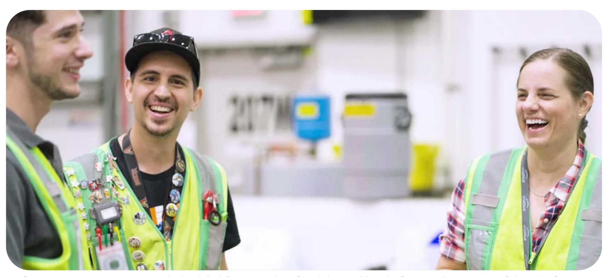

**Figure Description:**
The image is a photograph featuring three individuals who appear to be wearing safety vests with reflective stripes and various badges or pins attached to them. They are smiling at the camera, suggesting a positive atmosphere. In the background, there's an industrial setting with equipment and machinery visible, indicating that these people might work in such an environment.

The most prominent text in the image reads "2017," which likely refers to the year when the photo was taken. There is also a number "4" displayed prominently near the center of the image, but without additional context, it's unclear what this number represents. It could possibly indicate a specific event, project code, or some other form of identification within their workplace.

There are no significant details about the location beyond the presence of industrial equipment, so it's not possible to provide more information about where exactly this photo was taken. The overall style of the image suggests it may have been taken during a company event or milestone celebration related to the year mentioned.

Before coming to Amazon, veteran Sarah Rhoads (right), Vice President of Workplace Health and Safety, served as a U.S. Navy fighter pilot for 12 years.

name, marital status, sexual orientation, and gender identity and to share pronouns with colleagues through our internal human resources tool, A to Z.

### **People with Disabilities at Amazon**

Amazon works to foster a workplace culture that is safe, welcoming, and inclusive to people with disabilities. We continue to provide resources to advance disability inclusion globally, such as our AmazonPwD affinity group and leadership tools to support employees with disabilities.

We are proud of the awards and recognitions we received in 2023 as an inclusive and accessible employer for people with disabilities. For the second year in a row, we earned a top score of 100 on the Disability Equality Index, which is a joint initiative of the American Association of People with Disabilities (AAPD), the nation's largest disability rights

organization, and Disability:IN, the leading global business disability inclusion network, which collectively advances the inclusion of people with disabilities.

In 2023, the UK government's Disability Confident employer program recognized Amazon as a Level 3 Leader, the highest level of accreditation. Developed by employers and organizations that represent people living with disabilities, this program encourages employers to think differently about disability and improve how they recruit, retain, and develop talent within their organizations. In India, we received the government's National Award for Empowerment of Persons with Disabilities. We are proud to receive these recognitions and continue to take measurable, concrete actions to strengthen disability inclusion and equality globally across our business.

### **Refugees and Humanitarian-Based Immigrants**

As part of our efforts to be Earth's best employer, we welcome refugees and immigrants into our workforce and support their transition to their new communities. In 2022, we announced a goal to hire at least 5,000 refugees in the U.S. by the end of 2024—and we achieved this in 2023.

To support this hiring commitment, in 2023, we expanded our [Welcome Door](https://www.aboutamazon.com/workplace/amazon-welcome-door) program, which offers resources and support for refugee and humanitarian-based immigrant employees in the U.S., to Germany, Poland, and Australia. Benefits vary by country (based on need) but may include financial reimbursement for immigrationrelated processes, free legal resources to help navigate immigration-related questions, the option to connect with immigration experts, access to upskilling opportunities, and customized mentorship.

Through the AWS program ITSkills4U, AWS provides virtual and in-person training to people who are interested in expanding their job opportunities in non-IT roles, switching to IT, or advancing their IT careers. By the end of 2023, ITSkills4U had provided training to nearly 16,500 Ukrainians globally, including refugees—exceeding AWS's goal of training 10,000 Ukrainians.

### **Veterans and Military Spouses at Amazon**

We recognize the diverse backgrounds and experiences that veterans and military spouses bring to Amazon, as well as how they strengthen our workforce. Amazon partners across business lines to host hiring events, such as Amazon Military Hiring Days and virtual information sessions.

Amazon hired over 100,400 veterans and spouses through January 2024, achieving our goal to hire 100,000 veterans and spouses by July 2024. At the end of 2023, Amazon employed 98,500 veterans and military spouses, based on data from countries where employees can identify themselves as such. In addition, our veteran retention and promotion rates outpaced those of non-veterans.

### **Women at Amazon**

Amazon celebrates women around the world and aims to inspire the next generation of women in tech. We advocate for gender diversity, equal opportunities, and inclusive spaces for women to thrive and feel comfortable at work and beyond.

In 2023, our Women at Amazon affinity group hosted development programs across Amazon, such as its Sponsorship and Promotion Accelerating Readiness and Know-How (SPARK) initiative. This program offers employees access to formal training and development, influence and advocacy, networking opportunities with senior leaders, and targeted, actionable coaching. In 2023, SPARK onboarded 300 participants across eight countries.

We also focus on investing in women as community members that contribute to industry innovation through initiatives that help close funding gaps. For example, in 2023, we held our first-ever [AWS Startups Women's Demo Week](https://awsstartupswomensdemoweek.splashthat.com/) , a global event helping women-led startups connect with investors. Additionally, we are committed to supporting women climate tech entrepreneurs through The Climate Pledge Fund's Female Founder Initiative. In 2023, [the Female Founder](https://www.aboutamazon.com/news/sustainability/why-amazons-climate-pledge-fund-is-investing-in-this-entrepreneur-and-her-plastic-waste-solution)  [Initiative invested in Genecis](https://www.aboutamazon.com/news/sustainability/why-amazons-climate-pledge-fund-is-investing-in-this-entrepreneur-and-her-plastic-waste-solution) , a bioplastics company founded by scientist Luna Yu.

**Learn more** about how we are accelerating climate solutions from female founders through [The Climate](#page-22-0)  [Pledge Fund](#page-22-0)

### **Indigenous Communities**

Amazon is committed to supporting Indigenous leaders and creating solutions to help close educational and professional gaps among members of Indigenous communities. Our firstever Amazon [online storefront in support of Indigenous](https://www.amazon.ca/b?ie=UTF8&node=119148243011)  [communities](https://www.amazon.ca/b?ie=UTF8&node=119148243011) in Canada was launched in 2023. The storefront benefited 13 Indigenous artists/authors and three nonprofits that lead important work for Indigenous communities across Canada.

**Figure Description:**
The image displays a stylized graphic of a smiley face with an upward curve to its right side, suggesting happiness or positivity. The color scheme consists mainly of green shades, which are commonly associated with nature, growth, and health. There is no text present within the image that provides additional context or information about the numeric values you mentioned. If there were any numbers provided, I would describe them as accurately as possible based on their positioning relative to other elements in the image. However, without visible numerical data, it's not appropriate for me to speculate or make assumptions about unseen content. Please provide more details if available.

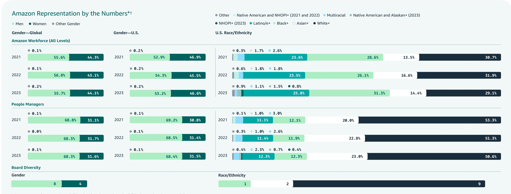

**Figure Description:**
The image is a colorful bar chart titled "Amazon Representation by the Numbers". It provides data for various demographic groups within Amazon's workforce as of December 2021. The chart is divided into three sections: Gender, Race/Ethnicity, and Native American and Alaska Native (NAAN) representation. Each section has subcategories representing different levels or roles within Amazon, such as Men, Women, Other Gender, U.S./Race/Ethnicity, Black, White, Asian, Hispanic/Latino, Two or More Races, NHOP (Native Hawaiian and Other Pacific Islander), AI/ANI (American Indian and Alaska Native), Multiracial, and Board Diversity.

The bars are colored to distinguish between different categories. For example, the gender-related bars are green, while those related to race/ethnicity are blue. The chart uses percentages to indicate the proportion of each group within these broader categories.

In terms of specific numbers provided, there are several instances where the percentage is given as '8'. However, without additional context, it is not clear which category or role this number corresponds to. Similarly, other numerical values are presented, but their corresponding labels are not visible due to the resolution of the image.

Overall, the chart serves as an informative visual tool that allows viewers to compare the diversity statistics across different demographics and roles at Amazon.

**Learn more** about our Board diversity data in our [Sustainability Reporting Framework Summary](https://sustainability.aboutamazon.com/2023-sustainability-reporting-framework-summary.pdf)

**Figure Description:**
The image features a stylized graphic of a smiley face with an open mouth, suggesting happiness or contentment. The color scheme is simple, consisting mainly of green for the outline and fill of the smiling shape, against a white background. There are no visible texts within the image itself. However, there appears to be some text outside the main graphic that reads "100%," which could indicate a percentage value related to the product or service being advertised by the logo. Additionally, there's another piece of text at the bottom right corner of the image that seems to say "250," but it's not entirely clear due to its positioning. This number might also relate to the product or service mentioned above. Without additional context, it's difficult to determine exactly what these numbers represent; however, they likely pertain to the branded item or concept depicted by the logo.

\* In late 2021, we began allowing employees to identify as multiple specific races or ethnicities and updated our race/ethnicity reporting to begin counting multiracial employees under each separate group with which they identify. As such, category data may not add up to 100% exactly. We also count employees as they currently identify, both for race and ethnicity and for gender. Therefore, when an employee updates their identification, Amazon counts that employee according to their new identification at all times in their career at Amazon, which may change historic data and reporting. Data in this report reflects employee identification as of December 31, 2023.

† In 2023, Amazon updated reporting to include directly employed seasonal and temporary Field and Customer Support workers as well as all employees in the Audible, Twitch, and MGM subsidiaries. Additionally, reporting has been updated to reflect the distinct Native Hawaiian or Other Pacific Islander (NHOPI) category. Moving forward this group is reported separately from Native American/Alaskan.

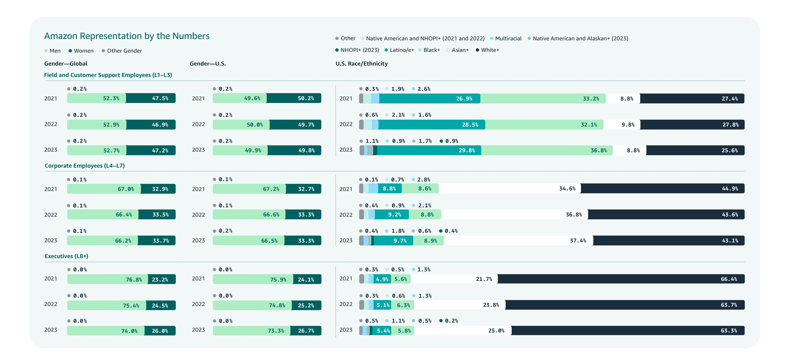

**Figure Description:**
The image is a graphical representation of data related to Amazon's workforce demographics by gender and race/ethnicity for the years 2018 through 2023. It appears to be an infographic or chart that provides numerical percentages alongside color-coded bars representing different racial groups within each yearly snapshot.

At the top left corner, there are two headings: "Amazon Representation by the Numbers" and "Other Native American & NHPI (2022)". Below these titles, there are three columns labeled "Men", "Women", and "Other / Non-binary". Each column has subcategories with specific time periods ranging from "2018 - Q4" to "2023 - Q4". These subcategories are further broken down into various racial categories such as "White", "Black", "Hispanic", "Asian", and others.

The numbers indicate the percentage of employees who identify with each racial group across the genders and over the given timeframes. For example, under "Men - White" for the year 2019, it shows "56.7%" which likely represents the proportion of white men employed at Amazon during that quarter. Similarly, other cells contain numerical figures indicating the percentage of employment for individuals identifying with different races and genders.

Each cell contains both textual information and colored bar graphs. The colors used for the bar graphs correspond to different racial groups, making it easy to visually compare the proportions between them. The overall style of the image suggests a focus on transparency and diversity metrics provided by Amazon.

**Figure Description:**
The image displays a stylized graphic of a smiley face with a curved line forming its mouth. The color scheme consists of two shades of green: one is darker than the other. There are no visible texts or numbers within the image itself. The style appears to be minimalistic and could potentially be associated with branding or logo design due to its simple yet recognizable form. However, without additional context, it's difficult to provide specific details about the numerical values you mentioned as there are none present in the image provided.

**Figure Description:**
The image displays a simple graphic of a star with five points, each connected by lines to form a cohesive shape. The star is outlined in green against a white background. There are no texts or additional elements within the image. The style of the image appears to be minimalistic and iconographic, commonly used for various purposes such as logos, symbols, or decorative graphics. The numerical value "5" can be seen at the top right corner of the star, suggesting that it might represent one of the five points of the star. However, without further context, the specific meaning or significance of the number "5" remains unclear from the image alone.

### **Awards and Recognitions**

A variety of organizations recognized Amazon as a great place to work in 2023. Some of the recognitions we received as a top employer include:

- **• Human Rights Campaign's Corporate Equality Index:** 100/100 for the sixth year in a row
- **• Disability Equality Index:** 100/100 in 2022 and 2023 and a Best Place to Work for Disability Inclusion for the sixth year in a row
- **• LinkedIn Top Companies U.S. Edition:** No. 1 for the third year in a row
- **• Business Disability Forum's Disability Smart Technology Award**
- **• The Bell Seal for Workplace Mental Health:** Platinum
- **• Purple Certification from the Purple Method:** Received top score of 100 on our corporate approach to preventing workplace harassment

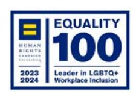

**Figure Description:**
The image displays a logo with text that reads "EQUALITY 100" prominently at the top. Below this main title is additional information stating "LEADER IN LGBTQ+ WORKPLACE INCLUSION," followed by two years of recognition: "2023" and "2024." To the left side of the logo, there's an emblem consisting of three horizontal bars—blue, yellow, and white—with the letters "HRC" inside them, which stands for Human Rights Campaign. On the right side of the logo, there are two numbers: "100" above the word "EQUALITY" and "100+" below it. At the bottom of the logo, there's another line of text indicating the year "2023" and the phrase "Leader in workplace inclusion." The style of the image suggests it may be related to a corporate or organizational identity, specifically highlighting achievements in LGBTQ+ rights within workplaces during these years.

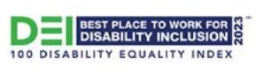

**Figure Description:**
The image displays a logo with text that reads "DEI Best Place to Work for Disability Inclusion 2023" at the top. Below this statement is another line of text stating "100 DISABILITY EQUALITY INDEX." The logo features a stylized green checkmark inside a blue rectangle, which is set against a white background. The overall style of the image suggests it may be related to an organization's commitment to disability inclusion or diversity, equity, and inclusion (DEI) practices within their workplace environment. The presence of the year "2023" indicates that the recognition was awarded during that calendar year. The number "100" likely represents some form of ranking or scorecard related to the index mentioned below the main title. However, without additional context, the specific meaning of these numbers remains unclear.

**Figure Description:**
The image is a graphic with text that reads "TOP COMPANIES UNITED STATES" at the bottom. Above this main text are two prominent numbers: "2022" and "15." These numbers suggest that the list of top companies for the year 2022 has been compiled or published by LinkedIn. The design includes an iconographic representation of a magnifying glass within a circular frame, which could symbolize searching for information about these top companies. The overall style of the image appears to be informational and promotional, likely intended to advertise or announce the availability of such a list from LinkedIn.

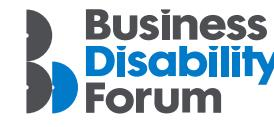

**Figure Description:**
The image displays a logo with text that reads "BUSINESS DISABILITY FORUM." The design is simple, featuring three stylized letters 'B', 'D', and 'F' arranged vertically to form an acronym for the organization or event it represents. Each letter has a different color: blue, dark gray, and light gray respectively. Below the acronym, there are two horizontal lines, one blue and one white, which might be part of the branding or design elements. The style of the image suggests it could be used as a digital icon or banner due to its clean and modern appearance. There are no additional details provided within the context of the question.

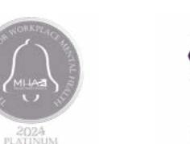

**Figure Description:**
The image features two distinct logos placed side by side against a white background. On the left is a circular logo with a silver border that reads "WORKPLACE MENTAL HEALTH PREMIUM" in capital letters around its perimeter. Inside the circle, there's an illustration of a bell with text inside it stating "MHIA Premium." Below the circle, the year "2024" is prominently displayed along with the word "Premium," suggesting a specific time frame or product name associated with mental health services provided by an organization named MHIA.

On the right side of the image, there's another circular logo with a similar design to the first one but without any visible text within it. This logo also has a silver border and appears to be smaller than the first one due to perspective distortion caused by the angle at which the image was taken.

The overall style of the image suggests it may be related to marketing materials for a company or service offering workplace mental health support, possibly as part of a premium package or subscription plan. The use of the number "2024" could indicate a future date when these services will become available or significant, although without additional context, the exact meaning remains unclear.

In the U.S., we signed our first memorandum of understanding (MOU) with a tribal nation in 2023, formalizing our collaboration with the Confederated Tribes of the Umatilla Indian Reservation (CTUIR). Under the MOU, Amazon will consult with the CTUIR, review their input, and implement risk mitigation processes for projects that should consider natural resources, areas of traditional or current use, and cultural or historic sites.

### **Supporting Black, Latino, and Diverse Businesses**

Amazon is committed to supporting Black, Latino, and diverse businesses and wants to see them succeed. We deliver and invest in tools and resources that empower business owners to grow and, in turn, create positive impact in their local communities.

In 2023, as part of our efforts to boost and support early-stage, Black, Latino, and other underrepresented entrepreneurs, Amazon Catalytic Capital invested in six new venture capital funds. Catalytic Capital is a \$150 million fund committed to investing in venture capital funds, accelerators, incubators, and venture studios that support Black, Latino, and other historically underrepresented entrepreneurs. These new investments helped us meet our goal to support 10 funds and accelerators and, in turn, fund 200 companies by the end of 2023.

## **Learn more** about [Catalytic Capital](https://amazoncatalyticcapital.com/)

We are also creating opportunities for alignment with the greater community through programs such as our [Black Business Accelerator](https://sell.amazon.com/programs/black-business-accelerator?ld=SEUSBBA-GOO-117-062022v2&gclid=Cj0KCQjwoK2mBhDzARIsADGbjerd-rn6RR0NmhYRW_a1xrs7i7-ICZ_ysoLvXBFLh6LzNjh65OzthzUaAmAZEALw_wcB) (BBA), which was launched in 2021 as our first growth accelerator. Backed by a \$150 million commitment from Amazon over four years, the BBA is dedicated to assisting Black-owned businesses in building sustainable growth on Amazon's store. It provides a range of comprehensive educational, discoverability, and community resources for certified Black-owned U.S. businesses with professional seller accounts at our store. In 2023, the BBA provided 274 businesses with account management and financial assistance to accelerate their journey to launch and scale their businesses. Through the BBA, Amazon has

increased the unique selection of products we bring to our customers while creating a network with the Black business community to better understand and support their entrepreneurial endeavors.

Another example is the AWS Impact Accelerator, a \$30 million fund that provides Black, Latino/e, women, and LGBTQIA+ founders with equitable access to funds, training, mentorship, tools, and resources. In 2023, 20 companies participated in the AWS Impact Accelerator Latino Founders Cohort, giving pre-seed Latino/e founders the support they need to accelerate their businesses.

**Learn more** about our efforts to [support diverse](#page-63-0)  [businesses](#page-63-0)

# Advancing DEI through Technology

Amazon is creating inclusive technology that connects our diverse world, disrupting the status quo of how we learn, communicate, and live.

## Innovating for Accessibility

In everything we do, we work backward from our customers. This includes offering more devices and services with builtin accessibility solutions to better support our customers with disabilities. Within Amazon's devices and entertainment businesses, we continue to build and expand accessibility features in our products, from Alexa and Fire TV to Audible and Prime Video. For example, we offer Alexa Voice Service (AVS) to commercial device makers such as original design manufacturers and systems integrators, who use it to build Alexa into smart speakers, headphones, PCs, TVs, vehicles, and smart home products. We also launched Voice Access, a new accessibility feature for our Fire HD 10, in October 2023. Voice Access allows customers who can speak English, but cannot use their hands to touch the screen, to control their Fire tablet with their voice.

**Figure Description:**
The image displays a graphic icon with two main elements: an electrical outlet symbolizing power supply or charging station, and a smartphone connected to it by a cable, indicating that the device is being charged. There are no visible texts or numbers within the image itself. The style of the image appears to be a simplified vector illustration commonly used for user interfaces or informational graphics. It does not provide any specific numerical information as requested.

### **Accelerating Equitable Health Research**

Many communities are currently underrepresented in medical research. As a result, less is known about their health and ways to provide them with the best care. In September 2023, we began a partnership with the National Institutes of Health (NIH) to raise awareness of their All of Us Research Program, an effort to collect and study data from people living in the U.S. to build one of the most diverse health databases in history. This initiative focuses on accelerating precision medicine research, increasing health equity, and providing DNA results to participants. In support of this work, All of Us works closely with organizations with deep ties to communities that have been historically underrepresented in biomedical research.

We were NIH's first corporate health equity partner. In 2023, more than 1,300 Amazon employees have either visited the All of Us website or interacted directly with All of Us staff to learn more about the program, and more than 200 Amazon employees have participated in this landmark study. Of the participants who joined a kickoff event at our second corporate headquarters in Arlington, Virginia, 79% are from communities that have been historically underrepresented in biomedical research.

**Figure Description:**
The image displays a stylized graphic of a smiley face with an upward-curving line for a mouth and two curved lines forming eyes or eyebrows. The color scheme consists mainly of green shades, which are used to fill in the outline of the smiling face. There is no text present within the image. The style appears to be simplistic and iconographic, commonly associated with branding or logo design due to its minimalist nature. The specific meaning or context of the image would depend on additional information not visible in the provided image.

**Figure Description:**
The image is a close-up photograph of a person's profile view with their face turned towards us. They appear to be wearing earphones or headphones that are inserted into one ear. The individual has dark hair pulled back from their face, which suggests a sense of focus or concentration. There are no visible texts or numbers within the image itself. The style of the image is realistic with an emphasis on capturing a moment of quiet introspection or listening activity. The lighting seems soft and diffused, highlighting the contours of the person's skin and facial features without creating harsh shadows. The background is blurred but appears to be indoors due to the warm tones present.

In 2023, Amazon Fire TV expanded its audio streaming capabilities to include cochlear implants.

In 2023, Amazon Fire TV expanded its audio streaming capabilities for hearing aids and devices to include cochlear implants. For the first time, people with hearing loss can stream sound directly from their Amazon smart TVs to their cochlear hearing implants via the open-source Audio Streaming for Hearing Aids protocol. This latest innovation was built in partnership with customers and members of the AmazonPwD employee affinity group who use cochlear implants.

We have the world's largest catalog of movies with additional spoken audio, which describes what is happening on screen, making it easier for our customers who identify as blind or visually impaired to enjoy their favorite Prime content. By the end of 2023, Prime users had access to over 5,750 audio-described movies and nearly 1,300 audio-described television series.

In 2023, Amazon Music and Amazon MGM Studios partnered to create more inclusive experiences for customers who

identify as deaf, disabled, or neurodiverse. For example, the teams introduced American Sign Language (ASL) interpreters from marginalized communities on Amazon Music Live concerts after Thursday Night Football, creating a more inclusive experience for performing artists, interpreters, and customers.

### **External Engagement and Partnerships**

Business Disability Forum, a UK-based disability inclusion organization, honored Amazon with the Disability Smart Technology Award in 2023. This award recognizes our work to develop technology that improves the lives and experiences of people living with disabilities. The judges noted the breadth of our innovation and global reach, as well as our use of employee and customer feedback to inform the design, development, and delivery of our products and services.

To further bridge the digital divide for people with disabilities, in November 2023, we announced a partnership with The Arc, an organization serving people with intellectual and developmental disabilities. As part of this partnership, we are donating 1,505 Echo Show and Fire tablet devices to 39 chapters of The Arc across the U.S.

**Learn more** about Amazon's [accessibility innovations](https://www.aboutamazon.com/news/devices/amazon-accessibility-features)

## STEM Educational Opportunities

Amazon is working to build a pipeline of Indigenous STEM talent. In 2023, we sponsored Indigenous in AI's annual [Lakota AI Code Camp](https://lakota.aicode.camp/) . This three-week camp introduces Lakota youth to coding and combines Lakota culture with AI to foster the preservation and reinvigoration of the Lakota language.

We also awarded scholarships totaling \$500,000 to 125 students through AmazonNext, a college partnership program supporting undergraduate students in pursuing STEM majors. Additionally, our Amazon Future Engineer program continues to provide access to childhood-to-career computer science education, focusing on students from underrepresented and historically disenfranchised people and communities.

**Learn more** about our [Amazon Future Engineer program](#page-70-0)

# Innovating for Customer Fulfillment and Transportation Employees

Amazon is developing new technologies that help our customer fulfillment and transportation employees connect, learn, and communicate at their place of work. For example, in 2023, more than 450,000 employees in our customer fulfillment centers used SayHi, a tool to facilitate communication among colleagues facing language barriers. Through SayHi, employees can access 72 languages and 114 dialects to eliminate linguistic obstacles and engage in multilingual conversations without the need for dedicated

translators. Additionally, more than 150,000 employees across our fulfillment centers leveraged the Encompass tool, a DEI resource hub that provides employees with information on affinity groups, upcoming cultural events, and more.

# Looking Forward

The opportunity ahead of us to incorporate inclusion into everything we do at Amazon is greater than ever. The industry is at a unique inflection point where technology is rapidly progressing and the landscape for how we work is changing. In order to accelerate our DEI priorities, we are implementing born-inclusive standards across everything we do—equity and inclusion are being built into the architecture of our products, talent strategies, and initiatives for employees, customers, and communities around the globe. Amazon has changed the world through our innovations, and we're committed to delivering inclusive experiences through technology in the same way: by disrupting the status quo and uniting us in new and exciting ways.

**Figure Description:**
The image displays a stylized graphic of a smiley face with an upward curve to its right side, suggesting happiness or positivity. To the left of the smiling face is a green curved line that resembles a leaf or a wave-like shape. This element could be interpreted as nature or growth. There are no visible texts within the image. The style of the image appears to be simple and modern, possibly used for branding or logo design purposes. The colors used are minimalistic, consisting mainly of shades of blue and green against a white background. The overall impression is one of simplicity and positive emotion conveyed through color and form.

[Overview](#page-2-0) [Environment](#page-7-0) [Value Chain](#page-43-0) [P](#page-73-0)eopl[e](#page-73-0) **Appendix** 2023 Amazon Sustainability Report **93**

# **In This Section**

- 94 [Sustainability Reporting Topic Assessment](#page-93-0)
- 95 [Endnotes](#page-94-0)
- 96 [Assurance Statements](#page-95-0)
- 97 [Disclaimer and Forward-Looking](#page-96-0)  Statements

**Figure Description:**
The image displays a stylized graphic resembling a smiley face with a curved line for the mouth and two straight lines forming the eyes. This design is set against a dark blue background. There are no visible texts or numbers within the image that provide additional context or information about its content or purpose. The style of the image appears to be minimalistic and could potentially be associated with branding, logo design, or as part of an iconography system due to its simple yet recognizable shape. However, without further context, it's difficult to determine the exact nature or meaning behind this particular representation.

Sustainability Reporting Topic Assessment [Endnotes](#page-94-0) [Assurance Statements](#page-95-0) [Disclaimer and Forward-Looking Statements](#page-96-0)

# Sustainability Reporting Topic Assessment

Amazon's business spans many industries, including but not limited to e-commerce, cloud computing, consumer goods, food and beverage, and logistics. This broad scope means we identify environmental, social, and governance topics and focus our efforts by assessing our business holistically. In 2022, Amazon conducted a comprehensive analysis to inform the sustainability topics that are relevant to our reporting.

To guide our analysis, we leveraged Datamaran, a business intelligence platform, referencing data-driven insights from leading reporting frameworks, including the Sustainability Accounting Standards Board (SASB), the Task Force on Climate-related Financial Disclosures (TCFD), and the Global Reporting Initiative (GRI). The platform also analyzed the regulatory landscape, media, and company reports to inform the topics. We also consulted with key stakeholders, including internal decision-makers, employees, partner organizations, nongovernmental organizations, and academics, to capture their input and broad range of perspectives.

As a result, we have included a number of topics in our reporting, listed below in alphabetical order. We view these topics as interconnected and know our progress in one area can often help solve for challenges in another.

- **•** Business Ethics
- **•** Carbon
- **•** Community Impact
- **•** Customer Practices
- **•** Data Privacy and Cybersecurity
- **•** Diversity, Equity, and Inclusion
- **•** Governance
- **•** Health and Safety
- **•** Human Capital
- **•** Human Rights
- **•** Packaging
- **•** Public Policy and Lobbying
- **•** Renewable Energy
- **•** Responsible Supply Chain and Sourcing
- **•** Waste and Circularity
- **•** Water

**Figure Description:**
The image displays a stylized graphic of a smiley face with an open mouth forming a curved shape that resembles a smile or a happy expression. The color scheme consists mainly of green tones, which are used to fill the shapes within the design. There is no text present in the image. The style appears to be simplistic and modern, possibly indicative of a logo or icon for a brand or service related to happiness, positivity, or customer satisfaction. The precise meaning would depend on the context in which it is used.

Sustainability Reporting Topic Assessment

Endnotes

Assurance Statements

Disclaimer and Forward-Looking Statements

# Endnotes

## Environment

- 1 Supply chains focus on sourcing materials and delivering goods to customers. Value chains include upstream supply chain, as well as downstream delivery to customers, customer use of products, and end-of-life of products.
- 2 Amazon's carbon footprint is reported in metric tons of carbon dioxide equivalent (MTCO2e), where each metric ton of CO2 emissions represents the same global warming potential as one metric ton of another greenhouse gas. Learn more in our Carbon Methodology ...
- 3 Carbon intensity at Amazon is measured as grams of  $CO_2$ e per dollar of gross merchandise sales (g  $CO_2$ e/\$GMS).
- 4 In 2023, we included new programs in the scope for this metric. With inclusion of the new programs, the amount of packaging we avoided has increased. We previously reported saving more than 2 million metric tons from 2015 through 2022, but with the inclusion of the additional programs, actual savings was more than 3 million metric tons in 2022 and more than 4 million in 2023.
- 5 BloombergNEF.
- 6 Renewable natural gas (RNG) is created by decomposing organic waste materials anaerobically (without oxygen).
- 7 Electric vehicles include vans, four-wheel vehicles, three-wheel vehicles, two-wheel e-bikes, and e-mopeds.
- 8 CarbonCure is a commercialized portfolio of carbon removal technologies that consume carbon dioxide (CO2) in concrete during production, permanently sequestering CO2 and enabling the reduction of cement content in mixes without impacting concrete performance.
- 9 Carbon credits are permits that are purchased to offset the emissions of a certain amount of CO2 or other GHGs.
- 10 As detailed in our Renewable Energy Methodology , to calculate the percentage of renewable energy powering Amazon's operations, we evaluate both the amount of renewable energy from Amazon's projects and the renewable energy in the grid. This total renewable energy is then compared to Amazon's total energy use.
- 11 The 17 U.S. states in question are Arizona, Arkansas, California, Georgia, Illinois, Indiana, Kentucky, Maryland, Michigan, Mississippi, Missouri, Ohio, Oklahoma, Oregon, Pennsylvania, Texas, and Virginia.
- 12 In 2023, we included new programs in the scope for this metric. With inclusion of the new programs, the amount of packaging we avoided has increased. We previously reported saving more than 2 million metric tons from 2015 through 2022, but with the inclusion of the additional programs, actual savings was more than 3 million metric tons in 2022 and more than 4 million in 2023.
- 13 Global includes the following countries and regions: the U.S., Canada, the UK, Europe, India, Japan, and emerging countries.
- 14 Ships in Product Packaging was formerly called Ships in Own Container.
- 15 Thin-film single-use plastic packaging are materials with a thickness of less than 50 microns.
- 16 Amazon's 2022 total plastic packaging use has been updated to 86,055 metric tons; 139 metric tons (or 0.2%) higher than last year's report to align with our 2023 footprint methodology.

- 17 Rest of World includes the following countries: Australia, Brazil, Egypt, Mexico, Saudi Arabia, Singapore, and the United Arab Emirates.
- 18 BOTTLE: Bio-Optimized Technologies to keep Thermoplastics out of Landfills and the Environment  $\square$ .
- 19 Circularity Gap Report 2024 ☑.
- 20 Goal scope covers food that is considered inventory. It is measured with a food waste intensity metric that calculates the amount of food waste generated as a percentage of total food handled within Amazon.
- 21 UL's Zero Waste to Landfill methodology defines Silver level sites as those diverting 90%–94% and Gold level sites as those diverting 95%–99% of waste.
- 22 For example, some regulated waste streams, like hazardous waste or medical waste, may be ineligible for recovery pathways for health and safety reasons.
- 23 UN Water ☑.
- 24 Being water positive means AWS will return more water to communities and the environment than its direct operations use. AWS measures progress annually against this goal by adding together reused water and water from replenishment projects and dividing that number by total water withdrawal minus water from sustainable sources. As we improve water efficiency, we also reduce how much incoming water we use.
- 25 Amazon regions and availability zones  $\mathbb{Z}$ .

# Value Chain

- The concept of salience uses the lens of risk to people, not to the business, as the starting point, while recognizing that where risks to people's human rights are greatest, there is often strong convergence with risks to the business. UN Guiding Principles Reporting Framework ☑.
- 27 Twitch is an Amazon subsidiary that provides interactive livestreaming services for content spanning gaming and entertainment. To learn more about the human rights assessment conducted, please refer to our 2022 Sustainability Report 🗵.
- 28 We update our Supply Chain Standards at least every three years, working with external stakeholders to align our requirements with current best practices and regulatory standards. Please refer to our most recent update as mentioned in our 2022 Sustainability Report 4.
- 29 Supplier assessments are conducted for businesses manufacturing Amazon-branded products or products under Amazon's patent or trademark.
- 30 A switch is defined as a customer who purchases a product recognized by certifications in the Climate Pledge Friendly program and has purchased only products not recognized by Climate Pledge Friendly within the past two years in the same product category.
- 31 Diverse-owned businesses are those whose majority owners (51% or more) are ethnic minorities, women, individuals living with disabilities, veterans, or those who identify as LGBTOIA+.
- 32 Whole Foods Market refers to Whole Foods Market in the U.S., unless stated otherwise.

- 33 A diverse supplier is a business at least 51% owned and operated by an individual or group that is part of a traditionally underrepresented or underserved group. Certified means the supplier holds a valid certificate from one of five major U.S. supplier diversity agencies: National Minority Supplier Development Council or regional affiliate, Women's Business Enterprise National Council or regional affiliate, National LGBT Chamber of Commerce, National Veteran Business Development Council, or Disability:IN. Certified Tier 1 diverse suppliers are companies that Amazon pays directly for goods and services and are certified by an Amazon-recognized agency.
- 34 The total spend comprises the direct, indirect, and induced spend. Direct spend denotes spend at small and diverse suppliers. Indirect impact denotes spend to the businesses that suppliers (and their suppliers) purchase goods and services from. Induced spend denotes spend generated in communities of suppliers' employees. This measures the purchases through these employees and jobs supported through these purchases.
- 35 Certified Tier 2 diverse businesses are businesses that provide goods and services to Amazon's Tier 1 suppliers.
- 36 Amazon utilized a third-party provider to evaluate and report our 2023 economic impact, which included estimates of our engagement with diverse-owned businesses.
- 37 Affordable multifamily housing data is calculated through March 2024, as this analysis is not done on an annual basis.

# People

- 38 All these numbers and other comparisons are based on the rates Amazon has reported to applicable regulators or are otherwise derived from the same tracking systems used for that reporting.
- 39 Global operations in reference to health and safety rates means fulfillment (Amazon Robotics sortable, traditional non-sort, in-bound cross dock), transportation (sort center, delivery station, and air), and Amazon Robotics operations facilities.
- 40 In the General Warehousing and Storage industry, Amazon benchmarks itself against the industry average for employers with >1,000 employees because the average number of employees at sites reporting into that code is more than 1,400.
- 41 In the Courier and Express Delivery Services industry, Amazon benchmarks itself against the industry average for employers with 250–999 employees because the average number of employees at sites reporting into that code is more than 290.

**Figure Description:**
The image displays a stylized graphic of a smiley face with an open mouth forming a curve that resembles a smile or laugh. This design is commonly associated with emoticons used to convey emotions in digital communication. There are no visible texts or numbers within the image itself. If you have any specific questions about the image's content or style, feel free to ask!

[Sustainability Reporting Topic Assessment](#page-93-0) [Endnotes](#page-94-0) Assurance Statements [Disclaimer and Forward-Looking Statements](#page-96-0)

# Assurance Statements

Amazon assures carbon and renewable energy data. Please see our 2023 assurance statements at the links below:

- **•** [Amazon Renewable Energy Assurance](https://sustainability.aboutamazon.com/2023-renewable-energy-assurance.pdf)
- **•** [Devices Renewable Energy Assurance](https://sustainability.aboutamazon.com/2023-devices-renewable-energy-assurance.pdf)
- **•** [Amazon Scopes 1 and 2 Assurance](https://sustainability.aboutamazon.com/2023-ghg-verification-scope-1-2.pdf)
- **•** [Amazon Scope 3 Assurance](https://sustainability.aboutamazon.com/2023-ghg-verification-scope-3.pdf)

**Figure Description:**
The image displays a stylized graphic of a smiley face with a curved line forming its mouth. The color scheme consists mainly of green tones, which are used to fill both the outline of the smiling face and the interior space within the curve that represents the mouth. There is no text present in the image. The style appears modern and minimalistic, using simple shapes and colors to convey the concept of happiness or positivity. The design could be associated with branding, user interfaces, or as an emoji-like icon for digital communication platforms.

[Sustainability Reporting Topic Assessment](#page-93-0) [Endnotes](#page-94-0) [Assurance Statements](#page-95-0) Disclaimer and Forward-Looking Statements

# Disclaimer and Forward-Looking Statements

The information and opinions contained in this report are provided as of the date of this report and are subject to change without notice. Amazon does not undertake to update or revise any such statements. This report represents current Amazon policy and intent and is not intended to create legal rights or obligations. This report may contain, or incorporate by reference, public information not separately reviewed, approved, or endorsed by Amazon, and no representation, warranty, or undertaking is made by Amazon as to the accuracy, reasonableness, or completeness of such information. Inclusion of information in this report may be based on a variety of standards, frameworks, and considerations and is not an indication that the subject or information is material to Amazon's business, strategy, outlook, operating results, or financial condition or material as it relates to Amazon's impact on other parties or sustainability matters. This report was originally drafted in English and then translated into other languages. The English version is the authoritative version.

This report includes forward-looking statements within the meaning of the Private Securities Litigation Reform Act of 1995. All statements other than statements of historical or current facts, including statements regarding our plans, initiatives, projections, goals, commitments, expectations, or prospects, are forward-looking. These forward-looking statements are inherently uncertain and difficult to predict. We use words such as aim, anticipate, believe, commit, drive, estimate, ensure, expect, goal, intend, may, mission, plan, project, seek, strategy, strive, target, will, or similar expressions to identify forward-looking statements. Forward-looking statements reflect management's current expectations and inherently involve risks and uncertainties. Actual results and outcomes could differ materially for a variety of reasons, including, among others, assumptions not being realized, changing climate-related conditions and weather events, scientific or technological developments, evolving sustainability strategies, changes in carbon markets, evolving government regulations, our expansion into new products, services, technologies, and geographic regions, or other changes in circumstances, as well as the factors set forth in the "Risk Factors" section of Amazon's most recent Annual Report on Form 10-K and subsequent filings. The standards of measurement and performance contained in the report are developing and based on assumptions, and no assurance can be given that any plan, initiative, projection, goal, commitment, expectation, or prospect set forth in this report can or will be achieved.

**Figure Description:**
The image displays a stylized graphic of a smiley face with an open mouth forming a curve that resembles a smile or laugh. The color scheme consists mainly of shades of green, which are used to fill the outline of the smiling face and its curved form. There is no text present within the image itself. The style appears modern and minimalistic, using simple shapes and lines to convey the concept of happiness or positivity. The background of the image is plain white, which contrasts sharply with the colored elements, making them stand out prominently. The overall impression is one of simplicity and cheerfulness.

**Figure Description:**
The image displays a stylized graphic of a smiley face with an abstract design that resembles a simplified representation of a smiling mouth or lips. The color scheme is minimalistic, featuring shades of green against a white background. There are no visible texts or numbers within the image itself. The style appears to be modern and could potentially be associated with branding or logo design due to its clean lines and limited colors.

