# The ML.ENERGY Benchmark: Toward Automated Inference Energy Measurement and Optimization

Jae-Won Chung Jeff J. Ma Ruofan Wu Jiachen Liu Oh Jun Kweon Yuxuan Xia Zhiyu Wu Mosharaf Chowdhury

> University of Michigan **The ML.ENERGY Initiative**

# Abstract

As the adoption of Generative AI in real-world services grow explosively, *energy* has emerged as a critical bottleneck resource. However, energy remains a metric that is often overlooked, under-explored, or poorly understood in the context of building ML systems. We present the ML.ENERGY Benchmark, a benchmark suite and tool for measuring inference energy consumption under realistic service environments, and the corresponding ML.ENERGY Leaderboard, which have served as a valuable resource for those hoping to understand and optimize the energy consumption of their generative AI services. In this paper, we explain four key design principles for benchmarking ML energy we have acquired over time, and then describe how they are implemented in the ML.ENERGY Benchmark. We then highlight results from the early 2025 iteration of the benchmark, including energy measurements of 40 widely used model architectures across 6 different tasks, case studies of how ML design choices impact energy consumption, and how automated optimization recommendations can lead to significant (sometimes more than 40%) energy savings without changing what is being computed by the model. The ML.ENERGY Benchmark is open-source and can be easily extended to various customized models and application scenarios.

# 1 Introduction

Generative AI models have rapidly transitioned from research prototypes to real-world services such as ChatGPT [\[56\]](#page-12-0), Character AI [\[6\]](#page-10-0), Sora [\[57\]](#page-12-1), and Midjourney [\[50\]](#page-12-2). However, exponential growth rarely continues without facing scaling bottlenecks; currently for generative AI, one of the most crucial bottlenecks is the *energy bottleneck* [\[4,](#page-10-1) [15](#page-10-2)[–17,](#page-10-3) [38,](#page-11-0) [48,](#page-12-3) [49,](#page-12-4) [51\]](#page-12-5). That is, even with fleets of latest GPUs and exploding demand for ML compute, getting access to the energy necessary to power these systems is becoming increasingly costly, slow, and sometimes impossible. This particularly impacts serving real-world services as ML inference reportedly accounts for 80–90% of the total compute demand [\[12,](#page-10-4) [32,](#page-11-1) [58,](#page-12-6) [60\]](#page-13-0). Left unaddressed, the energy bottleneck will not only hinder AI research and development progress [\[31\]](#page-11-2), but also lead to energy being squeezed out of existing electricity grids and impacting availability and price [\[4\]](#page-10-1).

However, despite its growing importance, energy remains a secondary consideration compared to traditional optimization objectives like time and accuracy. How much energy does a model consume during inference? What is the right way for energy measurement and accounting during execution, let alone optimization? To bridge this gap, we launched the ML.ENERGY Leaderboard,[1](#page-0-0) the first inference energy leaderboard for modern generative AI models to the best of our knowledge. We have been gradually expanding the Leaderboard in multiple dimensions to now include (1) 40 different

1 <https://ml.energy/leaderboard>

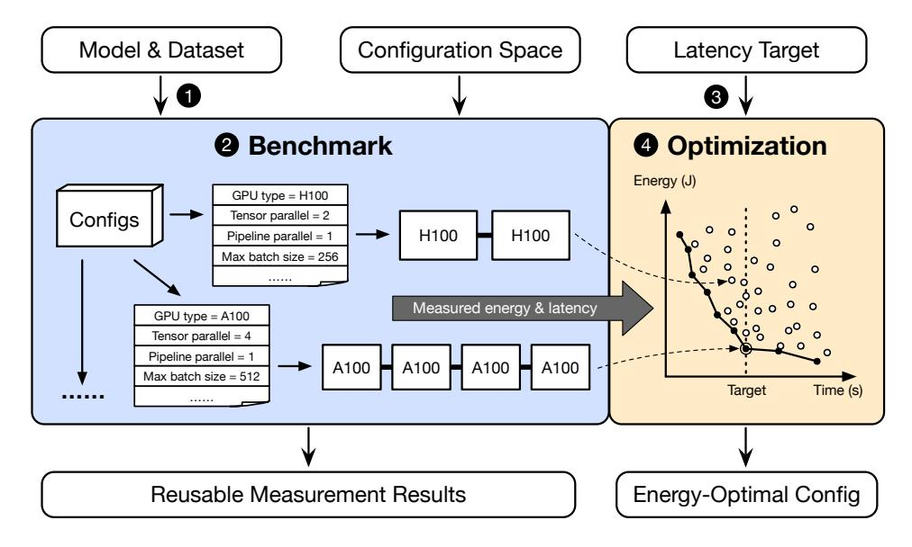

**Figure Description:**
The image is a flowchart that outlines a process for configuring an energy-efficient system with various components such as Model & Dataset, Configuration Space, Latency Target, Benchmark, Optimization, Measured Energy & Latency, Reusable Measurement Results, Energy-Optimal Config, and Energy-Optimized Config.

The chart begins at the top left corner with "Model & Dataset," which includes two boxes labeled "GPU type = H100" and "Tensors parallel = 2." These likely refer to hardware specifications and data processing configurations. From there, arrows point towards "Configuration Space," indicating the next step in the configuration process.

In the center of the chart, there's a box titled "Benchmark," connected by an arrow to "Energy (J)" and "Latency (Time^(s))". This suggests that the benchmark involves measuring both energy consumption and latency time. An arrow from "Benchmark" leads to "Measurement Energy & Latency," where measurements are taken. Another arrow points from here to "Reusable Measurement Results," implying that these results can be reused or compared across different stages of optimization.

On the right side of the chart, there's a section titled "Optimization," showing a diagram with a target labeled "H100." Below it, there's another label "A100" followed by a series of numbers: "4", "68", "100", "A100," and "A100." These could represent iterative steps or parameters within the optimization process.

Further down, we see "Energy-Optimal Config" and "Energy-Optimized Config," suggesting that the optimized configurations have been identified based on measured energy and latency.

Overall, the chart appears to illustrate a methodology for optimizing the performance of a computational model using GPU resources while minimizing energy consumption and latency. It emphasizes the importance of measurement and iteration in achieving optimal configurations.

Figure 1: Overview of the benchmarking and optimization flow of the ML.ENERGY Benchmark.

generative AI model architectures across a wide range of tasks – including Large Language Model (LLM) chat and coding, Vision–Language Model (VLM) visual chat, and text-to-image, text-to-video, and image-to-video generation using Diffusion models – and (2) more up-to-date hardware and software stacks following rapid advancements in each area.

In this paper, we share the design principles we have established over time (Section [2\)](#page-1-0) and present the ML.ENERGY Benchmark that embodies them (Section [3\)](#page-3-0). It provides two key functionalities:

- Extensible benchmark: It provides an easily extensible benchmark suite and a comprehensive set of tools for measuring the inference energy consumption of generative AI models for various tasks under *realistic* deployment environments.
- Automated optimization: Based on energy measurement results, it provides automated energy optimization recommendations for generative AI model deployment.

Finally, we highlight notable results from the early 2025 iteration of the ML.ENERGY Leaderboard, shedding light on (1) how energy consumption varies across different generative AI models and tasks, (2) the complex trade-offs that involve energy, time, and model architecture design, and (3) the energy savings opportunity unlocked by automated optimization (Section [4\)](#page-5-0).

This paper describes the state of the ML.ENERGY Benchmark and Leaderboard as of *early 2025*. The latest version of the ML.ENERGY Benchmark is open-source on GitHub,[2](#page-1-1) and the ML.ENERGY Leaderboard allows everyone to browse full results from the latest ML.ENERGY Benchmark.

# 2 Design Principles

The design of the ML.ENERGY Benchmark is guided by four core principles. Our overarching goal is to create a benchmark that is representative of real-world generative AI service deployments, and to produce energy measurement results that are accurate, reusable, and ultimately actionable.

### 2.1 Generalizability and Portability

Goal. Every computer system is configured with different hardware and software components, and measurements from a particular system will never truly represent those from another system. For instance, systems can be configured with different CPU and DRAM models, and running different Linux kernel versions with different daemons running in the background. Further, not all users have

<https://github.com/ml-energy/benchmark>

physical access to the target system hardware, a common case for cloud-based environments. Still, we wanted (1) the benchmark to run seamlessly on a wide variety of systems, and (2) measurement results to provide generalizable insights and recommendations across a wide range of systems.

Our approach. We focus on software-based GPU energy measurement for the following reasons:

- GPUs are the dominant worker and energy consumer in a system running ML services, accounting for 50–70% of the total provisioned power in the datacenter [\[52–](#page-12-7)[54,](#page-12-8) [58\]](#page-12-6).
- Compared to other hardware components, GPU models are more standardized across different systems [\[13\]](#page-10-5), making measurements useful across systems that use the same GPU.
- GPUs allow accurate software-based energy measurement [\[1,](#page-10-6) [2,](#page-10-7) [11,](#page-10-8) [81\]](#page-14-0), allowing measurement tools to be portable across systems without requiring physical hardware access or modification.

### 2.2 Representing Real-World Deployments

Goal. Benchmarking results often inform real-world deployment optimizations, are used to plan future power capacity and energy usage, affect the design of new hardware and software systems, and serve as base numbers for long term projections that affect policymaking. Therefore, it is crucial that our measurements represent those from real-world deployments as closely as possible.

Our approach. To obtain realistic measurements, we adhere to the following principles:

- We adopt production-grade software and hardware (e.g., vLLM [\[39\]](#page-12-9) on NVIDIA H100 GPUs) and run them with generation request workloads that are representative of real-world use cases.
- During our measurement, we directly run or closely mimic the state of a serving system during long term deployment. This allows us to capture the *steady state* energy consumption of the service while using a fixed-size benchmarking dataset.

### 2.3 Energy Measurement at the Right Granularity

Goal. Energy can be measured at different computation granularities. For instance, for LLM text generation, energy can be reported for the end-to-end benchmarking run, for each generated response, or for each token generated. Our goal is to measure and report energy consumption at a granularity that is neither too coarse (as it only provides limited insight into the runtime behavior of the service) nor too fine (as it may miss important higher-level insights relevant to the service).

Our approach. Also aligned with our goal of representing real-world deployments (Section [2.2\)](#page-2-0), our approach is to mainly report energy consumption at the granularity of a single, whole generation response to a request (e.g., entire chat response, image, video). This is because any work less than the full response (e.g., per token) is not considered a complete request, and may ignore model- and task-specific characteristics. For instance, for LLM text generation, different models exhibit different *verbosity* (i.e., given the same prompt, different models respond with varying number of tokens), and different tasks have vastly different output token length distributions (e.g., chat vs. code generation), all of which we want to capture in our measurements.

# 2.4 Actionable Measurement Results

Goal. While energy measurements are useful in themselves, they are even more useful when they lead to actionable insights and recommendations. For instance, how much is the potential energy savings of your model without sacrificing accuracy or latency? If your service intends to guarantee a specific generation latency deadline (e.g., 50 ms), what is the energy-optimal configuration, and how much is the potential energy savings?

Our approach. The ML.ENERGY Benchmark allows users to provide computation latency constraints specific to their application scenario (e.g., LLM average Time Per Output Token), and will automatically recommend (1) the *energy-optimal* configuration that meets the latency constraints, and (2) the expected amount of energy savings. Due to the generalizability of our measurements (Section [2.1\)](#page-1-2), these recommendations inform the optimization of a wide range of systems.

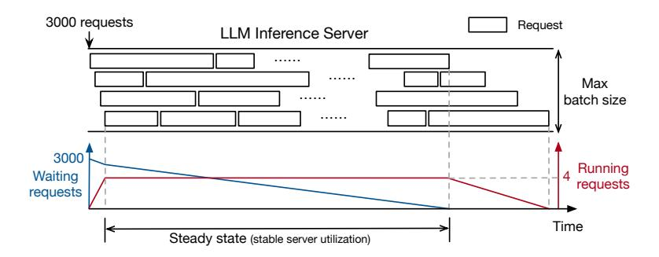

**Figure Description:**
The image is a flowchart or diagram that outlines the architecture of an LML (Likely referring to Language Model Library) Inference Server. It illustrates how requests are processed by the server. Here's a detailed description:

- At the top left corner, there is a label "3000 requests" with two arrows pointing downwards towards the next section. This suggests that the server can handle up to 3000 concurrent requests at once.

- Below this, there is another label "LLM Inference Server," indicating that this system is designed for handling language model inferences.

- To the right of these labels, there is a vertical dashed line labeled "Request." This likely represents where incoming requests begin their processing journey within the server.

- Directly below the request label, there is a horizontal dashed line labeled "Max batch size." This indicates that each request can be broken into smaller batches, which might help manage computational resources more efficiently.

- On the right side of the diagram, there is a red arrow pointing from the "Max batch size" label to a point just above the bottom edge of the diagram. A blue arrow points from the same label to a point slightly higher than the first one but still near the bottom edge. These arrows seem to indicate different paths through the system based on the number of requests being handled.

- There is also a note stating "Running requests," suggesting that some requests may take longer to process due to resource constraints.

- Finally, at the very bottom of the diagram, there is a label "Time" followed by a numerical value "4 Running requests." This could imply that currently, four requests are waiting to be processed by the server.

The overall layout of the diagram appears to be a simplified representation of how the server processes multiple requests simultaneously while managing its capacity effectively. The use of arrows and lines helps visually depict the workflow and decision points within the system.

Figure 2: LLM inference server and per-request energy accounting. The steady state is defined as the period when batch size is saturated at the server's maximum configured batch size, and measurements during the steady state represent that of a serving system during long-term deployment.

# 3 The ML.ENERGY Benchmark

The ML.ENERGY Benchmark is a comprehensive tool for measuring and optimizing the inference energy consumption of generative AI models, built upon our core design principles (Section [2\)](#page-1-0). Here, we describe the overall flow of the ML.ENERGY Benchmark (Section [3.1\)](#page-3-1), which includes service-aware energy measurement and accounting (Section [3.2\)](#page-3-2) and automated optimization recommendations (Section [3.3\)](#page-4-0). Finally, we describe extension points of the ML.ENERGY Benchmark that allows users to easily benchmark their customized application scenarios (Section [3.4\)](#page-4-1).

### 3.1 Benchmark Flow

Figure [1](#page-1-3) provides an overview of the usage flow of the ML.ENERGY Benchmark. 1 First, the generative model to benchmark and the request dataset (set of inputs) to use are selected, alongside with the set of configurations to sweep (e.g., GPU model, parallelism configuration, maximum batch size). 2 Then the ML.ENERGY Benchmark runs configurations independently on designated hardware, and measures the time and energy consumption of each configuration using Zeus [\[2\]](#page-10-7), a library that provides programmatic energy measurement (Section [3.2\)](#page-3-2). 3 After benchmarking is complete, users can specify a latency target based on their application requirements. 4 Given that, the ML.ENERGY Benchmark constructs the time–energy Pareto frontier, and recommends the energy-optimal configuration while satisfying the latency target (Section [3.3\)](#page-4-0).

### 3.2 Energy Measurement and Service-Aware Energy Accounting

Our goal is to provide per-request energy measurements (Section [2.3\)](#page-2-1) that are representative of real-world deployments (Section [2.2\)](#page-2-0). However, a realistic serving system batches together the generation of multiple requests (e.g., iteration-level batching [\[82\]](#page-14-1) for LLM text generation), making the energy consumption of a single request dependent on all other requests being processed at the same time. Therefore, we implement measurement and energy accounting methods that capture the batching behavior of different types of models.

Diffusion models. We begin with the relatively more straightforward case of diffusion models, which are used for text-to-image, text-to-video, and image-to-video generation. Diffusion models are typically batched as a whole, meaning that the energy consumption of a single request is:

$$Energy_{request} = \frac{Energy_{batch}}{B}$$
 (1)

where the batch consists of B image or video generation requests.

LLM text generation. Request-level energy accounting is less straightforward for LLM inference, because iteration-level batching [\[82\]](#page-14-1) is an essential optimization in any realistic, production-grade LLM serving system [\[39\]](#page-12-9). Figure [2](#page-3-3) shows how requests are served by a serving system implementing iteration-level batching and how the ML.ENERGY Benchmark performs energy accounting. Because

the beginning and end of each request are often not aligned with each other, finding each request's individual energy consumption is non-trivial. For this, we first submit all requests in the request dataset, and as the system runs, identify the *steady state* as the time period where the batch size is saturated at the server's maximum configured batch size. This steady state is designed to closely approximate the state of a serving system when it is well-utilized during long-term deployment. Particularly, when the system is ramping up initially with a full queue or ramping down at the end with an empty queue, the server runs with a smaller batch size and does not exhibit the same energy amortization benefits as the steady state. With this, we can derive the average per-request energy consumption with:

$$Energy_{request} = \frac{Energy_{steady}}{Tokens_{steady}} \times \frac{1}{N} \sum_{i} Tokens_{request,i}.$$
 (2)

In essence, we compute the average energy consumption per token during the steady state and multiply it by the average number of output tokens to derive the average per-request energy consumption. Individual requests' energy consumption can also be computed by multiplying the average energy per token during the steady state by the number of output tokens for each request.

As we will see in Section [4,](#page-5-0) batch size is a critical configuration that significantly affects both generation time and energy consumption. By sweeping the batch size configuration, the ML.ENERGY benchmark can capture varying levels of system utilization and collect various operation points with different time and energy consumption.

### 3.3 Automated Optimization Recommendation

Our goal is to provide actionable insights beyond just energy measurements (Section [2.4\)](#page-2-2) by recommending energy-optimal configurations for a given model and task. Central to the optimization recommendation is the construction of the *Pareto frontier* of energy vs. time, which is a collection of configurations where there are no other configurations that lead to both lower energy and lower time. Then, the energy-optimal configuration is selected based on user-specified latency constraints.

Latency constraints inherently depend on the user's or application's needs. For example, for image generation with Diffusion models, computation results are useful only when the full image is generated, so latency constraints would be specified in terms of the time to generate the whole image. On the other hand, for LLM text generation for chat, output tokens are *streamed* to users (either in written text or synthesized speech) as they are generated. As such, for user-facing conversational AI services, as long as the average time per output token is at least as fast as the users' reading or listening speed, user experience will not be affected [\[44\]](#page-12-10). However, for LLM text generation for coding, where code is likely only useful when it is fully generated, latency constraints would be specified in terms of the time to generate the whole snippet, similar to the case of image generation. Given the latency constraints, the time–energy Pareto frontier is used to suggest the minimum-energy configuration that satisfies the latency constraint.

### 3.4 Extending the Benchmark

The ML.ENERGY Benchmark is designed to be easily extensible, allowing users to benchmark their own models or customized application scenarios.

Model. The ML.ENERGY Benchmark already supports various popular architectures like Llama [\[73\]](#page-13-1), LLaVA [\[43\]](#page-12-11), Stable Diffusion [\[25\]](#page-11-3), and Stable Video Diffusion [\[14\]](#page-10-9) (See Appendix [A](#page-22-0) for a full list). Models that are fine-tuned based on already-supported models work as is. Models with different architectures should also work as is as long as they are supported by the underlying runtime, like vLLM [\[39\]](#page-12-9), which supports arbitrary LLMs provided by Hugging Face Transformers.

Request dataset. For each task (e.g., LLM text generation for chat), the ML.ENERGY Benchmark provides a default request dataset that contains a set of inputs representative of real-world usage (See Appendix [A](#page-22-0) for a full list). Users can also provide their own request dataset, which can be used to invoke the runtime and measure energy consumption.

Configuration space. The ML.ENERGY Benchmark provides a default set of configurations specific to tasks. For instance, for LLM text generation, it supports maximum batch sizes and parallelism configuration (e.g., tensor and pipeline parallelism). For diffusion models, it supports not only batch size, but also changing the number of denoising steps, as it has a non-trivial impact on time, energy, and output quality. Users can customize the range of values swept for each configuration, and also provide new configurations (e.g., GPU power limit [\[1,](#page-10-6) [81\]](#page-14-0)) as long as they implement the corresponding configuration interface in the top-level routine. More configuration dimensions and finer grained sweeps will lead to longer benchmarking time, but will also push the Pareto frontier towards the lower left corner of the time–energy space, leading to the discovery of more energy-efficient configurations.

Hardware. As long as the runtime used by the ML.ENERGY Benchmark (e.g., vLLM) is capable of running on the target hardware and Zeus [\[2\]](#page-10-7) can measure energy consumption on the target hardware (e.g., NVIDIA/AMD GPUs, Intel/AMD CPUs, Apple Silicon, NVIDIA Jetson platforms), the ML.ENERGY Benchmark can run on the target hardware as is.

Metrics. Energy is a fundamental physical quantity that can be used to derive other useful metrics, though these derived metrics are *not* automatically computed by default as they require contextspecific information. Below, we describe how these metrics might be computed based on the benchmark's outputs.

- Average power draw (Watts): Average power draw over the steady state can be calculated by dividing total energy consumption during the steady state by the duration of the steady state.
- Throughput per Watt: Work throughput, e.g., request or token generation throughput, divided by average power draw can describe how much *service capacity* can be extracted from the system given a power budget, which is a critical quantity for datacenter power planning [\[38\]](#page-11-0).
- Monetary cost (\$): The electricity cost of compute can be calculated by integrating over time the multiplication of energy consumption and the electricity price in the region and time instance. If there is a specific region and time frame the service is expected to run, choosing that electricity price can simulate the operational electricity cost of deployment. Electricity prices can be obtained from sources like OpenEI.[3](#page-5-1) Calculating the electricity cost from energy is supported by Zeus [\[2\]](#page-10-7), the measurement library of choice for the benchmark.
- Operational carbon emissions (gCO2e): This quantity *estimates* the greenhouse gas emissions associated with the electricity consumed. It can be calculated by multiplying energy consumption by the carbon intensity (gCO2e/kWh) of the particular region and time frame in which the benchmark was run. Carbon intensity data can be obtained from sources like ElectricityMaps.[4](#page-5-2) This is also supported by Zeus [\[2\]](#page-10-7), the energy measurement library employed by the benchmark.

# 4 Results Highlight

In this section, we highlight notable results from the ML.ENERGY Benchmark; the full set of results is available on the ML.ENERGY Leaderboard.[5](#page-5-3) The early 2025 iteration of the benchmark and leaderboard presents energy measurements across 40 models and 6 tasks (See Appendix [A](#page-22-0) for a full list). We ran the benchmark on NVIDIA A100 (40 GB) and H100 (80 GB) GPUs, each using AWS p4d.24xlarge and p5.48xlarge instances, respectively, and used vLLM [\[39\]](#page-12-9) and Diffusers [\[77\]](#page-13-2) as the inference runtime. In the following, we first present energy measurement results and discuss implications (Section [4.1\)](#page-5-4), and then provide deeper understanding by showing how model architecture choices affect their energy consumption (Section [4.2\)](#page-6-0). Then, we present the energy savings opportunities from our automated optimization recommendations (Section [4.3\)](#page-8-0).

### 4.1 Energy Measurements

Significant variation in energy consumption. The solid bars in Figure [3](#page-6-1) (A100 GPUs in Figure [3a](#page-6-1) and H100 in Figure [3b\)](#page-6-1) show the per-request energy consumption of various generative AI models across different tasks. First, energy consumption varies widely across models. In particular, Diffusion models generally consume energy that is on par with larger LLMs (e.g., Mistral Large (123B)). This

3 [https://openei.org/wiki/Utility\\_Rate\\_Database](https://openei.org/wiki/Utility_Rate_Database)

4 <https://electricitymaps.com/>

5 <https://ml.energy/leaderboard>

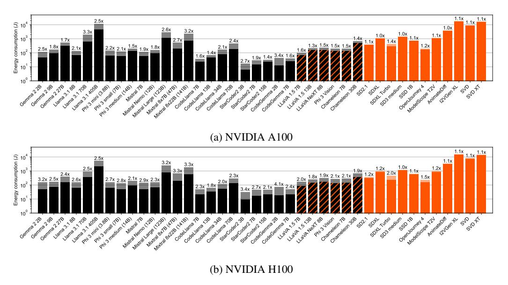

**Figure Description:**
The image is a bar chart that compares two different versions of NVIDIA GPUs: A100 and H100. Each GPU version has multiple bars representing various performance metrics such as Energy (in Joules), Compute Capability (denoted by CUDA Cores), Memory Bandwidth (MB/s), Tensor Core Operations per second (Ops/sec), and Integer Operations per second (Int Ops/sec).

For both GPU types, there are three energy consumption bars corresponding to their respective compute capabilities: CUDA Cores v3.5, v7.0, and v8.2. These bars show the amount of energy consumed for each operation within these compute capabilities. For example, under the "Energy" metric, the first bar represents the energy used during operations with CUDA Cores v3.5, while the subsequent bars correspond to v7.0 and v8.2 respectively.

The chart also includes numerical data points next to each bar, indicating specific measurements or averages related to the performance metrics mentioned above. This data provides more detailed information about how each GPU performs across different compute capabilities.

In summary, the chart serves as a comparison tool between the NVIDIA A100 and H100 GPUs, highlighting differences in energy efficiency, computational power, memory bandwidth, tensor core operations, and integer operations based on the GPU's compute capability.

Figure 3: Per-request energy consumption across various generative AI models. Black and orange represents text and vision modalities, respectively. Solid bars are energy measurements, whereas dimmed bars behind each solid bar are estimations based on the GPU's TDP, with numbers showing the ratio of overestimation. Note the log scale Y-axis.

| Model                                | TP | Max batch size |         |         |         |         |  |  |
|--------------------------------------|----|----------------|---------|---------|---------|---------|--|--|
| Wiodei                               | IF | 4              | 8       | 16      | 32      | 64      |  |  |
| DeepSeek distilled Qwen 3 8B [23,80] | 1  | 9713.7         | 6010.1  | 4314.9  | 3340.8  | 2770.8  |  |  |
| Phi 4 reasoning plus 15B [3]         | 1  | 19974.4        | 12389.6 | 9347.3  | 7634.9  | 7595.4  |  |  |
| Qwen 3 32B [80]                      | 2  | 26419.7        | 15168.3 | 9140.5  | 6165.5  | 4520.6  |  |  |
| Qwen 3 235B-A22B thinking [80]       | 8  | 122523.1       | 86491.5 | 56720.4 | 40275.5 | 33096.4 |  |  |

Table 1: Energy per generation of reasoning models on GPQA [64] and NVIDIA H100 GPUs. TP is the tensor parallelism degree, which is also equal to the number of GPUs used.

is mainly because Diffusion models (1) draw higher power in general (more in Section 4.2) and (2) cannot perform as many concurrent generations compared to LLMs due to their long latency in real services, preventing them from amortizing energy consumption across many generations.

**Importance of measuring.** The dimmed bars behind each solid bar in Figure 3 show the estimated energy consumption based on the GPU's Thermal Design Power (TDP) instead of measuring the real GPU power consumption, which is a common practice [8,9,28,40,47,74]. Estimations using TDP are nearly always an overestimation since it is rare for a GPU – or any computing device – to draw its maximum power at every moment in time. In fact, such an estimation can lead to a worst-case overestimation of energy consumption by a factor of 4.1 (CodeGemma 2B on H100 GPUs). Inaccuracies may be overlooked when they influence downstream decisions and projections, leading to misleading conclusions. Accurate measurements that reflect production environments are crucial.

### 4.2 Energy Implications of ML Design Decisions

ML decisions reflected in model architectures and trained models impact energy consumption. For the interest of space, we defer systems implications on energy consumption to Appendix B.

**LLM response verbosity and energy.** In Figure 3, we can see that energy consumption varies even among LLMs of similar sizes. This is because different LLMs generate responses of different *length* even when given the same prompt. Such differences in *verbosity* can be non-trivial; for instance, Mistral Large's responses were on average 36% longer than that of Mixtral  $8\times7B$ . As the number of

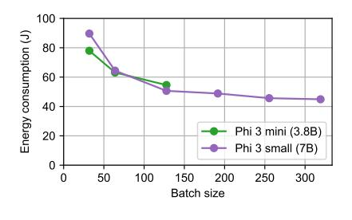

**Figure Description:**
The image is a graph with two lines representing different data sets. On the x-axis, there are numerical labels ranging from "0" to "300," which likely indicate batch sizes. Each label corresponds to an increment of 150 units. The y-axis has numerical values ranging from "0" to "80." These numbers could be indicative of energy consumption or another quantitative measure for each batch size.

The line labeled "Phi 3 mini (3.8B)" shows a decreasing trend as the batch size increases. It starts at around 60 and drops sharply before leveling off towards the end of the scale where it reaches just above 20. This suggests that as the batch size grows larger, the value associated with the line decreases until it stabilizes at a lower number.

The second line, labeled "Phi 3 small (7B)," also exhibits a downward trend but does not reach such low levels as the first line. Instead, it begins near 40 and declines steadily, ending slightly below 20 when the batch size approaches 300.

There's a legend indicating that the green dots correspond to Phi 3 mini (3.8B) and the purple dots represent Phi 3 small (7B). Additionally, there's a note stating "Energy consumption (kWh/batch size)," suggesting that these graphs are tracking some form of energy usage related to batches of a certain type or process.

Overall, the graph appears to show a relationship between batch size and energy consumption, with both lines demonstrating a decrease in energy use as the batch size increases. However, without additional context, it's difficult to determine the exact nature of the experiment or study being represented by the graph.

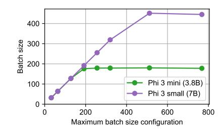

**Figure Description:**
The image is a graph with two lines representing different configurations of batch size for machine learning models. On the x-axis, there are numerical values ranging from 0 to 800, which likely correspond to maximum batch size configuration. Each line represents a different model or configuration: one labeled "Phi 3 mini (3.8B)" and another labeled "Phi 3 small (7B)." These labels suggest that these lines represent performance metrics for two versions of the Phi 3 model, where "(3.8B)" indicates a larger batch size configuration than "(7B)," possibly indicating more data processed at once during training.

On the y-axis, there are numerical values ranging from 200 to 400, which could be interpreted as some measure of accuracy or loss function value. This suggests that the graph is plotting the relationship between batch size configuration and the resulting metric, such as accuracy or loss.

The purple dots along the "Phi 3 mini (3.8B)" line indicate specific points on the curve corresponding to the smaller batch size configuration. Similarly, the green dots along the "Phi 3 small (7B)" line show corresponding points for the larger batch size configuration. Both lines increase steadily upwards, suggesting an improvement in the measured metric as the batch size increases. However, without additional context, it's not possible to determine exactly what the metric being plotted represents.

- (a) Energy vs. Batch Size
- (b) Batch Size vs. Max Batch Size config

Figure 4: Phi-3 Mini and Small [26] benchmarked with the chat task on one NVIDIA A100 GPU.

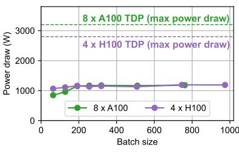

**Figure Description:**
The image is a graph with numerical data points plotted against two axes: one for power draw (W) and another for batch size. On the x-axis, there are four distinct batches labeled as "8xA100," "4xH100," "4xH100," and "100." Each of these labels corresponds to a different color line representing the power draw at each point along the x-axis.

The y-axis represents power draw in watts (W), ranging from 3000 W at the bottom to 2000 W at the top. Along the y-axis, there are three horizontal lines indicating specific thresholds or conditions related to the power draw: "8xA100," "4xH100," and "4xH100." These lines correspond to the same batch sizes mentioned above but do not have corresponding colors in the legend provided by the graph.

On the right side of the graph, there's an additional label "8xA100 TDP (max power draw)" which seems to indicate that the maximum theoretical power draw (TDP) for the "8xA100" batch is also represented by the green dashed line extending upwards from the first data point. This suggests that the graph might be comparing actual measured power draws with theoretical maximum limits.

In summary, the graph appears to compare the actual power draw during processing across different batch sizes while considering both the number of iterations ("8xA100") and the hardware configuration ("4xH100"). It includes a comparison between measured power draw and theoretical maximum power draw for the "8xA100" batch.

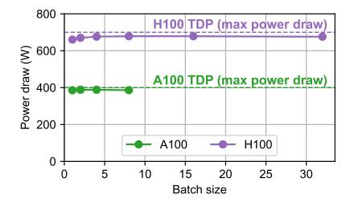

**Figure Description:**
The image is a graph with two lines representing different data sets plotted against a horizontal axis labeled "Batch size." On the left side of the graph, there's an abbreviation "H100 TDP (max power draw)" indicating that the line represents the thermal design point for H100 at maximum power draw. This line shows fluctuations between approximately 600 W to just over 800 W as the batch size increases from 5 to 30.

On the right side of the graph, another line reads "A100 TDP (max power draw)," which suggests it represents the same metric but for A100. This line also fluctuates within a similar range of around 400 to 600 W across the batch sizes.

Below each line are two dots connected by dashed lines: one green dot marked "A100," and one purple dot marked "H100." These likely indicate specific points or conditions being compared between the two models or configurations represented by the lines above them.

The vertical axis on the left indicates "Power (W)" ranging from 200 to 800 W, while the vertical axis on the right ranges from 200 to 700 W. Both axes have numerical increments corresponding to their respective scales. There are no visible texts providing additional context about the data or the devices being measured. The style of the graph appears to be a simple scatter plot commonly used in technical documentation or presentations to compare performance metrics under varying conditions.

- (a) Llama 3.1 70B [73]
- (b) Stable Diffusion 3 Medium [25]

Figure 5: Power consumption of Llama 3.1 70B and Stable Diffusion 3 Medium models.

output tokens equals the number of forward passes through the model, longer responses leads to a proportional increase in energy consumption. As humans are known to prefer longer responses [85], this potentially introduces a trade-off between energy consumption and user satisfaction.

This is even more pronounced for reasoning models, which produce significantly more output tokens. Table 1 shows energy measurements for reasoning models on the GPQA dataset. Reasoning models produce one to two orders of magnitude more output tokens per request compared to standard chat models, significantly increasing energy consumption per generation. Additionally, due to their long output lengths, servers cannot run as large a batch size, preventing them from amortizing energy across more requests. This leads to higher energy per token as well, further increasing energy consumption. As long horizon reasoning and task decomposition become more common in real-world LLM-based applications, we expect this trend to continue.

Memory consumption of operations and energy amortization. Generally, models with more parameters consume more energy, but this is not always the case. Figure 4 highlights the case of Phi-3 Mini (3.8B) and Small (7B) [26]. Even though Small has nearly twice the parameters, the left plot shows that the larger Small model can consume less energy than Mini as batch size grows. This happens because Mini uses Multi-Head Attention (MHA) [76], whereas Small uses Grouped Query Attention (GQA) [10]. Due to this, Mini's KV cache uses  $3\times$  more memory than Small, which prevents it from scaling to larger batch sizes and amortizing energy consumption across more generations.

Compute-intensity of operations and power draw. Figure 5 shows the power consumption of Llama 3.1 70B [73] and Stable Diffusion 3 Medium [25] on A100 and H100 GPUs. It can be seen that the LLM's power consumption is much lower than what the GPUs can draw at maximum, whereas the Diffusion model's power consumption is close to the maximum. This is because LLM decoding is characterized by *low compute-intensity*, meaning that the number of arithmetic operations (e.g., multiplication and addition) per byte of memory loaded is low [37, 58]. This leads to the GPU's computation throughput being bottlenecked by VRAM bandwidth and results in the GPU's computation units being underutilized, leading to low power draw. Appendix C dives deeper into power consumption with measurements for all models and GPU power breakdowns over time.

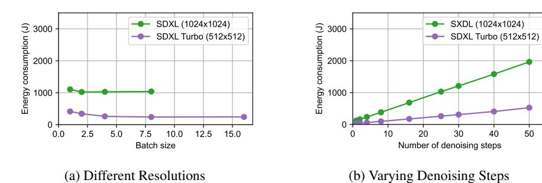

**Figure Description:**
The image is a graphical representation of two different algorithms or methods for resolving energy consumption issues: "Different Resolutions" (a) and "(b) Varying Denoising Steps". Both graphs are plotted with x-axis representing batch size and y-axis representing energy consumption in joules per second.

In part (a), there are three lines corresponding to three different conditions labeled as SSDL(1024x1004), SDXL Turbo (512x512), and Energy Consumption (2000). Each line represents a different level of energy consumption at various batch sizes ranging from 0 to 7.5. There's also a label indicating that each point on the graph corresponds to a number of denoising steps. However, without specific numerical data provided, it's not possible to determine the exact values associated with these points.

Part (b) shows similar information but includes only one line labeled as "(b) Varying Denoising Steps", which again has a range of batch sizes from 0 to 7.5. This line seems to follow a trend where energy consumption decreases initially with increasing batch size, then increases sharply after reaching approximately 3.5 batches. At the highest batch size shown, the energy consumption reaches its peak value before declining slightly towards the end of the graph.

The overall style of the image suggests it might be from an academic paper or presentation related to machine learning model optimization and energy efficiency considerations.

Figure 6: Energy consumption of SDXL [\[61\]](#page-13-6) and SDXL Turbo [\[7\]](#page-10-14) on one NVIDIA A100 GPU.

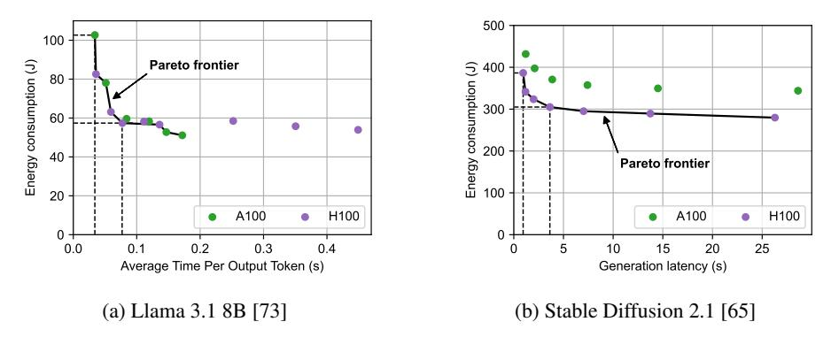

**Figure Description:**
The image displays two graphs with a title "Energy consumption (kW)" at the top left corner. Both graphs are line plots showing energy consumption over time, measured in kilowatts per output token (kW/token). Each graph has three lines representing different scenarios: Pareto frontier, Energy consumption, and Parato frontier. There is also an additional line labeled "A100," which seems to be a specific scenario or model within the context of these graphs.

The x-axis represents average time per output token (s), ranging from approximately 0 seconds to about 25 seconds. The y-axis shows energy consumption in kW, varying between -80 kW and 400 kW.

On both graphs, there are dotted horizontal lines indicating thresholds for energy consumption. These lines are marked as "H100" and "H100," suggesting that they might represent certain performance metrics or benchmarks related to the models being compared.

In the bottom right corner, there's a note "(b) Stable Diffusion 2.1 (65)" which likely refers to a particular version or configuration of a machine learning model named "Stable Diffusion." This could indicate that the data points shown in the graphs correspond to this model.

Overall, the image appears to compare the energy efficiency of various models or configurations across different levels of computational speed, represented by the average time per output token. It provides insights into how changes in processing speed affect energy consumption in artificial intelligence systems.

Figure 7: Time–energy Pareto frontiers constructed by the ML.ENERGY Benchmark.

Inference-time parameters and energy. Figure [6](#page-8-1) shows the energy consumption of Stable Diffusion XL (SDXL) [\[61\]](#page-13-6) and SDXL Turbo [\[7\]](#page-10-14). On the left, while SDXL and SDXL Turbo have identical model sizes and architectures, their energy consumption is significantly different. This is because SDXL Turbo is tuned to generate smaller resolution images (512×512) than SDXL (1024×1024), which leads to different latent sizes and amounts of computation. On the right, it can be seen that the number of denoising steps linearly increases energy consumption, as one denoising step requires one forward pass through the model. While simple in isolation, these inference-time parameters lead to non-trivial design tradeoffs at the application-level. For instance, increasing the number of denoising steps may improve final image quality, but beyond some point, it may be virtually indistinguishable to human users. Also, generating images in lower resolution and then upscaling them with a separate super-resolution model (e.g., DAT [\[19\]](#page-10-15)) may consume less energy end-to-end.

### 4.3 Automated Energy Optimization Recommendation

Figure [7](#page-8-2) shows the time–energy Pareto frontier constructed by the ML.ENERGY Benchmark measurement results for Llama 3.1 8B and Stable Diffusion 2.1. In general, the Pareto frontier is convex, meaning that by sacrificing some latency, one can achieve significant energy savings.

Conversational AI services like LLM-based chatbots achieve interactivity by streaming tokens to users either in written text or synthesized speech, making Time Per Output Token (TPOT) an important performance metric that impacts user experience [\[44\]](#page-12-10). In this context, a chatbot provider can target an average TPOT of 100 ms (equivalent to 10 tokens per second or about 7.5 words per second [\[55\]](#page-12-14)), which is sufficient for most reading or listening speeds. This will land on the Pareto frontier at the point where average TPOT is 77 ms, reducing energy consumption per generation by 44% compared to the configuration that simply minimizes latency.

Here, we note that for Llama 3.1 8B [\[73\]](#page-13-1), the Pareto frontier is a mixture of configurations from both A100 and H100 GPUs. This is because LLM decoding does not fully exert the GPU's compute units and are rather bound by memory, so going from A100 to H100 GPUs neither provides significantly higher performance nor significantly increases power draw (See Appendix [C](#page-25-0) for details). These two – power and time – multiplied, energy consumption is comparable across the two GPUs.

On the other hand, for Stable Diffusion 2.1 [\[65\]](#page-13-7), the Pareto frontier is dominated by configurations on the H100 GPU. Diffusion models consume power close to the GPU's TDP (See Appendix [C](#page-25-0) for details), which increases power draw significantly when going from A100 to H100. However, since computation latency was reduced even more, configurations on H100 Pareto-dominate those on A100. If an application has a generation latency target of, for instance, 5 seconds, the energy-optimal configuration will lie on the Pareto frontier where latency is 3.63 seconds, which is 21% less energy than the configuration that minimizes latency.

# 5 Related Work

ML energy measurement. The Hugging Face LLM-Perf leaderboard [\[33\]](#page-11-8) is specific to LLMs and reports the *per-token* energy consumption of LLM text generation, which fails to capture the verbosity and task-specific output token length distribution difference of LLMs (Section [2.3\)](#page-2-1). MLPerf Power [\[75\]](#page-13-8) provides measurements for ML training and inference, but crucially, requires direct access to the system under test to physically install the power analyzer, which significantly limits who can run the benchmarks (Section [2.1\)](#page-1-2). Furthermore, it benchmarks at most a few model architectures for each task (sometimes only one), failing to provide insights on how ML design choices impact energy consumption. The Hugging Face AI Energy Score leaderboard [\[27\]](#page-11-9) provides measurement data for broader AI tasks. However, it fixes the inference batch size to 1 for all models, failing to reflect how services are deployed in the real world and thus their energy consumption (Section [2.2\)](#page-2-0). Google disclosed the median energy consumption of their AI service [\[24\]](#page-11-10). It provides a comprehensive scope of measurement, even including the energy consumption of idle machines provisioned for stable service operation. However, measurements and reports are based on internal Google systems, workloads, hardware (TPUs), and model (Gemini) that are not publicly available, limiting the generalizability and reproducibility of the results (Section [2.1\)](#page-1-2). The ML.ENERGY Benchmark is the first inference energy benchmark for modern generative AI models, and empowers users to not only measure but also optimize the energy consumption of their models. See Appendix [D](#page-27-0) for more details.

ML energy optimization. The ML.ENERGY Benchmark provides automated energy optimization recommendations based on energy measurements (Section [3.3\)](#page-4-0). There are several other efforts that also provided automated energy optimizations – while preserving mathematical equivalence and/or model quality – for ML training and inference. Zeus [\[81\]](#page-14-0), EnvPipe [\[20\]](#page-10-16), and Perseus [\[21\]](#page-11-11) optimizes the energy consumption of ML training by adjusting GPU-level and training job-level configurations, either statically after profiling or dynamically during training. µ-Serve [\[63\]](#page-13-9) and DynamoLLM [\[68\]](#page-13-10) are also similar, but optimize energy consumption for ML inference clusters. Optimization recommendations by the ML.ENERGY Benchmark are complementary to the techniques proposed by these works. Further, our results support the need for automated *cross-layer* energy optimizations that span all model, software, and hardware layers [\[22\]](#page-11-12), as opposed to efforts siloed within a single layer.

# 6 Conclusion

In this work, we described the ML.ENERGY Benchmark, a comprehensive energy benchmark for generative AI models that not only provides realistic energy measurements, but also automatically suggests energy-optimal configurations based on user- and app-specific performance constraints. Measurement results show that energy consumption is a metric that is impacted by design choices across the whole AI stack, including application, model, software, and hardware, demonstrating the importance of automated *cross-layer* energy optimizations instead of siloed optimizations within a single layer. We are confident that the ML.ENERGY Benchmark will democratize the art of measuring, understanding, and optimizing ML energy consumption for the community.

# Acknowledgments and Disclosure of Funding

We would like to thank Yunseok Jang and SymbioticLab members for helpful comments and suggestions on the paper. This work and its authors were in part supported by NSF grants CNS-2104243, CNS-2106184, and CNS-2450085, grants from VMware, the Mozilla Foundation, Cisco, Ford, and GitHub, and gifts from Salesforce and Google. Jae-Won Chung is additionally supported by the Kwanjeong Educational Foundation.

# References

- [1] NVIDIA Management Library (NVML). [https://developer.nvidia.com/](https://developer.nvidia.com/nvidia-management-library-nvml) [nvidia-management-library-nvml](https://developer.nvidia.com/nvidia-management-library-nvml).
- [2] Zeus: Deep learning energy measurement and optimization. [https://github.com/](https://github.com/ml-energy/zeus) [ml-energy/zeus](https://github.com/ml-energy/zeus).
- [3] Marah Abdin, Sahaj Agarwal, Ahmed Awadallah, Vidhisha Balachandran, Harkirat Behl, Lingjiao Chen, Gustavo de Rosa, Suriya Gunasekar, Mojan Javaheripi, Neel Joshi, Piero Kauffmann, Yash Lara, Caio César Teodoro Mendes, Arindam Mitra, Besmira Nushi, Dimitris Papailiopoulos, Olli Saarikivi, Shital Shah, Vaishnavi Shrivastava, Vibhav Vineet, Yue Wu, Safoora Yousefi, and Guoqing Zheng. Phi-4-reasoning technical report. *arXiv preprint arXiv:2504.21318*, 2025.
- [4] International Energy Agency. Electricity 2025, 2025.
- [5] Amey Agrawal, Nitin Kedia, Ashish Panwar, Jayashree Mohan, Nipun Kwatra, Bhargav Gulavani, Alexey Tumanov, and Ramachandran Ramjee. Taming Throughput-Latency tradeoff in LLM inference with Sarathi-Serve. In *OSDI*, 2024.
- [6] Character AI. Character ai. <https://character.ai>, 2023.
- [7] Stability AI. Introducing SDXL turbo: A real-time text-to-image generation model, 2023.
- [8] AI@Meta. Llama 3 model card. 2024.
- [9] AI@Meta. Llama 4 model card. 2024.
- [10] Joshua Ainslie, James Lee-Thorp, Michiel de Jong, Yury Zemlyanskiy, Federico Lebron, and Sumit Sanghai. GQA: Training generalized multi-query transformer models from multi-head checkpoints. *Proceedings of the 2023 Conference on Empirical Methods in Natural Language Processing*, 2023.
- [11] Yehia Arafa, Ammar ElWazir, Abdelrahman ElKanishy, Youssef Aly, Ayatelrahman Elsayed, Abdel-Hameed Badawy, Gopinath Chennupati, Stephan Eidenbenz, and Nandakishore Santhi. Verified instruction-level energy consumption measurement for NVIDIA GPUs. *Proceedings of the 17th ACM International Conference on Computing Frontiers*, 2020.
- [12] Jeff Bar. Amazon EC2 update – inf1 instances with AWS inferentia chips for high performance cost-effective inferencing, 2019.
- [13] Nathan Beniach and Air Street Capital. State of AI report compute index. [https://www.](https://www.stateof.ai/compute) [stateof.ai/compute](https://www.stateof.ai/compute).
- [14] Andreas Blattmann, Tim Dockhorn, Sumith Kulal, Daniel Mendelevitch, Maciej Kilian, Dominik Lorenz, Yam Levi, Zion English, Vikram Voleti, Adam Letts, Varun Jampani, and Robin Rombach. Stable video diffusion: Scaling latent video diffusion models to large datasets. *arXiv preprint arXiv:2311.15127*, 2023.
- [15] CBRE. Global data center trends 2023. [https://www.cbre.com/insights/reports/](https://www.cbre.com/insights/reports/global-data-center-trends-2023) [global-data-center-trends-2023](https://www.cbre.com/insights/reports/global-data-center-trends-2023), 2023.
- [16] CBRE. Global data center trends 2024. [https://www.cbre.com/insights/reports/](https://www.cbre.com/insights/reports/global-data-center-trends-2024) [global-data-center-trends-2024](https://www.cbre.com/insights/reports/global-data-center-trends-2024), 2024.
- [17] CBRE. Global data center trends 2025. [https://www.cbre.com/insights/reports/](https://www.cbre.com/insights/reports/global-data-center-trends-2025) [global-data-center-trends-2025](https://www.cbre.com/insights/reports/global-data-center-trends-2025), 2025.
- [18] Lin Chen, Xilin Wei, Jinsong Li, Xiaoyi Dong, Pan Zhang, Yuhang Zang, Zehui Chen, Haodong Duan, Bin Lin, Zhenyu Tang, Li Yuan, Yu Qiao, Dahua Lin, Feng Zhao, and Jiaqi Wang. Sharegpt4video: Improving video understanding and generation with better captions. *Advances in Neural Information Processing Systems Datasets and Benchmarks*, 2024.
- [19] Zheng Chen, Yulun Zhang, Jinjin Gu, Linghe Kong, Xiaokang Yang, and Fisher Yu. Dual aggregation transformer for image super-resolution. *Proceedings of the IEEE/CVF International Conference on Computer Vision (ICCV)*, 2023.
- [20] Sangjin Choi, Inhoe Koo, Jeongseob Ahn, Myeongjae Jeon, and Youngjin Kwon. EnvPipe: Performance-preserving DNN training framework for saving energy. *Proceedings of the 2023 USENIX Annual Technical Conference*, 2023.

- [21] Jae-Won Chung, Yile Gu, Insu Jang, Luoxi Meng, Nikhil Bansal, and Mosharaf Chowdhury. Reducing energy bloat in large model training. *Proceedings of the 30th ACM Symposium on Operating Systems Principles*, 2024.
- [22] Jae-Won Chung, Nishil Talati, and Mosharaf Chowdhury. Toward cross-layer energy optimizations in AI systems. *DOE ASCR Energy-Efficient Computing for Science Workshop*, 2024.
- [23] DeepSeek-AI. DeepSeek-R1: Incentivizing reasoning capability in LLMs via reinforcement learning. *arXiv preprint arXiv:2501.12948*, 2025.
- [24] Cooper Elsworth, Keguo Huang, David Patterson, Ian Schneider, Robert Sedivy, Savannah Goodman, Ben Townsend, Parthasarathy Ranganathan, Jeff Dean, Amin Vahdat, Ben Gomes, and James Manyika. Measuring the environmental impact of delivering AI at google scale. *arXiv preprint arXiv:2508.15734*, 2025.
- [25] Patrick Esser, Sumith Kulal, Andreas Blattmann, Rahim Entezari, Jonas Müller, Harry Saini, Yam Levi, Dominik Lorenz, Axel Sauer, Frederic Boesel, Dustin Podell, Tim Dockhorn, Zion English, and Robin Rombach. Scaling rectified flow transformers for high-resolution image synthesis. In *ICML*, 2024.
- [26] Marah Abdin et al. Phi-3 technical report: A highly capable language model locally on your phone. *arXiv preprint arXiv:2404.14219*, 2024.
- [27] Hugging Face. Ai energy score. <https://huggingface.github.io/AIEnergyScore>, 2025.
- [28] Meta GenAI. Llama 2: Open foundation and fine-tuned chat models. *arXiv preprint*, 2023.
- [29] Yuwei Guo, Ceyuan Yang, Anyi Rao, Zhengyang Liang, Yaohui Wang, Yu Qiao, Maneesh Agrawala, Dahua Lin, and Bo Dai. AnimateDiff: Animate your personalized text-to-image diffusion models without specific tuning. In *ICLR*, 2024.
- [30] Yatharth Gupta, Vishnu V. Jaddipal, Harish Prabhala, Sayak Paul, and Patrick Von Platen. Progressive knowledge distillation of stable diffusion xl using layer level loss. *arXiv preprint arXiv:2401.02677*, 2024.
- [31] The White House. Fact sheet: President donald j. trump establishes the national energy dominance council, 2025.
- [32] HPCwire. AWS to offer NVIDIA's T4 GPUs for AI inferencing, 2019.
- [33] Régis Pierrard Ilyas Moutawwakil. LLM-Perf leaderboard. [https://huggingface.co/](https://huggingface.co/spaces/optimum/llm-perf-leaderboard) [spaces/optimum/llm-perf-leaderboard](https://huggingface.co/spaces/optimum/llm-perf-leaderboard), 2023.
- [34] Albert Q. Jiang, Alexandre Sablayrolles, Arthur Mensch, Chris Bamford, Devendra Singh Chaplot, Diego de las Casas, Florian Bressand, Gianna Lengyel, Guillaume Lample, Lucile Saulnier, Lélio Renard Lavaud, Marie-Anne Lachaux, Pierre Stock, Teven Le Scao, Thibaut Lavril, Thomas Wang, Timothée Lacroix, and William El Sayed. Mistral 7b. *arXiv preprint arXiv:2310.06825*, 2023.
- [35] Albert Q. Jiang, Alexandre Sablayrolles, Antoine Roux, Arthur Mensch, Blanche Savary, Chris Bamford, Devendra Singh Chaplot, Diego de las Casas, Emma Bou Hanna, Florian Bressand, Gianna Lengyel, Guillaume Bour, Guillaume Lample, Lélio Renard Lavaud, Lucile Saulnier, Marie-Anne Lachaux, Pierre Stock, Sandeep Subramanian, Sophia Yang, Szymon Antoniak, Teven Le Scao, Théophile Gervet, Thibaut Lavril, Thomas Wang, Timothée Lacroix, and William El Sayed. Mixtral of experts. *arXiv preprint arXiv:2401.04088*, 2024.
- [36] Heehoon Kim, Junyeol Ryu, and Jaejin Lee. TCCL: Discovering better communication paths for PCIe GPU clusters. *Proceedings of the 29th ACM International Conference on Architectural Support for Programming Languages and Operating Systems, Volume 3*, 2024.
- [37] Sehoon Kim, Coleman Hooper, Thanakul Wattanawong, Minwoo Kang, Ruohan Yan, Hasan Genc, Grace Dinh, Qijing Huang, Kurt Keutzer, Michael W. Mahoney, Sophia Shao, and Amir Gholami. Full stack optimization of transformer inference. *Architecture and System Support for Transformer Models*, 2023.
- [38] Helen Kou. Power for AI: Easier said than built. [https://about.bnef.com/insights/](https://about.bnef.com/insights/commodities/power-for-ai-easier-said-than-built/) [commodities/power-for-ai-easier-said-than-built/](https://about.bnef.com/insights/commodities/power-for-ai-easier-said-than-built/), 2025.

- [39] Woosuk Kwon, Zhuohan Li, Siyuan Zhuang, Ying Sheng, Lianmin Zheng, Cody Hao Yu, Joseph Gonzalez, Hao Zhang, and Ion Stoica. Efficient memory management for large language model serving with PagedAttention. *Proceedings of the 29th Symposium on Operating Systems Principles*, 2023.
- [40] Alexandre Lacoste, Alexandra Luccioni, Victor Schmidt, and Thomas Dandres. Quantifying the carbon emissions of machine learning. *arXiv preprint*, 2019.
- [41] Haotian Liu, Chunyuan Li, Yuheng Li, and Yong Jae Lee. Improved baselines with visual instruction tuning. In *CVPR*, 2024.
- [42] Haotian Liu, Chunyuan Li, Yuheng Li, Bo Li, Yuanhan Zhang, Sheng Shen, and Yong Jae Lee. LLaVA-NeXT: Improved reasoning, ocr, and world knowledge, 2024.
- [43] Haotian Liu, Chunyuan Li, Qingyang Wu, and Yong Jae Lee. Visual instruction tuning. *Advances in Neural Information Processing Systems*, 2023.
- [44] Jiachen Liu, Jae-Won Chung, Zhiyu Wu, Fan Lai, Myungjin Lee, and Mosharaf Chowdhury. Andes: Defining and enhancing quality-of-experience in LLM-based text streaming services. *arXiv preprint arXiv:2404.16283*, 2024.
- [45] Jiawei Liu, Chunqiu Steven Xia, Yuyao Wang, and Lingming Zhang. Is your code generated by chatGPT really correct? rigorous evaluation of large language models for code generation. In *NeurIPS*, 2023.
- [46] Anton Lozhkov, Raymond Li, Loubna Ben Allal, Federico Cassano, Joel Lamy-Poirier, Nouamane Tazi, Ao Tang, Dmytro Pykhtar, Jiawei Liu, Yuxiang Wei, et al. Starcoder 2 and the stack v2: The next generation. *arXiv preprint arXiv:2402.19173*, 2024.
- [47] Alexandra Sasha Luccioni, Sylvain Viguier, and Anne-Laure Ligozat. Estimating the carbon footprint of bloom, a 176b parameter language model. *Journal of Machine Learning Research*, 2024.
- [48] McKinsey & Company. Investing in the rising data center economy. [https:](https://www.mckinsey.com/industries/technology-media-and-telecommunications/our-insights/investing-in-the-rising-data-center-economy) [//www.mckinsey.com/industries/technology-media-and-telecommunications/](https://www.mckinsey.com/industries/technology-media-and-telecommunications/our-insights/investing-in-the-rising-data-center-economy) [our-insights/investing-in-the-rising-data-center-economy](https://www.mckinsey.com/industries/technology-media-and-telecommunications/our-insights/investing-in-the-rising-data-center-economy), 2023.
- [49] McKinsey & Company. How data centers and the energy sector can sate AI's hunger for power. [https://www.mckinsey.com/industries/private-capital/our-insights/](https://www.mckinsey.com/industries/private-capital/our-insights/how-data-centers-and-the-energy-sector-can-sate-ais-hunger-for-power) [how-data-centers-and-the-energy-sector-can-sate-ais-hunger-for-power](https://www.mckinsey.com/industries/private-capital/our-insights/how-data-centers-and-the-energy-sector-can-sate-ais-hunger-for-power), 2024.
- [50] Midjourney. Midjourney. <https://midjourney.com>, 2022.
- [51] Sebastian Moss. Meta's mark zuckerberg says energy constraints are holding back AI data center buildout, 2024.
- [52] NVIDIA. NVIDIA DGX A100 datasheet. [https://www.nvidia.com/content/dam/](https://www.nvidia.com/content/dam/en-zz/Solutions/Data-Center/nvidia-dgx-a100-datasheet.pdf) [en-zz/Solutions/Data-Center/nvidia-dgx-a100-datasheet.pdf](https://www.nvidia.com/content/dam/en-zz/Solutions/Data-Center/nvidia-dgx-a100-datasheet.pdf), 2020.
- [53] NVIDIA. NVIDIA DGX H200 datasheet. [https://resources.nvidia.com/](https://resources.nvidia.com/en-us-dgx-systems/dgx-h200-datasheet) [en-us-dgx-systems/dgx-h200-datasheet](https://resources.nvidia.com/en-us-dgx-systems/dgx-h200-datasheet), 2024.
- [54] NVIDIA. NVIDIA DGX B200 datasheet. [https://resources.nvidia.com/](https://resources.nvidia.com/en-us-dgx-systems/dgx-b200-datasheet) [en-us-dgx-systems/dgx-b200-datasheet](https://resources.nvidia.com/en-us-dgx-systems/dgx-b200-datasheet), 2025.
- [55] OpenAI. What are tokens and how to count them? [https://help.openai.com/en/](https://help.openai.com/en/articles/4936856-what-are-tokens-and-how-to-count-them) [articles/4936856-what-are-tokens-and-how-to-count-them](https://help.openai.com/en/articles/4936856-what-are-tokens-and-how-to-count-them).
- [56] OpenAI. ChatGPT. <https://chatgpt.com>, 2022.
- [57] OpenAI. Sora. <https://openai.com/index/sora>, 2024.
- [58] Pratyush Patel, Esha Choukse, Chaojie Zhang, Íñigo Goiri, Brijesh Warrier, Nithish Mahalingam, and Ricardo Bianchini. Characterizing power management opportunities for llms in the cloud. *ASPLOS*, 2024.
- [59] Pratyush Patel, Esha Choukse, Chaojie Zhang, Aashaka Shah, Íñigo Goiri, Saeed Maleki, and Ricardo Bianchini. Splitwise: Efficient generative llm inference using phase splitting. In *ISCA*, 2024.

- [60] David Patterson, Joseph Gonzalez, Quoc Le, Chen Liang, Lluis-Miquel Munguia, Daniel Rothchild, David So, Maud Texier, and Jeff Dean. Carbon emissions and large neural network training. *arXiv preprint*, 2021.
- [61] Dustin Podell, Zion English, Kyle Lacey, Andreas Blattmann, Tim Dockhorn, Jonas Müller, Joe Penna, and Robin Rombach. SDXL: Improving latent diffusion models for high-resolution image synthesis. In *ICLR*, 2024.
- [62] PromptHero. OpenJourney v4, 2023.
- [63] Haoran Qiu, Weichao Mao, Archit Patke, Shengkun Cui, Saurabh Jha, Chen Wang, Hubertus Franke, Zbigniew Kalbarczyk, Tamer Ba¸sar, and Ravishankar K. Iyer. Power-aware deep learning model serving with u-Serve. In *ATC*, 2024.
- [64] David Rein, Betty Li Hou, Asa Cooper Stickland, Jackson Petty, Richard Yuanzhe Pang, Julien Dirani, Julian Michael, and Samuel R. Bowman. GPQA: A graduate-level google-proof q&a benchmark. In *CoLM*, 2024.
- [65] Robin Rombach, Andreas Blattmann, Dominik Lorenz, Patrick Esser, and Bjorn Ommer. High-resolution image synthesis with latent diffusion models. In *CVPR*, 2022.
- [66] Baptiste Rozière, Jonas Gehring, Fabian Gloeckle, Sten Sootla, Itai Gat, Xiaoqing Ellen Tan, Yossi Adi, Jingyu Liu, Romain Sauvestre, Tal Remez, Jérémy Rapin, Artyom Kozhevnikov, Ivan Evtimov, Joanna Bitton, Manish Bhatt, Cristian Canton Ferrer, Aaron Grattafiori, Wenhan Xiong, Alexandre Défossez, Jade Copet, Faisal Azhar, Hugo Touvron, Louis Martin, Nicolas Usunier, Thomas Scialom, and Gabriel Synnaeve. Code llama: Open foundation models for code. *arXiv preprint arXiv:2308.12950*, 2024.
- [67] Mohammad Shoeybi, Mostofa Patwary, Raul Puri, Patrick LeGresley, Jared Casper, and Bryan Catanzaro. Megatron-LM: Training multi-billion parameter language models using model parallelism. *arXiv preprint*, 2019.
- [68] Jovan Stojkovic, Chaojie Zhang, Inigo Goiri, Josep Torrellas, and Esha Choukse. DynamoLLM: Designing llm inference clusters for performance and energy efficiency. In *HPCA*, 2025.
- [69] Chameleon Team. Chameleon: Mixed-modal early-fusion foundation models. *arXiv preprint arXiv:2405.09818*, 2024.
- [70] CodeGemma Team, Heri Zhao, Jeffrey Hui, Joshua Howland, Nam Nguyen, Siqi Zuo, Andrea Hu, Christopher A. Choquette-Choo, Jingyue Shen, Joe Kelley, Kshitij Bansal, Luke Vilnis, Mateo Wirth, Paul Michel, Peter Choy, Pratik Joshi, Ravin Kumar, Sarmad Hashmi, Shubham Agrawal, Zhitao Gong, Jane Fine, Tris Warkentin, Ale Jakse Hartman, Bin Ni, Kathy Korevec, Kelly Schaefer, and Scott Huffman. CodeGemma: Open code models based on gemma. *arXiv preprint arXiv:2406.11409*, 2024.
- [71] Gemma Team. Gemma 2: Improving open language models at a practical size. *arXiv preprint arXiv:2408.00118*, 2024.
- [72] ShareGPT Team. ShareGPT. <https://sharegpt.com/>.
- [73] Llama team at Meta. The llama 3 herd of models. *arXiv preprint arXiv:2407.21783*, 2024.
- [74] Hugo Touvron, Thibaut Lavril, Gautier Izacard, Xavier Martinet, Marie-Anne Lachaux, Timothée Lacroix, Baptiste Rozière, Naman Goyal, Eric Hambro, Faisal Azhar, et al. LLaMA: Open and efficient foundation language models. *arXiv preprint*, 2023.
- [75] Arya Tschand, Arun Tejusve Raghunath Rajan, Sachin Idgunji, Anirban Ghosh, Jeremy Holleman, Csaba Kiraly, Pawan Ambalkar, Ritika Borkar, Ramesh Chukka, Trevor Cockrell, Oliver Curtis, Grigori Fursin, Miro Hodak, Hiwot Kassa, Anton Lokhmotov, Dejan Miskovic, Yuechao Pan, Manu Prasad Manmathan, Liz Raymond, Tom St. John, Arjun Suresh, Rowan Taubitz, Sean Zhan, Scott Wasson, David Kanter, and Vijay Janapa Reddi. MLPerf power: Benchmarking the energy efficiency of machine learning systems from uWatts to MWatts for sustainable ai. In *HPCA*, 2025.
- [76] Ashish Vaswani, Noam Shazeer, Niki Parmar, Jakob Uszkoreit, Llion Jones, Aidan N. Gomez, Łukasz Kaiser, and Illia Polosukhin. Attention is all you need. *Advances in Neural Information Processing Systems*, 2017.
- [77] Patrick von Platen, Suraj Patil, Anton Lozhkov, Pedro Cuenca, Nathan Lambert, Kashif Rasul, Mishig Davaadorj, Dhruv Nair, Sayak Paul, Steven Liu, William Berman, Yiyi Xu, and Thomas

- Wolf. Diffusers: State-of-the-art diffusion models. [https://github.com/huggingface/](https://github.com/huggingface/diffusers) [diffusers](https://github.com/huggingface/diffusers).
- [78] Jiuniu Wang, Hangjie Yuan, Dayou Chen, Yingya Zhang, Xiang Wang, and Shiwei Zhang. ModelScope text-to-video technical report. *arXiv preprint arXiv:2308.06571*, 2023.
- [79] Yuxing Xiang, Xue Li, Kun Qian, Wenyuan Yu, Ennan Zhai, and Xin Jin. ServeGen: Workload characterization and generation of large language model serving in production. *arXiv preprint arXiv:2505.09999*, 2025.
- [80] An Yang, Anfeng Li, Baosong Yang, Beichen Zhang, Binyuan Hui, Bo Zheng, Bowen Yu, Chang Gao, Chengen Huang, Chenxu Lv, Chujie Zheng, Dayiheng Liu, Fan Zhou, Fei Huang, Feng Hu, Hao Ge, Haoran Wei, Huan Lin, Jialong Tang, Jian Yang, Jianhong Tu, Jianwei Zhang, Jianxin Yang, Jiaxi Yang, Jing Zhou, Jingren Zhou, Junyang Lin, Kai Dang, Keqin Bao, Kexin Yang, Le Yu, Lianghao Deng, Mei Li, Mingfeng Xue, Mingze Li, Pei Zhang, Peng Wang, Qin Zhu, Rui Men, Ruize Gao, Shixuan Liu, Shuang Luo, Tianhao Li, Tianyi Tang, Wenbiao Yin, Xingzhang Ren, Xinyu Wang, Xinyu Zhang, Xuancheng Ren, Yang Fan, Yang Su, Yichang Zhang, Yinger Zhang, Yu Wan, Yuqiong Liu, Zekun Wang, Zeyu Cui, Zhenru Zhang, Zhipeng Zhou, and Zihan Qiu. Qwen3 technical report. *arXiv preprint arXiv:2505.09388*, 2025.
- [81] Jie You, Jae-Won Chung, and Mosharaf Chowdhury. Zeus: Understanding and optimizing GPU energy consumption of DNN training. *NSDI*, 2023.
- [82] Gyeong-In Yu, Joo Seong Jeong, Geon-Woo Kim, Soojeong Kim, and Byung-Gon Chun. Orca: A distributed serving system for Transformer-Based generative models. In *OSDI*, 2022.
- [83] Jiahui Yu, Yuanzhong Xu, Jing Yu Koh, Thang Luong, Gunjan Baid, Zirui Wang, Vijay Vasudevan, Alexander Ku, Yinfei Yang, Burcu Karagol Ayan, Ben Hutchinson, Wei Han, Zarana Parekh, Xin Li, Han Zhang, Jason Baldridge, and Yonghui Wu. Scaling autoregressive models for content-rich text-to-image generation. *Transactions on Machine Learning Research*, 2022.
- [84] Shiwei Zhang, Jiayu Wang, Yingya Zhang, Kang Zhao, Hangjie Yuan, Zhiwu Qin, Xiang Wang, Deli Zhao, and Jingren Zhou. I2VGen-XL: High-quality image-to-video synthesis via cascaded diffusion models. *arXiv preprint arXiv:2311.04145*, 2023.
- [85] Lianmin Zheng, Wei-Lin Chiang, Ying Sheng, Siyuan Zhuang, Zhanghao Wu, Yonghao Zhuang, Zi Lin, Zhuohan Li, Dacheng Li, Eric P. Xing, Hao Zhang, Joseph E. Gonzalez, and Ion Stoica. Judging llm-as-a-judge with mt-bench and chatbot arena. In *NeurIPS*, 2023.
- [86] Yinmin Zhong, Shengyu Liu, Junda Chen, Jianbo Hu, Yibo Zhu, Xuanzhe Liu, Xin Jin, and Hao Zhang. DistServe: Disaggregating prefill and decoding for goodput-optimized large language model serving. In *OSDI*, 2024.

# NeurIPS Paper Checklist

### 1. Claims

Question: Do the main claims made in the abstract and introduction accurately reflect the paper's contributions and scope?

Answer: [Yes]

Justification: The abstract and introduction reflect the paper's contributions and scope.

Guidelines:

- The answer NA means that the abstract and introduction do not include the claims made in the paper.
- The abstract and/or introduction should clearly state the claims made, including the contributions made in the paper and important assumptions and limitations. A No or NA answer to this question will not be perceived well by the reviewers.
- The claims made should match theoretical and experimental results, and reflect how much the results can be expected to generalize to other settings.
- It is fine to include aspirational goals as motivation as long as it is clear that these goals are not attained by the paper.

### 2. Limitations

Question: Does the paper discuss the limitations of the work performed by the authors?

Answer: [Yes]

Justification: Limitations are discussed in Appendix [E.](#page-27-1)

Guidelines:

- The answer NA means that the paper has no limitation while the answer No means that the paper has limitations, but those are not discussed in the paper.
- The authors are encouraged to create a separate "Limitations" section in their paper.
- The paper should point out any strong assumptions and how robust the results are to violations of these assumptions (e.g., independence assumptions, noiseless settings, model well-specification, asymptotic approximations only holding locally). The authors should reflect on how these assumptions might be violated in practice and what the implications would be.
- The authors should reflect on the scope of the claims made, e.g., if the approach was only tested on a few datasets or with a few runs. In general, empirical results often depend on implicit assumptions, which should be articulated.
- The authors should reflect on the factors that influence the performance of the approach. For example, a facial recognition algorithm may perform poorly when image resolution is low or images are taken in low lighting. Or a speech-to-text system might not be used reliably to provide closed captions for online lectures because it fails to handle technical jargon.
- The authors should discuss the computational efficiency of the proposed algorithms and how they scale with dataset size.
- If applicable, the authors should discuss possible limitations of their approach to address problems of privacy and fairness.
- While the authors might fear that complete honesty about limitations might be used by reviewers as grounds for rejection, a worse outcome might be that reviewers discover limitations that aren't acknowledged in the paper. The authors should use their best judgment and recognize that individual actions in favor of transparency play an important role in developing norms that preserve the integrity of the community. Reviewers will be specifically instructed to not penalize honesty concerning limitations.

### 3. Theory assumptions and proofs

Question: For each theoretical result, does the paper provide the full set of assumptions and a complete (and correct) proof?

Answer: [NA]

Justification: This paper does not include theoretical results.

### Guidelines:

- The answer NA means that the paper does not include theoretical results.
- All the theorems, formulas, and proofs in the paper should be numbered and crossreferenced.
- All assumptions should be clearly stated or referenced in the statement of any theorems.
- The proofs can either appear in the main paper or the supplemental material, but if they appear in the supplemental material, the authors are encouraged to provide a short proof sketch to provide intuition.
- Inversely, any informal proof provided in the core of the paper should be complemented by formal proofs provided in appendix or supplemental material.
- Theorems and Lemmas that the proof relies upon should be properly referenced.

### 4. Experimental result reproducibility

Question: Does the paper fully disclose all the information needed to reproduce the main experimental results of the paper to the extent that it affects the main claims and/or conclusions of the paper (regardless of whether the code and data are provided or not)?

Answer: [Yes]

Justification: The benchmark code and the result data that supply the leaderboard are available open-source and documented at <https://github.com/ml-energy/leaderboard>. The full result data can be browsed at the ML.ENERGY Leaderboard at [https://ml.](https://ml.energy/leaderboard) [energy/leaderboard](https://ml.energy/leaderboard).

### Guidelines:

- The answer NA means that the paper does not include experiments.
- If the paper includes experiments, a No answer to this question will not be perceived well by the reviewers: Making the paper reproducible is important, regardless of whether the code and data are provided or not.
- If the contribution is a dataset and/or model, the authors should describe the steps taken to make their results reproducible or verifiable.
- Depending on the contribution, reproducibility can be accomplished in various ways. For example, if the contribution is a novel architecture, describing the architecture fully might suffice, or if the contribution is a specific model and empirical evaluation, it may be necessary to either make it possible for others to replicate the model with the same dataset, or provide access to the model. In general. releasing code and data is often one good way to accomplish this, but reproducibility can also be provided via detailed instructions for how to replicate the results, access to a hosted model (e.g., in the case of a large language model), releasing of a model checkpoint, or other means that are appropriate to the research performed.
- While NeurIPS does not require releasing code, the conference does require all submissions to provide some reasonable avenue for reproducibility, which may depend on the nature of the contribution. For example
- (a) If the contribution is primarily a new algorithm, the paper should make it clear how to reproduce that algorithm.
- (b) If the contribution is primarily a new model architecture, the paper should describe the architecture clearly and fully.
- (c) If the contribution is a new model (e.g., a large language model), then there should either be a way to access this model for reproducing the results or a way to reproduce the model (e.g., with an open-source dataset or instructions for how to construct the dataset).
- (d) We recognize that reproducibility may be tricky in some cases, in which case authors are welcome to describe the particular way they provide for reproducibility. In the case of closed-source models, it may be that access to the model is limited in some way (e.g., to registered users), but it should be possible for other researchers to have some path to reproducing or verifying the results.

### 5. Open access to data and code

Question: Does the paper provide open access to the data and code, with sufficient instructions to faithfully reproduce the main experimental results, as described in supplemental material?

Answer: [Yes]

Justification: The benchmark code and the result data that supply the leaderboard are available open-source and documented at <https://github.com/ml-energy/leaderboard>. The full result data can be browsed at the ML.ENERGY Leaderboard at [https://ml.](https://ml.energy/leaderboard) [energy/leaderboard](https://ml.energy/leaderboard).

### Guidelines:

- The answer NA means that paper does not include experiments requiring code.
- Please see the NeurIPS code and data submission guidelines ([https://nips.cc/](https://nips.cc/public/guides/CodeSubmissionPolicy) [public/guides/CodeSubmissionPolicy](https://nips.cc/public/guides/CodeSubmissionPolicy)) for more details.
- While we encourage the release of code and data, we understand that this might not be possible, so "No" is an acceptable answer. Papers cannot be rejected simply for not including code, unless this is central to the contribution (e.g., for a new open-source benchmark).
- The instructions should contain the exact command and environment needed to run to reproduce the results. See the NeurIPS code and data submission guidelines ([https:](https://nips.cc/public/guides/CodeSubmissionPolicy) [//nips.cc/public/guides/CodeSubmissionPolicy](https://nips.cc/public/guides/CodeSubmissionPolicy)) for more details.
- The authors should provide instructions on data access and preparation, including how to access the raw data, preprocessed data, intermediate data, and generated data, etc.
- The authors should provide scripts to reproduce all experimental results for the new proposed method and baselines. If only a subset of experiments are reproducible, they should state which ones are omitted from the script and why.
- At submission time, to preserve anonymity, the authors should release anonymized versions (if applicable).
- Providing as much information as possible in supplemental material (appended to the paper) is recommended, but including URLs to data and code is permitted.

### 6. Experimental setting/details

Question: Does the paper specify all the training and test details (e.g., data splits, hyperparameters, how they were chosen, type of optimizer, etc.) necessary to understand the results?

Answer: [Yes]

Justification: We mention important details in the main paper and provide more details in the Appendix. Full details are available in the code repository.

### Guidelines:

- The answer NA means that the paper does not include experiments.
- The experimental setting should be presented in the core of the paper to a level of detail that is necessary to appreciate the results and make sense of them.
- The full details can be provided either with the code, in appendix, or as supplemental material.

### 7. Experiment statistical significance

Question: Does the paper report error bars suitably and correctly defined or other appropriate information about the statistical significance of the experiments?

Answer: [No]

Justification: We were not able to run the benchmark multiple times due to the high monetary cost of even a single run.

### Guidelines:

- The answer NA means that the paper does not include experiments.
- The authors should answer "Yes" if the results are accompanied by error bars, confidence intervals, or statistical significance tests, at least for the experiments that support the main claims of the paper.

- The factors of variability that the error bars are capturing should be clearly stated (for example, train/test split, initialization, random drawing of some parameter, or overall run with given experimental conditions).
- The method for calculating the error bars should be explained (closed form formula, call to a library function, bootstrap, etc.)
- The assumptions made should be given (e.g., Normally distributed errors).
- It should be clear whether the error bar is the standard deviation or the standard error of the mean.
- It is OK to report 1-sigma error bars, but one should state it. The authors should preferably report a 2-sigma error bar than state that they have a 96% CI, if the hypothesis of Normality of errors is not verified.
- For asymmetric distributions, the authors should be careful not to show in tables or figures symmetric error bars that would yield results that are out of range (e.g. negative error rates).
- If error bars are reported in tables or plots, The authors should explain in the text how they were calculated and reference the corresponding figures or tables in the text.

### 8. Experiments compute resources

Question: For each experiment, does the paper provide sufficient information on the computer resources (type of compute workers, memory, time of execution) needed to reproduce the experiments?

Answer: [Yes]

Justification: We mention compute resources in the beginning of Section [4.](#page-5-0)

Guidelines:

- The answer NA means that the paper does not include experiments.
- The paper should indicate the type of compute workers CPU or GPU, internal cluster, or cloud provider, including relevant memory and storage.
- The paper should provide the amount of compute required for each of the individual experimental runs as well as estimate the total compute.
- The paper should disclose whether the full research project required more compute than the experiments reported in the paper (e.g., preliminary or failed experiments that didn't make it into the paper).

### 9. Code of ethics

Question: Does the research conducted in the paper conform, in every respect, with the NeurIPS Code of Ethics <https://neurips.cc/public/EthicsGuidelines>?

Answer: [Yes]

Justification: We confirm that we reviewed the NeurIPS Code of Ethics and that our research conforms to it.

### Guidelines:

- The answer NA means that the authors have not reviewed the NeurIPS Code of Ethics.
- If the authors answer No, they should explain the special circumstances that require a deviation from the Code of Ethics.
- The authors should make sure to preserve anonymity (e.g., if there is a special consideration due to laws or regulations in their jurisdiction).

### 10. Broader impacts

Question: Does the paper discuss both potential positive societal impacts and negative societal impacts of the work performed?

Answer: [Yes]

Justification: We discuss this in Appendix [F.](#page-27-2)

# Guidelines:

• The answer NA means that there is no societal impact of the work performed.

- If the authors answer NA or No, they should explain why their work has no societal impact or why the paper does not address societal impact.
- Examples of negative societal impacts include potential malicious or unintended uses (e.g., disinformation, generating fake profiles, surveillance), fairness considerations (e.g., deployment of technologies that could make decisions that unfairly impact specific groups), privacy considerations, and security considerations.
- The conference expects that many papers will be foundational research and not tied to particular applications, let alone deployments. However, if there is a direct path to any negative applications, the authors should point it out. For example, it is legitimate to point out that an improvement in the quality of generative models could be used to generate deepfakes for disinformation. On the other hand, it is not needed to point out that a generic algorithm for optimizing neural networks could enable people to train models that generate Deepfakes faster.
- The authors should consider possible harms that could arise when the technology is being used as intended and functioning correctly, harms that could arise when the technology is being used as intended but gives incorrect results, and harms following from (intentional or unintentional) misuse of the technology.
- If there are negative societal impacts, the authors could also discuss possible mitigation strategies (e.g., gated release of models, providing defenses in addition to attacks, mechanisms for monitoring misuse, mechanisms to monitor how a system learns from feedback over time, improving the efficiency and accessibility of ML).

### 11. Safeguards

Question: Does the paper describe safeguards that have been put in place for responsible release of data or models that have a high risk for misuse (e.g., pretrained language models, image generators, or scraped datasets)?

Answer: [NA]

Justification: We do not believe safeguards are necessary for our work.

### Guidelines:

- The answer NA means that the paper poses no such risks.
- Released models that have a high risk for misuse or dual-use should be released with necessary safeguards to allow for controlled use of the model, for example by requiring that users adhere to usage guidelines or restrictions to access the model or implementing safety filters.
- Datasets that have been scraped from the Internet could pose safety risks. The authors should describe how they avoided releasing unsafe images.
- We recognize that providing effective safeguards is challenging, and many papers do not require this, but we encourage authors to take this into account and make a best faith effort.

### 12. Licenses for existing assets

Question: Are the creators or original owners of assets (e.g., code, data, models), used in the paper, properly credited and are the license and terms of use explicitly mentioned and properly respected?

Answer: [Yes]

Justification: We extensively use models and datasets created by others in our benchmark. We credit the authors through citation. Appendix [A](#page-22-0) contains a comprehensive table. The benchmark has default request datasets that we recommend, but does not come packaged with any specific model or dataset.

# Guidelines:

- The answer NA means that the paper does not use existing assets.
- The authors should cite the original paper that produced the code package or dataset.
- The authors should state which version of the asset is used and, if possible, include a URL.
- The name of the license (e.g., CC-BY 4.0) should be included for each asset.

- For scraped data from a particular source (e.g., website), the copyright and terms of service of that source should be provided.
- If assets are released, the license, copyright information, and terms of use in the package should be provided. For popular datasets, <paperswithcode.com/datasets> has curated licenses for some datasets. Their licensing guide can help determine the license of a dataset.
- For existing datasets that are re-packaged, both the original license and the license of the derived asset (if it has changed) should be provided.
- If this information is not available online, the authors are encouraged to reach out to the asset's creators.

### 13. New assets

Question: Are new assets introduced in the paper well documented and is the documentation provided alongside the assets?

Answer: [Yes]

Justification: The benchmark code is available open-source and documented at [https:](https://github.com/ml-energy/leaderboard) [//github.com/ml-energy/leaderboard](https://github.com/ml-energy/leaderboard) under the Apache-2.0 license.

### Guidelines:

- The answer NA means that the paper does not release new assets.
- Researchers should communicate the details of the dataset/code/model as part of their submissions via structured templates. This includes details about training, license, limitations, etc.
- The paper should discuss whether and how consent was obtained from people whose asset is used.
- At submission time, remember to anonymize your assets (if applicable). You can either create an anonymized URL or include an anonymized zip file.

### 14. Crowdsourcing and research with human subjects

Question: For crowdsourcing experiments and research with human subjects, does the paper include the full text of instructions given to participants and screenshots, if applicable, as well as details about compensation (if any)?

Answer: [NA]

Justification: This paper does not involve crowdsourcing nor research with human subjects. Guidelines:

- The answer NA means that the paper does not involve crowdsourcing nor research with human subjects.
- Including this information in the supplemental material is fine, but if the main contribution of the paper involves human subjects, then as much detail as possible should be included in the main paper.
- According to the NeurIPS Code of Ethics, workers involved in data collection, curation, or other labor should be paid at least the minimum wage in the country of the data collector.

### 15. Institutional review board (IRB) approvals or equivalent for research with human subjects

Question: Does the paper describe potential risks incurred by study participants, whether such risks were disclosed to the subjects, and whether Institutional Review Board (IRB) approvals (or an equivalent approval/review based on the requirements of your country or institution) were obtained?

Answer: [NA]

Justification: This paper does not involve crowdsourcing nor research with human subjects. Guidelines:

• The answer NA means that the paper does not involve crowdsourcing nor research with human subjects.

- Depending on the country in which research is conducted, IRB approval (or equivalent) may be required for any human subjects research. If you obtained IRB approval, you should clearly state this in the paper.
- We recognize that the procedures for this may vary significantly between institutions and locations, and we expect authors to adhere to the NeurIPS Code of Ethics and the guidelines for their institution.
- For initial submissions, do not include any information that would break anonymity (if applicable), such as the institution conducting the review.

### 16. Declaration of LLM usage

Question: Does the paper describe the usage of LLMs if it is an important, original, or non-standard component of the core methods in this research? Note that if the LLM is used only for writing, editing, or formatting purposes and does not impact the core methodology, scientific rigorousness, or originality of the research, declaration is not required.

Answer: [NA]

Justification: We have used LLMs to assist in editing the paper, generating figures, and writing code snippets, and its use does not impact the core methodology, scientific rigorousness, or originality of the research.

### Guidelines:

- The answer NA means that the core method development in this research does not involve LLMs as any important, original, or non-standard components.
- Please refer to our LLM policy (<https://neurips.cc/Conferences/2025/LLM>) for what should or should not be described.

Table 2: Model type, task, and default request dataset used in the ML.ENERGY Benchmark.

| Model architecture    | Task           | Request dataset                                  |  |  |  |
|-----------------------|----------------|--------------------------------------------------|--|--|--|
| Large Language Model  | Chat           | ShareGPT [72]                                    |  |  |  |
|                       | Code           | EvalPlus [45]                                    |  |  |  |
| Vision Language Model | Visual chat    | LLaVA instruction dataset [43]                   |  |  |  |
|                       | Text-to-image  | PartiPrompts [83]                                |  |  |  |
| Diffusion Model       | Text-to-video  | Captions in ShareGPT4Video [18]                  |  |  |  |
|                       | Image-to-video | Captions and first frames in ShareGPT4Video [18] |  |  |  |

Table 3: Model architectures supported by the ML.ENERGY Benchmark for each task.

| Task           | Model Architectures                                                       |
|----------------|---------------------------------------------------------------------------|
| Chat           | Gemma 2 2B/9B/27B [71], Llama 3.1 8B/70B/405B [73],                       |
|                | Phi 3 Mini/Small/Medium [26], Mistral 7B/Nemo/Large [34],                 |
|                | Mixtral 8x7B/8x22B [35]                                                   |
| Code           | CodeLlama 7B/13B/34B/70B [66], StarCoder 2 3B/7B/15B [46],                |
|                | CodeGemma 2B/7B [70]                                                      |
| Visual chat    | LLaVA 1.5 7B/13B [41], LLaVA NeXT 8B [42], Phi 3 Vision [26],             |
|                | Chameleon 7B/30B [69]                                                     |
| Text-to-image  | Stable Diffusion 2.1/XL/XL Turbo/3 Medium [7, 25, 61, 65],                |
|                | OpenJourney 4 [62], SSD 1B [30]                                           |
| Text-to-video  | ModelScope T2V [78], AnimateDiff [29]                                     |
| Image-to-video | I2VGen XL [84], Stable Video Diffusion and Stable Video Diffusion XT [14] |

# A Tasks, Model Architectures, and Default Request Datasets

Tables [2](#page-22-2) and [3](#page-22-3) list the model architectures and tasks supported by current iteration of the ML.ENERGY Benchmark, along with the default request datasets for each task. We note that models that were fine-tuned based on the supported models are also supported as is, and the benchmark is designed to be extensible (Section [3.4\)](#page-4-1).

The ML.ENERGY Benchmark cannot avoid being outdated given the rapid pace of development in the generative AI field. As such, we have been updating the benchmark (and the accompanying Leaderboard) with new tasks, models, datasets, hardware, runtimes, and more, and we intend to continue doing so as long as resources allow.

# B Energy Implication of System Parameters

This section discusses the energy implication of different system-level configurations. System-level configurations are those that do not change *what* is computed but rather *how* it is computed by the underlying software system.

### B.1 Request Preemption Mechanism

Even with the model and inference parameters fixed, the software system used to serve inference requests, which determines how model computations are executed on a given hardware, significantly impacts energy consumption. As a concrete example, we will examine the effect of "preemption mechanism," a configuration parameter for LLM inference servers. When a server is overloaded with more requests than its capacity, it needs to temporarily remove (or, preempt) some requests from the system and then later bring them back (or, restore). For LLM inference, there are two widely-used mechanisms for preemption: Recomputation and Swapping [\[39\]](#page-12-9). Recomputation simply drops all temporary request data or state on preemption and recomputes everything from scratch on restoration. On the other hand, Swapping moves the request state to the CPU's memory, and then returns it to the GPU on restoration. The best preemption mechanism depends on the computing hardware and software configuration and the LLM being served.

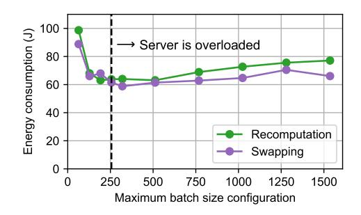

**Figure Description:**
The image is a graph that illustrates the relationship between server load (measured as energy consumption) and batch size configuration for a system or process. On the x-axis, there are three different configurations: "Swapping," "Recomputation," and "Server." These likely refer to various methods of managing computational tasks within the system being analyzed.

The y-axis represents energy consumption measured in watts per second (W/s). This indicates how much power the system uses at any given moment.

There are two lines on the graph, each representing one of the configurations. One line corresponds to the "Swapping" configuration, while the other corresponds to the "Recomputation" configuration. Both lines show an increase in energy consumption with increasing batch sizes. However, the "Recomputation" line generally shows higher energy consumption than the "Swapping" line across all batch sizes depicted.

At the top left corner of the graph, there's a note indicating that the server is overloaded. This suggests that when the server is handling more work than it can efficiently manage, its energy consumption increases significantly.

On the right side of the graph, there's another note explaining that the maximum batch size configuration is not shown due to space constraints. It implies that if the full range were plotted, the trend would continue beyond what is visible here.

Overall, the graph provides insight into how different configurations affect energy efficiency under varying levels of server load. It highlights the importance of optimizing these configurations to minimize energy usage without compromising performance.

Figure 8: Energy consumption per generation while varying the maximum batch size for Mistral Nemo (12B). The LLM inference server's preemption mechanism is compared.

**Figure Description:**
The image is a graph with two axes: one labeled "Energy consumption (kJ)" ranging from 0 to 400 kJ, and another labeled "Batch size" ranging from 0 to 1000. There are five lines representing different GPU types or configurations, each line corresponding to a specific type of GPU as indicated by labels above them. These labels read "1 GPU," "2 GPUs," "4 GPUs," "8 GPUs," and "8 GPUs." Each line represents the energy consumption for that particular configuration at various batch sizes.

The data points along these lines show an increase in energy consumption as the batch size increases. For example, the line representing "1 GPU" starts at approximately 300 kJ when the batch size is zero and rises steadily until it reaches around 500 kJ at a batch size of 1000. Similarly, all other lines follow a similar trend but with varying slopes indicating differences in energy efficiency between the GPU configurations.

At the top right corner of the graph, there's a legend explaining the symbols used to denote the different GPU configurations. The symbols correspond to the colors of the lines on the graph, which include red, orange, yellow, purple, and green. This helps viewers quickly identify which line corresponds to which GPU configuration.

Overall, the graph provides a visual representation of how energy consumption changes with batch size across different GPU setups. It suggests that using more GPUs generally leads to higher energy consumption, although the exact relationship can vary depending on the specific GPU model or configuration.

Figure 9: Energy consumption per generation while varying batch size for Llama 3.1 8B. The number of NVIDIA A100 GPUs used to run the same model is scaled up.

Figure [8,](#page-23-0) we compare the energy consumption per generation of the two preemption mechanisms with the Mistral Nemo (12B) model by intentionally overloading the server with a high maximum batch size configuration and causing preemption. It can be seen that when the server is overloaded, Swapping consistently consumes less energy. This is because Recomputation performs extra computation when restoring requests whereas Swapping copies data without running computation, and the energy consumption of computation is larger than memory operations (this will be further examined in the next section). Furthermore, as the server gets more and more overloaded, energy consumption generally increases. This is because with higher overload, more preemptions – and thus more recomputation or data movement – occur. Since preemptions do not directly contribute to the completion of the request, the extra energy consumption from preemptions increases the average energy consumption of completing each request.

### B.2 Tensor Parallelism Scaling

We investigate the impact of communication overhead to energy consumption. This is important as modern large models frequently do not fit within the memory capacity of a single GPU. This requires multiple GPUs to execute inference for a single model, and GPUs must constantly communicate with each other to do so [\[67\]](#page-13-17).

In order to ablate the effect of communication, we employ the same Llama 3.1 8B model and vary the number of GPUs used (Figure [9\)](#page-23-1). Because the amount of computation executed is the same regardless of the number of GPUs, energy consumption should ideally be constant. Indeed, energy consumption barely changes when scaling from one GPU (no communication) to two, but when scaling further, energy consumption significantly increases. This is because, while the amount of computation decreases for each GPU, additional communication time between the GPUs offsets the reduction in computation time. Since communication time increases with the number of GPUs, using too many GPUs can lead to slowdowns in executing the same amount of computation and increase energy consumption.

| Model and deployment       | Request dataset |                  |                 |  |  |
|----------------------------|-----------------|------------------|-----------------|--|--|
|                            | Input mean 512  | Input mean 512   | Input mean 4096 |  |  |
|                            | Output mean 512 | Output mean 4096 | Output mean 512 |  |  |
| Llama 3.1 8B (TP=1, 1P3D)  | 37.71, 77.2%    | 665.77, 98.7%    | 208.34, 67.2%   |  |  |
| Llama 3.1 8B (TP=1, 2P2D)  | 36.22, 76.7%    | 706.27, 98.8%    | 151.75, 55.2%   |  |  |
| Llama 3.1 8B (TP=1, 3P1D)  | 37.26, 77.0%    | 748.45, 98.9%    | 158.85, 56.0%   |  |  |
| Llama 3.1 70B (TP=4, 1P1D) | 276.93, 64.8%   | 907.60, 89.2%    | 1492.59, 50.0%  |  |  |

Table 4: Energy per generation (Joules) and the percentage of decode energy consumption with PD disaggregation. Following recent trace analysis [\[79\]](#page-14-7), we sampled input lengths from a Pareto distribution with alpha 2.5, and output lengths from an Exponential distribution, each with mean specified in the table. TP means tensor parallelism degree, and xPyD means it was deployed with x prefill instances and y decode instances, each with TP-many GPUs.

| Max batch size | Max batched tokens |        |        |        |        |        |        |        |        |
|----------------|--------------------|--------|--------|--------|--------|--------|--------|--------|--------|
| (sequences)    | 32                 | 64     | 128    | 256    | 512    | 1024   | 2048   | 4096   | 8192   |
| 32             | 559.66             | 374.63 | 269.29 | 205.54 | 188.80 | 191.61 | 195.59 | 191.88 | 194.52 |
| 64             |                    | 362.49 | 266.98 | 200.43 | 168.27 | 165.52 | 170.17 | 168.78 | 169.58 |
| 128            |                    |        | 264.18 | 194.59 | 164.75 | 154.64 | 155.59 | 156.54 | 156.93 |
| 256            |                    |        |        | 194.39 | 161.87 | 153.97 | 155.11 | 157.13 | 159.25 |
| 512            |                    |        |        |        | 159.57 | 151.50 | 154.52 | 156.77 | 154.95 |
| 1024           |                    |        |        |        |        | 152.67 | 156.26 | 157.98 | 163.08 |

Table 5: Energy per generation (Joules) of Llama 3.1 8B on a synthetic long context request dataset running on H100 GPUs. Following recent trace analysis [\[79\]](#page-14-7), we sampled input lengths from a Pareto distribution with mean 4,096 and alpha 2.5, and output lengths from an Exponential distribution with mean 512. Note that vLLM does not allow the max number of batched tokens to be smaller than the max batch size, which is why the lower left triangle of the table is empty.

From this scaling experiment, we can observe that the energy impact of communication overhead can be large. This impact will be even more pronounced in hardware environments without sufficient or state-of-the-art networking infrastructure, which is common in real world settings due to its cost [\[36\]](#page-11-17).

### B.3 Prefill–Decode Disaggregation

Prefill–decode (PD) disaggregation is a rising production deployment setting where prefill and decode phases are run on separate GPUs [\[59,](#page-12-19) [86\]](#page-14-8). This allows for independent scaling and optimization of prefill and decode phases based on workload characteristics, and leads to better latency deadline attainment. Table [4](#page-24-0) shows energy measurements for different PD disaggregation configurations, where "xPyD" denotes x prefill instances and y decode instances.

Overall, decode consumes the majority of energy, with some amount shifting to prefill when input length is long. In our setup, PD disaggregation configurations did not have a large impact on absolute energy consumption or the energy split as long as the throughput of prefill and decode instances are reasonably balanced.

### B.4 Chunked Prefill

Chunked prefill is a technique where long input prompts are split into chunks and processed alongside decode iterations, improving GPU utilization and reducing the interference between long prefills and decode iterations [\[5\]](#page-10-18). For chunked prefill, the max number of batched tokens is a key parameter that controls the chunk size. Table [5](#page-24-1) shows the impact of this parameter on energy consumption.

Table [5](#page-24-1) shows that the more sequences or tokens you batch, the better the energy amortization you get and energy per generation decreases, and after a certain point, returns diminish.

**Figure Description:**
The image is a collage of six graphs that compare different configurations of Llama (a type of video diffusion) with various power draw levels. Each graph shows two lines representing two different configurations: "Stable Diffusion" and "Video Difusion." These lines are plotted against the horizontal axis labeled "Power Draw (W)," which ranges from 0 to 600 Watts. On the vertical axes, there are labels for "Batch size," ranging from 1 to 5 Batch sizes, and "H10 TDP (max power draw)" ranging from 4 x H100 TDP (maximum thermal design point) to A100 TDP (maximum power draw).

The first row contains three graphs. In the leftmost graph, both lines show an increase in power draw as the batch size increases, but the line for Video Difusion has higher peaks than Stable Diffusion at certain points. The middle graph also displays similar trends, with the Video Difusion line having more pronounced spikes compared to the Stable Diffusion line. The rightmost graph mirrors these patterns; however, the differences between the two lines become less distinct as the batch size increases.

In the second row, the trend continues with the Video Difusion configuration showing higher power draw across all batch sizes. This pattern is consistent throughout the remaining four graphs. Notably, the graphs illustrate how increasing the maximum power draw affects the power consumption of each configuration. For instance, when the maximum power draw is increased from A100 TDP to H100 TDP, the power draw for both configurations significantly rises. Similarly, when it's further increased to A100 TDP (maximum power draw), the power draw increases even more.

Overall, the images provide a detailed comparison of the energy efficiency of different Llama configurations under varying conditions of power draw.

Figure 10: Power consumption of various models on A100 and H100 GPUs.

# C Power Consumption Analysis

Figure [10](#page-25-1) shows the power consumption of various models on A100 and H100 GPUs. Figure [11](#page-26-0) further shows the ratio of a model's power consumption to the maximum GPU power draw across all models. Generally, LLMs and VLMs consume significantly less power than the GPU's TDP because LLM decoding, the dominant operation for LLM serving, is memory-intensive and does not fully utilize the GPU's compute resources. VLMs show slightly higher power consumption than LLMs due to its additional modality encoder, which is compute-intensive. Diffusion models, on the other hand, consume nearly the maximum power of the GPU when batch size is not small. This is because Diffusion models are significantly more compute-intensive compared to LLM decoding.

Figure [12](#page-26-1) shows the GPU power draw breakdown over time on one NVIDIA H100 GPU. The GPU's power is measured (1) in whole and (2) only for the VRAM while the ML.ENERGY Benchmark is running. First, for Llama 3.1 8B, the timeline shows the effect of the two phases in LLM text generation: Prefill and Decode. Prefill happens once at the beginning of a request to digest the input prompt, which is then followed by hundreds to thousands of Decode phases, each of which generates one output token. Importantly, Prefill has high compute-intensity (and also high power draw) because it needs to digest the whole input prompt, whereas Decode has low compute-intensity (and low power draw) as it does not entail very much computation. With this, we can first understand the initial spike

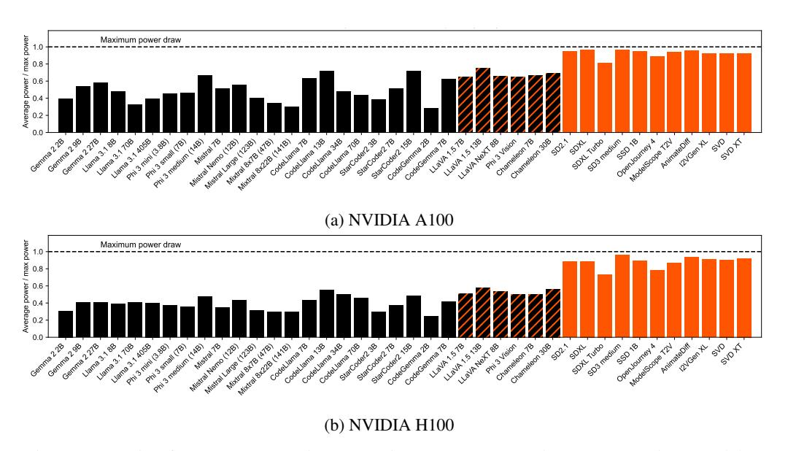

**Figure Description:**
The image is a graphical representation of data with two separate charts labeled (a) NVIDIA A100 and (b) NVIDIA H100. Both charts are bar graphs that compare maximum power draw between different generations or models of GPUs. Each chart has bars corresponding to various GPU models, such as "GeForce GTX 285," "GeForce GTX 460," "GeForce GTX 780 Ti," and others up to "Nvidia V100."

The x-axis represents average power consumption measured in watts per second (W/s). There are numerical values ranging from approximately 0.3 W/s at the left end of both axes to about 0.9 W/s for the most powerful model listed on each chart.

On the right side of each chart, there's an orange area representing the range of power draw for the respective GPU generation or model. This indicates how much power these specific GPUs can consume within their operational range.

Each chart also includes a legend indicating which colors correspond to which GPU generations or models. For example, the legend on the left side shows that black corresponds to GeForce GTX 285, while red corresponds to GeForce GTX 460. Similarly, the legend on the right side correlates the colors with the newer models like Nvidia V100.

Overall, the image provides a visual comparison of the energy efficiency of different generations of Nvidia graphics cards across varying levels of computational performance represented by the power draw.

Figure 11: Ratio of power consumption to maximum GPU power draw across various models.

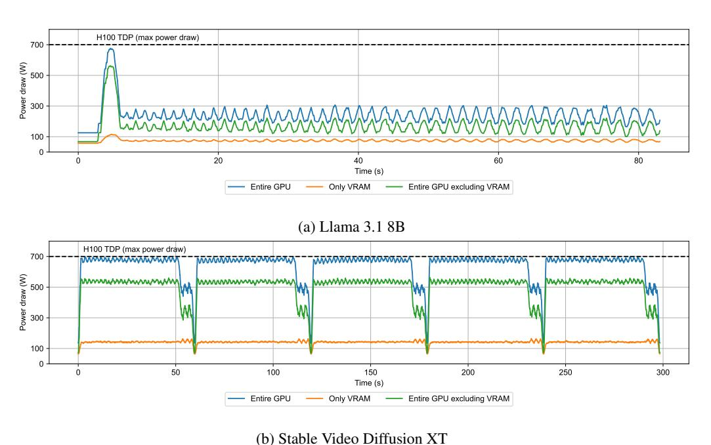

**Figure Description:**
The image displays two graphs with a title "Stable Video Diffusion XT" at the top right corner. Both graphs are line plots showing changes over time (in seconds) for different parameters related to video processing or transmission.

The left graph is labeled "(a) Llama 3.1 SB," which suggests it represents data from an entity named LLama version 3.1 using some sort of Single Board Computer (SBC). It shows three lines representing different types of power draw: H10 TDP (maximum thermal design power), H10 TDP max power draw, and H10 TDP (only VRAM). These lines fluctuate over time, indicating periods where more power was drawn compared to others. There's also a horizontal axis label that reads "Power draw (W)" but without additional context, its specific meaning isn't clear.

On the right side of the image, there's another graph titled "(b) Llama 3.1 SB." This one has four lines corresponding to different GPU configurations: Entire GPU excluding VRAM, Only VRAM, Only CPU excluding VRAM, and Only CPU including VRAM. Each line varies over time, suggesting fluctuations in computational load or performance metrics.

Both graphs have numerical labels along their axes. For the x-axis, the range appears to be between 0 and 500 seconds, while the y-axes indicate ranges such as "H10 TDP (max power draw)" and "Power draw (W)" for the left graph, and "Entire GPU excluding VRAM" and "Only CPU including VRAM" for the right graph. However, due to the resolution of the image, precise numbers are not entirely legible.

Overall, these graphs seem to compare the power consumption characteristics of various hardware configurations during video processing tasks, possibly within the context of artificial intelligence or machine learning applications.

Figure 12: GPU power draw breakdown over time on one NVIDIA H100 GPU. "Entire GPU" and "Only VRAM" (memory) were measured, and the two were subtracted to derive "Entire GPU

in power draw – when the benchmark begins, the server begins admitting new requests, creating a short period where numerous Prefills are executed back-to-back, leading to high power draw. After the initial spike, power draw repeats a periodic fluctuation. This is because, before each Prefill or Decode, the server must make numerous control decisions, including determining which requests are now finished and which ones should run next. Since these decisions are executed by the CPU, this creates a periodic time gap where the GPU is not running any computation. This GPU idle time leads to the periodic drop in GPU power draw.

excluding VRAM."

On the other hand, Stable Video Diffusion XT shows a different power draw pattern. Diffusion models generally have three phases: Encode, Denoise, and Decode. The Encode phase digests the

input prompt and passes it to the Denoise phase, which iteratively removes noise from a random vector. Finally, the Decode phase transforms the denoised vector into the final image or video.

From the timeline, especially Denoise and Decode can be clearly distinguished. Denoise is the most compute-intensive and consumes power close to the GPU's TDP. For each batch, there are 25 local peaks that hit the GPU's TDP, each of which corresponds to one denoising step in Denoise. During Decode, power draw generally decreases, with each local power peak corresponding to the two large layers in the decoding module. On the other hand, VRAM power draw increases during Decode because it allocates a large chunk of memory and performs writes in order to generate the final video. Finally, as the final generated video is copied from the GPU's memory to the CPU's, the GPU does not run any computation, resulting in a steep drop in power draw.

From the power breakdown, we can observe that memory operations indeed draw significantly less power compared to computation, and thus computations with low compute-intensity should indeed draw less power. Furthermore, we can observe that the power draw and energy consumption of a specific hardware (GPU in this case) is not a function of just itself and the computations that it runs. Rather, software and hardware components that are integrated in the same system stack impacts how computations are executed on each other, affecting their power draw and energy consumption.

# D The ML.ENERGY Leaderboard and Benchmark

On July 2023, we launched the ML.ENERGY Leaderboard and Benchmark, the first inference energy leaderboard for modern generative AI models.[6](#page-27-3) Our goal was to measure and understand the energy consumption of generative AI models, and we provided a web-based leaderboard to allow everyone to browse the results. The leaderboard started with only LLM chat with tens of different LLMs, but gradually expanded to include more tasks, models, and datasets. Our benchmarking suite to supply data to the leaderboard is what we dub the ML.ENERGY Benchmark. This paper shares our design philosophy and principles we have acquired over time by gradually maintaining and upgrading the ML.ENERGY Benchmark and the Leaderboard, and highlights notable results we have obtained from the early 2025 iteration of the benchmark. Importantly, we plan to continuously update the benchmark and the leaderboard as long as resources allow, and what is presented in this paper is only a snapshot of the current state of the benchmark at the time of writing. We encourage readers to visit the leaderboard website and benchmark repository for the latest results and updates.

# E Limitations

The ML.ENERGY Benchmark is not without limitations. First, we note that the benchmark is not exhaustive and does not cover all possible tasks, models, and datasets. This is particularly true as time passes and new models and tasks are developed. We are aware of newer open-weight models and worthy tasks that were released after the early 2025 iteration of the benchmark was finalized. However, we cannot add each model or task one by one incrementally as they are released, due to the prohibitive monetary cost of running the benchmark on representative hardware; rather, we collect new advances in a window of time and then mass-update the whole benchmark, accompanied by upgrades in hardware, software, and datasets. Second, the benchmark is not exhaustive in terms of hardware. We currently mainly support flagship NVIDIA GPUs, which arguably dominates the market especially when it comes to real-world generative AI services. Furthermore, we do not have access to all possible hardware configurations, nor do they always provide a way for us to measure energy consumption from software. Regardless, we are working to expand the benchmark to support more hardware configurations.

# F Broader Impacts

By allowing everyone to accurate measure, understand, and optimize the energy consumption of generative AI models, we believe the ML.ENERGY Benchmark can enhance the understanding of energy consumption of generative AI in the research community and the industry, and ultimately fuel works that optimize energy consumption. Furthermore, energy is essentially throughput per watt,

6 <https://github.com/ml-energy/leaderboard/releases/tag/2023-07-06>

which is one factor that determines the cost of running generative AI services at the infrastructure level. By optimizing energy consumption, we can reduce the cost of running generative AI services, which can help democratize access to generative AI.