# Mélange: Cost Efficient Large Language Model Serving by Exploiting GPU Heterogeneity

Tyler Griggs∗ UC Berkeley Xiaoxuan Liu∗ UC Berkeley Jiaxiang Yu National University of Singapore Doyoung Kim UC Berkeley

Wei-Lin Chiang UC Berkeley Alvin Cheung UC Berkeley Ion Stoica UC Berkeley

# Abstract

Large language models (LLMs) are increasingly integrated into many online services, yet they remain cost-prohibitive to deploy due to the requirement of expensive GPU instances. Prior work has addressed the high cost of LLM serving by improving the inference engine, but less attention has been given to selecting the most cost-efficient GPU type(s) for a specific LLM service. There is a large and growing landscape of GPU types and, within these options, higher cost does not always lead to increased performance. Instead, through a comprehensive investigation, we find that three key LLM service characteristics (request size, request rate, SLO) strongly influence GPU cost efficiency, and differing GPU types are most cost efficient for differing LLM service settings. As a result, the most cost-efficient allocation for a given service is typically a *mix* of heterogeneous GPU types. Based on this analysis, we introduce Mélange, a GPU allocation framework that navigates these diverse LLM service characteristics and heterogeneous GPU option space to automatically and efficiently derive the minimal-cost GPU allocation for a given LLM service. We formulate the GPU allocation task as a cost-aware bin packing problem where GPUs are bins and items are slices of the service workload. Our formulation's constraints account for a service's unique characteristics, allowing Mélange to be *flexible* to support diverse service settings and *heterogeneity-aware* to adapt the GPU allocation to a specific service. Compared to using only a single GPU type, Mélange reduces deployment costs by up to 77% in conversational settings, 33% in document-based settings, and 51% in a mixed setting.

### 1 Introduction

Large language models (LLMs) [\[35,](#page-12-0) [43,](#page-13-0) [44\]](#page-13-1) are increasingly integrated into many online services, including search engines [\[37,](#page-13-2) [24\]](#page-12-1), chatbots [\[34\]](#page-12-2), and virtual assistants [\[28,](#page-12-3) [47,](#page-13-3) [48\]](#page-13-4). These services are often hosted by deploying models on cloud resources. However, deploying LLMs is expensive. The substantial size and computational demands of LLMs require the use of costly hardware accelerators, typically GPUs[2](#page-0-0) For example, serving Llama2-70b at BF16 precision requires 2 NVIDIA A100-80GB GPUs, which costs over \$5, 200 per month in on-demand rental costs on major cloud platforms.

Prior work [\[8,](#page-11-0) [16,](#page-11-1) [54,](#page-14-0) [57,](#page-14-1) [60\]](#page-14-2) addresses the high cost of LLM serving by focusing on inference throughput, but less attention has been given to selecting the most cost-efficient GPU type(s) for a specific LLM service. The large and growing landscape of hardware accelerators — ranging from NVIDIA GPUs [\[33\]](#page-12-4) and AMD GPUs [\[45\]](#page-13-5) to Google TPUs [\[17\]](#page-12-5), CPUs [\[23\]](#page-12-6), and others [\[4\]](#page-11-2) — offers

∗Equal contribution

For brevity, we use "accelerator" and "GPU" interchangeably in this work.

a wide array of choices with varying performance specifications and on-demand cloud costs. Within these hardware options, higher cost does not always lead to increased performance. To investigate this phenomenon further, we examine GPU *cost efficiency*, defined based on common pricing models [\[34\]](#page-12-2) as the number of input and output tokens processed per dollar cost (**T/\$**) of on-demand cloud GPUs. We find that GPU cost efficiency is determined by three key LLM service characteristics:

- 1. Request Size: An LLM request's size is made up of its input and output token lengths. For small request sizes, lower-end GPUs generally produce greater T/\$ than high-end GPUs.
- 2. Request Rate: To maximize utilization, provisioned GPU capacity should align with request volume. At low request rates, services can reduce costs by right-sizing from expensive high-end GPUs to cheap low-end GPUs. Further, leveraging a *mix* of GPU types facilitates finer-grained resource scaling to better match request volume.
- 3. Service-level Objective: Services typically establish latency SLOs to ensure service quality. Because low-end GPUs generally incur higher latency than high-end GPUs, high-end GPUs are required for stringent SLOs while low-end GPUs can reduce costs in loose-SLO settings.

Consider a GPU allocation strategy that integrates each of the three observations above: high-cost A100 GPUs handle large requests and meet stringent SLOs, but lower-cost A10G GPUs serve smaller requests (1) and looser SLOs (3) at higher T/\$. Then, during periods of low service activity, the service right-sizes to the even-cheaper L4 GPU to maintain service availability at lowest cost (2). Consequently, we find that GPU *heterogeneity* presents opportunities for increasing GPU cost efficiency, but such opportunities are highly dependent on LLM service characteristics. The key challenge, then, is creating a GPU allocation framework that can navigate the diversity of LLM services (request sizes, request rates, latency SLOs) and GPU types to find the optimal GPU allocation.

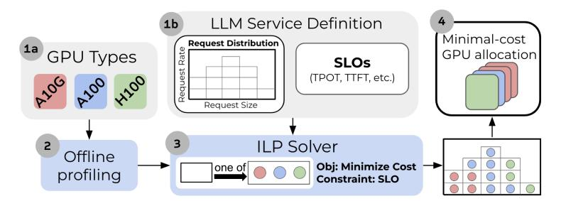

**Figure Description:**
The image is a flowchart that outlines a process for distributing GPUs (Graphics Processing Units) to various service types. It's divided into four main sections: Request Distribution, LLM Service Definition, Minimal-cost GPU allocation, and Offline profiling. Each section has numbered steps with accompanying text descriptions. Here are the details of each section:

1a - **GPUs Types**: There are three types of GPUs listed here: A10G, A100, and H100. These likely refer to different models or generations of GPUs.

2b - **Request Size**: This step involves categorizing requests based on their size. Three categories are defined: Small (SL), Medium (MD), and Large (LG).

3c - **Offline Profiling**: In this stage, offline profiling is performed. An "Object" is created, which seems to be related to the cost constraint mentioned later. One of the outputs from this stage is an array labeled "Constraint: SLO".

4d - **LLM Service Definition**: This part of the chart defines the Low Latency Machine Learning (LLM) services. It mentions two types of services: SLOS (which could stand for Single Level Of Support) and TPOT (which might be an acronym for a specific technology or methodology).

5e - **Minimal-cost GPU Allocation**: At this point, the minimal-cost GPU allocation occurs. Two options are presented: Object: Minimize Cost and Constraint: SLO.

6f - **ILP Solver**: ILP stands for Integer Linear Programming, which is used as a solver to optimize resource allocation. The output of this step is a solution that minimizes costs while satisfying constraints.

The arrows indicate the sequence of operations within the system. The overall diagram suggests a systematic approach to managing resources efficiently by considering factors such as request size, service definition, and cost optimization.

Figure 1: Mélange framework.

We present *Mélange*[3](#page-1-0) [\(Fig. 1\)](#page-1-1), a GPU allocation framework that derives the minimal-cost GPU allocation for a given LLM service. In Mélange, each GPU type (1a) passes through a one-time offline profiling step ( 2 ) to measure GPU performance across request sizes and rates. Then, given the profiling results and an LLM service definition (1b), Mélange's objective is to choose a GPU allocation for the service workload that minimizes cost. This task is a natural application of the cost-aware bin packing problem, where bins are GPUs and items are slices of the workload. We formulate the problem as an integer linear program (ILP) and efficiently solve with an off-the-shelf solver ( 3 ). Upon solution, Mélange produces the GPU allocation that can serve the LLM service at minimal cost while adhering to the service SLO ( 4 ).

Mélange's strength stems from two key properties. First, it is *heterogeneity-aware*. Our analysis shows that request size, request rate, and SLOs jointly impact cost efficiency, but their impacts differ for each GPU type. Mélange's profiling and ILP formulation account for each of these dimensions, enabling efficient navigation of heterogeneous GPU types given a service specification. Second, Mélange is *flexible*. The inputs (1a, 1b) can be flexibly modified to include new generations of GPUs or alternative definitions of SLO, ensuring Mélange is effective for diverse services. Further, to the best of our knowledge, Mélange is the first GPU allocation framework that utilizes multiple GPU types for LLM serving. In summary, this paper makes the following contributions:

• We analyze three key LLM service characteristics and their influence on GPU cost efficiency: request size, request rate, and latency SLO (§ [4\)](#page-3-0).

3Mélange is French for "mixture"

- We introduce Mélange, an allocation framework that automatically derives the minimal-cost GPU allocation for a given LLM service while satisfying an SLO requirement (§ [5\)](#page-6-0).
- We evaluate Mélange across four GPU types—NVIDIA L4, A10G, A100, and H100. Mélange reduces costs by 9-77% for short-context tasks (interactive chats), 2-33% for long-context tasks (document-based), and 4-51% in mixed-context workloads (§ [6\)](#page-8-0).

### 2 Related Work

#### 2.1 LLM Inference Optimization

A significant body of research has focused on optimizing LLM inference efficiency. One stream concentrates on memory optimization, particularly through improved key-value cache reuse [\[56\]](#page-14-3) and management strategies [\[19\]](#page-12-7). Another avenue seeks to minimize latency, such as scheduling optimization [\[51,](#page-13-6) [1,](#page-11-3) [46\]](#page-13-7), speculative decoding [\[20,](#page-12-8) [18\]](#page-12-9), kernel optimization [\[8,](#page-11-0) [40\]](#page-13-8) and early exiting [\[41,](#page-13-9) [59\]](#page-14-4). Additional optimizations include quantization [\[10,](#page-11-4) [21,](#page-12-10) [49,](#page-13-10) [50\]](#page-13-11) and sparsification [\[9,](#page-11-5) [52\]](#page-13-12). Instead of altering inference logic, our work assumes a fixed inference engine configuration and concentrates on reducing LLM deployment costs by choosing cost-effective GPU instance types.

#### 2.2 Machine Learning with Cloud Resources

Recent studies have explored various strategies for reducing the cost of machine learning (ML) inference or training. Several focus on utilizing spot instances [\[42,](#page-13-13) [12,](#page-11-6) [53,](#page-14-5) [11\]](#page-11-7), which is complementary to our work. Other work targets deployment on heterogeneous resources [\[5,](#page-11-8) [6,](#page-11-9) [30,](#page-12-11) [26,](#page-12-12) [27\]](#page-12-13), but focuses primarily on model training rather than serving. Also, lveraging serverless instances for inference cost reduction has been examined in [\[2\]](#page-11-10). Nonetheless, these prior work predominantly concentrate on machine learning prior to the advent of LLMs, which we show to have unique characteristics that significantly impact cost efficiency. More recent studies, such as [\[25,](#page-12-14) [15\]](#page-11-11), focus on LLMs, but they propose strategies for reducing costs via optimal migration plans and parallelism with heterogeneous resources. They do not identify key LLM service characteristics that impact cost efficiency and consider them in GPU deployment, which our work highlights. Another line of work [\[58,](#page-14-6) [36\]](#page-13-14) explores splitting LLM inference into its two phases (prefill and decode) and performing the two phases on separate nodes, perhaps with different GPU types. Our work shows that, even within a phase, the best GPU type can change based on LLM service specifications.

### 3 Background

#### 3.1 LLM Request Size Variance

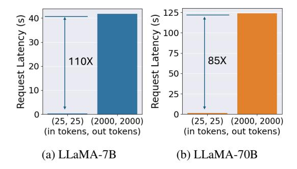

**Figure Description:**
The image is a bar chart with two vertical bars labeled "Request Latency" and "Llama-7B," each representing different data sets or models. On the left side of the chart, there's another label that reads "(a) LLAM-7B." Both bars are colored blue and have numerical values associated with them:

1. For the "Request Latency" bar, the value at the top is 40 (in seconds), which likely represents some form of latency metric for requests made to an unspecified system or service. Below this, there are three additional numbers: 25, 25, and 200, indicating these might be specific request latencies at certain points in time or under particular conditions.

2. The right side of the chart shows the "Llama-7B" bar, which has a much higher value at the top compared to the "Request Latency" bar. This number is 86x, suggesting it could be a multiplier or scaling factor applied to the latency metric from the left bar. Below this, there are two more numbers: 25, 25, and 200, similar to those on the left bar, but here they seem to correspond to the same scale as the "Llama-7B" bar rather than being outliers.

The y-axis of the chart indicates that both bars range between approximately 30 and 90 seconds, while the x-axis lists four categories: "(25, 25)," "(200, 200)," "(200, 200)," and "(200, 200)." These labels suggest that the data points may be related to performance metrics over time or across different configurations or scenarios.

Overall, the chart appears to compare the latency performance of a system or model named "LLAM-7B" against a baseline or reference point represented by the "Request Latency" bar. The exact nature of the comparison—whether it involves improvements, regressions, or other changes—is not clear without further context.

Figure 2: Request latency of different input/output lengths on A100-80G.

Unlike traditional machine learning workloads, LLM tasks exhibit significant variance in *request sizes*, defined by input and output lengths. For example, ResNet [\[13\]](#page-11-12) requires a fixed-dimension input (image size) and generates a fixed-dimension output (classification size). Conversely, transformerbased language models are flexible to support variable-length prompts and produce variable-length generation sequences. For instance, Figure [10](#page-8-1) illustrates the request size distributions of Chatbot Arena, demonstrating the extensive diversity of request sizes in practical scenarios. As a result, high

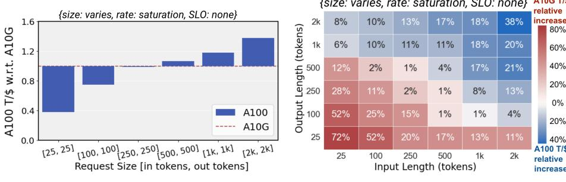

**Figure Description:**
The image is a composite of two separate graphs with different scales and data sets, presented side by side to compare their results. On the left side of the image, there's a bar graph titled "Request Size (in tokens) out tokens," which shows the number of request size tokens for various sizes ranging from 100 bytes to 256 bytes. Each bar represents a specific token count corresponding to each request size. There are numerical labels indicating the request size in bytes: 100, 1000, 250, 500, 1000, 2500, 5000, 10000, 25000, 50000, 100000, 250000, 500000, 1000000, 2500000, 5000000, 10000000, 25000000, 50000000, 100000000, 250000000, 500000000, 1000000000, 2500000000, 5000000000, 10000000000, 25000000000, 50000000000, 100000000000, 250000000000, 500000000000, 1000000000000, 2500000000000, 5000000000000, 10000000000000, 25000000000000, 50000000000000, 100000000000000, 250000000000000, 500000000000000, 1000000000000000, 2500000000000000, 5000000000000000, 10000000000000000, 25000000000000000, 50000000000000000, 100000000000000000, 250000000000000000, 500000000000000000, 1000000000000000000, 2500000000000000000, 5000000000000000000, 10000000000000000000, 25000000000000000000, 50000000000000000000, 100000000000000000000, 250000000000000000000, 500000000000000000000, 1000000000000000000000, 2500000000000000000000, 5000000000000000000000, 10000000000000000000000, 25000000000000000000000

- (a) Equivalent input and output lengths (b) Input and output lengths vary independently

Figure 3: Figure (a) depicts A10G and A100's relative T/\$ across request sizes. Figure (b) expands (a) into separate input and output length dimensions. Tile colors indicate which GPU achieves higher T/\$, and values represent the percent increase of T/\$ relative to the less cost efficient GPU.

variance in request sizes introduces significant variation in request latency. As illustrated in Figure [2,](#page-2-0) request latency can increase by 110× when the input/output length expands from 25 tokens to 2000 tokens for the Llama2-7B model served on an A100 GPU. Consequently, it is crucial to recognize that LLM requests, unlike non-autoregressive models, impose varied loads on GPU resources.

# 4 GPU Cost Efficiency Analysis

In this section, we analyze GPU cost efficiency for LLM services by serving Llama2-7b on NVIDIA A100 [\[32\]](#page-12-15) and A10G [\[31\]](#page-12-16) as a representative example. We show that GPU cost efficiency is influenced by three key LLM service characteristics: request size (§ [4.2\)](#page-3-1), latency SLO (§ [4.3\)](#page-5-0), and request rate (§ [4.4\)](#page-6-1). For each characteristic, we demonstrate opportunities to exploit the heterogeneity of GPU types to increase cost efficiency and reduce deployment cost. Each plot is tagged with the request size, request rate, and SLO used to generate the plot. We use vLLM-0.2.7 as the serving engine [\[19\]](#page-12-7).

# 4.1 Definitions

Service-level Objective (SLO). SLOs are performance targets that define the acceptable quality of service, and a specific SLO varies according to the service's interactivity needs. As in prior work [\[19,](#page-12-7) [58,](#page-14-6) [51\]](#page-13-6), we use the average *Time Per Output Token (TPOT)* as our SLO. TPOT is determined by dividing request latency by the number of generated tokens. SLOs are application dependent: in-line code editors (e.g., GitHub Copilot [\[28\]](#page-12-3)) require tight latency deadlines to suggest real-time code additions, whereas summarization services may permit additional processing time. There are other common definitions of SLO, such as time to first token and request latency, and Mélange is flexible to support these and other alternative definitions of SLO.

Cost Efficiency Metric. We use *tokens per dollar* (T/\$) to measure GPU cost efficiency, calculated by summing input and output tokens and dividing the total by the GPU's on-demand rental cost for a given time period. Cost models are orthogonal to Mélange; we chose this cost model for its simplicity, but cost efficiency can be computed with alternative formulations without affecting Mélange's efficacy. In general, we derive T/\$ by finding the input and output token rates while at the highest GPU saturation for which TPOT still meets a specified SLO.

#### 4.2 Request Size and Cost Efficiency

Unlike many traditional DNNs, LLMs exhibit significant variance in model request sizes (input and output lengths) [\[36\]](#page-13-14). In this section, we show that request size variance influences GPU cost efficiency and can even determine which GPU is most cost efficient.

Experiment: We serve Llama2-7b on A10G and A100 GPUs, and derive each GPU's T/\$ at maximum GPU saturation across a range of request sizes ( [Fig. 3a\)](#page-3-2). Interestingly, no single GPU consistently delivers the highest tokens per dollar (T/\$) across all request sizes. Instead, both GPUs are most cost efficient in separate regions of the request size spectrum. For smaller request sizes,

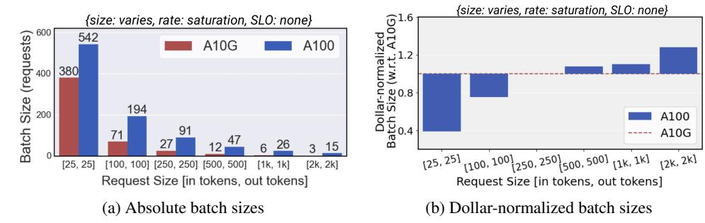

**Figure Description:**
The image is a composite of two bar charts with accompanying text that provide information about batch sizes and their corresponding request size rates for different types of tokens. Each chart has three bars representing various categories: A10G, A100G, and Batch.

The left side of the image shows a vertical bar chart labeled "(a) Absolute batch sizes." It compares the number of requests made by batches of varying sizes (A10G, A100G, and Batch). For each category, there are four bars indicating different batch sizes: Request Size in Tokens, out tokens, Request Size in Tokens, and out tokens. The numerical values next to these bars indicate the number of requests or tokens associated with each batch size.

For example, under "Batch," the first bar represents the number of requests made when using Request Size in Tokens as the batch size, which is 542. The second bar indicates the number of out tokens, which is 380. The third bar shows the number of requests made when using Request Size in Tokens as the batch size again, but it's not specified if it's another set of tokens or if it's related to the previous one. Finally, the fourth bar represents the number of out tokens, which is 697.

On the right side of the image, we have a horizontal bar chart labeled "(b) Dollar-normalized batch sizes." This chart also includes the same categories (A10G, A100G, and Batch), but instead of showing absolute numbers, it displays normalized rates based on saturation, SLO, none(none):

- A10G has a rate of 0.1666666666666666666666666666666666666666666666666666666666666666666666666666666666666666666666666666666666666666666666666666666666666666666666666666666666666666666666666666666666666666666666666666666666666666666666666666666666666666666666666666666666666666666666666666666666666666666666666666666666666666666666666666666666666666666666666666666666666666666666666666666666666666666666666666666666666666666666666666666666666666666666666666666666666666666666666666666666666666666666666666666666666666666666666666666666666666666666666666666666666666666666666666666666666666666666666666666666666666666666666666666666666666666666666666666666666666666666666666666666

Figure 4: (a) depicts the absolute batch sizes of A10G and A100 serving Llama2-7b at maximum saturation, (b) reports the same batch sizes divided by GPU cost, plotting with respect to A10G.

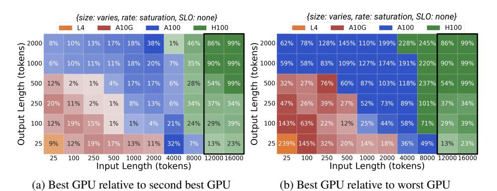

**Figure Description:**
The image is a colorful bar chart with two sections labeled (a) Best GPU relative to second best GPU and (b) Best GPU relative to worst GPU. Each section contains four sub-charts, each representing different types of tokens: L4, A10G, H100, and A100G. These sub-charts are arranged vertically within their respective main charts.

The x-axis of both main charts lists input lengths ranging from 256 to 8000 tokens. The y-axes for both parts of the chart show size variations, rate (SLo), none (none), and saturation (SLO). The bars are colored differently for each type of token, making it easy to distinguish between them.

In part (a), the bars for "Best GPU" are generally taller than those for "Second best GPU," indicating better performance or efficiency when using these GPUs compared to the second best ones. Conversely, in part (b), the bars for "Worst GPU" are shorter than those for "Best GPU," suggesting that the worst GPU performs worse across all sizes and rates.

Numeric values are provided at specific points along the x-axis, such as 256, 512, 768, 1024, 3072, 50000, 75000, and 90000 tokens. For example, under the "L4" category in the "Best GPU" section, the value for an input length of 256 tokens is 13%, which likely represents some form of accuracy, throughput, or another metric related to GPU performance. Similar numerical data can be found throughout the chart, providing detailed information about how well various GPUs perform at different input lengths.

Figure 5: Comparison of L4, A10G, A100, and H100. Tile colors indicates the GPU with greatest T/\$. (a) tile values are the T/\$ %-increase of the best GPU compared to the second best for that tile. (b) compares the best GPU to the worst GPU. In black boxes, only A100 and H100 are compared.

. A10G exhibits up to 2.6× greater T/\$ than A100. Conversely, for larger request sizes, A100 achieves up to 1.5× the cost efficiency of A10G.

We extend this exploration to show the separate impacts of input and output lengths on T/\$ ( [Fig. 3b\)](#page-3-2). Each dimension influences cost efficiency similarly: smaller sizes are best served on A10G, and larger sizes are best served on A100. Note that the difference can be significant, as using a single GPU type to serve requests across the entire request size space misses opportunities to produce up to 72% more output tokens for the same cost. This reveals the opportunity to use a mix of GPU types to serve requests for which they are most cost effective.

Source of Cost Efficiency Gains: To isolate how request size influences relative cost efficiency, we examine request size's effects on batch size, which serves as a proxy for throughput. [Fig. 4](#page-4-0) depicts absolute batch sizes and batch sizes normalized by instance cost of each GPU at maximum saturation.

A10G and A100 have similar cost-normalized batch sizes at 250 input/output tokens, but as the request size increases to 2K input/output tokens, A10G's absolute batch size decreases by 9× whereas A100's only decreases by 6× due to its superior memory size and bandwidth. As a result, A100's cost efficiency advantage over A10G increases with the increase in request size. In contrast, reducing the size from 250 to 25 input/output tokens expands A10G's batch size by 15.2×, whereas A100's growth is 5.89×.Because A100's batch sizes are larger, A100 is more significantly constrained by per-request latency overheads (e.g., due to interference of prefill and decode [\[14\]](#page-11-13)) As a result, A10G's cost-normalized batch size exceeds A100's at short request lengths, leading to greater overall T/\$.

Other Hardware and Model Size We extend our analysis to more GPU types and a larger model variant (Llama2-70b). [Fig. 5](#page-4-1) depicts the relative cost efficiency across four GPU types. Once again, as request sizes increase, we observe a progression of the most cost efficient GPU from lower-end to higher-end GPUs, matching our observations above. Similar trends are observed in the larger Llama2-70B model when comparing H100 and A100 GPUs, as detailed in [Fig. 8.](#page-5-1)

Key Takeaways: There is no universally most cost-efficient GPU for a given LLM. Instead, GPU cost efficiency is highly dependent on request sizes. Lower-end GPUs are more cost-effective for small

request sizes whereas higher-end GPUs are best for large request sizes. These findings generalize to settings with more GPU types and larger model sizes.

#### 4.3 SLO and Cost Efficiency

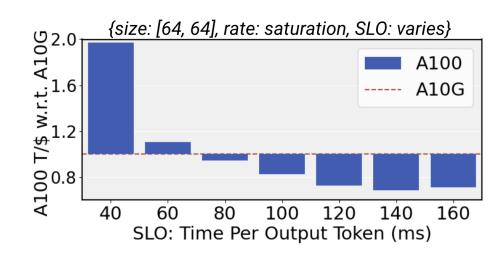

**Figure Description:**
The image is a bar chart with two y-axes representing different scales of measurement: one for "size (SLO)" measured in gigabytes per second (Gbps) and another for "time per output token" measured in milliseconds (ms). On the x-axis, there are numerical values ranging from 40 to 160, which likely correspond to some form of data processing or computational task. Each bar represents an individual observation within these ranges.

The bars are color-coded according to their size in Gbps, as indicated by the legend at the top right corner of the chart. There are three colors corresponding to three categories of AIOG (which could stand for Artificial Intelligence Output Generator): AI100, AI100G, and AI100G. These labels suggest that each category has a different level of performance or efficiency in terms of generating artificial intelligence outputs.

On the left side of the chart, there's a vertical dashed line labeled "SL0," indicating a specific point of interest or comparison. This might be related to a baseline or reference value for the time per output token metric.

At the bottom of the chart, there's a label "A100G," which seems to refer to a particular configuration or setting within the context of the experiment or study represented by the chart.

Overall, the chart appears to compare the speed of generating artificial intelligence outputs across different configurations or settings, using both the size of the generated output and the time it takes to generate them as metrics.

Figure 6: T/\$ comparison between A10G and A100 across a range of TPOT SLO parameters.

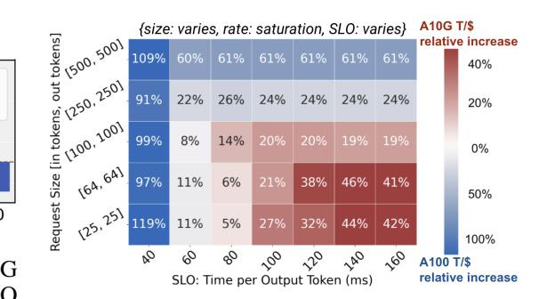

**Figure Description:**
The image is a bar chart that compares various metrics across different categories of tokens. There are four types of tokens represented: out (out), request (req), size (size), and rate (rate). Each token type has three subcategories labeled as SLO (which likely stands for Service Level Objective), SL1 (Single Level One), and SL2 (Single Level Two). These labels suggest that these might be levels or tiers within each category.

The x-axis represents the number of tokens per output token (SLOT) in millions (ms). It ranges from 0 to 40 million tokens per output token. The y-axis lists the relative increase percentage (A10G T$ / A10G T$) at the top right corner of the chart. This suggests that there's some sort of comparison being made between two sets of data related to "A10G T$" and "A10G T$".

Each bar chart shows the proportion of tokens that fall into specific buckets based on their size and saturation rates. For example, under the 'request' category with an SLO token, we see bars representing the proportion of tokens that have sizes ranging from 500 to 64KB and saturation rates ranging from 0% to 38%. Similarly, other categories like 'out', 'size', and 'rate' also show such proportions.

Numeric values are provided next to each bar, indicating the percentage of tokens that fall into each bucket. For instance, under the 'request' category with an SLO token, the first bar indicates that 91% of tokens have a size of less than 500 bytes, while only 7% have a size greater than 64KB. The second bar shows that 89% of tokens have a saturation rate below 1%, 10% have a saturation rate between 1% and 2%, and so on.

Overall, the chart provides detailed information about the distribution of tokens across different categories, sizes, and saturation rates. However, without additional context, it's difficult to determine the exact nature of the data or its significance.

Figure 7: Relative increase in T/\$ when combining SLO and request size.

In this section, we examine the impact of TPOT SLOs on GPU cost efficiency and highlight the joint effects of SLO and request size.

**Experiment:** We serve Llama2-7b on A10G and A100 and measure T/\$ by maximally saturating each GPU while keeping TPOT below SLO, repeating this across several TPOT deadlines ( Fig. 6). Under tight SLO constraints (<60ms), A100 demonstrates significantly greater T/\$ than A10G (2×). A10G's higher processing latency restricts the throughput it can achieve within a tight TPOT deadline, while A100 maintains much higher throughput even at low latency. However, as the SLO gradually loosens (60-160ms), A10G's higher latency is less problematic, dramatically increasing its T/\$ and surpassing that of A100 (by > 40%). Importantly, this example uses a small request size (64 input/output tokens), which was shown in § 4.2 to be best served on A10G. However, a tight SLO degrades A10G's cost efficiency much more severely than A100's and pushes the advantage to A100, exemplifying the tight interplay between SLO and request size explored further below.

**SLO** and Request Size Interplay: Fig. 7 presents relative cost efficiency between A10G and A100 for a broad range of TPOT SLOs and request sizes. At tight SLOs (40-60ms), A100 always has higher T/\$ (up to  $2\times$ ). At 80ms, A10G begins showing modest benefit over A100 for small request sizes. Finally, at 100-160ms, A10G demonstrates much greater T/\$ advantage over A100 for the same request sizes (up to  $1.5\times$ ), yet A100 is always more cost efficient for larger requests. As demonstrated, a modification to TPOT SLO shifts the boundary within the request size space between which different GPU types are most cost effective and significantly influences the magnitude of cost efficiency differences between GPUs. As a result, both request size and SLO must be considered in tandem when determining cost efficiency.

**Key Takeaways:** To meet strict SLOs, expensive GPUs are necessary due to the higher latency of cheaper GPUs. However, as SLO is loosened, lower-end GPUs can be used to cut deployment costs.

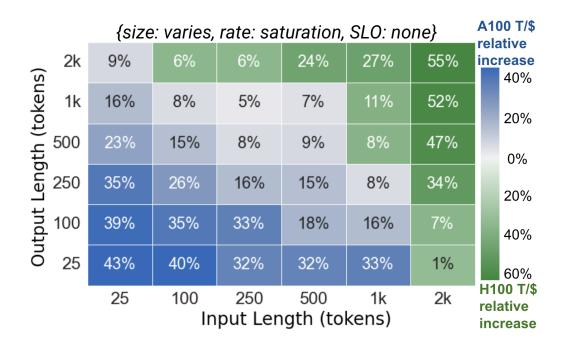

**Figure Description:**
The image is a bar chart that compares the output length (in tokens) of two different models or systems: one with saturation enabled (SLO) and another without it (none). Each model has three variations labeled as A10 T$1, A10 T$2, and A10 T$3. These labels suggest that each variation corresponds to a specific token count threshold (T$). There are also relative increase percentages shown for the SLO model compared to the none model at various input lengths (ranging from 2k to 500 tokens), which are indicated by the green bars.

The x-axis represents the input length in thousands of tokens, ranging from 2k to 500 tokens. The y-axis shows the output length in tokens, with increments of 1k.

For the none model, the longest output length observed across all variations is 49% at an input length of 500 tokens. For the SLO model, the maximum output length varies depending on the variation; A10 T$1 has the highest output length at 67%, while A10 T$2 and A10 T$3 have lower maxima at 58% and 55%, respectively.

In terms of the relative increases, the largest increase occurs between the 2k and 100 tokens inputs for the A10 T$1 variation, where there's a 40% increase when using the SLO model. This trend continues but decreases slightly as the input length increases further.

Overall, the chart provides a visual comparison of how the use of saturation affects the output length produced by these models across different input sizes. It suggests that enabling saturation generally leads to longer outputs, particularly noticeable at shorter input lengths. However, the exact impact of saturation may vary based on the specific model configuration and the nature of the task being performed.

Figure 8: T/\$ comparison between H100x2 and A100x2 serving Llama2-70b.

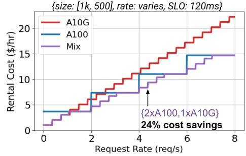

**Figure Description:**
The image is a bar chart that compares the cost savings of different rental rates for various types of vehicles over time. There are three bars representing A10G, A100 Mix, and A100 2xA100G (with annotations indicating these as "Rental Rate" and "Cost Savings"). Each bar has two sets of data: one set represents the initial cost savings at the beginning of each period, labeled as "(24 hr)"; the other set shows the cumulative cost savings after 6 hours, labeled as "(6 hr)".

The x-axis lists four periods with increasing duration from left to right: 2 hours, 4 hours, 6 hours, and 8 hours. The y-axis indicates the size of the cost savings in dollars per hour, ranging from $0 to $15.

For A10G, the initial cost savings range from $0 to $3, while the cumulative savings increase up to $7 by the end of the 8-hour period. For A100 Mix, the initial savings vary between $0 and $9, with the cumulative savings reaching up to $14 by the end of the 8-hour period. Finally, for A100 2xA100G, the initial savings fluctuate between $0 and $12, and the cumulative savings peak at $24 before decreasing slightly towards the end of the 8-hour period.

Each bar also includes a purple line connecting the initial and final points, which likely represents the trend or rate of change in cost savings over time. Additionally, there's a note explaining that the chart uses a logarithmic scale for the y-axis, suggesting that it might be easier to compare large differences in cost savings across different vehicle types and rental durations.

Figure 9: GPU on-demand cost for three GPU provisioning strategies.

#### 4.4 Request Rate and Cost Efficiency

In this section, we investigate the relationship between request rate and GPU cost efficiency.

Experiment: [Fig. 9](#page-5-1) illustrates the cost of serving Llama2-7b at a range of request rates using three strategies: A10G-only, A100-only, or a mix of both. The y-axis is absolute cost instead of T/\$ because each provisioning strategy serves the same request rates and thus the same number of tokens; only the cost varies across strategies.

As request rate increases, A100-only is increasingly more cost effective than A10G-only. This is because the requests are of size [1000 in tokens, 250 out tokens], which § [4.2](#page-3-1) shows is more cost effective on A100. However, A10G-only still presents benefits at low request rates (0-1 req/s). Periods of idleness or low activity are common in real-world services [\[38\]](#page-13-15), and the service should right-size to a cheaper GPU (here, A10G) when a higher-end GPU (here, A100) is drastically underutilized.

Mixing GPU Types: The hybrid approach of serving the model on both A10G and A100 GPUs consistently yields the lowest deployment cost. Because A100s have such large capacity, scaling with only A100s is coarse-grained and often leads to underutilized resources. Instead, A10Gs and A100s can be mixed such that A100s satisfy the bulk of the service demands, while A10Gs handle the remaining load at reduced cost. [Fig. 9](#page-5-1) highlights a case where using 2 A100s and 1 A10G results in a 24% cost saving over A100-only and 31% over A10G-only.

Key Takeaways: During low activity periods, LLM services should right-size to cheaper low-end GPUs. Provisioning a mix of GPU types enables finer-grained resource scaling, which better aligns the allocated GPU capacity with request load. This increases GPU utilization and consistently achieves lowest serving cost.

# 5 Mélange: Automating Cost-Efficient GPU Selection

Building on the observations in § [4](#page-3-0) that request size, request rate, and SLO all jointly determine GPU cost efficiency, we present Mélange, an allocation framework that considers each of these three dimensions in-tandem to derive the minimal-cost GPU allocation that meets an LLM service's request load while adhering to SLO constraints. [Fig. 1](#page-1-1) depicts the Mélange framework. Mélange flexibly supports any GPU type (1a) and LLM service definition (1b), uses a one-time offline profiling step to measure GPU performance ( 2 ), formulates the task of GPU allocation as a bin packing problem ( 3 ), then computes the minimal-cost GPU allocation ( 4 ).

# 5.1 Problem Formulation

We begin by defining the key terms utilized in our problem formulation and solution. An LLM service workload is characterized by its overall request rate along with a distribution of input and output sizes. A distribution of request sizes is used rather than fixed values due to the inherent variability of LLM request sizes. Specifically, a workload is a histogram where each bucket corresponds to a range of request sizes and a bucket's value is the request rate of requests within the bucket's size range. The service cost is computed by summing the hourly on-demand cloud renatl rates for each of the selected GPUs. We define SLO based on average TPOT, however, Mélange can be extended to other definitions of SLO such as time to first token (TTFT).

Problem Definition: Given a workload, GPU costs, and SLO requirements, our objective is to provision GPUs that can minimize deployment cost while adhering to latency SLO constraints.

#### 5.2 Inputs

Mélange takes as input the set of available GPU types (1a) and the LLM service definition (1b) made up of the workload profile and SLO. Each of these inputs can be modified, such as adding a new hardware accelerator or redefining SLO based on end-to-end request latency, and Mélange's downstream components still derive the minimal-cost allocation. Due to the large diversity of hardware accelerators and LLM services, Mélange's extensibility is critical for usability.

#### 5.3 Offline Profiling

A one-time offline profiling step (2) is required to measure the performance of each GPU. For each request size bucket in the workload histogram, we gradually increase the request rate until the GPU is saturated. We record per-request TTFT and TPOT as the request rate is increased, which are sufficient metrics to capture the timing behavior of a request end-to-end [22]. Then, given an SLO, Mélange can quickly find the maximum throughput each GPU achieves across request sizes while adhering to the SLO. Empirically, the one-time profiling is not time-consuming (<1hr).

#### Allocation Algorithm

The allocation algorithm's (3) objective is to map the workload to a minimal-cost set of GPUs that are constrained by adhering to SLO. Our insight is that this task can be formulated as a cost-aware variant of the bin packing problem. Mélange partitions workload buckets into smaller *slices* for fine-grained packing, then assigns the slices (items) to GPUs (bins). We first define a slice (§ 5.4.1), compute the load of a slice (§ 5.4.2), then create the ILP formulation (§ 5.4.3).

#### **5.4.1** Request Buckets and Slices

A workload histogram has two dimensions, input length and output length, and each histogram bucket's value is the aggregate request rate for requests within the bucket's size range. We further break each bucket down into slices for finer-grained bin packing. A parameter, slice factor, indicates the number of slices that each bucket is divided into. In a setting with a slice factor of 8 and a bucket with a request rate of 4, the bucket would be segmented into 8 slices each corresponding to a request rate of 0.5 requests/s. The slice factor can be tuned to reach the desired balance between granularity and solution complexity, but we have not found overall performance to be sensitive to slice factor.

#### 5.4.2 Load

The solver requires an estimate of the load of each slice to ensure that a GPU's capacity is not exceeded and SLO is not violated. The load of a slice with request size s and rate r on GPU G is calculated as  $\frac{r}{MaxTput(G,s,SLO)}$ , where MaxTput(G,s,SLO) is the maximum request/s G can achieve for requests of size s while adhering to SLO. For instance, if  $MaxTput(G, s, SLO) = 10 \, reqs/s$  and r=1, the load is calculated as 1/10=0.1. Each GPU's maximum capacity is defined as 1. This approximation allows us to calculate the aggregate load of slices with differing sizes and rates. Based on offline profiling, we compute MaxTput(G, s, SLO) for each bucket in the workload histogram.

#### 5.4.3 ILP Formulation

We formulate the ILP with two decision variables. First, let A be a matrix  $\{0,1\}^{N\times M}$ , where N is the number of slices, and M is the number of GPU types.  $A_{i,j} = 1$  if slice i is assigned to GPU type j, and 0 otherwise. The second decision variable, B, is a vector  $\mathbb{Z}_{>0}^M$  of non-negative integers, where  $B_j$  specifies the number of GPUs of type j to be allocated. L is a matrix of size  $N \times M$  where  $L_{i,j} \in [0,1]$  is the fractional load of slice i on GPU type j. L is computed offline by the process described in § 5.4.2.  $c_j$  denotes the cost of GPU type j.

Our objective is to minimize the total GPU allocation cost:

The ILP constraints are as follows. First, each task slice is assigned to exactly one GPU type:

Second, for each GPU type, the number of GPUs designated in vector B must satisfy the cumulative load prescribed to it in matrix A:

Lastly, elements of matrix A are binary, and elements of vector B are non-negative:

$$\arg\min_{B} \left( \sum_{j=1}^{M} B_j \cdot c_j \right) \tag{1}$$

$$\arg\min_{B} \left( \sum_{j=1}^{M} B_{j} \cdot c_{j} \right)$$

$$\forall i \in \{1, \dots, N\}, \quad \sum_{j=1}^{M} A_{i,j} = 1$$

$$\forall j \in \{1, \dots, M\}, \quad \sum_{i=1}^{N} A_{i,j} \cdot L_{i,j} \leq B_{j}$$

$$\forall i, \forall j, \quad A_{i,j} \in \{0, 1\}$$

$$(1)$$

$$(2)$$

$$(3)$$

$$(4)$$

$$\forall j \in \{1, \dots, M\}, \quad \sum_{i=1}^{n} A_{i,j} \cdot L_{i,j} \leq B_j$$
 (3)

$$\forall i, \forall j, \quad A_{i,j} \in \{0, 1\} \tag{4}$$

$$\forall j \in \{1, \dots, M\}, \quad B_i > 0 \tag{5}$$

The solution is computed using an off-the-shelf solver [29]. Upon solution, the decision variable Bholds the minimal-cost GPU allocation (4) that meets the workload demand and adheres to SLO.

#### 6 Evaluation

We assess Mélange's performance across diverse hardware, request sizes, rates, and SLOs. Mélange consistently achieves significant cost savings (up to 77%) compared to single-GPU-type strategies, and the selected allocations successfully attain TPOT SLO for over 99.5% of requests.

#### **6.1** Experiment Setup

**Environment.** We use four NVIDIA GPU types that capture a broad range of prices and specifications, with details in Tab. 1. In increasing price order, we use L4, A10G, A100-80G, and H100. To determine the GPU cost, we select the lowest on-demand price available from major cloud providers (AWS, Azure, and GCP). Since on-demand H100 is not offered by these major providers, we defer to the pricing from RunPod [39] due to its popularity and availability. To ensure fair cost comparisons, we normalize RunPod's H100 pricing to match the pricing structures of major platforms. We calculate this by comparing RunPod's H100 cost (\$4.69) to RunPod's A100-80G cost (\$2.29), then adjusting relative to the A100's price on major clouds (\$3.67), resulting in a normalized price of  $(4.69/2.29) \times 3.67 = \$7.516$  for H100. In each experiment, we serve Llama2-7b [44] with vLLM 0.2.7 [19].

| Туре                    | L4            | A10G (PCIe) | A100-80G (SXM)       | H100 (SXM)         |
|-------------------------|---------------|-------------|----------------------|--------------------|
| On-demand Price (\$/h)  | 0.7           | 1.01        | 3.67                 | 7.516 4 |
| Instance Provider       | GCP           | AWS         | Azure                | RunPod             |
| Instance Name           | g2-standard-4 | g5.xlarge   | NC24ads_A100_v4/N.A. | N.A.               |
| Memory (GB)             | 24            | 24          | 80                   | 80                 |
| Memory Bandwidth (GB/s) | 300           | 600         | 1935                 | 3350               |
| FP16 (TFLOPS)           | 242           | 125         | 312                  | 1979               |

Table 1: Specifications of four NVIDIA GPUs: L4, A10G, A100, and H100.

**Datasets and SLOs.** We evaluate across three datasets to cover a wide range of application scenarios. For short-context tasks (interactive chats) we use the Chatbot Arena dataset [55], for long-context tasks (document summarization) we use the PubMed dataset [7], and for a mixed-context-length setting we create a synthetic dataset by sampling 80% from Chatbot Arena and 20% from PubMed. The input and output length distributions are shown in Fig. 10. We follow standard LLM inference benchmarks [3] to set reasonable TPOT SLOs, and use 40ms to simulate services where swift responses are essential, and 120ms where longer response times are acceptable. Both selected SLOs surpass the average human reading speed, ensuring the SLOs satisfy practical user experience.

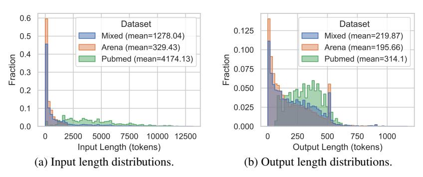

**Figure Description:**
The image is a graphical representation of two bar charts with accompanying text that provide information about input length distributions for datasets labeled "Dataset" and "Fraction". Both charts are set against a white background with grid lines indicating numerical values along both axes.

On the left side of the image, there's a chart titled "Input Length (tokens)" which shows three bars corresponding to different categories: "Mixed", "Arena", and "Pubmed". Each category has a blue rectangle representing its distribution. The x-axis lists numbers ranging from 0 to 2500 tokens, while the y-axis indicates probabilities ranging from 0 to 1. The peak of each bar suggests a concentration of data points within certain ranges of token count.

The right side of the image features another chart titled "Output Length (tokens)", also showing three bars for "Mixed", "Arena", and "Pubmed". This chart includes additional labels such as "Mixed (mean=219.87, stddev=364.19)" and "Arena (mean=195.66, stddev=364.19)" alongside their respective bars, providing quantitative details about the mean and standard deviation of these output lengths. Similarly, the "Pubmed" bar is accompanied by "Pubmed (mean=314.1, stddev=364.19)".

Both charts have a vertical dashed line at approximately 2500 tokens, marking a significant threshold or point of interest in the context of the study or analysis represented by the graphs.

At the bottom of the image, there's a note stating "(a) Input length distributions." and "(b) Output length distributions.", suggesting that part (a) refers to the input length distribution shown on the left, and part (b) refers to the output length distribution depicted on the right. These notes clarify the relationship between the two sets of data presented visually.

Figure 10: Dataset input and output length distributions.

**Mélange Configuration.** Bucket size ranges correspond to Figure 5, comprising of 10 input length ranges and 6 output length ranges (60 total buckets). The slice factor is set to 8 for a total of  $60 \cdot 8 = 480$  slices.

**Baselines.** We compare Mélange to allocations that use a single GPU type. To derive baseline allocations, we use Mélange's ILP formulation (§ 5.4.3) but restrict the solver to a single GPU type.

#### 6.2 Cost Savings Analysis

We compare the deployment costs of Mélange to the single-GPU-type baselines across datasets and SLOs. Fig. 11 displays costs normalized against the cost of Mélange (purple dotted lines), and the detailed GPU allocations and cost savings are included in App. C. The A10G-only and L4-only baselines are only included for the Arena dataset because the PubMed and Mixed datasets contain large requests that exceed A10G and L4's GPU memory capacity. L4 and A10G are included in Mélange's allocation but are limited to serving requests smaller than 12,000 tokens. We now discuss each dataset in detail:

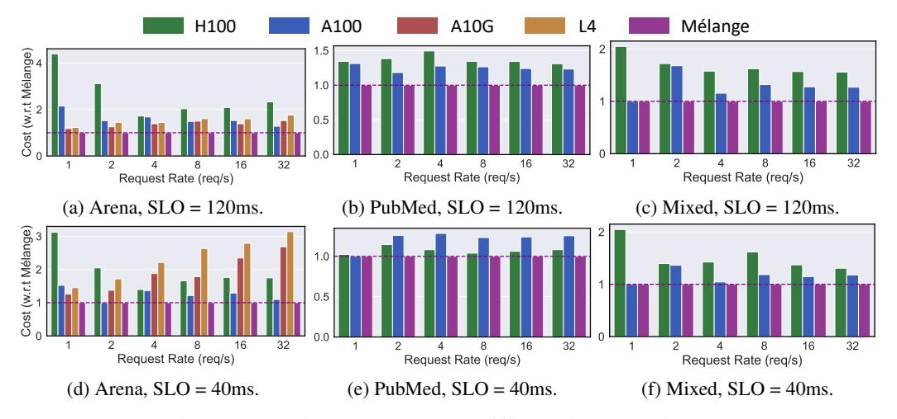

**Figure Description:**
The image displays a series of four bar charts, each representing different data sets with varying request rates (in reqs/sec) for two types of operations: Arena and SLO. Each chart is labeled with the operation type it represents and includes bars corresponding to three different latency thresholds: A100, A10G, and L4. These labels are color-coded, indicating which threshold corresponds to each bar.

The first chart at the top left shows cost per million requests (Malange), with bars for all three latencies. The second chart below it also depicts Malange but focuses on the request rate rather than cost. It has bars for both Arena and SLO operations across the same latency thresholds.

The third chart from the bottom left compares the request rate between Mixed, SL0, and XLO operations within the context of the Arena operation. This chart uses the same latency thresholds as the previous ones.

Finally, the fourth chart at the bottom right presents the request rate for the SLO operation under various latency conditions. Similar to the other charts, it includes bars for Mixed, SL0, and XLO operations.

Each chart contains numerical values that indicate the number of requests made during the test period or the average request rate if the time frame is not specified. For example, in the first chart, the value next to "A100" indicates the cost per million requests for the Arena operation when using an A100 latency threshold. Similarly, subsequent charts show the request rate for different operations and latency settings.

Overall, these charts provide a visual comparison of how different operations perform under varying latency constraints, likely used for performance analysis or benchmarking purposes.

Figure 11: Deployment cost across different datasets and SLOs.

- Short-context Dataset (Arena). In Figs. 11a and 11d, Mélange achieves 15-77% cost reduction (120ms SLO) and 9-68% reduction (40ms SLO). For both SLOs, L4/A10G are more cost efficient than A100/H100 at low request rates because they achieve greater utilization. For example, at 1-2 req/s, H100 is significantly underutilized and incurs exorbitant costs. However, as the rate increases, L4/A10G's cost advantage reduces as A100/H100 are better utilized. Further, with a 120ms SLO, L4/A10G remain competitive with A100 even at higher request rates due to their T/\$ advantage for smaller request sizes (which the Arena dataset is skewed towards). Conversely, with a 40ms SLO, A10G/L4 show much higher relative costs due to their increased latency, requiring more instances to meet the tight deadline. Mélange adapts by allocating more L4/A10G at 120ms SLO and more A100 at 40ms SLO, consistently reducing overall cost.
- Long-context Dataset (PubMed). In Figs. 11b and 11e, Mélange achieves 15-33% cost reduction (120ms SLO) and 2-22% reduction (40ms SLO). A100 generally achieves higher T/\$ for the request sizes in PubMed, evidenced by the 120ms setting where A100-only is consistently cheaper than H100-only. However, when SLO tightens to 40ms, H100 is the clear winner due to H100's lower inference latency. Again, Mélange adapts to these dynamics by allocating a greater share of A100s at a looser SLO, and more H100s as the SLO is tightened.
- *Mixed-context Dataset*. In Figs. 11c and 11f, Mélange achieves 13-51% cost reduction (120ms SLO) and 4-51% reduction (40ms SLO). Compared to the PubMed workload, A100-only has much greater cost efficiency in the Mixed workload than H100 due to a greater portion of short-context requests, for which A100 achieves greater T/\$. Mélange capitalizes by using more A100 than H100, but it also uses L4/A10Gs for small requests, enabling even further cost reduction.

**Takeaways.** These results exemplify the core observations from § 4, which show that request size, SLO, and request rate all jointly determine cost efficiency. As any of these LLM service characteristics vary, Mélange flexibly adjusts its GPU allocation and mixes GPU types to exploit their heterogeneity. This consistently delivers the most cost efficient allocation across each evaluated dataset with both strict (40ms) and loose (120ms) SLOs, achieving up to a 77% cost reduction.

#### 6.3 SLO Satisfaction

Next, we assess Mélange adherence to TPOT SLOs. We provision cloud GPU instances based on Mélange's allocation for each dataset and SLO at a rate of 4 req/s. We deploy Llama-2-7b on each GPU and sample requests randomly from the chosen dataset to serve 2K total requests. We record the average TPOT for each request.

Load Balancer. A load balancer (LB) is required to balance requests across GPUs. Our LB design is detailed in Appendix [A.2.](#page-14-8) In short, the LB uses previously-served requests to estimate the output length of a new request, which is then routed to a GPU based on a weighted random selection.

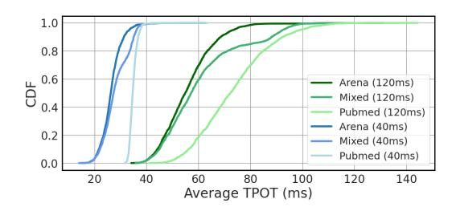

**Figure Description:**
The image is a graph with multiple lines representing different data sets or conditions over time (measured in seconds). Each line has labels indicating the type of data it represents: "Arena (120ms)", "Mixed (120ms)", "Pubmed (40ms)", "Pubmed (40ms)", and "Publmed (40ms)". These labels suggest that each line corresponds to an experiment involving publication times for articles related to arenas, mixed topics, and publications from PubMed with various latencies.

The x-axis of the graph indicates average TPOT (Time Per Operation Total), which seems to be a measure of processing speed or efficiency. This axis ranges from approximately 60 to 80 seconds.

On the y-axis, there are numerical values ranging from 0.0 to 1.0, likely representing some form of performance metric or error rate associated with these operations.

Each line shows fluctuations in the value as time progresses, suggesting variability in the measured quantity across the different experiments or conditions represented by the lines. The specific nature of TPOT and its relevance to the context of the graph would require additional information not provided within the image itself.

Figure 12: Mélange TPOT CDFs.

Weights are computed based on each GPU's performance for the request's estimated size.

Results. [Fig. 12](#page-10-0) presents CDFs of the observed per-request average TPOTs across experiments. With an SLO of 120ms, over 99.95% of requests met SLO. When the SLO was tightened to 40ms, 99.5% of requests met SLO. These results validate Mélange's ability to choose GPU allocations that meet workload demand, however, we recognize that services may require even higher SLO adherence, so we investigated the source of SLO violations in our experiment.

SLO Violation Investigation. 84% of our experiment's SLO violations were due to *a)* request rate bursts or *b)* co-location with large requests. We send requests by a Poisson process, which occasionally creates short-lived bursts that overload GPU capacity. Further, we randomly sample request sizes from the chosen dataset. Occasionally, a series of large requests are chosen in sequence and temporarily exceed service capacity. In an online production environment, resource over-provisioning is used to absorb such bursts and other load variations. In Mélange, a desired over-provisioning rate (e.g., 10%) can be achieved by increasing the request rate input to the solver by the same proportion.

#### 6.4 Solver Time

We detail the solver execution time in [Tab. 2.](#page-15-1) Across all datasets and request rates, the solver's execution time remains under 1.2 seconds, which is negligible compared to service lifetime. We observe a modest increase in solver time with higher request volumes due to greater complexity in slice assignment. However, this increase is empirically sub-linear relative to the increase in request rate, and the solver's execution time remains practical.

### 7 Limitations and Conclusion

Limitations. Mélange derives the optimal GPU allocation for a fixed workload distribution and request rate, but does not address other deployment challenges such as GPU unavailability or autoscaling for dynamic request rates and size distributions. Mélange is only intended to make allocation decisions, a key component to be plugged into a broader serving system that handles these deployment challenges. Given the vast number of LLM deployment configurations (quantization and compression, disaggregated prefill, speculative decoding), we have not exhaustively evaluated each setting. We expect, however, that Mélange's framework is flexible to support each of these settings.

Conclusion. We introduce Mélange, a framework for deriving the minimal-cost GPU allocation for a given LLM service. Mélange is based on our analysis of GPU cost efficiency, which identifies three key service characteristics (request sizes, request rates, and SLOs) as significant influences on cost efficiency. We formulate the GPU allocation task as a cost-aware bin packing problem that accounts for each service characteristic, enabling flexibility and heterogeneity-awareness. In evaluations on a range of GPUs, request sizes, request rates, and latency SLOs, Mélange consistently demonstrates significant reductions in deployment costs (up to 77%) while providing high SLO attainment.

# References

- [1] Amey Agrawal, Ashish Panwar, Jayashree Mohan, Nipun Kwatra, Bhargav S Gulavani, and Ramachandran Ramjee. Sarathi: Efficient llm inference by piggybacking decodes with chunked prefills. *arXiv preprint arXiv:2308.16369*, 2023.
- [2] Ahsan Ali, Riccardo Pinciroli, Feng Yan, and Evgenia Smirni. Optimizing inference serving on serverless platforms. *Proceedings of the VLDB Endowment*, 15(10), 2022.
- [3] AnyScale. Anyscale: Llmperf leaderboard. [https://github.com/ray-project/](https://github.com/ray-project/llmperf-leaderboard) [llmperf-leaderboard](https://github.com/ray-project/llmperf-leaderboard), 2024. [Accessed 13-03-2024].
- [4] AWS. Ai accelerator-aws trainium. [https://aws.amazon.com/machine-learning/](https://aws.amazon.com/machine-learning/trainium/) [trainium/](https://aws.amazon.com/machine-learning/trainium/), 2020. [Accessed 14-03-2024].
- [5] Alexander Borzunov, Dmitry Baranchuk, Tim Dettmers, Max Ryabinin, Younes Belkada, Artem Chumachenko, Pavel Samygin, and Colin Raffel. Petals: Collaborative inference and fine-tuning of large models. *arXiv preprint arXiv:2209.01188*, 2022.
- [6] Shubham Chaudhary, Ramachandran Ramjee, Muthian Sivathanu, Nipun Kwatra, and Srinidhi Viswanatha. Balancing efficiency and fairness in heterogeneous gpu clusters for deep learning. In *Proceedings of the Fifteenth European Conference on Computer Systems*, pages 1–16, 2020.
- [7] Arman Cohan, Franck Dernoncourt, Doo Soon Kim, Trung Bui, Seokhwan Kim, Walter Chang, and Nazli Goharian. A discourse-aware attention model for abstractive summarization of long documents. *Proceedings of the 2018 Conference of the North American Chapter of the Association for Computational Linguistics: Human Language Technologies, Volume 2 (Short Papers)*, 2018.
- [8] Tri Dao, Dan Fu, Stefano Ermon, Atri Rudra, and Christopher Ré. Flashattention: Fast and memory-efficient exact attention with io-awareness. *Advances in Neural Information Processing Systems*, 35:16344–16359, 2022.
- [9] Elias Frantar and Dan Alistarh. Sparsegpt: Massive language models can be accurately pruned in one-shot, 2023.
- [10] Elias Frantar, Saleh Ashkboos, Torsten Hoefler, and Dan Alistarh. Gptq: Accurate post-training quantization for generative pre-trained transformers. *arXiv preprint arXiv:2210.17323*, 2022.
- [11] Jashwant Raj Gunasekaran, Cyan Subhra Mishra, Prashanth Thinakaran, Bikash Sharma, Mahmut Taylan Kandemir, and Chita R Das. Cocktail: A multidimensional optimization for model serving in cloud. In *19th USENIX Symposium on Networked Systems Design and Implementation (NSDI 22)*, pages 1041–1057, 2022.
- [12] Aaron Harlap, Andrew Chung, Alexey Tumanov, Gregory R Ganger, and Phillip B Gibbons. Tributary: spot-dancing for elastic services with latency {SLOs}. In *2018 USENIX Annual Technical Conference (USENIX ATC 18)*, pages 1–14, 2018.
- [13] Kaiming He, Xiangyu Zhang, Shaoqing Ren, and Jian Sun. Deep residual learning for image recognition, 2015.
- [14] Cunchen Hu, Heyang Huang, Liangliang Xu, Xusheng Chen, Jiang Xu, Shuang Chen, Hao Feng, Chenxi Wang, Sa Wang, Yungang Bao, et al. Inference without interference: Disaggregate llm inference for mixed downstream workloads. *arXiv preprint arXiv:2401.11181*, 2024.
- [15] Youhe Jiang, Ran Yan, Xiaozhe Yao, Beidi Chen, and Binhang Yuan. Hexgen: Generative inference of foundation model over heterogeneous decentralized environment. *arXiv preprint arXiv:2311.11514*, 2023.
- [16] Yunho Jin, Chun-Feng Wu, David Brooks, and Gu-Yeon Wei. S3: Increasing gpu utilization during generative inference for higher throughput. *Advances in Neural Information Processing Systems*, 36, 2024.

- [17] Norman P Jouppi, Cliff Young, Nishant Patil, David Patterson, Gaurav Agrawal, Raminder Bajwa, Sarah Bates, Suresh Bhatia, Nan Boden, Al Borchers, et al. In-datacenter performance analysis of a tensor processing unit. In *Proceedings of the 44th annual international symposium on computer architecture*, pages 1–12, 2017.
- [18] Sehoon Kim, Karttikeya Mangalam, Suhong Moon, Jitendra Malik, Michael W Mahoney, Amir Gholami, and Kurt Keutzer. Speculative decoding with big little decoder. *Advances in Neural Information Processing Systems*, 36, 2024.
- [19] Woosuk Kwon, Zhuohan Li, Siyuan Zhuang, Ying Sheng, Lianmin Zheng, Cody Hao Yu, Joseph Gonzalez, Hao Zhang, and Ion Stoica. Efficient memory management for large language model serving with pagedattention. In *Proceedings of the 29th Symposium on Operating Systems Principles*, pages 611–626, 2023.
- [20] Yaniv Leviathan, Matan Kalman, and Yossi Matias. Fast inference from transformers via speculative decoding. In *International Conference on Machine Learning*, pages 19274–19286. PMLR, 2023.
- [21] Ji Lin, Jiaming Tang, Haotian Tang, Shang Yang, Xingyu Dang, and Song Han. Awq: Activation-aware weight quantization for llm compression and acceleration. *arXiv preprint arXiv:2306.00978*, 2023.
- [22] Jiachen Liu, Zhiyu Wu, Jae-Won Chung, Fan Lai, Myungjin Lee, and Mosharaf Chowdhury. Andes: Defining and enhancing quality-of-experience in llm-based text streaming services. *arXiv preprint arXiv:2404.16283*, 2024.
- [23] Liang Luo, Peter West, Pratyush Patel, Arvind Krishnamurthy, and Luis Ceze. Srifty: Swift and thrifty distributed neural network training on the cloud. *Proceedings of Machine Learning and Systems*, 4:833–847, 2022.
- [24] Yusuf Mehdi. Reinventing search with a new ai-powered microsoft bing and edge, your copilot for the web, 2023. Accessed: 2024-02-21.
- [25] Xupeng Miao, Chunan Shi, Jiangfei Duan, Xiaoli Xi, Dahua Lin, Bin Cui, and Zhihao Jia. Spotserve: Serving generative large language models on preemptible instances. *arXiv preprint arXiv:2311.15566*, 2023.
- [26] Xupeng Miao, Yining Shi, Zhi Yang, Bin Cui, and Zhihao Jia. Sdpipe: A semi-decentralized framework for heterogeneity-aware pipeline-parallel training. *Proceedings of the VLDB Endowment*, 16(9):2354–2363, 2023.
- [27] Xupeng Miao, Yujie Wang, Youhe Jiang, Chunan Shi, Xiaonan Nie, Hailin Zhang, and Bin Cui. Galvatron: Efficient transformer training over multiple gpus using automatic parallelism. *arXiv preprint arXiv:2211.13878*, 2022.
- [28] Microsoft. Copilot, 2023. Accessed: 2024-02-21.
- [29] Stuart Mitchell. PuLP: A linear programming toolkit for python. [https://github.com/](https://github.com/coin-or/pulp) [coin-or/pulp](https://github.com/coin-or/pulp), 2023. Accessed: 2024-02-25.
- [30] Deepak Narayanan, Keshav Santhanam, Fiodar Kazhamiaka, Amar Phanishayee, and Matei Zaharia. {Heterogeneity-Aware} cluster scheduling policies for deep learning workloads. In *14th USENIX Symposium on Operating Systems Design and Implementation (OSDI 20)*, pages 481–498, 2020.
- [31] Nvidia. A10 gpu spec, 2024. Accessed: 2024-03-10.
- [32] Nvidia. A100 gpu spec, 2024. Accessed: 2024-03-10.
- [33] Nvidia. Gpus, 2024. Accessed: 2024-03-10.
- [34] OpenAI. Chatgpt, 2022. Accessed: 2024-02-21.
- [35] OpenAI. Gpt-4 technical report. *arXiv*, pages 2303–08774, 2023.

- [36] Pratyush Patel, Esha Choukse, Chaojie Zhang, Íñigo Goiri, Aashaka Shah, Saeed Maleki, and Ricardo Bianchini. Splitwise: Efficient generative llm inference using phase splitting. *arXiv preprint arXiv:2311.18677*, 2023.
- [37] Elizabeth Reid. Supercharging search with generative ai, 2023. Accessed: 2024-02-21.
- [38] Francisco Romero, Qian Li, Neeraja J Yadwadkar, and Christos Kozyrakis. {INFaaS}: Automated model-less inference serving. In *2021 USENIX Annual Technical Conference (USENIX ATC 21)*, pages 397–411, 2021.
- [39] RunPod. Runpod, 2024. Accessed: 2024-02-24.
- [40] FlashInfer team. Accelerating self-attentions for llm serving with flashinfer, 2024. Accessed: 2024-02-24.
- [41] Surat Teerapittayanon, Bradley McDanel, and Hsiang-Tsung Kung. Branchynet: Fast inference via early exiting from deep neural networks. In *2016 23rd international conference on pattern recognition (ICPR)*, pages 2464–2469. IEEE, 2016.
- [42] John Thorpe, Pengzhan Zhao, Jonathan Eyolfson, Yifan Qiao, Zhihao Jia, Minjia Zhang, Ravi Netravali, and Guoqing Harry Xu. Bamboo: Making preemptible instances resilient for affordable training of large {DNNs}. In *20th USENIX Symposium on Networked Systems Design and Implementation (NSDI 23)*, pages 497–513, 2023.
- [43] Hugo Touvron, Thibaut Lavril, Gautier Izacard, Xavier Martinet, Marie-Anne Lachaux, Timothée Lacroix, Baptiste Rozière, Naman Goyal, Eric Hambro, Faisal Azhar, et al. Llama: Open and efficient foundation language models. *arXiv preprint arXiv:2302.13971*, 2023.
- [44] Hugo Touvron, Louis Martin, Kevin Stone, Peter Albert, Amjad Almahairi, Yasmine Babaei, Nikolay Bashlykov, Soumya Batra, Prajjwal Bhargava, Shruti Bhosale, et al. Llama 2: Open foundation and fine-tuned chat models. *arXiv preprint arXiv:2307.09288*, 2023.
- [45] Abhi Venigalla. Databricks: Training llms at scale with amd mi250 gpus. [https://www.](https://www.databricks.com/blog/training-llms-scale-amd-mi250-gpus) [databricks.com/blog/training-llms-scale-amd-mi250-gpus](https://www.databricks.com/blog/training-llms-scale-amd-mi250-gpus), 2023. [Accessed 14- 03-2024].
- [46] Bingyang Wu, Yinmin Zhong, Zili Zhang, Gang Huang, Xuanzhe Liu, and Xin Jin. Fast distributed inference serving for large language models. *arXiv preprint arXiv:2305.05920*, 2023.
- [47] Qingyun Wu, Gagan Bansal, Jieyu Zhang, Yiran Wu, Beibin Li, Erkang Zhu, Li Jiang, Xiaoyun Zhang, Shaokun Zhang, Jiale Liu, Ahmed Hassan Awadallah, Ryen W White, Doug Burger, and Chi Wang. Autogen: Enabling next-gen llm applications via multi-agent conversation, 2023.
- [48] Yiran Wu, Feiran Jia, Shaokun Zhang, Hangyu Li, Erkang Zhu, Yue Wang, Yin Tat Lee, Richard Peng, Qingyun Wu, and Chi Wang. An empirical study on challenging math problem solving with gpt-4. In *ArXiv preprint arXiv:2306.01337*, 2023.
- [49] Guangxuan Xiao, Ji Lin, Mickael Seznec, Hao Wu, Julien Demouth, and Song Han. Smoothquant: Accurate and efficient post-training quantization for large language models. In *International Conference on Machine Learning*, pages 38087–38099. PMLR, 2023.
- [50] Zhewei Yao, Reza Yazdani Aminabadi, Minjia Zhang, Xiaoxia Wu, Conglong Li, and Yuxiong He. Zeroquant: Efficient and affordable post-training quantization for large-scale transformers. *Advances in Neural Information Processing Systems*, 35:27168–27183, 2022.
- [51] Gyeong-In Yu, Joo Seong Jeong, Geon-Woo Kim, Soojeong Kim, and Byung-Gon Chun. Orca: A distributed serving system for {Transformer-Based} generative models. In *16th USENIX Symposium on Operating Systems Design and Implementation (OSDI 22)*, pages 521–538, 2022.
- [52] Manzil Zaheer, Guru Guruganesh, Kumar Avinava Dubey, Joshua Ainslie, Chris Alberti, Santiago Ontanon, Philip Pham, Anirudh Ravula, Qifan Wang, Li Yang, et al. Big bird: Transformers for longer sequences. *Advances in neural information processing systems*, 33:17283–17297, 2020.

- [53] Chengliang Zhang, Minchen Yu, Wei Wang, and Feng Yan. {MArk}: Exploiting cloud services for {Cost-Effective},{SLO-Aware} machine learning inference serving. In *2019 USENIX Annual Technical Conference (USENIX ATC 19)*, pages 1049–1062, 2019.
- [54] Zhenyu Zhang, Ying Sheng, Tianyi Zhou, Tianlong Chen, Lianmin Zheng, Ruisi Cai, Zhao Song, Yuandong Tian, Christopher Ré, Clark Barrett, et al. H2o: Heavy-hitter oracle for efficient generative inference of large language models. *Advances in Neural Information Processing Systems*, 36, 2024.
- [55] Lianmin Zheng, Wei-Lin Chiang, Ying Sheng, Siyuan Zhuang, Zhanghao Wu, Yonghao Zhuang, Zi Lin, Zhuohan Li, Dacheng Li, Eric. P Xing, Hao Zhang, Joseph E. Gonzalez, and Ion Stoica. Judging llm-as-a-judge with mt-bench and chatbot arena, 2023.
- [56] Lianmin Zheng, Liangsheng Yin, Zhiqiang Xie, Jeff Huang, Chuyue Sun, Cody Hao Yu, Shiyi Cao, Christos Kozyrakis, Ion Stoica, Joseph E Gonzalez, et al. Efficiently programming large language models using sglang. *arXiv preprint arXiv:2312.07104*, 2023.
- [57] Zangwei Zheng, Xiaozhe Ren, Fuzhao Xue, Yang Luo, Xin Jiang, and Yang You. Response length perception and sequence scheduling: An llm-empowered llm inference pipeline. *Advances in Neural Information Processing Systems*, 36, 2024.
- [58] Yinmin Zhong, Shengyu Liu, Junda Chen, Jianbo Hu, Yibo Zhu, Xuanzhe Liu, Xin Jin, and Hao Zhang. Distserve: Disaggregating prefill and decoding for goodput-optimized large language model serving. *arXiv preprint arXiv:2401.09670*, 2024.
- [59] Wangchunshu Zhou, Canwen Xu, Tao Ge, Julian McAuley, Ke Xu, and Furu Wei. Bert loses patience: Fast and robust inference with early exit. *Advances in Neural Information Processing Systems*, 33:18330–18341, 2020.
- [60] Banghua Zhu, Ying Sheng, Lianmin Zheng, Clark Barrett, Michael Jordan, and Jiantao Jiao. Towards optimal caching and model selection for large model inference. *Advances in Neural Information Processing Systems*, 36, 2024.

### A Experiment Setup

### A.1 Dataset

We test Mélange's performance on three different datasets listed below:

- Short context: This scenario simulates real-time conversational dynamics by employing the Chatbot Arena dataset (lmsys/lmsys-chat-1m) [\[55\]](#page-14-7), which is derived from real-world chatbot conversations. The dataset is skewed towards shorter context (< 2000 tokens) because much of the data was generated in conversation with models that did not yet have a larger context window.
- Long context: This scenario represents tasks with extensive input, such as summarization. We utilize the PubMed dataset (ccdv/pubmed-summarization) [\[7\]](#page-11-14), comprising 133 thousand scientific papers from PubMed.com, a popular dataset for large-scale text summarization studies.
- Mixed long/short context: This scenario captures settings with a combination of long and short context, such as an assistant that engages in succinct dialogue and responds to large document-based queries. To model this, we create a synthetic dataset by sampling 80% of requests from the Arena dataset and 20% of requests from the PubMed dataset.

#### A.2 Load Balancer

The load balancer (LB) policy used in our evaluations in § [6.3](#page-10-1) is as follows. For each input length bucket range (§ [5.4.1\)](#page-7-0), the LB tracks the average of all previously-seen output lengths. Upon receiving a new request, the LB uses this average as an estimate for the new request's output length, allowing the LB to identify the specific request size bucket the request belongs in. The LB then makes a weighted random selection of a GPU backend to forward the request to. A GPU's weights are computed based on the proportion of the GPU's maximum throughput for request sizes of the new request's bucket to the aggregate throughput of all GPUs. This is a simple policy we use to demonstrate the efficacy of Mélange, and leave it as future work to develop load balancers for serving LLMs on heterogeneous GPUs.

### B Solver Time

We present the solver execution time from each experiment in Table [2.](#page-15-1)

| Request Rate | Arena, SLO=120ms | Arena, SLO=40ms | PubMed, SLO=120ms | PubMed, SLO=40ms | Mix, SLO=120ms | Mix, SLO=40ms |
|--------------|------------------|-----------------|-------------------|------------------|----------------|---------------|
| 1            | 0.137            | 0.177           | 0.232             | 0.295            | 0.168          | 0.336         |
| 2            | 0.194            | 0.265           | 0.234             | 0.334            | 0.253          | 0.381         |
| 4            | 0.192            | 0.346           | 0.287             | 0.381            | 0.297          | 0.459         |
| 8            | 0.248            | 0.433           | 0.269             | 0.384            | 0.321          | 0.545         |
| 16           | 0.299            | 0.448           | 0.389             | 0.509            | 0.439          | 0.537         |
| 32           | 0.316            | 0.494           | 0.791             | 0.96             | 0.912          | 1.14          |

Table 2: Solver execution time.

### C Instance Allocations

We present the instance allocations for each experiment in the tables below.

| Rate (req/s) | Solver    | L4 | A10G | A100 | H100 | Norm. Cost (\$/hr) | Savings |
|--------------|-----------|----|------|------|------|-----------------------|---------|
| 1            | Mélange   | 1  | 1    |      |      | 1.71                  | N/A     |
|              | H100-only |    |      |      | 1    | 7.516                 | 77.25%  |
|              | A100-only |    |      | 1    |      | 3.67                  | 53.41%  |
|              | A10G-only |    | 2    |      |      | 2.02                  | 15.35%  |
|              | L4-only   | 3  |      |      |      | 2.1                   | 18.57%  |
| 2            | Mélange   | 2  | 1    |      |      | 2.41                  | N/A     |
|              | H100-only |    |      |      | 1    | 7.516                 | 67.94%  |
|              | A100-only |    |      | 1    |      | 3.67                  | 34.33%  |
|              | A10G-only |    | 3    |      |      | 3.03                  | 20.46%  |
|              | L4-only   | 5  |      |      |      | 3.5                   | 31.14%  |
| 4            | Mélange   | 1  |      | 1    |      | 4.37                  | N/A     |
|              | H100-only |    |      |      | 1    | 7.516                 | 41.86%  |
|              | A100-only |    |      | 2    |      | 7.34                  | 40.46%  |
|              | A10G-only |    | 6    |      |      | 6.06                  | 27.89%  |
|              | L4-only   | 9  |      |      |      | 6.3                   | 30.63%  |
| 8            | Mélange   | 1  | 3    | 1    |      | 7.4                   | N/A     |
|              | H100-only |    |      |      | 2    | 15.032                | 50.77%  |
|              | A100-only |    |      | 3    |      | 11.01                 | 32.79%  |
|              | A10G-only |    | 11   |      |      | 11.1                  | 33.39%  |
|              | L4-only   | 17 |      |      |      | 11.9                  | 37.82%  |
| 16           | Mélange   | 2  | 2    | 3    |      | 14.43                 | N/A     |
|              | H100-only |    |      |      | 4    | 30.064                | 52.00%  |
|              | A100-only |    |      | 6    |      | 22.02                 | 34.47%  |
|              | A10G-only |    | 20   |      |      | 20.2                  | 28.56%  |
|              | L4-only   | 33 |      |      |      | 23.1                  | 37.53%  |
| 32           | Mélange   | 2  | 6    | 5    |      | 25.81                 | N/A     |
|              | H100-only |    |      |      | 8    | 60.128                | 57.07%  |
|              | A100-only |    |      | 9    |      | 33.03                 | 21.86%  |
|              | A10G-only |    | 39   |      |      | 39.39                 | 34.48%  |
|              | L4-only   | 65 |      |      |      | 45.5                  | 43.27%  |

Table 3: Instance allocations for the short-context Arena dataset, SLO=120ms.

| Rate (req/s) | Solver    | L4 | A10G | A100 | H100 | Norm. Cost (\$/hr) | Savings |
|--------------|-----------|----|------|------|------|-----------------------|---------|
| 1            | Mélange   |    |      | 1    | 1    | 11.186                | N/A     |
|              | H100-only |    |      |      | 2    | 15.032                | 25.59%  |
|              | A100-Only |    |      | 4    |      | 14.68                 | 23.80%  |
| 2            | Mélange   |    | 3    | 1    | 2    | 21.732                | N/A     |
|              | H100-only |    |      |      | 4    | 30.064                | 27.71%  |
|              | A100-Only |    |      | 7    |      | 25.69                 | 15.41%  |
| 4            | Mélange   |    | 3    | 4    | 3    | 40.258                | N/A     |
|              | H100-only |    |      |      | 8    | 60.128                | 33.05%  |
|              | A100-Only |    |      | 14   |      | 51.38                 | 21.65%  |
| 8            | Mélange   |    |      | 7    | 7    | 78.302                | N/A     |
|              | H100-only |    |      |      | 14   | 105.224               | 25.59%  |
|              | A100-Only |    |      | 27   |      | 99.09                 | 20.98%  |
| 16           | Mélange   |    |      | 12   | 15   | 156.78                | N/A     |
|              | H100-only |    |      |      | 28   | 210.448               | 25.50%  |
|              | A100-Only |    |      | 53   |      | 194.51                | 19.40%  |
| 32           | Mélange   | 1  | 1    | 20   | 32   | 315.622               | N/A     |
|              | H100-only |    |      |      | 55   | 413.38                | 23.65%  |
|              | A100-Only |    |      | 106  |      | 389.02                | 18.87%  |

Table 4: Instance allocations for the long-context PubMed dataset, SLO=120ms.

| Rate (req/s) | Solver    | L4 | A10G | A100 | H100 | Norm. Cost (\$/hr) | Savings |
|--------------|-----------|----|------|------|------|-----------------------|---------|
| 1            | Mélange   |    |      | 1    |      | 3.67                  | N/A     |
|              | H100-only |    |      |      | 1    | 7.516                 | 51.17%  |
|              | A100-Only |    |      | 1    |      | 3.67                  | 0%      |
| 2            | Mélange   | 1  |      | 1    |      | 4.37                  | N/A     |
|              | H100-only |    |      |      | 1    | 7.516                 | 41.86%  |
|              | A100-Only |    |      | 2    |      | 7.34                  | 40.46%  |
| 4            | Mélange   |    | 2    |      | 1    | 9.536                 | N/A     |
|              | H100-only |    |      |      | 2    | 15.032                | 36.56%  |
|              | A100-Only |    |      | 3    |      | 11.01                 | 13.39%  |
| 8            | Mélange   | 1  | 2    | 1    | 1    | 13.906                | N/A     |
|              | H100-only |    |      |      | 3    | 22.548                | 38.33%  |
|              | A100-Only |    |      | 5    |      | 18.35                 | 24.22%  |
| 16           | Mélange   | 1  | 2    | 3    | 2    | 28.762                | N/A     |
|              | H100-only |    |      |      | 6    | 45.096                | 36.22%  |
|              | A100-Only |    |      | 10   |      | 36.7                  | 21.63%  |
| 32           | Mélange   | 1  | 5    | 6    | 4    | 57.834                | N/A     |
|              | H100-only |    |      |      | 12   | 90.192                | 35.88%  |
|              | A100-Only |    |      | 20   |      | 73.4                  | 21.21%  |

Table 5: Instance allocations for the mixed context dataset, SLO=120ms.

| Rate | Solver    | L4  | A10G | A100 | H100 | Norm. Cost (\$/hr) | Savings |
|------|-----------|-----|------|------|------|-----------------------|---------|
| 1    | Mélange   | 2   | 1    |      |      | 2.41                  | N/A     |
|      | H100-only |     |      |      | 1    | 7.516                 | 67.94%  |
|      | A100-only |     |      | 1    |      | 3.67                  | 34.33%  |
|      | A10G-only |     | 3    |      |      | 3.03                  | 20.46%  |
|      | L4-only   | 5   |      |      |      | 3.5                   | 31.14%  |
| 2    | Mélange   |     |      | 1    |      | 3.67                  | N/A     |
|      | H100-only |     |      |      | 1    | 7.516                 | 51.17%  |
|      | A100-only |     |      | 1    |      | 3.67                  | 0.00%   |
|      | A10G-only |     | 5    |      |      | 5.05                  | 27.33%  |
|      | L4-only   | 9   |      |      |      | 6.3                   | 41.75%  |
| 4    | Mélange   | 1   | 1    | 1    |      | 5.38                  | N/A     |
|      | H100-only |     |      |      | 1    | 7.516                 | 28.42%  |
|      | A100-only |     |      | 2    |      | 7.34                  | 26.70%  |
|      | A10G-only |     | 10   |      |      | 10.1                  | 46.73%  |
|      | L4-only   | 17  |      |      |      | 11.9                  | 54.79%  |
| 8    | Mélange   | 1   | 1    | 2    |      | 9.05                  | N/A     |
|      | H100-only |     |      |      | 3    | 15.032                | 39.80%  |
|      | A100-only |     |      | 3    |      | 11.01                 | 17.80%  |
|      | A10G-only |     | 16   |      |      | 16.16                 | 44.00%  |
|      | L4-only   | 34  |      |      |      | 23.8                  | 61.97%  |
| 16   | Mélange   |     | 6    | 3    |      | 17.07                 | N/A     |
|      | H100-only |     |      |      | 4    | 30.064                | 43.22%  |
|      | A100-only |     |      | 6    |      | 22.02                 | 22.48%  |
|      | A10G-only |     | 40   |      |      | 40.4                  | 57.75%  |
|      | L4-only   | 68  |      |      |      | 47.6                  | 64.14%  |
| 32   | Mélange   |     | 8    | 6    |      | 30.1                  | N/A     |
|      | H100-only |     |      |      | 7    | 52.612                | 42.79%  |
|      | A100-only |     |      | 9    |      | 33.03                 | 8.87%   |
|      | A10G-only |     | 80   |      |      | 80.8                  | 62.75%  |
|      | L4-only   | 135 |      |      |      | 94.5                  | 68.15%  |

Table 6: Instance allocations for the short-context Arena dataset, SLO=40ms.

| Rate (req/s) | Solver    | L4 | A10G | A100 | H100 | Norm. Cost (\$/hr) | Savings |
|--------------|-----------|----|------|------|------|-----------------------|---------|
| 1            | Mélange   |    |      | 4    |      | 14.68                 | N/A     |
|              | H100-only |    |      |      | 2    | 15.032                | 2.34%   |
|              | A100-Only |    |      | 4    |      | 14.68                 | 0.00%   |
| 2            | Mélange   |    |      | 1    | 3    | 26.218                | N/A     |
|              | H100-only |    |      |      | 4    | 30.064                | 12.79%  |
|              | A100-Only |    |      | 9    |      | 33.03                 | 20.62%  |
| 4            | Mélange   |    |      | 3    | 5    | 48.59                 | N/A     |
|              | H100-only |    |      |      | 7    | 52.612                | 7.64%   |
|              | A100-Only |    |      | 17   |      | 62.39                 | 22.12%  |
| 8            | Mélange   |    |      | 3    | 12   | 101.202               | N/A     |
|              | H100-only |    |      |      | 14   | 105.224               | 3.82%   |
|              | A100-Only |    |      | 34   |      | 124.78                | 18.90%  |
| 16           | Mélange   |    |      | 11   | 21   | 198.206               | N/A     |
|              | H100-only |    |      |      | 28   | 210.448               | 5.82%   |
|              | A100-Only |    |      | 67   |      | 245.89                | 19.39%  |
| 32           | Mélange   |    |      | 24   | 40   | 388.72                | N/A     |
|              | H100-only |    |      |      | 56   | 420.896               | 7.64%   |
|              | A100-Only |    |      | 133  |      | 488.11                | 20.36%  |

Table 7: Instance allocations for the long-context PubMed dataset, SLO=40ms.

| Rate (req/s) | Solver    | L4 | A10G | A100 | H100 | Norm. Cost (\$/hr) | Savings |
|--------------|-----------|----|------|------|------|-----------------------|---------|
| 1            | Mélange   |    |      | 1    |      | 3.67                  | N/A     |
|              | H100-only |    |      |      | 1    | 7.516                 | 51.17%  |
|              | A100-only |    |      | 1    |      | 3.67                  | 0.00%   |
| 2            | Mélange   | 1  | 1    | 1    |      | 5.38                  | N/A     |
|              | H100-only |    |      |      | 1    | 7.516                 | 28.42%  |
|              | A100-only |    |      | 2    |      | 7.34                  | 26.70%  |
| 4            | Mélange   |    | 3    |      | 1    | 10.546                | N/A     |
|              | H100-only |    |      |      | 2    | 15.032                | 29.84%  |
|              | A100-only |    |      | 3    |      | 11.01                 | 4.21%   |
| 8            | Mélange   | 1  | 3    | 2    | 1    | 18.586                | N/A     |
|              | H100-only |    |      |      | 4    | 30.064                | 38.18%  |
|              | A100-only |    |      | 6    |      | 22.02                 | 15.59%  |
| 16           | Mélange   | 2  | 7    | 2    | 3    | 38.358                | N/A     |
|              | H100-only |    |      |      | 7    | 52.612                | 27.09%  |
|              | A100-only |    |      | 12   |      | 44.04                 | 12.90%  |
| 32           | Mélange   |    | 15   | 6    | 5    | 74.75                 | N/A     |
|              | H100-only |    |      |      | 13   | 97.708                | 23.50%  |
|              | A100-only |    |      | 24   |      | 88.08                 | 15.13%  |

Table 8: Instance allocations for the mixed long/short context dataset, SLO=40ms.