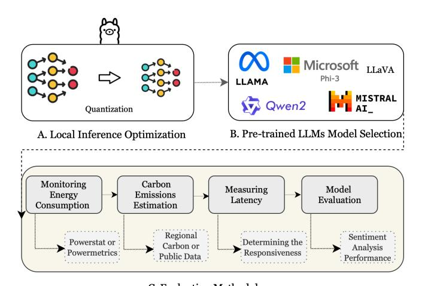

# Optimizing Large Language Models: Metrics, Energy Efficiency, and Case Study Insights

Tahniat Khan *Industry Innovation, Vector Institute* Toronto, Canada tahniat.khan@vectorinstitute.ai

Soroor Motie *Vector Institute, University of Ottawa* Ottawa, Canada smoti088@uottawa.ca

Sedef Akinli Kocak *Industry Innovation, Vector Institute* Toronto, Canada sedef.kocak@vectorinstitute.ai

Shaina Raza *AI Engineering, Vector Institute* Toronto, Canada shaina.raza@vectorinstitute.ai

*Abstract*—The rapid adoption of large language models (LLMs) has led to significant energy consumption and carbon emissions, posing a critical challenge to the sustainability of generative AI technologies. This paper explores the integration of energy-efficient optimization techniques in the deployment of LLMs to address these environmental concerns. We present a case study and framework that demonstrate how strategic quantization and local inference techniques can substantially lower the carbon footprints of LLMs without compromising their operational effectiveness. Experimental results reveal that these methods can reduce energy consumption and carbon emissions by up to 45% post quantization, making them particularly suitable for resource-constrained environments. The findings provide actionable insights for achieving sustainability in AI while maintaining high levels of accuracy and responsiveness.

*Index Terms*—Large Language Models (LLMs), Quantization, Green AI, Carbon Emissions, Energy Efficiency

# I. INTRODUCTION

The increasing computational demands of advanced artificial intelligence (AI), particularly generative models including large language models (LLMs), have motivated significant research and development in *Green AI*. It highlights the importance of adopting sustainable practices to mitigate the rising environmental impact of generative AI technologies [\[4\]](#page-5-0). However, despite these advances, many generative AI applications continue to consume substantial computational resources, leading to increased energy consumption and elevated carbon emissions [\[27\]](#page-5-1). As these generative AI models and applications scale in both size and complexity, they demand frequent data and model updates, creating a potentially unending cycle of energy-intensive processes that could hinder overall progress in sustainable AI [\[27\]](#page-5-1).

Generative AI tools such as ChatGPT, GPT-3, Claude, and Llama demonstrate remarkable capabilities but come with significant ecological costs associated with their development and infrastructure [\[4\]](#page-5-0). Data centers, which support the underlying computational needs of these tools, are estimated to contribute approximately 2–3 [1](#page-0-0) . of global greenhouse gas emissions, with

1https://dl.acm.org/doi/pdf/10.1145/3483410

© 2025 IEEE. Accepted to IEEE CAI 2025, to appear in IEEE Xplore. vation, ensuring that accuracy and responsiveness remain

both energy and water usage rising alongside the rapid growth of global data volumes. Moreover, hyperscale cloud providers, including Amazon AWS, Google Cloud, and Microsoft Azure, commonly use power-intensive GPUs for hosting generative AI models; these GPUs can consume 10–15 times the energy of traditional CPUs, significantly enlarging the technology's carbon footprint [\[2\]](#page-5-2). Understanding the full lifecycle of emissions for machine learning models is therefore essential for tackling these environmental challenges [\[2\]](#page-5-2). Strategies aimed at lowering energy demands across this lifecycle—ranging from pre-training to inference—represent a critical step in achieving sustainable generative AI solutions [\[2\]](#page-5-2).

*a) Motivation:* Motivated by the environmental impact of LLMs, this study seeks to quantify the carbon emissions associated with training and inference for these models. While there is growing recognition of the need for more energyefficient LLMs, the research gap lies in the lack of awareness and practical demonstrations showing similar results can be achieved with lower energy consumption. Addressing this gap requires not only quantifying the environmental footprint of generative AI models but also exploring effective optimization strategies. Moreover, analyzing a specific use case can provide valuable insights into the practical benefits of adopting energyefficient methods while maintaining model performance.

*b) Objectives:* In this work, we examine the metrics and units currently used to measure the environmental footprint of popular generative AI models and evaluate how these metrics change when implementing optimization strategies. We then present a case study demonstrating how targeted optimizations can make generative AI models more energy efficient without compromising their performance in a real-world context.

The primary objectives of this study are threefold:

- To enhance energy efficiency of LLMs by measuring and minimizing energy consumption during inference.
- To reduce carbon emissions by assessing and mitigating the carbon footprint generated in the deployment phase of LLMs.
- To develop a methodology prioritizes performance preser-

at high levels even as we adopt energy-saving techniques.

*c) Contributions:* This study offers several contributions to the growing field of *Green AI*. Primarily, it presents a comprehensive analysis of carbon emissions generated during both the training and inference phases of LLMs, a critical area often overlooked in performance evaluations. Furthermore, the study critically evaluates widely adopted emissions metrics, exploring their dynamic behavior under different optimization strategies. Additional contribution lies in the implementation of a practical optimization framework designed to minimize energy consumption across the model lifecycle. Finally, a detailed case study provides empirical evidence of measurable reductions in carbon footprint and energy consumption achieved without compromising model performance, offering practical guidance for sustainable AI development.

# II. RELATED WORK

In recent years, the convergence of environmental sustainability and AI has led to the emergence of "in *Green AI*", focusing on reducing the carbon footprint of large-scale models through optimization techniques. This section reviews key studies that have contributed to this field, highlighting their contributions to sustainable AI practices.

Efforts to mitigate the environmental impact of LLMs have focused on understanding and reducing their carbon footprint. Studies have quantified the CO2 emissions associated with large-scale models [\[2\]](#page-5-2), [\[4\]](#page-5-0), highlighting significant environmental challenges posed by their extensive parameter sizes and computational demands [\[15\]](#page-5-3). Liu and Yin (2024), in particular, emphasizes the critical role of hardware choices in sustainable AI practices and proposes training methods without compromising performance to reduce carbon emissions [\[15\]](#page-5-3). These foundational insights underscore the urgency of addressing sustainability in LLM development and deployment.

Building on this foundation, several tools and frameworks have been proposed. For example, GreenTrainer [\[12\]](#page-5-4) has been introduced as a fine-tuning approach that dynamically evaluates backpropagation costs and contributions to model accuracy. By reducing floating-point operations (FLOPs) during fine-tuning by up to 64%, GreenTrainer achieves significant energy savings without compromising model performance [\[12\]](#page-5-4). Likewise, Avatar focuses on creating compact, energyefficient models optimized for deployment on individual devices [\[23\]](#page-5-5). By reducing inference latency and model size, this method significantly decreases the carbon footprint of LLM usage while maintaining competitive performance [\[20\]](#page-5-6), illustrating the potential of targeted optimizations [\[17\]](#page-5-7).

In addition to specific optimization techniques, broader frameworks for sustainable AI have been proposed. These frameworks advocate for the integration of energy-efficient algorithms and the alignment of AI practices with global sustainability goals [\[25\]](#page-5-8). For instance, intersection of sustainability and software engineering is well established research area [\[3\]](#page-5-9), [\[7\]](#page-5-10), [\[26\]](#page-5-11) such as exploring strategies for creating ecofriendly solutions that maintain functionality while reducing energy consumption [\[24\]](#page-5-12). Collectively, these studies provide actionable insights and a roadmap for advancing Green AI, addressing immediate environmental concerns, and fostering a sustainable future for AI technologies.

# *A. Carbon Emission Metrics*

Measuring carbon emissions is essential for understanding and reducing the environmental impact of AI systems. Various metrics have been developed to assess emissions across different scopes, intensities, and stages. This subsection outlines widely used metrics, such as Carbon Dioxide Equivalent (CO2e), Carbon Intensity, and Global Warming Potential (GWP) and highlights their role in promoting transparency and sustainability (Table [I\)](#page-1-0).

TABLE I COMMON CARBON EMISSION METRICS IN GREEN AI

| Metric            | Unit     | Definition                  | Reference     |
|-------------------|----------|-----------------------------|---------------|
| Carbon Dioxide | Metric   | A measure of green | IPCC, GHG     |
| Equivalent (CO2e) | tons     | house gases expressed as    | Protocol      |
|                   | (tCO2e)  | CO2 equivalent              |               |
| Carbon Intensity  | gCO2/    | CO2 emissions per unit      | International |
|                   | kWh      | of electricity consumed     | Energy        |
|                   |          |                             | Agency        |
| Scope 1 Emissions | tCO2e    | Direct emissions from | GHG Proto     |
|                   |          | controlled sources          | col           |
| Scope 2 Emissions | tCO2e    | Indirect emissions from     | GHG Proto     |
|                   |          | purchased electricity       | col           |
| Scope 3 Emissions | tCO2e    | Indirect emissions       | GHG Proto     |
|                   |          | across value chains         | col           |
| Net Zero       | tCO2e    | Balance when emissions      | UNFCCC        |
| Emissions         |          | equal removals              |               |
| Energy Consump | MWh      | Total energy consumed       | IEA, EIA      |
| tion              |          |                             |               |
| Global Warming | Ratio    | Heat trapped by a gas       | IPCC          |
| Potential (GWP)   |          | compared to CO2             |               |
| Carbon Offsets    | tCO2e    | Credits for emissions re    | VCS, Gold  |
|                   |          | duction or removal          | Standard      |
| Carbon Capture | tCO2     | CO2 removed and stored      | IEA, IPCC     |
| and Storage (CCS) | captured | to prevent release          |               |

## *B. Quantization Techniques in LLMs*

Quantization [\[11\]](#page-5-13) has emerged as a transformative approach in optimizing LLMs, addressing the dual challenges of computational efficiency and environmental sustainability. It works by converting model parameters from high-precision formats (e.g., 32-bit floating-point) to lower-precision formats (e.g., 8 bit or even 4-bit), thereby reducing memory requirements and accelerating computation. This technique aligns closely with the goals of Green AI, as it minimizes resource usage while maintaining acceptable accuracy.

Research efforts have showcased the potential of quantization as a key technique for enhancing energy efficiency in AI systems. For instance, GPTQ (Accurate Post-Training Quantization for Generative Pre-trained Transformers) [\[9\]](#page-5-14) introduces a method for post-training quantization that retains high model performance despite significant reductions in parameter precision. This method enables efficient deployment of LLMs on edge devices and other constrained environments, directly addressing the environmental concerns highlighted in studies like GreenTrainer [\[12\]](#page-5-4). Another notable approach is LLM-QAT (Quantization-Aware Training for Large Language Models) [\[16\]](#page-5-15), which integrates quantization during the training phase rather than applying it post-training. This method further improves the trade-off between model size and performance, making LLMs more adaptable to energy-efficient deployments. Additionally, SmoothQuant [\[16\]](#page-5-15) employs layer-wise quantization to balance computation and accuracy, achieving state-ofthe-art results in reducing energy use during inference.

# *C. Trade-Offs Between Accuracy and Optimization*

The interplay between accuracy and optimization in machine learning models, particularly LLMs, underscores the challenges in balancing performance with resource efficiency. Techniques like FrugalGPT, described by Chen et al. (2023) [\[5\]](#page-5-16), illustrate how cascading models and leveraging prompt adaptation can reduce costs by up to 98% without compromising accuracy. Similarly, FrugalML shows how selectively routing queries to different APIs can maintain performance while cutting costs by up to 90% [\[5\]](#page-5-16), [\[6\]](#page-5-17). However, the effectiveness of these strategies varies across tasks. For example, reducing token lengths or approximating model outputs might preserve general quality but risks performance drops in nuanced applications like sentiment analysis or summarization [\[22\]](#page-5-18). These findings reveal that while cost and carbon footprint reductions are achievable, ensuring minimal trade-offs in precision, recall, or F1 score remains a complex optimization problem, often requiring task-specific calibrations [\[5\]](#page-5-16), [\[22\]](#page-5-18).

# III. CASE STUDY: SUSTAINABLE DEPLOYMENT OF LARGE LANGUAGE MODELS

# *A. Problem Definition*

LLMs have become integral to various natural language processing applications, yet their soaring computational demands pose significant sustainability challenges. These include high energy consumption, carbon emissions, and escalating operational costs, particularly when using cloud-based infrastructures [\[4\]](#page-5-0). To address these concerns, this study proposes a framework for LLM deployment that emphasizes *local inference*, aiming to mitigate environmental impact while preserving model performance and user experience.

Formally, consider a classification problem with input data

$$X = \{x_1, x_2, \dots, x_N\},\tag{1}$$

and corresponding ground-truth labels

$$Y = \{y_1, y_2, \dots, y_N\}, \quad y_i \in \{1, 2, \dots, K\},$$
 (2)

An LLM-based classifier fθ(·) predicts yˆi = fθ(xi). We seek to minimize energy consumption and carbon emissions while maintaining high predictive accuracy, where accuracy can be quantified using standard metrics such as precision, recall, and F1-score.

## *B. Framework Overview*

The proposed framework (Figure. [1\)](#page-2-0) tackles energy efficiency in LLM deployment through three interconnected components: local inference optimization, the selection of energyefficient LLMs, and a comprehensive evaluation methodology. These components function synergistically to reduce energy consumption without sacrificing predictive accuracy or responsiveness.

**Figure Description:**
The image is a flowchart that illustrates a process for optimizing local infrastructure using machine learning models (LLMs). It begins with two main inputs: "Quantization" and "Monitoring Energy Consumption." These are connected to an "A. Local Inference Optimization" box, which suggests that these factors can be quantified or measured.

From there, the flowchart shows how these inputs are processed through various stages of optimization:

1. **Carbon Emissions Estimation**: This stage involves estimating carbon emissions based on energy consumption monitoring. There's no specific value provided here.
2. **Measuring Latency**: After estimating carbon emissions, the next step is measuring latency. A numerical value of "0.5 ms" is given as an example of latency measurement.
3. **Model Evaluation**: Following latency measurement, model evaluation takes place. Here, another numerical value is mentioned, but it's not clear if it represents some form of performance metric or error rate.
4. **Powerstat or Public Data**: At this point, power statistics or public data are considered. No numerical values are shown at this juncture.
5. **Determining the Responsiveness**: Next, responsiveness is determined. However, the chart does not provide any numerical representation of this determination.
6. **Regional Carbon or Public Data**: Finally, regional carbon emissions or public data are taken into account. Again, no numbers are visible here.
7. **Sentiment Analysis Performance**: Lastly, sentiment analysis performance is evaluated, although no numerical figures are present in the image.

The overall structure of the flowchart indicates a systematic approach to optimizing local infrastructure by considering multiple factors such as carbon emissions, latency, model evaluation, powerstatistics, public data, responsiveness, and sentiment analysis performance. Each stage has a corresponding numerical value except for the last one, suggesting that each factor may have its own set of metrics or benchmarks.

Fig. 1. Detailed Overview of the Proposed Optimization Framework

*1) Local Inference Optimization:* Unlike traditional cloudbased methods that rely on centralized data centers, local inference allows models to run directly on user devices while maintaining data privacy. By minimizing data transmission between clients and remote servers, this method significantly reduces both network overhead and carbon footprint [\[10\]](#page-5-19). To achieve efficient local inference, the framework employs a *quantization* process [\[9\]](#page-5-14), which lowers the numerical precision of model parameters. Specifically, we define a uniform quantization function Qb(·) that maps 32-bit weight tensors to a b-bit representation:

$$Q_b(w) = \text{round}\left(\frac{w - \min(w)}{\Delta}\right),$$
 (3)

where ∆ is a scaling factor determined by the range (max(w)− min(w)) of the weights. In this work, we use a 4 bit quantization strategy (b = 4), which substantially reduces computational and memory requirements without significantly compromising model performance. We apply quantization through *Ollama* [\[19\]](#page-5-20), an open-source platform known for its support of edge computing principles and privacy-centric deployments.

*2) Selection of Energy-Efficient Pre-trained LLMs:* In addition to local inference optimization, the framework includes a careful selection of pre-trained LLMs that are specifically designed for low computational overhead. These models, including Llama3.2 [\[1\]](#page-5-21), Phi3.2 [\[21\]](#page-5-22), Mistral [\[13\]](#page-5-23), Qwen [\[8\]](#page-5-24), and Llava [\[14\]](#page-5-25), stand out for their smaller parameter counts, streamlined architectures, and selective attention mechanisms. Such features align well with edge-oriented design principles, making the models easier to run on devices with limited hardware resources.

*3) Evaluation Methodology:* The central problem tackled here is a classification task for which we use standard evaluation metrics, including precision, recall, and F1-score. We measure these metrics both before and after applying our quantization approach to understand any performance tradeoffs. Furthermore, we track energy usage and estimate carbon footprints by monitoring power consumption and utilizing emission factor data. Let E denote the total energy consumed (in kWh), and let α be the emission factor (kg CO2 per kWh). We define the carbon footprint CF as:

$$CF = E \times \alpha.,$$
 (4)

# *C. Expected Outcomes*

The proposed framework is expected to significantly reduce energy consumption and carbon emissions during LLM inference, while maintaining accuracy and responsiveness comparable to standard cloud-based methods. These findings support the goals of *Green AI*, showing that sustainable solutions can deliver high performance without burdening users or compromising model quality.

# IV. EXPERIMENTAL SETUP

## *A. Hardware and Software Setting*

The hardware used includes an 11th Gen Intel(R) Core(TM) i7-1165G7 processor operating at 2.80 GHz (1.69 GHz base frequency), supported by 16.0 GB of installed memory (15.7 GB usable). The system type is a 64-bit operating system with an x64-based processor, running on Windows 11 Pro.

We use Ollama [\[19\]](#page-5-20) for local AI model deployment, which ensures data privacy by processing entirely on-device, ideal for sensitive applications. It supports a variety of pre-trained and fine-tuned models, offering flexibility across use cases. Its lightweight design makes it suitable for both individuals and organizations seeking efficient, secure, and localized AI solutions.

## *Baselines*

We used the following instruction-tuned models in Table. [II](#page-3-0) for inference, each configured with specific hyperparameters tailored to their architecture and target tasks.

TABLE II BASELINE MODELS AND INFERENCE HYPERPARAMETERS

| Model Name | Batch Size | Max Tokens | Temp. | Top-p | Top-k | Beam Size |
|---------------|---------------|---------------|-------|-------|-------|--------------|
| Llama-3.2-1B  | 8             | 512           | 0.7   | 0.9   | 50    | 4            |
| Phi-3-mini    | 8             | 512           | 0.7   | 0.9   | 50    | 4            |
| Qwen2-7B      | 8             | 512           | 0.8   | 0.85  | 40    | 4            |
| Mistral-7B    | 16            | 256           | 0.9   | 0.95  | 30    | 2            |
| LLaVA-Llama3  | 8             | 512           | 0.7   | 0.9   | 50    | 4            |

The models used are as follows:

• Llama-3.2-1B-Instruct: An instruction-tuned large language model for general-purpose tasks.

- Phi-3-mini-128k-Instruct: An instruction-tuned multimodal model designed for text and vision integration tasks.
- Qwen2-7B-Instruct: A transformer-based language model tuned for general-purpose tasks.
- Mistral-7B-Instruct-v0.3: An instruction-tuned model optimized for efficient NLP tasks.
- LLaVA-Llama3-Instruct: A fine-tuned version of Llama-3 Instruct with improvements in multiple benchmarks.

# *B. Data*

Our dataset, Financial Sentiment Analysis [\[18\]](#page-5-26), comprises 5,842 entries organized into two columns: "text" and "label". The "text" column contains the textual data for analysis, while the "label" column indicates the sentiment classification (e.g., positive, negative, or neutral). The dataset is well-structured and contains no missing values, making it highly suitable for sentiment analysis tasks in machine learning studies Figure. [2.](#page-3-1)

#### Sentiment Assessment Instructions

Instructions: Assess the sentiment of the given text by identifying the presence of sentiment indicators such as emotional language, positive or negative expressions, and tone shifts. Mark the sentiment as positive, negative, or neutral and provide reasoning.

#### Text: content

# Sentiment Indicators Checklist:

- Emotional Language: Words that convey strong feelings (e.g., joy, anger, sadness, excitement).
- Positive Expressions: Words or phrases that promote positive feelings or optimism.
- Negative Expressions: Words or phrases that express criticism or negativity.
- Tone Shifts: Noticeable changes in tone that affect how the content is perceived.
- Balanced or Neutral Tone: The absence of strong emotional language, implying neutrality.

#### Response Format:

Positive/Negative/Neutral [Reasoning] Positive/Negative/Neutral [Reasoning] Positive/Negative/Neutral [Reasoning]

Fig. 2. Sentiment Assessment Instructions and Indicators Checklist.

# V. RESULTS

## *A. Accuracy vs Memory Usage*

Table [III](#page-4-0) shows significant reductions in carbon emissions across all models, with some achieving up to 45% after optimization. These results demonstrate the effectiveness of quantization and local inference in lowering energy use and computational overhead, while maintaining model performance. Such improvements make these methods well-suited for deployment on edge devices and in resource-constrained environments.

However, the impact on performance metrics such as accuracy, F1 score, recall, and precision varies. While the reduction in carbon footprint is consistent, performance trade-offs are evident, with some metrics experiencing marginal improvements and others showing slight declines. For instance, precision and recall generally exhibit minor increases in specific cases, suggesting that optimization can enhance certain aspects of the models' ability to correctly identify relevant patterns in the data. On the other hand, metrics like accuracy and F1 score are slightly lower after optimization, indicating a potential tradeoff between energy efficiency and overall predictive performance. This underscores the importance of carefully balancing sustainability and performance when applying optimization techniques, as the ideal solution will depend on the specific use case and application requirements.

TABLE III COMPARISON OF PERFORMANCE METRICS AND CARBON EMISSIONS FOR FIVE LLMS BEFORE AND AFTER OPTIMIZATION. CARBON EMISSIONS ARE CALCULATED PER INFERENCE TASK.

| Model Name             | Precision                                                        | Recall | F1   | Accuracy | CO2 (kg) |  |  |
|------------------------|------------------------------------------------------------------|--------|------|----------|-------------|--|--|
| Before Optimization | Baseline metrics for comparison                                  |        |      |          |             |  |  |
| Llama 3.2              | 0.55                                                             | 0.45   | 0.44 | 0.45     | 0.012       |  |  |
| Phi 3.2                | 0.97                                                             | 0.82   | 0.88 | 0.82     | 0.012       |  |  |
| Qwen                   | 0.77                                                             | 0.79   | 0.76 | 0.79     | 0.009       |  |  |
| Mistral-small          | 0.70                                                             | 0.67   | 0.65 | 0.67     | 0.020       |  |  |
| Llava-Llama 3          | 0.58                                                             | 0.50   | 0.48 | 0.50     | 0.014       |  |  |
| After Optimization  | Metrics following quantization and local inference techniques |        |      |          |             |  |  |
| Llama 3.2              | 0.57                                                             | 0.48   | 0.47 | 0.48     | 0.005       |  |  |
| Phi 3.2                | 1.00                                                             | 0.84   | 0.91 | 0.84     | 0.007       |  |  |
| Qwen                   | 0.80                                                             | 0.81   | 0.80 | 0.81     | 0.004       |  |  |
| Mistral-small          | 0.73                                                             | 0.70   | 0.69 | 0.70     | 0.015       |  |  |
| Llava-Llama 3          | 0.61                                                             | 0.54   | 0.51 | 0.54     | 0.006       |  |  |

# *B. Post-Quantization Performance Evaluation*

The goal of this evaluation is to ensure that, after optimization, predictions remain consistent with ground truth labels and reasoning aligns with the predicted labels. Two subject matter experts assessed predictions based on consistency (alignment with ground truth), clarity (logical and interpretable reasoning), and alignment (agreement between predicted sentiment and reasoning). Our results show that most labels and reasoning align well with the model's expectations. Below, we present key examples in Figure. [3](#page-5-27) .

## VI. DISCUSSION

## *A. Practical impact*

The demonstrated reduction in carbon emissions through optimization techniques such as quantization and local inference holds significant value for industries aiming to enhance sustainability. With models achieving up to 45% reductions in energy consumption, this work directly aligns with corporate environmental, social, and governance (ESG) goals by lowering operational costs and carbon footprints. These techniques enable the deployment of AI models on edge devices and in resource-constrained environments, expanding their applicability to sectors like IoT, healthcare, and autonomous systems. Industries can leverage this work to build greener AI solutions, reduce reliance on cloud computing, and improve real-time processing capabilities, all while contributing to broader sustainability initiatives.

# *B. Limitations*

While the demonstrated optimization techniques such as quantization and local inference offer significant reductions in carbon emissions and computational overhead, more work will be needed in incorporating additional optimization techniques and evaluating performance across diverse datasets for further investigation, also they are not without limitations. A notable trade-off is the potential loss of accuracy and predictive performance. Metrics such as F1 score and overall accuracy may decline slightly post-optimization, which could be critical for applications requiring high precision, such as medical diagnostics or financial modeling. This degradation can limit the applicability of optimized models to tasks where even minor errors have significant consequences.

Furthermore, the reliance on local inference can lead to slower performance if the underlying hardware is not sufficiently powerful. Devices with limited processing capabilities may experience delays in real-time applications, undermining the efficiency gains achieved through optimization. Additionally, while quantization reduces the size of models, it may introduce numerical instability or rounding errors that could affect the robustness of the predictions, particularly in complex or highly dynamic environments. These limitations highlight the need for careful evaluation of optimization techniques against the specific requirements of a given use case to ensure that the trade-offs are acceptable. Future work will also explore ablation studies to isolate confounding factors such as systemlevel effects like caching, dataset characteristics, and model architecture.

# VII. CONCLUSION

This paper highlights the critical need for sustainable AI practices, particularly in the deployment of LLMs. By integrating optimization techniques such as quantization and local inference, we successfully demonstrated significant reductions in carbon emissions and energy consumption. The proposed framework provides a practical roadmap for industries and researchers seeking to balance sustainability with effectiveness. Future research should explore adaptive optimization strategies to minimize trade-offs and develop new metrics balancing sustainability with predictive performance. Additionally, expanding the framework to address challenges such as numerical instability and task-specific performance degradation will enhance applicability across diverse domains.

# ACKNOWLEDGMENT

The authors extend their gratitude to the Province of Ontario, the Government of Canada through CIFAR, and the corporate sponsors of the Vector Institute for their generous support and provision of resources essential for this research. Further details on our sponsors can be found at www.vectorinstitute.ai/# partners.

#### Sentiment Evaluation

Text: \$AAPL afternoon selloff as usual will be brutal. Get ready to lose a ton of money.

Label: Negative Predicted: Negative Reasoning: "afternoon selloff as usual will be brutal", "get ready to lose a ton of money" strongly negative sentiment. Evaluation: Consistent and correct; matches Negative sentiment with reasoning (e.g., "brutal" and financial loss).

#### Sentiment Evaluation

Text: Dealers said the share was hit by investor disappointment over a refining margin of 9.48 USD per barrel and shipping performance decline.

Label: Negative Predicted: Neutral Reasoning: Negative: "disappointment" and declining EBIT suggest negativity; Neutral: data tone is factual.

Evaluation: Inconsistent prediction; factual tone doesn't negate "disappointment" and negative financial performance.

#### Sentiment Evaluation

Text: Recent deliveries include refinery technology to Anrak Aluminium and sintering plants to Bhushan Steel.

Label: Neutral Predicted: Neutral Reasoning: Purely factual information, no emotive or evaluative language.

Evaluation: Consistent and correct; neutral tone matches factual details.

# Sentiment Evaluation

Text: Cinema Series concludes with a profile of Finnish inventor Olavi Linden, whose work has led to dozens of design awards.

Label: Neutral Predicted: Positive Reasoning: Positive: "dozens of design awards" implies achievement; Neutral: factual and descriptive tone; "concludes" is neutral.

Evaluation: Inconsistent; factual tone suggests Neutral, despite positive implications of "awards."

Fig. 3. Key Examples of Sentiment Analysis Experiments

# REFERENCES

- [1] Meta AI. Llama 3.2 model card, 2024. Accessed: 2024-09-25.
- [2] Enrico Barbierato and Alice Gatti. Towards green ai. a methodological survey of the scientific literature. *IEEE Access*, 2024.
- [3] Stefanie Betz, Birgit Penzenstadler, Leticia Duboc, Ruzanna Chitchyan, Sedef Akinli Kocak, Ian Brooks, Shola Oyedeji, Jari Porras, Norbert Seyff, and Colin C Venters. Lessons learned from developing a sustainability awareness framework for software engineering using design science. *ACM Transactions on Software Engineering and Methodology*, 33(5):1–39, 2024.
- [4] Veronica Bol ´ on-Canedo, Laura Mor ´ an-Fern ´ andez, Brais Cancela, and ´ Amparo Alonso-Betanzos. A review of green artificial intelligence: Towards a more sustainable future. *Neurocomputing*, page 128096, 2024.
- [5] Lingjiao Chen, Matei Zaharia, and James Zou. Frugalgpt: How to use large language models while reducing cost and improving performance. *arXiv preprint arXiv:2305.05176*, 2023.
- [6] Lingjiao Chen, Matei Zaharia, and James Y Zou. Frugalml: How to

- use ml prediction apis more accurately and cheaply. *Advances in neural information processing systems*, 33:10685–10696, 2020.
- [7] Leticia Duboc, Stefanie Betz, Birgit Penzenstadler, Sedef Akinli Kocak, Ruzanna Chitchyan, Ola Leifler, Jari Porras, Norbert Seyff, and Colin C Venters. Do we really know what we are building? raising awareness of potential sustainability effects of software systems in requirements engineering. In *2019 IEEE 27th international requirements engineering conference (RE)*, pages 6–16. IEEE, 2019.
- [8] Jinze Bai et al. Qwen technical report, 2023. Accessed: 2024-09-25.
- [9] Elias Frantar, Saleh Ashkboos, Torsten Hoefler, and Dan Alistarh. Gptq: Accurate post-training quantization for generative pre-trained transformers. *arXiv preprint arXiv:2210.17323*, 2022.
- [10] Robin Geens, Man Shi, Arne Symons, Chao Fang, and Marian Verhelst. Energy cost modelling for optimizing large language model inference on hardware accelerators. In *2024 IEEE 37th International System-on-Chip Conference (SOCC)*, pages 1–6. IEEE, 2024.
- [11] Song Han, Huizi Mao, and William J Dally. Deep compression: Compressing deep neural networks with pruning, trained quantization and huffman coding. *arXiv preprint arXiv:1510.00149*, 2015.
- [12] Kai Huang, Hanyun Yin, Heng Huang, and Wei Gao. Towards green ai in fine-tuning large language models via adaptive backpropagation. *arXiv preprint arXiv:2309.13192*, 2023.
- [13] Albert Q. Jiang, Alexandre Sablayrolles, Arthur Mensch, Chris Bamford, Devendra Singh Chaplot, Diego de las Casas, Florian Bressand, Gianna Lengyel, Guillaume Lample, Lucile Saulnier, Lelio Renard Lavaud, ´ Marie-Anne Lachaux, Pierre Stock, Teven Le Scao, Thibaut Lavril, Thomas Wang, Timothee Lacroix, and William El Sayed. Mistral 7b, ´ 2023. Accessed: 2024-09-25.
- [14] Haotian Liu, Chunyuan Li, Qingyang Wu, and Yong Jae Lee. Visual instruction tuning, 2023. Accessed: 2024-09-25.
- [15] Vivian Liu and Yiqiao Yin. Green ai: exploring carbon footprints, mitigation strategies, and trade offs in large language model training. *Discover Artificial Intelligence*, 4(1):49, 2024.
- [16] Zechun Liu, Barlas Oguz, Changsheng Zhao, Ernie Chang, Pierre Stock, Yashar Mehdad, Yangyang Shi, Raghuraman Krishnamoorthi, and Vikas Chandra. Llm-qat: Data-free quantization aware training for large language models. *arXiv preprint arXiv:2305.17888*, 2023.
- [17] Alexandra Sasha Luccioni, Sylvain Viguier, and Anne-Laure Ligozat. Estimating the carbon footprint of bloom, a 176b parameter language model. *Journal of Machine Learning Research*, 24(253):1–15, 2023.
- [18] Pekka Malo, Ankur Sinha, Pekka Korhonen, Jyrki Wallenius, and Pyry Takala. Good debt or bad debt: Detecting semantic orientations in economic texts. *Journal of the Association for Information Science and Technology*, 65(4):782–796, 2014.
- [19] Ollama Technologies. Ollama: Ai-powered insights for language models, 2023. Accessed: [Access Date].
- [20] Shaina Raza, Oluwanifemi Bamgbose, Shardul Ghuge, Fatemeh Tavakoli, and Deepak John Reji. Developing safe and responsible large language models–a comprehensive framework. *arXiv preprint arXiv:2404.01399*, 2024.
- [21] Microsoft AI Research. Phi-3 technical report: A highly capable language model locally on your phone, 2024. Accessed: 2024-09-25.
- [22] Shivanshu Shekhar, Tanishq Dubey, Koyel Mukherjee, Apoorv Saxena, Atharv Tyagi, and Nishanth Kotla. Towards optimizing the costs of llm usage. *arXiv preprint arXiv:2402.01742*, 2024.
- [23] Jieke Shi, Zhou Yang, Hong Jin Kang, Bowen Xu, Junda He, and David Lo. Greening large language models of code. In *Proceedings of the 46th International Conference on Software Engineering: Software Engineering in Society*, pages 142–153, 2024.
- [24] Jieke Shi, Zhou Yang, and David Lo. Efficient and green large language models for software engineering: Vision and the road ahead. *ACM Transactions on Software Engineering and Methodology*, 2024.
- [25] Abdulaziz Tabbakh, Lisan Al Amin, Mahbubul Islam, GM Iqbal Mahmud, Imranul Kabir Chowdhury, and Md Saddam Hossain Mukta. Towards sustainable ai: a comprehensive framework for green ai. *Discover Sustainability*, 5(1):408, 2024.
- [26] Colin C Venters, Sedef Akinli Kocak, Stefanie Betz, Ian Brooks, Rafael Capilla, Ruzanna Chitchyan, Let´ıcia Duboc, Rogardt Heldal, Ana Moreira, Shola Oyedeji, et al. Software sustainability: beyond the tower of babel. In *2021 IEEE/ACM International Workshop on Body of Knowledge for Software Sustainability (BoKSS)*, pages 3–4. IEEE, 2021.
- [27] Roberto Verdecchia, June Sallou, and Lu´ıs Cruz. A systematic review of green ai. *Wiley Interdisciplinary Reviews: Data Mining and Knowledge Discovery*, 13(4):e1507, 2023.