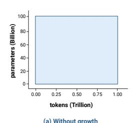
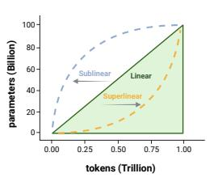
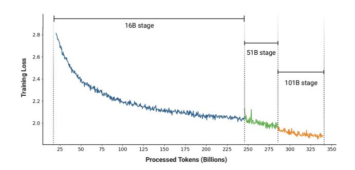

# FLM-101B: An Open LLM and How to Train It with \$100K Budget

Xiang Li1†, Yiqun Yao1†, Xin Jiang1†, Xuezhi Fang1†, Xuying Meng2, Siqi Fan3, Peng Han3, Jing Li4, Li Du1, Bowen Qin1, Zheng Zhang1, Aixin Sun5, Yequan Wang1\*

1Beijing Academy of Artificial Intelligence, Beijing, China 2Institute of Computing Technology, Chinese Academy of Sciences, Beijing, China 3University of Electronic Science and Technology of China, Chengdu, China 4Harbin Institute of Technology, Shenzhen, China

5School of Computer Science and Engineering, Nanyang Technological University, Singapore

#### **Abstract**

Large language models (LLMs) are considered important approaches towards foundational machine intelligence, achieving remarkable success in Natural Language Processing and multimodal tasks, among others. However, the carbon footprints and financial costs originating from heavy pre-training computation is a non-negligible issue. Progressive training methods, inspired by the neurogenesis process that grows neural structures, have shown potential to accelerate LLM pre-training. However, the algorithms, implementation, and practices for progressively training LLMs beyond 100B parameters remain underexplored. In this paper, we show that our model, namely FLM-101B, trained with our growth strategy under a budget of \$100K, reaches 80% of the baselines' performances with only 10% of their floating-point operations. We believe that further studies on progressive training will benefit the community by cutting down the costs and promoting green AI. The checkpoint of FLM-101B is publicly available.

#### 1 Introduction

Large language models (LLMs) (Radford et al. 2018; Touvron et al. 2023a; Devlin et al. 2019; Raffel et al. 2020) have consistently demonstrated their efficacy across a spectrum of applications, especially in language processing (Wang et al. 2022b,a; Fan et al. 2022; Liu et al. 2022) and multimodal tasks (Zhao et al. 2023; Meng et al. 2023). Despite variations in architectural designs, a universal challenge confronting all LLMs is the escalating cost associated with their training. Recent trends indicate a shift towards utilizing larger amounts of data (e.g., 1.4T tokens for Llama-1 (Touvron et al. 2023a), 2T tokens for Llama-2 (Touvron et al. 2023b), and 15T tokens for Llama-3 (Meta 2024)). Meanwhile, the sizes of open-sourced models continue to increase (Penedo et al. 2023; Bi et al. 2024; Mistral 2024). Consequently, a major focus within LLM research is the development of innovative methodologies that effectively mitigate training expenses, aligning with the broader objectives of Green AI (Schwartz et al. 2020).

In this paper, we present our exploration to train an LLM at the 100B-parameter scale using a *growth strategy* inspired by previous research on progressive learning (Gong et al. 2019; Gu et al. 2021; Yao et al. 2024) and neurogenesis

### Non-Growth vs. three Growth Strategies

The shaded area in the graph represents the training cost

**Figure Description:**
The image is a graph with a blue background that represents the relationship between two variables: tokens (on the x-axis) and trillions of parameters (on the y-axis). On the left side of the graph, there's an axis labeled "tokens" ranging from 0 to approximately 125 billion tokens. On the right side, there's another axis labeled "parameters," which ranges from 60 to about 80 billion parameters. Both axes are marked with numerical increments at regular intervals.

The central part of the graph shows a large rectangle filled with solid blue color, indicating a range or area where both the number of tokens and the amount of parameters fall within certain bounds. This could be representing a specific model architecture or dataset size used for training a machine learning model.

Below the graph, there is additional text providing context. It reads "(a) Without growth" followed by "[Trillion(b)] Withouth growth." These labels suggest that the graph may compare different models or datasets based on their scale, possibly highlighting differences in performance or complexity when considering growth factors such as data collection over time or the evolution of model architectures. However, without further information, it's not possible to provide more details about these labels.

**Figure Description:**
The image is a graph with two axes: one labeled "parameters (billion)" ranging from 0 to 100 billion, and another labeled "tokens (Trillion)" ranging from 0 to 1 trillion. There are three lines representing different data sets or models: Sublinear, Linear, and Superlinear. Each line represents a curve that shows how many tokens correspond to each parameter value.

The Sublinear line starts at the origin of both axes and rises gently upwards towards the right side of the graph. It indicates that as parameters increase, there is an increasing number of tokens but not proportionally; hence it's considered sublinear.

The Linear line also begins at the origin but ascends more steeply than the Sublinear line, suggesting a linear relationship between parameters and tokens. This line continues straight across the graph until it reaches its peak point, after which it drops off sharply.

The Superlinear line has a similar starting point as the other two lines but then curves upward much faster, indicating a superlinear relationship where the number of tokens increases at a rate greater than the corresponding increase in parameters.

Each line is marked by dashed arrows pointing downward, likely indicating specific points of interest along the curves. These could be particular milestones or inflection points for each model.

Overall, the graph provides a visual representation of how token counts change with varying parameter settings for these three models.

(b) Linear growth strategy cost saving = 50
(c) Superlinear growth strategy cost saving > 50%
(d) Sublinear growth strategy cost saving < 50%

**Figure 1:** An overview of different growth strategies. (a): a baseline with constant number of parameters. (b): a straightforward linear growth strategy, cost-saving being exactly 50%; (c): a superlinear strategy with > 50% cost saving; (d): sublinear strategy saving the cost by less than 50%.

(Eriksson et al. 1998). "Growth" means dynamic expansion of the parameter number count, from small to large, through the training progresses. Figure 1 illustrates three typical growth strategies: linear, sublinear, and superlinear. As the FLOPs of LLMs are approximately proportional to their number of parameters (Hoffmann et al. 2022), the area under the parameter curve represents the computational cost of training.

While existing studies on scaling laws (Hoffmann et al. 2022) suggest that training a smaller model with more data may potentially result in higher scores on some tasks under a fixed FLOPs budget, they mainly consider the scenarios where model sizes are fixed through training. We believe that verifying the feasibility of a growth strategy (Gu et al. 2021; Shen et al. 2022; Chen et al. 2022; Yao et al. 2024) for extremely large models would be an important completion to scaling laws. To maximize computational efficiency, we strategically focus on implementing an aggressive growth strategy (Figure 1 (c)) for sanity check. We adapt the MSG (Yao et al. 2024) growth operators to train a model at 100B+ scale. We fix our budget to be \$100K with 192 A800 GPUs

At the 100B scale, it is impractical to conduct strict head-

to-head comparison with the same model trained with fixed size from scratch. Instead, we compare our grown model, namely FLM-101B, with the existing first-generation 100B+ language models (Brown et al. 2020; Zeng et al. 2023). Our model is trained with around 300 billion English and Chinese tokens, aligning it with these predecessors in terms of data scale. We first evaluate on the knowledge-oriented benchmarks (i.e., MMLU (Hendrycks et al. 2021) and C-Eval (Huang et al. 2023)). Nevertheless, such evaluation may not comprehensively reflect the models' capability: it is difficult to distinguish whether the models recall a piece of knowledge or possess the capacity for reasoning and/or inference. Borrowing some ideas from Intelligence Quotient (IQ) tests (i.e., Perceptual Reasoning and Working Memory (Watkins et al. 1995)), we consolidate another range of evaluation, including symbolic mapping (Wei et al. 2023), rule understanding, pattern mining, and anti-interference evaluations.

We believe these tasks are less likely to be affected by data leakage or memorization, offering a more nuanced insight into the model's cognitive abilities beyond mere knowledge retrieval.

To summarize, the paper has made the following contributions. First, to the best of our knowledge, this is the first attempt to use a *growth strategy* to train an LLM with 100B+parameters **from scratch**. The training costs only 100,000 US dollars. Second, we demonstrate details for addressing the instability issues via improving training objectives, hyperparameter search, and function-preserving growth. Third, we conduct extensive evaluations, including both the commonly used knowledge-oriented benchmarks and the new range of evaluations inspired by IQ tests. Experimental results show that, despite its low training cost, FLM-101B is competitive and robust. Lastly, we will release the model checkpoints, as well as some related code and tools, to promote related research. Related literature is reviewed in Appendix B.

### 2 Design Overview of FLM-101B

In this section, we provide an outline of FLM-101B, detailing its architecture, pre-training methods, and configuration specifics.

#### 2.1 Architecture

**Backbone.** Among the many existing model architectures, we adopt FreeLM (Li et al. 2023) as the backbone for our models, with modifications. FreeLM is based on GPT (Radford et al. 2019), a transformer-like architecture with a decoder-only configuration. Different from GPT, FreeLM features two pre-training objectives: the *language* objective and the *teacher* objective (Section 2.2). We preserve the GPT-3-style transformer block designs without incorporating the later modifications from Llama series. We employ the tokenizer derived from GPT-4, characterized by a vocabulary size of 100, 256.

**xPos Integration.** To enhance long sequence modeling, we integrate the Extrapolatable Position Embedding (xPos) (Sun et al. 2023). This innovation draws inspiration from RoPE (Su et al. 2021), which aims to improve the length extrapolation

ability by introducing an exponential decay into the rotation matrix.

**Model Sizes.** Benefiting from our *growth strategy*, the we produce three models with 16B, 51B, and 101B (*i.e.*, FLM-101B) parameters in a single training. The training process is carried out in a progressive manner by growing a 16B model to 51B, and then 101B.

### 2.2 Pre-Training Setup

**FLM-101B.** By design, FLM-101B is an English-Chinese bilingual model. It mixes English and Chinese corpora at a ratio of approximately 53.5%:46.5%. Inspired by the finding that instruction data can augment LLMs' comprehension capabilities (Ouyang et al. 2022), we integrate multi-task instructionally prompted data: OIG (Open Instruction Generalist)  $^1$  and COIG (Chinese Open Instruction Generalist)  $^2$ , in the pre-training stage.

**eFLM-16B.** To analyse the effect of domain-specific knowledge data (Section 4.2), we apply the FreeLM teacher signals (Li et al. 2023) to enhance factual capability. Due to computational cost, we incorporate these signals only in the smallest 16B model. This enhanced model is named eFLM-16B.

Specifically, we employ two emojis: (U+1F621) and (U+1F608)3, from the vocabulary to replace the original binary classification labels (Li et al. 2023). For the teacher signal, we supervise only on the emoji tokens, unifying the objective with language modeling. Moreover, we discard the original multi-task alternating approach and completely mix the samples from both sides in every batch. This strategy can enhance the consistency of data sampling distribution as well as improve training stability.

Table 1: Partial configurations for different growth stages.

| Params (billion) | Learning Rate | Warmup (samples) | Batch Tokens (million) | Time (day) | Tokens (billion) |
|---------------------|------------------|---------------------|---------------------------|------------|---------------------|
| 16                  | 4e-4             | 4,608,000           | 4.72                      | 9.63       | 245.37              |
| 51                  | 3.4e - 4         | 230,400             | 4.72                      | 5.37       | 39.64               |
| 101                 | 2e - 4           | 230,400             | 4.31                      | 6.54       | 26.54               |

### 2.3 Growth Strategy

The essence of the low cost in scaling up FLM-101B is the *growth strategy*. Specifically, we train three models, with 16B, 51B, and 101B parameters, respectively, in a sequential manner. Each model inherits knowledge from its predecessor. This is contrary to the common practice that the models of different sizes are trained independently (Touvron et al. 2023a,b).

**Function-preserving Growth.** Function preservation means that before and after growth, the models yield consistent outputs given the same arbitrary inputs. This property has proven

&lt;sup>1https://huggingface.co/datasets/laion/OIG

&lt;sup>2https://huggingface.co/datasets/BAAI/COIG

https://apps.timwhitlock.info/emoji/tables/unicode

Table 2: Parallel strategies and throughput for different growth stages. For NVIDIA A800 GPUs, the peak theoretical FLOPs per second is 312 teraFLOPs/sec. Gradient accumulation is applied for the large global batch size.

| Params (billion) | Tensor Parallel Size | Pipeline Parallel Size | Data Parallel Size | Number of GPUs | Batch Size | teraFLOP/s per GPU | FLOPs Utilization |
|---------------------|-------------------------|---------------------------|-----------------------|-------------------|---------------|-----------------------|----------------------|
| 16                  | 2                       | 1                         | 96                    | 192               | 2304          | 162                   | 51.90%               |
| 51                  | 4                       | 2                         | 24                    | 192               | 2304          | 160                   | 51.30%               |
| 101                 | 4                       | 4                         | 12                    | 192               | 2160          | 165                   | 52.88%               |

beneficial for both knowledge inheritance (Chen, Goodfellow, and Shlens 2016; Chen et al. 2022; Shen et al. 2022) and training stability (Yao et al. 2024). The growth operators used in FLM-101B training originate from Masked Structural Growth (MSG) (Yao et al. 2024), with adaptation. Specifically, to adapt these operators to the multi-node 3D parallel framework, we implement them by extending the model structures offline and reloading the checkpoint when the next stage starts.

Schedules and Cost-Effectiveness. Model growth scheduling is a trade-off between the pros and cons inherent to models of different sizes (Yao et al. 2024): a smaller model is faster in computation, enabling more rapid consumption of training data for broader commonsense knowledge; conversely, a larger model is better in the reduction of loss per step, indicating a deeper understanding of the nuanced linguistic patterns. Based on the speed test results and total budget, we train the 16B model with 245.37B tokens, the 51B model with 39.64B tokens, and the 101B model with 26.54B tokens. The *billion tokens per day* of different sizes are listed in Table 1. Under this growth schedule, the total time cost for training FLM-101B is 21.54 days, which is 72% time-saving (or a 3.56x speedup) compared to training a 101B model from scratch (76.74 days estimated). This is consistent with our motivations depicted in Figure 1.

## 2.4 The Parallelism Setup and Model Configurations

The Parallel Strategies. FLM-101B is trained on a cluster of 24 DGX-A800 GPU (8×80G) servers. We employ a 3D parallel strategy for optimal throughput, including the standard data parallelism (Valiant 1990), tensor model parallelism (Shoeybi et al. 2019), and pipeline model parallelism (Narayanan et al. 2021). Moreover, by employing sequence parallelism (Korthikanti et al. 2022), we slice the inputs to the Transformer core's LayerNorm and Dropout layers along the sequence length dimension, leading to additional savings in GPU computational resources and memory utilization. We also utilize the Megetron-LM 4 implementation of the distributed optimizer (Rajbhandari et al. 2019) to further reduce GPU memory consumption, which evenly distributes the optimizer states across data parallel ranks.

Table 2 shows the parallelism configurations and training throughput in each stage of FLM-101B training. In different stages, we configure different Tensor Parallel ×

**Figure Description:**
The image is a graph with two lines representing different data sets over time. On the x-axis, there are labels indicating "Training stage" ranging from "16B stage" to "518B stage," suggesting that these stages correspond to training epochs or iterations for a machine learning model. Each label has an associated number of processed tokens (in billions), which increases as we move along the x-axis towards later stages.

The y-axis represents loss, measured in terms of Training Loss per second. This axis also includes numerical values at various points across the graph, but without specific units provided, it's unclear whether these numbers represent actual losses or some other metric related to the training process.

There are three lines on the graph: one line labeled "2.0" starts at the beginning of the x-axis and ends near the middle; another line labeled "101B stage" begins just before the first line and continues through all subsequent stages until it drops sharply around the "350" mark on the y-axis; and finally, a third line labeled "101B stage" starts after the first line and follows a similar trajectory as the second line, ending abruptly at the same point where the second line drops off.

At the bottom right corner of the graph, there is a legend explaining the meaning of the colors used in the graph: blue corresponds to the "2.0" line, green to the "101B stage" line, and orange to the "101B stage" line.

Overall, the graph appears to be tracking the performance metrics of a machine learning model during its training process, showing how the loss decreases over time as more processing occurs. However, due to the lack of contextual information, such as the exact nature of the model being trained or the significance of the "2.0" line, it's difficult to provide a detailed interpretation of the data presented.

Figure 2: Training loss for FLM-101B models.

Pipeline Parallel sizes to achieve higher efficiency. The single-GPU throughput for all three training stages consistently exceeds 160 teraFLOPs/sec with a utilization rate of at least 51.3%. For comparison, GLM-130B achieves 135 teraFLOPs/sec (Zeng et al. 2023) with a 42.27% utilization rate. We can also find that FLM-101B has a higher FLOP utilization rate than Megatron-LM (Korthikanti et al. 2022) under a similar model size.

FLM-101B Configurations. The FLM-101B model is structured with a hidden state dimension of 10, 240, a layer number of 80, a context window of 2,048 tokens, 80 attention heads, and a vocabulary size of 100, 256. FLM-101B uses the AdamW optimizer (Loshchilov and Hutter 2017) with β1 = 0.9 and β2 = 0.95. A cosine learning rate schedule is employed, leading to a final learning rate of 6e − 6. We use a weight decay of 0.1 and gradient clipping of 1.0.

Table 1 presents part of the hyperparameters used in different growth stages. In each growth stage, we approximately inherit the previous learning rate and adhere to the same schedule. The learning rate at the beginning of each stage is reported in the table. In the 16B stage, 4,608k samples are used for learning rate warmup, while in later growth stages, we use fewer samples of 230.4k. Note that we do not apply batch size warmup because we address the stability issue in a different manner, detailed in Section 3.

## 3 Training Stability of FLM-101B

Models beyond 100B parameters (Scao et al. 2022; Zeng et al. 2023) usually suffer from a bunch of notorious stability issues including loss divergence, gradient explosion, and numerical overflow/underflow. This not only inflates the cost of searching for feasible hyperparameters like optimal learning

4 https://github.com/NVIDIA/Megatron-LM

| Table 3: Carbon emissions of our proposed model, FLM-101B, and other well-known LLMs. For details, please see the        |
|--------------------------------------------------------------------------------------------------------------------------|
| corresponding references. The definitions of TDP, net tCO2e, and their formulas are the same as (Patterson et al. 2021). |

| Model          | GPT-3 (Brown et al. 2020) | Gopher (Rae et al. 2021) | PaLM (Anil et al. 2023) | GLM-130B (Zeng et al. 2023) | Llama-2 (Touvron et al. 2023b)FLM-101B |        |
|----------------|------------------------------|-----------------------------|----------------------------|--------------------------------|-------------------------------------------|--------|
| Params         | 175B                         | 280B                        | 540B                       | 130B                           | 70B                                       | 101B   |
| GPU Hours      | 3.55e6                       | 3.77e6                      | 8.40e6                     | 1.11e6                         | 1.72e6                                    | 1.01e5 |
| Chip Power/TDP | 330                          | 283                         | 378.5                      | 400                            | 400                                       | 400    |
| Energy (MkWh)  | 1171                         | 1066                        | 3179                       | 444                            | 688                                       | 40     |
| net tCO2e      | 552                          | 380                         | 271                        | 257                            | 291                                       | 26     |

rates, but also intensifies ongoing maintenance during training, such as babysitting, issue resolution, data adjustment, and rebooting. Moreover, this makes the budget of the whole project unpredictable. In this section, we introduce details for mitigating these issues.

Predictable Scaling. The Tensor Programs theories (Yang and Hu 2021; Littwin and Yang 2023) unveil the universal relations of the training dynamics with the *model width* tending to infinite. This results in a parameterized mapping for certain classes of hyperparameters between a small model and its larger counterparts, which is termed µP (Yang et al. 2021). Two important insights are: (i) *The wider, the better*: theoretically, under µP transfer, a wider model will always yield lower loss than its narrower counterparts when exposed to identical data (Yang et al. 2021). As a direct corollary, if a narrow model converges, its wider counterparts will always converge. (ii) *Loss prediction*: the loss value of a large model is predictable using the loss of its smaller counterparts (OpenAI 2023). µScaling (Yao and Wang 2023) open-sources a methodology through which loss prediction can be achieved by combining µP (Yang et al. 2021) and (a modified) scaling law (Kaplan et al. 2020; Henighan et al. 2020; Hoffmann et al. 2022).

Based on these findings, our method to solve training stability is as follows: we first determine the data distribution before the FLM-16B training starts. Next, we perform a grid search on three hyperparameters including the learning rate, initialization standard deviation, and the softmax temperature in the output layer. This grid search is performed with a small *proxy model* (less than 100M) with a hidden state dimension ("model width") of 256 and a head number of 2. All the other structural configurations and training data are identical to those of FLM-16B. A single run of grid search takes 24.6 hours with data parallelism on 6 nodes, which is equivalent to 6 hours per run given our 24-node infrastructure. Finally, we find a group of well-performing hyperparameters: learning rate = 4e − 4, standard deviation = 1.6e − 2, and softmax temperature = 2.0. Transferring these hyperparameters to the 16B model via µP (Yang et al. 2021) led to a seamless training experience *devoid* of instabilities. Combined with MSG (Yao et al. 2024), we also witness no post-growth divergence in FLM-51B and FLM-101B.

Our implementations of µP are largely consistent with those in µScaling (Yao and Wang 2023), with modifications to handle the rotary embedding. Thus, the value range of FLM-16B loss is also predictable with the results from multiple proxy widths at the same steps. Mixed-precision training is applied to save run-time memory and reduce time costs. Specifically, we choose Bfloat16 instead of FP16 due to its superior precision for values approaching zero, making it more suitable for µP. As a result, we do not encounter the FP16 underflow issue reported by (Yang et al. 2021). Moreover, Bfloat16 negates the need for loss scale adjustments, making our training procedure more promising and reproducible.

The full training loss curve is presented in Figure 2. We observe that the loss curve becomes steeper after each growth. It matches the intuition that a larger model is better in loss reduction per step. The whole training procedure is robust and predictable: even though the 51B stage is short with only 40B tokens, the 101B training remains stable. This supports the effectiveness of the growth strategy.

## 4 Benchmark Evaluation

Many existing benchmarks (*e.g.,* Open LLM5 ) focus on assessing the knowledgeability of LLMs. In this section, we discuss the results of FLM on these benchmarks. We believe that knowledge alone might not comprehensively reflect LLM's capability (see Section 4.2 for more details). Thus, in addition to the common benchmark evaluation, we borrow the concept of IQ tests and evaluate LLMs with some specific cognitive tasks in Section 5.

Cost Estimation Method. Due to the considerable computational expense of LLMs, we also emphasize their associated costs in our experimental results. However, it is difficult to directly compare the actual cost of LLMs due to their different infrastructures and prices. To objectively compare training costs, we use the FLOPs for training as the cost estimation index, which is estimated from the model's hyperparameters, configuration, and training data (Narayanan et al. 2021). Since most models do not release the complete training configuration, we estimate FLOPs within a range6 . For monolingual English LLMs, the computational cost of GPT-3 is calculated as 376.41 (±53.77) zettaFLOPs, and Llama-2 (13B) as 210.37 (±28.77) zettaFLOPs. For bilingual or multilingual models, it is necessary to estimate the cost for each language. The total cost of GLM-130B is computed as 421.60 zettaFLOPs. As the data ratio of English

5 https://huggingface.co/spaces/HuggingFaceH4/ open llm leaderboard.

6This range originates from the use of checkpoint activation. Please check (Narayanan et al. 2021) for more details.

Table 4: Performance of FLM-101B and baselines including Llama series and GLM-130B. We list the estimated floatingpoint operations (zetta = 1021) of the training process for reference.

| Model         |        | Cost (zettaFLOPs) | Average | ARC   | HellaSwag | MMLU   | TruthfulQA |
|---------------|--------|-------------------|---------|-------|-----------|--------|------------|
| Llama-2 (13B) | 201.37 | (±28.77)          | 58.66   | 59.39 | 82.13     | 55.77  | 37.38      |
| Llama-2 (7B)  | 106.60 | (±15.23)          | 54.32   | 53.07 | 78.59     | 46.87  | 38.76      |
| Llama (13B)   | 94.81  | (±13.54)          | 56.08   | 56.23 | 80.93     | 47.67  | 39.48      |
| Llama (7B)    | 49.54  | (±7.08)           | 49.72   | 51.02 | 77.82     | 35.71  | 34.33      |
| GLM-130B      | 210.80 |                   | 48.11   | 42.15 | 67.91     | 42.59  | 39.80      |
| FLM-101B      | 28.22  |                   | 43.94   | 39.76 | 66.23     | 28.30∗ | 41.47      |

∗ 44.50 for a knowledge-enhanced eFLM-16B (Section 2.2, 4.2).

Table 5: Performance of eFLM-16B and baselines on C-eval. In this table, eFLM-16B refers to the professional-knowledgeenhanced FLM-16B. Note that C-Eval leaderboard only keeps one decimal place for the evaluation results.

| Model    | Average | Average (Hard) | STEM | Social Science | Humanities | Others |
|----------|---------|----------------|------|----------------|------------|--------|
| GPT-4    | 68.7    | 54.9           | 67.1 | 77.6           | 64.5       | 67.8   |
| ChatGPT  | 54.4    | 41.4           | 52.9 | 61.8           | 50.9       | 53.6   |
| GLM-130B | 44.0    | 30.7           | 36.7 | 55.8           | 47.7       | 43.0   |
| eFLM-16B | 46.1    | 28.9           | 38.3 | 53.7           | 46.8       | 52.6   |

and Chinese is reported to be 1:1, the cost of GLM-130B for English is 210.80 zettaFLOPs, and the same for Chinese. The data ratio of FLM-101B is 53.5% : 46.5% for English and Chinese. The total cost of FLM-101B is computed as 52.76 zettaFLOPs (28.22 zettaFLOPs for English and 24.54 for Chinese).

Carbon Footprint Analysis. An important measurement of a model's environmental impact (Schwartz et al. 2020) is the carbon footprints originated from the pre-training process. We estimate carbon emission with the methods provided in (Patterson et al. 2021). We summarize the carbon footprint statistics of FLM-101B and well-known LLMs in Table 3. Our model yields only 1/10 pre-training carbon footprint of a typical LLM.

## 4.1 Open LLM Evaluation

Open LLM Leaderboard is an open-source project to evaluate the open-sourced LLMs and chatbots. By the time FLM-101B is trained, Open LLM contains four tasks: ARC-Challenge (ARC for short) (Clark et al. 2018), HellaSwag (Zellers et al. 2019), MMLU (Hendrycks et al. 2021), and TruthfulQA (Lin, Hilton, and Evans 2022). The Open LLM Leaderboard applies the average score as a metric. All the four tasks require intense knowledge to solve: ARC, HellaSwag, and TruthfulQA depend on commonsense knowledge and Wikipedia, while MMLU contains some questions (*i.e.,* STEM) that require domain-specific professional knowledge and intricate reasoning.

Table 4 details the performance of FLM-101B and strong baselines, including Llama series and GLM-130B7 . GLM-130B results are achieved by our run on an open-sourced checkpoint.

Results. On average, FLM-101B achieves a score of 43.94, reaching over 90% of the performance of GLM-130B, which has 7 times more FLOPs. Both model underperform the Llama series, potentially due to the first-generation model architectures and less well-refined training data. Note that the FLOPs of FLM-101B is even lower than a 7B Llama model. Going deeper into the nature of these tasks, we further have the following observations:

- (i) MMLU typically requires domain knowledge to solve. In our training, no English textbook or exam data is intentionally used. Nevertheless, our eFLM-16B (Section 2.2) variant, incorporated with these knowledge via FreeLM objectives, outperforms GLM-130B with only 16B parameters.
- (ii) As aforementioned, TruthfulQA, ARC, and HellaSwag emphasize more on common sense and Wiki-level knowledge; their performances improve with the increased amount of data and the reduction of training loss. With less than 0.16T English data (about 1/10 of Llama-2), FLM-101B already achieves the best accuracy of 41.47 among all the baselines on TruthfulQA. On ARC and HellaSwag, FLM-101B is comparable to GLM-130B with a similar amount of English data (approximately 0.2T). Also, the training data of GLM-130B includes ARC and HellaSwag, as expressly claimed in (Zeng et al. 2023). In our understanding, for FLM-101B, improvement can be expected on these three tasks if exposed to more training data.

## 4.2 Evaluation on the Professional Knowledge-Enhanced Model

We conduct experiments on a knowledge-enhanced version (eFLM-16B, detailed in Section 2.2) of the FLM to validate the effect of domain-specific knowledge data on benchmark results. We continue to train the smallest FLM-16B with teacher signals (Li et al. 2023) from a combination of (i) part of the auxiliary training data of MMLU (Hendrycks et al.

7We exclude GPT-3 because it is closed-source. Probability values are unavailable for fair comparison.

Table 6: Performance of the three stages of FLM on Open LLM. To reduce the computational cost during evaluation, we sample 20% and 30% items for HellaSwag and MMLU tasks, respectively.

| Parameters | Training Data | Average | ARC   | Hellaswag | MMLU  | TruthfulQA |
|------------|---------------|---------|-------|-----------|-------|------------|
| 16B        | 245.37B       | 39.19   | 32.25 | 58.57     | 27.02 | 38.92      |
| 51B        | 39.64B        | 41.79   | 35.32 | 64.04     | 27.66 | 40.12      |
| 101B       | 26.54B        | 44.41   | 39.76 | 67.88     | 28.54 | 41.47      |

2021), (ii) exam questions in similar domains and formats to C-Eval (Huang et al. 2023) 8 , and (iii) other domain knowledge data. Note that eFLM-16B is not a typical fine-tuning with instruct data which may affect the language modeling capability of LLM. We preserve both language and teacher signals with the corresponding data in this continue-training. The MMLU result is in the footnote of Table 4. Table 5 lists the result of eFLM-16B and baselines on C-Eval.

Results. Enhanced with professional knowledge, significant improvements are observed. On MMLU tasks, the incorporation of professional knowledge data results in a score of 44.50 for eFLM-16B (see Table 4), which surpasses GLM-130B (42.59), a model that also incorporated multi-task data in the related domain (Zeng et al. 2023). For comparison, the MMLU score is 27.02 for the un-enhanced FLM-16B. On C-Eval tasks 9 , we observe that eFLM-16B performs better than GLM-130B by about 2 points. For comparison, the average C-Eval score of the vanilla FLM-16B is 27.0, which underperforms GLM-130B. These results suggest that evaluation with professional knowledge may not fully reflect the capability of LLMs, particularly when different LLMs are trained with different data collections, and some may not come with a clear list.

### 4.3 Evaluation of the Growth Strategy

Our core method for reducing computational cost is the growth strategy. We would like to answer the questions of whether our growth strategy is effective in knowledge inheritance, and how model capabilities grow with size. We evaluate the performance of FLM on all the stages: 16B, 51B, and 101B. Table 6 shows the performance of FLM models at each stage.

Results. As expected, the performance of FLM improves with the increase in model size. FLM-101B achieves the best performance on almost all tasks. This means that our model inherits knowledge from the previous stage after each growth. We also observe that the 101B model improves the performance scores more significantly than the 51B model, with less data. This indicates that the models are successfully incorporating new weights in training after growth, and taking advantage of larger parameter counts. The performance on ARC and HellaSwag increases steadily and significantly, which corresponds well to the decline of the model loss. Again, as we expected in Section 4.1, as more training data is processed, FLM's performance on Open LLM improves.

## 5 Evaluation Inspired by IQ Tests

Section 4 presents the evaluation of existing benchmarks, focusing on knowledge. As we discussed in Section 1 and 4.2, knowledge could not fully reflect the Intelligence Quotient (IQ) of LLMs. As a supplement, we conduct a series of IQ-test task evaluation in this section. For IQ evaluation, we make necessary modifications to existing datasets (Wei et al. 2023; Weston et al. 2015; Srivastava et al. 2023) or generate new synthetic datasets. Specifically, the IQ test mainly considers four aspects: *symbolic mapping*, *rule understanding*, *pattern mining*, and *anti-interference*. A common key property of these tasks is that they are dependent on the inference and generalization in a new context, instead of the previously-learned knowledge.

Compared Methods. Borrowing psychological ideas that the measurement of IQ is dependent on age 10, we mainly consider existing models trained with similar amounts of data to FLM-101B. As a milestone of LLM development, GPT-3 (175B) (Brown et al. 2020) proposed in-context learning for the first time. GLM-130B (Zeng et al. 2023) is the first open English-Chinese bilingual LLM. Hence, we select them as baseline models. Both models are trained with 300 ˜400 billion tokens, which are in the same range as ours. GPT-3 focuses on English, and is not included in the Chineserelated evaluation (*i.e.,* CLUE-IQ). The results of GPT-3 are achieved by API. GLM-130B is evaluated with its opensourced checkpoint.

Tasks, Data, and Results. We curate evaluation benchmarks regarding four cognitive capabilities. We summarize the data and results in this section. For details in task definition and data collection process, please see Appendix A.1 to A.4.

*Symbolic Mapping.* An existing study (Wei et al. 2023) points out that textual classification tasks (*e.g.,* sentiment classification) often lack generalization. Considering this, we use a symbolic mapping method to replace the original categorical labels with symbols that are unlikely to be seen in any training data. Hence, we can evaluate the LLMs' language understanding ability as well as the generalization abilities to a new context. We form our evaluation task as in-context learning with few-shot examples for each label. We construct two symbolic mapping datasets, namely SuperGLUE-IQ and CLUE-IQ, built on SuperGLUE (Wang et al. 2019) and CLUE (Xu et al. 2020), respectively. Examples are illustrated in the Appendix (Figure 1).

Results on SuperGLUE-IQ and CLUE-IQ are presented in Table 7 and Table 8, respectively. With less computation

8C-Eval can be considered as a Chinese version of MMLU.

9The scores are achieved on the test set by submitting to the C-Eval platform.

10https://ocw.mit.edu/ans7870/9/9.00SC/MIT9 00SCF11 text. pdf, page 367.

by one magnitude, FLM-101B achieves comparable performance with GPT-3 on SuperGLUE-IQ and outperforms GLM-130B on CLUE-IQ.

Table 7: Performance on SuperGLUE-IQ of GPT-3, GLM-130B, and FLM-101B. Cost is computed in zettaFLOPs.

| Model    | Cost            | Average | BoolQ | WiC   | RTE   | WSC   |
|----------|-----------------|---------|-------|-------|-------|-------|
| GPT-3    | 376.41 (±53.77) | 47.60   | 50.84 | 53.33 | 48.38 | 37.86 |
| GLM-130B | 210.80          | 48.19   | 40.13 | 48.67 | 47.65 | 56.31 |
| FLM-101B | 28.22           | 46.76   | 49.50 | 50.33 | 48.38 | 38.83 |

**Table 8: Performance on CLUE-IQ for GLM-130B and FLM-101B.** Cost is computed in zettaFLOPs.

| Model    | Cost   | Average | AFQMC | CSL   | OCNLI | CLUE WSC 2020 |
|----------|--------|---------|-------|-------|-------|---------------------|
| GLM-130B | 210.80 | 39.96   | 33.33 | 53.85 | 34.0  | 38.67               |
| FLM-101B | 24.54  | 42.07   | 38.33 | 55.29 | 27.33 | 47.33               |

Rule Understanding. We consider the understanding and execution of rules being a strong indication of reasoning capability. To this end, we design rule understanding evaluation. Note that this test is different from reasoning based on the chain of thought. Detailed discussion is provided in Appendix A.2.

We curate data for two subtasks: *Counting* (0-shot) and *String replacement* (4-shots).

Table 9: Performance of FLM-101B, GPT-3, and GLM-130B on rule understanding tasks.

| Model    | Average | Counting | Replace Lowercase | Replace Word |
|----------|---------|----------|----------------------|-----------------|
| GPT-3    | 86.03   | 82.43    | 80.67                | 95.00           |
| GLM-130B | 71.49   | 60.81    | 69.67                | 84.00           |
| FLM-101B | 76.42   | 69.59    | 64.00                | 95.67           |

Table 9 shows the performance of our proposed FLM-101B against GPT-3 and GLM-130B on rule understanding tasks. For Counting, FLM-101B achieves 69.59%, about 9 points better than GLM-130B. GPT-3 wins the first place in counting and Replace-Lowercase, and second place in Replace-Word. This is potentially because GPT-3 is the largest model.

Pattern Mining. Pattern Mining evaluation is common in IQ tests. In detail, it is the induction and deduction of the patterns emerging in a new context.

We build a benchmark with three tasks (*i.e.*, Head & Tail, Full Repeating, and Head Slicing) for evaluation. Figure 2 in the Appendix shows examples of these tasks. Each task is 5-shot and contains 100 instances.

Table 10 lists the experimental results of our FLM-101B against the baselines on pattern mining tasks. On all three tasks, FLM-101B outperforms GLM-130B by a large margin. For the Head & Tail and Full Repeating tasks, FLM-101B is a few points behind GPT-3, but outperforms the latter on the Head Slicing task. Considering the computational cost, FLM-101B exhibits noticeable abilities.

Table 10: Performance of FLM-101B, GPT-3, and GLM-130B on pattern mining tasks.

| Model    | Average | Head & Tail | Full Repeating | Head Slicing |
|----------|---------|-------------|----------------|--------------|
| GPT-3    | 70.00   | 61.00       | 92.00          | 57.00        |
| GLM-130B | 53.00   | 38.00       | 70.00          | 51.00        |
| FLM-101B | 64.67   | 52.00       | 79.00          | 63.00        |

Anti-interference. Anti-interference capability is critical for finding and utilizing information that is truly related to a specific goal, in an unseen and noisy context (Appendix Figure 3). As suggested by the cocktail party problem in speech recognition (Qian et al. 2018), we consider anti-interference ability to be important for intelligent agents. We conduct anti-interference evaluation in three task types: Multiple Key Retrieval, Single Supporting Fact Tracking, and Two Supporting Facts Tracking, as exemplified in Figure 3 in the Appendix.

Table 11: Performance of FLM-101B, GPT-3, and GLM-130B on anti-interference evaluation.

| Model    | Average | Multiple Key Retrieval | Single Supporting Fact | Two Supporting Facts |
|----------|---------|------------------------------|------------------------------|----------------------------|
| GPT-3    | 70.11   | 92.67                        | 78.33                        | 39.33                      |
| GLM-130B | 53.56   | 77.67                        | 56.33                        | 26.67                      |
| FLM-101B | 60.11   | 89.00                        | 59.00                        | 32.33                      |

Table 11 shows the evaluation results on anti-interference. FLM-101B achieves the second-best passing rates with an advantage of around 7% compared to GLM-130B.

**IQ Test Conclusion.** On our four additional evaluations inspired by the IQ tests, FLM-101B outperforms GLM-130B and obtains competitive results compared to GPT-3 in some tasks with much lower costs. Except for the impacts of training data, the superiority may be owed to a story that in the growth strategy, the smaller models in early stages refine a more efficient searching space, which keeps taking effect when the model grows larger with increased generalization ability.

### 6 Conclusions, Limitations, and Future Work

In this paper, we introduce FLM-101B, an open-sourced LLM that is successfully trained from scratch within a \$100,000 budget. The key idea of reducing the training cost of FLM-101B is to break through the fixed number of model parameters via a growth strategy. Experimental results on knowledeg-oriented and IQ-related benchmarks show that FLM-101B is comparable to strong baseline models with less computational cost. Note that harmful contents may be induced from the open-sourced checkpoint, which do not represent the opinions of the authors.

Due to resource issues, the limitations of our work include inadequate exploration and comparison for different growth schedules, growth operators, and amount of data. For future work, we believe that our exploration on the growth strategy as well as training stability would potentially be beneficial for future attempts of further scaling up LLMs, *e.g.,* beyond 1T parameters.

# References

- Anil, R.; Dai, A. M.; Firat, O.; Johnson, M.; Lepikhin, D.; Passos, A.; Shakeri, S.; Taropa, E.; Bailey, P.; Chen, Z.; Chu, E.; Clark, J. H.; Shafey, L. E.; Huang, Y.; Meier-Hellstern, K.; Mishra, G.; Moreira, E.; Omernick, M.; Robinson, K.; Ruder, S.; Tay, Y.; Xiao, K.; Xu, Y.; Zhang, Y.; Abrego, G. H.; ´ Ahn, J.; Austin, J.; Barham, P.; Botha, J. A.; Bradbury, J.; Brahma, S.; Brooks, K.; Catasta, M.; Cheng, Y.; Cherry, C.; Choquette-Choo, C. A.; Chowdhery, A.; Crepy, C.; Dave, S.; Dehghani, M.; Dev, S.; Devlin, J.; D´ıaz, M.; Du, N.; Dyer, E.; Feinberg, V.; Feng, F.; Fienber, V.; Freitag, M.; Garcia, X.; Gehrmann, S.; Gonzalez, L.; and et al. 2023. PaLM 2 Technical Report. *CoRR*, abs/2305.10403.
- Bi, X.; Chen, D.; Chen, G.; Chen, S.; Dai, D.; Deng, C.; Ding, H.; Dong, K.; Du, Q.; Fu, Z.; et al. 2024. Deepseek llm: Scaling open-source language models with longtermism. *arXiv preprint arXiv:2401.02954*.
- Brown, T.; Mann, B.; Ryder, N.; Subbiah, M.; Kaplan, J. D.; Dhariwal, P.; Neelakantan, A.; Shyam, P.; Sastry, G.; Askell, A.; et al. 2020. Language models are few-shot learners. *Advances in neural information processing systems*, 33: 1877– 1901.
- Chen, C.; Yin, Y.; Shang, L.; Jiang, X.; Qin, Y.; Wang, F.; Wang, Z.; Chen, X.; Liu, Z.; and Liu, Q. 2022. bert2BERT: Towards Reusable Pretrained Language Models. In Muresan, S.; Nakov, P.; and Villavicencio, A., eds., *Proceedings of the 60th Annual Meeting of the Association for Computational Linguistics (Volume 1: Long Papers), ACL 2022, Dublin, Ireland, May 22-27, 2022*, 2134–2148. Association for Computational Linguistics.
- Chen, T.; Goodfellow, I. J.; and Shlens, J. 2016. Net2Net: Accelerating Learning via Knowledge Transfer. In Bengio, Y.; and LeCun, Y., eds., *4th International Conference on Learning Representations, ICLR 2016, San Juan, Puerto Rico, May 2-4, 2016, Conference Track Proceedings*.
- Clark, P.; Cowhey, I.; Etzioni, O.; Khot, T.; Sabharwal, A.; Schoenick, C.; and Tafjord, O. 2018. Think you have Solved Question Answering? Try ARC, the AI2 Reasoning Challenge. *CoRR*, abs/1803.05457.
- Devlin, J.; Chang, M.; Lee, K.; and Toutanova, K. 2019. BERT: Pre-training of Deep Bidirectional Transformers for Language Understanding. In Burstein, J.; Doran, C.; and Solorio, T., eds., *Proceedings of the 2019 Conference of the North American Chapter of the Association for Computational Linguistics: Human Language Technologies, NAACL-HLT 2019, Minneapolis, MN, USA, June 2-7, 2019, Volume 1 (Long and Short Papers)*, 4171–4186. Association for Computational Linguistics.
- Eriksson, P. S.; Perfilieva, E.; Bjork-Eriksson, T.; Alborn, A.- ¨ M.; Nordborg, C.; Peterson, D. A.; and Gage, F. H. 1998. Neurogenesis in the adult human hippocampus. *Nature medicine*, 4(11): 1313–1317.

- Fan, S.; Wang, Y.; Li, J.; Zhang, Z.; Shang, S.; and Han, P. 2022. Interactive Information Extraction by Semantic Information Graph. In Raedt, L. D., ed., *Proceedings of the Thirty-First International Joint Conference on Artificial Intelligence, IJCAI 2022, Vienna, Austria, 23-29 July 2022*, 4100–4106. ijcai.org.
- Gong, L.; He, D.; Li, Z.; Qin, T.; Wang, L.; and Liu, T. 2019. Efficient training of bert by progressively stacking. In *International conference on machine learning*, 2337–2346. PMLR.
- Gu, X.; Liu, L.; Yu, H.; Li, J.; Chen, C.; and Han, J. 2021. On the Transformer Growth for Progressive BERT Training. In *Proceedings of the 2021 Conference of the North American Chapter of the Association for Computational Linguistics: Human Language Technologies*, 5174–5180.
- Hendrycks, D.; Burns, C.; Basart, S.; Zou, A.; Mazeika, M.; Song, D.; and Steinhardt, J. 2021. Measuring Massive Multitask Language Understanding. In *9th International Conference on Learning Representations, ICLR 2021, Virtual Event, Austria, May 3-7, 2021*. OpenReview.net.
- Henighan, T.; Kaplan, J.; Katz, M.; Chen, M.; Hesse, C.; Jackson, J.; Jun, H.; Brown, T. B.; Dhariwal, P.; Gray, S.; Hallacy, C.; Mann, B.; Radford, A.; Ramesh, A.; Ryder, N.; Ziegler, D. M.; Schulman, J.; Amodei, D.; and McCandlish, S. 2020. Scaling Laws for Autoregressive Generative Modeling. *CoRR*, abs/2010.14701.
- Hoffmann, J.; Borgeaud, S.; Mensch, A.; Buchatskaya, E.; Cai, T.; Rutherford, E.; de Las Casas, D.; Hendricks, L. A.; Welbl, J.; Clark, A.; Hennigan, T.; Noland, E.; Millican, K.; van den Driessche, G.; Damoc, B.; Guy, A.; Osindero, S.; Simonyan, K.; Elsen, E.; Vinyals, O.; Rae, J. W.; and Sifre, L. 2022. An empirical analysis of compute-optimal large language model training. In *NeurIPS*.
- Huang, Y.; Bai, Y.; Zhu, Z.; Zhang, J.; Zhang, J.; Su, T.; Liu, J.; Lv, C.; Zhang, Y.; Lei, J.; Fu, Y.; Sun, M.; and He, J. 2023. C-Eval: A Multi-Level Multi-Discipline Chinese Evaluation Suite for Foundation Models. *CoRR*, abs/2305.08322.
- Kaplan, J.; McCandlish, S.; Henighan, T.; Brown, T. B.; Chess, B.; Child, R.; Gray, S.; Radford, A.; Wu, J.; and Amodei, D. 2020. Scaling Laws for Neural Language Models. *CoRR*, abs/2001.08361.
- Korthikanti, V.; Casper, J.; Lym, S.; McAfee, L.; Andersch, M.; Shoeybi, M.; and Catanzaro, B. 2022. Reducing Activation Recomputation in Large Transformer Models. arXiv:2205.05198.
- Li, X.; Jiang, X.; Meng, X.; Sun, A.; and Wang, Y. 2023. FreeLM: Fine-Tuning-Free Language Model. *CoRR*, abs/2305.01616.
- Lin, S.; Hilton, J.; and Evans, O. 2022. TruthfulQA: Measuring How Models Mimic Human Falsehoods. In Muresan, S.; Nakov, P.; and Villavicencio, A., eds., *Proceedings of the 60th Annual Meeting of the Association for Computational Linguistics (Volume 1: Long Papers), ACL 2022, Dublin, Ireland, May 22-27, 2022*, 3214–3252. Association for Computational Linguistics.
- Littwin, E.; and Yang, G. 2023. Adaptive Optimization in the ∞-Width Limit. In *The Eleventh International Conference*

- *on Learning Representations, ICLR 2023, Kigali, Rwanda, May 1-5, 2023*. OpenReview.net.
- Liu, Y.; Wang, Y.; Sun, A.; Meng, X.; Li, J.; and Guo, J. 2022. A Dual-Channel Framework for Sarcasm Recognition by Detecting Sentiment Conflict. In Carpuat, M.; de Marneffe, M.; and Ru´ız, I. V. M., eds., *Findings of the Association for Computational Linguistics: NAACL 2022, Seattle, WA, United States, July 10-15, 2022*, 1670–1680. Association for Computational Linguistics.
- Loshchilov, I.; and Hutter, F. 2017. Fixing Weight Decay Regularization in Adam. *CoRR*, abs/1711.05101.
- Meng, X.; Lin, C.; Wang, Y.; and Zhang, Y. 2023. Net-GPT: Generative Pretrained Transformer for Network Traffic. *CoRR*, abs/2304.09513.
- Meta. 2024. Introducing Meta Llama 3: The most capable openly available LLM to date. https://ai.meta.com/blog/metallama-3/.
- Mistral. 2024. Mistral 8x22B. https://mistral.ai/news/mixtral-8x22b/.
- Narayanan, D.; Shoeybi, M.; Casper, J.; LeGresley, P.; Patwary, M.; Korthikanti, V.; Vainbrand, D.; Kashinkunti, P.; Bernauer, J.; Catanzaro, B.; Phanishayee, A.; and Zaharia, M. 2021. Efficient Large-Scale Language Model Training on GPU Clusters. *CoRR*, abs/2104.04473.
- OpenAI. 2023. GPT-4 Technical Report. *CoRR*, abs/2303.08774.
- Ouyang, L.; Wu, J.; Jiang, X.; Almeida, D.; Wainwright, C. L.; Mishkin, P.; Zhang, C.; Agarwal, S.; Slama, K.; Ray, A.; Schulman, J.; Hilton, J.; Kelton, F.; Miller, L.; Simens, M.; Askell, A.; Welinder, P.; Christiano, P. F.; Leike, J.; and Lowe, R. 2022. Training language models to follow instructions with human feedback. In *NeurIPS*.
- Patterson, D.; Gonzalez, J.; Le, Q.; Liang, C.; Munguia, L.- M.; Rothchild, D.; So, D.; Texier, M.; and Dean, J. 2021. Carbon emissions and large neural network training. *arXiv preprint arXiv:2104.10350*.
- Penedo, G.; Malartic, Q.; Hesslow, D.; Cojocaru, R.; Cappelli, A.; Alobeidli, H.; Pannier, B.; Almazrouei, E.; and Launay, J. 2023. The RefinedWeb dataset for Falcon LLM: outperforming curated corpora with web data, and web data only. *arXiv preprint arXiv:2306.01116*.
- Qian, Y.; Weng, C.; Chang, X.; Wang, S.; and Yu, D. 2018. Past review, current progress, and challenges ahead on the cocktail party problem. *Frontiers Inf. Technol. Electron. Eng.*, 19(1): 40–63.
- Radford, A.; Narasimhan, K.; Salimans, T.; Sutskever, I.; et al. 2018. Improving language understanding by generative pre-training.
- Radford, A.; Wu, J.; Child, R.; Luan, D.; Amodei, D.; and Sutskever, I. 2019. Language Models are Unsupervised Multitask Learners.
- Rae, J. W.; Borgeaud, S.; Cai, T.; Millican, K.; Hoffmann, J.; Song, H. F.; Aslanides, J.; Henderson, S.; Ring, R.; Young, S.; Rutherford, E.; Hennigan, T.; Menick, J.; Cassirer, A.; Powell, R.; van den Driessche, G.; Hendricks, L. A.; Rauh, M.; Huang, P.; Glaese, A.; Welbl, J.; Dathathri, S.; Huang, S.;

- Uesato, J.; Mellor, J.; Higgins, I.; Creswell, A.; McAleese, N.; Wu, A.; Elsen, E.; Jayakumar, S. M.; Buchatskaya, E.; Budden, D.; Sutherland, E.; Simonyan, K.; Paganini, M.; Sifre, L.; Martens, L.; Li, X. L.; Kuncoro, A.; Nematzadeh, A.; Gribovskaya, E.; Donato, D.; Lazaridou, A.; Mensch, A.; Lespiau, J.; Tsimpoukelli, M.; Grigorev, N.; Fritz, D.; Sottiaux, T.; Pajarskas, M.; Pohlen, T.; Gong, Z.; Toyama, D.; de Masson d'Autume, C.; Li, Y.; Terzi, T.; Mikulik, V.; Babuschkin, I.; Clark, A.; de Las Casas, D.; Guy, A.; Jones, C.; Bradbury, J.; Johnson, M. J.; Hechtman, B. A.; Weidinger, L.; Gabriel, I.; Isaac, W.; Lockhart, E.; Osindero, S.; Rimell, L.; Dyer, C.; Vinyals, O.; Ayoub, K.; Stanway, J.; Bennett, L.; Hassabis, D.; Kavukcuoglu, K.; and Irving, G. 2021. Scaling Language Models: Methods, Analysis & Insights from Training Gopher. *CoRR*, abs/2112.11446.
- Raffel, C.; Shazeer, N.; Roberts, A.; Lee, K.; Narang, S.; Matena, M.; Zhou, Y.; Li, W.; and Liu, P. J. 2020. Exploring the Limits of Transfer Learning with a Unified Text-to-Text Transformer. *J. Mach. Learn. Res.*, 21: 140:1–140:67.
- Rajbhandari, S.; Rasley, J.; Ruwase, O.; and He, Y. 2019. ZeRO: Memory Optimization Towards Training A Trillion Parameter Models. *CoRR*, abs/1910.02054.
- Scao, T. L.; Fan, A.; Akiki, C.; Pavlick, E.; Ilic, S.; Hesslow, D.; Castagne, R.; Luccioni, A. S.; Yvon, F.; Gall ´ e, M.; Tow, ´ J.; Rush, A. M.; Biderman, S.; Webson, A.; Ammanamanchi, P. S.; Wang, T.; Sagot, B.; Muennighoff, N.; del Moral, A. V.; Ruwase, O.; Bawden, R.; Bekman, S.; McMillan-Major, A.; Beltagy, I.; Nguyen, H.; Saulnier, L.; Tan, S.; Suarez, P. O.; Sanh, V.; Laurenc¸on, H.; Jernite, Y.; Launay, J.; Mitchell, M.; Raffel, C.; Gokaslan, A.; Simhi, A.; Soroa, A.; Aji, A. F.; Alfassy, A.; Rogers, A.; Nitzav, A. K.; Xu, C.; Mou, C.; Emezue, C.; Klamm, C.; Leong, C.; van Strien, D.; Adelani, D. I.; and et al. 2022. BLOOM: A 176B-Parameter Open-Access Multilingual Language Model. *CoRR*, abs/2211.05100.
- Schwartz, R.; Dodge, J.; Smith, N. A.; and Etzioni, O. 2020. Green ai. *Communications of the ACM*, 63(12): 54–63.
- Shen, S.; Walsh, P.; Keutzer, K.; Dodge, J.; Peters, M. E.; and Beltagy, I. 2022. Staged Training for Transformer Language Models. In Chaudhuri, K.; Jegelka, S.; Song, L.; Szepesvari, ´ C.; Niu, G.; and Sabato, S., eds., *International Conference on Machine Learning, ICML 2022, 17-23 July 2022, Baltimore, Maryland, USA*, volume 162 of *Proceedings of Machine Learning Research*, 19893–19908. PMLR.
- Shoeybi, M.; Patwary, M.; Puri, R.; LeGresley, P.; Casper, J.; and Catanzaro, B. 2019. Megatron-LM: Training Multi-Billion Parameter Language Models Using Model Parallelism. *CoRR*, abs/1909.08053.
- Srivastava, A.; Rastogi, A.; Rao, A.; Shoeb, A. A. M.; Abid, A.; Fisch, A.; Brown, A. R.; Santoro, A.; Gupta, A.; Garriga-Alonso, A.; et al. 2023. Beyond the Imitation Game: Quantifying and extrapolating the capabilities of language models. *Transactions on Machine Learning Research*.
- Su, J.; Lu, Y.; Pan, S.; Wen, B.; and Liu, Y. 2021. Ro-Former: Enhanced Transformer with Rotary Position Embedding. *CoRR*, abs/2104.09864.
- Sun, Y.; Dong, L.; Patra, B.; Ma, S.; Huang, S.; Benhaim, A.; Chaudhary, V.; Song, X.; and Wei, F. 2023. A Length-

Extrapolatable Transformer. In Rogers, A.; Boyd-Graber, J. L.; and Okazaki, N., eds., *Proceedings of the 61st Annual Meeting of the Association for Computational Linguistics (Volume 1: Long Papers), ACL 2023, Toronto, Canada, July 9-14, 2023*, 14590–14604. Association for Computational Linguistics.

Touvron, H.; Lavril, T.; Izacard, G.; Martinet, X.; Lachaux, M.; Lacroix, T.; Roziere, B.; Goyal, N.; Hambro, E.; Azhar, ` F.; Rodriguez, A.; Joulin, A.; Grave, E.; and Lample, G. 2023a. LLaMA: Open and Efficient Foundation Language Models. *CoRR*, abs/2302.13971.

Touvron, H.; Martin, L.; Stone, K.; Albert, P.; Almahairi, A.; Babaei, Y.; Bashlykov, N.; Batra, S.; Bhargava, P.; Bhosale, S.; Bikel, D.; Blecher, L.; Canton-Ferrer, C.; Chen, M.; Cucurull, G.; Esiobu, D.; Fernandes, J.; Fu, J.; Fu, W.; Fuller, B.; Gao, C.; Goswami, V.; Goyal, N.; Hartshorn, A.; Hosseini, S.; Hou, R.; Inan, H.; Kardas, M.; Kerkez, V.; Khabsa, M.; Kloumann, I.; Korenev, A.; Koura, P. S.; Lachaux, M.; Lavril, T.; Lee, J.; Liskovich, D.; Lu, Y.; Mao, Y.; Martinet, X.; Mihaylov, T.; Mishra, P.; Molybog, I.; Nie, Y.; Poulton, A.; Reizenstein, J.; Rungta, R.; Saladi, K.; Schelten, A.; Silva, R.; Smith, E. M.; Subramanian, R.; Tan, X. E.; Tang, B.; Taylor, R.; Williams, A.; Kuan, J. X.; Xu, P.; Yan, Z.; Zarov, I.; Zhang, Y.; Fan, A.; Kambadur, M.; Narang, S.; Rodriguez, A.; Stojnic, R.; Edunov, S.; and Scialom, T. 2023b. Llama 2: Open Foundation and Fine-Tuned Chat Models. *CoRR*, abs/2307.09288.

Valiant, L. G. 1990. A Bridging Model for Parallel Computation. *Commun. ACM*, 33(8): 103–111.

Wang, A.; Pruksachatkun, Y.; Nangia, N.; Singh, A.; Michael, J.; Hill, F.; Levy, O.; and Bowman, S. R. 2019. SuperGLUE: A Stickier Benchmark for General-Purpose Language Understanding Systems. In Wallach, H. M.; Larochelle, H.; Beygelzimer, A.; d'Alche-Buc, F.; Fox, E. B.; and Garnett, ´ R., eds., *Advances in Neural Information Processing Systems 32: Annual Conference on Neural Information Processing Systems 2019, NeurIPS 2019, December 8-14, 2019, Vancouver, BC, Canada*, 3261–3275.

Wang, Y.; Li, X.; Sun, A.; Meng, X.; Liao, H.; and Guo, J. 2022a. CofeNet: Context and Former-Label Enhanced Net for Complicated Quotation Extraction. In Calzolari, N.; Huang, C.; Kim, H.; Pustejovsky, J.; Wanner, L.; Choi, K.; Ryu, P.; Chen, H.; Donatelli, L.; Ji, H.; Kurohashi, S.; Paggio, P.; Xue, N.; Kim, S.; Hahm, Y.; He, Z.; Lee, T. K.; Santus, E.; Bond, F.; and Na, S., eds., *Proceedings of the 29th International Conference on Computational Linguistics, COLING 2022, Gyeongju, Republic of Korea, October 12-17, 2022*, 2438– 2449. International Committee on Computational Linguistics.

Wang, Y.; Zhang, H.; Sun, A.; and Meng, X. 2022b. CORT: A New Baseline for Comparative Opinion Classification by Dual Prompts. In Goldberg, Y.; Kozareva, Z.; and Zhang, Y., eds., *Findings of the Association for Computational Linguistics: EMNLP 2022, Abu Dhabi, United Arab Emirates, December 7-11, 2022*, 7064–7075. Association for Computational Linguistics.

Watkins, C. E.; Campbell, V. L.; Nieberding, R.; and Hallmark, R. 1995. Contemporary practice of psychological assessment by clinical psychologists. *Professional psychology: Research and practice*, 26(1): 54.

Wei, J. W.; Hou, L.; Lampinen, A. K.; Chen, X.; Huang, D.; Tay, Y.; Chen, X.; Lu, Y.; Zhou, D.; Ma, T.; and Le, Q. V. 2023. Symbol tuning improves in-context learning in language models. *CoRR*, abs/2305.08298.

Weston, J.; Bordes, A.; Chopra, S.; Rush, A. M.; Van Merrienboer, B.; Joulin, A.; and Mikolov, T. 2015. To- ¨ wards ai-complete question answering: A set of prerequisite toy tasks. *arXiv preprint arXiv:1502.05698*.

Xu, L.; Hu, H.; Zhang, X.; Li, L.; Cao, C.; Li, Y.; Xu, Y.; Sun, K.; Yu, D.; Yu, C.; Tian, Y.; Dong, Q.; Liu, W.; Shi, B.; Cui, Y.; Li, J.; Zeng, J.; Wang, R.; Xie, W.; Li, Y.; Patterson, Y.; Tian, Z.; Zhang, Y.; Zhou, H.; Liu, S.; Zhao, Z.; Zhao, Q.; Yue, C.; Zhang, X.; Yang, Z.; Richardson, K.; and Lan, Z. 2020. CLUE: A Chinese Language Understanding Evaluation Benchmark. In Scott, D.; Bel, N.; and Zong, C., eds., *Proceedings of the 28th International Conference on Computational Linguistics, COLING 2020, Barcelona, Spain (Online), December 8-13, 2020*, 4762–4772. International Committee on Computational Linguistics.

Yang, G.; and Hu, E. J. 2021. Tensor Programs IV: Feature Learning in Infinite-Width Neural Networks. In Meila, M.; and Zhang, T., eds., *Proceedings of the 38th International Conference on Machine Learning, ICML 2021, 18-24 July 2021, Virtual Event*, volume 139 of *Proceedings of Machine Learning Research*, 11727–11737. PMLR.

Yang, G.; Hu, E. J.; Babuschkin, I.; Sidor, S.; Liu, X.; Farhi, D.; Ryder, N.; Pachocki, J.; Chen, W.; and Gao, J. 2021. Tuning Large Neural Networks via Zero-Shot Hyperparameter Transfer. In Ranzato, M.; Beygelzimer, A.; Dauphin, Y. N.; Liang, P.; and Vaughan, J. W., eds., *Advances in Neural Information Processing Systems 34: Annual Conference on Neural Information Processing Systems 2021, NeurIPS 2021, December 6-14, 2021, virtual*, 17084–17097.

Yao, Y.; and Wang, Y. 2023. Research without Re-search: Maximal Update Parametrization Yields Accurate Loss Prediction across Scales. *CoRR*, abs/2304.06875.

Yao, Y.; Zhang, Z.; Li, J.; and Wang, Y. 2024. Masked Structural Growth for 2x Faster Language Model Pre-training. In *The Twelfth International Conference on Learning Representations*.

Zellers, R.; Holtzman, A.; Bisk, Y.; Farhadi, A.; and Choi, Y. 2019. HellaSwag: Can a Machine Really Finish Your Sentence? In Korhonen, A.; Traum, D. R.; and Marquez, L., ` eds., *Proceedings of the 57th Conference of the Association for Computational Linguistics, ACL 2019, Florence, Italy, July 28- August 2, 2019, Volume 1: Long Papers*, 4791–4800. Association for Computational Linguistics.

Zeng, A.; Liu, X.; Du, Z.; Wang, Z.; Lai, H.; Ding, M.; Yang, Z.; Xu, Y.; Zheng, W.; Xia, X.; Tam, W. L.; Ma, Z.; Xue, Y.; Zhai, J.; Chen, W.; Liu, Z.; Zhang, P.; Dong, Y.; and Tang, J. 2023. GLM-130B: An Open Bilingual Pretrained Model. In *The Eleventh International Conference on Learning Representations, ICLR 2023, Kigali, Rwanda, May 1-5, 2023*. OpenReview.net.

Zhao, W. X.; Zhou, K.; Li, J.; Tang, T.; Wang, X.; Hou, Y.; Min, Y.; Zhang, B.; Zhang, J.; Dong, Z.; Du, Y.; Yang, C.; Chen, Y.; Chen, Z.; Jiang, J.; Ren, R.; Li, Y.; Tang, X.; Liu, Z.; Liu, P.; Nie, J.; and Wen, J. 2023. A Survey of Large Language Models. *CoRR*, abs/2303.18223.