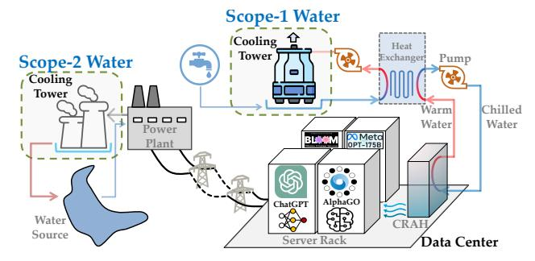
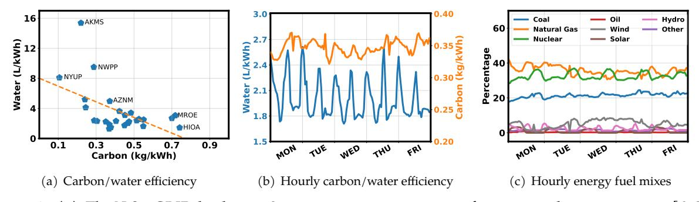

# **Making AI Less "Thirsty": Uncovering and Addressing the Secret Water Footprint of AI Models**

Pengfei Li *UC Riverside*

Jianyi Yang *UC Riverside* Mohammad A. Islam *UT Arlington*

Shaolei Ren[1](#page-0-0) *UC Riverside*

#### **Abstract**

The growing carbon footprint of artificial intelligence (AI) has been undergoing public scrutiny. Nonetheless, the equally important water (withdrawal and consumption) footprint of AI has largely remained under the radar. For example, training the GPT-3 language model in Microsoft's state-of-the-art U.S. data centers can directly evaporate 700,000 liters of clean freshwater, but such information has been kept a secret. More critically, the global AI demand is projected to account for 4.2 – 6.6 billion cubic meters of water withdrawal in 2027, which is more than the total annual water withdrawal of 4 – 6 Denmark or half of the United Kingdom. This is concerning, as freshwater scarcity has become one of the most pressing challenges. To respond to the global water challenges, AI can, and also must, take social responsibility and lead by example by addressing its own water footprint. In this paper, we provide a principled methodology to estimate the water footprint of AI, and also discuss the unique spatial-temporal diversities of AI's runtime water efficiency. Finally, we highlight the necessity of holistically addressing water footprint along with carbon footprint to enable truly sustainable AI.

# **1 Introduction**

Artificial intelligence (AI) has enabled remarkable breakthroughs in numerous areas of critical importance, including tackling global challenges such as climate change. On the other hand, many AI models, especially large generative ones like GPT-4, are trained and deployed on energy-hungry servers in warehouse-scale data centers, accelerating the data center energy consumption at an unprecedented rate [\[1\]](#page-6-0). As a result, AI's carbon footprint has been undergoing scrutiny, driving the recent progress in AI carbon efficiency [\[2,](#page-7-0)[3\]](#page-7-1). However, AI's water footprint — many millions of liters of freshwater consumed for cooling the servers and for electricity generation — has largely remained under the radar and keeps escalating. If not properly addressed, AI's water footprint can potentially become a major roadblock to sustainability and create social conflicts as freshwater resources suitable for human use are extremely limited and unevenly distributed.

As acknowledged in Google's sustainability report [\[4\]](#page-7-2) and the recent U.S. data center energy report [\[1\]](#page-6-0), the expansion of AI products and services is a key driver of the rapid increase in data center water consumption. Even excluding the water usage in leased third-party colocation facilities, one technology company's self-owned data centers alone directly withdrew 29 billion liters and consumed (i.e., evaporated) more than 23 billion liters of freshwater for on-site cooling in 2023, nearly 80% of which was potable water [\[4\]](#page-7-2).[2](#page-0-1) This amount of annual water consumption even rivals that of a major household-name beverage company [\[5\]](#page-7-3). Importantly, the company's data center water consumption increased by ∼20% from 2021 to 2022 and by ∼17% from 2022 to 2023 [\[4\]](#page-7-2), and another technology company's data center water consumption saw ∼34% and ∼22% increases over the same periods, respectively [\[6\]](#page-7-4). Furthermore, according to the recent U.S. data center energy report, the total annual on-site water consumption by U.S. data centers in 2028 could double or even quadruple the 2023 level, reaching approximately 150 – 280 billion liters and further stressing the water infrastructures [\[1\]](#page-6-0).

AI represents the fastest expanding workloads in data centers [\[1,](#page-6-0) [4\]](#page-7-2). For example, a recent study suggests that the global AI could consume 85 – 134 TWh of electricity in 2027 [\[7\]](#page-7-5), whereas a more aggressive projection by the recent U.S. data center energy report predicts that AI servers' electricity consumption in the U.S. alone will surpass 150 – 300 TWh in 2028 [\[1\]](#page-6-0). Even considering the lower estimate, the combined scope-1 and scope-2 water withdrawal of global AI is projected to reach **4.2 – 6.6 billion cubic meters** in

1Corresponding author: Shaolei Ren (shaolei@ucr.edu), University of California, Riverside.

2The detailed difference between water withdrawal and water consumption is presented in Section [2.1.](#page-1-0)

2027, which is more than the total annual water withdrawal of 4 – 6 Denmark or half of the United Kingdom.[3](#page-1-1) Simultaneously, a total of 0.38 – 0.60 billion cubic meters of water will be evaporated and considered "consumption" due to the global AI demand in 2027. Moreover, these global estimates will be exceeded by the total water withdrawal and consumption attributed to AI in the U.S. alone in 2028 if the projection in [\[1\]](#page-6-0) comes to fruition.

Despite its profound environmental and societal impact, the increasing water footprint of AI has received disproportionately less attention from the AI community as well as the general public. For example, while the scope-2 carbon emissions are routinely included as part of AI model cards, even scope-1 direct water usage (either withdrawal or consumption) is missing, let alone scope-2 water usage. This may impede innovations to enable water sustainability and build truly sustainable AI. Crucially, water and carbon footprints are complementary to, not substitutable of, each other for understanding the environmental impacts. Indeed, optimizing for carbon efficiency does not necessarily result in, and may even worsen, water efficiency, which varies with the fuel mixes for electricity generation and outside weather in a unique way [\[1,](#page-6-0) [9\]](#page-7-6).

To ensure that the growth in AI does not exacerbate the global water stresses or outweigh the environmental benefits it provides, it is a critical time to uncover and address AI's hidden water footprint amid the increasingly severe freshwater scarcity crisis, worsened extended droughts, and quickly aging public water infrastructure. The urgency can also be reflected in part by the recent commitment to "Water Positive by 2030" from industry leaders, including Google [\[4\]](#page-7-2) and Microsoft [\[6\]](#page-7-4), and by the inclusion of water footprint as a key metric into the world's first international standard on sustainable AI to be published by the ISO/IEC [\[10\]](#page-7-7).

In this paper, we advocate for a holistic approach to sustainable AI that extends beyond the carbon footprint to also address the water footprint. Specifically, we present a principled methodology to estimate AI's total water footprint, including both operational water and embodied water. By taking the GPT-3 model with 175 billion parameters as an example [\[11\]](#page-7-8), we show that training GPT-3 in Microsoft's U.S. data centers can consume a total of 5.4 million liters of water, including **700,000 liters** of scope-1 on-site water consumption. Additionally, GPT-3 needs to "drink" (i.e., consume) a **500ml bottle of water** for roughly 10 – 50 medium-length responses, depending on when and where it is deployed.

Next, we show that WUE (Water Usage Effectiveness, a measure of water efficiency) varies both spatially and temporally, suggesting that judiciously deciding "when" and "where" to train a large AI model can significantly cut the water footprint. We also emphasize the need for increasing transparency of AI' water footprint, including disclosing more information about operational data and keeping users informed of the runtime water efficiency. Finally, we highlight the necessity of holistically addressing water footprint along with carbon footprint to enable truly sustainable AI — *the water footprint of AI can no longer stay under the radar*.

# **2 Background**

## **2.1 Water Withdrawal vs. Water Consumption**

There are two related but different concepts — water withdrawal and water consumption, both of which are important for understanding the impacts on water stress and availability [\[12,](#page-7-9) [13\]](#page-7-10).

- **Water withdrawal:** It refers to freshwater taken from the ground or surface water sources, either temporarily or permanently, and then used for agricultural, industrial, or municipal uses (normally excluding water used for hydroelectricity generation) [\[12\]](#page-7-9). As water is a finite shared resource, water withdrawal indicates the level of competition as well as dependence on water resources among different sectors.
- **Water consumption:** It is defined as "water withdrawal minus water discharge", and means the amount of water "evaporated, transpired, incorporated into products or crops, or otherwise removed from the immediate water environment" [\[13\]](#page-7-10). Water consumption reflects the impact on downstream water availability and is crucial for assessing watershed-level scarcity [\[12\]](#page-7-9).

These two types of water usage correspond to two different water footprints, i.e., water withdrawal foot-

3The scope definition of water usage [\[8\]](#page-7-11) is in line with that of carbon emissions and is discussed in Section [2.2.](#page-2-0) Our scope-2 water withdrawal (and consumption when applicable) is for location-based electricity generation throughout the paper. Large data centers often adopt sustainability programs (e.g., renewable purchasing agreements) to offset their location-based electricity usage and thus may have lower market-based carbon and water footprints.

print (WWF) [\[8,](#page-7-11)[14\]](#page-7-12) and water consumption footprint (WCF), respectively [\[15\]](#page-7-13). By default, water footprint refers to the water consumption footprint unless otherwise specified.

### **2.2 How Does AI Use Water?**

AI's water usage spans three scopes: on-site water for data center cooling (scope 1), off-site water for electricity generation (scope 2), and supply-chain water for server manufacturing (scope 3).

#### **2.2.1 Scope-1 Water Usage**

Nearly all the server energy is converted into heat, which must then be removed from the data center server room to avoid overheating. This process involves two sequential stages: server-level cooling followed by facility-level cooling.

In the server-level cooling stage, heat is transferred from the servers to the facility or a heat exchanger, typically using either air or liquid cooling methods (e.g., direct-to-chip cooling or immersion cooling), which do not evaporate or consume water. In general, new data centers dedicated to AI training often rely on liquid cooling due to the high server power densities.

In the facility-level cooling stage, heat is rejected from the data center facility to the outside environment. While there are various cooling methods, water-intensive cooling towers and water evaporation-assisted air cooling are two common approaches used in many data centers, including those operated by major technology companies [\[1,](#page-6-0) [4\]](#page-7-2).

**Cooling tower.** As illustrated in Figure [1,](#page-2-1) some water is evaporated (i.e., "consumed") in the cooling tower to dissipate heat into the environment, while the remaining water moves along an open loop to the heat exchanger to further absorb the server heat. Additionally, non-evaporated water can be recycled only a few times (typically 3–10 cycles, depending on water quality) before discharge, requiring continuous clean freshwater replenishment to prevent mineral and salt buildup. Thus, to keep the cooling tower working, new water must be constantly added to make up for the evaporated water and discharged water. Importantly, clean freshwater (potable water in many cases [\[4\]](#page-7-2)) is needed to avoid pipe clogs and/or bacterial growth.

For cooling towers, water withdrawal refers to the amount of added water, including both evapo-

**Figure Description:**
The image is a flowchart diagram that illustrates various components of an industrial water system with numerical data points indicating specific quantities or measurements related to each component. At the top left corner, there's a label "Scope-1 Water" followed by two arrows pointing towards different parts of the system: one arrow labeled "Cooling Tower," and another labeled "Power Plant." Below these labels are three boxes connected by lines representing different stages of the process: "SCOPE-2 WATER," "Cooling Tower," and "POWER PLANT." Each box has additional text and symbols inside it, providing more information about their function within the system.

The central part of the diagram shows a large blue tank labeled "WATER TANK" with a red line connecting it to a smaller white tank labeled "CHILLING TOWER." From the chill cooling tower, there's a green pipe leading to a gray structure labeled "BLOOM METER OPT-175B." This structure appears to be a control panel for monitoring and controlling operations. A black arrow from the power plant leads to a yellow symbol resembling a flame, which represents heat exchange. Another black arrow from the power plant goes directly into the water tank.

On the right side of the diagram, there's a vertical column titled "Data Center" at the bottom, suggesting that the data center receives some form of input from the water system. Above the data center title, there's a dashed rectangle containing a series of numbers and letters: "CRAH," "AlphaGO," and "ChatGPT." These could indicate software systems or technologies associated with the data center.

In the lower left corner, there's a small blue icon depicting a fish swimming upstream, possibly symbolizing aquatic life affected by the water system. To its right, there's a note saying "Water Source," indicating where the water originates before entering the system.

Overall, the diagram seems to provide a visual representation of how water is processed through various stages before reaching a data center, highlighting the importance of water quality and management in modern technology infrastructure. However, without context, it's difficult to determine the exact nature of the processes depicted.

*Figure 1: An example of data center's operational water usage: on-site scope-1 water usage for data center cooling (via cooling towers in the example), and off-site scope-2 water usage for electricity generation. The icons for AI models are only for illustration purposes.*

rated water and discharged water, while water consumption exclusively indicates the amount of evaporated water. With good water quality, roughly 80% of water withdrawal is evaporated and considered "consumption" [\[4\]](#page-7-2). On average, depending on the weather conditions and operational settings, data centers can evaporate approximately 1 – 9 liters per kWh of server energy: 1 L/kWh for Google's annualized global on-site water efficiency [\[4\]](#page-7-2) and 9 L/kWh for a large commercial data center during the summer in Arizona [\[16\]](#page-7-14).

**Air cooling with water evaporation assistance.** When the climate condition is appropriate, data centers may use "free" outside air to directly reject the heat to the outside environment. Nonetheless, water evaporation is still needed when the outside air is too hot (e.g., higher than 85 degrees Fahrenheit); additionally, water is also needed for humidity control when the outside air is too dry [\[17\]](#page-7-15). The added water is considered "withdrawal", out of which about 70% is consumed based on Meta's report [\[18\]](#page-7-16). Generally, outside air cooling is more water-efficient than cooling towers on average. However, hot weather raises the evaporative water demand and maximum water consumption, potentially stressing local water supplies during peak demand on hot days. Additionally, the application of outside air cooling may have challenges in hot regions and/or for many colocation facilities that are located in business districts.

Some data centers may opt for dry coolers, which consume no on-site water year-round [\[19\]](#page-7-17). However, this approach typically increases cooling energy consumption compared to water-based cooling methods, potentially exacerbating the overall stress on water resources due to higher scope-2 water consumption.

#### 2.2.2 Scope-2 Water Usage

In many countries, thermoelectric power is among the top sectors in terms of water withdrawal and water consumption [8]. Thus, similarly to scope-2 carbon emissions, data centers are accountable for off-site scope-2 water usage associated with electricity consumption, which forms part of the "true water cost of data centers," as highlighted by the recent U.S. data center energy report [1].

Different power plants use different amounts of water for each kWh generation, depending on the cooling techniques. Typically, water withdrawal due to hydropower generation is excluded, but water consumption due to increased water evaporation rates from hydropower generation is included [1]. For electricity generation, the U.S. national average water withdrawal and consumption are estimated at about 43.8 L/kWh [20] and 3.1 L/kWh [8], respectively. Meta's self-reported scope-2 water consumption for its global data center fleet was 3.7 L/kWh (i.e., 55,475 megaliters divided by 14,975,435 MWh) in 2023 [18].

#### 2.2.3 Scope-3 Water Usage

AI chip and server manufacturing uses a huge amount of water [21,22]. For example, ultrapure water is needed for wafer fabrication and water is also needed for keeping semiconductor plants cool. Importantly, the discharged water may contain toxic chemicals and/or hazardous wastes. While water recycling at semiconductor plants can effectively reduce water withdrawal, the recycling rate in many cases remains low, e.g., the average recycling rate for wafer plants and semiconductor plants in Singapore are 45% and 23%, respectively [22]. Although largely obscure, scope-3 water usage is likely significant [21]. For instance, Apple reports that its supply chain accounts for 99% of its total water footprint [23].

It is important to recognize that, unlike agriculture whose water footprint is mostly green (i.e., water stored in soil and used by plants), the majority of AI's water footprint is blue water extracted from rivers, lakes, or groundwater, which is directly accessible for human use but often more limited in availability.

## 3 Estimating AI's Water Footprint

We present a general methodology for estimating AI's water consumption footprint. To obtain the water withdrawal footprint, we simply replace the WUE with water withdrawal efficiency.

### 3.1 Operational Water Footprint

We collectively refer to on-site scope-1 water and off-site scope-2 water as the operational water.

- On-site WUE. We denote the on-site scope-1 WUE at time t by  $\rho_{s1,t}$ , which is defined as the ratio of the on-site water consumption to server energy consumption and varies over time depending on the outside temperature (see [9] for an example of on-site WUE based on cooling towers). Concretely,  $\rho_{s1,t}$  increases significantly for cooling towers when the outside wet bulb temperature increases, and increases for outside air cooling when the outside dry bulb temperature is too hot or the humidity is too low.
- Off-site WUE. We denote the off-site scope-2 WUE at time t as  $\rho_{s2,t}$ , which is defined as the ratio of off-site water consumption for each kWh of electricity consumption and measures the electricity water intensity factor (EWIF). While there are different methods to estimate  $\rho_{s2,t}$ , a common one is weighted averaging:  $\rho_{s2,t} = \frac{\sum_k b_{k,t} \times EWIF_k}{\sum_k b_{k,t}}$  where  $b_{k,t}$  denotes the amount of electricity generated from fuel type k at time t for the grid serving the data center under consideration, and  $EWIF_k$  is the EWIF for fuel type k [24,25]. Thus, variations in energy fuel mixes of electricity generation result in temporal variations of the off-site WUE. Moreover, the off-site WUE also varies across regions due to different energy fuel mixes [1,8].
- Operational water footprint. Consider a time-slotted model  $t=1,2,\cdots,T$ , where the length of each time slot depends on how frequently we want to assess the operational water footprint. At time t, suppose that an AI model uses energy  $e_t$  which can be measured using power meters and/or servers' built-in tools, and the data center hosting the AI model has a power usage effectiveness (PUE) of  $\theta_t$  that accounts for the non-IT energy overhead. Then, the total operational water footprint of the AI model can be written as  $WaterOperational = \sum_{t=1}^{T} e_t \cdot [\rho_{s1,t} + \theta_t \cdot \rho_{s2,t}]$ .

#### 3.2 Embodied Water Footprint

Similar to accounting for the embodied carbon footprint [26], the total scope-3 water footprint is amortized over the lifespan of a server. Specifically, if *W* represents the total water used to manufacture the AI servers

**Table 1:** Estimate of GPT-3's operational water consumption footprint. "\*" denotes data centers under construction as of July 2023, whose PUE and WUE are projected by Microsoft.

| -            |       | On-site | Off-site | Water for | r Training ( | million I ) | Water for Each Request (mL) |          |        | # of Requests |
|--------------|-------|---------|----------|-----------|--------------|-------------|-----------------------------|----------|--------|---------------|
| Location     | PUE   | WUE     | EWIF     | On-site   | Off-site     | Total       | On-site                     | Off-site | Total  | for 500ml     |
|              |       | (L/kWh) | (L/kWh)  | Water     | Water        | Water       | Water                       | Water    | Water  | Water         |
| U.S. Average | 1.170 | 0.550   | 3.142    | 0.708     | 4.731        | 5.439       | 2.200                       | 14.704   | 16.904 | 29.6          |
| Arizona      | 1.180 | 1.630   | 4.959    | 2.098     | 7.531        | 9.629       | 6.520                       | 23.406   | 29.926 | 16.7          |
| Georgia*     | 1.120 | 0.060   | 2.309    | 0.077     | 3.328        | 3.406       | 0.240                       | 10.345   | 10.585 | 47.2          |
| Illinois     | 1.350 | 0.740   | 2.233    | 0.952     | 3.880        | 4.833       | 2.960                       | 12.060   | 15.020 | 33.3          |
| Iowa         | 1.160 | 0.140   | 3.104    | 0.180     | 4.634        | 4.814       | 0.560                       | 14.403   | 14.963 | 33.4          |
| Texas        | 1.280 | 0.250   | 1.287    | 0.322     | 2.120        | 2.442       | 1.000                       | 6.590    | 7.590  | 65.9          |
| Virginia     | 1.140 | 0.140   | 2.385    | 0.180     | 3.499        | 3.679       | 0.560                       | 10.875   | 11.435 | 43.7          |
| Washington   | 1.150 | 0.950   | 9.501    | 1.223     | 14.063       | 15.285      | 3.800                       | 43.706   | 47.506 | 10.5          |
| Wyoming      | 1.110 | 0.130   | 2.574    | 0.167     | 3.677        | 3.845       | 0.520                       | 11.429   | 11.949 | 41.8          |
| Australia*   | 1.120 | 0.012   | 4.259    | 0.015     | 6.138        | 6.154       | 0.048                       | 19.078   | 19.126 | 26.1          |
| Denmark*     | 1.160 | 0.010   | 3.180    | 0.013     | 4.747        | 4.760       | 0.040                       | 14.754   | 14.794 | 33.8          |
| Finland*     | 1.120 | 0.010   | 4.542    | 0.013     | 6.548        | 6.561       | 0.040                       | 20.350   | 20.390 | 24.5          |
| India*       | 1.430 | 0.000   | 3.445    | 0.000     | 6.340        | 6.340       | 0.000                       | 19.704   | 19.704 | 25.4          |
| Indonesia*   | 1.320 | 1.900   | 2.271    | 2.445     | 3.858        | 6.304       | 7.600                       | 11.992   | 19.592 | 25.5          |
| Ireland      | 1.190 | 0.020   | 1.476    | 0.026     | 2.261        | 2.287       | 0.080                       | 7.027    | 7.107  | 70.4          |
| Mexico*      | 1.120 | 0.056   | 5.300    | 0.072     | 7.639        | 7.711       | 0.224                       | 23.742   | 23.966 | 20.9          |
| Netherlands  | 1.140 | 0.060   | 3.445    | 0.077     | 5.054        | 5.131       | 0.240                       | 15.708   | 15.948 | 31.4          |
| Sweden       | 1.160 | 0.090   | 6.019    | 0.116     | 8.986        | 9.101       | 0.360                       | 27.927   | 28.287 | 17.7          |

and the servers are expected to operate for a period of  $T_0$ , then the embodied water footprint over a period of T is calculated as  $WaterEmbodied = \frac{T \cdot W}{T_0}$ 

By adding up the operational and embodied water footprints, we can obtain the total water footprint as  $WaterTotal = \sum_{t=1}^{T} e_t \cdot [\rho_{s1,t} + \theta_t \cdot \rho_{s2,t}] + \frac{T \cdot W}{T_0}$ . In practice, to obtain a rough estimate, we can use the average values for the annualized WUE and the estimated AI server energy consumption.

### 3.3 Case Study: Estimating GPT-3's Operational Water Consumption Footprint

The core of ChatGPT, a popular online service, is a large language model (LLM) based on subsequent versions of GPT-3. We present a case study to estimate the operational water consumption for the full GPT-3 model with 175 billion parameters [11]. We exclude embodied water footprint due to the lack of public data for scope-3 water usage. We choose GPT-3 as Microsoft publishes its location-wise WUE and PUE [27,28]. The results are summarized in Table 1.

#### 3.3.1 Training

GPT-3 was trained and deployed by OpenAI in Microsoft's data centers, with an estimated training energy of 1287 MWh [29]. In line with the practice of estimating the carbon footprint, we use the most recent annualized average on-site PUE and WUE for each location, as reported by Microsoft [27, 28]. For power plant water efficiency, different references may provide different estimates of EWIF. Thus, for consistency across regions, we use the EWIF provided by [8] to estimate scope-2 water consumption, as it employs the same methodology for calculating EWIF. Moreover, a large number of Microsoft's data centers are located in the U.S., where the average EWIF provided by [8] is 3.14 L/kWh and significantly lower than 4.35 L/kWh reported by the recent study [1]. The specific location for training GPT-3 is not public. Thus, we consider Microsoft's different data center locations, while excluding Singapore and Taiwan as EWIF data for these regions is not available in [8].

#### 3.3.2 Inference

As a representative usage scenario for an LLM, we consider a conversation task, which typically includes a CPU-intensive prompt phase that processes the user's input (a.k.a., prompt) and a memory-intensive token phase that produces outputs [30]. More specifically, we consider a medium-sized request, each with approximately  $\leq 800$  words of input and 150-300 words of output [30]. The official estimate indicates that GPT-3 consumes an order of 0.4 kWh of electricity to generate 100 pages of content, equivalent to roughly 0.004 kWh per page [11]. While no details are provided, the estimate likely considers only the GPU energy used during token generation.

To account for both the prompt phase and the non-GPU energy consumption of servers, we assume a

**Figure Description:**
The image is a composite of three separate graphs, each representing different data sets related to water usage efficiency. Each graph contains numerical values that are likely indicators of energy or resource consumption per unit volume of water processed. These values are annotated with labels such as "Carbon (kg/kWh)", "Hourly Energy Fuel Mixes", and "(a) Carbon / Water Efficiency".

The first graph at the top left shows two lines: one labeled "AKMS" and another labeled "NWPP". Both lines have several points marked along them, indicating specific measurements or readings. There's also a horizontal line labeled "0.12 kL/h", which might be a baseline or reference value for comparison.

Below it, the second graph displays a series of peaks and troughs over time, from Monday through Friday. This could represent hourly carbon emissions or some other form of energy use associated with water processing. The x-axis represents days of the week, while the y-axis indicates the amount of carbon used per kiloliter of water processed, measured in kg/kWh.

The third graph at the bottom right presents multiple colored lines corresponding to various fuel mixes, including coal, natural gas, nuclear, wind, hydroelectric, and solar power. Each line has a label next to it, such as "Coal", "Oil", etc., suggesting these correspond to different types of fuels being used. The vertical axis indicates the percentage of water usage efficiency, ranging from 0% to 40%, while the horizontal axis lists dates starting from Monday and ending with Friday.

Each graph includes a title that describes its content, such as "Water Usage Efficiency" and "Hourly carbon / water efficiency". Additionally, there are notes explaining the context of the data presented, like "(b) Hourly carbon / water efficiency" and "(c) Hourly energy fuel mixes".

Overall, the image appears to be a technical report or analysis comparing the efficiency of water usage across different fuel sources and possibly different times of day or week. It provides detailed information about how much carbon is emitted per liter of water processed under varying conditions.

Figure 2: (a) The U.S. eGRID-level scope-2 water consumption intensity factor vs. carbon emission rate [8, 33]. The dashed line represents a linear regression model, showing that the eGRID-level scope-2 carbon emission and water consumption efficiencies are not aligned. (b) A 5-day snapshot of scope-2 carbon emission rate and water consumption intensity in Virginia, starting from April 4, 2022. The values are calculated based on the fuel mixes, carbon emission rate and water consumption intensity for each fuel type [8,20,33]. The scope-2 carbon and water efficiencies only have a weak Pearson correlation coefficient of 0.06 in Virginia. (c) A 5-day snapshot of energy fuel mixes serving Virginia, starting from April 4, 2022 [20].

per-request server energy consumption of 0.004 kWh for our conversation task. The PUE, WUE, and EWIF are the same as those used for estimating the training water consumption. Our estimate of inference water consumption for GPT-3 is on the conservative side, and the actual water consumption could be several times higher. Specifically, when considering service level objectives (SLOs) for LLM response times in enterprise-grade Nvidia DGX H100 systems for conversation tasks, the inference server energy consumption for a much smaller model (e.g., Llama-3-70B) is already approximately 0.010 kWh per medium-sized request when using a state-of-the-art LLM inference solution and accounting for non-GPU server overhead [30]. For the Falcon-180B model, which is comparable in size to GPT-3-175B, the server energy consumption reaches approximately 0.016 kWh per medium-sized request [30]. Furthermore, we emphasize that Microsoft's data centers already have some of the lowest on-site WUE in the industry. If the same model is deployed in a third-party colocation data center, the scope-1 direct water consumption is expected to be several times higher. Additionally, our EWIF for the U.S. (3.14 L/kWh) is conservative and significantly lower than the 4.35 L/kWh recently reported by [1].

While no official information is available on the resource consumption, some subsequent models like GPT-4 could consume substantially more energy and water than GPT-3 for processing the same request [31,32]. With continued efforts to reduce AI's computational demand and improve the overall water efficiency, the water consumption per request may decrease in the future. However, the total water consumption is likely to continue rising due to the growing demand for AI services and the increasing scale of AI applications [1].

#### 4 Our Recommendations

We provide our recommendations to address AI's water footprint from the scheduling and policy perspectives, making future AI more environmentally sustainable.

### 4.1 More Transparency and Comprehensive Reporting

Despite its growing importance, AI's water footprint has received relatively less attention. For example, while AI model cards routinely include carbon emissions and serve as an important reporting framework for understanding AI's environmental impacts, they currently omit information on AI's water consumption. The lack of transparency may obstruct efforts to drive innovations that enhance water sustainability and support truly sustainable AI. As an initial step to raise awareness among end users about the water resource impacts of their AI usage, we recommend tracking and reporting AI's water consumption in AI model cards and/or through cloud dashboards.

Moreover, a comprehensive understanding and reporting of AI's scope-2 water consumption associated with electricity generation remain limited. Although data centers have increasingly adopted climate-

conscious cooling system designs to minimize on-site water consumption [\[4,](#page-7-2) [17,](#page-7-15) [19\]](#page-7-17), these efforts primarily focus on scope-1 water usage while largely overlooking scope-2 impacts. Just as addressing scope-2 carbon emissions is important for mitigating climate change, it is equally crucial to address scope-2 water consumption to reduce AI's "true water cost", as noted by the recent U.S. data center energy report [\[1\]](#page-6-0). To better reflect the true impacts of data centers on water resources, some technology companies such as Meta have begun to include scope-2 water consumption in their sustainability reports [\[18\]](#page-7-16). We recommend the reporting of scope-2 water consumption as a standard practice. This approach makes the off-site water consumption visible to AI model developers as well as end users and can unlock new opportunities for demand-side flexibility, thereby alleviating the overall strain on water resources.

Finally, despite the enormous scope-3 supply-chain water footprint [\[23\]](#page-8-3), there is limited data available for embodied water usage by chip manufacturing. We recommend further research on scope-3 water consumption to achieve a comprehensive understanding of AI's overall water footprint and to foster corporate water stewardship.

### **4.2 "When" and "Where" Matter**

Judiciously deciding "when" and "where" to train a large AI model can significantly affect the water footprint. The water efficiency exhibits a spatial-temporal diversity — on-site water efficiency changes due to variations of outside weather conditions, and off-site water efficiency changes due to variations of the grid's energy fuel mixes to meet time-varying demands (Figure [2\)](#page-5-0). Therefore, we can dynamically schedule AI training and inference in a water-wise manner to cut the water footprint. For example, we may schedule AI training at midnight and/or in a data center with better water efficiency. Likewise, if informed of the real-time water efficiency, some water-conscious users may prefer to use AI inference during water-efficient hours and/or in water-efficient data centers, which can reduce AI's water footprint by enabling demand-side flexibility.

### **4.3 "Follow the Sun" or "Unfollow the Sun"**

To cut the carbon footprint, it is preferable to "follow the sun" when solar energy is more abundant. Nonetheless, to cut the water footprint, it may be more appealing to "unfollow the sun" to avoid high-temperature hours of a day when WUE is high. This conflict can also be shown in Figure [2\(a\)](#page-5-1) and Figure [2\(b\),](#page-5-2) where we see misalignment between the scope-2 water consumption intensity factor and carbon emission rate: minimizing one footprint might increase the other footprint. This observation further corroborates the previous finding that the environmental impacts of carbon and water footprints are not substitutable [\[1,](#page-6-0)[9\]](#page-7-6). Therefore, to judiciously achieve a balance between "follow the sun" for carbon efficiency and "unfollow the sun" for water efficiency, we need to reconcile the potential water-carbon conflicts by using holistic approaches that are both carbon-efficient and water-wise.

# **5 Conclusion**

In this paper, we uncover AI's water usage as a critical concern for socially responsible and environmentally sustainable AI. We present a principled methodology to estimate AI's water footprint. Then, using GPT-3 as an example, we show that a large AI model can consume millions of liters of water for training. We also discuss that the scope-1 and scope-2 water efficiencies vary spatially and temporally — judiciously deciding "when" and "where" to run a large AI model can significantly cut the water footprint. In addition, we recommend increased transparency and comprehensive reporting of AI's water footprint, and highlight the necessity of holistically addressing the water footprint along with the carbon footprint to build truly sustainable AI.

*AI's water footprint can no longer stay under the radar and must be addressed as a priority as part of the collective efforts to combat global water challenges.*

# **References**

[1] Arman Shehabi, Sarah J. Smith, Alex Hubbard, Alex Newkirk, Nuoa Lei, Md Abu Bakar Siddik, Billie Holecek, Jonathan Koomey, Eric Masanet, and Dale Sartor. 2024 United States data center energy usage report. *Lawrence Berkeley National Laboratory LBNL-2001637*, December 2024.

- [2] Roy Schwartz, Jesse Dodge, Noah A. Smith, and Oren Etzioni. Green AI. *Commun. ACM*, 63(12):54–63, nov 2020.
- [3] Emma Strubell, Ananya Ganesh, and Andrew McCallum. Energy and policy considerations for deep learning in NLP. In *Proceedings of the 57th Annual Meeting of the Association for Computational Linguistics*, pages 3645–3650, Florence, Italy, July 2019. Association for Computational Linguistics.
- [4] Google. Environmental report. <https://sustainability.google/reports/>, 2024.
- [5] PepsiCo. ESG - water. <https://www.pepsico.com/our-impact/esg-topics-a-z/water>, 2023.
- [6] Microsoft. Environmental sustainability report. [https://www.microsoft.com/en-us/](https://www.microsoft.com/en-us/corporate-responsibility/sustainability/report) [corporate-responsibility/sustainability/report](https://www.microsoft.com/en-us/corporate-responsibility/sustainability/report), 2024.
- [7] Alex de Vries. The growing energy footprint of artificial intelligence. *Joule*, October 2023.
- [8] Paul Reig, Tianyi Luo, Eric Christensen, and Julie Sinistore. Guidance for calculating water use embedded in purchased electricity. *World Resources Institute*, 2020.
- [9] Mohammad A. Islam, Kishwar Ahmed, Hong Xu, Nguyen H. Tran, Gang Quan, and Shaolei Ren. Exploiting spatio-temporal diversity for water saving in geo-distributed data centers. *IEEE Transactions on Cloud Computing*, 6(3):734–746, 2018.
- [10] ISO/IEC JTC for AI (SC42). ISO/IEC TR 20226 sustainability: Harnessing the power of AI. [https:](https://etech.iec.ch/issue/2023-06/sustainability-harnessing-the-power-of-ai) [//etech.iec.ch/issue/2023-06/sustainability-harnessing-the-power-of-ai](https://etech.iec.ch/issue/2023-06/sustainability-harnessing-the-power-of-ai), 2023.
- [11] Tom Brown, Benjamin Mann, Nick Ryder, Melanie Subbiah, Jared D Kaplan, Prafulla Dhariwal, Arvind Neelakantan, Pranav Shyam, Girish Sastry, Amanda Askell, Sandhini Agarwal, Ariel Herbert-Voss, Gretchen Krueger, Tom Henighan, Rewon Child, Aditya Ramesh, Daniel Ziegler, Jeffrey Wu, Clemens Winter, Chris Hesse, Mark Chen, Eric Sigler, Mateusz Litwin, Scott Gray, Benjamin Chess, Jack Clark, Christopher Berner, Sam McCandlish, Alec Radford, Ilya Sutskever, and Dario Amodei. Language models are few-shot learners. In H. Larochelle, M. Ranzato, R. Hadsell, M.F. Balcan, and H. Lin, editors, *Advances in Neural Information Processing Systems*, volume 33, pages 1877–1901. Curran Associates, Inc., 2020.
- [12] Paul Reig. What's the difference between water use and water consumption? *World Resources Institute Commentary*, 2013.
- [13] Jordan Macknick, Robin Newmark, Garvin Heath, and KC Hallett. A review of operational water consumption and withdrawal factors for electricity generating technologies. *NREL Tech. Report: NREL/TP-6A20-50900*, 2011.
- [14] Elliot Cohen and Anu Ramaswami. The water withdrawal footprint of energy supply to cities. *Journal of Industrial Ecology*, 18(1):26–39, 2014.
- [15] Md Abu Bakar Siddik, Arman Shehabi, and Landon Marston. The environmental footprint of data centers in the United States. *Environmental Research Letters*, 16(6):064017, 2021.
- [16] Leila Karimi, Leeann Yacuel, Joseph Degraft-Johnson, Jamie Ashby, Michael Green, Matt Renner, Aryn Bergman, Robert Norwood, and Kerri L. Hickenbottom. Water-energy tradeoffs in data centers: A case study in hot-arid climates. *Resources, Conservation and Recycling*, 181:106194, 2022.
- [17] Meta. Sustainability — water. <https://sustainability.fb.com/water/>, 2023.
- [18] Meta. Sustainability report. <https://sustainability.atmeta.com/2024-sustainability-report/>, 2024.
- [19] Steve Solomon. Sustainable by design: Next-generation datacenters consume zero water for cooling. [https://www.microsoft.com/en-us/microsoft-cloud/blog/2024/12/09/](https://www.microsoft.com/en-us/microsoft-cloud/blog/2024/12/09/sustainable-by-design-next-generation-datacenters-consume-zero-water-for-cooling/) [sustainable-by-design-next-generation-datacenters-consume-zero-water-for-cooling/](https://www.microsoft.com/en-us/microsoft-cloud/blog/2024/12/09/sustainable-by-design-next-generation-datacenters-consume-zero-water-for-cooling/), 2024.

- [20] U.S. Energy Information Administration. Open data. <https://www.eia.gov/opendata/>.
- [21] Kali Frost and Inez Hua. Quantifying spatiotemporal impacts of the interaction of water scarcity and water use by the global semiconductor manufacturing industry. *Water Resources and Industry*, 22:100115, 2019.
- [22] Singapore Public Utilities Board. Wafer fabrication and semiconductor plants benchmarks. [https:](https://www.pub.gov.sg/Documents/WaterEfficiencyBenchmark_WaferFab.pdf) [//www.pub.gov.sg/Documents/WaterEfficiencyBenchmark\\_WaferFab.pdf](https://www.pub.gov.sg/Documents/WaterEfficiencyBenchmark_WaferFab.pdf).
- [23] Apple. Environmental responsibility report. <https://www.apple.com/environment/>, 2024.
- [24] Kishwar Ahmed, Mohammad A. Islam, Shaolei Ren, and Gang Quan. Exploiting temporal diversity of water efficiency to make data center less "thirsty". In *ICAC*, 2014.
- [25] Peter Xiang Gao, Andrew R. Curtis, Bernard Wong, and Srinivasan Keshav. It's not easy being green. *SIGCOMM Comput. Commun. Rev.*, 2012.
- [26] Alexandra Sasha Luccioni, Sylvain Viguier, and Anne-Laure Ligozat. Estimating the carbon footprint of BLOOM, a 176B parameter language model. *J. Mach. Learn. Res.*, 24(1), mar 2024.
- [27] Microsoft. Microsoft in your community. <https://local.microsoft.com/>.
- [28] Microsoft. Microsoft's sustainability targets. [https://datacenters.microsoft.com/](https://datacenters.microsoft.com/sustainability/efficiency/) [sustainability/efficiency/](https://datacenters.microsoft.com/sustainability/efficiency/), 2023.
- [29] David Patterson, Joseph Gonzalez, Quoc Le, Chen Liang, Lluis-Miquel Munguia, Daniel Rothchild, David So, Maud Texier, and Jeff Dean. Carbon emissions and large neural network training, 2021.
- [30] Jovan Stojkovic, Chaojie Zhang, Inigo Goiri, Josep Torrellas, and Esha Choukse. DynamoLLM: Designing LLM inference clusters for performance and energy efficiency. In *IEEE International Symposium on High-Performance Computer Architecture (HPCA)*, 2025.
- [31] Noah Shumba, Opelo Tshekiso, Pengfei Li, Giulia Fanti, and Shaolei Ren. A water efficiency dataset for african data centers. In *NeurIPS Workshop on Tackling Climate Change with Machine Learning*, 2024.
- [32] Adrien Banse Samuel Rince and Valentin Defour. Ecologits calculator. ´ [https://huggingface.co/](https://huggingface.co/spaces/genai-impact/ecologits-calculator) [spaces/genai-impact/ecologits-calculator](https://huggingface.co/spaces/genai-impact/ecologits-calculator), 2024.
- [33] U.S. EPA. eGRID data explorer. <https://www.epa.gov/egrid/data-explorer>.
- [34] Equinix. Sustainability report. [https://sustainability.equinix.com/wp-content/uploads/2024/](https://sustainability.equinix.com/wp-content/uploads/2024/07/Equinix-Inc_2023-Sustainability-Report.pdf) [07/Equinix-Inc\\_2023-Sustainability-Report.pdf](https://sustainability.equinix.com/wp-content/uploads/2024/07/Equinix-Inc_2023-Sustainability-Report.pdf), 2024.
- [35] U.S. Energy Information Administration. U.S. electric power sector continues water efficiency gains. <https://www.eia.gov/todayinenergy/detail.php?id=56820>, 2022.
- [36] U.S. Central Intelligence Agency. The world fact book — total water withdrawal. [https://www.cia.](https://www.cia.gov/the-world-factbook/field/total-water-withdrawal/) [gov/the-world-factbook/field/total-water-withdrawal/](https://www.cia.gov/the-world-factbook/field/total-water-withdrawal/), 2020.

# **Appendix: Operational Water for Global AI in 2027**

A recent study suggests that the global AI could consume 85 – 134 TWh of electricity in 2027 based on the GPU shipment [\[7\]](#page-7-5), whereas a more aggressive estimate by the U.S. data center energy report projects that AI servers' electricity consumption in the U.S. alone will surpass 150 – 300 TWh in 2028 [\[1\]](#page-6-0). Based on the former and more conservative projection, we estimate the potential water usage for global AI in 2027, while noting that our global estimates will be exceeded by the water usage attributed to AI in the U.S. alone in 2028 if the projection in [\[1\]](#page-6-0) comes to fruition.

**Scope-1 water usage.** The scope-1 water efficiency depends on a variety of factors, including the cooling system designs, climate conditions, and operational settings. To set the global scope-1 water efficiency, we utilize the annualized water efficiencies reported by two leading data center operators, Google and Equinix, in their latest sustainability reports [\[4,](#page-7-2) [34\]](#page-8-14). Specifically, for on-site scope-1 water withdrawal, we assume 1.2 L/kWh, which results in a total scope-1 water withdrawal of 0.11 – 0.16 billion cubic meters. Similarly, assuming 1.0 L/kWh for global scope-1 water consumption efficiency, we obtain a total on-site scope-1 water consumption of 0.09 – 0.14 billion cubic meters. Note that Google and Equinix both operate data centers globally, but represent two distinct categories of data centers: hyperscale data centers (Google) and multitenant colocation data centers (Equinix). According to the recent U.S. data center energy report [\[1\]](#page-6-0), these two types of data centers collectively account for the vast majority of data center energy consumption in the U.S., with colocation data centers consuming slightly more energy than hyperscalers.

**Scope-2 water usage.** As noted by the recent U.S. data center energy report [\[1\]](#page-6-0), scope-2 water usage is part of the true water cost of data centers. The U.S. average electricity water withdrawal and consumption intensity factors are both lower than the global averages [\[8\]](#page-7-11). Thus, in our estimate, we use the U.S. average electricity water withdrawal intensity factor 43.83 L/kWh [\[35\]](#page-8-15), and electricity water consumption intensity factor 3.14 L/kWh [\[8\]](#page-7-11), respectively. Note that, since [\[8\]](#page-7-11) includes hydropower in the calculation, it has a higher electricity water withdrawal factor than the U.S. Energy Information Administration's calculation (i.e., 386.07 L/kWh vs. 43.83 L/kWh for the U.S.). Moreover, our value of 3.14 L/kWh for the U.S. average water consumption factor is lower than 4.35 L/kWh reported by [\[1\]](#page-6-0), as well as lower than Meta's global electricity water consumption intensity factor of 3.70 L/kWh in 2024 (i.e., 55,475 megaliters divided by 14,975,435 MWh) [\[18\]](#page-7-16). Therefore, our choices of 43.83 L/kWh and 3.14 L/kWh for electricity water withdrawal and consumption intensity factors are both on the conservative side, which can partly absorb potential over-estimates of global AI's energy demand in 2027 provided by [\[7\]](#page-7-5).

To account for the data center non-IT energy overheads, we conservatively assume a power usage effectiveness (PUE) of 1.1, which is a fairly low value even for state-of-the-art data center facilities [\[4\]](#page-7-2). Thus, AI's total electricity consumption becomes 93.5 – 147.4 TWh. Thus, after multiplying 43.83 L/kWh and 3.14 L/kWh by 93.5 – 147.4 TWh, we obtain the total scope-2 water withdrawal of 4.10 – 6.46 billion cubic meters and water consumption of 0.29 – 0.46 billion cubic meters, respectively.

**Total water usage.** By adding up scope-1 and scope-2 water usage together, the total water withdrawal and water consumption of global AI may reach 4.2 – 6.6 billion cubic meters and 0.38 – 0.60 billion cubic meters, respectively. According to the U.S. Central Intelligence Agency [\[36\]](#page-8-16), the estimated U.S. annual water withdrawals in Denmark and the United Kingdom in 2020 (the latest year available as of January, 2025) were 0.98 billion cubic meters and 8.42 billion cubic meters, respectively. Thus, assuming that the 2027 water withdrawals in these two countries remain similar to their 2020 levels, the total water withdrawal attributed to global AI in 2027 is projected to surpass the equivalent of the total annual water withdrawal of 4 – 6 Denmark or approximately half of the United Kingdom. The U.S. Central Intelligence Agency [\[36\]](#page-8-16) does not provide the country-wide annual water consumption information, and hence we do not contextualize the total water consumption of global AI in 2027.

The estimates of global AI's water usage in 2027 are naturally subject to uncertainties, e.g., the future water efficiency may differ from the current value we use. Nonetheless, we emphasize that our estimates are on the conservative side. For example, according to the U.S. data center energy report, the scope-1 water consumption attributed to AI in the U.S. alone could exceed 0.2 billion cubic meters in 2028 [\[1\]](#page-6-0). Moreover, based on the reported scope-2 water consumption efficiency, the combined scope-1 and scope-2 water consumption attributed to AI in the U.S. alone is projected to reach up to about 2 billion cubic meters in 2028 [\[1\]](#page-6-0), which is significantly higher than our estimate of global AI's total water consumption in 2027.