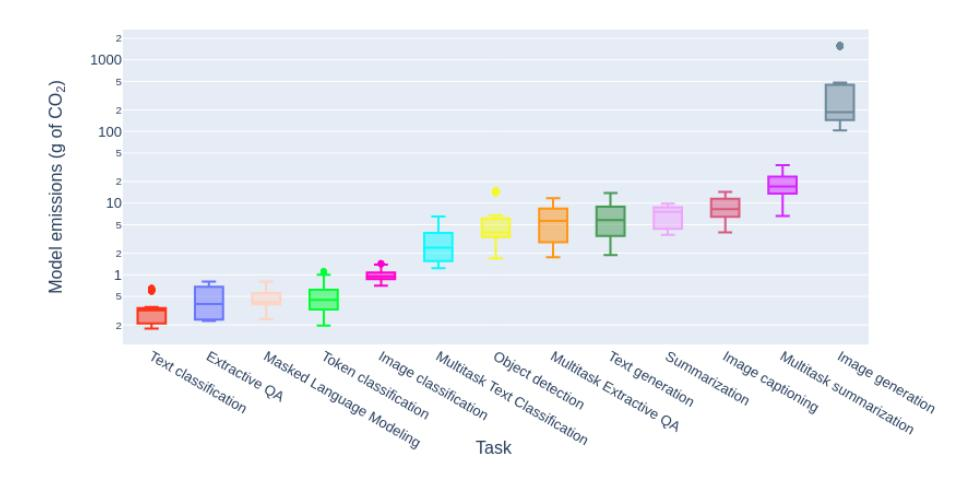
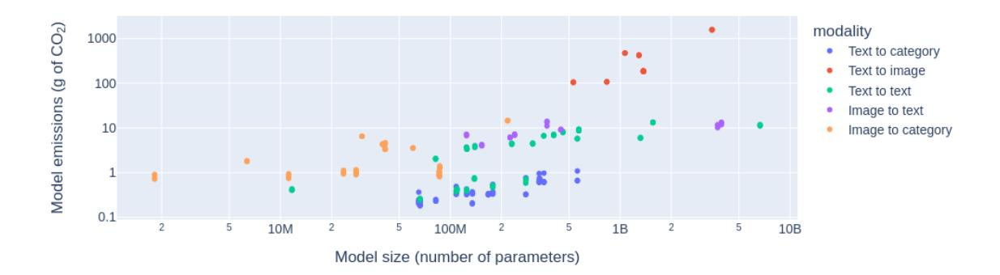
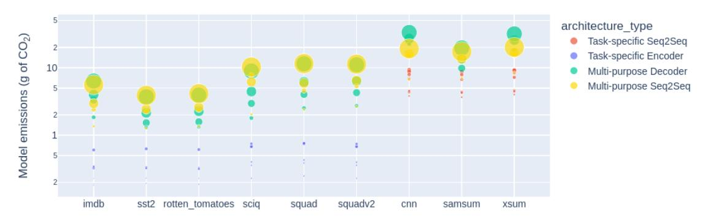
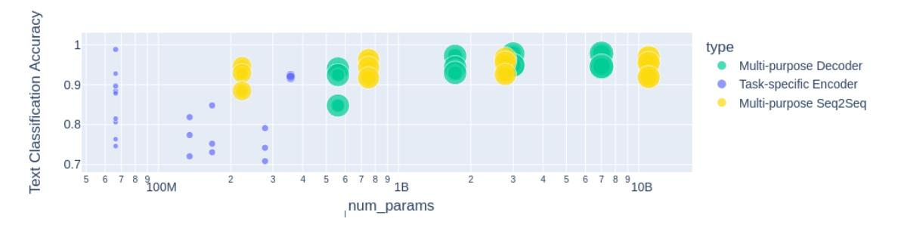
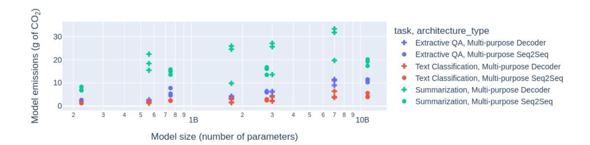
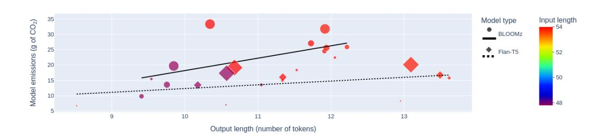
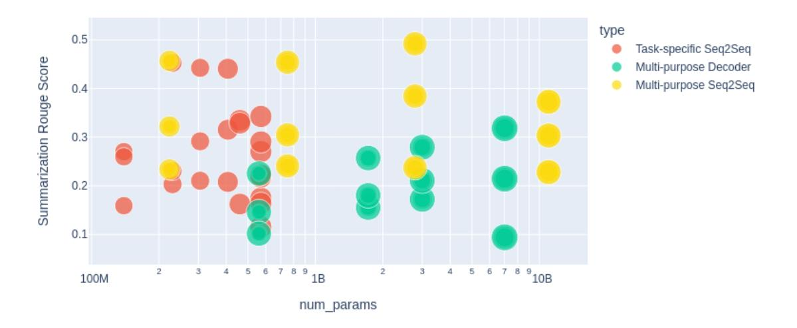
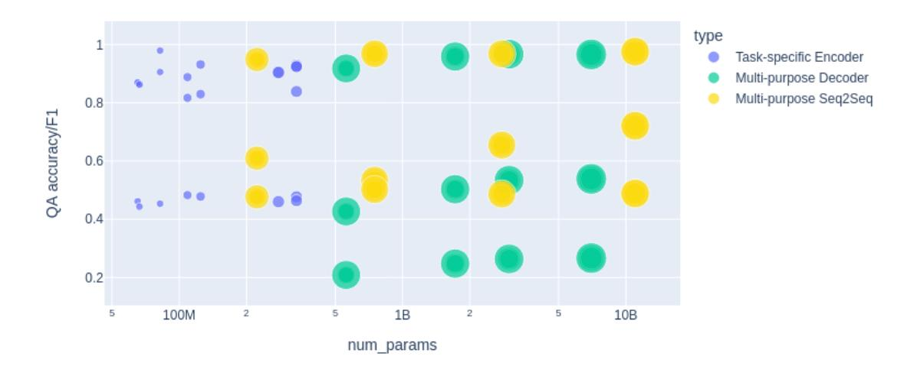

# Power Hungry Processing: Watts Driving the Cost of AI Deployment?

ALEXANDRA SASHA LUCCIONI and YACINE JERNITE, Hugging Face, Canada/USA EMMA STRUBELL, Carnegie Mellon University, Allen Institute for AI, USA

**Figure Description:**
The image is a bar chart that compares emissions of various greenhouse gases (GHGs) across different tasks or models. On the x-axis, there are nine categories labeled "Text classification QA," "Multimodal text detection extraction," "Image generation summarization," "Language model fine-tuning," "Masked language modeling," "Object detection task," "Summarization task," "Task," and "Model." Each category has two bars representing two types of GHG emissions: carbon dioxide (CO2) and methane (CH4).

The CO2 emissions for each task range from approximately 10 to 50 gigagrams per tonne (gigagrams/tonne), with some tasks showing higher emissions than others. For instance, "Text classification QA" shows the highest CO2 emission at around 30 gigagrams/tonne, while "Multimodal text detection extraction" has one of the lowest CO2 emissions at just above 10 gigagrams/tonne.

Methane emissions vary more significantly between tasks, ranging from less than 1 gigagrams/tonne for "Text classification QA" to over 90 gigagrams/tonne for "Summarization task." Notably, the "Summarization task" also has the highest CH4 emissions among all tasks shown.

In addition to these numerical values, there are colored boxes next to each task's name, which likely correspond to specific models or methods used within those tasks. However, without additional context, it is not possible to identify exactly which models or methods are represented by the colors.

Overall, the chart provides a visual representation of the environmental impact of different AI tasks in terms of their carbon footprint and contribution to climate change through the release of greenhouse gases. It suggests that certain tasks may be more environmentally friendly than others when considering both CO2 and CH4 emissions.

Fig. 1. The tasks examined in our study and the average quantity of carbon emissions they produced (in g of 2) for 1,000 queries. N.B. The y axis is in logarithmic scale.

Recent years have seen a surge in the popularity of commercial AI products based on generative, multi-purpose AI systems promising a unified approach to building machine learning (ML) models into technology. However, this ambition of "generality" comes at a steep cost to the environment, given the amount of energy these systems require and the amount of carbon that they emit. In this work, we propose the first systematic comparison of the ongoing inference cost of various categories of ML systems, covering both task-specific (i.e. finetuned models that carry out a single task) and 'general-purpose' models, (i.e. those trained for multiple tasks). We measure deployment cost as the amount of energy and carbon required to perform 1,000 inferences on representative benchmark dataset using these models. We find that multi-purpose, generative architectures are orders of magnitude more expensive than task-specific systems for a variety of tasks, even when controlling for the number of model parameters. We conclude with a discussion around the current trend of deploying multi-purpose generative ML systems, and caution that their utility should be more intentionally weighed against increased costs in terms of energy and emissions. All the data from our study can be accessed via an [interactive demo](https://huggingface.co/spaces/sasha/CO2_inference/) to carry out further exploration and analysis.

CCS Concepts: • Computing methodologies → Machine learning; Neural networks; • Hardware → Impact on the environment; Power estimation and optimization.

# ACM Reference Format:

Alexandra Sasha Luccioni, Yacine Jernite, and Emma Strubell. 2024. Power Hungry Processing: Watts Driving the Cost of AI Deployment?. In ACM Conference on Fairness, Accountability, and Transparency (ACM FAccT '24), June 3–6, 2024, Rio de Janeiro, Brazil. ACM, New York, NY, USA, [21](#page-20-0) pages.<https://doi.org/10.1145/3630106.3658542>

Permission to make digital or hard copies of part or all of this work for personal or classroom use is granted without fee provided that copies are not made or distributed for profit or commercial advantage and that copies bear this notice and the full citation on the first page. Copyrights for third-party components of this work must be honored. For all other uses, contact the owner/author(s).

© 2024 Copyright held by the owner/author(s).

Manuscript submitted to ACM

#### 1 INTRODUCTION

Understanding the environmental impacts of different industries is an important first step towards developing effective strategies to mitigate those impacts. For newer industries such as information and communication technologies (ICT) of which Artificial Intelligence (AI) and Machine Learning (ML) are considered to be a part of, more work is needed to understand the extent of their environmental impacts and the factors that influence it. Between 2017 and 2021, the electricity used by Meta, Amazon, Microsoft, and Google, the main providers of commercially-available cloud compute, more than doubled [\[22\]](#page-15-0). According to the most recent figures available, global data centre electricity consumption has grown by 20-40% annually in recent years, reaching 1-1.3% of global electricity demand and contributing 1% of energy-related greenhouse gas emissions in 2022 [\[21\]](#page-15-1). However the contribution of the AI sector specifically towards these figures is unclear.

Recent work documenting the environmental impacts of ML has focused largely on quantifying the operational energy and carbon required to perform the training phase of the ML model life cycle [\[12,](#page-15-2) [30,](#page-16-0) [41,](#page-16-1) [49\]](#page-16-2) due to the relative ease of measuring per-model energy use for that phase and the impressive quantity of energy required to perform a single training run [\[41,](#page-16-1) [49\]](#page-16-2). Yet, other phases of the ML model life cycle, such as inference, stand to impact the environment just as much, or more, than training due to the computational resources required to deploy modern models at scale. While inference on a single example requires much less computation than that required to train the same model, inference happens far more frequently than model training — as many as billions of times a day for a model powering a popular user-facing product such as Google Translate.[1](#page-1-0) Yet, in-depth work quantifying the costs of model inference and deployment is limited and their environmental impacts, in terms of energy and carbon as well as water and mining of rare earth minerals, have yet to be estimated. According to AWS, the largest global cloud provider, inference is estimated to make up 80 to 90% of total ML cloud computing demand [\[2,](#page-15-3) [28\]](#page-16-3), whereas a 2021 publication by Meta attributed approximately one-third of their internal end-to-end ML carbon footprint to model inference, with the remainder produced by data management, storage, and training [\[57\]](#page-17-0); similarly, a 2022 study from Google attributed 60% of its ML energy use to inference, compared to 40% for training [\[40\]](#page-16-4). Given the increasing ubiquity of AI model deployment, it is crucial to go beyond these high-level statistics to get a better idea of the energy requirements and carbon emissions of model inference for different models and tasks. In particular, looking at inference rather than training leads to drastically different conclusions when considering the multi-purpose (or "general-purpose") aspect specifically. Training a single model for multiple tasks can indeed be more energy-efficient when considering training costs only, but these gains can easily be lost and even reversed over the course of the model's lifetime, given how much inference is carried out when these models are deployed in user-facing applications like chat and web search.

To help shed light on this issue, we perform an extensive study measuring the amount of energy required to deploy various ML models and architectures, including large language models (LLMs)- as such, our study is, to our knowledge, the first to focus solely on the inference phase of the ML model life cycle. We study 88 models across 10 tasks and 30 datasets, spanning applications in natural language and computer vision, analyzing the impact of end task, modality, model size, architecture, and learning paradigm (i.e. task-specific or multi-task/multi-purpose) on energy efficiency. We identify orders-of-magnitude differences in the amount of energy required per inference across models, modalities and tasks and shine light on an important trade-off between the benefit of multi-purpose systems, their energy cost, and ensuing carbon emissions. By painting a more detailed picture of widely varying energy requirements for ML model

1Google reported translating more than 100 billion words per day in 2016, assuming an average query length of 100 words yields an estimate of 1 billion queries to the model per day. Source:<https://blog.google/products/translate/ten-years-of-google-translate/>

inference, we hope this study can be useful for practitioners to better understand accuracy-efficiency trade-offs across tasks and models, as well as enabling better estimates, and projections and policy decisions at the sector level.

# 2 PREVIOUS WORK

Estimating the energy and emissions of ML models has remains a relatively under-explored topic, albeit one that has been gathering traction since Strubell et al's seminal article quantifying the energy and carbon emissions of a variety of then-large NLP models [\[2019\]](#page-16-2). Since then, most studies have focused on estimating the energy consumed and carbon emitted during the training phase of neural networks – this includes studies by Patterson et al. [\[2022,](#page-16-4) [2021\]](#page-16-1), who compared different models and analyzed factors influencing their emissions. There have also been studies of specific model architectures, e.g. BLOOM [\[31\]](#page-16-5) and Nour [\[27\]](#page-16-6), which carried out in-depth analyses of the different steps in the models' life cycle and their relative contribution towards the final quantity of carbon emissions. Given the increasing deployment of ML models in the cloud, several studies have therefore looked at cloud-specific ways to reduce the emissions of ML models such as delayed scheduling, workload elasticity and choosing the least carbon-intensive electricity available Chien et al. [\[6\]](#page-15-4), Dodge et al. [\[12\]](#page-15-2), Hanafy et al. [\[19\]](#page-15-5).

Despite these empirical studies, there is currently a lack of standardized methodology for quantifying and comparing the energy consumption and carbon emissions of ML models. There are several tools that exist, such as Code Carbon [\[47\]](#page-16-7), MLCO2 [\[26\]](#page-15-6) and LLMCarbon [\[13\]](#page-15-7), all of which adopt different approaches and output different results (see [\[1\]](#page-15-8) for a detailed comparison). It is therefore difficult to systematically compare the carbon footprints of different models. Existing tools and studies have also largely focused on the dynamic power consumption (i.e. the electricity necessary for powering hardware) and its resulting emissions. However, there have been several proposals to also take into account the embodied emissions of ML models (i.e. the emissions that can be attributed to the manufacturing of computing equipment) into carbon emissions estimates. This has been impeded by a lack of transparency from the designers of common computing hardware such as GPUs, although recent estimates have revealed that the embodied carbon footprint of an LLM trained and deployed on Meta's compute cluster constitutes up to 50% of its carbon footprint [\[57\]](#page-17-0). While the majority of existing work has been focused on ML model training given that it is a more tractable part of the model life cycle (i.e. it is most often carried out over a set period of time on a specific compute instance), model inference has started to also become the subject of scholarship [\[6,](#page-15-4) [11\]](#page-15-9). Luccioni et al.'s study of BLOOM was the first of its kind to look at the specific energy costs related to deploying an LLM [\[31\]](#page-16-5) and found that, over time, this can represent a significant portion of a model's overall carbon footprint.

The current study further pursues this line of work, delving deeper into the inference stage of ML models, the energy it consumes and the carbon it emits. By testing a variety of architectures on different tasks and datasets, we aim to gain a better understanding of the degree of variance that can be observed and how seemingly small user choices can result in large differences in model's environmental impacts.

## 3 METHODOLOGY

As stated above, our study focuses on the inference (i.e. deployment) stage in the model life cycle, aiming to address the knowledge gaps that currently exist with regards to its energy consumption and ensuing emissions. We describe how we chose the tasks, datasets and models in the sections below, and present the results of our analysis in Section [4.](#page-4-0)

3

### 3.1 Task and dataset selection

As the starting point of our study, we chose 10 ML tasks from 5 different modalities: Text-to-category (text classification, token classification, extractive question answering), Text-to-text (masked language modeling, text generation, summarization), Image-to-category (image classification, object detection), Image-to-text (image captioning) and Text-to-image (image generation). These tasks were chosen because they are common in both Natural Language Processing and Computer Vision, allowing us to explore multiple modalities, and include several multimodal tasks (i.e. image captioning and image generation), allowing us to explore the nexus between several modalities as well. To test each of the tasks listed above, we chose three of the most downloaded datasets from the Hugging Face Hub. We present the tasks and their corresponding datasets in Table [1.](#page-3-0)

| Task                           | Datasets                                                | Task                    | Datasets                                        |
|--------------------------------|---------------------------------------------------------|-------------------------|-------------------------------------------------|
| image classification        | CIFAR 10 [25] CIFAR 100 [25] ImageNet 1K [45]     | question answering   | SQuAD[44] SQuAD v2 [43] SciQ [23]         |
| image captioning            | Visual Genome [24] RedCaps [10] COCO [29]         | summarization           | SAMSum [15] CNN-Daily Mail [20] XSum [35] |
| image generation            | DiffusionDB [54] ImageReward [58] SD Prompts [46] | text classification  | IMDB [32] Rotten Tomatoes [39] SST 2 [48] |
| masked language modeling | BookCorpus [59] C4 [42] OSCAR [37]                | text generation      | WikiText [33] BookCorpus [59] OSCAR [37]  |
| object detection            | Visual Genome [24] CPPE-5 [9] COCO [29]           | token classification | ReCoRD [53] WikiANN [38] CoNLL 2003 [50]  |

Table 1. A list of the tasks and datasets used in our study.

#### 3.2 Models

To be representative of a broad diversity of deployment use cases, we sampled 88 models, some of which were trained or finetuned specifically for the tasks that we selected, whereas others were designed to be used as zero-shot or multi-task models, to allow comparisons both for different architectures on a given task and between tasks for the same architecture.

Task-specific Models. For all of the tasks listed above, we selected the 8 most popular models from the HuggingFace Hub (by number of downloads) [2](#page-3-1) - we present the full list of model identifiers in Table [6](#page-18-0) in the Supplementary Materials. For each model, we ran 1,000 inferences for each of the 3 datasets from the task it was trained for (listed in Table [1\)](#page-3-0), using the Transformers [\[55\]](#page-17-5) library. We ran each set of inferences 10 times to ensure statistical significance of our measurements. We set up the inferences sequentially – i.e., without batching – in order to reflect the variability of model deployment in situ, which can make it difficult to batch model inputs.

2We were obliged to discard some models, e.g. if they were trained on another language or if the specific task they were fine-tuned for was not compatible with any of the datasets selected.

Multi-Purpose Models. In addition to the task-specific models listed above, we also selected 8 multi-purpose models to analyze on different tasks – models that were specifically trained to perform well in various different application settings. We chose 4 sequence-to-sequence models of different sizes from the Flan-T5 family [8] (base, large, xl and xxl) and 4 decoder-only models from the BLOOMz family [34]: BLOOMz–560M, BLOOMz–1B, BLOOMz–3B and BLOOMz–7B. We tested these on a subset of the tasks to allow a comparison of multi-purpose generative models with individual task-specific systems in terms of their energy consumption and emissions: question answering, text classification and summarization. We selected these three tasks because we were able to find a set of models that were capable of carrying them out with a unified model architecture (which wasn't possible for all tasks, especially ones that involved multiple modalities.) We prompted these 8 models in a zero-shot setting that was constant across models, e.g. "Summarize the following text: [text]. Summary:" on the same 1,000 samples as the fine-tuned models, also repeating each experiment ten times to measure the significance of results.

We ran all of our experiments on a node of 8 NVIDIA A100-SXM4-80GB GPUs hosted on Amazon Web Services, and used the Code Carbon package [47] to measure both the energy consumed and the carbon emitted during inference  $^3$ . Given that all of our experiments were run in the same compute region (AWS's us-west-2), which is based in Oregon and has an average carbon intensity of 297.6 grams of  $CO_2eq$  per kWh4, this means that both the energy consumed during inference and the carbon emitted are correlated; we will therefore plot one or the other depending on which aspect of our results we are discussing. While the energy consumed during inference will remain similar for models deployed on A100 GPUs in other compute regions, the carbon emissions will vary depending on the source of energy used in the region – it is therefore helpful to report both energy and carbon separately to allow for meaningful comparisons across regions and hardware. We provide all the code used for our experiments in our GitHub repository, alongside the logs produced by Code Carbon, which not only provides the total energy consumed but also a more fine-grained breakdown by hardware component (GPU, CPU and RAM), which can be used to carry out further analyses. In total, for all of model experimentation and evaluation, we used a total of 754.66 kWh of energy and emitted 178.97 kg of  $CO_2eq$ .

# 4 RESULTS

We present our results in the subsections below: in Section 4.1, we analyze the range of energy used and carbon emitted for each task for task-specific models. In Section 4.2, we shift our focus to multi-purpose (i.e. 'zero-shot' models), looking at the variation between different sizes and architectures of multi-purpose models and the difference in the energy consumption and emissions between task-specific and multi-purpose models. In Section 4.3, we carry out a comparison between model training and inference costs for models of different sizes, calculating when parity is reached.

#### 4.1 Task-specific model analysis

We start by analyzing the degree of variability in terms of the energy cost of ML models specifically trained for a variety of tasks. Table 2 shows each of the ten tasks that we analyzed as well as the mean energy used across all models for 1,000 inferences and its standard deviation. We can see that classification tasks for both images and text are on the lower end of the spectrum in terms of emissions (ranging between 0.002 and 0.007 kWh for 1,000 inferences), whereas

 $^{3}$ While all of our experiments were run on a single GPU, the idle power usage of the other GPUs is also reflected in the numbers that we report in our results.

 $^4$ The carbon intensity of an energy grid is measured in  $CO_2eq$ , and not in  $CO_2$  specifically, because the different greenhouse gases that are generated during electricity generation are reduced to a common denominator, that of carbon dioxide, or  $CO_2$ . For a more in-depth discussion of how this is done, see Luccioni and Hernandez-Garcia [2023].

generative tasks such as text generation and summarization use, on average, over 10 times more energy for the same number of inferences (around 0.05 kWh for 1,000 inferences), and multimodal tasks such as image captioning and image generation are on the highest end of the spectrum (0.06-2.9 kWh for 1,000 inferences). Text-based tasks are, all things considered, more energy-efficient than image-based tasks, with image classification requiring less energy (median of 0.0068 kWh for 1,000 inferences) than image generation (1.35 kWh) and, conversely, text generation (0.042 KwH) requiring more than text classification (0.0023 kWh). For comparison, charging the average smartphone requires 0.022 kWh of energy [\[51\]](#page-16-23), which means that the most efficient text generation model uses as much energy as 9% of a full smartphone charge for 1,000 inferences, whereas the least efficient image generation model uses as much energy as 522 smartphone charges (11.49 kWh), or around half a charge per image generation [5](#page-5-1) , although there is also a large variation between image generation models, depending on the size of image that they generate.

|                          | inference energy (kWh) |       |  |  |  |
|--------------------------|------------------------|-------|--|--|--|
| task                     | mean                   | std   |  |  |  |
| text classification      | 0.002                  | 0.001 |  |  |  |
| extractive QA            | 0.003                  | 0.001 |  |  |  |
| masked language modeling | 0.003                  | 0.001 |  |  |  |
| token classification     | 0.004                  | 0.002 |  |  |  |
| image classification     | 0.007                  | 0.001 |  |  |  |
| object detection         | 0.038                  | 0.02  |  |  |  |
| text generation          | 0.047                  | 0.03  |  |  |  |
| summarization            | 0.049                  | 0.01  |  |  |  |
| image captioning         | 0.063                  | 0.02  |  |  |  |
| image generation         | 2.907                  | 3.31  |  |  |  |

Table 2. Mean and standard deviation of energy per 1,000 queries for the ten tasks examined in our analysis.

We can also observe that there is a large variation in the amount of energy used, from the least energy-intensive task, text classification, with mean consumption of 0.002 KwH per 1,000 inferences, to the most energy-intensive one, image generation, whose mean consumption is 2.9kWh. This means that the different models examined in our study can vary by a factor of over 1450 in terms of the energy required to perform the same number of inferences. Intuitively, this is coherent given the decision space that different types of models have - from a binary classification task such as sentiment analysis (which can only output, for instance, a 0 for negative sentiment and a 1 for positive) to an entire vocabulary for text generation and summarization models. The length of text generated also impacts energy usage: on average, text generation uses 15 times more energy than masked language modeling, which makes sense given that the masked language modeling task only generates a single token, whereas in our setup the text generation task generates 10 new tokens for each input text, with the length of the input text rising as new tokens are generated, since each sequence of tokens gets fed back into the model to generate subsequent tokens. Finally, for image-based tasks, the level of abstraction is lower and the decision space is larger given that they generate raw pixels as opposed to tokens for text, making image-based tasks more energy intensive than text based ones, e.g. image classification uses over 3 times more energy than text classification (0.007 vs. 0.002 kWh) and image generation uses, on average, over 60 times more energy than text generation (0.047 vs. 2.9 kWh).

5Before January 2024, the [EPA website](https://web.archive.org/web/20230903042020/https://www.epa.gov/energy/greenhouse-gases-equivalencies-calculator-calculations-and-references) estimated a smartphone charge to consume 0.012 kWh of energy, which was the number used for comparisons in an earlier version of this study.

**Figure Description:**
The image is a scatter plot graph with a title that reads "Model size (MB)". On the x-axis, there are model sizes listed as "0.1 MB", "25 MB", "50 MB", "75 MB", "100 MB", "200 MB", "400 MB", "800 MB", "1600 MB", and "3200 MB". These numbers likely represent different models or configurations being compared.

On the y-axis, there's an unlabeled scale ranging from approximately -1 to 1000, which could be representing some form of measurement related to emissions or performance metrics for these models. However, without specific labels, it's not possible to determine exactly what each unit represents.

The data points are colorful dots scattered across the grid, indicating various levels of emission or performance associated with each model size. There are also text boxes next to the dots, but their content isn't legible due to the resolution of the image provided.

In the top right corner of the image, there is additional information about the modes of comparison: "Text to category" and "Image to text". This suggests that the data points might have been categorized based on certain criteria, possibly related to environmental impact or efficiency measures.

Overall, the image appears to be comparing the environmental impact or efficiency of different machine learning models at varying scales, using a visual representation to convey the results.

Fig. 2. The 5 modalities examined in our study, with the number of parameters of each model on the x axis and the average amount of carbon emitted for 1000 inferences on the y axis. NB: Both axes are in logarithmic scale.

Next, we examine the respective influences of model size and task structure on model emissions. Figure [2](#page-6-0) shows the relationship between model emissions (in grams of 2 per 1,000 inferences) and sizes (in terms of the number of parameters) across the task categories listed in Section [3.1.](#page-3-2) We do observe a relationship between model size and quantity of emissions produced during inference, with differing progressions for each modality – however, the task structure accounts for more of the variation than the model size does. We can observe once again that text-to-image is by far the most carbon- and energy-intensive task, with smaller image generation models such as segmind/tiny-sd that have around 500M parameters producing magnitudes more carbon than text-to-category models (100g vs. 0.6g of 2 per 1,000 inferences). Within the text-to-text tasks, we see two separate sets of models: the masked language modeling task following a lower trend, producing emissions akin to text-to-category models, compared to text generation and summarization tasks, which produce similar amounts of carbon to the image captioning models with a similar number of parameters. For context, the most carbon-intensive image generation model (stable-diffusion-xl-base-1.0) generates 1,594 grams of2 for 1,000 inferences, which is roughly the equivalent to 4.1 miles driven by an average gasoline-powered passenger vehicle [\[51\]](#page-16-23), whereas the least carbon-intensive text generation model (distilbert-base-uncased) generates as much carbon as 0.0006 miles driven by a similar vehicle, i.e. 6,833 times less. This can add up quickly when image generation models such as [Dall·E](https://openai.com/dall-e-2) and [MidJourney](https://www.midjourney.com/explore) are deployed in user-facing applications and used by millions of users globally (we discuss this point further in Section [5\)](#page-12-0).

The (high-level) takeaway of this analysis is that even for models specifically trained to carry out a single task, there is a large level of variation both within each task and an even larger one between tasks from different modalities. In essence, tasks that map both image and text inputs to categorical outputs are less energy- and carbon-intensive than those that generate text or images. Making these distinctions can help inform policies seeking to mitigate the environmental impacts of AI, given that it is important to be aware of this variation, which can sometimes reach several orders of magnitude. In the next section, we delve deeper into multi-purpose systems, which are meant to carry out several tasks concurrently, to better understand their environmental impacts and how they compare to task-specific models.

### 4.2 The environmental cost of multi-purpose systems

The second part of our analysis examines multi-task models of two types: decoder only, from the BLOOMz family, and sequence-to-sequence models from the FLAN-T5 family, with the goal of comparing energy intensity and carbon emissions of models with differing numbers of parameters when applied to different tasks. To address this question, we selected a subset of 3 tasks – text classification, extractive question answering, and summarization – given their diversity and broad applicability in a variety of settings, and compare the 8 zero-shot models of different sizes, based on the same 3 datasets per task as described in Table [1.](#page-3-0)

# 4.2.1 Emissions of task-specific and multi-task architectures.

To start our analysis, we examined how the choice of model and architecture type impacts emissions given a specific task and dataset. For this analysis, we took the same 8 task-specific models described in Section [3.2](#page-3-3) and compared their emissions to the 8 multi-purpose models described above.

**Figure Description:**
The image is a bar chart that compares different types of architecture for their carbon dioxide (CO2) emissions per gigawatt-hour (GWh). There are six architectures represented: imdb, ssq1, ssq2, rotentomatoes, xsum, and samsung. Each type of architecture has five bars corresponding to Task-specific SEQ2Seq, Task-specific Encoder, Multi-purpose Decoder, Multi-purpose SEQ2Seq, and Multi-purpose Decoder with CO2 emissions ranging from 0 to 5.

The y-axis represents Model Emissions (g(CO2)/GWh), while the x-axis lists the names of the architectures. The color coding indicates different tasks or purposes associated with each model's emission levels. For example, "Task-specific SEQ2Seq" appears in blue, indicating lower emissions compared to other tasks like "Multi-purpose SEQ2Seq," which is shown in yellow.

Each bar corresponds to one of these categories and shows the amount of CO2 emissions per GWh for that specific task within the given architecture. The exact numerical values are not visible due to the resolution of the image provided. However, it can be observed that some models have higher emissions than others across all tasks, suggesting varying degrees of environmental impact depending on the architecture and task being performed.

Fig. 3. Model emissions (measured in g 2) and architecture type for each of the datasets from our analysis. The y axis is in logarithmic scale, dot size is proportional to model size.

In Figure [3,](#page-7-1) we plot the mean query emissions for each model on a dataset-by-dataset basis. We can see that for the two discriminative tasks, sentiment analysis (which includes SST 2, Rotten Tomatoes and IMDB datasets) and question answering (which encompasses SciQ, SQuAD and SQuAD v2) there is a clear distinction between task-specific discriminative models (in blue), which have less emissions than both multi-purpose sequence-to-sequence (in yellow) and decoder-only generative models (in green). Given that the y axis in Figure [3](#page-7-1) is in logarithmic scale, this indicates that the difference is several orders of magnitude - e.g. with the most efficient task-specific models emit 0.3g of 2 per 1,000 inferences for extractive question answering on a dataset like SciQ, multi-purpose models emit 10g for the same task. This result follows intuitions derived from the model structures: while a task-specific model trained on binary text classification will carry out a softmax on a two-category vector to predict a class, a multi-purpose model will generate 'positive' or 'negative', which logically requires more energy because the prediction is based on the model's entire vocabulary. For the generative task, summarization (represented by the SAMsum, XSum and CNN-Daily Mail datasets), the task-specific and multi-purpose models are closer in terms of emissions: task-specific sequence-to-sequence models

generate 4-10g of 2 for 1,000 inferences, while multi-purpose models emit 20-30g for the same task. The difference appears to mostly come from model size – all of the task-specific summarization models we looked at were 600 million parameters at most, compared to the larger multi-purpose architectures, which attained the 11 billion parameters.

We also carry out an evaluation of both the task-specific and multi-purpose models examined in our study to ensure that they have comparable performance. For task-specific models, we used the evaluate library [\[52\]](#page-17-6) and the LM Evaluation Harness [\[14\]](#page-15-18) for zero-shot models. Fundamentally speaking, it is hard to compare task-specific and multi-purpose models using the same metrics, given that task-specific models have a much more constrained decision space (e.g. two classes in the case of binary text classification), whereas multi-purpose models have a large output vocabulary to choose from, and are dependent upon the prompt schema and prompting strategy used. However, by utilizing two standardized packages (evaluate and lm-evaluation-harness) and keeping the prompting approach stable across zero-shot models, we endeavor to standardize our evaluation approach as much as possible.

**Figure Description:**
The image is a graphical representation of text classification accuracy across different types of texts. It appears to be a scatter plot with two axes: one labeled "Text" (on the x-axis) and another labeled "Accuracy" (on the y-axis). There are three categories of text represented by colored circles: blue for Multi-purpose Decoder, green for Task-specific Encoder, and yellow for Multi-purpose SEQ2Seq. Each category has multiple data points scattered throughout the chart.

The horizontal axis represents the number of parameters used in the model or algorithm that performs the text classification task. This range spans from 0 to approximately 10^9 parameters. The vertical axis indicates the accuracy level, which ranges from 0 to just above 1.

Each point on the graph corresponds to an instance where a specific type of text was classified using a particular model configuration with varying numbers of parameters. The closer each point is to the top right corner of the graph, the higher the accuracy achieved for that particular combination of text type and parameter count. Conversely, points nearer the bottom left corner indicate lower accuracy levels.

There's also some text present at the bottom of the image, but it's not entirely clear due to its small size; however, it seems to include terms like "num_params," suggesting that these might be related to the number of parameters mentioned earlier.

Fig. 4. Model size, measured in number of parameters (x axis, logarithmic scale) and text classification accuracy (y axis), with dot size indicating the quantity of emissions (logarithmic scale).

We hone in on one specific task, text classification, in Figure [4,](#page-8-0) which illustrates the relationship between model size (x axis, in logarithmic scale), accuracy (y axis) and emissions (dot size, in logarithmic scale). Among task-specific encoder models, we observe that accuracy varies more widely, i.e. there are several smaller models of similar size and comparably small amounts of carbon emissions, with widely varying levels of accuracy. The multi-purpose models vary less in terms of accuracy, having higher average accuracy overall. Both sequence-to-sequence and decoder-only models produce comparable amounts of emissions (several orders of magnitude more than task-specific models).We can see that mid-size multi-purpose models (in the 3B parameter range) may have slightly better accuracy compared to both larger and smaller models. However, given the many caveats and specificities involved in multi-purpose LLM evaluation, this difference may not be significant. We present the full results of our evaluation, which include the other 2 tasks, in Section [B](#page-19-0) in the Supplementary Materials.

#### 4.2.2 Differences within multi-purpose architectures.

Beyond the differences between task-specific and multi-purpose models generally, we also observed variation within the multi-purpose models that we examined. We present our results in Table [3;](#page-9-0) in it, we can observe that on a per-architecture basis (i.e. within the family of decoder-only models and the family of sequence-to-sequence models), size and emissions are correlated, with smaller models emitting less carbon and using less energy. However, sequence-to-sequence models are more efficient than their decoder-only counterparts when models of the same size are compared: for instance, Flan-T5-XL and BLOOMz-3B are both of a similar size (around 3B parameters), but the former generates, on average, 2 grams of emissions less for 1,000 inferences than the latter. This difference holds when comparing Flan-T5-XXL, which is the biggest model in terms of parameter count in the multi-purpose models that we tested (11 billion), yet it has lower emissions (11.48g on average) compared to the smaller BLOOMz-7B. Comparing the models on a per-task basis in Figure [5,](#page-10-0) we can see the same pattern for zero-shot models as for task-specific ones, with text classification a less carbon-intensive task compared to question answering, and summarization the most intensive one of the three. The spread between the tasks is smaller for sequence-to-sequence models (indicated with dots in Figure [5\)](#page-10-0), whereas for decoder-only models (indicated with crosses), the difference between the different tasks is more significant.

|               | seq2seq models                                    |       |                 | decoder-only models |                         |                        |                 |  |  |
|---------------|---------------------------------------------------|-------|-----------------|---------------------|-------------------------|------------------------|-----------------|--|--|
| model name | number of emissions (g 𝐶𝑂2𝑒𝑞) parameters |       | energy (kWh) | model name       | number of parameters | emissions (g 𝐶𝑂2𝑒𝑞) | energy (kWh) |  |  |
| Flan-T5-base  | 222M                                              | 3.67  | 0.026           | BLOOMz-560M         | 559M                    | 7.5                    | 0.054           |  |  |
| Flan-T5-large | 750M                                              | 7.68  | 0.055           | BLOOMz-1B           | 1.7B                    | 8.66                   | 0.062           |  |  |
| Flan-T5-xl    | 2.8B                                              | 8.08  | 0.058           | BLOOMz-3B           | 3B                      | 10.17                  | 0.073           |  |  |
| Flan-T5-xxl   | 11B                                               | 11.48 | 0.083           | BLOOMz-7B           | 7B                      | 14.46                  | 0.104           |  |  |

Table 3. Zero-shot models in our analysis with their architecture type, model size (in number of parameters), average quantity of emissions (in g of 2) and average energy usage (in kWh) for 1,000 inferences.

We can analyse the relationship between sequence-to-sequence and decoder-only models noted in Table [3:](#page-9-0) whereas for tasks such as summarization, decoder models do generate more emissions than sequence-to-sequence models of a similar size, for question answering and text classification, the two architectures have similar emissions. This can again be explained by the differences in the model structures, specifically the attention mechanism: while sequence-tosequence models only attend to the last layer of the input when producing their answers, decoder-only architectures attend to all layers for the full sequence – leading to a stronger dependency on the output length for the number of operations, resulting in more emissions for tasks with longer outputs.

We further verify this intuition in Table [4](#page-10-1) and Figure [6:](#page-10-2) while there is some variation between models and datasets in Table [4,](#page-10-1) the distribution of output lengths is consistent with our expectations for the different task categories: tasks with longer outputs result in more emissions, especially for decoder-only models. Figure [6](#page-10-2) delves further into the relationship between average output length, carbon emissions, and model structures for the different summarization datasets. It shows a clear correlation between output length and measured emissions, with a higher slope for the decoder-only architectures (the BLOOMz family of models) than for the sequence-to-sequence architectures (the Flan-T5 family).

As we have observed in the current section, there is no 'one-size-fits-all' pattern for multi-purpose models either – they too exhibit variation in terms of their emissions and energy usage, which can be attributed to different factors,

**Figure Description:**
The image is a graphical representation of model size (in number of parameters) for various architecture types. It appears to be a bar chart with two axes: one horizontal axis labeled "Model size (number of parameters)" ranging from 0 to 10^8, and another vertical axis on the left side labeled "Architecture type" with different options such as "Extractive QA," "Multi-purpose Decoder," etc., indicating the architectures being compared.

The bars are color-coded according to their corresponding architecture type. Each bar represents the model size for that particular architecture. There are several instances where multiple bars overlap or are very close together, suggesting that some models have similar sizes across different architecture types.

On the right side of the image, there's annotations providing additional information about each architecture type. For example, under "Extractive QA," it mentions "QA, Multi-purpose Decoder." This could imply that these models are designed for question answering tasks using multi-purpose decoders. Similarly, other annotations describe the purpose of the models, such as "Text Classification, Multi-purpose Seg2Seq" for text classification models that use segmentation techniques like Sequence to Sequence (Seg2Seq).

Overall, the image provides a visual comparison of the model sizes associated with different architecture types used in natural language processing tasks.

Fig. 5. A plot of the total emissions (in grams of 2) for 1,000 inferences for all multi-purpose models.

|                    |        | BLOOMz 560M | BLOOMz 1B | BLOOMz 3B | BLOOMz 7B | Flan-T5 base | Flan-T5 large | Flan-T5 xl | Flan-T5 xxl |
|--------------------|--------|----------------|--------------|--------------|--------------|-----------------|------------------|---------------|----------------|
| dataset            | input  | output         | output       | output       | output       | output          | output           | output        | output         |
| IMDB               | 58.73  | 1.64           | 2.61         | 1.72         | 1.53         | 1.00            | 1.00             | 1.00          | 1.00           |
| Rotten Tomatoes | 30.08  | 1.00           | 0.99         | 1.03         | 1.00         | 1.00            | 1.00             | 1.00          | 1.00           |
| SST 2              | 28.35  | 0.98           | 0.99         | 1.01         | 1.02         | 1.00            | 1.00             | 1.00          | 1.00           |
| SciQ               | 113.12 | 1.28           | 1.25         | 1.10         | 1.10         | 2.03            | 5.41             | 3.12          | 2.42           |
| SQuAD              | 134.00 | 1.93           | 1.96         | 2.02         | 1.95         | 2.01            | 2.15             | 2.16          | 2.13           |
| SQuAD 2            | 115.85 | 2.33           | 2.54         | 2.58         | 2.41         | 2.28            | 2.74             | 2.71          | 2.58           |
| CNN                | 54.00  | 12.05          | 11.91        | 11.73        | 10.34        | 8.52            | 11.34            | 11.34         | 10.68          |
| SamSUM             | 47.82  | 9.54           | 9.41         | 9.75         | 9.85         | 10.56           | 11.05            | 10.18         | 10.57          |
| XSum               | 53.85  | 11.53          | 12.22        | 11.94        | 11.92        | 12.95           | 13.62            | 13.49         | 13.09          |

Table 4. Average input and output length (in number of tokens) for the 8 zero-shot models and 9 tasks examined as part of our study. The darker the cell, the more carbon was output by the model for the task.

**Figure Description:**
The image is a graphical representation of data with numerical values plotted against two axes: x-axis (Model type) and y-axis (Output length). There are three types of models represented by different symbols or colors: BLoomZ, FlanT5, and Input length. Each model has its own set of dots representing individual tokens within that model's output. These tokens are color-coded according to their input length, which ranges from 1 to 3.

The x-axis labels "BLoomZ" and "FlanT5" indicate the names of the models being compared. The y-axis label "Output length (number of tokens)" suggests that each dot represents an instance where a token was produced as part of the model's output.

On the right side of the graph, there is a legend explaining the meaning of the various colored dots. It shows that red dots correspond to tokens with an input length of 1, purple dots to tokens with an input length of 2, and pink dots to tokens with an input length of 3. This indicates that for each model, the size of the dots corresponds to the number of tokens generated during the analysis.

There are also some specific numbers labeled next to certain points on the graph. For example, one point is marked with "-48," another with "-60," and yet another with "-72." These likely represent the difference between the actual output length and the expected output length for those particular instances. A negative value implies that the actual output length was shorter than the expected output length.

Overall, the image appears to be a scatter plot comparing the performance of different language models based on the number of tokens generated per input length. The exact context or purpose of such a comparison would require additional information not provided in the image itself.

Fig. 6. A plot of the output length (X axis) and carbon emissions (Y axis) for the summarization task. The symbol refers to the type of architecture (BLOOMz vs Flan-T5), symbol size references the relative model size (in terms of the number of parameters), and color the input length.

including model size and output length. This would indicate that more careful consideration is needed when making

choices to deploy these models for different tasks and applying them in different scenarios. We further discuss our results and further avenues of research in the next and final section.

#### 4.3 Comparing model training and inference costs

An important trade-off for many AI practitioners and policy-makers is determining when exactly model inference costs reach parity with model training (and fine-tuning) - i.e. when does the *deployment* of models use as much energy as their initial *training*? This comparison is often hard to make because it requires the total energy cost of all steps of the ML model life cycle, which is very rarely available. Of the models that we examined in our study, neither the BLOOMz nor the Flan-T5 families of models reported the total energy used nor carbon emitted during their training in the papers describing the models. However, given that the BLOOMz models are fine-tuned versions of the original BLOOM family of models [56], we can base ourselves on the logs provided by the authors of the BLOOM carbon footprint estimation paper [31]. We can add to these numbers the energy cost of fine-tuning each model, which we were able to estimate based on the training logs provided by the authors of the BLOOMz paper [34], although we were lacking the necessary information to infer the carbon footprint  $^6$ . We present these numbers, alongside the average energy consumption per inference, in Table 5. We can see that the amount of energy required per inference varies from  $5.4 \times 10^{-5}$  for the smallest model, BLOOMz-560M to  $1.0 \times 10^{-4}$  kWh for the biggest one, BLOOMz-7B. This is coherent to the numbers reported by Luccioni et al. for BLOOM-176B, which required, on average, 0.004 kWh of energy per query, or 40 times more than BLOOMz-7B, being roughly 25 times bigger [31] - although this included API deployment of the model, which is not the case for the models in our study.

|                            | BLOOMz-7B            | BLOOMz-3B            | BLOOMz-1B            | BLOOMz-560M          |
|----------------------------|----------------------|----------------------|----------------------|----------------------|
| Training energy (kWh)      | 51,686               | 25,634               | 17,052               | 10,505               |
| Finetuning energy (kWh)    | 7,571                | 3,242                | 1,081                | 543                  |
| Inference energy (kWh)     | $1.0 \times 10^{-4}$ | $7.3 \times 10^{-5}$ | $6.2 \times 10^{-5}$ | $5.4 \times 10^{-5}$ |
| Cost parity (# inferences) | 592,570,000          | 395,602,740          | 292,467,741          | 204,592,592          |

Table 5. The BLOOMz models from our study with their training energy cost (from [31]), finetuning energy cost (from [34]), inference cost (from the present study), and cost parity, as the number of inferences required to sum to the training cost.

If we compare the amount of energy used per inference for each of the models with the total amount of energy used for both training and fine-tuning them, we can estimate how many inferences would be needed to be carried out with a given model in order for the cost of inference to reach the cost of training. As can be seen in Table 5, this varies depending on model size: from around 200 million inferences for the smallest model, BLOOMz-560M, to over 590 million inferences for the biggest model, BLOOMz-7B. This may seem like a lot if a single instance of a model is deployed, but can add up quickly if there are multiple instances of models deployed in parallel. For instance, it has been estimated that, at its peak, ChatGPT had upward of 10 million users per day [36]; the most recent statistics indicate that the ChatGPT login page received 1.7B visits in October 2023 7. Even assuming a single query per user, which is rarely the case, the energy costs of deploying it would surpass its training costs after a few weeks or months of deployment.

While the BLOOMz models are not deployed in real-time in the same manner as ChatGPT, they have been downloaded hundreds of thousands of times from the Hugging Face Hub, which would indicate that they have been extensively used

&lt;sup>6The energy consumption can be based on the Thermal Design Power (TDP) of the GPUs used – while it assumes 100% GPU utilization, it is the most accurate estimate possible without energy usage tracking during training.

&lt;sup>7According to SimilarWeb: https://www.similarweb.com/website/chat.openai.com/.

by the open-source community: at the time of writing this article (November 2023), BLOOMz-7B has been downloaded 606,096 times, BLOOMz-3B has been downloaded 357,368 times, BLOOMz-1B has been downloaded 61,757 times and BLOOMz-560m has been downloaded 498,601 times. They have also been finetuned for a number of downstream tasks, such as chat, and deployed in HuggingFace Spaces, interactive interfaces for model interaction. While this analysis represents a relatively small sample of models, analyses such as this are vital for estimating the relative energy consumption (and ensuing emissions) of different stages of the ML training and deployment cycle, understanding trade-offs between training and inference emissions patterns, and characterizing the lifetime emissions of ML models, and we hope that others will be possible in the future, which would require more transparency from model creators regarding both the up front (i.e. training) and downstream (i.e. inference) costs of ML models. We discuss the importance of transparency and other important actions that members of the community can take in the next, and final, section.

# 5 DISCUSSION

There have been limited studies regarding the energy consumption and carbon emissions of LLM inference, largely due to its distributed nature — compared to the relatively time- and location-constrained nature of training — making it difficult to make meaningful comparisons between different models and tasks. In this work, we have endeavored to keep as many parameters stable as possible, including the code, hardware, datasets, batch size and Python library. We provide all of the [code](https://github.com/sashavor/co2_inference/) that we used for our analysis as well as an [interactive tool](https://huggingface.co/spaces/sasha/CO2_inference) to allow users to more deeply explore the results we present here. We also highlight the main high-level takeaways of our study below:

Generative tasks are more energy- and carbon-intensive compared to discriminative tasks. As shown in Figure [1,](#page-0-0) the most energy- and carbon-intensive tasks are those that generate new content: text generation, summarization, image captioning, and image generation.

Tasks involving images are more energy- and carbon-intensive compared to those involving text alone. More specifically, tasks involving predicting categories (text-to-category, image-to-category) are less energy-intensive than those involving generating images (e.g. text-to-image), with those involving text between the two (see Figure [2\)](#page-6-0).

Decoder-only models are slightly more energy- and carbon- intensive than sequence-to-sequence models for models of a similar size and applied to the same tasks. The findings we present in Table [3,](#page-9-0) Figure [3,](#page-7-1) and Figure [6](#page-10-2) would indicate that more computation (i.e. energy) is required for decoder-only tasks, and that this phenomenon is particularly marked for tasks with longer outputs. This observation is worth verifying for other architectures from both categories, and well as other tasks and datasets.

Training remains orders of magnitude more energy- and carbon- intensive than inference. We have provided initial numbers for comparing the relative energy costs of model training, finetuning and inference for different sizes of models from the BLOOMz family, and found that the parity between training/finetuning and inference grows with model size. While the ratio is hundreds of millions of inferences for a single training, given the ubiquity of ML model deployment, this parity can be reached quickly for many popular models.

Using multi-purpose models for discriminative tasks is more energy-intensive compared to task-specific models for these same tasks. This is especially the case for text classification (on IMDB, SST 2 and Rotten Tomatoes) and question answering (on SciQ, SQuAD v1 and v2), where the gap between task-specific and zero-shot models is particularly large, and less so for summarization (for CNN-Daily Mail, SamSUM and XSum). As can be seen in Table [4,](#page-10-1) the difference

between multi-purpose models and task-specific models is amplified as the length of output gets longer.

We find this last point to be the most compelling takeaway of our study, given the current paradigm shift away from smaller models finetuned for a specific task towards models that are meant to carry out a multitude of tasks at once, deployed to respond to a barrage of user queries in real time. This transition has been happening both in ML research since the advent of GPT-3 [\[5\]](#page-15-19), which illustrated the potential for few- and zero-shot learning with language models, as well as in consumer settings, with LLMs such as GPT-4 and PaLM being deployed in user-facing products such as web search [\[4,](#page-15-20) [18\]](#page-15-21), email, and navigation [\[17\]](#page-15-22), where smaller, task-specific versions of models such as BERT were previously used [\[3,](#page-15-23) [16\]](#page-15-24). While it is hard to quantify the environmental impacts of this transition given the lack of transparency of technology companies regarding both the number of parameters, architecture and carbon emissions of their products, we can make a comparison based on the experiments carried out in the present study. For instance, the average emissions of a BERT-based model fine-tuned for extractive question answering (bert-large-uncased-whole-word-masking-finetuned-squad), a task akin to extractive web search, is 0.70g2 per 1,000 queries, which is less than 3 times that of the multi-purpose models (2.36g for Flan-T5 base and 2.34g for BLOOMz-560M). The difference is much more drastic if comparing BERT-based models for tasks such as text classification with the larger multi-purpose models: for instance bert-base-multilingual-uncased-sentiment emits just 0.32g of 2 per 1,000 queries, compared to 2.66g for Flan-T5-XL and 4.67g for BLOOMz-7B. For comparison, the first PaLM model, released in 2022, has 540 billion parameters [\[7\]](#page-15-25), whereas GPT-3 has 175 billion parameters [\[5\]](#page-15-19) [8](#page-13-0) . While we see the benefit of deploying generative zero-shot models given their ability to carry out multiple tasks, we do not see convincing evidence for the necessity of their deployment in contexts where tasks are well-defined, for instance web search and navigation, given these models' energy requirements.

Finally, the intent of our study is to set the stage for better understanding of the energy requirements and carbon emissions of the final, often overlooked, step in the ML model life cycle: model deployment. The comparison between training, finetuning and inference energy requirements carried out in Section [4.3](#page-11-0) is, to our knowledge, the first comparison of its kind, and paves the way to a better understanding of how the different stages of an ML model's lifecycle add up in terms of energy use. These are important data points that can help inform both our fellow AI researchers and practitioners, as well as policy-makers who are working towards estimating and regulating the environmental impacts of AI models and ICT in general. We recognize that our study is not representative of all deployment contexts and constraints – our intent is to establish a set of initial data points and to set the stage for testing and comparing other models. In fact, our study highlights many potential avenues for future research aimed towards a better understanding of the myriad factors that influence the efficiency of inference, including the choice of architecture, the usage of techniques such as distillation, the number of parameters, the choice of hardware and the numerical (i.e. floating point) precision of model parameters. While we encourage continued work analysing open-source models, we note that the growing lack of transparency in model architecture and training details makes this line of work, alongside many branches relating to fairness and accountability in machine learning, increasingly difficult to carry out. Given our findings and the increased deployment of generative, multi-purpose AI models, we hope that both ML researchers and practitioners will practice transparency regarding the nature and impacts of their models, to enable better understanding of their environmental impacts.

8The exact number of parameters of GPT-4 and PaLM 2 have not been publicly shared.

### ETHICAL CONSIDERATIONS STATEMENT

The main ethical concerns that we faced in our experimentation is the sheer amount of energy needed and carbon emissions generated by our study, given that we ran each of the 88 models on 3 datasets 10 times to ensure statistical significance of our measurements. In total, for all of model experimentation and evaluation, we used a total of 754.66 kWh of energy and emitted 178.97 kg of 2. In order to reduce our impacts as much as possible, we did all up-front experimentations on smaller portions of the dataset (to reduce wasted resources).

### RESEARCHER POSITIONALITY STATEMENT

The authors of this paper have backgrounds in theoretical and applied machine learning and work in institutions based in North America. We therefore recognize that our way of planning and running experiments is not necessarily reflective of other institutions from other regions, or the constraints faced by researchers from institutions with more limited access to compute.

#### ADVERSE IMPACTS STATEMENT

We recognize that our work can be perceived as a critique of ML deployment in general, given the analysis that we provide of its environmental impacts. This could be used as an argument to stop pursuing ML research and development, or as a way of targeting specific companies or organizations. Our intention, however, is to shed additional light on the environmental impacts of ML, in order to help model developers and researchers make more informed choices as a function of their environmental footprint or energy usage.

# ACKNOWLEDGMENTS

We thank Will Alpine, Nima Boscarino, Priya Donti, Régis Pierrard, David Rolnick, Roy Schwartz and Rajiv Shah for their useful feedback and suggestions.

#### REFERENCES

- [1] Nesrine Bannour, Sahar Ghannay, Aurélie Névéol, and Anne-Laure Ligozat. 2021. Evaluating the carbon footprint of NLP methods: a survey and analysis of existing tools. In EMNLP, Workshop SustaiNLP.
- [2] Jeff Barr. 2019. Amazon ec2 update–inf1 instances with AWS inferentia chips for high performance cost-effective inferencing. [https://aws.amazon.](https://aws.amazon.com/blogs/aws/amazon-ec2-update-inf1-instances-with-aws-inferentia-chips-for-high-performance-cost-effective-inferencing/) [com/blogs/aws/amazon-ec2-update-inf1-instances-with-aws-inferentia-chips-for-high-performance-cost-effective-inferencing/](https://aws.amazon.com/blogs/aws/amazon-ec2-update-inf1-instances-with-aws-inferentia-chips-for-high-performance-cost-effective-inferencing/)
- [3] Bing. 2019. Bing delivers its largest improvement in search experience using Azure GPUs. [https://azure.microsoft.com/en-us/blog/bing-delivers](https://azure.microsoft.com/en-us/blog/bing-delivers-its-largest-improvement-in-search-experience-using-azure-gpus/)[its-largest-improvement-in-search-experience-using-azure-gpus/](https://azure.microsoft.com/en-us/blog/bing-delivers-its-largest-improvement-in-search-experience-using-azure-gpus/)
- [4] Bing. 2023. Confirmed: the new Bing runs on OpenAI's GPT-4. [https://blogs.bing.com/search/march\\_2023/Confirmed-the-new-Bing-runs-on-](https://blogs.bing.com/search/march_2023/Confirmed-the-new-Bing-runs-on-OpenAI%E2%80%99s-GPT-4)[OpenAI%E2%80%99s-GPT-4](https://blogs.bing.com/search/march_2023/Confirmed-the-new-Bing-runs-on-OpenAI%E2%80%99s-GPT-4)
- [5] Tom Brown, Benjamin Mann, Nick Ryder, Melanie Subbiah, Jared D Kaplan, Prafulla Dhariwal, Arvind Neelakantan, Pranav Shyam, Girish Sastry, Amanda Askell, et al. 2020. Language models are few-shot learners. Advances in neural information processing systems 33 (2020), 1877–1901.
- [6] Andrew A Chien, Liuzixuan Lin, Hai Nguyen, Varsha Rao, Tristan Sharma, and Rajini Wijayawardana. 2023. Reducing the Carbon Impact of Generative AI Inference (today and in 2035). In Proceedings of the 2nd Workshop on Sustainable Computer Systems. 1–7.
- [7] Aakanksha Chowdhery, Sharan Narang, Jacob Devlin, Maarten Bosma, Gaurav Mishra, Adam Roberts, Paul Barham, Hyung Won Chung, Charles Sutton, Sebastian Gehrmann, et al. 2022. Palm: Scaling language modeling with pathways. arXiv preprint arXiv:2204.02311 (2022).
- [8] Hyung Won Chung, Le Hou, Shayne Longpre, Barret Zoph, Yi Tay, William Fedus, Eric Li, Xuezhi Wang, Mostafa Dehghani, Siddhartha Brahma, Albert Webson, Shixiang Shane Gu, Zhuyun Dai, Mirac Suzgun, Xinyun Chen, Aakanksha Chowdhery, Sharan Narang, Gaurav Mishra, Adams Yu, Vincent Zhao, Yanping Huang, Andrew Dai, Hongkun Yu, Slav Petrov, Ed H. Chi, Jeff Dean, Jacob Devlin, Adam Roberts, Denny Zhou, Quoc V. Le, and Jason Wei. 2022. Scaling Instruction-Finetuned Language Models.<https://doi.org/10.48550/ARXIV.2210.11416>
- [9] Rishit Dagli and Ali Mustufa Shaikh. 2021. CPPE-5: Medical Personal Protective Equipment Dataset. arXiv[:2112.09569](https://arxiv.org/abs/2112.09569) [cs.CV]
- [10] Karan Desai, Gaurav Kaul, Zubin Aysola, and Justin Johnson. 2021. RedCaps: web-curated image-text data created by the people, for the people. arXiv[:2111.11431](https://arxiv.org/abs/2111.11431) [cs.CV]
- [11] Radosvet Desislavov, Fernando Martínez-Plumed, and José Hernández-Orallo. 2021. Compute and energy consumption trends in deep learning inference. arXiv preprint arXiv:2109.05472 (2021).
- [12] Jesse Dodge, Taylor Prewitt, Remi Tachet des Combes, Erika Odmark, Roy Schwartz, Emma Strubell, Alexandra Sasha Luccioni, Noah A Smith, Nicole DeCario, and Will Buchanan. 2022. Measuring the carbon intensity of AI in cloud instances. In Proceedings of the 2022 ACM Conference on Fairness, Accountability, and Transparency. 1877–1894.
- [13] Ahmad Faiz, Sotaro Kaneda, Ruhan Wang, Rita Osi, Parteek Sharma, Fan Chen, and Lei Jiang. 2023. LLMCarbon: Modeling the end-to-end Carbon Footprint of Large Language Models. arXiv preprint arXiv:2309.14393 (2023).
- [14] Leo Gao, Jonathan Tow, Stella Biderman, Sid Black, Anthony DiPofi, Charles Foster, Laurence Golding, Jeffrey Hsu, Kyle McDonell, Niklas Muennighoff, Jason Phang, Laria Reynolds, Eric Tang, Anish Thite, Ben Wang, Kevin Wang, and Andy Zou. 2021. A framework for few-shot language model evaluation.<https://doi.org/10.5281/zenodo.5371628>
- [15] Bogdan Gliwa, Iwona Mochol, Maciej Biesek, and Aleksander Wawer. 2019. SAMSum Corpus: A Human-annotated Dialogue Dataset for Abstractive Summarization. In Proceedings of the 2nd Workshop on New Frontiers in Summarization. Association for Computational Linguistics, Hong Kong, China, 70–79.<https://doi.org/10.18653/v1/D19-5409>
- [16] Google. 2019. Understanding searches better than ever before.<https://blog.google/products/search/search-language-understanding-bert/>
- [17] Google. 2023. Bard can now connect to your Google apps and services. [https://blog.google/products/bard/google-bard-new-features-update-sept-](https://blog.google/products/bard/google-bard-new-features-update-sept-2023/)[2023/](https://blog.google/products/bard/google-bard-new-features-update-sept-2023/)
- [18] Google. 2023. An important next step on our AI journey.<https://blog.google/technology/ai/bard-google-ai-search-updates/>
- [19] Walid A Hanafy, Qianlin Liang, Noman Bashir, David Irwin, and Prashant Shenoy. 2023. CarbonScaler: Leveraging Cloud Workload Elasticity for Optimizing Carbon-Efficiency. arXiv preprint arXiv:2302.08681 (2023).
- [20] Karl Moritz Hermann, Tomás Kociský, Edward Grefenstette, Lasse Espeholt, Will Kay, Mustafa Suleyman, and Phil Blunsom. 2015. Teaching Machines to Read and Comprehend. In NeurIPS. 1693–1701.<http://papers.nips.cc/paper/5945-teaching-machines-to-read-and-comprehend>
- [21] Ralph Hintemann and Simon Hinterholzer. 2022. Cloud computing drives the growth of the data center industry and its energy consumption. Data centers 2022. ResearchGate (2022).
- [22] International Energy Authority. 2023. Data Centres and Data Transmission Networks. [https://www.iea.org/energy-system/buildings/data-centres](https://www.iea.org/energy-system/buildings/data-centres-and-data-transmission-networks)[and-data-transmission-networks](https://www.iea.org/energy-system/buildings/data-centres-and-data-transmission-networks)
- [23] Matt Gardner Johannes Welbl, Nelson F. Liu. 2017. Crowdsourcing Multiple Choice Science Questions. arXiv:1707.06209v1.
- [24] Ranjay Krishna, Yuke Zhu, Oliver Groth, Justin Johnson, Kenji Hata, Joshua Kravitz, Stephanie Chen, Yannis Kalantidis, Li-Jia Li, David A. Shamma, Michael S. Bernstein, and Li Fei-Fei. 2017. Visual Genome: Connecting Language and Vision Using Crowdsourced Dense Image Annotations. International Journal of Computer Vision 123 (2017), 32–73.<https://doi.org/10.1007/s11263-016-0981-7>
- [25] Alex Krizhevsky. 2009. Learning multiple layers of features from tiny images. Technical Report.
- [26] Alexandre Lacoste, Alexandra Luccioni, Victor Schmidt, and Thomas Dandres. 2019. Quantifying the carbon emissions of machine learning. arXiv preprint arXiv:1910.09700 (2019).

- [27] Imad Lakim, Ebtesam Almazrouei, Ibrahim Abualhaol, Merouane Debbah, and Julien Launay. 2022. A Holistic Assessment of the Carbon Footprint of Noor, a Very Large Arabic Language Model. In Proceedings of BigScience Episode #5 – Workshop on Challenges & Perspectives in Creating Large Language Models. Association for Computational Linguistics, virtual+Dublin, 84–94.<https://doi.org/10.18653/v1/2022.bigscience-1.8>
- [28] George Leopold. 2019. AWS to Offer NVIDIA's T4 GPUs for AI Inferencing. [www.hpcwire.com/2019/03/19/aws-upgrades-its-gpu-backed-ai](www.hpcwire.com/2019/03/19/aws-upgrades-its-gpu-backed-ai-inference-platform/)[inference-platform/](www.hpcwire.com/2019/03/19/aws-upgrades-its-gpu-backed-ai-inference-platform/)
- [29] Tsung-Yi Lin, Michael Maire, Serge Belongie, James Hays, Pietro Perona, Deva Ramanan, Piotr Doll'ar, and C Lawrence Zitnick. 2014. Microsoft COCO: Common objects in context. In Computer Vision–ECCV 2014: 13th European Conference, Zurich, Switzerland, September 6-12, 2014, Proceedings, Part V 13. Springer, 740–755.
- [30] Alexandra Sasha Luccioni and Alex Hernandez-Garcia. 2023. Counting carbon: A survey of factors influencing the emissions of machine learning. arXiv preprint arXiv:2302.08476 (2023).
- [31] Alexandra Sasha Luccioni, Sylvain Viguier, and Anne-Laure Ligozat. 2022. Estimating the carbon footprint of BLOOM, a 176B parameter language model. arXiv preprint arXiv:2211.02001 (2022).
- [32] Andrew L. Maas, Raymond E. Daly, Peter T. Pham, Dan Huang, Andrew Y. Ng, and Christopher Potts. 2011. Learning Word Vectors for Sentiment Analysis. In Proceedings of the 49th Annual Meeting of the Association for Computational Linguistics: Human Language Technologies. Association for Computational Linguistics, Portland, Oregon, USA, 142–150.<http://www.aclweb.org/anthology/P11-1015>
- [33] Stephen Merity, Caiming Xiong, James Bradbury, and Richard Socher. 2016. Pointer Sentinel Mixture Models. arXiv[:1609.07843](https://arxiv.org/abs/1609.07843) [cs.CL]
- [34] Niklas Muennighoff, Thomas Wang, Lintang Sutawika, Adam Roberts, Stella Biderman, Teven Le Scao, M Saiful Bari, Sheng Shen, Zheng-Xin Yong, Hailey Schoelkopf, et al. 2022. Crosslingual generalization through multitask finetuning. arXiv preprint arXiv:2211.01786 (2022).
- [35] Shashi Narayan, Shay B. Cohen, and Mirella Lapata. 2018. Don't Give Me the Details, Just the Summary! Topic-Aware Convolutional Neural Networks for Extreme Summarization. ArXiv abs/1808.08745 (2018).
- [36] Will Oremus. 2023. AI chatbots lose money every time you use them. That is a problem. Washington Post (2023). [https://www.washingtonpost.com/](https://www.washingtonpost.com/technology/2023/06/05/chatgpt-hidden-cost-gpu-compute/) [technology/2023/06/05/chatgpt-hidden-cost-gpu-compute/](https://www.washingtonpost.com/technology/2023/06/05/chatgpt-hidden-cost-gpu-compute/)
- [37] Pedro Javier Ortiz Su'arez, Benoit Sagot, and Laurent Romary. 2019. Asynchronous pipelines for processing huge corpora on medium to low resource infrastructures (Proceedings of the Workshop on Challenges in the Management of Large Corpora (CMLC-7) 2019. Cardiff, 22nd July 2019), Piotr Bański, Adrien Barbaresi, Hanno Biber, Evelyn Breiteneder, Simon Clematide, Marc Kupietz, Harald L"ungen, and Caroline Iliadi (Eds.). Leibniz-Institut f"ur Deutsche Sprache, Mannheim, 9 – 16.<https://doi.org/10.14618/ids-pub-9021>
- [38] Xiaoman Pan, Boliang Zhang, Jonathan May, Joel Nothman, Kevin Knight, and Heng Ji. 2017. Cross-lingual Name Tagging and Linking for 282 Languages. In Proceedings of the 55th Annual Meeting of the Association for Computational Linguistics (Volume 1: Long Papers). Association for Computational Linguistics, Vancouver, Canada, 1946–1958.<https://doi.org/10.18653/v1/P17-1178>
- [39] Bo Pang and Lillian Lee. 2005. Seeing stars: Exploiting class relationships for sentiment categorization with respect to rating scales. In Proceedings of the ACL.
- [40] David Patterson, Joseph Gonzalez, Urs Hölzle, Quoc Le, Chen Liang, Lluis-Miquel Munguia, Daniel Rothchild, David So, Maud Texier, and Jeff Dean. 2022. The Carbon Footprint of Machine Learning Training Will Plateau, Then Shrink.<https://doi.org/10.48550/ARXIV.2204.05149>
- [41] David Patterson, Joseph Gonzalez, Quoc Le, Chen Liang, Lluis-Miquel Munguia, Daniel Rothchild, David So, Maud Texier, and Jeff Dean. 2021. Carbon emissions and large neural network training. arXiv preprint arXiv:2104.10350 (2021).
- [42] Colin Raffel, Noam Shazeer, Adam Roberts, Katherine Lee, Sharan Narang, Michael Matena, Yanqi Zhou, Wei Li, and Peter J. Liu. 2019. Exploring the Limits of Transfer Learning with a Unified Text-to-Text Transformer. arXiv e-prints (2019). arXiv[:1910.10683](https://arxiv.org/abs/1910.10683)
- [43] Pranav Rajpurkar, Robin Jia, and Percy Liang. 2018. Know What You Don't Know: Unanswerable Questions for SQuAD. arXiv[:1806.03822](https://arxiv.org/abs/1806.03822) [cs.CL]
- [44] Pranav Rajpurkar, Jian Zhang, Konstantin Lopyrev, and Percy Liang. 2016. SQuAD: 100,000+ Questions for Machine Comprehension of Text. arXiv:1606.05250 (2016). arXiv[:1606.05250](https://arxiv.org/abs/1606.05250)
- [45] Olga Russakovsky, Jia Deng, Hao Su, Jonathan Krause, Sanjeev Satheesh, Sean Ma, Zhiheng Huang, Andrej Karpathy, Aditya Khosla, Michael Bernstein, Alexander C. Berg, and Li Fei-Fei. 2015. ImageNet Large Scale Visual Recognition Challenge. International Journal of Computer Vision (IJCV) 115, 3 (2015), 211–252.<https://doi.org/10.1007/s11263-015-0816-y>
- [46] Gustavo Santana. 2023. Stable Diffusion Prompts.<https://huggingface.co/datasets/Gustavosta/Stable-Diffusion-Prompts>
- [47] Victor Schmidt, Kamal Goyal, Aditya Joshi, Boris Feld, Liam Conell, Nikolas Laskaris, Doug Blank, Jonathan Wilson, Sorelle Friedler, and Sasha Luccioni. 2021. CodeCarbon: Estimate and Track Carbon Emissions from Machine Learning Computing.
- [48] Richard Socher, Alex Perelygin, Jean Wu, Jason Chuang, Christopher D. Manning, Andrew Ng, and Christopher Potts. 2013. Recursive Deep Models for Semantic Compositionality Over a Sentiment Treebank. In Proceedings of the 2013 Conference on Empirical Methods in Natural Language Processing. Association for Computational Linguistics, Seattle, Washington, USA, 1631–1642.<https://www.aclweb.org/anthology/D13-1170>
- [49] Emma Strubell, Ananya Ganesh, and Andrew McCallum. 2019. Energy and policy considerations for deep learning in NLP. arXiv preprint arXiv:1906.02243 (2019).
- [50] Erik F. Tjong Kim Sang and Fien De Meulder. 2003. Introduction to the CoNLL-2003 Shared Task: Language-Independent Named Entity Recognition. In Proceedings of the Seventh Conference on Natural Language Learning at HLT-NAACL 2003. 142–147.<https://www.aclweb.org/anthology/W03-0419>
- [51] US Environmental Protection Agencyy. 2024. Greenhouse Gases Equivalencies Calculator - Calculations and References. [https://www.epa.gov/](https://www.epa.gov/energy/greenhouse-gases-equivalencies-calculator-calculations-and-references) [energy/greenhouse-gases-equivalencies-calculator-calculations-and-references](https://www.epa.gov/energy/greenhouse-gases-equivalencies-calculator-calculations-and-references)

- [52] Leandro Von Werra, Lewis Tunstall, Abhishek Thakur, Alexandra Sasha Luccioni, Tristan Thrush, Aleksandra Piktus, Felix Marty, Nazneen Rajani, Victor Mustar, Helen Ngo, et al. 2022. Evaluate & Evaluation on the Hub: Better Best Practices for Data and Model Measurement. arXiv preprint arXiv:2210.01970 (2022).
- [53] Alex Wang, Yada Pruksachatkun, Nikita Nangia, Amanpreet Singh, Julian Michael, Felix Hill, Omer Levy, and Samuel R Bowman. 2019. SuperGLUE: A Stickier Benchmark for General-Purpose Language Understanding Systems. arXiv preprint arXiv:1905.00537 (2019).
- [54] Zijie J. Wang, Evan Montoya, David Munechika, Haoyang Yang, Benjamin Hoover, and Duen Horng Chau. 2022. DiffusionDB: A Large-Scale Prompt Gallery Dataset for Text-to-Image Generative Models. arXiv:2210.14896 [cs] (2022).<https://arxiv.org/abs/2210.14896>
- [55] Thomas Wolf, Lysandre Debut, Victor Sanh, Julien Chaumond, Clement Delangue, Anthony Moi, Pierric Cistac, Tim Rault, Rémi Louf, Morgan Funtowicz, et al. 2019. Huggingface's transformers: State-of-the-art natural language processing. arXiv preprint arXiv:1910.03771 (2019).
- [56] BigScience Workshop, Teven Le Scao, Angela Fan, Christopher Akiki, Ellie Pavlick, Suzana Ilić, Daniel Hesslow, Roman Castagné, Alexandra Sasha Luccioni, François Yvon, et al. 2022. BLOOM: A 176B-parameter open-access multilingual language model. arXiv preprint arXiv:2211.05100 (2022).
- [57] Carole-Jean Wu, Ramya Raghavendra, Udit Gupta, Bilge Acun, Newsha Ardalani, Kiwan Maeng, Gloria Chang, Fiona Aga Behram, James Huang, Charles Bai, et al. 2021. Sustainable AI: Environmental Implications, Challenges and Opportunities. arXiv preprint arXiv:2111.00364 (2021).
- [58] Jiazheng Xu, Xiao Liu, Yuchen Wu, Yuxuan Tong, Qinkai Li, Ming Ding, Jie Tang, and Yuxiao Dong. 2023. ImageReward: Learning and Evaluating Human Preferences for Text-to-Image Generation. arXiv[:2304.05977](https://arxiv.org/abs/2304.05977) [cs.CV]
- [59] Yukun Zhu, Ryan Kiros, Rich Zemel, Ruslan Salakhutdinov, Raquel Urtasun, Antonio Torralba, and Sanja Fidler. 2015. Aligning Books and Movies: Towards Story-Like Visual Explanations by Watching Movies and Reading Books. In The IEEE International Conference on Computer Vision (ICCV).

# A FULL LIST OF TASK-SPECIFIC MODELS TESTED

| Task                | Models                                   | Task           | Models                                                |
|---------------------|------------------------------------------|----------------|-------------------------------------------------------|
|                     | microsoft/resnet-50                      |                | distilbert-base-uncased-distilled-squad               |
|                     | microsoft/beit-base-patch16-224          |                | distilbert-base-cased-distilled-squad                 |
|                     | google/vit-base-patch16-384              |                | deepset/roberta-base-squad2                           |
| image               | facebook/convnextv2-tiny-22k-384         | question       | bert-large-uncased-whole-word-masking-finetuned-squad |
| classification      | microsoft/resnet-18                      | answering      | timpal0l/mdeberta-v3-base-squad2                      |
|                     | google/mobilenet_v1_0.75_192             |                | deepset/tinyroberta-squad2                            |
|                     | facebook/convnextv2-tiny-1k-224          |                | deepset/electra-base-squad2                           |
|                     | google/vit-base-patch16-224              |                | deepset/bert-large-uncased-whole-word-masking-squad2  |
|                     | nlpconnect/vit-gpt2-image-captioning     |                | sshleifer/distilbart-xsum-12-6                        |
|                     | Salesforce/blip-image-captioning-large   |                | sshleifer/distilbart-cnn-12-6                         |
| image captioning | Salesforce/blip-image-captioning-base    |                | pszemraj/led-large-book-summary                       |
|                     | microsoft/git-large-coco                 |                | google/pegasus-xsum                                   |
|                     | Salesforce/blip2-flan-t5-xl              | summarization  | google/pegasus-large                                  |
|                     | Salesforce/blip2-opt-2.7b                |                | google/pegasus-multi_news                             |
|                     | ydshieh/vit-gpt2-coco-en                 |                | facebook/bart-large-cnn                               |
|                     | microsoft/git-base                       |                | ainize/bart-base-cnn                                  |
|                     | runwayml/stable-diffusion-v1-5           |                | distilbert-base-uncased-finetuned-sst-2-english       |
|                     | stabilityai/stable-diffusion-2-1         |                | nlptown/bert-base-multilingual-uncased-sentiment      |
|                     | stabilityai/stable-diffusion-xl-base-1.0 |                | twitter-roberta-base-sentiment-latest                 |
| image               | CompVis/stable-diffusion-v1-4            | text           | cardiffnlp/twitter-xlm-roberta-base-sentiment         |
| generation          | prompthero/openjourney                   | classification | lvwerra/distilbert-imdb                               |
|                     | dreamlike-art/dreamlike-photoreal-2.0    |                | siebert/sentiment-roberta-large-english               |
|                     | nota-ai/bk-sdm-tiny                      |                | finiteautomata/bertweet-base-sentiment-analysis       |
|                     | segmind/tiny-sd                          |                | sbcBI/sentiment_analysis_mode                         |
|                     | bert-base-uncased                        |                | gpt2                                                  |
|                     | xlm-roberta-base                         |                | bigscience/bloom-560m                                 |
|                     | distilbert-base-uncased                  |                | distilgpt2                                            |
| masked              | roberta-base                             | text           | facebook/opt-6.7b                                     |
| language            | albert-base-v2                           | generation     | EleutherAI/gpt-neo-125m                               |
| modeling            | bert-base-cased                          |                | gpt2-medium                                           |
|                     | microsoft/deberta-base                   |                | facebook/opt-1.3b                                     |
|                     | bert-base-multilingual-cased             |                | gpt2-xl                                               |
|                     | facebook/detr-resnet-50                  |                | QCRI/bert-base-multilingual-cased-pos-english         |
|                     | hustvl/yolos-tiny                        |                | dslim/bert-base-NER                                   |
|                     | jozhang97/deta-swin-large                |                | dslim/bert-large-NER                                  |
| object              | facebook/detr-resnet-101                 | token          | Jean-Baptiste/roberta-large-ner-english               |
| detection           | hustvl/yolos-small                       | classification | oliverguhr/fullstop-punctuation-multilang-large       |
|                     | SenseTime/deformable-detr                |                | Babelscape/wikineural-multilingual-ner                |
|                     | polejowska/detr-r50-cd45rb-8ah-6l        |                | ml6team/keyphrase-extraction-distilbert-inspec        |
|                     | polejowska/detr-r50-cd45rb-1ah-6l        |                | obi/deid_roberta_i2b2                                 |
|                     |                                          |                |                                                       |

Table 6. The full list of the 80 finetuned models that were tested for the ten tasks we analyzed.

#### B MODEL EVALUATION

**Figure Description:**
The image is a bar chart titled "Summarization Routine Score" with three types of summarization routines represented by different colored bars: Task-specific Seq2Seq, Multi-purpose Decoder, and Multi-purpose Seq2Seq. Each type has four subtypes labeled as Task-specific Seq2Seq_1, Task-specific Seq2Seq_2, Task-specific Seq2Seq_3, and Task-specific Seq2Seq_4. These subtypes are further categorized into two groups: one for "0.5" and another for "0.7".

The x-axis represents the number of parameters (num_params), ranging from 100M to 10B, indicating that the data points compare performance across various parameter sizes. The y-axis shows the score, which ranges from 0 to 0.9, likely representing some form of evaluation metric such as accuracy or loss function value.

Each bar corresponds to a specific combination of task type, subtype, and parameter size. For example, the first bar on the left under the Task-specific Seq2Seq_1 category at the 0.5 parameter level indicates a score of approximately 0.68. Similarly, other bars show scores associated with each combination of variables.

Overall, the chart provides a visual representation of how well different combinations of tasks, subtasks, and parameter sizes perform according to their respective scores. It's important to note that without additional context, it's difficult to determine the exact nature of these summarization routines or the significance of the numerical values presented.

Fig. 7. A plot of model size, measured in number of parameters (x axis, in logarithmic scale) and summarization accuracy (y axis), with dot size indicating the quantity of emissions.

**Figure Description:**
The image is a scatter plot with numerical labels indicating various parameters related to an encoding process. On the x-axis, there are numbers ranging from 0 to 18, which likely correspond to different iterations or steps of the encoding process. Along the y-axis, there are two sets of data represented by three colors: blue dots for "Task-specific Encoder," green circles for "Multi-purpose Decoder," and yellow squares for "Multi-purpose Seg2Seq." Each color represents a specific model or approach used in the task at hand.

The size of each dot, circle, or square indicates some form of accuracy metric, as larger symbols typically signify higher accuracy scores. There are also smaller symbols that could be outliers or lower scoring instances. The exact nature of these metrics isn't clear without additional context provided within the image itself.

In summary, the image appears to be a visual representation of how well different models perform across multiple iterations, with the goal being to compare their performance using a common scale (from 0 to 18). It seems to be part of a technical analysis or report comparing the effectiveness of various machine learning models.

Fig. 8. A plot of model size, measured in number of parameters (x axis, in logarithmic scale) and question answering accuracy (y axis), with dot size indicating the quantity of emissions.

| model                                                    | SST 2 (acc) | IMDB (acc) | Rotten Tomatoes (acc) | SciQ (acc) | SQuAD (F1) | SQuAD v2 (F1, has answer) | SamSUM (ROUGE) | XSum (ROUGE) | CNN (ROUGE) |
|----------------------------------------------------------|----------------|---------------|-----------------------------|---------------|---------------|---------------------------------|-------------------|-----------------|----------------|
| bloomz-560m                                              | 0.92           | 0.94          | 0.85                        | 0.92          | 0.43          | 0.21                            | 0.23              | 0.15            | 0.10           |
| bloomz-1b7                                               | 0.94           | 0.97          | 0.93                        | 0.96          | 0.50          | 0.25                            | 0.26              | 0.16            | 0.18           |
| bloomz-3b                                                | 0.95           | 0.98          | 0.95                        | 0.97          | 0.53          | 0.26                            | 0.28              | 0.17            | 0.21           |
| bloomz-7b1                                               | 0.94           | 0.98          | 0.95                        | 0.97          | 0.54          | 0.27                            | 0.32              | 0.21            | 0.09           |
| flan-t5-xxl                                              | 0.96           | 0.97          | 0.92                        | 0.72          | 0.98          | 0.49                            | 0.30              | 0.37            | 0.23           |
| flan-t5-xl                                               | 0.96           | 0.97          | 0.93                        | 0.66          | 0.97          | 0.49                            | 0.49              | 0.38            | 0.24           |
| flan-t5-large                                            | 0.94           | 0.96          | 0.92                        | 0.53          | 0.97          | 0.50                            | 0.45              | 0.30            | 0.24           |
| flan-t5-base                                             | 0.93           | 0.95          | 0.88                        | 0.61          | 0.95          | 0.48                            | 0.46              | 0.32            | 0.23           |
| distilbert-base-uncased -distilled-squad              |                |               |                             | 0.44          | 0.87          | 0.86                            |                   |                 |                |
| distilbert-base-cased distilled-squad                 |                |               |                             | 0.46          | 0.87          | 0.87                            |                   |                 |                |
| deepset/roberta-base-squad2                              |                |               |                             | 0.48          | 0.93          | 0.83                            |                   |                 |                |
| bert-large-uncased-whole word-masking-finetuned-squad |                |               |                             | 0.48          | 0.93          | 0.84                            |                   |                 |                |
| timpal0l/mdeberta-v3- base-squad2                     |                |               |                             | 0.46          | 0.91          | 0.90                            |                   |                 |                |
| deepset/tinyroberta-squad2                               |                |               |                             | 0.45          | 0.98          | 0.91                            |                   |                 |                |
| deepset/electra-base-squad2                              |                |               |                             | 0.48          | 0.89          | 0.82                            |                   |                 |                |
| deepset/bert-large-uncased whole-word-masking-squad2  |                |               |                             | 0.46          | 0.92          | 0.92                            |                   |                 |                |
| sshleifer/distilbart-xsum-12-6                           |                |               |                             |               |               |                                 | 0.20              | 0.45            | 0.23           |
| sshleifer/distilbart-cnn-12-6                            |                |               |                             |               |               |                                 | 0.29              | 0.21            | 0.44           |
| pszemraj/led-large book-summary                       |                |               |                             |               |               |                                 | 0.33              | 0.16            | 0.33           |
| pegasus-xsum                                             |                |               |                             |               |               |                                 | 0.22              | 0.22            | 0.22           |
| pegasus-large                                            |                |               |                             |               |               |                                 | 0.27              | 0.17            | 0.34           |
| pegasus-multi_news                                       |                |               |                             |               |               |                                 | 0.12              | 0.16            | 0.29           |
| facebook/bart-large-cnn                                  |                |               |                             |               |               |                                 | 0.32              | 0.21            | 0.44           |
| ainize/bart-base-cnn                                     |                |               |                             |               |               |                                 | 0.27              | 0.16            | 0.26           |
| distilbert-base-uncased finetuned-sst-2-english       | 0.99           | 0.88          | 0.90                        |               |               |                                 |                   |                 |                |
| nlptown/bert-base multilingual-uncased-sentiment      | 0.75           | 0.85          | 0.73                        |               |               |                                 |                   |                 |                |
| twitter-roberta-base sentiment-latest                 | 0.82           | 0.80          | 0.77                        |               |               |                                 |                   |                 |                |
| cardiffnlp/twitter-xlm-roberta base-sentiment         | 0.79           | 0.71          | 0.74                        |               |               |                                 |                   |                 |                |
| lvwerra/distilbert-imdb                                  | 0.88           | 0.93          | 0.82                        |               |               |                                 |                   |                 |                |
| siebert/sentiment-roberta large-english               | 0.92           | 0.92          | 0.92                        |               |               |                                 |                   |                 |                |
| finiteautomata/bertweet base-sentiment-analysis       | 0.82           | 0.72          | 0.77                        |               |               |                                 |                   |                 |                |
| sbcBI/sentiment_analysis_model                           | 0.81           | 0.75          | 0.76                        |               |               |                                 |                   |                 |                |

Table 7. Full performance metrics for the 32 models (24 finetuned, 8 multi-purpose) that we evaluated as part of our study.