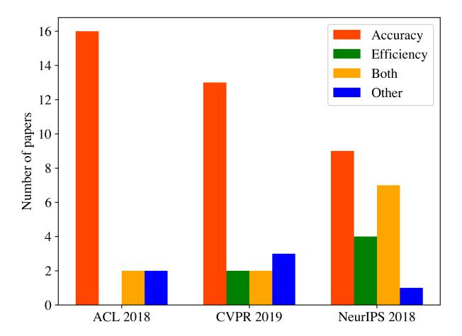
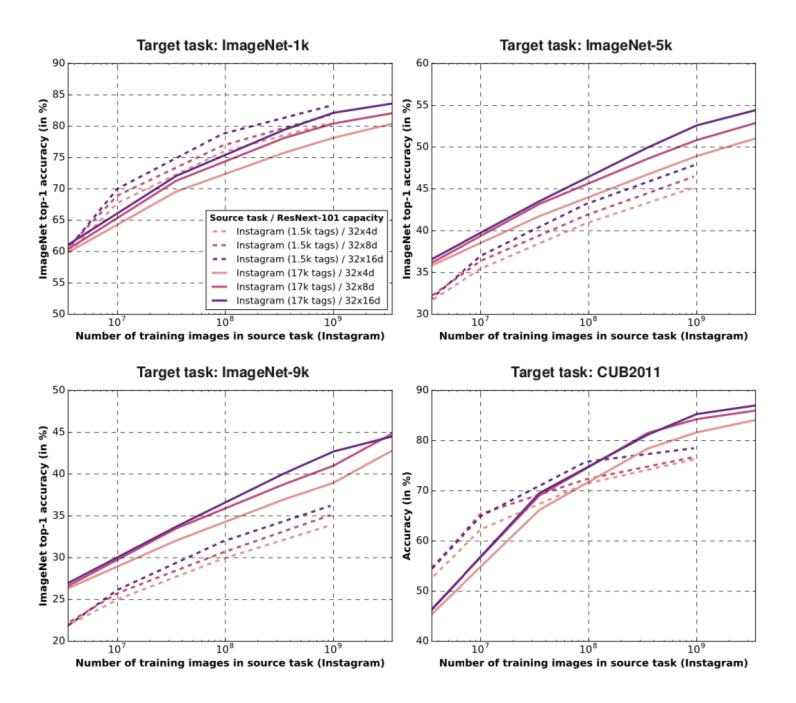
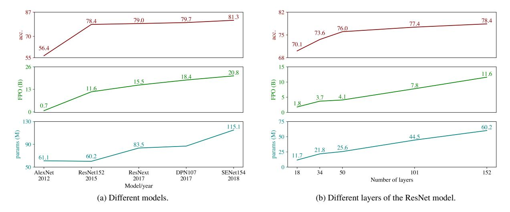

# Green AI

Roy Schwartz∗ ♦ Jesse Dodge∗♦♣ Noah A. Smith♦♥ Oren Etzioni♦

♦Allen Institute for AI, Seattle, Washington, USA ♣ Carnegie Mellon University, Pittsburgh, Pennsylvania, USA ♥ University of Washington, Seattle, Washington, USA

July 2019

#### Abstract

The computations required for deep learning research have been doubling every few months, resulting in an estimated 300,000x increase from 2012 to 2018 [\[2\]](#page-8-0). These computations have a surprisingly large carbon footprint [\[40\]](#page-10-0). Ironically, deep learning was inspired by the human brain, which is remarkably energy efficient. Moreover, the financial cost of the computations can make it difficult for academics, students, and researchers, in particular those from emerging economies, to engage in deep learning research.

This position paper advocates a practical solution by making efficiency an evaluation criterion for research alongside accuracy and related measures. In addition, we propose reporting the financial cost or "price tag" of developing, training, and running models to provide baselines for the investigation of increasingly efficient methods. Our goal is to make AI both greener and more inclusive—enabling any inspired undergraduate with a laptop to write high-quality research papers. Green AI is an emerging focus at the Allen Institute for AI.

### 1 Introduction and Motivation

Since 2012, the field of artificial intelligence has reported remarkable progress on a broad range of capabilities including object recognition, game playing, machine translation, and more [\[36\]](#page-10-1). This progress has been achieved by increasingly large and computationally-intensive deep learning models.[1](#page-0-0) Figure [1](#page-1-0) reproduced from [\[2\]](#page-8-0) plots training cost increase over time for state-of-the-art deep learning models starting with AlexNet in 2012 [\[20\]](#page-9-0) to AlphaZero in 2017 [\[38\]](#page-10-2). The chart shows an overall increase of 300,000x, with training cost doubling every few months. An even sharper trend can be observed in NLP word embedding approaches by looking at ELMo [\[29\]](#page-10-3) followed by BERT [\[8\]](#page-9-1), openGPT-2 [\[30\]](#page-10-4), and XLNet [\[48\]](#page-11-0). An important paper [\[40\]](#page-10-0) has estimated the carbon footprint of several NLP models and argued that this trend is both environmentally unfriendly (which we refer to as Red AI) and expensive, raising barriers to participation in NLP research.

This trend is driven by the strong focus of the AI community on obtaining "state-of-the-art" results,[2](#page-0-1) as exemplified by the rising popularity of leaderboards [\[46,](#page-11-1) [45\]](#page-11-2), which typically report accuracy measures but omit any mention of cost or efficiency (see, for example, [leaderboards.allenai.org](https://leaderboards.allenai.org)). Despite the clear benefits of improving model accuracy in AI, the focus on this single metric ignores the economic, environmental, or social cost of reaching the reported accuracy.

We advocate increasing research activity in Green AI—AI research that is more environmentally friendly and inclusive. We emphasize that Red AI research has been yielding valuable contributions to the field of AI, but it's been overly dominant. We want to shift the balance towards the Green AI *option*—to ensure that any inspired undergraduate with a laptop has the opportunity to write high-quality papers that could be accepted at premier research conferences.

∗The first two authors contributed equally. The research was done at the Allen Institute for AI.

1For brevity, we refer to AI throughout this paper, but our focus is on AI research that relies on deep learning methods.

2Meaning, in practice, that a system's accuracy on some benchmark is greater than any previously reported system's accuracy.

**Figure Description:**
The image is a line graph with a horizontal axis labeled "Year" from 2013 to 2019, indicating time progression. On the vertical axis, there are numerical values ranging from -10,000 to 10,000, which likely correspond to some form of measurement or score related to training performance or data processing. There are two lines representing different entities or systems: one is marked as "DON," and the other represents an unspecified entity that appears to be associated with neural machine translation (NMT). Both lines show fluctuations over the years, suggesting changes in their respective metrics or scores.

The graph includes various colored dots connected by lines, each dot corresponding to a specific year and possibly representing additional information such as individual datasets, projects, or milestones within the broader context of the graph's purpose. These dots are color-coded according to labels like "AlexNet," "GoogleNet," "Visualizing and Understanding Conv Nets," "DeepSpeech2," "ResNets," and others, implying that these could be referring to specific models, architectures, or research areas. Some of these labels include acronyms for well-known models or techniques, such as "VGG" for Visual Geometry Group, known for its contributions to computer vision.

There are also red squares at certain points along both lines, although it is not clear from the image alone why these squares have been placed there. They may indicate significant events, achievements, or challenges related to the work being represented by the graph.

Overall, the image seems to depict trends and developments in artificial intelligence, particularly in the field of deep learning, over a six-year period starting from around 2014. It highlights advancements in model architecture, dataset analysis, and understanding of convolutional neural networks (CNNs) through visualization tools.

Figure 1: The amount of compute used to train deep learning models has increased 300,000x in 6 years. Figure taken from [\[2\]](#page-8-0).

Specifically, we propose making efficiency a more common evaluation criterion for AI papers alongside accuracy and related measures.

AI research can be computationally expensive in a number of ways, but each provides opportunities for efficient improvements; for example, papers could be required to plot accuracy as a function of computational cost and of training set size, providing a baseline for more data-efficient research in the future. Reporting the computational price tag of finding, training, and running models is a key Green AI practice (see Equation [1\)](#page-2-0). In addition to providing transparency, price tags are baselines that other researchers could improve on.

Our empirical analysis in Figure [2](#page-2-1) suggests that the AI research community has paid relatively little attention to computational efficiency. In fact, as Figure [1](#page-1-0) illustrates, the computational cost of research is increasing exponentially, at a pace that far exceeds Moore's Law [\[28\]](#page-10-5). Red AI is on the rise despite the well-known diminishing returns of increased cost (e.g., Figure [3\)](#page-4-0). This paper identifies key factors that contribute to Red AI and advocates the introduction of a simple, easy-to-compute efficiency metric that could help make some AI research greener, more inclusive, and perhaps more cognitively plausible. Green AI is part of a broader, long-standing interest in environmentally-friendly scientific research (e.g., see the journal *Green Chemistry*). Computer science, in particular, has a long history of investigating sustainable and energy-efficient computing (e.g., see the journal *Sustainable Computing: Informatics and Systems*).

The remainder of this paper is organized as follows. Section [2](#page-1-1) analyzes practices that move deep-learning research into the realm of Red AI. Section [3](#page-4-1) discusses our proposals for Green AI. Section [4](#page-7-0) considers related work, and we conclude with a discussion of directions for future research.

### 2 Red AI

Red AI refers to AI research that seeks to obtain state-of-the-art results in accuracy (or related measures) through the use of massive computational power—essentially "buying" stronger results. Yet the relationship between model performance and model complexity (measured as number of parameters or inference time) has long been understood to be at best logarithmic; for a linear gain in performance, an exponentially larger model is required [\[18\]](#page-9-2). Similar trends exist with increasing the quantity of training data [\[41,](#page-11-3) [13\]](#page-9-3) and the number of experiments [\[9\]](#page-9-4). In each of these cases, diminishing returns come at increased computational cost.

This section analyzes the factors contributing to Red AI and shows how it is resulting in diminishing returns over time (see Figure [3\)](#page-4-0). We note again that Red AI work is valuable, and in fact, much of it contributes to what we know

**Figure Description:**
The image is a bar chart with three bars representing different years: ACL 2018, CVPR 2019, and NeurIPS 2018. Each year has four bars corresponding to accuracy, efficiency, both, and other categories. The x-axis of the chart lists these categories from left to right.

In the ACL 2018 category, there are two blue bars for "accuracy" and "efficiency," one orange bar for "both," and no bar for "other." The height of the "accuracy" bar is 6 units, while that of the "efficiency" bar is 3 units. There's also an orange bar labeled as "both," which stands at 4 units tall. No bar appears under the "other" label.

For CVPR 2019, the "accuracy" bar is taller than the others, reaching 7 units, followed by the "efficiency" bar at 5 units. Both the "both" (orange) and "other" (blue) bars stand at 2 units each.

The NeurIPS 2018 category shows a similar pattern to ACL 2018, with the "accuracy" bar being the tallest at 5 units, the "efficiency" bar standing at 3 units, and the "both" and "other" bars having heights of 2 units each.

Each bar represents some form of measurement or comparison related to artificial intelligence research papers published in these conferences. However, without additional context, it's unclear exactly what the numbers represent—they could be scores, rankings, or any number of metrics used to evaluate AI research.

Figure 2: AI papers tend to target *accuracy* rather than *efficiency*. The figure shows the proportion of papers that target accuracy, efficiency, both or other from a sample of 60 papers from top AI conferences.

by pushing the boundaries of AI. Our exposition here is meant to highlight areas where computational expense is high, and to present each as an opportunity for developing more efficient techniques.

To demonstrate the prevalence of Red AI, we sampled 60 papers from top AI conferences (ACL,[3](#page-2-2) NeurIPS,[4](#page-2-3) and CVPR[5](#page-2-4) ). For each paper we noted whether the authors claim their main contribution to be (a) an improvement to accuracy or some related measure, (b) an improvement to efficiency, (c) both, or (d) other. As shown in Figure [2,](#page-2-1) in all conferences we considered, a large majority of the papers target accuracy (90% of ACL papers, 80% of NeurIPS papers and 75% of CVPR papers). Moreover, for both empirical AI conferences (ACL and CVPR) only a small portion (10% and 20% respectively) argue for a new efficiency result.[6](#page-2-5) This highlights the focus of the AI community on measures of performance such as accuracy, at the expense of measures of efficiency such as speed or model size. In this paper we argue that a larger weight should be given to the latter.

To better understand the different ways in which AI research can be red, consider an AI result reported in a scientific paper. This result typically includes a model trained on a training dataset and evaluated on a test dataset. The process of developing that model often involves multiple experiments to tune its hyperparameters. When considering the different factors that increase the computational and environmental cost of producing such a result, three factors come to mind: the cost of executing the model on a single (E)xample (either during training or at inference time); the size of the training (D)ataset, which controls the number of times the model is executed during training, and the number of (H)yperparameter experiments, which controls how many times the model is trained during model development. The total cost of producing a (R)esult in machine learning increases linearly with each of these quantities. This cost can be estimated as follows:

$$Cost(R) \propto E \cdot D \cdot H$$

Equation 1: The equation of Red AI: The cost of an AI (R)esult grows linearly with the cost of processing a single (E)xample, the size of the training (D)ataset and the number of (H)yperparameter experiments.

Equation [1](#page-2-0) is a simplification (e.g., different hyperparameter assignments can lead to different costs for processing a single example). It also ignores other factors such as the number of training epochs. Nonetheless, it illustrates three

3<https://acl2018.org>

4<https://nips.cc/Conferences/2018>

5<http://cvpr2019.thecvf.com>

6 Interestingly, many NeurIPS papers included convergence rates or regret bounds which describe performance as a function of examples or iterations, thus targeting efficiency (55%). This indicates an increased awareness of the importance of this concept, at least in theoretical analyses.

quantities that are each an important factor in the total cost of generating a result. Below, we consider each quantity separately.

Expensive processing of one example Our focus is on neural models, where it is common for each training step to require inference, so we discuss training and inference cost together as "processing" an example. Some works have used increasingly expensive models which require great amounts of resources, and as a result, in these models, performing inference can require a lot of computation, and training even more so. For instance, Google's BERT-large [\[8\]](#page-9-1) contains roughly 350 million parameters. openAI's openGPT2-XL model [\[30\]](#page-10-4) contains 1.5 billion parameters. AI2, our home organization, recently released Grover [\[49\]](#page-11-4), also containing 1.5 billion parameters. In the computer vision community, a similar trend is observed (Figure [1\)](#page-1-0).

Such large models have high costs for processing each example, which leads to large training costs. BERT-large was trained on 64 TPU chips for 4 days. Grover was trained on 256 TPU chips for two weeks, at an estimated cost of \$25,000. XLNet had a similar architecture to BERT-large, but used a more expensive objective function (in addition to an order of magnitude more data), and was trained on 512 TPU chips for 2.5 days.[7](#page-3-0) It is impossible to reproduce the best BERT-large results[8](#page-3-1) or XLNet results[9](#page-3-2) using a single GPU. Specialized models can have even more extreme costs, such as AlphaGo, the best version of which required 1,920 CPUs and 280 GPUs to play a single game of Go [\[37\]](#page-10-6) at a cost of over \$1,000 per hour.[10](#page-3-3)

When examining variants of a single model (e.g., BERT-small and BERT-large) we see that larger models can have stronger performance, which is a valuable scientific contribution. However, this implies the financial and environmental cost of increasingly large AI models will not decrease soon, as the pace of model growth far exceeds the resulting increase in model performance [\[16\]](#page-9-5). As a result, more and more resources are going to be required to keep improving AI models by simply making them larger.

Processing many examples Another way state-of-the-art performance has recently been progressing in AI is by successively increasing the amount of training data models are trained on. BERT-large had top performance in 2018 across many NLP tasks after training on 3 billion word-pieces. XLNet recently outperformed BERT after training on 32 billion word-pieces, including part of Common Crawl; openGPT-2-XL trained on 40 billion words; FAIR's RoBERTa [\[23\]](#page-9-6) was trained on 160GB of text, roughly 40 billion word-pieces, requiring around 25,000 GPU hours to train. In computer vision, researchers from Facebook [\[25\]](#page-9-7) pretrained an image classification model on 3.5 billion images from Instagram, three orders of magnitude larger than existing labelled image datasets such as Open Images.[11](#page-3-4)

The use of massive data creates barriers for many researchers for reproducing the results of these models, or training their own models on the same setup (especially as training for multiple epochs is standard). For example, the June 2019 Common Crawl contains 242 TB of uncompressed data,[12](#page-3-5) so even storing the data is expensive. Finally, as in the case of model size, relying on more data to improve performance is notoriously expensive because of the diminishing return of adding more data [\[41\]](#page-11-3). For instance, Figure [3,](#page-4-0) taken from [\[25\]](#page-9-7), shows a logarithmic relation between the object recognition top-1 accuracy and the number of training examples.

Massive number of experiments Some projects have poured large amounts of computation into tuning hyperparameters or searching over neural architectures, well beyond the reach of most researchers. For instance, researchers from Google [\[51\]](#page-11-5) trained over 12,800 neural networks in their neural architecture search to improve performance on object detection and language modeling. With a fixed architecture, researchers from DeepMind [\[26\]](#page-10-7) evaluated 1,500 hyperparameter assignments to demonstrate that an LSTM language model [\[15\]](#page-9-8) can reach state-of-the-art perplexity results. Despite the value of this result in showing that the performance of an LSTM does not plateau after only a few hyperparameter trials, fully exploring the potential of other competitive models for a fair comparison is prohibitively expensive.

7Some estimates for the cost of this process reach \$250,000 ([twitter.com/eturner303/status/1143174828804857856](https://twitter.com/eturner303/status/1143174828804857856)).

8See <https://github.com/google-research/bert>

9See <https://github.com/zihangdai/xlnet>

10Recent versions of AlphaGo are far more efficient [\[39\]](#page-10-8).

11<https://opensource.google.com/projects/open-images-dataset>

12<http://commoncrawl.org/2019/07/>

**Figure Description:**
The image is a composite of four separate graphs, each representing different data sets related to an "ImageNet-9k" task involving images with various sizes and tasks. Each graph has a title that reads "Target task: ImageNet-9k," indicating the context or dataset being analyzed.

The first graph (on the left) shows two lines labeled "Incremental training" and "Fine-tuning." These lines are plotted against the x-axis, which represents accuracy in percentage terms. On the y-axis, there's a scale from 0% to 100%, suggesting that higher numbers indicate better performance. This graph compares incremental training versus fine-tuning for a target task.

The second graph (in the middle) also features two lines, but here they are labeled as "ResNext-101 capacity" and "ResNext-101 capacity + ResNext-3x4d." Both lines show a similar trend, increasing in accuracy as the number of training images increases. There are three bars beneath these lines, corresponding to different types of training images: Instagram (25), Instagram (75), and InstaGram (100). The bars increase in height as the number of training images increases, showing how the accuracy improves with more diverse sources of training images.

The third graph (on the right) presents another comparison between "Incremental training" and "Fine-tuning." However, it includes additional labels such as "CUB2011" and "CUB2011+CUB2011." It appears to compare the performance of models trained only on CUB2011 images versus those trained using both CUB2011 and CUB2011 datasets. Like the previous graphs, the accuracy increases with the number of training images.

Lastly, the fourth graph (at the bottom) displays a single line labeled "Number of training images in source task (instagram)" overlaid on a purple background. This graph seems to focus solely on the impact of varying numbers of training images sourced from Instagram, without comparing it to other methods like incremental training or fine-tuning.

Each graph uses a combination of colors (purple, red, blue, and pink) to distinguish between different categories or conditions within their respective datasets. The overall style of the image suggests it could be part of a research paper or presentation analyzing the effectiveness of different training strategies for computer vision tasks.

Figure 3: Diminishing returns of training on more data: object detection accuracy increases linearly as the number of training examples increases exponentially [\[25\]](#page-9-7).

The topic of massive number of experiments is not as well studied as the first two discussed above. In fact, the number of experiments performed during model construction is often underreported. Nonetheless, evidence for a logarithmic relation exists here as well, between the number of experiments and performance gains [\[9\]](#page-9-4).

Discussion The benefits of pouring more resources into models are certainly of interest to the AI community. Indeed, there is value in pushing the limits of model size, dataset size, and the hyperparameter search space. Currently, despite the massive amount of resources put into recent AI models, such investment still pays off in terms of downstream performance (albeit at an increasingly lower rate). Finding the point of saturation (if such exists) is an important question for the future of AI.

Our goal in this paper is to raise awareness of the cost of Red AI, as well as encourage the AI community to recognize the value of work by researchers that take a different path, optimizing efficiency rather than accuracy. Next we turn to discuss concrete measures for making AI more green.

### 3 Green AI

The term Green AI refers to AI research that yields novel results without increasing computational cost, and ideally reducing it. Whereas Red AI has resulted in rapidly escalating computational (and thus carbon) costs, Green AI has the opposite effect. If measures of efficiency are widely accepted as important evaluation metrics for research alongside accuracy, then researchers will have the option of focusing on the efficiency of their models with positive impact on both the environment and inclusiveness. This section reviews several measures of efficiency that could be reported and optimized, and advocates one particular measure—FPO—which we argue should be reported when AI research findings are published.

#### 3.1 Measures of Efficiency

To measure efficiency, we suggest reporting the amount of work required to generate a result in AI, that is, the amount of work required to train a model, and if applicable, the sum of works for all hyperparameter tuning experiments. As the cost of an experiment decomposes into the cost of a processing a single example, the size of the dataset, and the number of experiments (Equation [1\)](#page-2-0), reducing the amount of work in each of these steps will result in AI that is more green.

When reporting the amount of work done by a model, we want to measure a quantity that allows for a fair comparison between different models. As a result, this measure should ideally be stable across different labs, at different times, and using different hardware.

Carbon emission Carbon emission is appealing as it is a quantity we want to directly minimize. Nonetheless it is impractical to measure the exact amount of carbon released by training or executing a model, and accordingly generating an AI result, as this amount depends highly on the local electricity infrastructure. As a result, it is not comparable between researchers in different locations or even the same location at different times.

Electricity usage Electricity usage is correlated with carbon emission while being time- and location-agnostic. Moreover, GPUs often report the amount of electricity each of their cores consume at each time point, which facilitates the estimation of the total amount of electricity consumed by generating an AI result. Nonetheless, this measure is hardware dependent, and as a result does not allow for a fair comparison between different models.

Elapsed real time The total running time for generating an AI result is a natural measure for efficiency, as all other things being equal, a faster model is doing less computational work. Nonetheless, this measure is highly influenced by factors such as the underlying hardware, other jobs running on the same machine, and the number of cores used. These factors hinder the comparison between different models, as well as the decoupling of modeling contributions from hardware improvements.

Number of parameters Another common measure of efficiency is the number of parameters (learnable or total) used by the model. As with run time, this measure is correlated with the amount of work. Unlike the other measures described above, it does not depend on the underlying hardware. Moreover, this measure also highly correlates with the amount of memory consumed by the model. Nonetheless, different algorithms make different use of their parameters, for instance by making the model deeper vs. wider. As a result, different models with a similar number of parameters often perform different amounts of work.

FPO As a concrete measure, we suggest reporting the total number of floating point operations (FPO) required to generate a result.[13](#page-5-0) FPO provides an estimate to the amount of work performed by a computational process. It is computed analytically by defining a cost to two base operations, ADD and MUL. Based on these operations, the FPO cost of any machine learning abstract operation (e.g., a tanh operation, a matrix multiplication, a convolution operation, or the BERT model) can be computed as a recursive function of these two operations. FPO has been used in the past to quantify the energy footprint of a model [\[27,](#page-10-9) [43,](#page-11-6) [12,](#page-9-9) [42\]](#page-11-7), but is not widely adopted in AI.

FPO has several appealing properties. First, it directly computes the amount of work done by the running machine when executing a specific instance of a model, and is thus tied to the amount of energy consumed. Second, FPO is agnostic to the hardware on which the model is run. This facilitates fair comparisons between different approaches, unlike the measures described above. Third, FPO is strongly correlated with the running time of the model [\[4\]](#page-8-1). Unlike asymptotic runtime, FPO also considers the amount of work done at each time step.

Several packages exist for computing FPO in various neural network libraries,[14](#page-5-1) though none of them contains all the building blocks required to construct all modern AI models. We encourage the builders of neural network libraries to implement such functionality directly.

13Floating point operations are often referred to as FLOP(s), though this term is not uniquely defined [\[12\]](#page-9-9). To avoid confusion, we use the term FPO.

14E.g., <https://github.com/Swall0w/torchstat> ; <https://github.com/Lyken17/pytorch-OpCounter>

**Figure Description:**
The image is a graphical representation of different models' performance over time, as measured by two metrics: AlexNet (2012) and ResNet50 (2017). There are four panels labeled from (a) to (d), each representing one year of data collection for both models. Each panel contains three plots with lines that correspond to the AlexNet model and another set of lines corresponding to the ResNet50 model. These lines show the trend of these models' performance across various layers or epochs.

In all panels, there are numerical values associated with each line at specific points along the x-axis, which represents the number of layers or epochs. For example, in Panel (b), we can see the following numbers next to the AlexNet lines: "84", "96", "130", "155", "180". Similarly, the ResNet50 lines have numbers such as "79.4", "82.3", "83.1", "83.5", "83.7" at certain points.

The y-axes of each plot indicate some form of metric used to evaluate the models' performance. However, without additional context, it's not possible to determine exactly what these metrics represent. The x-axis labels also do not provide enough information to understand their significance.

Overall, the image appears to be comparing the performance of AlexNet and ResNet50 across multiple years and layers, but without more detailed explanations, it's difficult to fully interpret the results presented here.

Figure 4: Increase in FPO results in diminishing return for object detection top-1 accuracy. Plots (bottom to top): model parameters (in million), FPO (in billions), top-1 accuracy on ImageNet. [\(4a\)](#page-6-0): Different models: AlexNet [\[20\]](#page-9-0), ResNet [\[14\]](#page-9-10), ResNext [\[47\]](#page-11-8), DPN107 [\[5\]](#page-8-2), SENet154 [\[17\]](#page-9-11). [\(4b\)](#page-6-1): Comparison of different sizes (measured by the number of layers) of the ResNet model [\[14\]](#page-9-10).

Discussion Efficient machine learning approaches have received attention in the research community, but are generally not motivated by being green. For example, a significant amount of work in the computer vision community has addressed efficient inference, which is necessary for real-time processing of images for applications like self-driving cars [\[24,](#page-9-12) [31,](#page-10-10) [22\]](#page-9-13), or for placing models on devices such as mobile phones [\[16,](#page-9-5) [34\]](#page-10-11). Most of these approaches target efficient model inference [\[32,](#page-10-12) [50,](#page-11-9) [12\]](#page-9-9),[15](#page-6-2) and thus only minimize the cost of processing a single example, while ignoring the other two red practices discussed in Section [2.](#page-1-1)[16](#page-6-3)

The above examples indicate that the path to making AI green depends on how it is used. When developing a new model, much of the research process involves training many model variants on a training set and performing inference on a small development set. In such a setting, more efficient training procedures can lead to greater savings, while in a production setting more efficient inference can be more important. We advocate for a holistic view of computational savings which doesn't sacrifice in some areas to make advances in others.

FPO has some limitations. First, it targets the electricity consumption of a model, while ignoring other potential limiting factors for researchers such as the memory consumption by the model, which can often lead to additional energy and monetary costs [\[24\]](#page-9-12). Second, the amount of work done by a model largely depends on the *model implementation*, as two different implementations of the same model could result in very different amounts of processing work. Due to the focus on the modeling contribution, the AI community has traditionally ignored the quality or efficiency of models' implementation.[17](#page-6-4) We argue that the time to reverse this norm has come, and that exceptionally good implementations that lead to efficient models should be credited by the AI community.

#### 3.2 FPO Cost of Existing Models

To demonstrate the importance of reporting the amount of work, we present FPO costs for several existing models.[18](#page-6-5) Figure [4a](#page-6-0) shows the number of parameters and FPO of several leading object recognition models, as well as their

15Some very recent work also targeted efficient training [\[7\]](#page-8-3).

16In fact, creating smaller models often results in longer running time, so mitigating the different trends might be at odds [\[44\]](#page-11-10).

17We consider this exclusive focus on the final prediction another symptom of Red AI.

18These numbers represent FPO per inference, i.e., the work required to process a single example.

performance on the ImageNet dataset [\[6\]](#page-8-4).[19](#page-7-1) A few trends are observable. First, as discussed in Section [2,](#page-1-1) models get more expensive with time, but the increase in FPO does not lead to similar performance gains. For instance, an increase of almost 35% in FPO between ResNet and ResNext (second and third points in graph) resulted in a 0.5% top-1 accuracy improvement. Similar patterns are observed when considering the effect of other increases in model work. Second, the number of model parameters does not tell the whole story: AlexNet (first point in the graph) actually has more parameters than ResNet (second point), but dramatically less FPO, and also much lower accuracy.

Figure [4b](#page-6-1) shows the same analysis for a single object recognition model, ResNet [\[14\]](#page-9-10), while comparing different versions of the model with different number of layers. This creates a controlled comparison between the different models, as they are identical in architecture, except for their size (and accordingly, their FPO cost). Once again, we notice the same trend: the large increase in FPO cost does not translate to a large increase in performance.

### 3.3 Additional Ways to Promote Green AI

In addition to reporting the FPO cost of the final reported number, we encourage researchers to report the budget/accuracy curve observed during training. In a recent paper [\[9\]](#page-9-4), we observed that selecting the better performing model on a given task depends highly on the amount of compute available during model development. We introduced a method for computing the expected best validation performance of a model as a function of the given budget. We argue that reporting this curve will allow users to make wiser decisions about their selection of models and highlight the stability of different approaches.

We further advocate for making efficiency an official contribution in major AI conferences, by advising reviewers to recognize and value contributions that do not strictly improve state of the art, but have other benefits such as efficiency. Finally, we note that the trend of releasing pretrained models publicly is a green success, and we would like to encourage organizations to continue to release their models in order to save others the costs of retraining them.

### 4 Related Work

Recent work has analyzed the carbon emissions of training deep NLP models [\[40\]](#page-10-0) and concluded that computationally expensive experiments can have a large environmental and economic impact. With modern experiments using such large budgets, many researchers (especially those in academia) lack the resources to work in many high-profile areas; increased value placed on computationally efficient approaches will allow research contributions from more diverse groups. We emphasize that the conclusions of [\[40\]](#page-10-0) are the result of long-term trends, and are not isolated within NLP, but hold true across machine learning.

While some companies offset electricity usage by purchasing carbon credits, it is not clear that buying credits is as effective as using less energy. In addition, purchasing carbon credits is voluntary; Google cloud[20](#page-7-2) and Microsoft Azure[21](#page-7-3) purchase carbon credits to offset their spent energy, but Amazon's AWS[22](#page-7-4) (the largest cloud computing platform[23](#page-7-5)) only covered fifty percent of its power usage with renewable energy.

The push to improve state-of-the-art performance has focused the research community's attention on reporting the single best result after running many experiments for model development and hyperparameter tuning. Failure to fully report these experiments prevents future researchers from understanding how much effort is required to reproduce a result or extend it [\[9\]](#page-9-4).

Our focus is on improving efficiency in the machine learning community, but machine learning can also be used as a tool for work in areas like climate change. For example, machine learning has been used for reducing emissions of cement plants [\[1\]](#page-8-5) and tracking animal conservation outcomes [\[11\]](#page-9-14), and is predicted to be useful for forest fire management [\[33\]](#page-10-13). Undoubtedly these are important applications of machine learning; we recognize that they are orthogonal to the content of this paper.

19Numbers taken from <https://github.com/sovrasov/flops-counter.pytorch>

20<https://cloud.google.com/sustainability/>

21<https://www.microsoft.com/en-us/environment/carbon>

22<https://aws.amazon.com/about-aws/sustainability/>

23<https://tinyurl.com/y2kob969>

## 5 Conclusion

The vision of Green AI raises many exciting research directions that help to overcome the inclusiveness challenges of Red AI. Progress will reduce the computational expense with a minimal reduction in performance, or even improve performance as more efficient methods are discovered. Also, it would seem that Green AI could be moving us in a more cognitively plausible direction as the brain is highly efficient.

It's important to reiterate that we see Green AI as a valuable *option* not an exclusive mandate—of course, both Green AI and Red AI have contributions to make. We want to increase the prevalence of Green AI by highlighting its benefits, advocating a standard measure of efficiency. Below, we point to a few important green research directions, and highlight a few open questions.

Research on building space or time efficient models is often motivated by fitting a model on a small device (such as a phone) or fast enough to process examples in real time, such as image captioning for the blind (see Section [3.1\)](#page-4-2). Some modern models don't even fit on a single GPU (see Section [2\)](#page-1-1). Here we argue for a far broader approach.

Data efficiency has received significant attention over the years [\[35,](#page-10-14) [19\]](#page-9-15). Modern research in vision and NLP often involves first pretraining a model on large "raw" (unannotated) data then fine-tuning it to a task of interest through supervised learning. A strong result in this area often involves achieving similar performance to a baseline with fewer training examples or fewer gradient steps. Most recent work has addressed fine-tuning data [\[29\]](#page-10-3), but pretraining efficiency is also important. In either case, one simple technique to improve in this area is to simply report performance with different amounts of training data. For example, reporting performance of contextual embedding models trained on 10 million, 100 million, 1 billion, and 10 billion tokens would facilitate faster development of new models, as they can first be compared at the smallest data sizes. Research here is of value not just to make training less expensive, but because in areas such as low resource languages or historical domains it is extremely hard to generate more data, so to progress we must make more efficient use of what is available.

Finally, the total number of experiments run to get a final result is often underreported and underdiscussed [\[9\]](#page-9-4). The few instances researchers have of full reporting of the hyperparameter search, architecture evaluations, and ablations that went into a reported experimental result have surprised the community [\[40\]](#page-10-0). While many hyperparameter optimization algorithms exist which can reduce the computational expense required to reach a given level of performance [\[3,](#page-8-6) [10\]](#page-9-16), simple improvements here can have a large impact. For example, stopping training early for models which are clearly underperforming can lead to great savings [\[21\]](#page-9-17).

### References

- [1] Prabal Acharyya, Sean D Rosario, Roey Flor, Ritvik Joshi, Dian Li, Roberto Linares, and Hongbao Zhang. Autopilot of cement plants for reduction of fuel consumption and emissions, 2019. ICML Workshop on Climate Change.
- [2] Dario Amodei and Danny Hernandez. AI and compute, 2018. Blog post.
- [3] James S. Bergstra, Remi Bardenet, Yoshua Bengio, and Bal ´ azs K ´ egl. Algorithms for hyper-parameter optimiza- ´ tion. In *Proc. of NeurIPS*, 2011.
- [4] Alfredo Canziani, Adam Paszke, and Eugenio Culurciello. An analysis of deep neural network models for practical applications. In *Proc. of ISCAS*, 2017.
- [5] Yunpeng Chen, Jianan Li, Huaxin Xiao, Xiaojie Jin, Shuicheng Yan, and Jiashi Feng. Dual path networks. In *Proc. of NeurIPS*, 2017.
- [6] Jia Deng, Wei Dong, Richard Socher, Li-Jia Li, Kai Li, and Li Fei-Fei. ImageNet: A large-scale hierarchical image database. In *Proc. of CVPR*, 2009.
- [7] Tim Dettmers and Luke Zettlemoyer. Sparse networks from scratch: Faster training without losing performance, 2019. arXiv:1907.04840.

- [8] Jacob Devlin, Ming-Wei Chang, Kenton Lee, and Kristina Toutanova. BERT: Pre-training of deep bidirectional transformers for language understanding. In *Proc. of NAACL*, 2019.
- [9] Jesse Dodge, Suchin Gururangan, Dallas Card, Roy Schwartz, and Noah A. Smith. Show your work: Improved reporting of experimental results. In *Proc. of EMNLP*, 2019.
- [10] Jesse Dodge, Kevin Jamieson, and Noah A. Smith. Open loop hyperparameter optimization and determinantal point processes. In *Proc. of AutoML*, 2017.
- [11] Clement Duhart, Gershon Dublon, Brian Mayton, Glorianna Davenport, and Joseph A. Paradiso. Deep learning for wildlife conservation and restoration efforts, 2019. ICML Workshop on Climate Change.
- [12] Ariel Gordon, Elad Eban, Ofir Nachum, Bo Chen, Hao Wu, Tien-Ju Yang, and Edward Choi. MorphNet: Fast & simple resource-constrained structure learning of deep networks. In *Proc. of CVPR*, 2018.
- [13] Alon Halevy, Peter Norvig, and Fernando Pereira. The unreasonable effectiveness of data. *IEEE Intelligent Systems*, 24:8–12, 2009.
- [14] Kaiming He, Xiangyu Zhang, Shaoqing Ren, and Jian Sun. Deep residual learning for image recognition. In *Proc. of CVPR*, 2016.
- [15] Sepp Hochreiter and Jurgen Schmidhuber. Long short-term memory. ¨ *Neural computation*, 9(8):1735–1780, 1997.
- [16] Andrew G. Howard, Menglong Zhu, Bo Chen, Dmitry Kalenichenko, Weijun Wang, Tobias Weyand, Marco Andreetto, and Hartwig Adam. MobileNets: Efficient convolutional neural networks for mobile vision applications, 2017. arXiv:1704.04861.
- [17] Jie Hu, Li Shen, and Gang Sun. Squeeze-and-excitation networks. In *Proc. of CVPR*, 2018.
- [18] Jonathan Huang, Vivek Rathod, Chen Sun, Menglong Zhu, Anoop Korattikara, Alireza Fathi, Ian Fischer, Zbigniew Wojna, Yang Song, Sergio Guadarrama, and Kevin Murphy. Speed/accuracy trade-offs for modern convolutional object detectors. In *Proc. of CVPR*, 2017.
- [19] Sanket Kamthe and Marc Peter Deisenroth. Data-efficient reinforcement learning with probabilistic model predictive control. In *Proc. of AISTATS*, 2018.
- [20] Alex Krizhevsky, Ilya Sutskever, and Geoffrey E Hinton. Imagenet classification with deep convolutional neural networks. In *Proc. of NeurIPS*, 2012.
- [21] Lisha Li, Kevin Jamieson, Giulia DeSalvo, Afshin Rostamizadeh, and Ameet Talwalkar. Hyperband: Banditbased configuration evaluation for hyperparameter optimization. In *Proc. of ICLR*, 2017.
- [22] Wei Liu, Dragomir Anguelov, Dumitru Erhan, Christian Szegedy, Scott Reed, Cheng-Yang Fu, and Alexander C. Berg. Ssd: Single shot multibox detector. In *Proc. of ECCV*, 2016.
- [23] Yinhan Liu, Myle Ott, Naman Goyal, Jingfei Du, Mandar Joshi, Danqi Chen, Omer Levy, Mike Lewis, Luke Zettlemoyer, and Veselin Stoyanov. RoBERTa: A robustly optimized bert pretraining approach, 2019. arXiv:1907.11692.
- [24] Ningning Ma, Xiangyu Zhang, Hai-Tao Zheng, and Jian Sun. ShuffleNet V2: Practical guidelines for efficient cnn architecture design. In *Proc. of ECCV*, 2018.
- [25] Dhruv Mahajan, Ross Girshick, Vignesh Ramanathan, Kaiming He, Manohar Paluri, Yixuan Li, Ashwin Bharambe, and Laurens van der Maaten. Exploring the limits of weakly supervised pretraining. In *Proc. ECCV*, 2018.

- [26] Gabor Melis, Chris Dyer, and Phil Blunsom. On the state of the art of evaluation in neural language models. In ´ *Proc. of EMNLP*, 2018.
- [27] Pavlo Molchanov, Stephen Tyree, Tero Karras, Timo Aila, and Jan Kautz. Pruning convolutional neural networks for resource efficient inference. In *Proc. of ICLR*, 2017.
- [28] Gordon E. Moore. Cramming more components onto integrated circuits, 1965.
- [29] Matthew Peters, Mark Neumann, Mohit Iyyer, Matt Gardner, Christopher Clark, Kenton Lee, and Luke Zettlemoyer. Deep contextualized word representations. In *Proc. of NAACL*, 2018.
- [30] Alec Radford, Jeffrey Wu, Rewon Child, David Luan, Dario Amodei, and Ilya Sutskever. Language models are unsupervised multitask learners, 2019. OpenAI Blog.
- [31] Mohammad Rastegari, Vicente Ordonez, Joseph Redmon, and Ali Farhadi. Xnor-net: Imagenet classification using binary convolutional neural networks. In *Proc. of ECCV*, 2016.
- [32] Joseph Redmon, Santosh Divvala, Ross Girshick, and Ali Farhadi. You only look once: Unified, real-time object detection. In *Proc. of CVPR*, 2016.
- [33] David Rolnick, Priya L. Donti, Lynn H. Kaack, Kelly Kochanski, Alexandre Lacoste, Kris Sankaran, Andrew Slavin Ross, Nikola Milojevic-Dupont, Natasha Jaques, Anna Waldman-Brown, Alexandra Luccioni, Tegan Maharaj, Evan D. Sherwin, S. Karthik Mukkavilli, Konrad P. Kording, Carla Gomes, Andrew Y. Ng, Demis Has- ¨ sabis, John C. Platt, Felix Creutzig, Jennifer Chayes, and Yoshua Bengio. Tackling climate change with machine learning, 2019. arXiv:1905.12616.
- [34] Mark Sandler, Andrew Howard, Menglong Zhu, Andrey Zhmoginov, and Liang-Chieh Chen. MobileNetV2: Inverted residuals and linear bottlenecks. In *Proc. of CVPR*, 2018.
- [35] Roy Schwartz, Sam Thomson, and Noah A. Smith. SoPa: Bridging CNNs, RNNs, and weighted finite-state machines. In *Proc. of ACL*, 2018.
- [36] Yoav Shoham, Raymond Perrault, Erik Brynjolfsson, Jack Clark, James Manyika, Juan Carlos Niebles, Terah Lyons, John Etchemendy, and Z Bauer. The AI index 2018 annual report. *AI Index Steering Committee, Human-Centered AI Initiative, Stanford University. Available at* [http://cdn.aiindex.org/2018/AI%](http://cdn.aiindex.org/2018/AI%20Index%202018%20Annual%20Report.pdf) [20Index%202018%20Annual%20Report.pdf](http://cdn.aiindex.org/2018/AI%20Index%202018%20Annual%20Report.pdf), 202018, 2018.
- [37] David Silver, Aja Huang, Chris J Maddison, Arthur Guez, Laurent Sifre, George Van Den Driessche, Julian Schrittwieser, Ioannis Antonoglou, Veda Panneershelvam, Marc Lanctot, Sander Dieleman, Dominik Grewe, John Nham, Nal Kalchbrenner, Ilya Sutskever, Timothy Lillicrap, Madeleine Leach, Koray Kavukcuoglu, Thore Graepel, and Demis Hassabis. Mastering the game of Go with deep neural networks and tree search. *Nature*, 529(7587):484, 2016.
- [38] David Silver, Thomas Hubert, Julian Schrittwieser, Ioannis Antonoglou, Matthew Lai, Arthur Guez, Marc Lanctot, Laurent Sifre, Dharshan Kumaran, Thore Graepel, Timothy Lillicrap, Karen Simonyan, and Demis Hassabis. Mastering chess and shogi by self-play with a general reinforcement learning algorithm, 2017. arXiv:1712.01815.
- [39] David Silver, Julian Schrittwieser, Karen Simonyan, Ioannis Antonoglou, Aja Huang, Arthur Guez, Thomas Hubert, Lucas Baker, Matthew Lai, Adrian Bolton, Yutian Chen, Timothy Lillicrap, Fan Hui, Laurent Sifre, George van den Driessche, Thore Graepel, and Demis Hassabis. Mastering the game of Go without human knowledge. *Nature*, 550(7676):354, 2017.
- [40] Emma Strubell, Ananya Ganesh, and Andrew McCallum. Energy and policy considerations for deep learning in NLP. In *Proc. of ACL*, 2019.

- [41] Chen Sun, Abhinav Shrivastava, Saurabh Singh, and Abhinav Gupta. Revisiting unreasonable effectiveness of data in deep learning era. In *Proc. of ICCV*, 2017.
- [42] Ashish Vaswani, Noam Shazeer, Niki Parmar, Jakob Uszkoreit, Llion Jones, Aidan N. Gomez, Lukasz Kaiser, and Illia Polosukhin. Attention is all you need. In *Proc. of NeurIPS*, 2017.
- [43] Tom Veniat and Ludovic Denoyer. Learning time/memory-efficient deep architectures with budgeted super networks. In *Proc. of CVPR*, 2018.
- [44] Aaron Walsman, Yonatan Bisk, Saadia Gabriel, Dipendra Misra, Yoav Artzi, Yejin Choi, and Dieter Fox. Early fusion for goal directed robotic vision. In *Proc. of IROS*, 2019.
- [45] Alex Wang, Yada Pruksachatkun, Nikita Nangia, Amanpreet Singh, Julian Michael, Felix Hill, Omer Levy, and Samuel R. Bowman. SuperGLUE: A stickier benchmark for general-purpose language understanding systems, 2019. arXiv:1905.00537.
- [46] Alex Wang, Amanpreet Singh, Julian Michael, Felix Hill, Omer Levy, and Samuel R. Bowman. GLUE: A multi-task benchmark and analysis platform for natural language understanding. In *Proc. of ICLR*, 2019.
- [47] Saining Xie, Ross Girshick, Piotr Dollar, Zhuowen Tu, and Kaiming He. Aggregated residual transformations for deep neural networks. In *Proc. of CVPR*, 2017.
- [48] Zhilin Yang, Zihang Dai, Yiming Yang, Jaime Carbonell, Ruslan Salakhutdinov, and Quoc V. Le. XLNet: Generalized autoregressive pretraining for language understanding, 2019. arXiv:1906.08237.
- [49] Rowan Zellers, Ari Holtzman, Hannah Rashkin, Yonatan Bisk, Ali Farhadi, Franziska Roesner, and Yejin Choi. Defending against neural fake news, 2019. arXiv:1905.12616.
- [50] Xiangyu Zhang, Xinyu Zhou, Mengxiao Lin, and Jian Sun. ShuffleNet: An extremely efficient convolutional neural network for mobile devices. In *Proc. of CVPR*, 2018.
- [51] Barret Zoph and Quoc V. Le. Neural architecture search with reinforcement learning. In *Proc. of ICLR*, 2017.