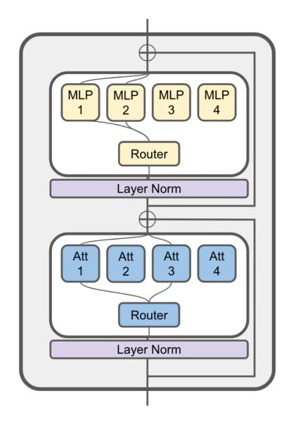
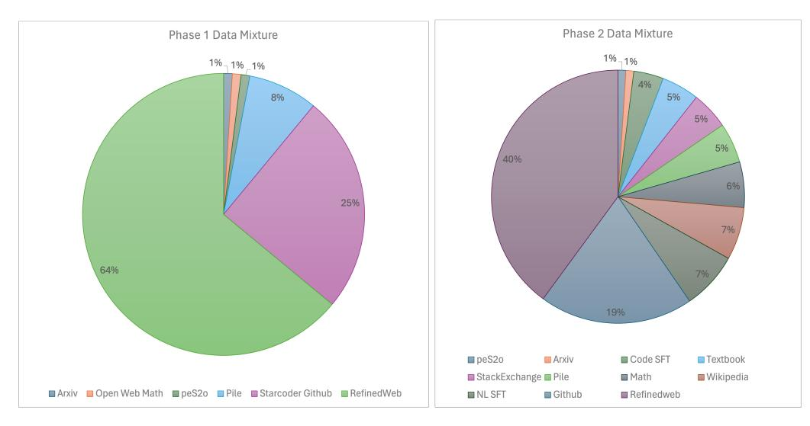
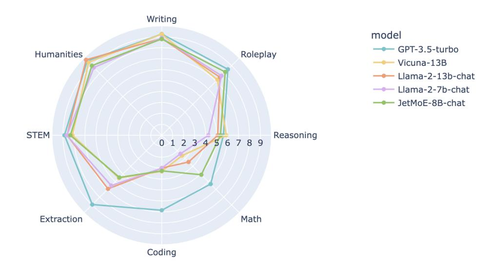

# **JetMoE: Reaching Llama2 Performance with 0.1M Dollars**

**Yikang Shen** ∗ MIT-IBM Watson AI Lab yikang.shn@gmail.com

**Tianle Cai** Princeton University tianle.cai@princeton.edu **Zhen Guo**∗ MIT EECS zguo0525@mit.edu

**Zengyi Qin** MyShell.ai & MIT qinzy@mit.edu

# **Abstract**

Large Language Models (LLMs) have achieved remarkable results, but their increasing resource demand has become a major obstacle to the development of powerful and accessible super-human intelligence. This report introduces JetMoE-8B, a new LLM trained with less than \$0.1 million, using 1.25T tokens from carefully mixed open-source corpora and 30,000 H100 GPU hours. Despite its low cost, the JetMoE-8B demonstrates impressive performance, with JetMoE-8B outperforming the Llama2-7B model and JetMoE-8B-Chat surpassing the Llama2-13B-Chat model. These results suggest that LLM training can be much more cost-effective than generally thought. JetMoE-8B is based on an efficient Sparsely-gated Mixtureof-Experts (SMoE) architecture, composed of attention and feedforward experts. Both layers are sparsely activated, allowing JetMoE-8B to have 8B parameters while only activating 2B for each input token, reducing inference computation by about 70% compared to Llama2-7B. Moreover, JetMoE-8B is highly open and academia-friendly, using only public datasets and training code. All training parameters and data mixtures have been detailed in this report to facilitate future efforts in the development of open foundation models. This transparency aims to encourage collaboration and further advancements in the field of accessible and efficient LLMs. The models are publicly available at <https://github.com/myshell-ai/JetMoE>.

## **1 Introduction**

Large Language Models (LLMs) have achieved remarkable results, but their increasing resource demand has become a major obstacle to developing powerful and accessible AI. Although modern LLMs have surpassed human performance on some tasks, they remain inefficient and inflexible. Most LLMs (e.g., Llama, [Touvron et al. 2023;](#page-15-0) Pythia, [Biderman](#page-10-0) [et al. 2023;](#page-10-0) GPT-3, [Brown et al. 2020;](#page-10-1) Mistral, [Jiang et al. 2023\)](#page-12-0) use all of their parameters during inference and training, which are referred to as dense models. Considering the substantial costs, the Mixture-of-Experts (MoE) architecture (Yuksel et al., 2012; [Shazeer](#page-14-0) [et al., 2017;](#page-14-0) [Du et al., 2022;](#page-11-0) [Pan et al., 2024\)](#page-14-1) has emerged as a popular solution, enabling parameter scaling while keeping computational costs modest. Recent applications of MoE architectures in Transformers [\(Vaswani et al., 2017\)](#page-15-1) have yielded successful attempts at scaling language models to a substantial size, accompanied by remarkable performance, such as Deepseek MoE [\(Dai et al., 2024\)](#page-11-1), Mixtral 8x7B [\(Jiang et al., 2024\)](#page-12-1), Grok-1 (xai-org, 2024), and DBRX [\(Databricks, 2024\)](#page-11-2). However, even though these models achieve excellent performance, they are not truly open-sourced as the training recipes are not published and may contain proprietary datasets inaccessible outside of large corporations. The open-source community has also attempted to train MoE models, such as OpenMoE (Xue et al., 2024), but its performance is only on par with weak dense models with similar activation parameters, such as OpenLLaMA [\(Geng & Liu, 2023\)](#page-12-2) and TinyLLaMA (Zhang et al., 2024a).

∗Equal contribution.

**Figure Description:**
The image is a diagram that appears to be related to network architecture or routing protocols. It features two main sections labeled "Router" at the top of each section, with arrows pointing between them indicating data flow or communication paths. Each router has three layers: Layer Norm (LN), Attention Mechanism (Attn), and Router. These layers are connected by lines representing connections within the system.

The first layer, Layer Norm, contains four blocks labeled MLP_1 through MLP_4. Each block consists of an acronym for Multi-Layer Perceptron followed by a number from 1 to 4, suggesting these could be different configurations or models used within the network.

Below the second router, there's another set of layers similar to the ones above it. This set also includes four blocks labeled MLP_5 through MLP_8, again following the same pattern as seen in the upper part of the diagram.

In addition to the layers, there are numerical labels such as 'MLP_1', 'MLP_2', etc., which likely correspond to specific parameters or settings associated with each block. However, without additional context, it's difficult to determine their exact meaning or function within the overall network structure depicted here.

Figure 1: JetMoE architecture

To facilitate future efforts on open foundation models, particularly MoE models, we introduce JetMoE-8B, an innovative MoE architecture inspired by ModuleFormer [\(Shen et al.,](#page-15-2) [2023\)](#page-15-2) that extends the concept of sparse activation to both the attention and feed-forward layers. Unlike prior works that only apply sparse activation to the feed-forward layer, JetMoE-8B leverages sparse activation in both components to further reduce computational costs while maintaining performance.

Impressively, JetMoE-8B is trained with a limited \$100k budget, using 1.25T tokens from mixed open-source datasets and 30,000 H100 GPU hours. Despite its low cost, JetMoE-8B outperforms the Llama2-7B model, and JetMoE-8B-Chat outperforms the Llama2-13B-Chat model, demonstrating that LLM training can be much more cost-effective than generally thought. In addition, JetMoE-8B has 8B parameters while only activating 2B for each input token, reducing inference computation by about 70% compared to Llama2-7B.

The key advantages of JetMoE-8B include:

- **Openness and academia-friendly**: JetMoE-8B is trained using only public datasets and open-source training code, making it accessible to many academia research settings. The model can also be finetuned with limited compute budgets (e.g., consumer-grade GPUs).
- **Sparse activation on both attention and feed-forward layers**, which significantly reduces training and inference costs. We also propose to share the kv projection in attention experts to improve training stability.
- **Comprehensive open-source data mixture**, which ensures high-quality training using only open-source datasets.

These innovations in JetMoE-8B pave the way for more accessible and efficient LLMs, benefiting the broader AI research community. To foster collaboration and further advancements, we have detailed all the training parameters and data mixture in this report.

## **2 Model Architecture**

## 2.1 Mixture of Experts

A Mixture of Experts (MoE) layer comprises *N* modules *f*1, . . . , *fN* and a router *g*(*e* | **x**). Given an input **x** to the MoE layer, the router predicts a probability distribution over the *N*

modules. Of these, we select the top k experts. When k < N, we are using a Sparse Mixture of Experts (SMoE, Shazeer et al. 2017). In this JetMoE, we use a linear layer to model the router

$$\mathbf{s} = \mathbf{W}_{rtr}\mathbf{x},\tag{1}$$

$$g(e \mid \mathbf{x}) = \begin{cases} \operatorname{softmax} (\operatorname{Topk}(\mathbf{s}))_i, & \mathbf{s}_i \in \operatorname{Topk}(\mathbf{s}) \\ 0, & \mathbf{s}_i \notin \operatorname{Topk}(\mathbf{s}) \end{cases}$$
(2)

where  $\mathbf{W}_{rtr}$  is the expert embedding matrix of shape  $(N, D_{emb})$ , Topk is the operator that select the top k logits from  $\mathbf{s}$ . The final output of the SMoE is then given by

$$y = \sum_{e=1}^{N} g(e \mid \mathbf{x}) \cdot f_e(\mathbf{x})$$
(3)

When  $g(e \mid \mathbf{x}) = 0$ ,  $f_e(\mathbf{x})$  will not need to be evaluated, thus reducing computation cost during training and inference.

Following the design in ModuleFormer (Shen et al., 2023), JetMoE replaces both self-attention and Feed-forward layers (FFD) with SMoE layer. This is different from most opensource MoE models (Dai et al., 2024; Xue et al., 2024), that only replace FFD layers.

### 2.2 FeedFoward Expert

Each FFD expert is a standard 2-layer MLP with hidden state size  $D_{\text{ffd}}$ :

$$f_{mlp}(\mathbf{x}) = \mathbf{W}_{out}\sigma(\mathbf{W}_{in}\mathbf{x}) \tag{4}$$

Where  $\mathbf{W}_{out}$  is the output projection matrix of shape  $(D_{emb}, D_{ffd})$ ,  $\mathbf{W}_{in}$  in the input projection matrix of shape  $(2D_{ffd}, D_{emb})$ ,  $\sigma$  is the SwiGLU activation function.

### 2.3 Attention Expert

Zhang et al. (2022) propose the Mixture of Attention heads (MoA), which extends SMOEs to attention mechanisms. We adapt MoA for our purposes, generalizing it to allow for multiple heads per expert and introducing RoPE relative positioning into the attention computation.

In JetMoE, each attention expert e is composed of four  $\mathbb{R}^{D_{emb} \times D_{att}}$  matrix:  $\mathbf{W}_q^e, \mathbf{W}_k, \mathbf{W}_v, \mathbf{W}_o^e$ , where  $D_{att} = H \times D_{head}$ , H is the number of attention head inside each attention experts,  $D_{head}$  is the dimension of each attention head. Among these matrices,  $\mathbf{W}_q^e$  and  $\mathbf{W}_o^e$  are owned by each expert, but  $\mathbf{W}_k$  and  $\mathbf{W}_v$  are shared across experts to improve the training and inference efficiency.

Given an input vector sequence  $\mathbf{x}$ , we first projected it to key vectors  $\mathbf{k}$  and value vectors  $\mathbf{v}$  using the shared key and value projection matrices:

$$\mathbf{k} = \mathbf{W}_k \mathbf{x} \tag{5}$$

$$\mathbf{v} = \mathbf{W}_v \mathbf{x} \tag{6}$$

Inside expert e, we project  $\mathbf{x}$  into the query vectors  $\mathbf{q}_e$ , apply standard multi-head attention with RoPE (Su et al., 2024), and project the attention output back to the input space:

$$\mathbf{q}_e = \mathbf{W}_q^e \mathbf{x} \tag{7}$$

$$\mathbf{a}_{e} = \mathrm{MHA}\left(\mathbf{q}_{e}, \mathbf{k}, \mathbf{v}\right) \tag{8}$$

$$\mathbf{o}_{e} = \mathbf{W}_{o}^{e} \mathbf{a} \tag{9}$$

By introducing the MoA, we can scale up the attention layer with more attention experts while maintaining the same amount of computation. Such that the attention layer will not become a performance bottleneck, while we scale up the MLP layers.

### 2.4 Load Balancing during Pretraining

To avoid the SMoE repeatedly using the same module and wasting the extra capacity in the other modules, it requires various load balancing losses to regulate the training of the router (Shazeer et al., 2017; Fedus et al., 2021). In the training of JetMoE, we use the frequency-based auxiliary loss introduced in Fedus et al. (2021)

$$loss_b = N \sum_{i=1}^{N} f_i P_i \tag{10}$$

where N is the number of experts,  $f_i$  is the fraction of tokens dispatched to expert i, and  $P_i$  is the fraction of the router probability allocated for expert i. To improve the training stability, we also use the router z-loss introduced in Zoph et al. (2022):

$$loss_z = \frac{1}{B} \sum_{i=1}^{B} \left( \log \sum_{j=1}^{N} \exp(x_j^i) \right)^2$$
 (11)

where *B* is the number of tokens, *x* is the logits given by router. The final training loss will be the weighted sum of three losses:

$$loss = loss_{lm} + \alpha loss_b + \beta loss_z \tag{12}$$

where  $\alpha$  is the weight for load balancing loss and  $\beta$  is the weight for z-loss.

## 3 Pretraining Datasets

#### 3.1 Real-world Datasets

**RefinedWeb** is a high-quality web dataset, which contains 5 trillion tokens extracted from CommonCrawl 1 using the MacroData Refinement (MDR) pipeline to improve data quality (Penedo et al., 2023). We use the 600 billion token extract of RefinedWeb publicly available.

**StarCoder** training data is sourced from The Stack v1.2 with code from GitHub spanning 86 programming languages (Li et al., 2023b). The data is preprocessed through visual inspection, filtering, deduplication, and reweighting low-data languages. A new version of the dataset has been recently released (Lozhkov et al., 2024).

**Dolma** is a large, open, diverse English text corpus contains 3 trillion tokens sampled from 7 sources, including web pages from Common Crawl, code from The Stack, curated web data from C4 (Raffel et al., 2020), social media conversations from Reddit, academic papers from PeS2o, public domain books from Project Gutenberg, and encyclopedic content from Wikipedia and Wikibooks (Soldaini et al., 2024).

The Pile is an 825 GB open-source English text corpus for training large language models (Gao et al., 2020). It includes 22 diverse, publicly available datasets such as Wikipedia, NIH exPORTER, ArXiv, Books3, BookCorpus2, OpenSubtitles, YTSubtitles, and Enron Emails.

## 3.1.1 Miscellaneous

- **Proof-Pile-2** is a 55 billion token dataset of mathematical and scientific documents (Azerbayev et al., 2023). We use the algebraic-stack (11B tokens) subset including numerical computing, computer algebra, and formal mathematics.
- OpenWebMath is a large, high-quality, open dataset containing 14.7 billion tokens of English mathematical web text (Paster et al., 2023).

&lt;sup>1http://commoncrawl.org/

- **StackMathQA** is a meticulously curated collection of 2 million mathematical questions and answers, sourced from various Stack Exchange sites [\(Zhang, 2024\)](#page-0-0).
- **OpenAssistant** is a human-generated, human-annotated assistant-style conversation corpus in 35 different languages. The corpus is a product of a worldwide crowdsourcing effort involving over 13,500 volunteers [\(LAION-AI, 2023\)](#page-12-4).
- **xP3x** (Crosslingual Public Pool of Prompts eXtended) is a collection of prompts and datasets spanning 277 languages and 16 NLP tasks [\(Muennighoff et al., 2023b\)](#page-13-2).
- **CommitPackFT** is a 2GB filtered version of CommitPack to contain only high-quality commit messages on public Github repos that resemble natural language instructions [\(Muennighoff et al., 2023a\)](#page-13-3).

### 3.2 Synthetic Datasets

**OpenHermes 2.5** is a large-scale, diverse, high-quality compilation of open-source and custom synthetic datasets [\(Teknium, 2023\)](#page-15-5). It contains 1 million primarily synthetically generated instruction and chat samples, following a ShareGPT structure. The dataset is compiled from sources including Airoboros 2.2 [\(Durbin, 2023\)](#page-11-4), CamelAI domain expert datasets [\(Li et al., 2023a\)](#page-12-5), ChatBot Arena (GPT-4 Only) [\(Zheng et al., 2024a\)](#page-0-0), Collective Cognition (09-11-2023) [\(CollectiveCognition, 2023\)](#page-11-5), CoT Alpaca GPT4 [\(Si et al., 2023\)](#page-15-6), Evol Instruct 70K and 140K [\(Xu et al., 2023a\)](#page-0-0), Glaive Code Assistant [\(glaiveai, 2023\)](#page-12-6), GPT4- LLM [\(Peng et al., 2023\)](#page-14-5), GPTeacher [\(Teknium1, 2023\)](#page-15-7), Medical Tasks [\(CogStack, 2023\)](#page-11-6), MetaMath 40k [\(Yu et al., 2023\)](#page-0-0), SlimOrca 550K [\(Longpre et al., 2023;](#page-13-4) [Mukherjee et al., 2023;](#page-13-5) [Lian et al., 2023\)](#page-13-6), Platypus [\(Lee et al., 2024;](#page-12-7) [Lightman et al., 2023;](#page-13-7) [Wang et al., 2023b\)](#page-15-8), ShareGPT (GPT4-Only) [\(lm sys, 2023\)](#page-13-8), and Unnatural Instructions GPT4 [\(Peng et al., 2023\)](#page-14-5).

**UltraTextbooks** is a comprehensive collection of high-quality synthetic and humanwritten textbooks [\(Locutusque, 2024\)](#page-13-9). The composition of the dataset incorporating multiple sources such as nampdn-ai/mini-peS2o, open-phi/programming books llama, open-phi/textbooks, nampdn-ai/tiny-strange-textbooks, and a select high-quality web collection from math-ai/AutoMathText.

**UltraChat 200k** is a filtered subset of the UltraChat dataset, which consists of 1.4M dialogues generated by ChatGPT [\(Ding et al., 2023;](#page-11-7) [Tunstall et al., 2023b\)](#page-15-9). The subset was created by selecting a smaller portion of the data, truecasing the text to fix grammatical errors, and removing dialogues where the assistant inappropriately claims to lack emotions or opinions.

# 3.2.1 Miscellaneous

- **TemplateGSM** dataset is a novel and extensive collection containing over 7 million grade school math problems with code solutions and natural language solutions [\(Zhang et al., 2024b\)](#page-0-0).
- **Magicoder-Evol-110K** and **Magicoder-OSS-75K** datasets are generated using the OSS-INSTRUCT approach, which leverages a LLM to automatically create new coding problems by drawing inspiration from random code snippets collected from open source projects [\(Wei et al., 2023\)](#page-0-0).
- **Evol-Code Alpaca** is an open-sourced implementation of Evol-Instruct adapted for code instructions by streamlining, simplifying, and adding code-specific evolutionary instructions [\(Luo et al., 2023\)](#page-13-10).
- **Code-290k-ShareGPT** is a dataset in the ShareGPT format, consisting of approximately 290,000 sets of conversations [\(ajibawa 2023, 2024\)](#page-10-3). Code-290k-ShareGPT is built upon the existing datasets **Python-Code-23k-ShareGPT** and **Code-74k-ShareGPT**.

## 4 Model Pretraining

#### 4.1 Infrastructures

We use Megatron (Shoeybi et al., 2019) as the training framework and integrate Megablock (Gale et al., 2023) for MoE support. We further modified the training framework to support MoA (Section 2.3) and z-loss (Section 2.4). Against the common practice, we choose the Pipeline parallelism introduced in (Narayanan et al., 2021) instead of the expert parallelism for model parallel during training. This is mainly due to two reasons. First, Sparse MoE models usually have a narrower hidden state compared to standard transformer models. Thus, the communication cost for pipeline parallelism is smaller. Second, we use the dropless MoE schema introduced in Gale et al. (2023); Shen et al. (2023), which could cause load unbalance across experts. Thus, using expert parallel will cause an unbalanced load across devices and result in inefficient training. Pipeline parallelism could avoid this slowdown because it computes all the experts inside a layer on the same device. We conduct training on a cluster containing 12 nodes and 96 H100s. Inside each node, gpus are connected via NVLinks. Infiniband is used for fast communication between nodes.

## 4.2 Hyper-parameters

| $P_{total}$ | $P_{active}$ | n layers | $D_{model}$ | Nexperts | Top-k | n kv_heads | $D_{head}$ | $D_{mlp}$ |
|-------------|--------------|---------------------|-------------|----------|-------|-----------------------|------------|-----------|
| 8B          | 2B           | 24                  | 2048        | 8        | 2     | 16                    | 128        | 5632      |

Table 1: JetMoE-8B hyperparameters.

The hyperparameters of JetMoE-8B are selected based on the common practice for the 1B transformer language model. We replace all self-attention and MLP layers in the transformer with MoA and MoE. Then, we set the same number of experts to 8 and top-k to 2 for every layer. Such that the model has approximately two times the computation compared to a 1B model. Following ST-MoE (Zoph et al., 2022), the weight for load balancing loss and z-loss is set to 0.01 and 0.001, respectively. Table 1 shows the key hyperparameters in JetMoE-8B.

JetMoE-8B is trained with the AdamW optimizer (Loshchilov & Hutter, 2017) with a maximum learning rate of 5e-4 and a batch size of 4M tokens with sequence length of 4096. We employ the Warmup-Stable-Decay (WSD) learning rate schedule introduced in Hu et al. (2024). This learning rate scheduler is divided into three stages: the warmup stage (denoted by W, representing the number of steps at the end of the warmup stage), the stable training stage (denoted by S), and the annealing stage (denoted by D):

$$lr(s) = \begin{cases} \frac{s}{W} * \eta, & s < W \\ \eta, & W < s < S \\ f(s-S) * \eta, & S < s < S + D \end{cases}$$
 (13)

where  $0 < f(s - S) \le 1$  is a decreasing function of s, and  $\eta$  is the maximum learning rate. In our settings, the warmup stage lasts for 10 billion tokens, and the decay stage spans 250 billion tokens. The initial and final learning rates are set to 10% of the maximum learning rate. A weight decay of 0.1 and gradient clipping of 1.0 are applied during training.

### 4.3 Training Data Mixture

JetMoE-8B is trained on 1.25T tokens of primarily English data from web documents, mathematics, and code. Similar to the approach advocated in miniCPM (Hu et al., 2024) and Gemma (Team et al., 2024), we increase the weight of high-quality data during the learning rate decay phase. The training process is divided into two phases:

• Phase 1 (warmup and stable learning rate): The dataset includes RefinedWeb, Starcoder, The Pile, peS2o from Dolma, and OpenWebMath.

• **Phase 2** (decay learning rate): We include additional high-quality data to further improve the model's performance.

The detailed data mixture can be found in Figure [2](#page-6-0) and Table [2.](#page-6-1) It is important to note that given the limited computing budget available, our data mixture might not be ideal. However, it serves as a good starting point for training JetMoE-8B and can be further optimized in future iterations.

**Figure Description:**
The image displays two pie charts side by side against a white background with black text. Each chart represents different phases of data processing or handling: Phase 1 Data Mixed and Phase 2 Data Mixing. Both charts are divided into segments representing various types of data operations or platforms.

On the left, under "Phase 1 Data Mixed," there is a segment labeled "Open Web Math" with a value of 64%. This suggests that during Phase 1, approximately 64% of the mixed data was processed using open web math-related tools or methods. Other segments include "Aniv" (5%) for Anonymous Internet User), "pe2so" (3%) for Pseudo-Electronic Two-Sided Store Operator, "pile" (2%) for Pile, "starcode_github" (1%) for StarCode GitHub, "RefinedWeb" (1%) for RefinedWeb, and several others each with less than 1% representation.

The right chart, titled "Phase 2 Data Mixing," shows a more diverse distribution of data operations. It includes segments such as "Axiv" (7%) for Axiv, "Code SF" (5%) for Code San Francisco, "Textbook" (5%) for Textbooks, "Math" (5%) for Mathematics, "Wikipedia" (4%) for Wikipedia, "GitHub" (3%) for GitHub, "StackExchange" (3%) for Stack Exchange, "RefinedWeb" (2%) for RefinedWeb, and many other smaller segments indicating various other sources or processes involved in Phase 2 data mixing.

Both charts provide a visual breakdown of how different types of data were handled at specific stages of data processing. The exact meaning of these terms would require additional context beyond what can be discerned from the image alone.

Figure 2: Pretraining data mixture

| Category              | Dataset                                                                               | Percentage |  |
|-----------------------|---------------------------------------------------------------------------------------|------------|--|
|                       | Refinedweb                                                                            | 39.8%      |  |
|                       | Pile Wikipedia                                                                        | 6.7%       |  |
|                       | Pile StackExchange                                                                    | 4.8%       |  |
| NL pretraining data   | Pile arXiv                                                                            | 1.0%       |  |
|                       | Pile remaining                                                                        | 5.1%       |  |
|                       | Dolma peS2o                                                                           | 1.0%       |  |
| NL SFT data           | xP3x, OpenAssistant, OpenHermes UltraChat, Oasst-octopack                          | 7.3%       |  |
| Textbook              | UltraTextbooks                                                                        | 4.8%       |  |
| Code pretraining data | Starcoder Github                                                                      | 19.6%      |  |
| Code SFT data         | Magicoder-OSS, Magicoder-Evol Code-290k-ShareGPT, CommitPackFT Evol-Code Alpaca | 3.8%       |  |
| Math data             | Open-web-math, algebraic-stack TemplateGSM, StackMathQA                            | 5.8%       |  |

Table 2: Detailed data mixture for Phase 2

## **5 Model Alignment**

## 5.1 Distilled Supervised Fine-Tuning (dSFT)

The dSFT process involves training a student language model for replying to user prompts, with data generated by a teacher model (such as GPT-4 or Claude) [\(Wang et al., 2022;](#page-0-0) [Taori](#page-15-12) [et al., 2023;](#page-15-12) [Chiang et al., 2023;](#page-11-8) [Tunstall et al., 2023b\)](#page-15-9). The key steps are as follows:

- 1. **Data Distillation**: For a set of seed prompts  $\{x_j^0\}_{j=1}^J$ , generate responses  $y_j^0$  using the teacher model  $\pi_T$ , and refine instructions to obtain  $\mathcal{C} = \{(x_j, y_j)\}_{j=1}^J$ .
- 2. **Instruction Tuning**: The student model  $\pi_{dSFT}$  is trained by maximizing the likelihood of the responses given the instructions:

$$\pi_{\text{dSFT}} = \arg\max_{\pi} \sum_{(x,y)\in\mathcal{C}} \log \pi(y|x). \tag{14}$$

Note that the expectation for the likelihood function is approximated by using the arithmetic mean over a batch of training samples.

### 5.2 Distilled Direct Preference Optimization (dDPO)

dDPO refines the dSFT model by incorporating preferences from an aligned teacher model into the training process. It optimizes a reward function that reflects these preferences, aiming to align the student model's outputs with the desired outcomes based on the static preference dataset.

1. **KL-Constrained Optimization**: The foundation of dDPO lies in the KL-constrained optimization, which derives the optimal policy  $\pi_r^*$  that maximizes expected rewards while minimizing divergence from a baseline policy  $\pi_0$  (Wang et al., 2023a):

$$\pi_r^*(y|x) := \arg\max_{\pi} \mathbb{E}_{x \sim d_0} \left[ \mathbb{E}_{y \sim \pi(\cdot|x)}[r(x,y)] - \eta \text{KL}(\pi(\cdot|x) \| \pi_0(\cdot|x)) \right]$$
(15)

where  $\eta$  is a regularization parameter that balances maximizing the reward function r(x, y) and adhering to the baseline policy  $\pi_0$ .

2. **Preference-Driven Reward Function**: dDPO incorporates a reward function that reflects preferences from an aligned teacher model:

$$r^*(x,y) = \eta \log \left( \frac{\pi^*(y|x)}{\pi_{\text{dSFT}}(y|x)} \right) + \eta \log Z(x), \tag{16}$$

quantifying the preference for producing response y given input x relative to the dSFT model's baseline probability.  $\eta$  scales the reward's influence, and Z(x) ensures normalization.

3. **Optimization Objective**: The objective for aligning  $\pi_{\theta}$  with the teacher model's preferences is:

$$\pi_{\theta} = \arg\max_{\pi} \sum_{(x, y_w, y_l) \in D} \log \sigma \left( \eta \log \frac{\pi(y_w | x)}{\pi_{\text{dSFT}}(y_w | x)} - \eta \log \frac{\pi(y_l | x)}{\pi_{\text{dSFT}}(y_l | x)} \right), \quad (17)$$

where D comprises instruction-response pairs, with  $y_w$  and  $y_l$  indicating preferred and less preferred responses respectively, scored by the teacher model.

Offline DPO (Rafailov et al., 2023) directly optimizes language model policies using static preference data, providing stable learning and simpler tuning compared to Reinforcement learning from Human Feedback (RLHF) (Ouyang et al., 2022; Christiano et al., 2023). However, it faces challenges with distribution shifts between the dataset and the evolving policy. Online and iterative DPO variants address this issue at the cost of increased computational complexity (Xu et al., 2023b; Guo et al., 2024b; Xiong et al., 2024).

### 5.3 Alignment details

Our alginment framework is based on Alignment Handbook (Tunstall et al., 2023a) using Pytorch 2 (He & Yu, 2023; Ansel et al., 2024) with DeepSpeed ZeRO-3 (Rajbhandari et al., 2020). We finetune the JetMoE-8B base model using dSFT on a combination of the following datasets: UltraChat 200k (Ding et al., 2023; Tunstall et al., 2023b), Airoboros-3.2 (Durbin,

[2023\)](#page-11-4), Code-Feedback [\(Zheng et al., 2024b\)](#page-0-0), Orca-math-word-problems-200k [\(Mitra et al.,](#page-13-12) [2024\)](#page-13-12), SystemChat [\(abacusai, 2024\)](#page-10-5), and Capybara [\(Daniele & Suphavadeeprasit, 2023\)](#page-11-10). Chat template is the same as Zephyr-7b-beta. The key hyperparameters for dSFT are a learning rate of 2e-5 with an Adam optimizer, a batch size of 128, and 3 epochs.

We further finetune the JetMoE-8B-SFT model using dDPO on the UltraFeedback dataset [\(Cui et al., 2023\)](#page-11-11), which contains binary preference labels indicating the preferred response between two options. The key hyperparameters for dDPO are a learning rate of 5e-7 with AdamW, a batch size of 128, and 1 epoch. This fine-tuning process results in the JetMoE-8B-Chat model. The entire alignment process takes 60 H100 GPU hours.

## **6 Evaluation**

|                          | LLaMA2 | DeepseekMoE | Gemma | JetMoE |
|--------------------------|--------|-------------|-------|--------|
| # Total Params           | 7B     | 16B         | 2B    | 8B     |
| # Activate Params        | 7B     | 2.8B        | 2B    | 2.2B   |
| # Training tokens        | 2T     | 2T          | 2T    | 1.25T  |
| ARC-challenge            | 53.1   | 53.2        | 48.4  | 48.7   |
| Hellaswag                | 78.6   | 79.8        | 71.8  | 80.5   |
| MMLU                     | 46.9   | 46.3        | 41.8  | 49.2   |
| TruthfulQA               | 38.8   | 36.1        | 33.1  | 41.7   |
| WinoGrande               | 74.0   | 73.7        | 66.3  | 70.2   |
| GSM8k                    | 14.5   | 17.3        | 16.9  | 27.8   |
| OpenLLM Leaderboard Avg. | 51.0   | 51.1        | 46.4  | 53.0   |
| MBPP (Pass@1)            | 20.8   | 34.0        | 28.0  | 34.2   |
| HumanEval (Pass@1)       | 12.8   | 25.0        | 24.4  | 14.6   |
| All Avg.                 | 45.5   | 47.3        | 43.2  | 47.6   |

Table 3: OpenLLM leaderboard and code benchmarks results from four different models.

We measure JetMoE-8B's performance on tasks included in OpenLLM leaderboard[2](#page-8-0) and from other domains, including physical reasoning [\(Bisk et al., 2020\)](#page-10-6), social reasoning [\(Sap](#page-14-10) [et al., 2019\)](#page-14-10), question answering [\(Clark et al., 2019;](#page-11-12) [Kwiatkowski et al., 2019\)](#page-12-12), mathematics [\(Cobbe et al., 2021\)](#page-11-13), commonsense reasoning [\(Sakaguchi et al., 2021\)](#page-14-11), language modeling [\(Paperno et al., 2016\)](#page-14-12), reading comprehension [\(Joshi et al., 2017\)](#page-12-13), and more. For most benchmarks, we use the same evaluation methodology as in the OpenLLM leaderboard to be comparable to other models.. We compare JetMoE-8B models to several external open-source (OSS) LLMs, including Gemma, LLaMA2, DeepseekMoE.

In addition, we include HumanEval [\(Chen et al., 2021\)](#page-10-7) and MBPP [\(Austin et al., 2021\)](#page-10-8) to evaluate the code generation of the models. Utilizing the BigCode Evaluation Harness [\(Ben Allal et al., 2022\)](#page-10-9), we follow recent work on Code LLMs [\(Roziere et al., 2024;](#page-14-13) [Guo](#page-12-14) ` [et al., 2024a\)](#page-12-14) with greedy decoding, and report the mean pass@1 (mean success rate) for the two benchmarks.

Table [3](#page-8-1) shows the OpenLLM leaderboard and code benchmarks results from four different models. JetMoE-8B outperforms Gemma, LLaMA2, and DeepseekMoE on the OpenLLM leaderboard, achieving the best scores in all tasks except ARC-challenge and WinoGrande. Additionally, JetMoE-8B obtains the highest MBPP scores in Python programming.

We also evaluated our model on MT-Bench [\(Zheng et al., 2023\)](#page-0-0) with a strong LLM judge (gpt-4-0613 checkpoint). The temperature configuration, following the official FastChat implementation, is defined as follows: "Writing" and "Roleplay" tasks have a temperature of 0.7, indicating higher creativity; "Extraction", "Math", "Coding", and "Reasoning" tasks

2[https://huggingface.co/spaces/HuggingFaceH4/open\\_llm\\_leaderboard](https://huggingface.co/spaces/HuggingFaceH4/open_llm_leaderboard)

| Model            | MT-Bench Score |
|------------------|----------------|
| GPT-4            | 9.014          |
| GPT-3.5-turbo    | 7.995          |
| Claude-v1        | 7.923          |
| JetMoE-8B-chat   | 6.681          |
| Llama-2-13b-chat | 6.650          |
| Vicuna-13b-v1.3  | 6.413          |
| Wizardlm-13b     | 6.353          |
| Llama-2-7b-chat  | 6.269          |

Table 4: MT-Bench score comparison of various models

**Figure Description:**
The image is a graphical representation of a model used for text generation or similar tasks. It appears to be a scatter plot with various axes labeled as different components of the model: "Humans," "Writing," "Roleplay," "STEM," "Extract," "Math," "Coding." Each axis has numerical values ranging from 0 to 9, which likely correspond to some form of scoring or evaluation metric for each component.

The central part of the diagram shows a cluster of points connected by lines that suggest a relationship between these components. This could indicate how well certain combinations of human-like writing, roleplaying abilities, STEM knowledge, extraction skills, mathematical understanding, and coding proficiency are related within the context of the model.

At the top right corner of the image, there's a legend indicating different colors corresponding to various models or configurations: GPT-3.5 (turbo), Vicuna-13B, Llama-2-18b-chat, JetMoE-8B-chat. These labels might refer to specific versions or iterations of language models like OpenAI's GPT-3.5, suggesting that the model being evaluated may involve multiple layers or components, possibly including turbocharged processing units (as indicated by "GPT-3.5 (turbo)" label).

Overall, the image seems to be a visualization tool designed to help users understand the performance or relationships among different aspects of a complex system, such as an AI model capable of generating human-like text.

Figure 3: MT-Bench radar figure

have a temperature of 0.0, suggesting preciseness; and "STEM" and "Humanities" have a temperature of 0.1, implying slightly more variability than 0.0 tasks.

JetMoE-8B-Chat achieves a higher MT-Bench score than Llama-2-13b-Chat after alignment, demonstrating its superior performance. However, as shown in Figure 3, JetMoE-8B-chat is relatively weak in coding and extraction compared to GPT-3.5-turbo. This might be due to the smaller model size leading to suboptimal reasoning capability in these tasks. Despite this limitation, JetMoE-8B-chat exhibits strong performance across various other dimensions, making it a competitive model in the open-source LLM landscape.

# **7 Limitation and Future Works**

Due to the limited \$100k budget, we can not afford any ablation study for the model architecture. The hyperparameters and data mixtures are also handpicked based on the empirical results from previous works [\(Shen et al., 2023;](#page-15-2) [Zoph et al., 2022;](#page-0-0) [Hu et al., 2024\)](#page-12-9). In the future, it would be interesting to further study the actual contribution of different components to the final results.

# **8 Conclusion**

We introduce JetMoE-8B, an open-source MoE model that achieves state-of-the-art performance among open-source models while maintaining high efficiency. By leveraging sparse

activation in both the attention and feed-forward layers, JetMoE-8B reduces computational costs while maintaining strong performance across a wide range of tasks.

Trained using a two-phase approach and a carefully curated mixture of open-source datasets, JetMoE-8B outperforms larger and more resource-intensive models on the OpenLLM Leaderboard. In addition, JetMoE-8B-Chat demonstrates competitive performance compared to other open-source chatbots.

We provide detailed training parameters and data mixture information to encourage reproducibility and enable researchers to build upon our work. JetMoE-8B represents a significant step forward in the development of open-source, efficient, and high-performing language models, contributing to the democratization of advanced language technologies.

# **Acknowledgments**

We express our gratitude to Shengding Hu for his valuable advice on the Phase 2 data mixture. We also express our gratitude to Exabits for their assistance in setting up the GPU clusters, and to Lepton AI for their support in setting up the chat demo.

## **References**

- abacusai. Systemchat, 2024. URL [https://huggingface.co/datasets/abacusai/](https://huggingface.co/datasets/abacusai/SystemChat) [SystemChat](https://huggingface.co/datasets/abacusai/SystemChat).
- ajibawa 2023. Code-290k-sharegpt, 2024. URL [https://huggingface.co/datasets/](https://huggingface.co/datasets/ajibawa-2023/Code-290k-ShareGPT) [ajibawa-2023/Code-290k-ShareGPT](https://huggingface.co/datasets/ajibawa-2023/Code-290k-ShareGPT).
- Jason Ansel, Edward Yang, Horace He, Natalia Gimelshein, Animesh Jain, Michael Voznesensky, Bin Bao, Peter Bell, David Berard, Evgeni Burovski, et al. Pytorch 2: Faster machine learning through dynamic python bytecode transformation and graph compilation, 2024.
- Jacob Austin, Augustus Odena, Maxwell Nye, Maarten Bosma, Henryk Michalewski, David Dohan, Ellen Jiang, Carrie Cai, Michael Terry, Quoc Le, et al. Program synthesis with large language models. *arXiv preprint arXiv:2108.07732*, 2021.
- Zhangir Azerbayev, Hailey Schoelkopf, Keiran Paster, Marco Dos Santos, Stephen McAleer, Albert Q. Jiang, Jia Deng, Stella Biderman, and Sean Welleck. Llemma: An open language model for mathematics, 2023.
- Loubna Ben Allal, Niklas Muennighoff, Logesh Kumar Umapathi, Ben Lipkin, and Leandro von Werra. A framework for the evaluation of code generation models. [https://github.](https://github.com/bigcode-project/bigcode-evaluation-harness) [com/bigcode-project/bigcode-evaluation-harness](https://github.com/bigcode-project/bigcode-evaluation-harness), 2022.
- Stella Biderman, Hailey Schoelkopf, Quentin Anthony, Herbie Bradley, Kyle O'Brien, Eric Hallahan, Mohammad Aflah Khan, Shivanshu Purohit, USVSN Sai Prashanth, Edward Raff, et al. Pythia: A suite for analyzing large language models across training and scaling. *arXiv preprint arXiv:2304.01373*, 2023.
- Yonatan Bisk, Rowan Zellers, Jianfeng Gao, Yejin Choi, et al. Piqa: Reasoning about physical commonsense in natural language. In *Proceedings of the AAAI conference on artificial intelligence*, volume 34, pp. 7432–7439, 2020.
- Tom Brown, Benjamin Mann, Nick Ryder, Melanie Subbiah, Jared D Kaplan, Prafulla Dhariwal, Arvind Neelakantan, Pranav Shyam, Girish Sastry, Amanda Askell, et al. Language models are few-shot learners. *Advances in neural information processing systems*, 33:1877–1901, 2020.
- Mark Chen, Jerry Tworek, Heewoo Jun, Qiming Yuan, Henrique Ponde de Oliveira Pinto, Jared Kaplan, Harri Edwards, Yuri Burda, Nicholas Joseph, Greg Brockman, Alex Ray, Raul Puri, Gretchen Krueger, Michael Petrov, Heidy Khlaaf, Girish Sastry, Pamela Mishkin,

- Brooke Chan, Scott Gray, Nick Ryder, Mikhail Pavlov, Alethea Power, Lukasz Kaiser, Mohammad Bavarian, Clemens Winter, Philippe Tillet, Felipe Petroski Such, Dave Cummings, Matthias Plappert, Fotios Chantzis, Elizabeth Barnes, Ariel Herbert-Voss, William Hebgen Guss, Alex Nichol, Alex Paino, Nikolas Tezak, Jie Tang, Igor Babuschkin, Suchir Balaji, Shantanu Jain, William Saunders, Christopher Hesse, Andrew N. Carr, Jan Leike, Josh Achiam, Vedant Misra, Evan Morikawa, Alec Radford, Matthew Knight, Miles Brundage, Mira Murati, Katie Mayer, Peter Welinder, Bob McGrew, Dario Amodei, Sam McCandlish, Ilya Sutskever, and Wojciech Zaremba. Evaluating large language models trained on code, 2021.
- Wei-Lin Chiang, Zhuohan Li, Zi Lin, Ying Sheng, Zhanghao Wu, Hao Zhang, Lianmin Zheng, Siyuan Zhuang, Yonghao Zhuang, Joseph E. Gonzalez, Ion Stoica, and Eric P. Xing. Vicuna: An open-source chatbot impressing gpt-4 with 90%\* chatgpt quality, March 2023. URL <https://lmsys.org/blog/2023-03-30-vicuna/>.
- Paul Christiano, Jan Leike, Tom B. Brown, Miljan Martic, Shane Legg, and Dario Amodei. Deep reinforcement learning from human preferences, 2023.
- Christopher Clark, Kenton Lee, Ming-Wei Chang, Tom Kwiatkowski, Michael Collins, and Kristina Toutanova. Boolq: Exploring the surprising difficulty of natural yes/no questions. *arXiv preprint arXiv:1905.10044*, 2019.
- Karl Cobbe, Vineet Kosaraju, Mohammad Bavarian, Mark Chen, Heewoo Jun, Lukasz Kaiser, Matthias Plappert, Jerry Tworek, Jacob Hilton, Reiichiro Nakano, et al. Training verifiers to solve math word problems. *arXiv preprint arXiv:2110.14168*, 2021.
- CogStack. OpenGPT: A framework for creating grounded instruction based datasets and training conversational domain expert Large Language Models (LLMs). [https://github.](https://github.com/CogStack/OpenGPT) [com/CogStack/OpenGPT](https://github.com/CogStack/OpenGPT), 2023.
- CollectiveCognition. Collective cognition chatgpt conversations, 2023. URL [https://](https://huggingface.co/datasets/CollectiveCognition/chats-data-2023-09-22) [huggingface.co/datasets/CollectiveCognition/chats-data-2023-09-22](https://huggingface.co/datasets/CollectiveCognition/chats-data-2023-09-22).
- Ganqu Cui, Lifan Yuan, Ning Ding, Guanming Yao, Wei Zhu, Yuan Ni, Guotong Xie, Zhiyuan Liu, and Maosong Sun. Ultrafeedback: Boosting language models with highquality feedback, 2023.
- Damai Dai, Chengqi Deng, Chenggang Zhao, RX Xu, Huazuo Gao, Deli Chen, Jiashi Li, Wangding Zeng, Xingkai Yu, Y Wu, et al. Deepseekmoe: Towards ultimate expert specialization in mixture-of-experts language models. *arXiv preprint arXiv:2401.06066*, 2024.
- Luigi Daniele and Suphavadeeprasit. Amplify-instruct: Synthetically generated diverse multi-turn conversations for effecient llm training. *arXiv preprint arXiv:(coming soon)*, 2023. URL <https://huggingface.co/datasets/LDJnr/Capybara>.
- Databricks. Dbrx: Resources and code examples. <https://github.com/databricks/dbrx>, 2024.
- Ning Ding, Yulin Chen, Bokai Xu, Yujia Qin, Zhi Zheng, Shengding Hu, Zhiyuan Liu, Maosong Sun, and Bowen Zhou. Enhancing chat language models by scaling high-quality instructional conversations, 2023.
- Nan Du, Yanping Huang, Andrew M Dai, Simon Tong, Dmitry Lepikhin, Yuanzhong Xu, Maxim Krikun, Yanqi Zhou, Adams Wei Yu, Orhan Firat, et al. Glam: Efficient scaling of language models with mixture-of-experts. In *International Conference on Machine Learning*, pp. 5547–5569. PMLR, 2022.
- Jon Durbin. airoboros: Customizable implementation of the self-instruct paper. [https:](https://github.com/jondurbin/airoboros) [//github.com/jondurbin/airoboros](https://github.com/jondurbin/airoboros), 2023.
- William Fedus, Barret Zoph, and Noam Shazeer. Switch transformers: Scaling to trillion parameter models with simple and efficient sparsity, 2021.

- Trevor Gale, Deepak Narayanan, Cliff Young, and Matei Zaharia. Megablocks: Efficient sparse training with mixture-of-experts. *Proceedings of Machine Learning and Systems*, 5, 2023.
- Leo Gao, Stella Biderman, Sid Black, Laurence Golding, Travis Hoppe, Charles Foster, Jason Phang, Horace He, Anish Thite, Noa Nabeshima, et al. The pile: An 800gb dataset of diverse text for language modeling. *arXiv preprint arXiv:2101.00027*, 2020.
- Xinyang Geng and Hao Liu. Openllama: An open reproduction of llama, May 2023. URL [https://github.com/openlm-research/open\\_llama](https://github.com/openlm-research/open_llama).
- glaiveai. Glaive-code-assistant, 2023. URL [https://huggingface.co/datasets/glaiveai/](https://huggingface.co/datasets/glaiveai/glaive-code-assistant) [glaive-code-assistant](https://huggingface.co/datasets/glaiveai/glaive-code-assistant).
- Daya Guo, Qihao Zhu, Dejian Yang, Zhenda Xie, Kai Dong, Wentao Zhang, Guanting Chen, Xiao Bi, Y. Wu, Y. K. Li, Fuli Luo, Yingfei Xiong, and Wenfeng Liang. Deepseek-coder: When the large language model meets programming – the rise of code intelligence, 2024a.
- Shangmin Guo, Biao Zhang, Tianlin Liu, Tianqi Liu, Misha Khalman, Felipe Llinares, Alexandre Rame, Thomas Mesnard, Yao Zhao, Bilal Piot, Johan Ferret, and Mathieu Blondel. Direct language model alignment from online ai feedback, 2024b.
- Horace He and Shangdi Yu. Transcending runtime-memory tradeoffs in checkpointing by being fusion aware. *Proceedings of Machine Learning and Systems*, 5, 2023.
- Shengding Hu, Yuge Tu, Xu Han, Chaoqun He, Ganqu Cui, Xiang Long, Zhi Zheng, Yewei Fang, Yuxiang Huang, Weilin Zhao, Xinrong Zhang, Zheng Leng Thai, Kaihuo Zhang, Chongyi Wang, Yuan Yao, Chenyang Zhao, Jie Zhou, Jie Cai, Zhongwu Zhai, Ning Ding, Chao Jia, Guoyang Zeng, Dahai Li, Zhiyuan Liu, and Maosong Sun. Minicpm: Unveiling the potential of small language models with scalable training strategies, 2024.
- Albert Q Jiang, Alexandre Sablayrolles, Arthur Mensch, Chris Bamford, Devendra Singh Chaplot, Diego de las Casas, Florian Bressand, Gianna Lengyel, Guillaume Lample, Lucile Saulnier, et al. Mistral 7b. *arXiv preprint arXiv:2310.06825*, 2023.
- Albert Q. Jiang, Alexandre Sablayrolles, Antoine Roux, Arthur Mensch, Blanche Savary, Chris Bamford, Devendra Singh Chaplot, Diego de las Casas, Emma Bou Hanna, Florian Bressand, Gianna Lengyel, Guillaume Bour, Guillaume Lample, Lelio Renard Lavaud, ´ Lucile Saulnier, Marie-Anne Lachaux, Pierre Stock, Sandeep Subramanian, Sophia Yang, Szymon Antoniak, Teven Le Scao, Theophile Gervet, Thibaut Lavril, Thomas Wang, ´ Timothee Lacroix, and William El Sayed. Mixtral of experts, 2024. ´
- Mandar Joshi, Eunsol Choi, Daniel S Weld, and Luke Zettlemoyer. Triviaqa: A large scale distantly supervised challenge dataset for reading comprehension. *arXiv preprint arXiv:1705.03551*, 2017.
- Tom Kwiatkowski, Jennimaria Palomaki, Olivia Redfield, Michael Collins, Ankur Parikh, Chris Alberti, Danielle Epstein, Illia Polosukhin, Jacob Devlin, Kenton Lee, et al. Natural questions: a benchmark for question answering research. *Transactions of the Association for Computational Linguistics*, 7:453–466, 2019.
- LAION-AI. Open-Assistant: A chat-based assistant that understands tasks, can interact with third-party systems, and retrieve information dynamically. [https://github.com/](https://github.com/LAION-AI/Open-Assistant) [LAION-AI/Open-Assistant](https://github.com/LAION-AI/Open-Assistant), 2023.
- Ariel N. Lee, Cole J. Hunter, and Nataniel Ruiz. Platypus: Quick, cheap, and powerful refinement of llms, 2024.
- Guohao Li, Hasan Abed Al Kader Hammoud, Hani Itani, Dmitrii Khizbullin, and Bernard Ghanem. Camel: Communicative agents for "mind" exploration of large language model society. In *Thirty-seventh Conference on Neural Information Processing Systems*, 2023a.

- Raymond Li, Loubna Ben Allal, Yangtian Zi, Niklas Muennighoff, Denis Kocetkov, Chenghao Mou, Marc Marone, Christopher Akiki, Jia Li, Jenny Chim, Qian Liu, Evgenii Zheltonozhskii, Terry Yue Zhuo, Thomas Wang, Olivier Dehaene, Mishig Davaadorj, Joel Lamy-Poirier, Joao Monteiro, Oleh Shliazhko, Nicolas Gontier, Nicholas Meade, ˜ Armel Zebaze, Ming-Ho Yee, Logesh Kumar Umapathi, Jian Zhu, Benjamin Lipkin, Muhtasham Oblokulov, Zhiruo Wang, Rudra Murthy, Jason Stillerman, Siva Sankalp Patel, Dmitry Abulkhanov, Marco Zocca, Manan Dey, Zhihan Zhang, Nour Fahmy, Urvashi Bhattacharyya, Wenhao Yu, Swayam Singh, Sasha Luccioni, Paulo Villegas, Maxim Kunakov, Fedor Zhdanov, Manuel Romero, Tony Lee, Nadav Timor, Jennifer Ding, Claire Schlesinger, Hailey Schoelkopf, Jan Ebert, Tri Dao, Mayank Mishra, Alex Gu, Jennifer Robinson, Carolyn Jane Anderson, Brendan Dolan-Gavitt, Danish Contractor, Siva Reddy, Daniel Fried, Dzmitry Bahdanau, Yacine Jernite, Carlos Munoz Ferrandis, Sean Hughes, ˜ Thomas Wolf, Arjun Guha, Leandro von Werra, and Harm de Vries. Starcoder: may the source be with you!, 2023b.
- Wing Lian, Guan Wang, Bleys Goodson, Eugene Pentland, Austin Cook, Chanvichet Vong, and "Teknium". Slimorca: An open dataset of gpt-4 augmented flan reasoning traces, with verification, 2023. URL <https://https://huggingface.co/Open-Orca/SlimOrca>.
- Hunter Lightman, Vineet Kosaraju, Yura Burda, Harri Edwards, Bowen Baker, Teddy Lee, Jan Leike, John Schulman, Ilya Sutskever, and Karl Cobbe. Let's verify step by step. *preprint arXiv:2305.20050*, 2023.
- lm sys. FastChat: An open platform for training, serving, and evaluating large language model based chatbots. <https://github.com/lm-sys/FastChat>, 2023.
- Locutusque. Ultratextbooks, 2024. URL [https://huggingface.co/datasets/Locutusque/](https://huggingface.co/datasets/Locutusque/UltraTextbooks) [UltraTextbooks](https://huggingface.co/datasets/Locutusque/UltraTextbooks).
- Shayne Longpre, Le Hou, Tu Vu, Albert Webson, Hyung Won Chung, Yi Tay, Denny Zhou, Quoc V. Le, Barret Zoph, Jason Wei, and Adam Roberts. The flan collection: Designing data and methods for effective instruction tuning, 2023.
- Ilya Loshchilov and Frank Hutter. Decoupled weight decay regularization. *arXiv preprint arXiv:1711.05101*, 2017.
- Anton Lozhkov, Raymond Li, Loubna Ben Allal, Federico Cassano, Joel Lamy-Poirier, Nouamane Tazi, Ao Tang, Dmytro Pykhtar, Jiawei Liu, Yuxiang Wei, et al. Starcoder 2 and the stack v2: The next generation. *arXiv preprint arXiv:2402.19173*, 2024.
- Ziyang Luo, Can Xu, Pu Zhao, Qingfeng Sun, Xiubo Geng, Wenxiang Hu, Chongyang Tao, Jing Ma, Qingwei Lin, and Daxin Jiang. Wizardcoder: Empowering code large language models with evol-instruct, 2023.
- Arindam Mitra, Hamed Khanpour, Corby Rosset, and Ahmed Awadallah. Orca-math: Unlocking the potential of slms in grade school math, 2024.
- Niklas Muennighoff, Qian Liu, Armel Zebaze, Qinkai Zheng, Binyuan Hui, Terry Yue Zhuo, Swayam Singh, Xiangru Tang, Leandro von Werra, and Shayne Longpre. Octopack: Instruction tuning code large language models. *arXiv preprint arXiv:2308.07124*, 2023a.
- Niklas Muennighoff, Thomas Wang, Lintang Sutawika, Adam Roberts, Stella Biderman, Teven Le Scao, M Saiful Bari, Sheng Shen, Zheng-Xin Yong, Hailey Schoelkopf, Xiangru Tang, Dragomir Radev, Alham Fikri Aji, Khalid Almubarak, Samuel Albanie, Zaid Alyafeai, Albert Webson, Edward Raff, and Colin Raffel. Crosslingual generalization through multitask finetuning, 2023b.
- Subhabrata Mukherjee, Arindam Mitra, Ganesh Jawahar, Sahaj Agarwal, Hamid Palangi, and Ahmed Awadallah. Orca: Progressive learning from complex explanation traces of gpt-4, 2023.

- Deepak Narayanan, Mohammad Shoeybi, Jared Casper, Patrick LeGresley, Mostofa Patwary, Vijay Korthikanti, Dmitri Vainbrand, Prethvi Kashinkunti, Julie Bernauer, Bryan Catanzaro, et al. Efficient large-scale language model training on gpu clusters using megatron-lm. In *Proceedings of the International Conference for High Performance Computing, Networking, Storage and Analysis*, pp. 1–15, 2021.
- Long Ouyang, Jeff Wu, Xu Jiang, Diogo Almeida, Carroll L. Wainwright, Pamela Mishkin, Chong Zhang, Sandhini Agarwal, Katarina Slama, Alex Ray, John Schulman, Jacob Hilton, Fraser Kelton, Luke Miller, Maddie Simens, Amanda Askell, Peter Welinder, Paul Christiano, Jan Leike, and Ryan Lowe. Training language models to follow instructions with human feedback, 2022.
- Bowen Pan, Yikang Shen, Haokun Liu, Mayank Mishra, Gaoyuan Zhang, Aude Oliva, Colin Raffel, and Rameswar Panda. Dense training, sparse inference: Rethinking training of mixture-of-experts language models, 2024.
- Denis Paperno, German Kruszewski, Angeliki Lazaridou, Quan Ngoc Pham, Raffaella ´ Bernardi, Sandro Pezzelle, Marco Baroni, Gemma Boleda, and Raquel Fernandez. The ´ lambada dataset: Word prediction requiring a broad discourse context. *arXiv preprint arXiv:1606.06031*, 2016.
- Keiran Paster, Marco Dos Santos, Zhangir Azerbayev, and Jimmy Ba. Openwebmath: An open dataset of high-quality mathematical web text, 2023.
- Guilherme Penedo, Quentin Malartic, Daniel Hesslow, Ruxandra Cojocaru, Alessandro Cappelli, Hamza Alobeidli, Baptiste Pannier, Ebtesam Almazrouei, and Julien Launay. The refinedweb dataset for falcon llm: outperforming curated corpora with web data, and web data only. *arXiv preprint arXiv:2306.01116*, 2023.
- Baolin Peng, Chunyuan Li, Pengcheng He, Michel Galley, and Jianfeng Gao. Instruction tuning with gpt-4. *arXiv preprint arXiv:2304.03277*, 2023.
- Rafael Rafailov, Archit Sharma, Eric Mitchell, Stefano Ermon, Christopher D. Manning, and Chelsea Finn. Direct preference optimization: Your language model is secretly a reward model, 2023.
- Colin Raffel, Noam Shazeer, Adam Roberts, Katherine Lee, Sharan Narang, Michael Matena, Yanqi Zhou, Wei Li, and Peter J. Liu. Exploring the limits of transfer learning with a unified text-to-text transformer. *Journal of Machine Learning Research*, 21(140):1–67, 2020. URL <http://jmlr.org/papers/v21/20-074.html>.
- Samyam Rajbhandari, Jeff Rasley, Olatunji Ruwase, and Yuxiong He. Zero: Memory optimizations toward training trillion parameter models, 2020.
- Baptiste Roziere, Jonas Gehring, Fabian Gloeckle, Sten Sootla, Itai Gat, Xiaoqing Ellen Tan, ` Yossi Adi, Jingyu Liu, Romain Sauvestre, Tal Remez, Jer´ emy Rapin, Artyom Kozhevnikov, ´ Ivan Evtimov, Joanna Bitton, Manish Bhatt, Cristian Canton Ferrer, Aaron Grattafiori, Wenhan Xiong, Alexandre Defossez, Jade Copet, Faisal Azhar, Hugo Touvron, Louis ´ Martin, Nicolas Usunier, Thomas Scialom, and Gabriel Synnaeve. Code llama: Open foundation models for code, 2024.
- Keisuke Sakaguchi, Ronan Le Bras, Chandra Bhagavatula, and Yejin Choi. Winogrande: An adversarial winograd schema challenge at scale. *Communications of the ACM*, 64(9):99–106, 2021.
- Maarten Sap, Hannah Rashkin, Derek Chen, Ronan LeBras, and Yejin Choi. Socialiqa: Commonsense reasoning about social interactions. *arXiv preprint arXiv:1904.09728*, 2019.
- Noam Shazeer, Azalia Mirhoseini, Krzysztof Maziarz, Andy Davis, Quoc Le, Geoffrey Hinton, and Jeff Dean. Outrageously large neural networks: The sparsely-gated mixtureof-experts layer. *arXiv preprint arXiv:1701.06538*, 2017.

- Yikang Shen, Zheyu Zhang, Tianyou Cao, Shawn Tan, Zhenfang Chen, and Chuang Gan. Moduleformer: Learning modular large language models from uncurated data. *arXiv preprint arXiv:2306.04640*, 2023.
- Mohammad Shoeybi, Mostofa Patwary, Raul Puri, Patrick LeGresley, Jared Casper, and Bryan Catanzaro. Megatron-lm: Training multi-billion parameter language models using model parallelism. *arXiv preprint arXiv:1909.08053*, 2019.
- Qingyi Si, Tong Wang, Zheng Lin, Xu Zhang, Yanan Cao, and Weiping Wang. An empirical study of instruction-tuning large language models in chinese, 2023.
- Luca Soldaini, Rodney Kinney, Akshita Bhagia, Dustin Schwenk, David Atkinson, Russell Authur, Ben Bogin, Khyathi Chandu, Jennifer Dumas, Yanai Elazar, Valentin Hofmann, Ananya Harsh Jha, Sachin Kumar, Li Lucy, Xinxi Lyu, Nathan Lambert, Ian Magnusson, Jacob Morrison, Niklas Muennighoff, Aakanksha Naik, Crystal Nam, Matthew E. Peters, Abhilasha Ravichander, Kyle Richardson, Zejiang Shen, Emma Strubell, Nishant Subramani, Oyvind Tafjord, Pete Walsh, Luke Zettlemoyer, Noah A. Smith, Hannaneh Hajishirzi, Iz Beltagy, Dirk Groeneveld, Jesse Dodge, and Kyle Lo. Dolma: an open corpus of three trillion tokens for language model pretraining research, 2024.
- Jianlin Su, Murtadha Ahmed, Yu Lu, Shengfeng Pan, Wen Bo, and Yunfeng Liu. Roformer: Enhanced transformer with rotary position embedding. *Neurocomputing*, 568:127063, 2024.
- Rohan Taori, Ishaan Gulrajani, Tianyi Zhang, Yann Dubois, Xuechen Li, Carlos Guestrin, Percy Liang, and Tatsunori B. Hashimoto. Stanford alpaca: An instruction-following llama model. [https://github.com/tatsu-lab/stanford\\_alpaca](https://github.com/tatsu-lab/stanford_alpaca), 2023.
- Gemma Team, Thomas Mesnard, Cassidy Hardin, Robert Dadashi, Surya Bhupatiraju, Shreya Pathak, Laurent Sifre, Morgane Riviere, Mihir Sanjay Kale, Juliette Love, et al. ` Gemma: Open models based on gemini research and technology. *arXiv preprint arXiv:2403.08295*, 2024.
- Teknium. Openhermes 2.5: An open dataset of synthetic data for generalist llm assistants, 2023. URL <https://huggingface.co/datasets/teknium/OpenHermes-2.5>.
- Teknium1. GPTeacher: A collection of modular datasets generated by GPT-4. [https:](https://github.com/teknium1/GPTeacher) [//github.com/teknium1/GPTeacher](https://github.com/teknium1/GPTeacher), 2023.
- Hugo Touvron, Thibaut Lavril, Gautier Izacard, Xavier Martinet, Marie-Anne Lachaux, Timothee Lacroix, Baptiste Rozi ´ ere, Naman Goyal, Eric Hambro, Faisal Azhar, et al. ` Llama: Open and efficient foundation language models. *arXiv preprint arXiv:2302.13971*, 2023.
- Lewis Tunstall, Edward Beeching, Nathan Lambert, Nazneen Rajani, Shengyi Huang, Kashif Rasul, Alexander M. Rush, and Thomas Wolf. The alignment handbook. [https:](https://github.com/huggingface/alignment-handbook) [//github.com/huggingface/alignment-handbook](https://github.com/huggingface/alignment-handbook), 2023a.
- Lewis Tunstall, Edward Beeching, Nathan Lambert, Nazneen Rajani, Kashif Rasul, Younes Belkada, Shengyi Huang, Leandro von Werra, Clementine Fourrier, Nathan Habib, ´ Nathan Sarrazin, Omar Sanseviero, Alexander M. Rush, and Thomas Wolf. Zephyr: Direct distillation of lm alignment, 2023b.
- Ashish Vaswani, Noam Shazeer, Niki Parmar, Jakob Uszkoreit, Llion Jones, Aidan N Gomez, Łukasz Kaiser, and Illia Polosukhin. Attention is all you need. *Advances in neural information processing systems*, 30, 2017.
- Chaoqi Wang, Yibo Jiang, Chenghao Yang, Han Liu, and Yuxin Chen. Beyond reverse kl: Generalizing direct preference optimization with diverse divergence constraints, 2023a.
- Xiaoxuan Wang, Ziniu Hu, Pan Lu, Yanqiao Zhu, Jieyu Zhang, Satyen Subramaniam, Arjun R. Loomba, Shichang Zhang, Yizhou Sun, and Wei Wang. Scibench: Evaluating college-level scientific problem-solving abilities of large language models, 2023b.