# Sustainable AI: Environmental Implications, Challenges and Opportunities

Carole-Jean Wu, Ramya Raghavendra, Udit Gupta, Bilge Acun, Newsha Ardalani, Kiwan Maeng, Gloria Chang, Fiona Aga Behram, James Huang, Charles Bai, Michael Gschwind, Anurag Gupta, Myle Ott, Anastasia Melnikov, Salvatore Candido, David Brooks, Geeta Chauhan, Benjamin Lee, Hsien-Hsin S. Lee, Bugra Akyildiz, Maximilian Balandat, Joe Spisak, Ravi Jain, Mike Rabbat, Kim Hazelwood

Facebook AI

*Abstract*—This paper explores the environmental impact of the super-linear growth trends for AI from a holistic perspective, spanning *Data*, *Algorithms*, and *System Hardware*. We characterize the carbon footprint of AI computing by examining the model development cycle across industry-scale machine learning use cases and, at the same time, considering the life cycle of system hardware. Taking a step further, we capture the operational and manufacturing carbon footprint of AI computing and present an end-to-end analysis for *what* and *how* hardware-software design and at-scale optimization can help reduce the overall carbon footprint of AI. Based on the industry experience and lessons learned, we share the key challenges and chart out important development directions across the many dimensions of AI. We hope the key messages and insights presented in this paper can inspire the community to advance the field of AI in an environmentally-responsible manner.

## I. INTRODUCTION

Artificial Intelligence (AI) is one of the fastest growing domains spanning research and product development and significant investment in AI is taking place across nearly every industry, policy, and academic research. This investment in AI has also stimulated novel applications in domains such as science, medicine, finance, and education. Figure [1](#page-0-0) analyzes the number of papers published within the scientific disciplines, illustrating the growth trend in recent years[1](#page-0-1) .

AI plays an instrumental role to push the boundaries of knowledge and sparks novel, more efficient approaches to conventional tasks. AI is applied to predict protein structures radically better than previous methods. It has the potential to revolutionize biological sciences by providing in-silico methods for tasks only possible in a physical laboratory setting [\[1\]](#page-10-0). AI is demonstrated to achieve human-level conversation tasks, such as the Blender Bot [\[2\]](#page-10-1), and play games at superhuman levels, such as AlphaZero [\[3\]](#page-10-2). AI is used to discover new electrocatalysts for efficient and scalable ways to store and utilize renewable energy [\[4\]](#page-10-3), predicting renewable energy availability in advance to improve energy utilization [\[5\]](#page-10-4), operating hyperscale data centers efficiently [\[6\]](#page-10-5), growing plants using less natural resources [\[7\]](#page-10-6), and, at the same time, being used to tackle climate changes [\[8\]](#page-10-7), [\[9\]](#page-10-8). It is projected that, in the next five years, the market for AI will increase by 10× into hundreds of billions of dollars [\[10\]](#page-10-9). All of these investments

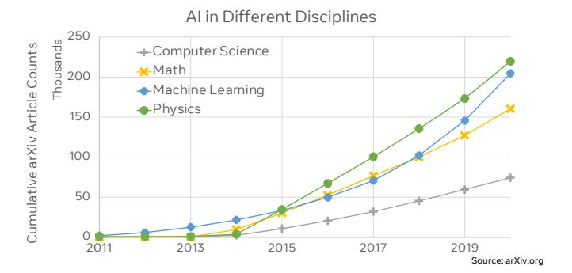

**Figure Description:**
The image is a line graph titled "AI in Different Disciplines." It shows four lines representing different disciplines: Computer Science (Math), Machine Learning (Physics), Math, and Physics. Each line represents an article count over time from 2011 to 2019.

The vertical axis of the graph indicates the number of articles, ranging from 0 to 250 thousand. There are numerical markers at intervals of 100 thousand along the y-axis.

On the horizontal axis, years are marked from 2011 to 2019. The x-axis has numerical tick marks indicating each year.

Each discipline's line starts with a small value for the year 2011 and increases steadily across subsequent years until it reaches its peak by around 2017 or 2018. After that point, there appears to be a slight decrease in the number of articles published in these fields.

There are also colored dots placed above the lines, likely corresponding to specific data points. These dots are color-coded according to the type of discipline represented by the line below them. For example, blue dots correspond to the Math category, while green dots indicate the Physics category.

In the bottom right corner of the image, there is a source attribution: "Source: arXiv.org," which suggests where the data might have been obtained. The overall style of the image is informational and designed to convey trends in academic publication related to artificial intelligence within various scientific domains.

1

Fig. 1. The growth of ML is exceeding that of many other scientific disciplines. Significant research growth in machine learning is observed in recent years as illustrated by the increasing cumulative number of papers published in machine learning with respect to other scientific disciplines based on the monthly count (y-axis measures the cumulative number of articles on arXiv).

in research, development, and deployment have led to a superlinear growth in AI data, models, and infrastructure capacity. With the dramatic growth of AI, it is imperative to understand the environmental implications, challenges, and opportunities of this nascent technology. This is because technologies tend to create a self-accelerating growth cycle, putting new demands on the environment.

This work explores the environmental impact of AI from a *holistic* perspective. More specifically, we present the challenges and opportunities to designing sustainable AI computing across the key phases of the machine learning (ML) development process — *Data*, *Experimentation*, *Training*, and *Inference* — for a variety of AI use cases at Facebook, such as vision, language, speech, recommendation and ranking. The solution space spans across our fleet of datacenters and ondevice computing. Given particular use cases, we consider the impact of AI *data*, *algorithms*, and *system hardware*. Finally, we consider emissions across the life cycle of hardware systems, from manufacturing to operational use.

AI Data Growth. In the past decade, we have seen an exponential increase in AI training data and model capacity. Figure [2\(](#page-1-0)b) illustrates that the amount of training data at Facebook for two recommendation use cases — one of the fastest growing areas of ML usage at Facebook— has increased by 2.4× and 1.9× in the last two years, reaching exabyte scale. The increase in data size has led to a 3.2× increase in data ingestion bandwidth demand. Given this increase, data storage and the ingestion pipeline accounts for a significant portion of

1Based on monthly counts, Figure [1](#page-0-0) estimates the cumulative number of papers published per category on the arXiv database.

**Figure Description:**
The image is a composite of three separate graphs related to machine learning model size scaling, each labeled with text that provides context for their content. These graphs are part of an analysis or presentation comparing different models across various metrics such as data growth trend, system growth trend, and absolute model size improvements over time.

(a) (100x Model Size Scaling): This graph shows two lines representing GPT English2French and RecSys search, both starting from zero and increasing along the x-axis which represents "Model Size (billions of parameters)" ranging from 5 to 45 billion. Both lines have numerical markers at specific points indicating certain milestones or events:
- At 30 billion parameters, there's a vertical line with the label "GPT English2French" and another one with "RecSys search."
- There are also horizontal lines connecting these labels to the corresponding lines, suggesting some form of comparison between the two systems at this point.
- A blue shaded area underlines the GPT English2French line, possibly highlighting its performance or progression compared to the other line.

(b) (Data Growth Trend): This graph displays a line chart with two lines representing RM1 DATA and Training + Inference, both starting from zero and rising upwards. The y-axis indicates "Capacity (TB)" ranging from 0 to 6.5 TB, while the x-axis spans from 2019 to 2021. The RM1 DATA line has several numerical markers at specific points, including 2.8x, 2.9x, and 2.7x, which could indicate multiplicative increases in capacity over time.

(c) (System Growth Trend): Similar to the previous graph, this one features two lines representing Data ingestion BW and Absolute model size improvement, again starting from zero and increasing along the x-axis, which ranges from 2019 to 2021. The y-axis here measures "Capacity (TB)" as well, but it goes up to 3.5 TB. Numerical markers include 2.5x, 2.6x, and 2.4x, likely denoting similar multiplicative trends observed in the first graph.

The overall style of the image suggests it might be used in a technical report or academic paper discussing advancements in AI models and how they scale over time. The use of axes scales and numerical markers emphasizes quantitative aspects of the data being presented.

Fig. 2. Deep learning has witnessed an exponential growth in data, model parameters, and system resources over the recent years. (a) The  $1000 \times$  model size growth has led to higher model accuracy for various ML tasks. For example, with GPT-3, to increase the model quality BLEU score from 5 to 40 requires a model  $1,000 \times$  larger in size. (b) At Facebook, the amount of data for recommendation use cases has roughly doubled between 2019 and 2021, leading to 3.2 times increase in the data ingestion bandwidth demand. (c) Facebook's recommendation and ranking model sizes have increased by 20 times during the same time period [11]. (d) The explosive growth in AI has driven  $2.9 \times$  and  $2.5 \times$  capacity increases for AI training and inference, respectively.

the infrastructure and power capacity compared to ML training and end-to-end machine learning life cycles.

AI Model Growth. The ever-increasing data volume has also driven a super-linear trend in model size growth. Figure 2(a) depicts the  $1000\times$  model size increase for GPT3-based language translation tasks [12], [13], whereas for Baidu's search engine, the model of  $1000\times$  larger in size improves accuracy in AUC by 0.030. Despite small, the accuracy improvement can lead to significantly higher-quality search outcomes [14]. Similarly, Figure 2(c) illustrates that between 2019 and 2021, the size of recommendation models at Facebook has increased by  $20\times$  [15], [16], [17], [11]. Despite the large increase in model sizes, the memory capacity of GPU-based AI accelerators, e.g. 32GB (NVIDIA V100, 2018) to 80GB (NVIDIA A100, 2021), has increased by  $< 2\times$  every 2 years. The resource requirements for strong AI scaling clearly outpaces that of system hardware.

AI Infrastructure Growth. The strong performance scaling demand for ML motivates a variety of *scale-out* solutions [11], [18] by leveraging parallelism at scale with a massive collection of training accelerators. Figure 2(d) illustrates that the explosive growth in AI use cases at Facebook has driven  $2.9 \times$  increase in AI training infrastructure capacity over the 1.5 years. In addition, we observe trillions of inference per day across Facebook's data centers—more than doubling in the past 3 years. The increase in inference demands has also led to an  $2.5 \times$  increase in AI inference infrastructure capacity. Last but not least, the carbon footprint of AI goes beyond its *operational* energy consumption. The *embodied* carbon footprint of systems is becoming a dominating factor for AI's overall environmental impact (Section III) [19].

The Elephant in the Room. Despite the positive societal benefits [20], the endless pursuit of achieving higher model quality has led to the exponential scaling of AI with significant energy and environmental footprint implications. Although recent work shows the carbon footprint of training one large ML model, such as *Meena* [21], is equivalent to 242,231 miles driven by an average passenger vehicle [22], this is only one aspect; to fully understand the real environmental impact we must consider the AI ecosystem *holistically* going forward — beyond looking at model training alone and by accounting

for both *operational* and *embodied carbon footprint* of AI. We must look at the ML pipeline end-to-end: data collection, model exploration and experimentation, model training, model optimization and run-time inference. The *frequency of training* and *scale* of each stage of the ML development cycle matter. From the systems perspective, the life cycle of ML software and system hardware, including manufacturing and operational use, must also be considered.

Optimizing across ML pipelines and systems life cycles end-to-end is a complex and challenging task. While training large, sparsely-activated neural networks improves model scalability, achieving higher accuracy at lower operational energy foot-print [21], it can incur higher embodied carbon footprint from the increase in the system resource requirement. Shifting model training and inference to data centers with carbon-free energy can reduce emissions; however, this approach may not scale to a broad set of use cases. Infrastructure for carbon-free energy is limited by factors such as geography and available materials (e.g. rare metals), and takes significant economic resources and time to build. In addition, as on-device learning becomes more ubiquitously adopted to improve data privacy, we can see more computation being shifted away from data centers to the edge, where access to renewable energy is limited.

A Holistic Approach. This paper is the first to take a holistic approach to characterize the environmental footprint of AI computing from experimentation and training to inference. We characterize the carbon footprint of AI computing by examining the model development cycle across industry-scale machine learning use cases at Facebook (Section II). This is illustrated by the more than 800× operational carbon footprint reduction achieved through judicious hardware-software codesign for a Transformer-based universal language model. Taking a step further, we present an end-to-end analysis for both operational and embodied carbon footprint for AI training and inference (Section III). Based on the industry experience and lessons learned, we chart out opportunities and important development directions across the dimensions of AI including data, algorithm, systems, metrics, standards, and best practices (Section IV). We hope the key messages (Section VI) and the insights in this paper can inspire the community to advance the field of AI in an environmentally-responsible manner.

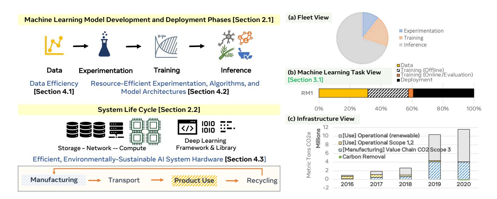

**Figure Description:**
The image is a colorful infographic that outlines various stages of machine learning model development and deployment phases. It's divided into several sections with different colors and contains both textual information and graphical elements such as pie charts and iconography. Here are some key details:

1. **Machine Learning Model Development and Deployment Phases**: At the top left corner, there's a section titled "Machine Learning Model Development and Deployment Phases" with two sub-sections labeled "(a) Fleet View" and "(b) Machine Learning Task View." These seem to be categorizing different aspects or perspectives within the field of machine learning model development.

2. **Data Efficiency (Section 4.1)**: This section shows a pie chart indicating percentages for data efficiency, which includes terms like "Experimentation," "Training," "Offline Evaluation," and "Inference." Each term has a corresponding percentage value ranging from 0% to 60%.

3. **System Life Cycle (Section 2.2)**: There's an illustration depicting a system life cycle with three main components: "Storage - Network - Compute," each represented by a stack of blocks symbolizing storage capacity, network connectivity, and computational power respectively.

4. **Efficient, Environmentally Sustainable AI System Hardware (Section 4.3)**: A bar chart compares the carbon removal capabilities of hardware options over time, starting from 2017 and going up to 2020. Two bars are visible; one represents "Manufacturing" and the other "Recycling." Both have numerical values associated with them, but their specific meanings aren't clear without additional context.

5. **Deep Learning Framework & Library (Section 4.2)**: Another section lists deep learning frameworks and libraries along with their respective versions, including TensorFlow v1.x, PyTorch v1.9, and others. However, no specific version numbers are provided.

The overall style of the image suggests it could be part of a presentation or report related to artificial intelligence, specifically discussing the lifecycle of developing and deploying machine learning models, with a focus on sustainability and efficient use of resources.

Fig. 3. Model Development Phases over AI System Hardware Life Cycle: (a) At Facebook, we observe a rough power capacity breakdown of **10:20:70** for AI infrastructures devoted to the three key phases — **Experimentation**, **Training**, and **Inference**; (b) Considering the primary stages of the ML pipeline end-to-end, the energy footprint of RM1 is roughly **31:29:40** over **Data**, **Experimentation/Training**, and **Inference**; (c) Despite the investment to neutralize the operational footprint with carbon-free energy, the overall data center electricity use continues to grow, demanding over 7.17 million MWh in 2020 [23].

# II. MODEL DEVELOPMENT PHASES AND AI SYSTEM HARDWARE LIFE CYCLE

Figure 3 depicts the major development phases for ML — **Data Processing, Experimentation, Training**, and **Inference** (Section II-A) — over the life cycle of AI system hardware (Section II-B). Driven by distinct objectives of AI research and advanced product development, infrastructure is designed and built specifically to maximize data storage and ingestion efficiency for the phase of **Data Processing**, developer efficiency for the phase of **Experimentation**, training throughput efficiency for the phase of **Training**, and tail-latency bounded throughput efficiency for **Inference**.

#### A. Machine Learning Model Development Cycle

ML researchers extract features from data during the **Data Processing** phase and apply weights to individual features based on feature importance to the model optimization objective. During **Experimentation**, the researchers design, implement and evaluate the quality of proposed algorithms, model architectures, modeling techniques, and/or training methods for determining model parameters. This model exploration process is computationally-intensive. A large collection of diverse ML ideas are explored simultaneously at-scale. Thus, during this phase, we observe unique system resource requirements from the large pool of training experiments. Within Facebook's ML research cluster, 50% (p50) of ML training experiments take up to 1.5 GPU days while 99% (p99) of the experiments complete within 24 GPU days. There are a number of large-scale, trillion parameter models which require over 500 GPUs days.

Once a ML solution is determined as promising, it moves into **Training** where the ML solution is evaluated using extensive production data — data that is *more recent*, is *larger in quantity*, and contains *richer features*. The process often requires additional hyper-parameter tuning. Depending on the ML task requirement, the models can be trained/re-trained at different

frequencies. For example, models supporting Facebook's *Search* service were trained at an hourly cadence whereas the *Language Translation* models were trained weekly [24]. A p50 production model training workflow takes 2.96 GPU days while a training workflow at p99 can take up to 125 GPU days.

Finally, for **Inference**, the best-performing model is deployed, producing trillions of daily predictions to serve billions of users worldwide. The total compute cycles for inference predictions are expected to exceed the corresponding training cycles for the deployed model.

#### B. Machine Learning System Life Cycle

Life Cycle Analysis (LCA) is a common methodology to assess the carbon emissions over the product life cycle. There are four major phases: *manufacturing*, *transport*, *product use*, and *recycling*2. From the perspective of AI's carbon footprint analysis, *manufacturing* and *product use* are the focus. Thus, in this work, we consider the overall carbon footprint of AI by including *manufacturing* — carbon emissions from building infrastructures specifically for AI (i.e., *embodied carbon footprint*) and *product use* — carbon emissions from the use of AI (i.e., *operational carbon footprint*).

While quantifying the exact breakdown between operational and embodied carbon footprint is a complex process, we estimate the significance of embodied carbon emissions using Facebook's Greenhouse Gas (GHG) emission statistics3. In this case, more than 50% of Facebook's emissions owe to its value chain — Scope 3 of Facebook's GHG emission. As a result, a significant embodied carbon cost is paid upfront for every system component brought into Facebook's fleet of datacenters, where AI is the biggest growth driver.

&lt;sup>2Recycling is an important domain, for which the industry is developing a circular economy model to up-cycle system components — design with recycling in mind.

&lt;sup>3Facebook Sustainability Data: https://sustainability.fb.com/report/2020-sustainability-report/.

#### Operational Carbon Footprint of Large-Scale ML Tasks

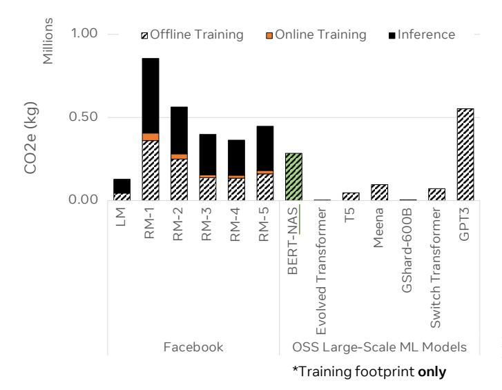

**Figure Description:**
The image is a bar chart that compares various training methods across three categories: Offline Training, Online Training, and Inference. Each category has four bars representing different models or systems: Facebook, OSS Large-Scale ML Models, GPT (presumably referring to Generative Pretrained Transformer), and Switch Transformers.

In the "Offline Training" section, there are two bars for Facebook with values of 1.00 million kg and 0.50 million kg, indicating some sort of measurement related to offline training. There's also one bar each for OSS Large-Scale ML Models and GPT, but their specific values aren't visible due to the cropping of the image.

The "Online Training" section shows two bars for Facebook with values of 0.25 million kg and 0.49 million kg, suggesting these numbers might be associated with online training costs or environmental impact. Again, the values for OSS Large-Scale ML Models and GPT are not fully visible.

For "Inference," which likely refers to the use of trained models after training, there are two bars for Facebook with values of 0.37 million kg and 0.68 million kg. Similarly, only partial information about the other models is provided here.

At the bottom right corner of the image, there's an asterisked note stating "*Training footprint only," implying that the chart focuses solely on the training phase rather than ongoing usage or inference.

Overall, the chart seems to compare the resource consumption or environmental impact between different training methods within the context of machine learning model development. However, without more context or additional data points, it's difficult to provide a detailed interpretation of the results.

Fig. 4. The carbon footprint of the LM model is dominated by Inference whereas, for RM1 – RM5, the carbon footprint of Training versus Inference is roughly equal. The average carbon footprint for ML training tasks at Facebook is 1.8 times larger than that of Meena used in modern conversational agents and 0.3 times of GPT-3's carbon footprint. Carbon footprint for inference tasks is included for models that are used in production. Note: the operational carbon footprint of AI does not correlate with the number of model parameters. The OSS large-scale ML tasks are based on the vanilla model architectures from [21] and may not be reflective of production use cases.

#### III. AI COMPUTING'S CARBON FOOTPRINT

# A. Carbon Footprint Analysis for Industry-Scale ML Training and Deployment

Figure 4 illustrates the operational carbon emissions for model training and inference across the ML tasks. We analyze six representative machine learning models in production at Facebook4. **LM** refers to Facebook's Transformer-based Universal Language Model for text translation [25]. **RM1** – **RM5** represent five unique deep learning recommendation and ranking models for various Facebook products [26], [27].

We compare the carbon footprint of Facebook's production ML models with seven large-scale, open-source (OSS) models: BERT-NAS, T5, Meena, GShard-600B, Switch Transformer, and GPT-3. Note, we present the operational carbon footprint of the OSS model training from [28], [21]. The operational carbon footprint results can vary based on the exact AI systems used and the carbon intensity of the energy mixture. Models with more parameters do not necessarily result in longer training time nor higher carbon emissions. Training the Switch Transformer model equipped with 1.5 trillion parameters [29] produces significantly less carbon emission than that of GPT-3 (750 billion parameters) [13]. This illustrates the carbon footprint advantage of operationally-efficient model architectures.

#### Overall Carbon Footprint of Large-Scale ML Tasks

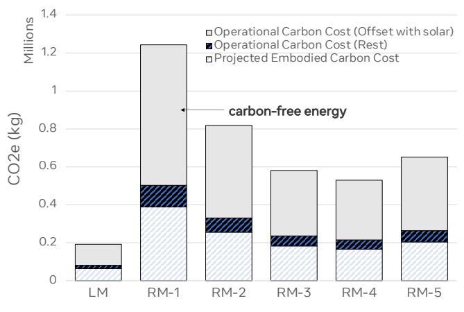

**Figure Description:**
The image is a bar chart that compares carbon-free energy technologies based on their operational carbon cost (OCC) per million kilograms (kg). There are five bars representing different types of energy generation: LM, RM-1, RM-2, RM-3, and RM-5. Each bar has two labels above it indicating the type of technology and its corresponding OCC value.

The first label for each bar reads "Operational Carbon Cost (Offset with solar)" followed by an asterisk symbol (*), which suggests that these costs include offsetting with solar power. Below this, there's another label reading "Projected Embodied Carbon Cost," without any asterisks, implying that these figures do not take into account the use of solar offsets.

The numerical values associated with each bar indicate the amount of CO2 emissions per million kg produced by each technology when considering both direct and indirect emissions. For example, the LM bar shows a value of 0.6 kgCO2e/MM kg, while the RM-4 bar displays 0.8 kgCO2e/MM kg. These numbers provide a quantitative comparison between the environmental impact of these various energy sources.

In summary, the image presents data comparing the carbon footprint of different clean energy technologies, highlighting the differences in operational carbon costs when accounting for or excluding solar offsets.

Fig. 5. When considering the overall life cycle of ML models and systems in this analysis, manufacturing carbon cost is roughly 50% of the (location-based) operational carbon footprint of large-scale ML tasks (Figure 4). Taking into account carbon-free energy, such as solar, the operational energy consumption can be significantly reduced, leaving the manufacturing carbon cost as the dominating source of AI's carbon footprint.

Both **Training** and **Inference** can contribute significantly to the overall carbon footprint of machine learning tasks at Facebook. The exact breakdown between the two phases varies across ML use cases.

The overall operational carbon footprint is categorized into offline training, online training, and inference. Offline training encompasses both experimentation and training models with historical data. Online training is particularly relevant to recommendation models where parameters are continuously updated based on recent data. The inference footprint represents the emission from serving production traffic. The online training and inference emissions are considered over the period of offline training. For recommendation use cases, we find the carbon footprint is split evenly between training and inference. On the other hand, the carbon footprint of LM is dominated by the inference phase, using much higher inference resources (65%) as compared to training (35%).

Both operational and embodied carbon emissions can contribute significantly to the overall footprint of ML tasks.

**Operational Carbon Footprint:** Across the life cycle of the Facebook models shown in Figure 4, the average carbon footprint is 1.8× higher than that of the open-source Meena model [30] and one-third of GPT-3's training footprint. To quantify the emissions of Facebook's models we measure the total energy consumed, assume location-based carbon intensities for energy mixes,5 and use a data center Power Usage Effectiveness (PUE) of 1.1. In addition to model-level and hardware-level optimizations, Facebook's renewable energy procurement [23] programs mitigates these emissions.

**Embodied Carbon Footprint:** To quantify the embodied carbon footprint of AI hardware, we use LCA (Section II-B). We assume GPU-based AI training systems have similar

&lt;sup>4In total, the six models account for a vast majority of compute resources for the overall inference predictions at Facebook, serving billions of users world wide.

&lt;sup>5Renewable energy and sustainability programs of Facebook [23].

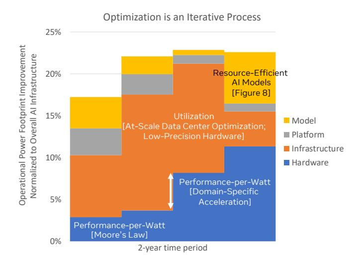

**Figure Description:**
The image is a bar chart titled "Optimization is an iterative process." It illustrates various stages of optimization for artificial intelligence (AI) models, with each stage represented by different colored bars. There are four main categories: Resource-Efficient AI Models (Figure 8), Utilization (At-Scale Data Center Optimization; Low-Precision Hardware), Performance-per-Watt (Moore's Law), and Domain-Specific Acceleration(s). Each category has subcategories labeled as 'Model', 'Platform', 'Infrastructure', and 'Hardware'.

The vertical axis represents the percentage improvement over time, ranging from -25% to +10%. The horizontal axis indicates the timeline period, which appears to be two years.

Each bar corresponds to one of these categories or subcategories, and their heights reflect the corresponding improvements. For example, the 'Resource-Efficient AI Models (Figure 8)' shows a significant increase at the beginning of the timeline, followed by a decrease towards the end. On the other hand, the 'Performance-per-Watt (Moore's Law)' starts high but decreases slightly over time. The 'Domain-Specific Acceleration(s)' also begins high but fluctuates throughout the timeline.

The colors used for the bars include orange, blue, yellow, and gray, which correspond to different types of optimizations such as resource efficiency, utilization, performance per watt, and domain-specific accelerations respectively.

Overall, the chart provides a visual representation of how different aspects of AI model optimization have evolved over a two-year period, highlighting both positive and negative trends across various domains.

Fig. 6. Optimization is an iterative process — we have achieved an average of 20% operational energy footprint reduction every 6 months across the machine learning hardware-software stack.

embodied footprint as the production footprint of Apple's 28 core CPU with dual AMD Radeon GPUs (2000kg CO2) [\[31\]](#page-10-30). For CPU-only systems, we assume half the embodied emissions. Based on the characterization of model training and inference at Facebook, we assume an average utilization of 30-60% over the 3- to 5-year lifetime for servers. Figure [5](#page-3-4) presents the overall carbon footprint for the large scale ML tasks at Facebook, spanning both operational and embodied carbon footprint. Based on the assumptions of location-based renewable energy availability, the split between the embodied and (locationbased) operational carbon footprint is roughly 30% / 70% for the large scale ML tasks. Taking into account carbon-free energy, such as solar, the operational carbon footprint can be significantly reduced, leaving the manufacturing carbon cost as the dominating source of AI's carbon footprint.

### *B. Carbon Footprint Optimization from Hardware-Software Co-Design*

*Optimization is an iterative process — we reduce the power footprint across the machine learning hardware-software stack by 20% every 6 months. But at the same time, AI infrastructure continued to scale out. The net effect, with Jevon's Paradox, is a 28.5% operational power footprint reduction over two years (Figure [8\)](#page-5-0).*

Optimization across AI Model Development and System Stack over Time: Figure [6](#page-4-0) shows the operational power footprint reduction across Facebook's AI fleet over two years. The improvement come from four areas of optimizations: *model* (e.g., designing resource-efficient models), *platform* (e.g., PyTorch's support for quantization), *infrastructure* (e.g., data center optimization and low-precision hardware), and *hardware* (e.g., domain-specific acceleration). Each bar illustrates the operational power reduction across Facebook's AI fleet over 6-month period from each of the optimization areas. The optimizations in aggregate provide, on average, a 20% reduction in operational power consumption every six months.

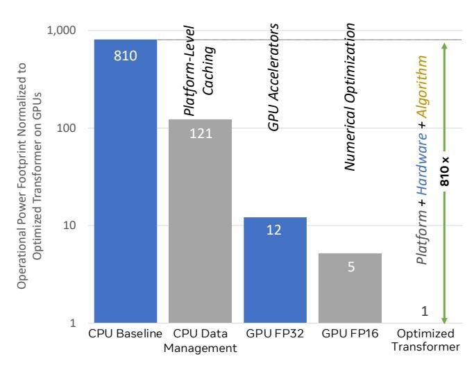

**Figure Description:**
The image is a bar chart that compares various levels of optimization for different types of hardware platforms. There are four bars representing CPU Baseline, GPU Baseline, GPU Accelerators, and Transformer Optimization. Each bar corresponds to a specific platform: CPUs (Central Processing Units), GPUs (Graphics Processing Units), GPGU (General-Purpose Graphics Processing Unit) accelerators, and transformers.

The x-axis represents numerical optimizations ranging from +10^9 to -810^9, which likely correspond to computational power or efficiency gains. This scale suggests an exponential range of improvements or losses.

On the y-axis, there's a label "Optimized Power Trajectory" with a green arrow pointing upwards, indicating that as the numerical value increases along the x-axis, the optimized power also increases.

Each bar has two numbers associated with it: one number above the bar and another below it. These numbers seem to be related to performance metrics such as speedup or efficiency gain. For example, the CPU Baseline bar shows "+10^9," suggesting that at the highest level of optimization (+10^9), the CPU baseline achieves a significant improvement compared to its base state. Similarly, other bars show corresponding numerical values, but without additional context, their exact meaning remains unclear.

Overall, the chart provides a visual representation of how different hardware platforms benefit from varying degrees of optimization, highlighting the potential impact of advanced algorithms and techniques on computing performance.

Fig. 7. For the cross-lingual ML task (LM), the operational energy footprint can be significantly reduced by more than 800× using *platform-level caching*, *GPUs*, *low precision data format*, and *additional algorithmic optimization*.

The compounded benefits highlight the need for cross-stack optimizations.

Optimizing the Carbon Footprint of LMs: We dive into a specific machine learning task at Facebook: language translation using a Transformer-based architecture (LM). LM is designed based on the state-of-the-art cross-lingual understanding through self-supervision. Figure [7](#page-4-1) analyzes the power footprint improvements over a collection of optimization steps for LM: *platform-level caching*, *GPU acceleration*, *low precision format on accelerator*, and *model optimization*. In aggregate the optimizations reduce the infrastructure resources required to serve LM at scale by over 800×. We outline the optimization benefits from each area below.

- Platform-Level Caching. Starting with a CPU server baseline, application-level caching improves power efficiency by 6.7×. These improvements are a result of precomputing and caching frequently accessed embeddings for language translation tasks. Using DRAM and Flash storage devices as caches, these pre-computed embeddings can be shared across applications and use cases.
- GPU acceleration. In addition to caching, deploying LM across GPU-based specialized AI hardware unlocks an additional 10.1× energy efficiency improvement.
- Algorithmic optimization. Finally, algorithmic optimizations provide an additional 12× energy efficiency reduction. Halving precision (e.g., going from 32-bit to 16-bit operations) provides a 2.4× energy efficiency improvement on GPUs. Another 5× energy efficiency gain can be achieved by using custom operators to schedule encoding steps within a single kernel of the Transformer module, such as [\[32\]](#page-10-31).

Optimizing the Carbon Footprint of RMs: The LM analysis is used as an example to highlight the optimization opportunities available with judicious cross-stack, hardware/software optimization. In addition to optimizing the carbon footprint for the language translation task, we describe additional optimization techniques tailored for ranking and

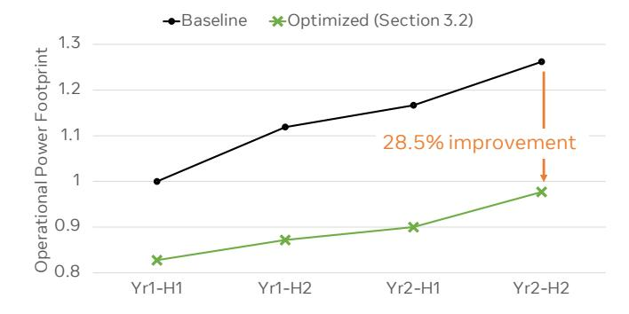

**Figure Description:**
The image is a graph that appears to be from an academic or research paper. It shows two lines representing different data sets over time, measured along both axes of the graph. On the x-axis, there are three years labeled as "Year1", "Year2", and "Year3". These labels suggest that the data points correspond to measurements taken at these specific times. On the y-axis, there's a numerical scale ranging from 0 to 1.3, which likely represents some form of measurement unit for the data being plotted.

The line with filled circles (markers) is labeled "Operational Power" and has a title above it stating "Optimized (Section 3.2)", indicating that this line represents optimized operational power data. This line starts just below the origin point (0,0), rises steadily upwards until around Year1, then drops slightly before continuing its upward trend through Year2 and into Year3. At the end of Year3, the marker is positioned near the top right corner of the graph, suggesting a significant increase in operational power during this period.

The second line, represented by open squares, is titled "Baseline" and also includes a label "Optimized (Section 3.2)" above it. This line begins higher than the first line but follows a similar trajectory, starting just above the origin point and rising sharply after about Year1.5. Both lines show improvement over time, with the Baseline line showing less improvement compared to the Operational Power line.

At the bottom left corner of the graph, there's a note saying "Operation Power Footprint," which might indicate the footprint associated with the operation power data. Additionally, there's another note at the bottom right corner stating "28.5% improvement," which seems to quantify the percentage improvement between the baseline and optimized operational power data.

Overall, the graph is used to visually compare the performance of the optimized operational power against a baseline, illustrating how the operational power improves over time according to the data presented.

Fig. 8. The iterative optimization process has led to 28.5% operational energy footprint reduction over the two-year time period (Section [III-B\)](#page-4-2). Despite the significant operational power footprint reduction, we continue to see the overall electricity demand for AI to increase over time — an example of *Jevon's Paradox*, where efficiency improvement stimulates additional novel AI use cases.

recommendation use cases.

A major infrastructure challenge faced by deep learning RM training and deployment (RM1 – RM5) is the fast-rising memory capacity and bandwidth demands (Figure [2\)](#page-1-0). There are two primary sub-nets in a RM: the dense fully-connected (FC) network and the sparse embedding-based network. The FC network is constructed with multi-layer perceptions (MLPs), thus computationally-intensive. The embedding network is used to project hundreds of sparse, high-dimensional features to lowdimension vectors. It can easily contribute to over 95% of the total model size. For a number of important recommendation and ranking use cases, the embedding operation dominates the inference execution time [\[27\]](#page-10-26), [\[33\]](#page-10-32).

To tackle the significant memory capacity and bandwidth requirement, we deploy model quantization for RMs [\[34\]](#page-10-33). Quantization offers two primary efficiency benefits: the lowprecision data representation reduces the amount of computation requirement and, at the same time, lowers the overall memory capacity need. By converting 32-bit floating-point numerical representation to 16-bit, we can reduce the overall RM2 model size by 15%. This has led to 20.7% reduction in memory bandwidth consumption. Furthermore, the memory capacity reduction enabled by quantization unblocks novel systems with lower on-chip memory. For example, for RM1, quantization has enabled RM deployment on highly powerefficient systems with smaller on-chip memory, leading to an end-to-end inference latency improvement of 2.5 times.

#### *C. Machine Learning Infrastructures at Scale*

ML Accelerators: GPUs are the de-facto training accelerators at Facebook, contributing to significant power capacity investment in the context of Facebook's fleet of datacenters. However, GPUs can be severely under-utilized during both the ML Experimentation and Training phases (Figure [10\)](#page-7-0) [\[35\]](#page-10-34). To amortize the upfront embodied carbon cost of every accelerator deployed into Facebook's datacenters, maximizing accelerator utilization is a must.

Efficiency of Scale: The higher throughput performance density achieved with ML accelerators reduces the total number of processors deployed into datacenter racks. This leads to more effective amortization of shared infrastructure overheads. Furthermore, datacenter capacity is not only limited by physical space but also power capacity — higher operational power efficiency directly reduces the inherited carbon cost from manufacturing of IT infrastructures and datacenter buildings.

At-Scale Efficiency Optimization for Facebook Data Centers: Servers in Facebook data center fleets are customized for internal workloads only — machine learning tasks [\[24\]](#page-10-23) or not [\[36\]](#page-10-35), [\[37\]](#page-10-36). Compared to public cloud providers, this puts Facebook at a unique position for at-scale resource management design and optimization. First, Facebookcustomizes server SKUs — compute, memcached, storage tiers and ML accelerators — to maximize performance and power efficiency. Achieving a Power Usage Effectiveness (PUE) of about 1.10, Facebook's data centers are about 40% more efficient than small-scale, typical data centers.

Furthermore, the large-scale deployment of servers of different types provides an opportunity to build performance measurement and optimization tools to ensure high utilization of the underlying infrastructure. For data center fleets in different geographical regions where the actual server utilization exhibits a diurnal pattern, Auto-Scaling frees the over-provisioned capacity during off-peak hours, by up to 25% of the web tier's machines [\[38\]](#page-10-37). By doing so, it provides opportunistic server capacity for others to use, including offline ML training. Furthermore, static power consumption plays a non-trivial role in the context of the overall data center electricity footprint. This motivates more effective processor idle state management.

Carbon-Free Energy: Finally, over the past years, Facebookhas invested in carbon free energy sources to neutralize its operational carbon footprint [\[23\]](#page-10-22). Reaching net zero emissions entails matching every unit of energy consumed by data centers with 100% renewable energy purchased by Facebook. Remaining emissions are offset with various sustainability programs, further reducing the operational carbon footprint of AI computing at Facebook. As Section [IV-C](#page-7-1) will later show, *more can be done*.

#### *D. Going Beyond Efficiency Optimization*

Despite the opportunities for optimizing energy efficiency and reducing environmental footprint at scale, there are many reasons why we must care about scaling AI in a more environmentally-sustainable manner. AI growth is multiplicative beyond current industrial use cases. Although domain-specific architectures improve the operational energy footprint of AI model training by more than 90% [\[21\]](#page-10-20), these architectures require more system resources, leading to larger embodied carbon footprints.

While shifting model training and inference to data centers with carbon-free energy sources can reduce emissions, the solution may not scale to all AI use cases. Infrastructure for carbon free energy is limited by rare metals and materials, and takes significant economic resources and time to build. Furthermore, the carbon footprint of federated learning and optimization use cases at the edge is estimated to be similar to that of training a Transformer Big model (Figure [11\)](#page-8-0). As ondevice learning becomes more ubiquitously adopted to improve

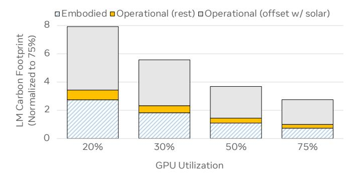

**Figure Description:**
The image is a bar chart that compares three different types of carbon footprint normalization methods: Embodied Carbon (EC), Operational (rest) Dynamic Offset w/ Solar, and GPU Utilization. Each method has four bars representing different percentages of carbon normalized to 75%: 20%, 30%, 50%, and 75%.

The first bar for each method represents EMBODIED CARBON (%) at 8, which is significantly higher than the other two methods. This suggests that the embodied carbon percentage is much larger when compared to operational dynamic offset with solar or GPU utilization.

For OPERATIONAL (rest) DYNAMIC OFFSET w/ SOLAR, the second bar from the left shows a value of 4, indicating that it's lower than the first but still above the third method.

The last bar on the right represents GPU UTILIZATION, showing a value of 1, which is considerably smaller than both the EC and the operational dynamic offset with solar.

Each bar is color-coded according to its category—blue for EC, gray for operational dynamic offset with solar, and yellow for GPU utilization. The x-axis labels "GPUs" are not fully visible due to the cropping of the image. The y-axis indicates the scale as "% Carbon Normalized to 75%," ranging from 0 to 8. There is also an additional label "Embodied > Operational (rest)" suggesting that the embodied carbon is greater than the operational dynamic offset with solar.

Fig. 9. As accelerator utilization improves over time, both operational and embodied carbon footprints of AI improve. Carbon-free energy helps reduce the operational carbon footprint, making embodied carbon cost the dominating factor. To reduce the rising carbon footprint of AI computing at-scale, we must complement efficiency and utilization optimization with novel approaches to reduce the remaining embodied carbon footprint of AI systems.

data privacy, we expect to see more computation being shifted away from data centers to the edge, where access to renewable energy may be limited. The edge-cloud space for AI poses interesting design opportunities (Section [IV-C\)](#page-7-1).

*The growth of AI in all dimensions outpaces the efficiency improvement at-scale.* Figure [9](#page-6-1) illustrates that, as GPU utilization is improved (x-axis) for LM training on GPUs, both embodied and operational carbon emissions will reduce. Increasing GPU utilization up to 80%, the overall carbon footprint decreases by 3×. Powering AI services with renewable energy sources can further reduce the overall carbon footprint by a factor of 2. Embodied carbon cost becomes the dominating source of AI's overall carbon footprint. To curb the rising carbon footprint of AI computing at-scale (Figure [8](#page-5-0) and Figure [9\)](#page-6-1), *we must look beyond efficiency optimization and complement efficiency and utilization optimization with efforts to tackle the remaining embodied carbon footprint of AI systems.*

#### IV. A SUSTAINABILITY MINDSET FOR AI

To tackle the environmental implications of AI's exponential growth (Figure [2\)](#page-1-0), the first key step requires ML practitioners and researchers to develop and adopt an *sustainability mindset*. The solution space is wide open—while there are significant efforts looking at *AI system and infrastructure efficiency* optimization, the *AI data, experimentation, and training algorithm efficiency* space (Sections [IV-A](#page-6-2) and [IV-B\)](#page-6-3) beyond system design and optimization (Section [IV-C\)](#page-7-1) is less well explored. We cannot optimize what cannot be measured — telemetry to track the carbon footprint of AI technologies must be adopted by the community (Section [V-A\)](#page-8-1). We synthesize a number of important directions to scale AI in a *sustainable* manner and to minimize the environmental impact of AI for the next decades.

The field of AI is currently primarily driven by research that seeks to maximize model accuracy — *progress* is often used synonymously with improved prediction quality. This endless pursuit of higher accuracy over the decade of AI research has significant implications in computational resource requirement and environmental footprint. To develop AI technologies responsibly, *we must achieve competitive model accuracy at a fixed or even reduced computational and environmental cost*. Despite the recent calls-to-action [\[28\]](#page-10-27), [\[39\]](#page-11-0), [\[40\]](#page-11-1), [\[41\]](#page-11-2), [\[21\]](#page-10-20), the

overall community remains under-invested in research that aims at deeply understanding and minimizing the cost of AI. We conjecture the factors that may have contributed to the current state in Appendix [A.](#page-13-0) To bend the exponential growth curve of AI and its environmental footprint, we must build a future where efficiency is an evaluation criterion for publishing ML research on computationally-intensive models beyond accuracyrelated measures.

### *A. Data Utilization Efficiency*

Data Scaling and Sampling: *No data is like more data* — data scaling is the de-facto approach to increase model quality, where the primary factor for accuracy improvement is driven by the size and quality of training data, instead of algorithmic optimization. However, data scaling has significant environmental footprint implications. To keep the model training time manageable, overall system resources must be scaled with the increase in the data set size, resulting in larger embodied carbon footprint and operational carbon footprint from the data storage and ingestion pipeline and model training. Alternatively, if training system resources are kept fixed, data scaling increases training time, resulting in a larger operational energy footprint.

When designed well, however, data scaling, sampling and selection strategies can improve the competitive analysis for ML algorithms, reducing the environmental footprint of the process (Appendix [A\)](#page-13-1). For instance, Sachdeva et al. demonstrated that intelligent data sampling with merely 10% of data sub-samples can effectively preserve the relative ranking performance of different recommendation algorithms [\[42\]](#page-11-3). This ranking performance is achieved with an average of 5.8 times execution time speedup, leading to significant operating carbon footprint reduction.

Data Perishability: Understanding key characteristics of data is fundamental to efficient data utilization for AI applications. *Not all data is created equal* and data collected over time loses its predictive value gradually. Understanding the rate at which data loses its predictive value has strong implications on the resulting carbon footprint. For example, natural language data sets can lose half of their predictive value in the time period of less than 7 years (the half-life time of data) [\[43\]](#page-11-4). The exact half-life period is a function of context. If we were able to predict the half-life time of data, we can devise effective sampling strategies to subset data at different rates based on its half-life. By doing so, the resource requirement for the data storage and ingestion pipeline can be significantly reduced [\[44\]](#page-11-5) — lower training time (operational carbon footprint) as well as storage needs (embodied carbon footprint).

#### *B. Experimentation and Training Efficiency*

The experimentation and training phases are closely coupled (Section [II\)](#page-2-0). There is a natural trade-off between the investment in experimentation and the subsequent training cost (Section [III\)](#page-3-0). *Neural architecture search* (NAS) and *hyperparameter optimization* (HPO) are techniques that automate the design space exploration. Despite their capability to discover higherperforming neural networks, NAS and HPO can be extremely

resource-intensive, involving training many models, especially when using simple approaches. Strubell et al. show that grid-search NAS can incur over  $3000\times$  environmental footprint overhead [28]. Utilizing much more sample-efficient NAS and HPO methods [45], [46] can translate directly into carbon footprint improvement. In addition to reducing the number of training experiments, one can also reduce the training time of each experiment. By detecting and *stopping under-performing training workflows early*, unnecessary training cycles can be eliminated.

Multi-objective optimization explores the Pareto frontier of efficient model quality and system resource trade-offs. If used early in the model exploration process, it enables more informed decisions about which model to train fully and deploy given certain infrastructure capacity. Beyond model accuracy and timing performance [47], [48], [49], [50], energy and carbon footprint can be directly incorporated into the cost function as optimization objectives to enable discovery of environmentally-friendly models. Furthermore, when training is decoupled from NAS, sub-networks tailoring to specialized system hardware can be selected without additional training [51], [52], [53], [54]. Such approaches can significantly reduce the overall training time, however, at the expense of increased embodied carbon footprint.

Developing resource-efficient model architectures fundamentally reduce the overall system capacity need of ML tasks. From the systems perspective, accelerator memory is scarce. However, DNNs, such as neural recommendation models, require significantly higher memory capacity and bandwidth [55], [33]. This motivates researchers to develop memory-efficient model architectures. For example, the Tensor-Train compression technique (TT-Rec) achieves more than 100× memory capacity reduction with negligible training time and accuracy trade-off [56]. Similarly, the design space tradeoff between memory capacity requirement, training time, and model accuracy is also explored in Deep Hash Embedding (DHE) [57]. While training time increases lead to higher operational carbon footprint, in the case of TT-Rec and DHE, the memory-efficient model architectures require significantly lower memory capacity while better utilizing the computational capability of training accelerators, resulting in lower embodied carbon footprint.

Developing *efficient training algorithms* is a long-time objective of research in optimization and numerical methods [58]. Evaluations of optimization methods should account for *all* experimentation efforts required to tune optimizer hyperparameters, not just the method performance after tuning [59], [60]. In addition, significant research has gone into algorithmic approaches to efficiently scale training [61], [62] by reducing communication cost via compression [63], [64], pipelining [65], and sharding [66], [67]. The advances have enabled efficient scaling to larger models and larger datasets. We expect efficient training methods to continue as an important domain. While this paper has focused on supervised learning relying labeled data, algorithmic efficiency extends to other learning paradigms including self-supervised and semi-supervised learning (Appendix C).

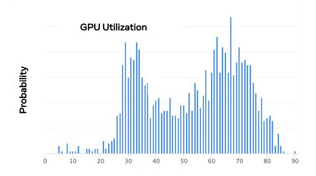

**Figure Description:**
The image is a bar chart titled "GPU Utilization" at the top left corner. Below the title are two horizontal bars with numerical values indicating probability levels: one labeled "Probability" and another labeled "Gpu Utilization." Both bars have blue vertical stripes representing individual data points or measurements.

The "Probability" bar has a series of numbers ranging from 0 to just above 90, suggesting that there's a high likelihood (probability) associated with GPU utilization being below 10. Each number corresponds to a specific point along the x-axis, which appears to be a scale for measuring GPU utilization percentages.

The "Gpu Utilization" bar shows a range of values from approximately 20 to over 80, with numerous peaks and troughs throughout its length. This suggests significant variability in GPU utilization across different instances or scenarios. The highest peak reaches nearly 90, while the lowest valley drops close to zero.

Overall, the chart seems to convey statistical information about the relationship between GPU utilization and probability, possibly within the context of computer hardware performance analysis or system monitoring. However, without additional context, it's difficult to provide more detailed interpretations of these data trends.

Fig. 10. A vast majority of model experimentation (over tens of thousands of training workflows) utilizes GPUs at only 30-50%, leaving room for utilization and efficiency improvements.

# C. Efficient, Environmentally-Sustainable AI Infrastructure and System Hardware

To amortize the embodied carbon footprint, model developers and system architects must *maximize the utilization of accelerator and system resources* when in use and *prolong the lifetime of AI infrastructures*. Existing practices such as the move to domain-specific architectures at cloud scale [68], [69], [70] reduce AI computing's footprint by consolidating computing resources at scale and by operating the shared infrastructures more environmentally-friendly with carbon free energy6.

Accelerator Virtualization and Multi-Tenancy Support: Figure 10 illustrates the utilization of GPU accelerators in Facebook's research training infrastructure. A significant portion of machine learning model experimentation utilizes GPUs at only 30-50%, leaving significant room for improvements to efficiency and overall utilization. Virtualization and workload consolidation technologies can help maximize accelerator utilization [71]. Google's TPUs have also recently started supporting virtualization [72]. Multi-tenancy for AI accelerators is gaining traction as an effective way to improve resource utilization, thereby amortizing the upfront embodied carbon footprint of customized system hardware for AI at the expense of potential operational carbon footprint increase [73], [74], [75], [76], [77].

Environmental Sustainability as a Key AI System Design Principle: Today, servers are designed to optimize performance and power efficiency. However, system design with a focus on operational energy efficiency optimization does not always produce the most environmentally-sustainable solution [78], [79], [19]. With the rising embodied carbon cost and the exponential demand growth of AI, system designers and architects must re-think fundamental system hardware design principles to minimize computing's footprint end-to-end, considering the entire hardware and ML model development life cycle. In addition to the respective performance, power, and cost profiles, the environmental footprint characteristics of processors over the generations of CMOS technologies, DDRx and HBM memory technologies, SSD/NAND-flash/HDD storage technologies can be orders-of-magnitude different [80]. Thus, designing AI

&lt;sup>6We discuss additional important directions for building environmentallysustainable systems in Appendix B, including datacenter infrastructure disaggregation; fault tolerant, resilient AI systems.

systems with the least environmental impact requires explicit consideration of environmental footprint characteristics at the design time.

The Implications of General-Purpose Processors, General-Purpose Accelerators, Reconfigurable Systems, and ASICs for AI: There is a wide variety of system hardware choices for AI from general-purpose processors (CPUs), general-purpose accelerators (GPUs or TPUs), fieldprogrammable gate arrays (FPGAs) [\[81\]](#page-12-1), to application-specific integrated circuit (ASIC), such as Eyeriss [\[82\]](#page-12-2). The exact system deployment choice can be multifaceted — the cadence of ML algorithm and model architecture evolution, the diversity of ML use cases and the respective system resource requirements, and the maturity of the software stack. While ML accelerator deployment brings a step-function improvement in *operational energy efficiency*, it may not necessarily reduce the carbon footprint of AI computing overall. This is because of the upfront embodied carbon footprint associated with the different system hardware choices. From the environmental sustainability perspective, the optimal point depends on the compounding factor of operational efficiency improvement over generations of ML algorithms/models, deployment lifetime and embodied carbon footprint of the system hardware. Thus, to design for environmental sustainability, one must strike a careful balance between *efficiency* and *flexibility* and, at the same time, consider environmental impact as a key design dimension for next-generation AI systems.

Carbon-Efficient Scheduling for AI Computing At-Scale: As the electricity consumption of hyperscale data centers continues to rise, data center operators have devoted significant investment to neutralize operational carbon footprint. By operating large-scale computing infrastructures with carbon free energy, technology companies are taking an important step to address the environmental implications of computing. *More can be done however*.

As the renewable energy proportion in the electricity grid increases, fluctuations in energy generation will increase due to the intermittent nature of renewable energy sources (i.e. wind, solar). Elastic carbon-aware workload scheduling techniques can be used in and across datacenters to predict and exploit the intermittent energy generation patterns [\[83\]](#page-12-3). However such scheduling algorithms might require server over-provisioning to allow for flexibility of shifting workloads to times when carbon-free energy is available. Furthermore, any additional server capacity comes with manufacturing carbon cost which needs to be incorporated into the design space. Alternatively, energy storage (e.g. batteries, pumped hydro, flywheels, molten salt) can be used to store renewable energy during peak generation times for use during low generation times. There is an interesting design space to achieve 24/7 carbon-free AI computing.

On-Device Learning On-device AI is becoming more ubiquitously adopted to enable model personalization [\[84\]](#page-12-4), [\[85\]](#page-12-5), [\[86\]](#page-12-6) while improving data privacy [\[87\]](#page-12-7), [\[88\]](#page-12-8), [\[89\]](#page-12-9), [\[90\]](#page-12-10), yet its impact in terms of carbon emission is often overlooked. On-device learning emits non-negligible carbon. Figure [11](#page-8-0) illustrates that the operational carbon footprint for training a small ML task using *federated learning* (FL) is comparable to

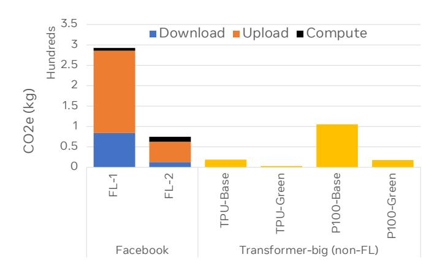

**Figure Description:**
The image is a bar chart that compares the download speeds of different file types across three categories: Download, Upload, and Compute. Each category has four bars corresponding to Facebook, Transformer-big (non-FL), PIO0 Green Base, and PIO10 Green Base.

In the "Download" category, the bars are color-coded as follows:
- Blue for Facebook
- Orange for Transformer-big (non-FL)
- Black for PIO0 Green Base
- Yellow for PIO10 Green Base

The numerical values next to each bar indicate the number of kilobytes (kb) per second (kB/s). For example, the Facebook download speed is shown as 2.5 kB/s, which means it can download files at a rate of 2.5 kilobytes per second. Similarly, the other bars show the download speeds for their respective file types and categories.

For instance, the Transformer-big (non-FL) download speed is also 2.5 kB/s, while both PIO0 Green Base and PIO10 Green Base have a download speed of 3.5 kB/s. In the "Upload" category, all file types except for Facebook's upload speed are represented by black bars with no visible numbers, suggesting either zero or not applicable. However, Facebook's upload speed is indicated as 0.5 kB/s.

In the "Compute" category, only two file types are depicted—Facebook and PIO10 Green Base—with their respective compute speeds being 1 and 0.5 kB/s, respectively. This suggests that these file types require more computational resources than the others.

Overall, the chart provides a detailed comparison of the performance metrics for various file types within the context of social media platforms like Facebook and specialized systems such as those using PIO0 Green Base and PIO10 Green Base. It highlights differences in download and compute speeds among these file types.

Fig. 11. Federated learning and optimization can result in a non-negligible amount of carbon emissions, equivalent to the carbon footprint of training T ransf ormerBig [\[21\]](#page-10-20). FL-1 and FL-2 represent two production FL applications. P100-Base represents the carbon footprint of T ransf ormerBig training on P100 GPU whereas TPU-base is T ransf ormerBig training on TPU. P100-Green and TPU-Green consider renewable energy at the cloud (Methodology detail in Appendix [B\)](#page-14-1).

that of training an orders-of-magnitude larger Transformerbased model in a centralized setting. As FL trains local models on client devices and periodically aggregates the model parameters for a global model, without collecting raw user data [\[87\]](#page-12-7), the FL process can emit non-negligible carbon at the edge due to both computation and wireless communication.

It is important to reduce AI's environmental footprint at the edge. With the ever-increasing demand for on-device use cases over billions of client devices, such as teaching AI to understand the physical environment from the first-person perception [\[91\]](#page-12-11) or personalizing AI tasks, the carbon footprint for on-device AI can add up to a dire amount quickly. Also, renewable energy is far more limited for client devices compared to datacenters. Optimizing the overall energy efficiency of FL and on-device AI is an important first step [\[92\]](#page-12-12), [\[93\]](#page-12-13), [\[94\]](#page-12-14), [\[95\]](#page-12-15), [\[96\]](#page-12-16). Reducing embodied carbon cost for edge devices is also important, as manufacturing carbon cost accounts for 74% of the total footprint [\[19\]](#page-10-18) of client devices. It is particularly challenging to amortize the embodied carbon footprint because client devices are often under-utilized [\[97\]](#page-12-17).

#### V. CALL-TO-ACTION

### *A. Development of Easy-to-Adopt Telemetry for Assessing AI's Environmental Footprint*

While the open source community has started building tools to enable automatic measurement of AI training's environmental footprint [\[39\]](#page-11-0), [\[40\]](#page-11-1), [\[98\]](#page-12-18), [\[99\]](#page-12-19) and the ML research community requiring a broader impact statement for the submitted research manuscript, more can be done in order to incorporate efficiency and sustainability into the design process. Enabling carbon accounting methodologies and telemetry that is easy to adopt is an important step to quantify the significance of our progress in developing AI technologies in an environmentallyresponsible manner. While assessing the novelty and quality of ML solutions, it is crucial to consider sustainability metrics including *energy consumption* and *carbon footprint* along with measures of *model quality* and *system performance*.

Metrics for AI Model and System Life Cycles: Standard carbon footprint accounting methods for AI's overall carbon footprint are at a nascent stage. We need simple, easy-toadopt metrics to make fair and useful comparisons between AI innovations. Many different aspects must be accounted for, including the life cycles of both AI models (*Data*, *Experimentation*, *Training*, *Deployment*) and system hardware (*Manufacturing* and *Use*) (Section [II\)](#page-2-0).

In addition to incorporating an efficiency measure as part of leader boards for various ML tasks, data [\[100\]](#page-12-20), models[7](#page-9-1) , training algorithms [\[101\]](#page-12-21), environmental impact must also be considered and adopted by AI system hardware developers. For example, MLPerf [\[102\]](#page-12-22), [\[103\]](#page-12-23), [\[104\]](#page-12-24) is the industry standard for ML system performance comparison. The industry has witnessed significantly higher system performance speedup, outstripping what is enabled by Moore's Law [\[105\]](#page-12-25), [\[106\]](#page-12-26). Moreover, an algorithm efficiency benchmark is under development[8](#page-9-2) . The MLPerf benchmark standards can advance the field of AI in an environmentally-competitive manner by enabling the measurement of energy and/or carbon footprint.

Carbon Impact Statements and Model Cards: We believe it is important for all published research papers to disclose the operational *and* embodied carbon footprint of proposed design; we are only at the beginning of this journey[9](#page-9-3) . Note, while embodied carbon footprints for AI hardware may not be readily available, describing hardware platforms, the number of machines, total runtime used to produce results presented in a research manuscript is an important first step. In addition, new models must be associated with a model card that, among other aspects of data sets and models [\[107\]](#page-12-27), describes the model's overall carbon footprint to train and conduct inference.

### VI. KEY TAKEAWAYS

The Growth of AI: Deep learning has witnessed an exponential growth in training data, model parameters, and system resources over the recent years (Figure [2\)](#page-1-0). The amount of data for AI has grown by 2.4×, leading to 3.2× increase in the data ingestion bandwidth demand at Facebook. Facebook's recommendation model sizes have increased by 20× between 2019 and 2021. The explosive growth in AI use cases has driven 2.9× and 2.5× capacity increases for AI training and inference at Facebook over the recent 18 months, respectively. The environmental footprint of AI is staggering (Figure [4,](#page-3-1) Figure [5\)](#page-3-4).

A Holistic Approach: To ensure an environmentallysustainable growth of AI, we must consider the AI ecosystem holistically going forward. We must look at the machine learning pipelines end-to-end — data collection, model exploration and experimentation, model training, optimization and runtime inference (Section [II\)](#page-2-0). The frequency of training and scale of each stage of the ML pipeline must be considered to understand salient bottlenecks to sustainable AI. From the system's perspective, the life cycle of model development and

system hardware, including *manufacturing* and *operational use*, must also be accounted for.

Efficiency Optimization: Optimization across the axes of algorithms, platforms, infrastructures, hardware can significantly reduce the operational carbon footprint for the Transformerbased universal translation model by 810×. Along with other efficiency optimization at-scale, this has translated into 25.8% operational energy footprint reduction over the two-year period. *More must be done to bend the environmental impact from the exponential growth of AI* (Figure [8](#page-5-0) and Figure [9\)](#page-6-1).

An Sustainability Mindset for AI: Optimization beyond efficiency across the software and hardware stack at scale is crucial to enabling future sustainable AI systems. To develop AI technologies responsibly, we must achieve competitive model accuracy at a fixed or even reduced computational and environmental cost. We chart out potentially high-impact research and development directions across the *data*, *algorithms and model*, *experimentation* and *system hardware*, and *telemetry* dimensions for AI at datacenters and at the edge (Section [IV\)](#page-6-0).

We must take a deliberate approach when developing AI research and technologies, considering the environmental impact of innovations and taking a responsible approach to technology development [\[108\]](#page-12-28). That is, we need AI to be green and environmentally-sustainable.

#### VII. CONCLUSION

This paper is the first effort to explore the environmental impact of the super-linear trends for AI growth from a holistic perspective, spanning *data*, *algorithms*, and *system hardware*. We characterize the carbon footprint of AI computing by examining the model development cycle across industry-scale ML use cases at Facebook and, at the same time, considering the life cycle of system hardware. Furthermore, we capture the operational and manufacturing carbon footprint of AI computing and present an end-to-end analysis for *what* and *how* hardware-software design and at-scale optimization can help reduce the overall carbon footprint of AI. We share the key challenges and chart out important directions across all dimensions of AI—data, algorithms, systems, metrics, standards, and best experimentation practices. Advancing the field of machine intelligence must not in turn make climate change worse. We must develop AI technologies with a deeper understanding of the societal and environmental implications.

### ACKNOWLEDGEMENT

We would like to thank Nikhil Gupta, Lei Tian, Weiyi Zheng, Manisha Jain, Adnan Aziz, and Adam Lerer for their feedback on many iterations of this draft, and in-depth technical discussions around building efficient infrastructure and platforms; Adina Williams, Emily Dinan, Mona Diab, Ashkan Yousefpour for the valuable discussions and insights on AI and environmental responsibility; Mark Zhou, Niket Agarwal, Jongsoo Park, Michael Anderson, Xiaodong Wang; Yatharth Saraf, Hagay Lupesco, Jigar Desai, Joelle Pineau, Ram Valliyappan, Rajesh Mosur, Ananth Sankarnarayanan and Eytan Bakshy for their leadership and vision without which this work would not have been possible.

7Papers with code: [https://paperswithcode.com/sota/image-classification-on](https://paperswithcode.com/sota/image-classification-on-imagenet) [-imagenet](https://paperswithcode.com/sota/image-classification-on-imagenet)

8<https://github.com/mlcommons/algorithmic-efficiency/>

9[https://2021.naacl.org/ethics/faq/#-if-my-paper-reports-on-experiments-t](https://2021.naacl.org/ethics/faq/#-if-my-paper-reports-on-experiments-that-involve-lots-of-compute-timepower) [hat-involve-lots-of-compute-timepower](https://2021.naacl.org/ethics/faq/#-if-my-paper-reports-on-experiments-that-involve-lots-of-compute-timepower)

#### REFERENCES

- [1] J. Jumper, R. Evans, A. Pritzel, T. Green, M. Figurnov, O. Ronneberger, K. Tunyasuvunakool, R. Bates, A. Zˇ´ıdek, A. Potapenko, A. Bridgland, C. Meyer, S. A. A. Kohl, A. J. Ballard, A. Cowie, B. Romera-Paredes, S. Nikolov, R. Jain, J. Adler, T. Back, S. Petersen, D. Reiman, E. Clancy, M. Zielinski, M. Steinegger, M. Pacholska, T. Berghammer, S. Bodenstein, D. Silver, O. Vinyals, A. W. Senior, K. Kavukcuoglu, P. Kohli, and D. Hassabis, "Highly accurate protein structure prediction with alphafold," *Nature*, 2021.
- [2] M. Komeili, K. Shuster, and J. Weston, "Internet-augmented dialogue generation," *arXiv:2107.07566*, 2021.
- [3] D. Silver, T. Hubert, J. Schrittwieser, and D. Hassabis, "AlphaZero: Shedding new light on chess, shogi, and Go," 2018.
- [4] C. L. Zitnick, L. Chanussot, A. Das, S. Goyal, J. Heras-Domingo, C. Ho, W. Hu, T. Lavril, A. Palizhati, M. Riviere, M. Shuaibi, A. Sriram, K. Tran, B. Wood, J. Yoon, D. Parikh, and Z. Ulissi, "An introduction to electrocatalyst design using machine learning for renewable energy storage," *arXiv preprint arXiv:2010.09435*, 2020.
- [5] C. Elkin and S. Witherspoon, "Machine learning can boost the value of wind energy," 2019.
- [6] R. Evans and J. Gao, "DeepMind AI Reduces Google Data Centre Cooling Bill by 40%," 2016.
- [7] K. Sheikh, "A Growing Presence on the Farm: Robots," February 2020.
- [8] D. Rolnick, P. L. Donti, L. H. Kaack, K. Kochanski, A. Lacoste, K. Sankaran, A. S. Ross, N. Milojevic-Dupont, N. Jaques, A. Waldman-Brown, A. Luccioni, T. Maharaj, E. D. Sherwin, S. K. Mukkavilli, K. P. Kording, C. Gomes, A. Y. Ng, D. Hassabis, J. C. Platt, F. Creutzig, J. Chayes, and Y. Bengio, "Tackling climate change with machine learning," *arXiv:1906.05433*, 2019.
- [9] R. Nishant, M. Kennedy, and J. Corbett, "Artificial intelligence for sustainability: Challenges, opportunities, and a research agenda," *International Journal of Information Management*, vol. 53, 2020.
- [10] Facts and Factors, "Global artificial intelligence market," 2021.
- [11] D. Mudigere, Y. Hao, J. Huang, A. Tulloch, S. Sridharan, X. Liu, M. Ozdal, J. Nie, J. Park, L. Luo, J. A. Yang, L. Gao, D. Ivchenko, A. Basant, Y. Hu, J. Yang, E. K. Ardestani, X. Wang, R. Komuravelli, C. Chu, S. Yilmaz, H. Li, J. Qian, Z. Feng, Y. Ma, J. Yang, E. Wen, H. Li, L. Yang, C. Sun, W. Zhao, D. Melts, K. Dhulipala, K. R. Kishore, T. Graf, A. Eisenman, K. K. Matam, A. Gangidi, G. J. Chen, M. Krishnan, A. Nayak, K. Nair, B. Muthiah, M. khorashadi, P. Bhattacharya, P. Lapukhov, M. Naumov, L. Qiao, M. Smelyanskiy, B. Jia, and V. Rao, "Software-hardware co-design for fast and scalable training of deep learning recommendation models," *arXiv preprint arXiv:2104.05158*, 2021.
- [12] D. Hernandez and T. B. Brown, "Measuring the algorithmic efficiency of neural networks," *arXiv preprint arXiv:2005.04305*, 2020.
- [13] T. B. Brown, B. Mann, N. Ryder, M. Subbiah, J. Kaplan, P. Dhariwal, A. Neelakantan, P. Shyam, G. Sastry, A. Askell, S. Agarwal, A. Herbert-Voss, G. Krueger, T. Henighan, R. Child, A. Ramesh, D. M. Ziegler, J. Wu, C. Winter, C. Hesse, M. Chen, E. Sigler, M. Litwin, S. Gray, B. Chess, J. Clark, C. Berner, S. McCandlish, A. Radford, I. Sutskever, and D. Amodei, "Language models are few-shot learners," *arXiv preprint arXiv:2005.14165*, 2020.
- [14] P. Nayak, "Understanding searches better than ever before," 2019.
- [15] X. Yi, Y.-F. Chen, S. Ramesh, V. Rajashekhar, L. Hong, N. Fiedel, N. Seshadri, L. Heldt, X. Wu, and E. H. Chi, "Factorized deep retrieval and distributed tensorflow serving," in *Proceedings of Machine Learning and Systems*, 2018.
- [16] W. Zhao, D. Xie, R. Jia, Y. Qian, R. Ding, M. Sun, and P. Li, "Distributed hierarchical gpu parameter server for massive scale deep learning ads systems," *arXiv preprint arXiv:2003.05622*, 2020.
- [17] M. Lui, Y. Yetim, O. Ozkan, Z. Zhao, S.-Y. Tsai, C.-J. Wu, and M. Hempstead, "Understanding capacity-driven scale-out neural recommendation inference," in *Proceedings of the IEEE International Symposium on Performance Analysis of Systems and Software*, 2021.
- [18] S. Rajbhandari, O. Ruwase, J. Rasley, S. Smith, and Y. He, "Zero-infinity: Breaking the gpu memory wall for extreme scale deep learning," *arXiv preprint arXiv:2104.07857*, 2021.
- [19] U. Gupta, Y. Kim, S. Lee, J. Tse, H. S. Lee, G. Wei, D. Brooks, and C. Wu, "Chasing carbon: The elusive environmental footprint of computing," in *Proceedings of the IEEE International Symposium on High-Performance Computer Architecture*, 2021.

- [20] N. Tomasev, J. Cornebise, F. Hutter, S. Mohamed, A. Picciariello, B. Connelly, D. Belgrave, D. Ezer, F. C. van der Haert, F. Mugisha, G. Abila, H. Arai, H. Almiraat, J. Proskurnia, K. Snyder, M. Otake-Matsuura, M. Othman, T. Glasmachers, W. D. Wever, Y. Teh, M. E. Khan, R. D. Winne, T. Schaul, and C. Clopath, "Ai for social good: unlocking the opportunity for positive impact," *Nature Communications*, vol. 11, 2020.
- [21] D. Patterson, J. Gonzalez, Q. Le, C. Liang, L.-M. Munguia, D. Rothchild, D. So, M. Texier, and J. Dean, "Carbon emissions and large neural network training," *arXiv preprint arXiv:2104.10350*, 2021.
- [22] EPA, "United states environmental protection agency greenhouse gas equivalencies calculator," 2021.
- [23] Facebook, "2020 sustainability report," 2021.
- [24] K. Hazelwood, S. Bird, D. Brooks, S. Chintala, U. Diril, D. Dzhulgakov, M. Fawzy, B. Jia, Y. Jia, A. Kalro, J. Law, K. Lee, J. Lu, P. Noordhuis, M. Smelyanskiy, L. Xiong, and X. Wang, "Applied machine learning at facebook: A datacenter infrastructure perspective," in *Proceedings of the IEEE International Symposium on High Performance Computer Architecture*, 2018.
- [25] A. Conneau, K. Khandelwal, N. Goyal, V. Chaudhary, G. Wenzek, F. Guzman, E. Grave, M. Ott, L. Zettlemoyer, and V. Stoyanov, ´ "Unsupervised cross-lingual representation learning at scale," *arXiv preprint arXiv:1911.02116*, 2020.
- [26] M. Naumov, D. Mudigere, H.-J. M. Shi, J. Huang, N. Sundaraman, J. Park, X. Wang, U. Gupta, C.-J. Wu, A. G. Azzolini, D. Dzhulgakov, A. Mallevich, I. Cherniavskii, Y. Lu, R. Krishnamoorthi, A. Yu, V. Kondratenko, S. Pereira, X. Chen, W. Chen, V. Rao, B. Jia, L. Xiong, and M. Smelyanskiy, "Deep learning recommendation model for personalization and recommendation systems," *arXiv preprint arXiv:1906.00091*, 2019.
- [27] U. Gupta, C.-J. Wu, X. Wang, M. Naumov, B. Reagen, D. Brooks, B. Cottel, K. Hazelwood, M. Hempstead, B. Jia, H.-H. S. Lee, A. Malevich, D. Mudigere, M. Smelyanskiy, L. Xiong, and X. Zhang, "The architectural implications of facebook's dnn-based personalized recommendation," in *Proceedings of the IEEE International Symposium on High Performance Computer Architecture*, 2020.
- [28] E. Strubell, A. Ganesh, and A. McCallum, "Energy and policy considerations for deep learning in nlp," *arXiv preprint arXiv:1906.02243*, 2019.
- [29] W. Fedus, B. Zoph, and N. Shazeer, "Switch transformers: Scaling to trillion parameter models with simple and efficient sparsity," *CoRR*, vol. abs/2101.03961, 2021.
- [30] D. Adiwardana and T. Luong, "Towards a conversational agent that can chat about... anything," 2020.
- [31] Apple, "Product environmental report Mac Pro," 2019.
- [32] NVIDIA, "Faster Transformer," 2021.
- [33] L. Ke, U. Gupta, B. Y. Cho, D. Brooks, V. Chandra, U. Diril, A. Firoozshahian, K. Hazelwood, B. Jia, H.-H. S. Lee, M. Li, B. Maher, D. Mudigere, M. Naumov, M. Schatz, M. Smelyanskiy, X. Wang, B. Reagen, C.-J. Wu, M. Hempstead, and X. Zhang, "Recnmp: Accelerating personalized recommendation with near-memory processing," in *Proceedings of the ACM/IEEE Annual International Symposium on Computer Architecture*, 2020.
- [34] Z. Deng, J. Park, P. T. P. Tang, H. Liu, J. Yang, H. Yuen, J. Huang, D. Khudia, X. Wei, E. Wen, D. Choudhary, R. Krishnamoorthi, C.-J. Wu, S. Nadathur, C. Kim, M. Naumov, S. Naghshineh, and M. Smelyanskiy, "Low-precision hardware architectures meet recommendation model inference at scale," *IEEE Micro*, vol. 41, no. 5, pp. 93–100, 2021.
- [35] L. Wesolowski, B. Acun, V. Andrei, A. Aziz, G. Dankel, C. Gregg, X. Meng, C. Meurillon, D. Sheahan, L. Tian, J. Yang, P. Yu, and K. Hazelwood, "Datacenter-scale analysis and optimization of gpu machine learning workloads," *IEEE Micro*, vol. 41, no. 5, 2021.
- [36] A. Sriraman, A. Dhanotia, and T. F. Wenisch, "Softsku: Optimizing server architectures for microservice diversity @scale," in *Proceedings of the 46th International Symposium on Computer Architecture*, Association for Computing Machinery, 2019.
- [37] A. Sriraman and A. Dhanotia, "Accelerometer: Understanding acceleration opportunities for data center overheads at hyperscale," in *Proceedings of the International Conference on Architectural Support for Programming Languages and Operating Systems*, 2020.
- [38] C. Tang, K. Yu, K. Veeraraghavan, J. Kaldor, S. Michelson, T. Kooburat, A. Anbudurai, M. Clark, K. Gogia, L. Cheng, B. Christensen, A. Gartrell,

- M. Khutornenko, S. Kulkarni, M. Pawlowski, T. Pelkonen, A. Rodrigues, R. Tibrewal, V. Venkatesan, and P. Zhang, "Twine: A unified cluster management system for shared infrastructure," in *Proceedings of the USENIX Symposium on Operating Systems Design and Implementation*, 2020.
- [39] A. Lacoste, A. Luccioni, V. Schmidt, and T. Dandres, "Quantifying the carbon emissions of machine learning," *Workshop on Tackling Climate Change with Machine Learning at NeurIPS 2019*, 2019.
- [40] P. Henderson, J. Hu, J. Romoff, E. Brunskill, D. Jurafsky, and J. Pineau, "Towards the systematic reporting of the energy and carbon footprints of machine learning," *CoRR*, vol. abs/2002.05651, 2020.
- [41] E. M. Bender, T. Gebru, A. McMillan-Major, and S. Shmitchell, "On the dangers of stochastic parrots: Can language models be too big?," in *Proceedings of the ACM Conference on Fairness, Accountability, and Transparency*, 2021.
- [42] N. Sachdeva, C.-J. Wu, and J. McAuley, "Svp-cf: Selection via proxy for collaborative filtering data," *arXiv preprint arXiv:2107.04984*, 2021.
- [43] E. Valavi, J. Hestness, N. Ardalani, and M. Iansiti, *Time and the Value of Data*. Working papers, Harvard Business School, 2020.
- [44] M. Zhao, N. Agarwal, A. Basant, B. Gedik, S. Pan, M. Ozdal, R. Komuravelli, J. Pan, T. Bao, H. Lu, S. Narayanan, J. Langman, K. Wilfong, H. Rastogi, C. Wu, C. Kozyrakis, and P. Pol, "Understanding and co-designing the data ingestion pipeline for industry-scale recsys training," *CoRR*, vol. abs/2108.09373, 2021.
- [45] R. Turner, D. Eriksson, M. McCourt, J. Kiili, E. Laaksonen, Z. Xu, and I. Guyon, "Bayesian optimization is superior to random search for machine learning hyperparameter tuning: Analysis of the black-box optimization challenge 2020," *CoRR*, vol. abs/2104.10201, 2021.
- [46] P. Ren, Y. Xiao, X. Chang, P.-y. Huang, Z. Li, X. Chen, and X. Wang, "A comprehensive survey of neural architecture search: Challenges and solutions," *ACM Comput. Surv.*, vol. 54, no. 4, 2021.
- [47] Q. Song, D. Cheng, H. Zhou, J. Yang, Y. Tian, and X. Hu, "Towards automated neural interaction discovery for click-through rate prediction," *Proceedings of the 26th ACM SIGKDD International Conference on Knowledge Discovery and Data Mining*, 2020.
- [48] M. R. Joglekar, C. Li, M. Chen, T. Xu, X. Wang, J. K. Adams, P. Khaitan, J. Liu, and Q. V. Le, "Neural input search for large scale recommendation models," in *Proceedings of the ACM SIGKDD International Conference on Knowledge Discovery and Data Mining*, 2020.
- [49] M. Tan and Q. V. Le, "Efficientnet: Rethinking model scaling for convolutional neural networks," *arXiv preprint arXiv:1905.11946*, 2020.
- [50] D. Eriksson, P. I. Chuang, S. Daulton, P. Xia, A. Shrivastava, A. Babu, S. Zhao, A. Aly, G. Venkatesh, and M. Balandat, "Latency-aware neural architecture search with multi-objective bayesian optimization," *CoRR*, vol. abs/2106.11890, 2021.
- [51] H. Cai, C. Gan, T. Wang, Z. Zhang, and S. Han, "Once-for-all: Train one network and specialize it for efficient deployment," *arXiv preprint arXiv:1908.09791*, 2020.
- [52] D. Stamoulis, R. Ding, D. Wang, D. Lymberopoulos, B. Priyantha, J. Liu, and D. Marculescu, "Single-path nas: Designing hardware-efficient convnets in less than 4 hours," *arXiv preprint arXiv:1904.02877*, 2019.
- [53] W. Chen, X. Gong, and Z. Wang, "Neural architecture search on imagenet in four gpu hours: A theoretically inspired perspective," *arXiv preprint arXiv:2102.11535*, 2021.
- [54] J. Mellor, J. Turner, A. Storkey, and E. J. Crowley, "Neural architecture search without training," *arXiv preprint arXiv:2006.04647*, 2021.
- [55] B. Acun, M. Murphy, X. Wang, J. Nie, C. Wu, and K. Hazelwood, "Understanding training efficiency of deep learning recommendation models at scale," in *Proceedings of the IEEE International Symposium on High-Performance Computer Architecture*, 2021.
- [56] C. Yin, B. Acun, X. Liu, and C.-J. Wu, "TT-Rec: Tensor train compression for deep learning recommendation models," in *Proceedings of the Conference on Machine Learning and Systems*, 2021.
- [57] W.-C. Kang, D. Z. Cheng, T. Yao, X. Yi, T. Chen, L. Hong, and E. H. Chi, "Learning to embed categorical features without embedding tables for recommendation," *arXiv preprint arXiv:2010.10784*, 2021.
- [58] A. S. Nemirovskij and D. B. Yudin, *Problem complexity and method efficiency in optimization*. Wiley-Interscience, 1983.
- [59] D. Choi, C. J. Shallue, Z. Nado, J. Lee, C. J. Maddison, and G. E. Dahl, "On empirical comparisons of optimizers for deep learning," *arXiv preprint arXiv:1910.05446*, 2019.

- [60] P. T. Sivaprasad, F. Mai, T. Vogels, M. Jaggi, and F. Fleuret, "Optimizer benchmarking needs to account for hyperparameter tuning," in *Proceedings of the International Conference on Machine Learning*, 2020.
- [61] P. Goyal, P. Dollar, R. Girshick, P. Noordhuis, L. Wesolowski, A. Kyrola, ´ A. Tulloch, Y. Jia, and K. He, "Accurate, large minibatch sgd: Training imagenet in 1 hour," *arXiv preprint arXiv:1706.02677*, 2017.
- [62] M. Ott, S. Edunov, D. Grangier, and M. Auli, "Scaling neural machine translation," *arXiv preprint arXiv:1806.00187*, 2018.
- [63] D. Alistarh, D. Grubic, J. Li, R. Tomioka, and M. Vojnovic, "Qsgd: Communication-efficient sgd via gradient quantization and encoding," in *Proceedings of the Advances in Neural Information Processing Systems*, vol. 30, 2017.
- [64] T. Vogels, S. P. Karinireddy, and M. Jaggi, "Powersgd: Practical lowrank gradient compression for distributed optimization," in *Proceedings of the Advances In Neural Information Processing Systems*, vol. 32, 2019.
- [65] Y. Huang, Y. Cheng, A. Bapna, O. Firat, D. Chen, M. Chen, H. Lee, J. Ngiam, Q. V. Le, Y. Wu, *et al.*, "Gpipe: Efficient training of giant neural networks using pipeline parallelism," in *Proceedings of the Advances in neural information processing systems*, vol. 32, 2019.
- [66] S. Rajbhandari, J. Rasley, O. Ruwase, and Y. He, "Zero: Memory optimizations toward training trillion parameter models," in *Proceedings of the International Conference for High Performance Computing, Networking, Storage and Analysis*, 2020.
- [67] J. Rasley, S. Rajbhandari, O. Ruwase, and Y. He, "Deepspeed: System optimizations enable training deep learning models with over 100 billion parameters," in *Proceedings of the ACM SIGKDD International Conference on Knowledge Discovery and Data Mining*, 2020.
- [68] N. P. Jouppi, C. Young, N. Patil, D. Patterson, G. Agrawal, R. Bajwa, S. Bates, S. Bhatia, N. Boden, A. Borchers, R. Boyle, P.-l. Cantin, C. Chao, C. Clark, J. Coriell, M. Daley, M. Dau, J. Dean, B. Gelb, T. V. Ghaemmaghami, R. Gottipati, W. Gulland, R. Hagmann, C. R. Ho, D. Hogberg, J. Hu, R. Hundt, D. Hurt, J. Ibarz, A. Jaffey, A. Jaworski, A. Kaplan, H. Khaitan, D. Killebrew, A. Koch, N. Kumar, S. Lacy, J. Laudon, J. Law, D. Le, C. Leary, Z. Liu, K. Lucke, A. Lundin, G. MacKean, A. Maggiore, M. Mahony, K. Miller, R. Nagarajan, R. Narayanaswami, R. Ni, K. Nix, T. Norrie, M. Omernick, N. Penukonda, A. Phelps, J. Ross, M. Ross, A. Salek, E. Samadiani, C. Severn, G. Sizikov, M. Snelham, J. Souter, D. Steinberg, A. Swing, M. Tan, G. Thorson, B. Tian, H. Toma, E. Tuttle, V. Vasudevan, R. Walter, W. Wang, E. Wilcox, and D. H. Yoon, "In-datacenter performance analysis of a tensor processing unit," in *Proceedings of the ACM/IEEE International Symposium on Computer Architecture*, 2017.
- [69] J. Hamilton, "AWS Inferentia Machine Learning Processor," 2018.
- [70] Azure, "New Azure HPC and partner offerings at Supercomputing 19," 2019.
- [71] NVIDIA, "GPUs for Virtualization," 2021.
- [72] A. Spiridonov, "New Cloud TPU VMs make training your ML models on TPUs easier than ever," 2021.
- [73] M. Gschwind, T. Kaldewey, and D. Tam, "Optimizing the efficiency of deep learning through accelerator virtualization," *IBM Journal of Research and Development*, vol. 61, no. 4-5, 2017.
- [74] S. Ghodrati, B. H. Ahn, J. Kyung Kim, S. Kinzer, B. R. Yatham, N. Alla, H. Sharma, M. Alian, E. Ebrahimi, N. S. Kim, C. Young, and H. Esmaeilzadeh, "Planaria: Dynamic architecture fission for spatial multi-tenant acceleration of deep neural networks," in *Proceedings of the IEEE/ACM International Symposium on Microarchitecture*, 2020.
- [75] S.-C. Kao and T. Krishna, "Domain-specific genetic algorithm for multitenant dnnaccelerator scheduling," *arXiv preprint arXiv:2104.13997*, 2021.
- [76] M. Jeon, S. Venkataraman, A. Phanishayee, u. Qian, W. Xiao, and F. Yang, "Analysis of large-scale multi-tenant gpu clusters for dnn training workloads," in *Proceedings of the USENIX Annual Technical Conference*, 2019.
- [77] P. Yu and M. Chowdhury, "Salus: Fine-grained gpu sharing primitives for deep learning applications," *arXiv preprint arXiv:1902.04610*, 2019.
- [78] R. Jain and J. Wullert, "Challenges: Environmental design for pervasive computing systems," in *Proceedings of the International Conference on Mobile Computing and Networking*, 2002.
- [79] J. Chang, J. Meza, P. Ranganathan, C. Bash, and A. Shah, "Green server design: Beyond operational energy to sustainability," in *Proceedings of*

- *the International Conference on Power Aware Computing and Systems*, 2010.
- [80] M. Garcia Bardon, P. Wuytens, L.-A. Ragnarsson, G. Mirabelli, D. Jang, G. Willems, A. Mallik, A. Spessot, J. Ryckaert, and B. Parvais, "DTCO including sustainability: Power-performance-area-cost-environmental score (PPACE) analysis for logic technologies," in *Proceedings of the IEEE International Electron Devices Meeting*, 2020.
- [81] A. Putnam, A. M. Caulfield, E. S. Chung, D. Chiou, K. Constantinides, J. Demme, H. Esmaeilzadeh, J. Fowers, G. P. Gopal, J. Gray, M. Haselman, S. Hauck, S. Heil, A. Hormati, J.-Y. Kim, S. Lanka, J. Larus, E. Peterson, S. Pope, A. Smith, J. Thong, P. Y. Xiao, and D. Burger, "A reconfigurable fabric for accelerating large-scale datacenter services," *IEEE Micro*, 2015.
- [82] Y.-H. Chen, J. Emer, and V. Sze, "Eyeriss: A spatial architecture for energy-efficient dataflow for convolutional neural networks," in *Proceedings of the ACM/IEEE International Symposium on Computer Architecture*, 2016.
- [83] A. Radovanovic, R. Koningstein, I. Schneider, B. Chen, A. Duarte, B. Roy, D. Xiao, M. Haridasan, P. Hung, N. Care, *et al.*, "Carbon-aware computing for datacenters," *arXiv preprint arXiv:2106.11750*, 2021.
- [84] H. Cai, C. Gan, L. Zhu, and S. Han, "Tinytl: Reduce memory, not parameters for efficient on-device learning," *arXiv preprint arXiv:2007.11622*, 2020.
- [85] K. Wang, R. Mathews, C. Kiddon, H. Eichner, F. Beaufays, and D. Ramage, "Federated evaluation of on-device personalization," *arXiv preprint arXiv:1910.10252*, 2019.
- [86] K. Bonawitz, H. Eichner, W. Grieskamp, D. Huba, A. Ingerman, V. Ivanov, C. Kiddon, J. Konecnˇ y, S. Mazzocchi, H. B. McMahan, ` *et al.*, "Towards federated learning at scale: System design," *arXiv preprint arXiv:1902.01046*, 2019.
- [87] A. Hard, K. Rao, R. Mathews, S. Ramaswamy, F. Beaufays, S. Augenstein, H. Eichner, C. Kiddon, and D. Ramage, "Federated learning for mobile keyboard prediction," *arXiv preprint arXiv:1811.03604*, 2018.
- [88] T. Yang, G. Andrew, H. Eichner, H. Sun, W. Li, N. Kong, D. Ramage, and F. Beaufays, "Applied federated learning: Improving google keyboard query suggestions," *arXiv preprint arXiv:1812.02903*, 2018.
- [89] S. Ramaswamy, R. Mathews, K. Rao, and F. Beaufays, "Federated learning for emoji prediction in a mobile keyboard," *arXiv preprint arXiv:1906.04329*, 2019.
- [90] D. Huba, J. Nguyen, K. Malik, R. Zhu, M. Rabbat, A. Yousefpour, C.-J. Wu, H. Zhan, P. Ustinov, H. Srinivas, K. Wang, A. Shoumikhin, J. Min, and M. Malek, "Papaya: Practical, private, and scalable federated learning," *arXiv:2111.04877*, 2021.
- [91] K. Grauman, A. Westbury, E. Byrne, Z. Chavis, A. Furnari, R. Girdhar, J. Hamburger, H. Jiang, M. Liu, X. Liu, M. Martin, T. Nagarajan, I. Radosavovic, S. K. Ramakrishnan, F. Ryan, J. Sharma, M. Wray, M. Xu, E. Z. Xu, C. Zhao, S. Bansal, D. Batra, V. Cartillier, S. Crane, T. Do, M. Doulaty, A. Erapalli, C. Feichtenhofer, A. Fragomeni, Q. Fu, C. Fuegen, A. Gebreselasie, C. Gonzalez, J. Hillis, X. Huang, Y. Huang, W. Jia, W. Khoo, J. Kolar, S. Kottur, A. Kumar, F. Landini, C. Li, Y. Li, Z. Li, K. Mangalam, R. Modhugu, J. Munro, T. Murrell, T. Nishiyasu, W. Price, P. R. Puentes, M. Ramazanova, L. Sari, K. Somasundaram, A. Southerland, Y. Sugano, R. Tao, M. Vo, Y. Wang, X. Wu, T. Yagi, Y. Zhu, P. Arbelaez, D. Crandall, D. Damen, G. M. Farinella, B. Ghanem, V. K. Ithapu, C. V. Jawahar, H. Joo, K. Kitani, H. Li, R. Newcombe, A. Oliva, H. S. Park, J. M. Rehg, Y. Sato, J. Shi, M. Z. Shou, A. Torralba, L. Torresani, M. Yan, and J. Malik, "Ego4d: Around the world in 3,000 hours of egocentric video," *arXiv:2110.07058*, 2021.
- [92] Y. G. Kim and C.-J. Wu, "Autofl: Enabling heterogeneity-aware energy efficient federated learning," in *Proceedings of the IEEE/ACM International Symposium on Microarchitecture*, 2021.
- [93] Y. Kang, J. Hauswald, C. Gao, A. Rovinski, T. Mudge, J. Mars, and L. Tang, "Neurosurgeon: Collaborative intelligence between the cloud and mobile edge," in *Proceedings of the International Conference on Architectural Support for Programming Languages and Operating Systems*, 2017.
- [94] Y. G. Kim and C.-J. Wu, "Autoscale: Energy efficiency optimization for stochastic edge inference using reinforcement learning," in *Proceedings of the IEEE/ACM International Symposium on Microarchitecture*, 2020.
- [95] T.-J. Yang, Y.-H. Chen, and V. Sze, "Designing energy-efficient convolutional neural networks using energy-aware pruning," *arXiv:1611.05128*, 2017.

- [96] D. Stamoulis, T.-W. R. Chin, A. K. Prakash, H. Fang, S. Sajja, M. Bognar, and D. Marculescu, "Designing adaptive neural networks for energy-constrained image classification," in *Proceedings of the International Conference on Computer-Aided Design*, 2018.
- [97] C. Gao, A. Gutierrez, M. Rajan, R. G. Dreslinski, T. Mudge, and C.- J. Wu, "A study of mobile device utilization," in *Proceedings of the IEEE International Symposium on Performance Analysis of Systems and Software*, 2015.
- [98] V. Schmidt, K. Goyal, A. Joshi, B. Feld, L. Conell, N. Laskaris, D. Blank, J. Wilson, S. Friedler, and S. Luccioni, "CodeCarbon: Estimate and Track Carbon Emissions from Machine Learning Computing," 2021.
- [99] K. Lottick, S. Susai, S. A. Friedler, and J. P. Wilson, "Energy usage reports: Environmental awareness as part of algorithmic accountability," *Workshop on Tackling Climate Change with Machine Learning at NeurIPS 2019*, 2019.
- [100] D. Kiela, M. Bartolo, Y. Nie, D. Kaushik, A. Geiger, Z. Wu, B. Vidgen, G. Prasad, A. Singh, P. Ringshia, Z. Ma, T. Thrush, S. Riedel, Z. Waseem, P. Stenetorp, R. Jia, M. Bansal, C. Potts, and A. Williams, "Dynabench: Rethinking benchmarking in NLP," *arXiv preprint arXiv:2104.14337*, 2021.
- [101] D. Hernandez and T. B. Brown, "Measuring the algorithmic efficiency of neural networks," *arXiv preprint arXiv:2005.04305*, 2020.
- [102] P. Mattson, V. J. Reddi, C. Cheng, C. Coleman, G. Diamos, D. Kanter, P. Micikevicius, D. Patterson, G. Schmuelling, H. Tang, G.-Y. Wei, and C.-J. Wu, "Mlperf: An industry standard benchmark suite for machine learning performance," *IEEE Micro*, vol. 40, no. 2, pp. 8–16, 2020.
- [103] V. J. Reddi, C. Cheng, D. Kanter, P. Mattson, G. Schmuelling, and C.-J. Wu, "The vision behind mlperf: Understanding ai inference performance," *IEEE Micro*, vol. 41, no. 3, pp. 10–18, 2021.
- [104] V. J. Reddi, D. Kanter, P. Mattson, J. Duke, T. Nguyen, R. Chukka, K. Shiring, K.-S. Tan, M. Charlebois, W. Chou, M. El-Khamy, J. Hong, M. Buch, C. Trinh, T. Atta-fosu, F. Cakir, M. Charkhabi, X. Chen, J. Chiang, D. Dexter, W. Heo, G. Schmuelling, M. Shabani, and D. Zika, "Mlperf mobile inference benchmark," *arXiv:2012.02328*, 2021.
- [105] P. Mattson, C. Cheng, G. Diamos, C. Coleman, P. Micikevicius, D. Patterson, H. Tang, G.-Y. Wei, P. Bailis, V. Bittorf, D. Brooks, D. Chen, D. Dutta, U. Gupta, K. Hazelwood, A. Hock, X. Huang, D. Kang, D. Kanter, N. Kumar, J. Liao, D. Narayanan, T. Oguntebi, G. Pekhimenko, L. Pentecost, V. Janapa Reddi, T. Robie, T. St John, C.- J. Wu, L. Xu, C. Young, and M. Zaharia, "Mlperf training benchmark," in *Proceedings of Machine Learning and Systems*, vol. 2, 2020.
- [106] V. J. Reddi, C. Cheng, D. Kanter, P. Mattson, G. Schmuelling, C.-J. Wu, B. Anderson, M. Breughe, M. Charlebois, W. Chou, R. Chukka, C. Coleman, S. Davis, P. Deng, G. Diamos, J. Duke, D. Fick, J. S. Gardner, I. Hubara, S. Idgunji, T. B. Jablin, J. Jiao, T. S. John, P. Kanwar, D. Lee, J. Liao, A. Lokhmotov, F. Massa, P. Meng, P. Micikevicius, C. Osborne, G. Pekhimenko, A. T. R. Rajan, D. Sequeira, A. Sirasao, F. Sun, H. Tang, M. Thomson, F. Wei, E. Wu, L. Xu, K. Yamada, B. Yu, G. Yuan, A. Zhong, P. Zhang, and Y. Zhou, "Mlperf inference benchmark," in *Proceedings of the ACM/IEEE Annual International Symposium on Computer Architecture*, 2020.
- [107] M. Mitchell, S. Wu, A. Zaldivar, P. Barnes, L. Vasserman, B. Hutchinson, E. Spitzer, I. D. Raji, and T. Gebru, "Model cards for model reporting," *Proceedings of the Conference on Fairness, Accountability, and Transparency*, 2019.
- [108] C.-J. Wu, S. Manne, P. Ranganathan, S. Bird, and S. Greenstein, "Socio-technological challenges and opportunities: Paths forward," *arXiv preprint arXiv:2108.06738*, 2021.
- [109] R. Schwartz, J. Dodge, N. A. Smith, and O. Etzioni, "Green ai," *arXiv preprint arXiv:1907.10597*, 2019.
- [110] K. Maeng, S. Bharuka, I. Gao, M. C. Jeffrey, V. Saraph, B.-Y. Su, C. Trippel, J. Yang, M. Rabbat, B. Lucia, and C.-J. Wu, "Cpr: Understanding and improving failure tolerant training for deep learning recommendation with partial recovery," in *Proceedings of the Conference on Machine Learning and Systems*, 2021.
- [111] A. Eisenman, K. K. Matam, S. Ingram, D. Mudigere, R. Krishnamoorthi, K. Nair, M. Smelyanskiy, and M. Annavaram, "Check-n-run: A checkpointing system for training deep learning recommendation models," *arXiv preprint arXiv:2010.08679*, 2021.
- [112] H. D. Dixit, S. Pendharkar, M. Beadon, C. Mason, T. Chakravarthy, B. Muthiah, and S. Sankar, "Silent data corruptions at scale," *arXiv preprint arXiv:2102.11245*, 2021.

- [113] P. H. Hochschild, P. Turner, J. C. Mogul, R. Govindaraju, P. Ranganathan, D. E. Culler, and A. Vahdat, "Cores that don't count," in *Proceedings* of the Workshop on Hot Topics in Operating Systems, 2021.
- [114] X. Qiu, T. Parcollet, J. Fernandez-Marques, P. P. B. de Gusmao, D. J. Beutel, T. Topal, A. Mathur, and N. D. Lane, "A first look into the carbon footprint of federated learning," arXiv preprint arXiv:2102.07627, 2021
- [115] H. Wang, B. Kim, J. Xie, and Z. Han, "How is energy consumed in smartphone deep learning apps? executing locally vs. remotely," in Proceedings of the IEEE Global Communications Conference, 2019.
- [116] C.-J. Wu, D. Brooks, K. Chen, D. Chen, S. Choudhury, M. Dukhan, K. Hazelwood, E. Isaac, Y. Jia, B. Jia, T. Leyvand, H. Lu, Y. Lu, L. Qiao, B. Reagen, J. Spisak, F. Sun, A. Tulloch, P. Vajda, X. Wang, Y. Wang, B. Wasti, Y. Wu, R. Xian, S. Yoo, and P. Zhang, "Machine learning at facebook: Understanding inference at the edge," in *Proceedings of the IEEE International Symposium on High Performance Computer Architecture*, 2019.
- [117] R. Bommasani, D. A. Hudson, E. Adeli, R. Altman, S. Arora, S. von Arx, M. S. Bernstein, J. Bohg, A. Bosselut, E. Brunskill, et al., "On the opportunities and risks of foundation models," arXiv preprint arXiv:2108.07258, 2021.
- [118] T. Chen, S. Kornblith, M. Norouzi, and G. Hinton, "A simple framework for contrastive learning of visual representations," in *Proceedings of the International conference on machine learning*, pp. 1597–1607, 2020.
- [119] M. Assran, M. Caron, I. Misra, P. Bojanowski, A. Joulin, N. Ballas, and M. Rabbat, "Semi-supervised learning of visual features by non-parametrically predicting view assignments with support samples," arXiv preprint arXiv:2104.13963, 2021.
- [120] L. M. Dery, P. Michel, A. Talwalkar, and G. Neubig, "Should we be pre-training? an argument for end-task aware training as an alternative," arXiv preprint arXiv:2109.07437, 2021.

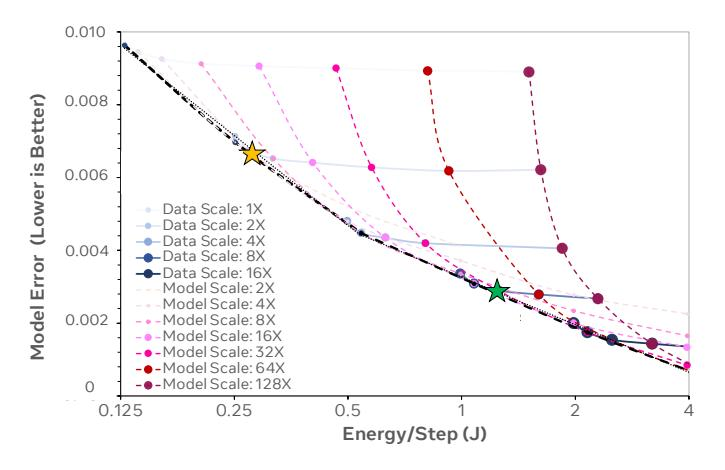

**Figure Description:**
The image is a graph with a title "Lower Better" at the top left corner. It appears to be a plot of some sort, possibly related to machine learning or data analysis given the terminology used. On the x-axis, there are numerical values ranging from 0.125 to 4, which likely correspond to different models or steps in an algorithm's process. These numbers could represent model scales, error rates, or other metrics relevant to the context of the graph.

On the y-axis, there are two sets of data represented by lines: one labeled "Data Scale: 1X," and another labeled "Data Scale: 2X." Each line has multiple points connected by straight segments, suggesting that these points might represent specific instances where the performance metric (likely energy) was measured for each scale factor.

The labels along the x-axis include various model scales such as "Model Scale: 8x," "Model Scale: 16x," etc., indicating that the graph compares the performance across different scaling factors within the models being evaluated. There are also asterisks (*), diamonds (♦), squares (□), triangles (△), circles (○), and stars (★) scattered throughout the graph, which may denote significant differences between certain pairs of data points.

In addition to the main axes, there are several smaller plots embedded within the larger graph. These smaller plots seem to show more detailed comparisons between different models or settings, but without additional information, it's difficult to determine their exact significance.

Overall, the graph seems to compare the performance of different models or configurations under varying conditions, using a metric that can be interpreted as lower better, meaning lower values indicate better performance according to the criteria set forth in the study. However, without further context, the precise nature of the data and its implications remain unclear.

Fig. 12. Model quality of recommendation use cases improves as we scale up the amount of data and/or the number of model parameters (e.g., embedding cardinality or dimension), leading to higher energy and carbon footprint. Maximizing model accuracy for the specific recommendation use case comes with significant energy cost — Roughly 4× energy saving can be achieved with only 0.004 model quality degradation (green vs. yellow stars).

#### APPENDIX

Despite the recent calls-to-action [28], [39], [40], [41], the overall community remains under-invested in research that aims at deeply understanding and minimizing the cost of AI. There are several factors that may have contributed to the current state of AI:

- Lack of incentives: Over 90% of the ML publications only focus on model accuracy improvements at the expense of efficiency [109]. Challenges10 incentivize investment into efficient approaches.
- Lack of common tools: There is no standard telemetry in place to provide accurate, reliable energy and carbon footprint measurement. The measurement methodology is complex factors, such as datacenter infrastructures, hardware architectures, energy sources, can perturb the final measure easily.
- Lack of normalization factors: Algorithmic progress in ML is often presented in some measure of model accuracy, e.g., BLEU, points, ELO, cross-entropy loss, but without considering resource requirement as a normalization factor, e.g., the number of
  - CPU/GPU/TPU hours used, the overall energy consumption and/or carbon footprint required.
- Platform fragmentation: Implementation details can have a significant impact on real-world efficiency, but best practices remain elusive and platform fragmentation prevents performance and efficiency portability across model development.

#### A. Data Utilization Efficiency

Figure 12 depicts energy footprint reduction potential when data and model scaling is performed in tandem. The x-axis

10Efficient Open-Domain Question Answering (https://efficientqa.github.io/), SustaiNLP: Simple and Efficient Natural Language Processing (https://site s.google.com/view/sustainlp2020/home), and WMT: Machine Translation Efficiency Task (http://www.statmt.org/wmt21/efficiency-task.html). represents the energy footprint required per training step whereas the y-axis represents model error. The blue solid lines capture model size scaling (through embedding hash scaling) while the training data set size is kept fixed. Each line corresponds to a different data set size, in an increasing order from top to bottom. The points within each line represent different model (embedding) sizes, in an increasing order from left to right. The red dashed lines capture data scaling while the model size is kept fixed. Each line corresponds to a different embedding hash size, in an increasing order from left to right. The points within each line represent different data sizes, in an increasing order from top to bottom. The dashed black line captures the performance scaling trend as we scale data and model sizes in tandem. This represents the energy-optimal scaling approach.

Scaling data sizes or model sizes independently deviates from the energy-optimal trend. We highlight two energy-optimal settings along the Pareto-frontier curve. The yellow star uses the scaling setting of *Data scaling 2*× and *Model scaling 2*× whereas the green star adopts the setting of *Data scaling 8*× and *Model scaling 16*×. The yellow star consumes roughly 4× lower energy as compared to the green star with only 0.004 model quality degradation in Normalized Entropy. Overall model quality performance has a (diminishing) power-law relationship with the corresponding energy consumption and the power of the power law is extremely small (0.002-0.004). This means achieving higher model quality through model-data scaling for recommendation use cases incurs significant energy cost.

#### *B. Efficient, Environmentally-Sustainable AI Systems*

Disaggregating Machine Learning Pipeline Stages: As depicted in Figure [3,](#page-2-1) the overall training throughput efficiency for large-scale ML models depends on the throughput performance of both *data ingestion and pre-processing* and *model training*. Disaggregating the data ingestion and pre-processing stage of the machine learning pipeline from model training is the de-facto approach for industry-scale machine learning model training. This allows training accelerator, network and storage I/O bandwidth utilization to scale independently, thereby increasing the overall model training throughput by 56% [\[44\]](#page-11-5). Disaggregation with well-designed check-pointing support [\[110\]](#page-12-30), [\[111\]](#page-12-31) improves training fault tolerance as well. By doing so, failure on nodes that are responsible for data ingestion and pre-processing can be recovered efficiently without requiring re-runs of the entire training experiment. From a sustainability perspective, disaggregating the data storage and ingestion stage from model training maximizes infrastructure efficiency by *using less system resources to achieve higher training throughput*, resulting in lower embodied carbon footprint. By increasing fault tolerance, the operational carbon footprint is reduced at the same time.

Fault-Tolerant AI Systems and Hardware: One way to amortize the rising embodied carbon cost of AI infrastructures is to extend hardware lifetime. However, hardware ages — depending on the wear-out characteristics, increasingly more errors can surface over time and result in *silent data* *corruption*, leading to erroneous computation, model accuracy degradation, non-deterministic ML execution, or fatal system failure. In a large fleet of processors, silent data corruption can occur frequently enough to have disruptive impact on service productivity [\[112\]](#page-12-32), [\[113\]](#page-13-4). Decommissioning an AI system entirely because of hardware faults is expensive from the perspective of resource and environmental footprints. System architects can design differential reliability levels for micro architectural components on an AI system depending on the ML model execution characteristics. Alternatively, algorithmic fault tolerance can be built into deep learning programming frameworks to provide a code execution path that is cognizant of hardware wear-out characteristics.

On-Device Learning: Federated learning and optimization can result in a non-negligible amount of carbon emissions at the edge, similar to the carbon footprint of training T ransformerBig [\[21\]](#page-10-20). Figure [11](#page-8-0) shows that the federated learning and optimization process emits non-negligible carbon at the edge due to both computation and wireless communication during the process. To estimate the carbon emission, we used a similar methodology to [\[114\]](#page-13-5). We collected the 90-day log data for federated learning production use cases at Facebook, which recorded the time spent on computation, data downloading, and data uploading per client device. We multiplied the computation time with the estimated device power and upload/download time with the estimated router power, and omitted other energy. We assumed a device power of 3W and a router power of 7.5W [\[115\]](#page-13-6), [\[114\]](#page-13-5). Model training on client edge devices is inherently less energy-efficient because of the high wireless communication overheads, sub-optimal training data distribution in individual client devices [\[114\]](#page-13-5), large degree of system heterogeneity among client edge devices, and highly-fragmented edge device architectures that make systemlevel optimization significantly more challenging [\[116\]](#page-13-7). Note, the wireless communication energy cost takes up a significant portion of the overall energy footprint of federated learning, making energy footprint optimization on communication important.

#### *C. Efficiency and Self-Supervised Learning*

*Self-supervised learning* (SSL) have received much attention in the research community in recent years. SSL methods train deep neural networks without using explicit supervision in the form of human-annotated labels for each training sample. Having humans annotate data is a time-consuming, expensive, and typically noisy process. SSL methods are typically used to train *foundation models* — models that can readily be finetuned using a small amount of labeled data on a down-stream task [\[117\]](#page-13-8). SSL methods have been extremely successful for pre-training large language models, becoming the de-facto standard, and they have also attracted great interest in computer vision.

When comparing supervised and self-supervised methods, there is a glaring trade-off between having labels and the amount of computational overhead involved in pre-training. For example, Chen et al. report achieving 69.3% top-1 validation accuracy with a ResNet-50 model after SSL pre-training for

1000 epochs on the ImageNet dataset and using the linear evaluation protocol, freezing the pre-trained feature extractor, and fine-tuning a linear classifier on top for 60 epochs using the full ImageNet dataset with all labels [\[118\]](#page-13-9). In contrast, the same model typically achieves at least 76.1% top-1 accuracy after 90 epochs of fully-supervised training. Thus, in this example, using labels and supervised training is worth a roughly 10× reduction in training effort, measured in terms of number of passes over the dataset.

Recent work suggests that incorporating even a small amount of labeled data can significantly bridge this gap. Assran et al. describe an approach called *Predicting view Assignments With Support samples* (PAWS) for semi-supervised pre-training inspired by SSL [\[119\]](#page-13-10). With access to labels for just 10% of the training images in ImageNet, a ResNet-50 achieves 75.5% top-1 accuracy after just 200 epochs of PAWS pre-training. Running on 64 V100 GPUs, this takes roughly 16 hours. Similar observations have recently been made for language model pretraining as well [\[120\]](#page-13-11).

Self-supervised pre-training potentially has advantages in that a single foundation model can be trained (expensive) but then fine-tuned (inexpensive), amortizing the up front cost across many tasks [\[117\]](#page-13-8). Substantial additional research is needed to better understand the cost-benefit trade-offs for this paradigm.