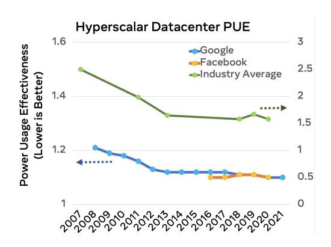
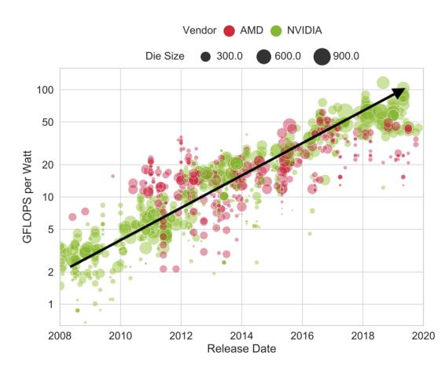
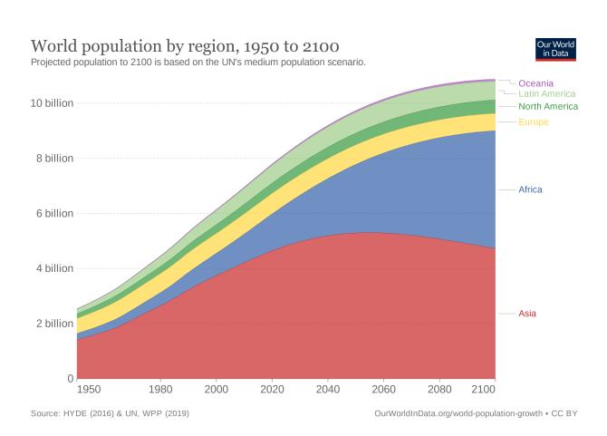

# SOCIO-TECHNOLOGICAL CHALLENGES AND OPPORTUNITIES: PATHS FORWARD

#### A PREPRINT

Carole-Jean Wu Facebook Srilatha Manne Facebook\* Parthasarathy Ranganathan Google Sarah Bird Microsoft Shane Greenstein Harvard University

#### ABSTRACT

Advancements in digital technologies have a bootstrapping effect. The past fifty years of technological innovations from the computer architecture community have brought innovations and orders-ofmagnitude efficiency improvements that engender use cases that were not previously possible – stimulating novel application domains and increasing uses and deployments at an ever-faster pace. Consequently, computing technologies have fueled significant economic growth, creating education opportunities, enabling access to a wider and more diverse spectrum of information, and, at the same time, connecting people of differing needs in the world together. Technology must be offered that is inclusive of the world's physical, cultural, and economic diversity, and which is manufactured, used, and recycled with environmental sustainability at the forefront. For the next decades to come, we envision significant cross-disciplinary efforts to build a circular development cycle by placing pervasive connectivity, sustainability, and demographic inclusion at the design forefront in order to sustain and expand the benefits of a technologically rich society. We hope this work will inspire our computing community to take broader and more holistic approaches when developing technological solutions to serve people from different parts of the world.

This article is intended to capture the ISCA panel on the Microprocessor 50: Societal Challenges (see <https://www.iscaconf.org/isca2021/program/>) from the lens of computer architects and the following discussions. This work represents the opinions of the authors and does not reflect the position of their respective companies.

\* Will be with Facebook; work started at Microsoft.

### Introduction

Digital technologies have had an undeniable influence on humanity's well-being, transforming all aspects of our lives. Underpinned by advances in process technology, computer architecture, software engineering, and artificial intelligence (AI), the rapid technological development of the past five decades has altered the way we learn, work, commute, shop, socialize, eat, relax, and even sleep, both directly and indirectly. At the personal level, every US household has an average of 25 connected devices such as cell phones, tablets, laptops, gaming consoles, wireless headphones, smart TVs, smart speakers, fitness trackers, and connected fitness machines [\[Deloitte, 2021\]](#page-7-0). Digital technologies have also impacted major aspects of services that we regularly use and rely upon. Amazon warehouses are equipped with over 200,000 robots in 2020 to boost operational efficiency [\[Ackerman, 2021\]](#page-7-1). AI-powered robots are a growing presence in the farming industry [\[Sheikh, 2020\]](#page-7-2). Medicine has been transformed by technological advances leading to the decoding of the humane genome, resulting in genetically targeted therapies that help cancer patients survive longer or even enter full remission [\[Hum, 2021\]](#page-7-3). Looking ahead, AI is showing great promise in solving the grand challenge in biology – the protein structure prediction problem – which can once again lead to revolutionary changes in the field of biological sciences [\[Jumper et al., 2021\]](#page-7-4).

Technology has also aided under-privileged and vulnerable groups in surprising ways. As an example, cell phones empower women in vulnerable situations to stay connected with the world, receive education and news, and establish businesses to support their families [\[Pathak, 2021\]](#page-7-5). Emerging technologies such as surveillance cameras enable authorities to respond to violence and curb crimes. Drones deliver life-saving medical supplies in rescues [\[Nyaaba and](#page-7-6) [Ayamga, 2021\]](#page-7-6) and robots are employed in field discovery where the environment is unsafe for humans [\[Arnold et al.,](#page-7-7) [2018\]](#page-7-7). The most recent example is the pandemic where digital technologies empowered society to stay connected and function effectively, and aided in disease tracking and drug discovery to limit the spread of the pandemic [\[Budd et al.,](#page-7-8) [2020,](#page-7-8) [Salathé et al., 2020,](#page-7-9) [Facebook AI, 2020\]](#page-7-10).

Advancements in digital technologies have a bootstrapping effect. The past fifty years of technological innovations from the computer architecture community have brought innovations and orders-of-magnitude efficiency improvements that engender use cases that were not previously possible – stimulating novel application domains and increasing uses and deployments at an ever-faster pace. Consequently, computing technologies have fueled significant economic growth, creating education opportunities, enabling access to a wider and more diverse spectrum of information, and connecting people of differing needs in the world together.

## Microprocessors at 50

Digital technologies have witnessed significant advancement over the past five decades. The first commercially-produced microprocessor – Intel 4004 – was manufactured in 10,000 nm process technology in 1971, and ran at 740kHZ with 2,250 transistors [\[Intel\]](#page-7-11). Fifty years later, the typical microprocessor is manufactured in a 5+ nm process technology and is capable of running at 5,000,000kHz (e.g., [\[Intel, 2019,](#page-7-12) [AMD, 2020\]](#page-7-13)) with more than 3.9 billion transistors. This is a more than 6,750 fold improvement in processor clock speed and 1.7 million times more transistors for microprocessors manufactured in 1971 than that in 2021.

Moore's law scaling underpins the evolution of microprocessors [\[Moore, 1965\]](#page-7-14). The steady doubling of transistor density enables miniaturization of computing systems, from large mainframes to personal computers and from mobile/smartphones to Internet of Things (IoTs) and AR/VR wearables. The *1990s* were the golden age of microprocessor innovations. Microarchitectural optimizations enabled impressive ILP scaling: most notably, in-order vs. out-of-order execution [\[Tomasulo, 1967,](#page-8-0) [Smith, 1982a,](#page-8-1) [Hwu and Patt, 1986\]](#page-8-2), branch predictors [\[Smith, 1981,](#page-8-3) [Lee and Smith, 1984,](#page-8-4) [Pnevmatikatos et al., 1993,](#page-8-5) [Yeh et al., 1993,](#page-8-6) [Jimenez and Lin, 2001\]](#page-8-7), caches [\[Smith, 1982b,](#page-8-8) [Hill, 1988,](#page-8-9) [Przybylski](#page-8-10) [et al., 1989,](#page-8-10) [Jouppi, 1990\]](#page-8-11), prefetchers [\[Baer and Chen, 1991,](#page-8-12) [Fu et al., 1992,](#page-8-13) [Falsafi and Wenisch, 2014\]](#page-8-14), single vs. simultaneous multithreading [\[Tullsen et al., 1995,](#page-8-15) [1996,](#page-8-16) [Nemirovsky and Tullsen, 2013\]](#page-8-17).

**Figure Description:**
The image is a line graph titled "Hyperscalar Datacenter PUE". It compares three different data center power usage effectiveness (PUE) metrics over time from 2007 to 2021. Each line represents a different metric: Google, Facebook, and Industry Average.

The vertical axis of the graph indicates that the y-values range from 1.4 to 3.6, with increments of 0.5. This suggests that the PUE for each category can vary between these two extremes.

On the horizontal axis, there are years ranging from 2007 to 2021, indicating a timeline of measurement or improvement.

Each line starts at the year 2007 and shows an overall trend towards lower PUEs as we move through the years. However, it's important to note that while all lines show improvements over time, the rate of improvement varies among them. For instance, the Google line consistently maintains the lowest PUE throughout the entire period shown. In contrast, the Facebook line fluctuates more than the other two but also generally decreases over time. The Industry Average line follows a similar pattern to the Facebook line but has higher starting points and ends up closer to the Facebook line by the end of the timeline.

Overall, the graph illustrates how the efficiency of using energy in data centers has improved over the past decade and a half, with Google leading the way in terms of efficiency.

Figure 1: PUE of hyperscalar datacenters, such as Google's, has improved from 1.21 (2008) to 1.10 (2021) [\[Google, a\]](#page-8-18) whereas the PUE of Facebook datacenters is 1.10 (2020) [\[Facebook\]](#page-8-19) and the average PUE for a typical data center in 2020 is 1.58 [\[Lawrence, 2019,](#page-8-20) [2020\]](#page-8-21).

In the *2000s*, microprocessors faced two significant challenges: the *memory wall* [\[Wulf and McKee, 1996\]](#page-8-22) and the *power wall* [\[Dennard et al., 1974,](#page-8-23) [Bohr, 2007\]](#page-8-24). While processor frequencies improved with Moore's law scaling, memory latency did not and memory subsystems increasingly gated performance. Furthermore, Dennard scaling came to an end and fine-grained, high power density thermal hot spots limited the performance of microprocessors. The Memory and Power walls subsequently drove decades of innovations in multi-core scaling [\[Olukotun et al., 2007\]](#page-8-25), memory consistency and cache coherence [\[Adve and Gharachorloo, 1996,](#page-8-26) [Hill, 1998,](#page-8-27) [Sorin et al.,](#page-9-0) [2011\]](#page-9-0), cache and memory hierarchy optimization [\[Qureshi et al.,](#page-9-1) [2007,](#page-9-1) [Jaleel et al., 2010,](#page-9-2) [Wu et al., 2011,](#page-9-3) [Balasubramonian et al.,](#page-9-4) [2011,](#page-9-4) [Sardashti et al., 2015,](#page-9-5) [Balasubramonian, 2019,](#page-9-6) [Jain and](#page-9-7) [Lin, 2019\]](#page-9-7), network-on-chip design and optimization [\[Dally](#page-9-8) [and Towles, 2001,](#page-9-8) [Wang et al., 2002,](#page-9-9) [Enright and Peh, 2009,](#page-9-10) [Jerger et al., 2017\]](#page-9-11), and power- and thermal-aware design and management [\[Brooks et al., 2000,](#page-9-12) [Brooks and Martonosi, 2001,](#page-9-13) [Skadron et al., 2003,](#page-9-14) [Kaxiras and Martonosi, 2008,](#page-9-15) [Själander](#page-9-16) [et al., 2014\]](#page-9-16).

During the same period, computations were migrating from client/personal devices to the cloud, demanding significant in-

vestment in large-scale data centers [\[Barroso and Hölzle, 2009\]](#page-9-17). The location of these data centers is dictated by a myriad of constraints – maximizing power and operational efficiency, proximity to population centers, weather conditions, local tax breaks – leading to some interesting tradeoffs in size, location, and ownership (on premise or cloud based) of the data centers. In 2019, urban data centers that optimize for service latency responsiveness are 26.7% smaller in size than the average data center operated by the major cloud providers [\[Greenstein and Fang, 2020\]](#page-9-18). Furthermore, between traditional and highly optimized hyperscale data centers, power usage effectiveness (PUE) has a stark difference – more than 40% higher efficiency for hyperscale data centers (Figure [1\)](#page-1-0). Going forward, the demand

on fast(er) service response and availability is playing an increasingly significant role on data center site selection and computing infrastructures connecting the edge and the cloud.

The *2010s* is the golden age of domain-specific architectures and specialized hardware, fueled by the rise of big data and AI [\[Esmaeilzadeh et al., 2011,](#page-9-19) [Jouppi et al., 2018\]](#page-9-20). The massive economic growth opportunities of AI have revolutionized the entire system stack design, resulting in hardware tailored to machine learning execution [\[Ovtcharov](#page-9-21) [et al., 2015,](#page-9-21) [Chen et al., 2016,](#page-9-22) [Jouppi et al., 2017,](#page-9-23) [Fowers et al., 2018,](#page-10-0) [Shao et al., 2019,](#page-10-1) [Mattson et al., 2020,](#page-10-2) [Henry et al.,](#page-10-3) [2020,](#page-10-3) [Reddi et al., 2021,](#page-10-4) [Anderson et al., 2021,](#page-10-5) [Jang et al., 2021,](#page-10-6) [Thompto et al., 2021,](#page-10-7) [NVIDIA\]](#page-11-0)from megawatt data center-scale infrastructures, to tens of watts inference engines, to micro-watt microcontrollers at the edge. Building on top of domain-specific characteristics, further system efficiency can be extracted with a rich array of application-specific accelerators at the cloud scale [\[Taylor et al., 2020,](#page-11-1) [Ranganathan et al., 2021\]](#page-11-2).

The last fifty years of digital products have been driven by a combination of market innovation and user needs. In some cases, scientific curiosity, coupled with a market need for specialty medical drugs drove innovations such as the pursuit of the human genome. In other cases, innovations created a market such as the case for smartphones. The availability of smartphones led to further innovations and massive disruptions via *sharing economy* companies such as Uber and AirBnB [\[Hamari et al., 2016\]](#page-11-3). None of this would have been feasible without fundamental innovation in process technology, hardware and software design, and a laser focus on efficiency (Figure [1\)](#page-1-0), optimization (Figure [2\)](#page-2-0), and cost reduction. Altogether, digital technology advancement has led to *efficiencies of scale* propelling decades of economic growth.

The narrow focus on marketability, efficiency, and disruptive innovation has also resulted in many challenging, and sometimes unexpected, societal issues. Examples include widening disparity and inequity of access to digital technologies, spread of disinformation and misinformation in online platforms, privacy and security violations at both the personal and political level, and propagation of human bias into AI training and use cases at-scale [\[Simons and](#page-11-5) [Jones, 2012,](#page-11-5) [Abelson et al., 2015,](#page-11-6) [Gervais et al., 2016,](#page-11-7) [Ahmed et al., 2017,](#page-11-8) [Whittaker et al., 2018,](#page-11-9) [Speicher et al.,](#page-11-10) [2018,](#page-11-10) [Chouldechova et al., 2018,](#page-11-11) [Ekstrand et al., 2018,](#page-11-12) [Selbst et al., 2019,](#page-11-13) [Ali et al., 2019,](#page-11-14) [Babaei et al., 2019,](#page-11-15) [Crawford et al., 2019,](#page-11-16) [Papakyriakopoulos et al., 2020,](#page-12-0) [Park et al., 2021,](#page-12-1) [Bender et al., 2021,](#page-12-2) [Kleinberg and](#page-12-3) [Raghavan, 2021\]](#page-12-3). In addition, the information and computing technology sectors consume a significant amount of global electricity, water, and natural resources, leading to paramount carbon and environmental footprint [\[Jain](#page-12-4) [and Wullert, 2002,](#page-12-4) [Strubell et al., 2019,](#page-12-5) [Manne, 2020,](#page-12-6) [Wu and Gupta, 2021,](#page-12-7) [Gupta et al., 2021,](#page-12-8) [Crawford et al.,](#page-12-9)

**Figure Description:**
The image is a line graph with a scatter plot overlaying it, which appears to be tracking some sort of data release or product availability across different vendors over time. On the x-axis, there are years ranging from 2008 to 2020, indicating that the data covers a period of approximately twelve years. There are four lines representing different vendor types: AMD (in red), NVIDIA (in black), NVDIA (in green), and an unspecified "Vendor" (in blue). Each line represents a different category of data size, as indicated by the legend at the top left corner of the graph. These categories include "Die Size," "300.0," "600.0," and "900.0."

The y-axis is labeled "Watts per GFLOPs," suggesting that the graph measures computational efficiency in terms of wattage required for each gigaflop operation. This metric is commonly used in computing hardware to evaluate performance and energy consumption.

On the right side of the graph, there's a large spike in the value of "Watts per GFLOPs" around 2014, which corresponds to the year when the first major release date is marked on the horizontal axis. After this point, all lines show a significant decrease in the measured metric, implying improved efficiency in the products released by these vendors.

In summary, the graph illustrates how the computational efficiency of products from various vendors has evolved over time, showing a notable improvement after a specific release date in 2014.

Figure 2: As a result of Moore's law scaling and architectural optimization, GPU theoretical performance (GFLOPs) per watt doubles every 3-4 years [\[Sun et al., 2019\]](#page-11-4).

[2021\]](#page-12-9). Digital technology is an integral part of human existence. As the field matures and as the world faces dire challenges from climate change to societal and political upheavals, a deliberate approach is required to technological innovation that centers on a positive societal impact while serving the needs of a market economy.

# Looking to the Future

Predicting the future is always difficult. How many of us could have predicted that the technology depicted in futuristic TV shows from five decades ago such as Star Trek would be commonplace today (cell phones, AI, voice recognition to name a few)? However, what is possible to foretell are the following:

- Pervasive Connectivity: the internet and the technology enabling it will become even more fundamental to everyday life, requiring that information and communication technology infrastructure, just like power grids, be both secure and resilient;
- Sustainability: Environmental pollution, resource depletion and climate change will dominate how products are designed, produced, consumed, and recycled. Systems must be manufactured with less planetary impact, use less energy while in operation, and produce less e-waste at the end of life; and
- Demographic Inclusion: Massive demographic upheavals resulting in an aging population in most of the world and rising population centers in Sub-Saharan Africa will influence what products are created and for whom, and where technology is designed and deployed in the future.

Pervasive Connectivity. In 2021, approximately 65% of the world's population has access to the internet [\[Lin,](#page-12-10) [2021\]](#page-12-10), and this is expected to improve moving forward. Seamless connectivity will be required for everyday activities from ordering groceries to driving your car. There are advantages to connectivity from more efficient driving and less food waste, easy access to educational resources, and the ability to work remotely. However, what this also implies is that our lives and livelihoods will be inexorably linked to the accessibility, privacy, security, and resilience of the IT infrastructure.

Reliable internet access for the world's population is an essential requirement of pervasive connectivity. Despite the positive societal and economical impact, at-scale power delivery and networking infrastructure development has proven to be costly and highly geographically-constrained. According to an analysis from the FCC, at least 18 million Americans did not have stable broadband in 2020 [\[Wheeler, 2020\]](#page-12-11), and many who have access may not be able to afford it. According to a recent UN report, two-thirds of school age children do not have access to the internet in their home [\[unicef, 2020\]](#page-12-12). Diverse technology innovations are particularly needed to increase information accessibility and to connect people of differing needs in the world together in a resilient manner. Microsoft Airband [\[Microsoft,](#page-12-13) [a\]](#page-12-13) aims to expand broadband access in rural parts of the United States while Google Loon [\[Loon\]](#page-12-14) and Facebook Aquila [\[Wikipedia\]](#page-12-15) provide affordable high-speed internet to under-connected communities by overcoming physical barriers with innovative technology solutions. The recent success of placing internet communication satellites in low Earth orbit opens the door to tremendous opportunities for providing internet access to populations in challenging geographic locations [\[Starlink\]](#page-12-16). While satellite communication removes the geographical and political boundaries, it can accelerate the spread of (mis)information. Thus, as technologies continue to enable pervasive connectivity at scale, we must take a deliberate approach to develop technology solutions responsibly.

Along with pervasive connectivity comes the requirements for security and privacy given the prevalence of ransomware attacks and ongoing privacy hacks from both private groups and nation states. Many aspects of our public and private lives will be online and accessible to bad actors, and the internet and the technology it enables will continue to be susceptible without strong security and privacy measures in place from the top of the software stack to the underlying hardware running the code [\[Lipp et al., 2018,](#page-12-17) [Kocher et al., 2019\]](#page-12-18).

The IT infrastructure, just like in other critical infrastructure such as telecommunication and power delivery, will require backup and recovery mechanisms in order to minimize or eliminate downtime. These already exist in cloud data centers with examples such as redundant storage [\[Microsoft, 2021a\]](#page-12-19) and network [\[Microsoft, 2021b\]](#page-12-20), and backup batteries and generators. However, redundancy can require significant additional hardware and network bandwidth which inflates the cost of the overall cloud infrastructure.

Recent climate events are pushing the issue of resiliency to the forefront. In the Texas power outages of 2021, many top-tier data centers were able to continue operations using diesel backup generators. However, there is a limit to how long backup systems can operate given the finite amount of fuel onsite and weather conditions making it difficult to transport more fuel to the data center [\[Sverdlik, 2021\]](#page-12-21). As catastrophic weather events become more common and last longer due to climate change, even the largest data centers may have trouble [\[Department of Energy, 2019\]](#page-13-0). For instance, the latest fires in Oregon brought down major power grid infrastructure that connects the grids of California to Oregon at the same time as a heat wave resulted in a need for additional power for cooling [\[Roth, 2021\]](#page-13-1). California narrowly escaped rolling blackouts this time, but these events will continue to increase in intensity and frequency as hot and dry conditions lengthen and strengthen the fire season, reduce hydro-electric power due to a lack of water, and increase the need for power for human comfort and survival.

For IT infrastructures of the future, a one-size-fits-all solution may not work either for the type of data center or for the services that it provides. Large data centers that require many megawatts to operate may not be viable during a blackout with limited power and where critical operations such as hospitals are given priority. Smaller data centers may be more resilient either with backup generators or using a local micro-grid to run operations when the main grid is down. On the service side, some applications may be more tolerant of outages than others. Hence, with a limited power budget, application availability should be tiered during critical times. Other solutions include making applications resilient by design or more amenable to migration to a non-impacted data center given enough warning before catastrophic events occur [\[Hornsby, 2018,](#page-13-2) [Google Cloud Architecture Center\]](#page-13-3).

Designing for resilience addresses issues that are not just related to resilience under climate duress but also solutions that are tolerant of different geographies, power and networking infrastructures. In order to achieve pervasive connectivity across the world, IT infrastructure must be available across developed and developing regions. In Africa, for example, it is difficult and expensive to develop a power grid that can serve such a large continent. Renewables, however, have the benefit of being portable and scalable, and are powering much of Africa's latest power advances, with off-grid and micro-grid renewable energy solutions serving poorer and/or non-centralized communities [\[The World Bank, 2020\]](#page-13-4). Data centers serving these regions may also have to rely on micro-grids running on renewable energy that fluctuate in their capacity based on the weather. Hence, rather than designing for a resilient and consistent power grid, IT

infrastructure may be better served by (co-)designing agile applications and data centers, such as [\[Íñigo Goiri et al.,](#page-13-5) [2015,](#page-13-5) [Radovanovic et al., 2021,](#page-13-6) [Lin et al., 2021,](#page-13-7) [Zhang et al., 2021\]](#page-13-8), that implicitly assume power fluctuations and variability.

Achieving pervasive connectivity in the presence of resiliency, security, and privacy requirements can be challenging given the interrelated nature of the problems. For instance, current approaches to achieving resilient computing often rely on replication and redundancy which not only increases cost but also enlarges the surface of security and privacy preservation. Migrating applications to another region, which may be necessary due to power constraints, can expose data to further security threats. To retain physical security of data, applications may be hosted in limited geographical regions but this can increase application vulnerability to catastrophic events. In addition, secure and resilient computing infrastructures can often come with significant environmental implications. Hence, any computing infrastructure solutions must be cognizant of the multifaceted nature of the problems being addressed.

Sustainability. Resource limitations, climate change, water depletion, electronic waste, ecosystem damage, and environmental racism are just a few of the topics under the larger sustainability umbrella. There is increased focus on these topics from both industrial and political institutions. All major technology companies have pledged to reduce or eliminate their carbon footprint in the next decade by reducing the environmental impact associated with manufacturing and using their products. Examples of such commitments are Facebook achieving NetZero in operational emissions in 2020 and across its value chain by 2030 [\[Facebook\]](#page-13-9), Apple's pledge for 100% carbon neutral supply chain by 2030 [\[Apple\]](#page-13-10), Microsoft's goal of being carbon negative by 2030 [\[Smith\]](#page-13-11), and Google's aim of 24x7 carbon free data centers [\[Google, b\]](#page-13-12). In 2020, Amazon, Google, Facebook, and Microsoft were the top four technology companies that purchased significant renewable energy capacities, accounting for 30% of the cumulative total from corporations globally [\[Schechner, 2021\]](#page-13-13). In addition, countries and trading zones are legislating carbon emission requirements. China has committed to be carbon free by 2060 [\[Myers, 2020\]](#page-13-14) and the EU has committed to cut carbon emissions by 55% by 2030 [\[BBC, 2021\]](#page-13-15).

Sustainability targets and the associated regulations will continue to increase, and hardware must be manufactured with less planetary impact, use less energy while in operation, and produce less e-waste at the end of life [\[Orcuttarchive, 2015,](#page-13-16) [Chang et al., 2017\]](#page-13-17). Existing practices such as the move to hyperscale data centers have already reduced IT's carbon footprint by consolidating and sharing computing resources, and operating those resources more efficiently (Figure [1\)](#page-1-0) – AWS [\[Amazon, 2019\]](#page-13-18), Azure [\[Microsoft, 2020\]](#page-13-19), Google cloud [\[Evans and Gao, 2016\]](#page-13-20), and Facebook datacenter infrastructures [\[Lee and Rowe, 2020\]](#page-14-0). In fact, data center electricity consumption has slowed down significantly. The total energy consumption of the US data centers increased by about 4% from 2010-2014, compared with the estimated 24% increase from 2005-10 and nearly 90% increase from 2000-05 [\[Masanet et al., 2020\]](#page-14-1). Furthermore, despite the increase in the global data center energy use, the number of users benefiting from the cloud infrastructure have increased even more—from 2010-18, the global data center compute instances increased by 5.5 times with an estimated 6% increase in the global data center energy use.

However, more can be done – *we must go beyond efficiency optimization and build a sustainable ecosystem to achieve environmentally-sustainable computing*. For instance, develop expandable hardware and software stack that facilitate significantly longer lifetimes than the current averages of less than 3 years for cell phones [\[Cordella et al., 2020\]](#page-14-2) and 4 to 5 years for servers [\[Ascierto and Lawrence, 2020\]](#page-14-3). Modular system design will enable component-level upgrades without having to decommission the system at its entirety, reducing overall electronic waste and the environmental footprint [\[Fairphone\]](#page-14-4). Other actions being discussed or implemented require manufacturers to make their systems more repairable, resulting in increased product lifetime [\[Wiens and Gordon-Byrne, 2017,](#page-14-5) [Alsever, 2021\]](#page-14-6). Another option is to reduce the number of devices in an average household. In the US, for example, the average household is equipped with an average of 25 connected devices [\[Deloitte, 2021\]](#page-7-0). In many cases, smartphones might be powerful enough for the task, but a tablet or laptop is needed for a viable keyboard or a larger viewing platform. Some of these additional devices could be replaced with a virtual reality or augmented reality solution that is both portable and can provide virtual keyboards and visual clarity without requiring additional hardware. To achieve an environmentally sustainable computing future, we will have to build a circular economy for computing that supports the design principle of *reduce*, *reuse*, *repair*, and *recycle*. These and other potential solutions likely require a complete redesign of the software and hardware stacks both at the edge, within the cloud, and in the edge-cloud collaborative execution environment, in order to provide resilient, long lasting, innovative solutions.

Making technology more sustainable is only one part of the technical challenge. There is another side to the story—there are significant sustainability benefits resulting from computing technology. Programs, such as Farm Beats [\[Microsoft,](#page-14-7) [2015\]](#page-14-7), address how to optimize operations on a farm using technology that is inexpensive and readily available to people in rural areas. Food production accounts for 19% of the world's carbon emissions, and producing food more efficiently and with less toxicity has long term benefits for the world [\[Gates, 2021\]](#page-14-8). For the residential sector in the US, space heating and cooling contributed to over 40% of the total electricity consumption [\[U.S. Energy Information](#page-14-9)

[Adminstration\]](#page-14-9). This is where smart home IoT devices, such as Nest, can have an impact. AI is used to discover new electrocatalysts for more efficient and scalable ways to store and use renewable energy [\[Zitnick et al., 2020\]](#page-14-10) while also being used to predict renewable energy availability ahead of actual generation to better utilize the energy [\[Elkin and](#page-14-11) [Witherspoon\]](#page-14-11). Another example is the current Covid outbreak. As horrendous as the outbreak has been and continues to be, technology has enabled a portion of the economy to continue to operate even as employees work remotely. In addition, the global carbon emissions for 2020 dropped by 6.4% with vehicle transportation in the US accounting for a portion of the global reduction [\[Tollefson, 2021\]](#page-14-12). Looking forward, information technology can improve efficiencies in practically every sector, from manufacturing to food production to transportation to controlling the climate in our homes and offices. Although there is a carbon cost associated with manufacturing and operating the IT ecosystem, this cost must be evaluated holistically [\[Chang et al., 2010,](#page-14-13) [Bardon et al., 2020,](#page-14-14) [Gupta et al., 2021,](#page-12-8) [Patterson et al., 2021\]](#page-14-15) in light of the benefits such an ecosystem can provide in other domains [\[Hager et al., 2019,](#page-14-16) [Tomasev et al., 2020,](#page-14-17) [Mulhern,](#page-14-18) [2021,](#page-14-18) [United Nation, 2021\]](#page-14-19).

Demographic Inclusion. Recent data has pointed to significant demographic changes that will be occurring by the year 2100 [\[Vollset et al., 2020\]](#page-14-20). These include a radically declining and/or aging population in Europe, North America and Asia, and an increasing population of younger workers in Sub-Saharan Africa. Figure [3](#page-5-0) shows one population projection using data from the United Nations [\[Roser, 2019\]](#page-15-0), indicating flattening or decreasing populations in most of the world except for Africa. The population decline is strongly correlated with an improved quality of life and educational achievement of women – much of which is being facilitated by technologically engendered developments such as portable devices and the internet – along with access to reproductive services. This trend holds regardless of the country, culture, or religion. These demographic changes will have a seismic impact on all societies, and will also dominate *what* and *where* technology is designed and deployed, respectively, in the future.

For technology to be truly inclusive in a fully-connected world, it must be available and usable for *everyone* – regardless of physical capabilities, geographic restrictions, or economic constraints. With the projected demographic changes, assistive technologies to address the needs of an aging population with physical restrictions will be essential for enhancing an individual's ability to be a viable and contributing member of society.

There is a rich history of intersection between assistive technology and everyday products. Word prediction was used as an assistive technology aid for individuals with physical or developmental difficulties before becoming more mainstream [\[Jacobs, 2015\]](#page-15-1). Close captioning helps the hearing impaired, but it is also used by people with average hearing to capture the conversation in a noisy environment or to help with accents in the dialogue. The reverse is also true – some of the most innovative technologies in the last few years are also inclusive of people with physical limitations. Smart speakers, such as Siri or Alexa, enable people with limited sight or physical mobility to communicate via verbal commands. Individuals with hearing issues can use their Apple AirPods as basic hearing aids [\[Haselton, 2019\]](#page-15-2), and people with average hearing can use AI-enabled voice assistants to eliminate background noise and focus on the conversation at hand [\[Nachmani et al., 2020\]](#page-15-3). For the sight impaired, virtual reality glasses are improving the eyesight of patients with degenerative eye disease [\[Fearn, 2020\]](#page-15-4).

**Figure Description:**
The image is a graph titled "World population by region, 1950 to 2100". It shows projected population based on UN data for different regions of the world: Africa, Asia, Latin America, North America, Europe, Oceania, and the rest of the world (ROW). Each region's population projection is represented as a colorful bar chart with numerical values indicating the size of each population segment over time from 1950 to 2100.

The bars are arranged vertically along an x-axis that represents years, starting from 1950 at the bottom left corner and ending at 2100 at the top right corner. Alongside the bars, there are labels corresponding to each region, such as 'Africa', 'Asia', etc., which help identify the respective populations.

At the top of the graph, there is additional information stating "Projected population to 2100 is based on the UN’s medium population scenario." This indicates that the projections shown are not actual figures but rather estimates made by the United Nations.

In the lower right corner, there is a source citation that reads "Source: HYDE (2016 & UN WPP) 2019", suggesting where the underlying data or methodology comes from. Additionally, there is a disclaimer noting that the growth rates used may vary depending on assumptions about future fertility, mortality, migration, and other demographic factors.

Overall, the image provides a visual representation of global population trends across various geographical regions over more than six decades.

Figure 3: Population growth estimation based on United Nations medium growth projections [\[Roser, 2019\]](#page-15-0).

The virtual office technology and work culture developed during the Covid pandemic will continue to benefit individuals with physical limitations who may be unable to travel to work. Similarly, with the largest population of young workers residing in Africa over the next decades, innovative virtual office technology that can create seamless cohesion across geographies and cultures will be critical to economic success. Looking to the future, there is a clear demand for high-quality virtual reality experience in the first-person perspective. However, realizing smooth virtual space experience requires disruptive technology innovations – hardware architectures beyond Von Neumann, high pixel density displays [\[Ghosh et al., 2016,](#page-15-5) [Kubota, 2020\]](#page-15-6), near/in-sensor computing [\[Kodukula et al., 2021\]](#page-15-7), flexible electronics [\[MacKenzie and Ho, 2015\]](#page-15-8), or even brain-computer interface solutions [\[Brunner et al., 2011,](#page-15-9) [Karageorgos](#page-15-10) [et al., 2020\]](#page-15-10).

Another requirement of inclusive technology, especially in light of projected demographic changes, is that it must operate across different geographic boundaries. In 2021, much of modern technology assumes some degree of development

and infrastructure, whether it be availability of the latest computing systems, broadband access, cell towers or power sources. However, much of the current world, including parts of developed countries, do not currently have unfettered access to these facilities. Even more daunting, approximately 770 million people, or about 1 out of 10 people in the world, do not have access to a stable supply of electricity [\[International Energy Agency\]](#page-15-11).

In order to meet the upcoming needs of the world, technological growth and resources must focus on under-served areas. This includes developing data centers for regions that may not have a resilient power infrastructure or an infrastructure that is based on local renewable energy sources and does not tap into a regional grid. IT devices must be operable under adverse conditions where the local network and/or power may not be available 24/7 or varies based on external conditions [\[Isaacman and Martonosi, 2011,](#page-15-12) [Hester et al., 2013,](#page-15-13) [Lucia et al., 2017,](#page-15-14) [Saleem et al., 2020\]](#page-15-15). For instance, devices need to operate for days without a recharge or must operate locally until wireless or broadband is available [\[Yetim and Martonosi, 2015\]](#page-15-16) to ensure delay tolerance while maintaining user experiences. Energy storage technology plays a crucial role to smooth the intermittent nature of renewable energy generation but the cost must be significantly improved for practical deployment [\[Plumer, 2021\]](#page-15-17). And, for technology to be truly inclusive, the way AI technologies are developed and used must be human-centered, driven by the cultural and demographic differences in the population and with pro-social goals [\[Stray, 2021\]](#page-15-18). Furthermore, given its increasingly large impact on the society, AI must be developed with deliberation to construct fairer and more inclusive decisions and, at the same time, it must be adopted responsibly [\[Askell et al., 2019,](#page-15-19) [NIST, 2021\]](#page-15-20). AI-powered products must be transparent with users on how data is gathered, used, and stored, and with controls to disable it [\[IBM,](#page-15-21) [Microsoft, b,](#page-15-22) [Google, c,](#page-16-0) [Facebook,](#page-16-1) [DOD\]](#page-16-2).

Finally, any IT technology must be economically-accessible to most of the world's population. Unfortunately, even the most basic form of computing devices, a cell phone, is prohibitively expensive for much of the world. According to the Alliance for Affordable Internet, nearly 2.5 billion people live in countries where a basic cell phone would cost nearly a quarter or more of the average monthly income [\[Roser, 2020\]](#page-16-3). Making the internet available to everyone will not solve the problem if the devices commonly used to access the internet are a luxury item for the world's poor [\[Naseem et al.,](#page-16-4) [2020\]](#page-16-4). In addition, many of the devices currently being used are inexpensive basic phones. Hence, solutions must be designed for "dumb" phones in order to reach the poorest communities. Even if users eventually have smartphones, data rates and lack of free wifi will limit the utility of data-heavy applications. Without reasonable device and application availability for the poorest communities, reaching the goal of pervasive connectivity will be difficult if not impossible and the digital divide will continue to widen between the rich and the poor. And, all technological solutions come with environmental impact that will inadvertently impact the marginalized communities the most. Thus, when developing technological solutions, we must keep in mind *why* products are created and *for whom*, and *where* technology is designed and deployed, such that we consciously build environmentally-sustainable, socially-responsible, inclusive technologies for the next decades to come.

#### Conclusion

Predicting the innovations of the future is a difficult if not impossible task. However, the political, societal, and environmental challenges the world faces are clear, and technology can play a significant role in helping societies adapt and thrive. The problems and solutions in the three domains of pervasive connectivity, sustainability, and inclusion are interconnected and must be addressed holistically. For instance, adapting the IT infrastructure to climate change must not in turn make climate change worse. Making innovative devices and software to address the needs of an aging population does not mean that poorer populations in other regions can be ignored. And population decline does not fully address sustainability concerns – as standard of living improves with the help of technology, the per-capita environmental footprint of the population also increases [\[O'Neill et al., 2018\]](#page-16-5). Technology must be offered that is inclusive of the world's physical, cultural, and economic diversity, and which is manufactured, used, and recycled with environmental sustainability at the forefront. We hope to inspire our architecture community to take broader and more holistic approaches when developing technologies which include a deeper understanding of the biological, societal, cultural, environmental, political, and economic implications of future technological innovations. To summarize:

- Build resilient, secure infrastructures software, hardware, and everything in-between for the computing spectrum of systems at all sizes and scales.
- Design for the entire system life cycle from manufacturing to end-of-life and for the entire software development cycle from experimentation to deployment. Build environmentally-sustainable systems, software, and algorithms – beyond energy efficiency.
- Broaden the scope of technologies to serve people from different parts of the world and with differing needs by enabling equitable access to technology and the rich economic opportunities it presents.

For the next decades to come, we envision significant cross-disciplinary efforts to build a circular development cycle by placing *pervasive connectivity*, *sustainability*, and *demographic inclusion* at the design forefront in order to sustain and expand the benefits of a technologically rich society.

#### Acknowledgement

We would like to thank Doug Carmean, David Brooks, and Lizy John for their insightful feedback on this work.

#### References

Deloitte. How the pandemic has stress-tested the crowded digital home.

[https://www2.deloitte.com/content/dam/insights/articles/6978\\_](https://www2.deloitte.com/content/dam/insights/articles/6978_TMT-Connectivity-and-mobile-trends/DI_TMT-Connectivity-and-mobile-trends.pdf)

[TMT-Connectivity-and-mobile-trends/DI\\_TMT-Connectivity-and-mobile-trends.pdf](https://www2.deloitte.com/content/dam/insights/articles/6978_TMT-Connectivity-and-mobile-trends/DI_TMT-Connectivity-and-mobile-trends.pdf), 2021.

Evan Ackerman. What's Going on With Amazon's "High-Tech" Warehouse Robots?

[https://spectrum.ieee.org/automaton/robotics/industrial-robots/](https://spectrum.ieee.org/automaton/robotics/industrial-robots/whats-going-on-with-amazons-hightech-warehouse-robots)

[whats-going-on-with-amazons-hightech-warehouse-robots](https://spectrum.ieee.org/automaton/robotics/industrial-robots/whats-going-on-with-amazons-hightech-warehouse-robots), June 2021.

Knvul Sheikh. A Growing Presence on the Farm: Robots.

<https://www.nytimes.com/2020/02/13/science/farm-agriculture-robots.html>, February 2020.

How the Human Genome Project shook the world of cancer research. [https://www.icr.ac.uk/news-features/](https://www.icr.ac.uk/news-features/latest-features/how-the-human-genome-project-shook-the-world-of-cancer-research) [latest-features/how-the-human-genome-project-shook-the-world-of-cancer-research](https://www.icr.ac.uk/news-features/latest-features/how-the-human-genome-project-shook-the-world-of-cancer-research), February 2021.

John Jumper, Richard Evans, Alexander Pritzel, Tim Green, Michael Figurnov, Olaf Ronneberger, Kathryn Tunyasuvunakool, Russ Bates, Augustin Žídek, Anna Potapenko, Alex Bridgland, Clemens Meyer, Simon A. A. Kohl, Andrew J. Ballard, Andrew Cowie, Bernardino Romera-Paredes, Stanislav Nikolov, Rishub Jain, Jonas Adler, Trevor Back, Stig Petersen, David Reiman, Ellen Clancy, Michal Zielinski, Martin Steinegger, Michalina Pacholska, Tamas Berghammer, Sebastian Bodenstein, David Silver, Oriol Vinyals, Andrew W. Senior, Koray Kavukcuoglu, Pushmeet Kohli, and Demis Hassabis. Highly accurate protein structure prediction with alphafold. *Nature*, 2021.

Sushmita Pathak. India's All-Female News Outlet Battles Sexism, Caste — And Hits The Silver Screen. [https://www.npr.org/sections/goatsandsoda/2021/04/04/980097004/](https://www.npr.org/sections/goatsandsoda/2021/04/04/980097004/indias-lowest-caste-has-its-own-news-outlet-and-shes-in-charge) [indias-lowest-caste-has-its-own-news-outlet-and-shes-in-charge](https://www.npr.org/sections/goatsandsoda/2021/04/04/980097004/indias-lowest-caste-has-its-own-news-outlet-and-shes-in-charge), April 2021.

Albert Apotele Nyaaba and Matthew Ayamga. Intricacies of medical drones in healthcare delivery: Implications for africa. *Technology in Society*, 66:101624, 2021.

Ross Arnold, Hiroyuki Yamaguchi, and Toshiyuki Tanaka. Search and rescue with autonomous flying robots through behavior-based cooperative intelligence. *Journal of International Humanitarian Action*, 3, 12 2018.

Jobie Budd, Benjamin Miller, Erin Manning, Vasileios Lampos, Mengdie Zhuang, Michael Edelstein, Geraint Rees, Vincent Emery, Molly Stevens, Neil Keegan, Michael Short, Deenan Pillay, Ed Manley, Ingemar Cox, David Heymann, Anne Johnson, and Rachel McKendry. Digital technologies in the public-health response to covid-19. *Nature Medicine*, 26:1–10, 08 2020.

Marcel Salathé, Christian L. Althaus, Nanina Anderegg, Daniele Antonioli, Tala Ballouz, Edouard Bugnion, Srdjan Capkun, Dennis Jackson, Sang-Il Kim, James R. Larus, Nicola Low, Wouter Lueks, Dominik Menges, Cédric ˇ Moullet, Mathias Payer, Julien Riou, Theresa Stadler, Carmela Troncoso, Effy Vayena, and Viktor von Wyl. Early evidence of effectiveness of digital contact tracing for sars-cov-2 in switzerland. 2020.

Facebook AI. Using AI to help health experts address the COVID-19 pandemic. [https:](https://ai.facebook.com/blog/using-ai-to-help-health-experts-address-the-covid-19-pandemic/) [//ai.facebook.com/blog/using-ai-to-help-health-experts-address-the-covid-19-pandemic/](https://ai.facebook.com/blog/using-ai-to-help-health-experts-address-the-covid-19-pandemic/), 2020.

Intel. The Story of the Intel 4004.

<https://www.intel.co.uk/content/www/uk/en/history/museum-story-of-intel-4004.html>.

Intel. Intel Core i9-9900KS Processor. [https://ark.intel.com/content/www/us/en/ark/products/192943/](https://ark.intel.com/content/www/us/en/ark/products/192943/intel-core-i9-9900ks-processor-16m-cache-up-to-5-00-ghz.html) [intel-core-i9-9900ks-processor-16m-cache-up-to-5-00-ghz.html](https://ark.intel.com/content/www/us/en/ark/products/192943/intel-core-i9-9900ks-processor-16m-cache-up-to-5-00-ghz.html), 2019.

AMD. AMD Ryzen 9 5950X Desktop Processors.

<https://www.amd.com/en/products/cpu/amd-ryzen-9-5950x>, 2020.

Gordon E. Moore. Cramming more components onto integrated circuits. *Electronics*, 1965.

R. M. Tomasulo. An efficient algorithm for exploiting multiple arithmetic units. *IBM Journal of Research and Development*, 11(1), 1967.

James E. Smith. Decoupled access/execute computer architectures. In *Proceedings of the 9th Annual Symposium on Computer Architecture*, page 112–119, 1982a.

W. Hwu and Y. N. Patt. Hpsm, a high performance restricted data flow architecture having minimal functionality. In *Proceedings of the 13th Annual International Symposium on Computer Architecture*, page 297–306, 1986.

James E. Smith. A study of branch prediction strategies. In *Proceedings of the 8th Annual Symposium on Computer Architecture*, page 135–148, 1981.

Lee and Smith. Branch prediction strategies and branch target buffer design. *Computer*, 17(1):6–22, 1984.

Dionisios N. Pnevmatikatos, Manoj Franklin, and Gurindar S. Sohi. Control flow prediction for dynamic ilp processors. In *Proceedings of the 26th Annual International Symposium on Microarchitecture*, page 153–163, 1993.

Tse-Yu Yeh, Deborah T. Marr, and Yale N. Patt. Increasing the instruction fetch rate via multiple branch prediction and a branch address cache. In *Proceedings of the 7th International Conference on Supercomputing*, page 67–76, 1993.

D.A. Jimenez and C. Lin. Dynamic branch prediction with perceptrons. In *Proceedings of the Seventh International Symposium on High-Performance Computer Architecture*, 2001.

Alan Jay Smith. Cache memories. *ACM Computing Surveys*, 14:473–530, 1982b.

M.D. Hill. A case for direct-mapped caches. *Computer*, 21(12), 1988.

S. Przybylski, M. Horowitz, and J. Hennessy. Characteristics of performance-optimal multi-level cache hierarchies. *Proceedings of the 16th Annual International Symposium on Computer Architecture*, pages 114–121, 1989.

Norman P. Jouppi. Improving direct-mapped cache performance by the addition of a small fully-associative cache and prefetch buffers. In *Proceedings of the 17th Annual International Symposium on Computer Architecture*, page 364–373, 1990.

Jean-Loup Baer and Tien-Fu Chen. An effective on-chip preloading scheme to reduce data access penalty. In *Proceedings of the 1991 ACM/IEEE Conference on Supercomputing*, pages 176–186, 1991.

John Fu, Janak Patel, and Bob Janssens. Stride directed prefetching in scalar processors. *Proceedings the 25th Annual International Symposium on Microarchitecture*, pages 102–110, 1992.

Babak Falsafi and Thomas F. Wenisch. Morgan and Claypool Publishers, 2014.

Dean M. Tullsen, Susan J. Eggers, and Henry M. Levy. Simultaneous multithreading: Maximizing on-chip parallelism. In *Proceedings of the 22nd Annual International Symposium on Computer Architecture*, page 392–403, 1995.

Dean M. Tullsen, Susan J. Eggers, Joel S. Emer, Henry M. Levy, Jack L. Lo, and Rebecca L. Stamm. Exploiting choice: Instruction fetch and issue on an implementable simultaneous multithreading processor. In *Proceedings of the 23rd Annual International Symposium on Computer Architecture*, page 191–202, 1996.

Mario Nemirovsky and Dean Tullsen. Morgan and Claypool Publishers, 2013.

Google. Google Data Centers Efficiency. <https://www.google.com/about/datacenters/efficiency/>, a.

Facebook. Facebook Sustainability – Data Centers.

<https://sustainability.fb.com/report-page/data-centers/>.

Andy Lawrence. Is PUE actually going UP?

<https://journal.uptimeinstitute.com/is-pue-actually-going-up/>, 2019.

Andy Lawrence. Data center PUEs flat since 2013.

<https://journal.uptimeinstitute.com/data-center-pues-flat-since-2013/>, 2020.

Wm Wulf and Sally McKee. Hitting the memory wall: Implications of the obvious. *Computer Architecture News*, 23, 01 1996.

R.H. Dennard, F.H. Gaensslen, Hwa-Nien Yu, V.L. Rideout, E. Bassous, and A.R. LeBlanc. Design of ion-implanted MOSFET's with very small physical dimensions. *IEEE Journal of Solid-State Circuits*, 9(5):256–268, 1974.

Mark Bohr. A 30 year retrospective on Dennard's MOSFET scaling paper. *IEEE Solid-State Circuits Newsletter*, 12: 11–13, 2007.

Kunle Olukotun, Lance Hammond, and James Laudon. Morgan and Claypool Publishers, 2007.

S.V. Adve and K. Gharachorloo. Shared memory consistency models: a tutorial. *Computer*, 29(12):66–76, 1996.

Mark Hill. Multiprocessors should support simple memory consistency models. *Computer*, 31(8):28–34, 1998.

- Daniel J. Sorin, Mark D. Hill, and David A. Wood. *A Primer on Memory Consistency and Cache Coherence*. Morgan and Claypool Publishers, 2011. ISBN 1608455645.
- Moinuddin K. Qureshi, Aamer Jaleel, Yale N. Patt, Simon C. Steely, and Joel Emer. Adaptive insertion policies for high performance caching. In *Proceedings of the 34th Annual International Symposium on Computer Architecture*, page 381–391, 2007.
- Aamer Jaleel, Kevin B. Theobald, Simon C. Steely, and Joel Emer. High Performance Cache Replacement Using Re-Reference Interval Prediction (RRIP). In *Proceedings of the 37th Annual International Symposium on Computer Architecture*, page 60–71, 2010.
- Carole-Jean Wu, Aamer Jaleel, Will Hasenplaugh, Margaret Martonosi, Simon C. Steely, and Joel Emer. SHiP: Signature-Based Hit Predictor for High Performance Caching. In *Proceedings of the 44th Annual IEEE/ACM International Symposium on Microarchitecture*, page 430–441, 2011.
- Rajeev Balasubramonian, Norman P. Jouppi, and Naveen Muralimanohar. Morgan and Claypool Publishers, 2011.
- Somayeh Sardashti, Angelos Arelakis, Per Stenstom, and David A. Wood. Morgan and Claypool Publishers, 2015.
- Rajeev Balasubramonian. Morgan and Claypool Publishers, 2019.
- Akanksha Jain and Calvin Lin. Morgan and Claypool Publishers, 2019.
- William J. Dally and Brian Towles. Route packets, not wires: On-chip inteconnection networks. In *Proceedings of the 38th Annual Design Automation Conference*, 2001.
- Hang-Sheng Wang, Xinping Zhu, Li-Shiuan Peh, and S. Malik. Orion: a power-performance simulator for interconnection networks. In *Proceedings of the 35th Annual IEEE/ACM International Symposium on Microarchitecture*, pages 294–305, 2002.
- Natalie Enright and Li-shiuan Peh. Morgan and Claypool Publishers, 2009.
- Natalie Enright Jerger, Tushar Krishna, Li-Shiuan Peh, and Margaret Martonosi. Morgan and Claypool Publishers, 2017.
- David Brooks, Vivek Tiwari, and Margaret Martonosi. Wattch: A framework for architectural-level power analysis and optimizations. In *Proceedings of the 27th Annual International Symposium on Computer Architecture*, pages 83–94, 2000.
- D. Brooks and M. Martonosi. Dynamic thermal management for high-performance microprocessors. In *Proceedings of the 7th International Symposium on High-Performance Computer Architecture*, pages 171–182, 2001.
- K. Skadron, M.R. Stan, W. Huang, Sivakumar Velusamy, Karthik Sankaranarayanan, and D. Tarjan. Temperature-aware microarchitecture. In *Proceedings of the 30th Annual International Symposium on Computer Architecture*, pages 2–13, 2003.
- Stefanos Kaxiras and Margaret Martonosi. *Computer Architecture Techniques for Power-Efficiency*. Morgan and Claypool Publishers, 1st edition, 2008. ISBN 1598292080.
- Magnus Själander, Margaret Martonosi, and Stefanos Kaxiras. Morgan and Claypool Publishers, 2014.
- Luiz André Barroso and Urs Hölzle. *The Datacenter as a Computer: An Introduction to the Design of Warehouse-Scale Machines*. 2009.
- S. Greenstein and Tommy Pan Fang. Where the cloud rests: The economic geography of data centers. 2020.
- Hadi Esmaeilzadeh, Emily Blem, Renée St. Amant, Karthikeyan Sankaralingam, and Doug Burger. Dark silicon and the end of multicore scaling. In *Proceedings of the 38th Annual International Symposium on Computer Architecture*, pages 365–376, 2011.
- Norman P. Jouppi, Cliff Young, Nishant Patil, and David Patterson. A domain-specific architecture for deep neural networks. *Communication of ACM*, 61(9):50–59, 2018.
- Kalin Ovtcharov, Olatunji Ruwase, Joo-Young Kim, Jeremy Fowers, Karin Strauss, and Eric Chung. Toward accelerating deep learning at scale using specialized hardware in the datacenter. In *Proceedings of the 27th IEEE HotChips Symposium on High-Performance Chips*, 2015.
- Yu-Hsin Chen, Joel Emer, and Vivienne Sze. Eyeriss: A spatial architecture for energy-efficient dataflow for convolutional neural networks. In *Proceedings of the ACM/IEEE 43rd Annual International Symposium on Computer Architecture*, pages 367–379, 2016.
- Norman P. Jouppi, Cliff Young, Nishant Patil, David Patterson, Gaurav Agrawal, Raminder Bajwa, Sarah Bates, Suresh Bhatia, Nan Boden, Al Borchers, Rick Boyle, Pierre-luc Cantin, Clifford Chao, Chris Clark, Jeremy Coriell, Mike Daley, Matt Dau, Jeffrey Dean, Ben Gelb, Tara Vazir Ghaemmaghami, Rajendra Gottipati, William Gulland, Robert

- Hagmann, C. Richard Ho, Doug Hogberg, John Hu, Robert Hundt, Dan Hurt, Julian Ibarz, Aaron Jaffey, Alek Jaworski, Alexander Kaplan, Harshit Khaitan, Daniel Killebrew, Andy Koch, Naveen Kumar, Steve Lacy, James Laudon, James Law, Diemthu Le, Chris Leary, Zhuyuan Liu, Kyle Lucke, Alan Lundin, Gordon MacKean, Adriana Maggiore, Maire Mahony, Kieran Miller, Rahul Nagarajan, Ravi Narayanaswami, Ray Ni, Kathy Nix, Thomas Norrie, Mark Omernick, Narayana Penukonda, Andy Phelps, Jonathan Ross, Matt Ross, Amir Salek, Emad Samadiani, Chris Severn, Gregory Sizikov, Matthew Snelham, Jed Souter, Dan Steinberg, Andy Swing, Mercedes Tan, Gregory Thorson, Bo Tian, Horia Toma, Erick Tuttle, Vijay Vasudevan, Richard Walter, Walter Wang, Eric Wilcox, and Doe Hyun Yoon. In-datacenter performance analysis of a tensor processing unit. In *Proceedings of the ACM/IEEE 44th Annual International Symposium on Computer Architecture*, 2017.
- Jeremy Fowers, Kalin Ovtcharov, Michael Papamichael, Todd Massengill, Ming Liu, Daniel Lo, Shlomi Alkalay, Michael Haselman, Logan Adams, Mahdi Ghandi, Stephen Heil, Prerak Patel, Adam Sapek, Gabriel Weisz, Lisa Woods, Sitaram Lanka, Steve Reinhardt, Adrian Caulfield, Eric Chung, and Doug Burger. A configurable cloud-scale dnn processor for real-time ai. In *Proceedings of the 45th International Symposium on Computer Architecture, 2018*, 2018.
- Yakun Sophia Shao, Jason Clemons, Rangharajan Venkatesan, Brian Zimmer, Matthew Fojtik, Nan Jiang, Ben Keller, Alicia Klinefelter, Nathaniel Pinckney, Priyanka Raina, Stephen G. Tell, Yanqing Zhang, William J. Dally, Joel Emer, C. Thomas Gray, Brucek Khailany, and Stephen W. Keckler. Simba: Scaling deep-learning inference with multi-chip-module-based architecture. In *Proceedings of the 52nd Annual IEEE/ACM International Symposium on Microarchitecture*, page 14–27, 2019.
- Peter Mattson, Vijay Janapa Reddi, Christine Cheng, Cody Coleman, Greg Diamos, David Kanter, Paulius Micikevicius, David Patterson, Guenther Schmuelling, Hanlin Tang, Gu-Yeon Wei, and Carole-Jean Wu. Mlperf: An industry standard benchmark suite for machine learning performance. *IEEE Micro*, 40(2), 2020.
- Glenn Henry, Parviz Palangpour, Michael Thomson, J Scott Gardner, Bryce Arden, Jim Donahue, Kimble Houck, Jonathan Johnson, Kyle O'Brien, Scott Petersen, Benjamin Seroussi, and Tyler Walker. High-Performance Deep-Learning Coprocessor Integrated into x86 SoC with Server-Class CPUs Industrial Product. In *Proceedings of the ACM/IEEE 47th Annual International Symposium on Computer Architecture*, 2020.
- Vijay Janapa Reddi, Christine Cheng, David Kanter, Peter Mattson, Guenther Schmuelling, and Carole-Jean Wu. The vision behind mlperf: Understanding ai inference performance. *IEEE Micro*, 41(3):10–18, 2021.
- Michael Anderson, Benny Chen, Stephen Chen, Summer Deng, Jordan Fix, Michael Gschwind, Aravind Kalaiah, Changkyu Kim, Jaewon Lee, Jason Liang, Haixin Liu, Yinghai Lu, Jack Montgomery, Arun Moorthy, Satish Nadathur, Sam Naghshineh, Avinash Nayak, Jongsoo Park, Chris Petersen, Martin Schatz, Narayanan Sundaram, Bangsheng Tang, Peter Tang, Amy Yang, Jiecao Yu, Hector Yuen, Ying Zhang, Aravind Anbudurai, Vandana Balan, Harsha Bojja, Joe Boyd, Matthew Breitbach, Claudio Caldato, Anna Calvo, Garret Catron, Sneh Chandwani, Panos Christeas, Brad Cottel, Brian Coutinho, Arun Dalli, Abhishek Dhanotia, Oniel Duncan, Roman Dzhabarov, Simon Elmir, Chunli Fu, Wenyin Fu, Michael Fulthorp, Adi Gangidi, Nick Gibson, Sean Gordon, Beatriz Padilla Hernandez, Daniel Ho, Yu-Cheng Huang, Olof Johansson, Shishir Juluri, Shobhit Kanaujia, Manali Kesarkar, Jonathan Killinger, Ben Kim, Rohan Kulkarni, Meghan Lele, Huayu Li, Huamin Li, Yueming Li, Cynthia Liu, Jerry Liu, Bert Maher, Chandra Mallipedi, Seema Mangla, Kiran Kumar Matam, Jubin Mehta, Shobhit Mehta, Christopher Mitchell, Bharath Muthiah, Nitin Nagarkatte, Ashwin Narasimha, Bernard Nguyen, Thiara Ortiz, Soumya Padmanabha, Deng Pan, Ashwin Poojary, Ye, Qi, Olivier Raginel, Dwarak Rajagopal, Tristan Rice, Craig Ross, Nadav Rotem, Scott Russ, Kushal Shah, Baohua Shan, Hao Shen, Pavan Shetty, Krish Skandakumaran, Kutta Srinivasan, Roshan Sumbaly, Michael Tauberg, Mor Tzur, Hao Wang, Man Wang, Ben Wei, Alex Xia, Chenyu Xu, Martin Yang, Kai Zhang, Ruoxi Zhang, Ming Zhao, Whitney Zhao, Rui Zhu, Lin Qiao, Misha Smelyanskiy, Bill Jia, and Vijay Rao. First-generation inference accelerator deployment at Facebook, 2021.
- Jun-Woo Jang, Sehwan Lee, Dongyoung Kim, Hyunsung Park, Ali Shafiee Ardestani, Yeongjae Choi, Channoh Kim, Yoojin Kim, Hyeongseok Yu, Hamzah Abdel-Aziz, Jun-Seok Park, H. Lee, Dongwoo, Lee, Myeong Woo Kim, Hanwoong Jung, Hee-Young Nam, Dong-Hyuk Lim, Seungwon Lee, Joonho Song, Suk-Chon Kwon, Joseph Hassoun, SukHwan Lim, and Changkyu Choi. Sparsity-aware and re-configurable npu architecture for samsung flagship mobile soc. In *Proceedings of the ACM/IEEE 48th Annual International Symposium on Computer Architecture*, 2021.
- Brian W. Thompto, Dung Q. Nguyen, J. Moreira, Ramon Bertran, H. Jacobson, R. Eickemeyer, R. Rao, M. Goulet, Marcy Byers, Christopher J. Gonzalez, Karthik Swaminathan, N. Dhanwada, Silvia M. Müller, Andreas Wagner, S. Sadasivam, R. Montoye, William J. Starke, Christian G. Zoellin, M. Floyd, Jeffrey Stuecheli, N. Chandramoorthy, J. Wellman, A. Buyuktosunoglu, M. Pflanz, B. Sinharoy, and P. Bose. Energy efficiency boost in the ai-infused power 10 processor: Industrial product. In *Proceedings of the ACM/IEEE 48th Annual International Symposium on Computer Architecture*, 2021.

- NVIDIA. Tensor Cores: Unprecedented Acceleration for HPC and AI. <https://www.nvidia.com/en-us/data-center/tensor-cores/>.
- Michael Taylor, Luis Vega, Moein Khazraee, Ikuo Magaki, Scott Davidson, and Dustin Richmond. Asic clouds: specializing the datacenter for planet-scale applications. *Communications of the ACM*, 63:103–109, 06 2020. doi[:10.1145/3399734.](https://doi.org/10.1145/3399734)
- Parthasarathy Ranganathan, Daniel Stodolsky, Jeff Calow, Jeremy Dorfman, Marisabel Guevara, Clinton Wills Smullen IV, Aki Kuusela, Raghu Balasubramanian, Sandeep Bhatia, Prakash Chauhan, Anna Cheung, In Suk Chong, Niranjani Dasharathi, Jia Feng, Brian Fosco, Samuel Foss, Ben Gelb, Sara J. Gwin, Yoshiaki Hase, Da-ke He, C. Richard Ho, Roy W. Huffman Jr., Elisha Indupalli, Indira Jayaram, Poonacha Kongetira, Cho Mon Kyaw, Aaron Laursen, Yuan Li, Fong Lou, Kyle A. Lucke, JP Maaninen, Ramon Macias, Maire Mahony, David Alexander Munday, Srikanth Muroor, Narayana Penukonda, Eric Perkins-Argueta, Devin Persaud, Alex Ramirez, Ville-Mikko Rautio, Yolanda Ripley, Amir Salek, Sathish Sekar, Sergey N. Sokolov, Rob Springer, Don Stark, Mercedes Tan, Mark S. Wachsler, Andrew C. Walton, David A. Wickeraad, Alvin Wijaya, and Hon Kwan Wu. Warehouse-scale video acceleration: Co-design and deployment in the wild. In *Proceedings of the 26th ACM International Conference on Architectural Support for Programming Languages and Operating Systems*, page 600–615, 2021.
- Juho Hamari, Mimmi Sjöklint, and Antti Ukkonen. The sharing economy: Why people participate in collaborative consumption. *Journal of the Association for Information Science and Technology*, 67:2047–2059, 09 2016.
- Yifan Sun, Nicolas Bohm Agostini, Shi Dong, and D. Kaeli. Summarizing cpu and gpu design trends with product data. *ArXiv*, abs/1911.11313, 2019.
- Barbara Simons and Douglas W. Jones. Internet voting in the u.s. *Communication of ACM*, 55(10):68–77, 2012.
- H. Abelson, Ross J. Anderson, S. Bellovin, Josh Benaloh, M. Blaze, W. Diffie, J. Gilmore, Matthew Green, S. Landau, P. Neumann, R. Rivest, J. Schiller, B. Schneier, Michael A. Specter, and D. Weitzner. Keys under doormats: mandating insecurity by requiring government access to all data and communications. *Journal of Cybersecurity*, 1: 69–79, 2015.
- Arthur Gervais, Ghassan O. Karame, Karl Wüst, Vasileios Glykantzis, Hubert Ritzdorf, and Srdjan Capkun. On the security and performance of proof of work blockchains. In *Proceedings of the ACM Conference on Computer and Communications Security*, page 3–16, 2016.
- Syed Ishtiaque Ahmed, Md. Romael Haque, Jay Chen, and Nicola Dell. Digital privacy challenges with shared mobile phone use in bangladesh. *Proceedings of the ACM Human-Computer Interaction*, 1(CSCW), 2017.
- Meredith Whittaker, Kate Crawford, Roel Dobbe, Genevieve Fried, Elizabeth Kaziunas, Varoon Mathur, Sarah Mysers West, Rashida Richardson, Jason Schultz, and Oscar Schwartz. AI Now 2018 Report. [https://ec.europa.eu/futurium/en/system/files/ged/ai\\_now\\_2018\\_report.pdf](https://ec.europa.eu/futurium/en/system/files/ged/ai_now_2018_report.pdf), 2018.
- Till Speicher, Muhammad Ali, Giridhari Venkatadri, Filipe Nunes Ribeiro, George Arvanitakis, Fabrício Benevenuto, Krishna P. Gummadi, Patrick Loiseau, and Alan Mislove. Potential for discrimination in online targeted advertising. In *Proceedings of the Conference on Fairness, Accountability and Transparency*, pages 5–19, 2018.
- Alexandra Chouldechova, Diana Benavides-Prado, Oleksandr Fialko, and Rhema Vaithianathan. A case study of algorithm-assisted decision making in child maltreatment hotline screening decisions. In *Proceedings of the Conference on Fairness, Accountability and Transparency*, pages 134–148, 2018.
- Michael Ekstrand, Mucun Tian, Ion Azpiazu, Jennifer Ekstrand, Oghenemaro Anuyah, David McNeill, and Maria Pera. All the cool kids, how do they fit in?: Popularity and demographic biases in recommender evaluation and effectiveness. In *Proceedings of the Conference on Fairness, Accountability, and Transparency*, 2018.
- Andrew D. Selbst, Danah Boyd, Sorelle A. Friedler, Suresh Venkatasubramanian, and Janet Vertesi. Fairness and abstraction in sociotechnical systems. In *Proceedings of the Conference on Fairness, Accountability, and Transparency*, 2019.
- Muhammad Ali, Piotr Sapiezynski, Miranda Bogen, Aleksandra Korolova, Alan Mislove, and Aaron Rieke. Discrimination through optimization: How facebook's ad delivery can lead to biased outcomes. 2019.
- Mahmoudreza Babaei, Abhijnan Chakraborty, Juhi Kulshrestha, Elissa M. Redmiles, Meeyoung Cha, and Krishna P. Gummadi. Analyzing biases in perception of truth in news stories and their implications for fact checking. In *Proceedings of the Conference on Fairness, Accountability, and Transparency*, 2019.
- Kate Crawford, Roel Dobbe, Theodora Dryer, Genevieve Fried, Ben Green, Elizabeth Kaziunas, Amba Kak, Varoon Mathur, Erin McElroy, Andrea Nill Sánchez, Deborah Raji, Joy Lisi Rankin, Rashida Richardson, Jason Schultz, Sarah Myers West, and Meredith Whittaker. AI Now 2019 Report. [https://ainowinstitute.org/AI\\_Now\\_2019\\_Report.pdf](https://ainowinstitute.org/AI_Now_2019_Report.pdf), 2019.

- Orestis Papakyriakopoulos, Simon Hegelich, Juan Carlos Medina Serrano, and Fabienne Marco. Bias in word embeddings. In *Proceedings of the 2020 Conference on Fairness, Accountability, and Transparency*, page 446–457, 2020.
- Sunoo Park, Michael A. Specter, Neha Narula, and R. Rivest. Going from bad to worse: from internet voting to blockchain voting. *Journal of Cybersecurity*, 7, 2021.
- Emily M. Bender, Timnit Gebru, Angelina McMillan-Major, and Shmargaret Shmitchell. On the dangers of stochastic parrots: Can language models be too big? In *Proceedings of the 2021 ACM Conference on Fairness, Accountability, and Transparency*, page 610–623, 2021.
- Jon Kleinberg and Manish Raghavan. Algorithmic monoculture and social welfare. *Proceedings of the National Academy of Sciences*, 118(22), 2021.
- Ravi Jain and John Wullert. Challenges: Environmental design for pervasive computing systems. In *Proceedings of the 8th Annual International Conference on Mobile Computing and Networking*, page 263–270, 2002.
- Emma Strubell, Ananya Ganesh, and Andrew McCallum. Energy and policy considerations for deep learning in nlp, 2019.
- Srilatha Manne. Examining the Carbon Footprint of Devices. [https://devblogs.microsoft.com/](https://devblogs.microsoft.com/sustainable-software/examining-the-carbon-footprint-of-devices/) [sustainable-software/examining-the-carbon-footprint-of-devices/](https://devblogs.microsoft.com/sustainable-software/examining-the-carbon-footprint-of-devices/), 2020.
- Carole-Jean Wu and Udit Gupta. Most of computing's carbon emissions are coming from manufacturing and infrastructure. <https://tech.fb.com/sustainable-computing/>, 2021.
- Udit Gupta, Young Geun Kim, S. Lee, J. Tse, Hsien-Hsin S. Lee, Gu-Yeon Wei, D. Brooks, and Carole-Jean Wu. Chasing carbon: The elusive environmental footprint of computing. *Proceedings of the IEEE International Symposium on High-Performance Computer Architecture*, pages 854–867, 2021.
- Alan Crawford, Ian King, and Debby Wu. The Chip Industry Has a Problem With Its Giant Carbon Footprint. [https://www.bloomberg.com/news/articles/2021-04-08/](https://www.bloomberg.com/news/articles/2021-04-08/the-chip-industry-has-a-problem-with-its-giant-carbon-footprint) [the-chip-industry-has-a-problem-with-its-giant-carbon-footprint](https://www.bloomberg.com/news/articles/2021-04-08/the-chip-industry-has-a-problem-with-its-giant-carbon-footprint), 2021.
- Ying Lin. 10 Internet Statistics Every Marketer Should Know in 2021. <https://www.oberlo.com/blog/internet-statistics>, May 2021.
- Tom Wheeler. 5 steps to get the internet to all americans.

<https://www.brookings.edu/research/5-steps-to-get-the-internet-to-all-americans/>, May 2020.

unicef. Two thirds of the world's school-age children have no internet access at home.

[https://www.unicef.org/press-releases/](https://www.unicef.org/press-releases/two-thirds-worlds-school-age-children-have-no-internet-access-home-new-unicef-itu)

[two-thirds-worlds-school-age-children-have-no-internet-access-home-new-unicef-itu](https://www.unicef.org/press-releases/two-thirds-worlds-school-age-children-have-no-internet-access-home-new-unicef-itu), 2020.

Microsoft. Airband: The initiative to bring the internet to everyone. [https://news.microsoft.com/](https://news.microsoft.com/on-the-issues/2020/09/01/airband-initiative-rural-broadband-digital-divide/) [on-the-issues/2020/09/01/airband-initiative-rural-broadband-digital-divide/](https://news.microsoft.com/on-the-issues/2020/09/01/airband-initiative-rural-broadband-digital-divide/), a.

Loon. Loon: Expanding internet connectivity with stratospheric balloons. <https://x.company/projects/loon/>.

Wikipedia. Facebook Aquila. [https://en.wikipedia.org/wiki/Facebook\\_Aquila](https://en.wikipedia.org/wiki/Facebook_Aquila).

Starlink. High-speed, low latency broadband internet. <https://www.starlink.com/>.

- Moritz Lipp, Michael Schwarz, Daniel Gruss, Thomas Prescher, Werner Haas, Anders Fogh, Jann Horn, Stefan Mangard, Paul Kocher, Daniel Genkin, Yuval Yarom, and Mike Hamburg. Meltdown: Reading kernel memory from user space. In *Proceedings of the 27th USENIX Security Symposium*, 2018.
- Paul Kocher, Jann Horn, Anders Fogh, , Daniel Genkin, Daniel Gruss, Werner Haas, Mike Hamburg, Moritz Lipp, Stefan Mangard, Thomas Prescher, Michael Schwarz, and Yuval Yarom. Spectre attacks: Exploiting speculative execution. In *Proceedings of the 40th IEEE Symposium on Security and Privacy*, 2019.
- Microsoft. Azure Storage redundancy.

<https://docs.microsoft.com/en-us/azure/storage/common/storage-redundancy>, July 2021a.

Microsoft. Designing for disaster recovery with ExpressRoute private peering.

[https://docs.microsoft.com/en-us/azure/expressroute/](https://docs.microsoft.com/en-us/azure/expressroute/designing-for-disaster-recovery-with-expressroute-privatepeering)

[designing-for-disaster-recovery-with-expressroute-privatepeering](https://docs.microsoft.com/en-us/azure/expressroute/designing-for-disaster-recovery-with-expressroute-privatepeering), March 2021b.

Yevegeniy Sverdlik. Most Texas Data Centers Weathered the Storm, But Things Did Not Go Smoothly. [https://www.datacenterknowledge.com/uptime/](https://www.datacenterknowledge.com/uptime/most-texas-data-centers-weathered-storm-things-did-not-go-smoothly)

[most-texas-data-centers-weathered-storm-things-did-not-go-smoothly](https://www.datacenterknowledge.com/uptime/most-texas-data-centers-weathered-storm-things-did-not-go-smoothly), March 2021.

Department of Energy. Designing And Managing Data Centers For Resilience: Demand Response And Microgrids. <https://www.wbdg.org/continuing-education/femp-courses/fempodw034>, 2019.

Sammy Roth. How an Oregon wildfire almost derailed California's power grid.

<https://docs.microsoft.com/en-us/azure/storage/common/storage-redundancy>, July 2021.

Adrian Hornsby. Patterns for resilient architecture — part 1: The story of embracing failure at scale. [https://medium.](https://medium.com/the-cloud-architect/patterns-for-resilient-architecture-part-1-d3b60cd8d2b6) [com/the-cloud-architect/patterns-for-resilient-architecture-part-1-d3b60cd8d2b6](https://medium.com/the-cloud-architect/patterns-for-resilient-architecture-part-1-d3b60cd8d2b6), 2018.

Google Cloud Architecture Center. Patterns for scalable and resilient apps.

<https://cloud.google.com/architecture/scalable-and-resilient-apps>.

The World Bank. Lighting Up Africa: Bringing Renewable, Off-Grid Energy to Communities.

[https://www.worldbank.org/en/news/feature/2020/08/13/](https://www.worldbank.org/en/news/feature/2020/08/13/lighting-up-africa-bringing-renewable-off-grid-energy-to-communities)

[lighting-up-africa-bringing-renewable-off-grid-energy-to-communities](https://www.worldbank.org/en/news/feature/2020/08/13/lighting-up-africa-bringing-renewable-off-grid-energy-to-communities), August 2020.

Íñigo Goiri, Md E. Haque, Kien Le, Ryan Beauchea, Thu D. Nguyen, Jordi Guitart, Jordi Torres, and Ricardo Bianchini. Matching renewable energy supply and demand in green datacenters. *Ad Hoc Networks*, 25:520–534, 2015.

Ana Radovanovic, Ross Koningstein, Ian Schneider, Bokan Chen, Alexandre Duarte, Binz Roy, Diyue Xiao, Maya Haridasan, Patrick Hung, Nick Care, Saurav Talukdar, Eric Mullen, Kendal Smith, MariEllen Cottman, and Walfredo Cirne. Carbon-aware computing for datacenters. *CoRR*, abs/2106.11750, 2021. URL <https://arxiv.org/abs/2106.11750>.

Liuzixuan Lin, Victor M. Zavala, and Andrew A. Chien. Evaluating coupling models for cloud datacenters and power grids. In *Proceedings of the 12th ACM International Conference on Future Energy Systems*, 2021.

Chaojie Zhang, Alok Kumbhare, Ioannis Manousakis, Deli Zhang, Pulkit Misra, Rod Assis, Kyle Woolcock, Nithish Mahalingam, Brijesh Warrier, David Gauthier, Lalu Kunnath, Steve Solomon, Osvaldo Morales, Marcus Fontoura, and Ricardo Bianchini. Flex: High-availability datacenters with zero reserved power. In *Proceedings of the International Symposium on Computer Architecture*, 2021.

Facebook. Facebook is committed to reaching net zero emissions across our value chain in 2030, aligning our efforts with the latest science on what is needed to transition to a zero-carbon future.

<https://sustainability.fb.com/report-page/climate/>.

Apple. Apple commits to be 100 percent carbon neutral for its supply chain and products by 2030.

[https://www.apple.com/newsroom/2020/07/](https://www.apple.com/newsroom/2020/07/apple-commits-to-be-100-percent-carbon-neutral-for-its-supply-chain-and-products-by-2030/)

[apple-commits-to-be-100-percent-carbon-neutral-for-its-supply-chain-and-products-by-2030/](https://www.apple.com/newsroom/2020/07/apple-commits-to-be-100-percent-carbon-neutral-for-its-supply-chain-and-products-by-2030/).

Brad Smith. Microsoft will be carbon negative by 2030.

<https://blogs.microsoft.com/blog/2020/01/16/microsoft-will-be-carbon-negative-by-2030/>.

Google. The Internet is 24x7—carbon-free energy should be too.

<https://sustainability.google/progress/projects/24x7/>, b.

Sam Schechner. Amazon and Other Tech Giants Race to Buy Up Renewable Energy. [https://www.wsj.com/](https://www.wsj.com/articles/amazon-and-other-tech-giants-race-to-buy-up-renewable-energy-11624438894) [articles/amazon-and-other-tech-giants-race-to-buy-up-renewable-energy-11624438894](https://www.wsj.com/articles/amazon-and-other-tech-giants-race-to-buy-up-renewable-energy-11624438894), 2021.

Steven Lee Myers. China's Pledge to Be Carbon Neutral by 2060: What It Means.

<https://www.nytimes.com/2020/09/23/world/asia/china-climate-change.html>, September 2020.

BBC. Climate change: EU to cut CO2 emissions by 55% by 2030.

<https://www.bbc.com/news/world-europe-56828383>, April 2021.

Mike Orcuttarchive. A biodegradable computer chip that performs surprisingly well.

[https://www.technologyreview.com/2015/07/14/167161/](https://www.technologyreview.com/2015/07/14/167161/a-biodegradable-computer-chip-that-performs-surprisingly-well/)

[a-biodegradable-computer-chip-that-performs-surprisingly-well/](https://www.technologyreview.com/2015/07/14/167161/a-biodegradable-computer-chip-that-performs-surprisingly-well/), 2015.

Ting-Jung Chang, Zhuozhi Yao, Paul J. Jackson, Barry P. Rand, and David Wentzlaff. Architectural tradeoffs for biodegradable computing. In *Proceedings of the 50th Annual IEEE/ACM International Symposium on Microarchitecture*, page 706–717, 2017.

Amazon. The Carbon Reduction Opportunity of Moving to Amazon Web Services.

[https://sustainability.aboutamazon.com/carbon\\_reduction\\_aws.pdf](https://sustainability.aboutamazon.com/carbon_reduction_aws.pdf), 2019.

Microsoft. The Carbon Benefits of Cloud Computing: a Study of the Microsoft Cloud.

<https://www.microsoft.com/en-us/download/details.aspx?id=56950>, 2020.

Richard Evans and Jim Gao. DeepMind AI Reduces Google Data Centre Cooling Bill by 40%. [https:](https://deepmind.com/blog/article/deepmind-ai-reduces-google-data-centre-cooling-bill-40) [//deepmind.com/blog/article/deepmind-ai-reduces-google-data-centre-cooling-bill-40](https://deepmind.com/blog/article/deepmind-ai-reduces-google-data-centre-cooling-bill-40), 2016.

Dan Lee and Jonathan Rowe. Software, servers, systems, sensors, and science: Facebook's recipe for hyperefficient data centers. <https://tech.fb.com/hyperefficient-data-centers/>, 2020.

Eric Masanet, Arman Shehabi, Nuoa Lei, Sarah Smith, and Jonathan Koomey. Recalibrating global data center energy-use estimates. *Science*, 367(6481):984–986, 2020.

Mauro Cordella, Felice Alfieri, Christian Clemm, and Anton Berwald. Durability of smartphones: A technical analysis of reliability and repairability aspects. *Journal of Cleaner Production*, 286:125388, 12 2020. doi[:10.1016/j.jclepro.2020.125388.](https://doi.org/10.1016/j.jclepro.2020.125388)

Rhonda Ascierto and Andy Lawrence. Uptime Institute global data center survey 2020.

<https://uptimeinstitute.com/2020-data-center-industry-survey-results>, 2020.

Fairphone. The world's most sustainable smartphone now at a lower price. <https://www.fairphone.com/en/>.

Kyle Wiens and Gay Gordon-Byrne. Why We Must Fight for the Right to Repair Our Electronics.

[https://spectrum.ieee.org/green-tech/conservation/](https://spectrum.ieee.org/green-tech/conservation/why-we-must-fight-for-the-right-to-repair-our-electronics)

[why-we-must-fight-for-the-right-to-repair-our-electronics](https://spectrum.ieee.org/green-tech/conservation/why-we-must-fight-for-the-right-to-repair-our-electronics), 2017.

Jennifer Alsever. What Biden's 'right-to-repair' order could mean for Apple and Tesla.

<https://fortune.com/2021/07/09/right-to-repair-order-biden-apple-tesla-hacks/>, July 2021.

Microsoft. FarmBeats: Democratizing AI for farmers around the world.

<https://www.microsoft.com/en-us/garage/wall-of-fame/farmbeats/>, 2015.

Bill Gates. *How to Avoid a Climate Disaster: The Solutions We Have and the Breakthroughs We Need*. Knopf, 2021.

U.S. Energy Information Adminstration. Electricity explained: Use of electricity.

<https://www.eia.gov/energyexplained/electricity/use-of-electricity.php>.

C. Lawrence Zitnick, Lowik Chanussot, Abhishek Das, Siddharth Goyal, Javier Heras-Domingo, Caleb Ho, Weihua Hu, Thibaut Lavril, Aini Palizhati, Morgane Riviere, Muhammed Shuaibi, Anuroop Sriram, Kevin Tran, Brandon Wood, Junwoong Yoon, Devi Parikh, and Zachary Ulissi. An introduction to electrocatalyst design using machine learning for renewable energy storage, 2020.

Carl Elkin and Sims Witherspoon. Machine learning can boost the value of wind energy.

<https://deepmind.com/blog/article/machine-learning-can-boost-value-wind-energy>.

Jeff Tollefson. COVID curbed carbon emissions in 2020 — but not by much.

<https://www.nature.com/articles/d41586-021-00090-3>, 2021.

Jichuan Chang, Justin Meza, P. Ranganathan, C. Bash, and Amip Shah. Green server design: beyond operational energy to sustainability. In *Proceedings of the 2010 international conference on Power aware computing and systems*, 2010.

M. Bardon, P. Wuytens, L.-Å. Ragnarsson, G. Mirabelli, D. Jang, G. Willems, A. Mallik, A. Spessot, J. Ryckaert, and B. Parvais. Dtco including sustainability: Power-performance-area-cost-environmental score (ppace) analysis for logic technologies. In *Proceedings of the IEEE International Electron Devices Meeting*, 2020.

David Patterson, Joseph Gonzalez, Quoc Le, Chen Liang, Lluis-Miquel Munguia, Daniel Rothchild, David So, Maud Texier, and Jeff Dean. Carbon emissions and large neural network training, 2021.

Gregory D. Hager, Ann Drobnis, Fei Fang, Rayid Ghani, Amy Greenwald, Terah Lyons, David C. Parkes, Jason Schultz, Suchi Saria, Stephen F. Smith, and Milind Tambe. Artificial intelligence for social good, 2019.

Nenad Tomasev, Julien Cornebise, F. Hutter, S. Mohamed, Angela Picciariello, Bec Connelly, D. Belgrave, Daphne Ezer, Fanny Cachat van der Haert, Frank Mugisha, G. Abila, Hiromi Arai, Hisham Almiraat, Julia Proskurnia, Kyle Snyder, M. Otake-Matsuura, M. Othman, T. Glasmachers, W. D. Wever, Y. Teh, M. E. Khan, Ruben De Winne, Tom Schaul, and C. Clopath. AI for social good: unlocking the opportunity for positive impact. *Nature Communications*, 11, 2020.

Owen Mulhern. Artificial intelligence: Can it help achieve environmental sustainability?

[https://earth.org/data\\_visualization/ai-can-it-help-achieve-environmental-sustainable/](https://earth.org/data_visualization/ai-can-it-help-achieve-environmental-sustainable/), 2021.

United Nation. The Good, The Bad And The Blockchain.

<https://unfccc.int/blog/the-good-the-bad-and-the-blockchain>, 2021.

SE Vollset, E. Goren, CW Yuan, J Cao, AE Smith, T Hsiao, C Bisignano, GS Azhar, E Castro, J Chalek, AJ Dolgert, T Frank, K Fukutaki, SI Hay, R Lozano, AH Mokdad, V Nandakumar, M Pierce, M Pletcher, T Robalik, KM Steuben, HY Wunrow, BS Zlavog, and CJL Murray. Fertility, mortality, migration, and population scenarios for 195 countries and territories from 2017 to 2100: a forecasting analysis for the Global Burden of Disease Study. *Lancet*, 396, October 2020.

- Max Roser. Future Population Growth. <https://ourworldindata.org/future-population-growth>, November 2019.
- M. Jacobs. The effectiveness of word prediction software wordq: ". . . predict it, hear it, choose it, review it, correct it, write it now. . . ". 2015.
- Todd Haselton. This hidden AirPods feature helps you hear better. <https://www.cnbc.com/2019/01/20/how-to-turn-airpods-into-hearing-aids.html>, 2019.
- Eliya Nachmani, Yossi Adi, and Lior Wolf. Voice separation with an unknown number of multiple speakers, 2020.
- Nicholas Fearn. How VR Is Helping Visually Impaired Patients Regain Close To Normal Levels Of Sight. [https://www.forbes.com/sites/nicholasfearn/2020/01/08/](https://www.forbes.com/sites/nicholasfearn/2020/01/08/how-vr-is-helping-visually-impaired-patients-regain-close-to-normal-levels-of-sight/?sh=15e1a9c60277) [how-vr-is-helping-visually-impaired-patients-regain-close-to-normal-levels-of-sight/](https://www.forbes.com/sites/nicholasfearn/2020/01/08/how-vr-is-helping-visually-impaired-patients-regain-close-to-normal-levels-of-sight/?sh=15e1a9c60277) [?sh=15e1a9c60277](https://www.forbes.com/sites/nicholasfearn/2020/01/08/how-vr-is-helping-visually-impaired-patients-regain-close-to-normal-levels-of-sight/?sh=15e1a9c60277), 2020.
- Amalkumar Ghosh, Evan P. Donoghue, Ilyas Khayrullin, Tariq Ali, Ihor Wacyk, Kerry Tice, Fridrich Vazan, Laurie Sziklas, David Fellowes, and Russell Draper. Invited paper: Directly patterened 2645 ppi full color oled microdisplay for head mounted wearables. *Society for Information Display Symposium Digest of Technical Papers*, 47(1), 2016.
- Taylor Kubota. Stanford materials scientists borrow solar panel tech to create new ultrahigh-res OLED display. <https://news.stanford.edu/2020/10/22/future-vr-employ-new-ultrahigh-res-display/>, 2020.
- Venkatesh Kodukula, Saad Katrawala, Britton Jones, Carole-Jean Wu, and Robert LiKamWa. Dynamic temperature management of near-sensor processing for energy-efficient high-fidelity imaging. *Sensors*, 21(3), 2021.
- J. Devin MacKenzie and Christine Ho. Perspectives on energy storage for flexible electronic systems. *Proceedings of the IEEE*, 103(4):535–553, 2015.
- P Brunner, L Bianchi, C Guger, F Cincotti, and G. Schalk. Current trends in hardware and software for brain-computer interfaces (bcis). In *Journal of Neural Engineering*, 2011.
- Ioannis Karageorgos, Karthik Sriram, Ján Veselý, Michael Wu, Marc Powell, David Borton, Rajit Manohar, and Abhishek Bhattacharjee. Hardware-software co-design for brain-computer interfaces. In *Proceedings of the ACM/IEEE Annual International Symposium on Computer Architecture*, 2020.
- International Energy Agency. Access to electricity. <https://www.iea.org/reports/sdg7-data-and-projections/access-to-electricity>.
- Sibren Isaacman and Margaret Martonosi. Low-infrastructure methods to improve internet access for mobile users in emerging regions. In *Proceedings of the 20th International Conference Companion on World Wide Web*, page 473–482, 2011.
- Josiah Hester, Trae King, Alex Propst, Kalyan Piratla, and Jacob Sorber. Enabling sustainable sensing in adverse environments. In *Proceedings of the IEEE International Conference on Sensing, Communications and Networking*, pages 249–251, 2013.
- Brandon Lucia, Vignesh Balaji, A. Colin, Kiwan Maeng, and E. Ruppel. Intermittent computing: Challenges and opportunities. In *SNAPL*, 2017.
- Bilal Saleem, Paul Schmitt, Jay Chen, and Barath Raghavan. Beyond the trees: Resilient multipath for last-mile WISP networks. *CoRR*, abs/2002.12473, 2020.
- Ozlem Bilgir Yetim and Margaret Martonosi. Dynamic adaptive techniques for learning application delay tolerance for mobile data offloading. In *2015 IEEE Conference on Computer Communications (INFOCOM)*, pages 1885–1893, 2015.
- Brad Plumer. Energy Department Targets Vastly Cheaper Batteries to Clean Up the Grid. <https://www.nytimes.com/2021/07/14/climate/renewable-energy-batteries.html>, 2021.
- Jonathan Stray. Beyond Engagement: Aligning Algorithmic Recommendations With Prosocial Goals. [https://www.partnershiponai.org/](https://www.partnershiponai.org/beyond-engagement-aligning-algorithmic-recommendations-with-prosocial-goals/) [beyond-engagement-aligning-algorithmic-recommendations-with-prosocial-goals/](https://www.partnershiponai.org/beyond-engagement-aligning-algorithmic-recommendations-with-prosocial-goals/), 2021.
- Amanda Askell, Miles Brundage, and Gillian Hadfield. The role of cooperation in responsible ai development, 2019.
- NIST. Nist proposes approach for reducing risk of bias in artificial intelligence. [https://www.nist.gov/news-events/news/2021/06/](https://www.nist.gov/news-events/news/2021/06/nist-proposes-approach-reducing-risk-bias-artificial-intelligence)
  - [nist-proposes-approach-reducing-risk-bias-artificial-intelligence](https://www.nist.gov/news-events/news/2021/06/nist-proposes-approach-reducing-risk-bias-artificial-intelligence), 2021.
- IBM. Ai ethics. <https://www.ibm.com/artificial-intelligence/ethics>.
- Microsoft. Trustworthy AI. <https://www.microsoft.com/en-us/research/project/trustworthy-ai/>, b.

Google. Building responsible ai for everyone. <https://ai.google/responsibilities/>, c.

Facebook. Facebook's five pillars of Responsible AI.

<https://ai.facebook.com/blog/facebooks-five-pillars-of-responsible-ai/>.

DOD. AI Principles: Recommendations on the Ethical Use of Artificial Intelligence by the Department of Defense. [https://media.defense.gov/2019/Oct/31/2002204458/-1/-1/0/DIB\\_AI\\_PRINCIPLES\\_PRIMARY\\_](https://media.defense.gov/2019/Oct/31/2002204458/-1/-1/0/DIB_AI_PRINCIPLES_PRIMARY_DOCUMENT.PDF) [DOCUMENT.PDF](https://media.defense.gov/2019/Oct/31/2002204458/-1/-1/0/DIB_AI_PRINCIPLES_PRIMARY_DOCUMENT.PDF).

Max Roser. Mobile devices are too expensive for billions of people – and it's keeping them offline.

[https://a4ai.org/](https://a4ai.org/mobile-devices-are-too-expensive-for-billions-of-people-and-its-keeping-them-offline/)

[mobile-devices-are-too-expensive-for-billions-of-people-and-its-keeping-them-offline/](https://a4ai.org/mobile-devices-are-too-expensive-for-billions-of-people-and-its-keeping-them-offline/), August 2020.

Mustafa Naseem, Bilal Saleem, Sacha St-Onge Ahmad, Jay Chen, and Agha Ali Raza. *An Empirical Comparison of Technologically Mediated Advertising in Under-Connected Populations*, page 1–13. 2020.

Daniel W. O'Neill, Andrew L. Fanning, William F. Lamb, and J. Steinberger. A good life for all within planetary boundaries. *Nature Sustainability*, 1:88–95, 2018.